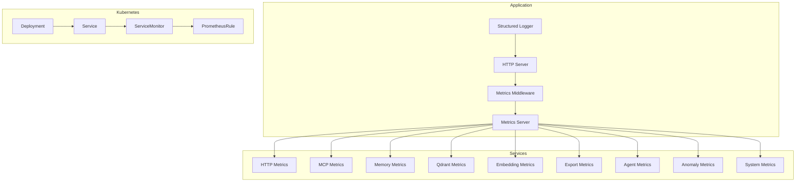
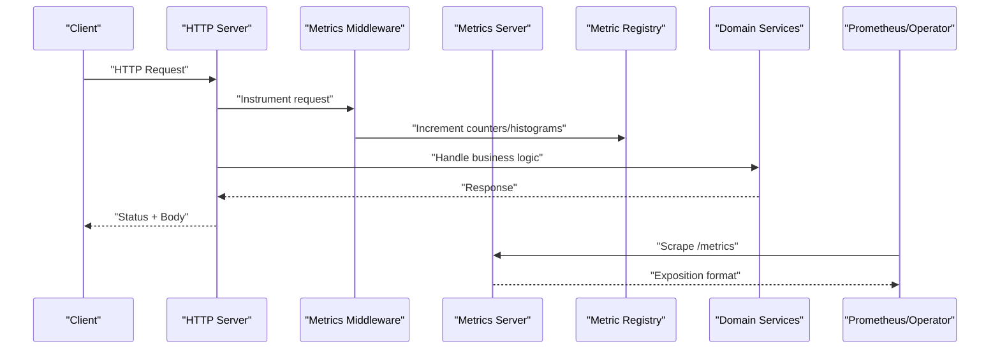
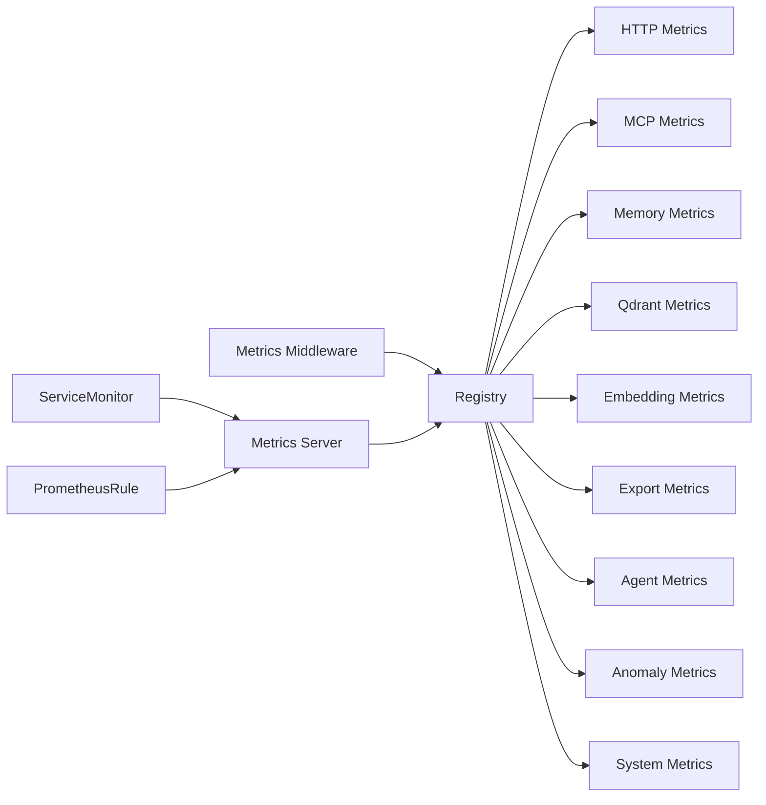

# Monitoring and Observability

<cite>
**Referenced Files in This Document**
- [metrics-server.ts](file://src/metrics-server.ts)
- [http-metrics-middleware.ts](file://src/http/http-metrics-middleware.ts)
- [registry.ts](file://src/services/metrics/registry.ts)
- [agent-metrics.ts](file://src/services/metrics/agent-metrics.ts)
- [anomaly-metrics.ts](file://src/services/metrics/anomaly-metrics.ts)
- [embedding-metrics.ts](file://src/services/metrics/embedding-metrics.ts)
- [export-metrics.ts](file://src/services/metrics/export-metrics.ts)
- [http-metrics.ts](file://src/services/metrics/http-metrics.ts)
- [mcp-metrics.ts](file://src/services/metrics/mcp-metrics.ts)
- [memory-metrics.ts](file://src/services/metrics/memory-metrics.ts)
- [qdrant-metrics.ts](file://src/services/metrics/qdrant-metrics.ts)
- [system-metrics.ts](file://src/services/metrics/system-metrics.ts)
- [http-health-routes.ts](file://src/http/http-health-routes.ts)
- [structured-logger.ts](file://src/utils/structured-logger.ts)
- [log-core.ts](file://src/utils/log-core.ts)
- [prometheusrule.yaml](file://helm/kairos-mcp/templates/prometheusrule.yaml)
- [app-servicemonitor.yaml](file://helm/kairos-mcp/templates/app-servicemonitor.yaml)
- [kairos-mcp-deployment.yaml](file://helm/kairos-mcp/templates/kairos-mcp-deployment.yaml)
- [kairos-mcp-service.yaml](file://helm/kairos-mcp/templates/kairos-mcp-service.yaml)
- [values.yaml](file://helm/kairos-mcp/values.yaml)
- [logging.md](file://docs/architecture/logging.md)
- [incident-runbook.md](file://docs/security/incident-runbook.md)
- [metrics-endpoint.test.ts](file://tests/integration/metrics-endpoint.test.ts)
- [prometheus-scrape.test.ts](file://tests/integration/prometheus-scrape.test.ts)
- [metrics-operational.test.ts](file://tests/integration/metrics-operational.test.ts)
</cite>

## Table of Contents
1. [Introduction](#introduction)
2. [Project Structure](#project-structure)
3. [Core Components](#core-components)
4. [Architecture Overview](#architecture-overview)
5. [Detailed Component Analysis](#detailed-component-analysis)
6. [Dependency Analysis](#dependency-analysis)
7. [Performance Considerations](#performance-considerations)
8. [Troubleshooting Guide](#troubleshooting-guide)
9. [Conclusion](#conclusion)
10. [Appendices](#appendices)

## Introduction
This document provides comprehensive monitoring and observability guidance for Kairos MCP. It covers Prometheus metrics collection, custom metric definitions, alerting rules configuration, structured logging setup, log aggregation strategies, health check endpoints, readiness/liveness probes, operational dashboards, tracing implementation, performance profiling tools, debugging techniques, best practices, and incident response procedures. The content is grounded in the repository’s source code and Helm templates to ensure accuracy and actionability.

## Project Structure
Kairos MCP exposes a dedicated metrics server and HTTP middleware for request-level metrics. Custom metrics are organized by domain (HTTP, MCP, memory, Qdrant, embedding, export, agent, anomaly, system). Health checks are exposed via HTTP routes. Structured logging utilities centralize log formatting and context enrichment. Kubernetes deployment includes ServiceMonitor and PrometheusRule resources for scraping and alerting.

**Diagram sources**
- [metrics-server.ts](file://src/metrics-server.ts)
- [http-metrics-middleware.ts](file://src/http/http-metrics-middleware.ts)
- [registry.ts](file://src/services/metrics/registry.ts)
- [http-metrics.ts](file://src/services/metrics/http-metrics.ts)
- [mcp-metrics.ts](file://src/services/metrics/mcp-metrics.ts)
- [memory-metrics.ts](file://src/services/metrics/memory-metrics.ts)
- [qdrant-metrics.ts](file://src/services/metrics/qdrant-metrics.ts)
- [embedding-metrics.ts](file://src/services/metrics/embedding-metrics.ts)
- [export-metrics.ts](file://src/services/metrics/export-metrics.ts)
- [agent-metrics.ts](file://src/services/metrics/agent-metrics.ts)
- [anomaly-metrics.ts](file://src/services/metrics/anomaly-metrics.ts)
- [system-metrics.ts](file://src/services/metrics/system-metrics.ts)
- [app-servicemonitor.yaml](file://helm/kairos-mcp/templates/app-servicemonitor.yaml)
- [prometheusrule.yaml](file://helm/kairos-mcp/templates/prometheusrule.yaml)
- [kairos-mcp-deployment.yaml](file://helm/kairos-mcp/templates/kairos-mcp-deployment.yaml)
- [kairos-mcp-service.yaml](file://helm/kairos-mcp/templates/kairos-mcp-service.yaml)

**Section sources**
- [metrics-server.ts](file://src/metrics-server.ts)
- [http-metrics-middleware.ts](file://src/http/http-metrics-middleware.ts)
- [registry.ts](file://src/services/metrics/registry.ts)
- [app-servicemonitor.yaml](file://helm/kairos-mcp/templates/app-servicemonitor.yaml)
- [prometheusrule.yaml](file://helm/kairos-mcp/templates/prometheusrule.yaml)
- [kairos-mcp-deployment.yaml](file://helm/kairos-mcp/templates/kairos-mcp-deployment.yaml)
- [kairos-mcp-service.yaml](file://helm/kairos-mcp/templates/kairos-mcp-service.yaml)

## Core Components
- Metrics Server: Exposes a separate endpoint for Prometheus scraping and aggregates all registered metrics.
- HTTP Metrics Middleware: Instruments incoming HTTP requests with counters, histograms, and labels such as method, path, and status.
- Metric Registries: Domain-specific modules register counters, gauges, and histograms under a shared registry.
- Health Check Routes: Provide liveness/readiness semantics for orchestration probes.
- Structured Logging: Centralized logger with contextual fields and consistent formats for aggregation.
- Kubernetes Integration: ServiceMonitor for scraping and PrometheusRule for alerting; Deployment defines probes and ports.

Key responsibilities:
- Collect and expose metrics at a stable endpoint.
- Instrument application paths with meaningful labels.
- Provide health endpoints for orchestrators.
- Emit structured logs for traceability and analysis.
- Configure alerts and scraping declaratively via Helm.

**Section sources**
- [metrics-server.ts](file://src/metrics-server.ts)
- [http-metrics-middleware.ts](file://src/http/http-metrics-middleware.ts)
- [registry.ts](file://src/services/metrics/registry.ts)
- [http-health-routes.ts](file://src/http/http-health-routes.ts)
- [structured-logger.ts](file://src/utils/structured-logger.ts)
- [log-core.ts](file://src/utils/log-core.ts)
- [app-servicemonitor.yaml](file://helm/kairos-mcp/templates/app-servicemonitor.yaml)
- [prometheusrule.yaml](file://helm/kairos-mcp/templates/prometheusrule.yaml)
- [kairos-mcp-deployment.yaml](file://helm/kairos-mcp/templates/kairos-mcp-deployment.yaml)
- [kairos-mcp-service.yaml](file://helm/kairos-mcp/templates/kairos-mcp-service.yaml)

## Architecture Overview
The observability architecture integrates application instrumentation with Kubernetes-native components:

**Diagram sources**
- [http-metrics-middleware.ts](file://src/http/http-metrics-middleware.ts)
- [metrics-server.ts](file://src/metrics-server.ts)
- [registry.ts](file://src/services/metrics/registry.ts)
- [app-servicemonitor.yaml](file://helm/kairos-mcp/templates/app-servicemonitor.yaml)

## Detailed Component Analysis

### Prometheus Metrics Collection
- Metrics Server: Hosts the scrape endpoint and serves exposition data.
- HTTP Middleware: Adds request-level metrics including method, path, and status codes.
- Domain Metrics: Separate modules define application-specific metrics for HTTP, MCP, memory, Qdrant, embedding, export, agent, anomaly, and system.

Operational notes:
- Ensure the metrics port is open and reachable by Prometheus.
- Use consistent label cardinality to avoid high-cardinality issues.
- Prefer histograms for latency distributions and counters for event totals.

**Section sources**
- [metrics-server.ts](file://src/metrics-server.ts)
- [http-metrics-middleware.ts](file://src/http/http-metrics-middleware.ts)
- [http-metrics.ts](file://src/services/metrics/http-metrics.ts)
- [mcp-metrics.ts](file://src/services/metrics/mcp-metrics.ts)
- [memory-metrics.ts](file://src/services/metrics/memory-metrics.ts)
- [qdrant-metrics.ts](file://src/services/metrics/qdrant-metrics.ts)
- [embedding-metrics.ts](file://src/services/metrics/embedding-metrics.ts)
- [export-metrics.ts](file://src/services/metrics/export-metrics.ts)
- [agent-metrics.ts](file://src/services/metrics/agent-metrics.ts)
- [anomaly-metrics.ts](file://src/services/metrics/anomaly-metrics.ts)
- [system-metrics.ts](file://src/services/metrics/system-metrics.ts)

### Custom Metric Definitions
Custom metrics are grouped by domain:
- HTTP metrics: request counts, latencies, error rates.
- MCP metrics: tool invocations, success/failure, payload sizes.
- Memory metrics: store operations, cache hits/misses.
- Qdrant metrics: vector operations, search latency, errors.
- Embedding metrics: provider calls, token usage, failures.
- Export metrics: export jobs, artifacts, durations.
- Agent metrics: workflow steps, rewards, evaluations.
- Anomaly metrics: detection events, thresholds.
- System metrics: process and runtime stats.

Guidelines:
- Keep label sets small and bounded.
- Use descriptive names and units.
- Avoid exposing sensitive data in labels.

**Section sources**
- [http-metrics.ts](file://src/services/metrics/http-metrics.ts)
- [mcp-metrics.ts](file://src/services/metrics/mcp-metrics.ts)
- [memory-metrics.ts](file://src/services/metrics/memory-metrics.ts)
- [qdrant-metrics.ts](file://src/services/metrics/qdrant-metrics.ts)
- [embedding-metrics.ts](file://src/services/metrics/embedding-metrics.ts)
- [export-metrics.ts](file://src/services/metrics/export-metrics.ts)
- [agent-metrics.ts](file://src/services/metrics/agent-metrics.ts)
- [anomaly-metrics.ts](file://src/services/metrics/anomaly-metrics.ts)
- [system-metrics.ts](file://src/services/metrics/system-metrics.ts)

### Alerting Rules Configuration
Alerting rules are defined in Helm templates and applied via PrometheusRule resources. Typical categories include:
- High error rate on HTTP endpoints.
- Elevated p95/p99 latency.
- MCP tool invocation failures.
- Qdrant connectivity or query latency anomalies.
- Embedding provider errors or timeouts.
- Export job failures or long-running jobs.
- Resource saturation indicators (CPU, memory, disk).

Configuration tips:
- Use SLO-based thresholds where possible.
- Group related alerts into silences during maintenance.
- Include runbook links in annotations.

**Section sources**
- [prometheusrule.yaml](file://helm/kairos-mcp/templates/prometheusrule.yaml)

### Health Check Endpoints and Probes
Health endpoints provide liveness and readiness signals for orchestration:
- Liveness: indicates if the process is alive.
- Readiness: indicates if the service can accept traffic (dependencies healthy).
- Startup: optional probe for slow initialization.

Kubernetes integration:
- Deployment defines probe endpoints and ports.
- Service exposes the metrics and application ports.
- ServiceMonitor configures scraping targets.

Best practices:
- Make readiness checks fast and idempotent.
- Fail fast on missing dependencies (e.g., Qdrant, Redis).
- Return distinct statuses for different failure modes.

**Section sources**
- [http-health-routes.ts](file://src/http/http-health-routes.ts)
- [kairos-mcp-deployment.yaml](file://helm/kairos-mcp/templates/kairos-mcp-deployment.yaml)
- [kairos-mcp-service.yaml](file://helm/kairos-mcp/templates/kairos-mcp-service.yaml)
- [app-servicemonitor.yaml](file://helm/kairos-mcp/templates/app-servicemonitor.yaml)

### Structured Logging Setup
Structured logging centralizes log formatting and context:
- Consistent JSON-like structure with fields like timestamp, level, message, and correlation IDs.
- Context enrichment for tenant, user, request ID, and operation.
- Configurable log levels and sampling for high-throughput environments.

Aggregation strategies:
- Ship container stdout/stderr to centralized logging (e.g., Loki, Elasticsearch).
- Use Kubernetes annotations to configure sidecars or DaemonSets.
- Apply retention policies and indexing strategies based on volume.

Analysis patterns:
- Filter by request ID across services.
- Correlate logs with metrics using shared identifiers.
- Build dashboards for error rates and slow paths.

**Section sources**
- [structured-logger.ts](file://src/utils/structured-logger.ts)
- [log-core.ts](file://src/utils/log-core.ts)
- [logging.md](file://docs/architecture/logging.md)

### Tracing Implementation
Tracing complements metrics and logs:
- Propagate trace IDs through HTTP headers and internal calls.
- Attach trace IDs to structured logs for cross-cutting visibility.
- Integrate with distributed tracing backends (e.g., Jaeger, Tempo).

Recommendations:
- Sample traces adaptively based on latency and error rates.
- Limit span size and avoid sensitive data in attributes.
- Use spans to measure critical paths (e.g., MCP tool execution, Qdrant queries).

[No sources needed since this section provides general guidance]

### Performance Profiling Tools
Profiling aids in identifying bottlenecks:
- CPU profiling: capture profiles during load tests or incidents.
- Heap profiling: detect memory leaks and high allocations.
- Event loop lag: monitor Node.js event loop delays.

Integration:
- Enable profiling endpoints or CLI flags in development/staging.
- Export profiles to external tools for analysis.
- Combine with metrics to correlate performance regressions.

[No sources needed since this section provides general guidance]

### Debugging Techniques
Effective debugging combines multiple signals:
- Use request IDs to correlate logs and traces.
- Inspect metrics for anomalies before diving into logs.
- Reproduce issues with minimal payloads and controlled concurrency.
- Validate health endpoints and dependency states.

Runbooks:
- Follow documented incident procedures for escalation and remediation.
- Capture relevant metrics snapshots and logs for postmortems.

**Section sources**
- [incident-runbook.md](file://docs/security/incident-runbook.md)

## Dependency Analysis
Observability components depend on each other and on infrastructure:

**Diagram sources**
- [registry.ts](file://src/services/metrics/registry.ts)
- [http-metrics-middleware.ts](file://src/http/http-metrics-middleware.ts)
- [metrics-server.ts](file://src/metrics-server.ts)
- [app-servicemonitor.yaml](file://helm/kairos-mcp/templates/app-servicemonitor.yaml)
- [prometheusrule.yaml](file://helm/kairos-mcp/templates/prometheusrule.yaml)

**Section sources**
- [registry.ts](file://src/services/metrics/registry.ts)
- [http-metrics-middleware.ts](file://src/http/http-metrics-middleware.ts)
- [metrics-server.ts](file://src/metrics-server.ts)
- [app-servicemonitor.yaml](file://helm/kairos-mcp/templates/app-servicemonitor.yaml)
- [prometheusrule.yaml](file://helm/kairos-mcp/templates/prometheusrule.yaml)

## Performance Considerations
- Label cardinality: Avoid unbounded labels (e.g., user IDs) to prevent Prometheus memory growth.
- Histogram buckets: Tune buckets for expected latency ranges.
- Sampling: Adjust log and trace sampling rates for high-volume workloads.
- Health checks: Keep them lightweight and fast to avoid false negatives.
- Scrape intervals: Balance freshness with overhead; typical intervals are 15–30 seconds.

[No sources needed since this section provides general guidance]

## Troubleshooting Guide
Common issues and resolutions:
- Missing metrics: Verify metrics server port exposure and ServiceMonitor configuration.
- High cardinality: Audit labels and remove sensitive or unique identifiers.
- Slow readiness: Investigate dependency startup times and implement graceful degradation.
- Log gaps: Ensure log shipping is configured and storage is available.
- Alert fatigue: Refine thresholds and group related alerts.

Validation:
- Use integration tests to verify metrics exposure and Prometheus scraping behavior.

**Section sources**
- [metrics-endpoint.test.ts](file://tests/integration/metrics-endpoint.test.ts)
- [prometheus-scrape.test.ts](file://tests/integration/prometheus-scrape.test.ts)
- [metrics-operational.test.ts](file://tests/integration/metrics-operational.test.ts)

## Conclusion
Kairos MCP provides robust observability through a dedicated metrics server, domain-specific metric modules, structured logging, and Kubernetes-native integration. By following the recommended practices for metrics design, alerting, logging, tracing, and profiling, operators can achieve reliable monitoring, faster incident response, and continuous performance optimization.

[No sources needed since this section summarizes without analyzing specific files]

## Appendices

### Operational Dashboards
- HTTP overview: request rate, error rate, latency percentiles.
- MCP operations: tool call success/failure, payload sizes, durations.
- Memory and Qdrant: store operations, search latency, errors.
- Embedding pipeline: provider calls, token usage, failures.
- Export jobs: throughput, duration, failures.
- System: CPU, memory, GC, event loop lag.

[No sources needed since this section provides general guidance]

### Best Practices
- Define SLOs and derive alerts from them.
- Standardize naming conventions and labels.
- Enforce least privilege for metrics and logs.
- Regularly review and prune unused metrics and alerts.
- Maintain up-to-date runbooks and contact information.

[No sources needed since this section provides general guidance]