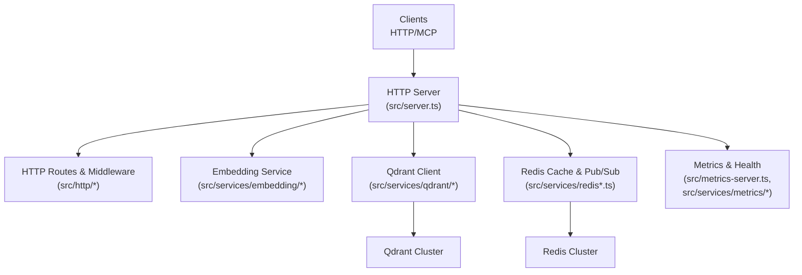
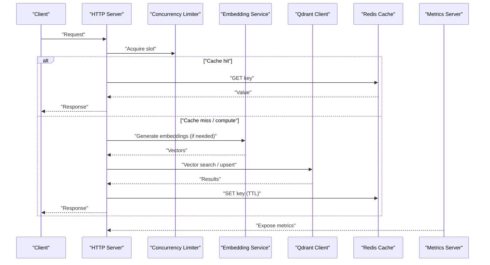
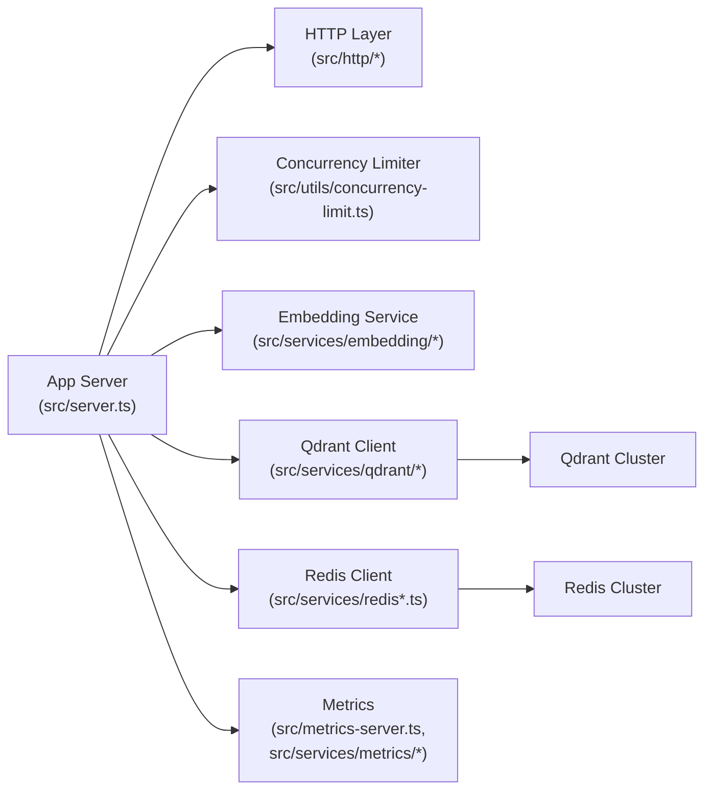

# Performance Tuning

<cite>
**Referenced Files in This Document**
- [src/config.ts](file://src/config.ts)
- [src/server.ts](file://src/server.ts)
- [src/metrics-server.ts](file://src/metrics-server.ts)
- [src/utils/concurrency-limit.ts](file://src/utils/concurrency-limit.ts)
- [src/services/redis-cache.ts](file://src/services/redis-cache.ts)
- [src/services/redis.ts](file://src/services/redis.ts)
- [src/services/embedding/service.ts](file://src/services/embedding/service.ts)
- [src/services/embedding/config.ts](file://src/services/embedding/config.ts)
- [src/services/qdrant/connection.ts](file://src/services/qdrant/connection.ts)
- [src/services/qdrant/search.ts](file://src/services/qdrant/search.ts)
- [src/services/qdrant/memory-retrieval.ts](file://src/services/qdrant/memory-retrieval.ts)
- [src/http/http-server-config.ts](file://src/http/http-server-config.ts)
- [src/http/http-metrics-middleware.ts](file://src/http/http-metrics-middleware.ts)
- [src/services/metrics/registry.ts](file://src/services/metrics/registry.ts)
- [src/services/metrics/system-metrics.ts](file://src/services/metrics/system-metrics.ts)
- [helm/kairos-mcp/templates/app-hpa.yaml](file://helm/kairos-mcp/templates/app-hpa.yaml)
- [helm/kairos-mcp/templates/app-vpa.yaml](file://helm/kairos-mcp/templates/app-vpa.yaml)
- [helm/kairos-mcp/values.yaml](file://helm/kairos-mcp/values.yaml)
- [tests/load/mcp-concurrency-limit.test.ts](file://tests/load/mcp-concurrency-limit.test.ts)
</cite>

## Table of Contents
1. [Introduction](#introduction)
2. [Project Structure](#project-structure)
3. [Core Components](#core-components)
4. [Architecture Overview](#architecture-overview)
5. [Detailed Component Analysis](#detailed-component-analysis)
6. [Dependency Analysis](#dependency-analysis)
7. [Performance Considerations](#performance-considerations)
8. [Troubleshooting Guide](#troubleshooting-guide)
9. [Conclusion](#conclusion)
10. [Appendices](#appendices)

## Introduction
This document provides performance tuning guidance for Kairos MCP with a focus on resource allocation, memory management, CPU optimization, embedding service configuration, vector search and database query tuning, caching strategies, connection pooling, concurrency limits, load testing procedures, bottleneck identification, capacity planning, and production monitoring/profiling. It maps recommendations to concrete implementation points in the codebase and Helm charts to help operators achieve predictable latency and throughput under varying loads.

## Project Structure
Kairos MCP exposes HTTP and MCP interfaces backed by Redis (caching/pub-sub), Qdrant (vector store), and Postgres (relational data). The application is containerized and deployed via Helm, with autoscaling and metrics exposed for observability.

**Diagram sources**
- [src/server.ts](file://src/server.ts)
- [src/http/http-server-config.ts](file://src/http/http-server-config.ts)
- [src/services/embedding/service.ts](file://src/services/embedding/service.ts)
- [src/services/qdrant/connection.ts](file://src/services/qdrant/connection.ts)
- [src/services/redis.ts](file://src/services/redis.ts)
- [src/metrics-server.ts](file://src/metrics-server.ts)

**Section sources**
- [src/server.ts](file://src/server.ts)
- [src/http/http-server-config.ts](file://src/http/http-server-config.ts)
- [src/metrics-server.ts](file://src/metrics-server.ts)

## Core Components
- Concurrency control: A shared concurrency limiter caps parallel work across request handling and background tasks.
- Caching layer: Redis-backed cache and pub/sub integration provide low-latency reads and cross-process invalidation.
- Vector retrieval: Qdrant client manages connections and executes similarity searches with configurable parameters.
- Embedding service: Configurable providers and rate limiting to protect downstream embedding endpoints.
- Metrics and health: Dedicated metrics server and middleware expose Prometheus-compatible metrics and health checks.

Key implementation references:
- Concurrency limiter: [src/utils/concurrency-limit.ts](file://src/utils/concurrency-limit.ts)
- Redis cache and client: [src/services/redis-cache.ts](file://src/services/redis-cache.ts), [src/services/redis.ts](file://src/services/redis.ts)
- Qdrant connection and search: [src/services/qdrant/connection.ts](file://src/services/qdrant/connection.ts), [src/services/qdrant/search.ts](file://src/services/qdrant/search.ts), [src/services/qdrant/memory-retrieval.ts](file://src/services/qdrant/memory-retrieval.ts)
- Embedding service and config: [src/services/embedding/service.ts](file://src/services/embedding/service.ts), [src/services/embedding/config.ts](file://src/services/embedding/config.ts)
- HTTP server and metrics: [src/server.ts](file://src/server.ts), [src/http/http-server-config.ts](file://src/http/http-server-config.ts), [src/http/http-metrics-middleware.ts](file://src/http/http-metrics-middleware.ts), [src/metrics-server.ts](file://src/metrics-server.ts)

**Section sources**
- [src/utils/concurrency-limit.ts](file://src/utils/concurrency-limit.ts)
- [src/services/redis-cache.ts](file://src/services/redis-cache.ts)
- [src/services/redis.ts](file://src/services/redis.ts)
- [src/services/qdrant/connection.ts](file://src/services/qdrant/connection.ts)
- [src/services/qdrant/search.ts](file://src/services/qdrant/search.ts)
- [src/services/qdrant/memory-retrieval.ts](file://src/services/qdrant/memory-retrieval.ts)
- [src/services/embedding/service.ts](file://src/services/embedding/service.ts)
- [src/services/embedding/config.ts](file://src/services/embedding/config.ts)
- [src/server.ts](file://src/server.ts)
- [src/http/http-server-config.ts](file://src/http/http-server-config.ts)
- [src/http/http-metrics-middleware.ts](file://src/http/http-metrics-middleware.ts)
- [src/metrics-server.ts](file://src/metrics-server.ts)

## Architecture Overview
The runtime architecture centers around an HTTP server that routes requests into domain handlers. These handlers coordinate with Redis for caching and Qdrant for vector search, while the embedding service prepares vectors for indexing or enrichment. A separate metrics server exposes operational signals for autoscaling and alerting.

**Diagram sources**
- [src/server.ts](file://src/server.ts)
- [src/utils/concurrency-limit.ts](file://src/utils/concurrency-limit.ts)
- [src/services/embedding/service.ts](file://src/services/embedding/service.ts)
- [src/services/qdrant/search.ts](file://src/services/qdrant/search.ts)
- [src/services/redis-cache.ts](file://src/services/redis-cache.ts)
- [src/metrics-server.ts](file://src/metrics-server.ts)

## Detailed Component Analysis

### Resource Allocation Guidelines
- CPU and memory sizing
  - Start with 2–4 vCPU and 4–8 GiB RAM for moderate workloads; scale horizontally using HPA when CPU utilization exceeds target thresholds.
  - Tune Node.js heap if you observe frequent GC pauses or OOM kills; consider increasing max-old-space-size only after profiling indicates it helps.
- Container resources
  - Set requests and limits in Helm values to ensure stable scheduling and prevent noisy neighbor effects.
  - Use Vertical Pod Autoscaler (VPA) recommendations during ramp-up to right-size requests/limits.
- Horizontal scaling
  - Configure HPA based on CPU and custom metrics (e.g., request latency or queue depth) to maintain SLOs.

Helm autoscaling and VPA templates:
- [helm/kairos-mcp/templates/app-hpa.yaml](file://helm/kairos-mcp/templates/app-hpa.yaml)
- [helm/kairos-mcp/templates/app-vpa.yaml](file://helm/kairos-mcp/templates/app-vpa.yaml)
- Application values: [helm/kairos-mcp/values.yaml](file://helm/kairos-mcp/values.yaml)

**Section sources**
- [helm/kairos-mcp/templates/app-hpa.yaml](file://helm/kairos-mcp/templates/app-hpa.yaml)
- [helm/kairos-mcp/templates/app-vpa.yaml](file://helm/kairos-mcp/templates/app-vpa.yaml)
- [helm/kairos-mcp/values.yaml](file://helm/kairos-mcp/values.yaml)

### Memory Management
- Avoid large object retention in hot paths; prefer streaming and pagination where applicable.
- Keep cache entries small and bounded; set appropriate TTLs to prevent unbounded growth.
- Monitor RSS and heap usage; correlate spikes with specific operations (e.g., bulk training or large exports).
- Use process-level metrics to detect leaks and tune GC behavior.

Relevant files:
- Metrics registry and system metrics: [src/services/metrics/registry.ts](file://src/services/metrics/registry.ts), [src/services/metrics/system-metrics.ts](file://src/services/metrics/system-metrics.ts)

**Section sources**
- [src/services/metrics/registry.ts](file://src/services/metrics/registry.ts)
- [src/services/metrics/system-metrics.ts](file://src/services/metrics/system-metrics.ts)

### CPU Optimization Strategies
- Enforce concurrency limits to avoid CPU saturation and reduce context switching overhead.
- Prefer batched operations (e.g., bulk upserts) over many small writes.
- Minimize synchronous blocking calls; offload heavy work to background jobs if available.
- Profile hot paths using CPU profiles and flame graphs to identify bottlenecks.

Concurrency limiter:
- [src/utils/concurrency-limit.ts](file://src/utils/concurrency-limit.ts)

**Section sources**
- [src/utils/concurrency-limit.ts](file://src/utils/concurrency-limit.ts)

### Embedding Service Configuration
- Provider selection and credentials
  - Configure provider-specific settings such as model name, base URL, and API keys.
- Rate limiting and retries
  - Enable backoff and retry policies to smooth bursts and protect downstream services.
- Batch size and timeout tuning
  - Increase batch sizes cautiously; monitor latency and error rates.
- Health checks
  - Ensure embedding readiness probes are configured to fail fast on degraded providers.

References:
- [src/services/embedding/service.ts](file://src/services/embedding/service.ts)
- [src/services/embedding/config.ts](file://src/services/embedding/config.ts)

**Section sources**
- [src/services/embedding/service.ts](file://src/services/embedding/service.ts)
- [src/services/embedding/config.ts](file://src/services/embedding/config.ts)

### Vector Search Optimization (Qdrant)
- Connection pooling
  - Reuse HTTP clients and configure timeouts to reduce handshake overhead.
- Query shaping
  - Limit returned vectors and use filters to reduce payload size.
- Index tuning
  - Choose appropriate distance metric and vector dimensions; pre-warm collections at startup.
- Throughput vs latency trade-offs
  - Adjust top-k and score thresholds to balance recall and response time.

References:
- [src/services/qdrant/connection.ts](file://src/services/qdrant/connection.ts)
- [src/services/qdrant/search.ts](file://src/services/qdrant/search.ts)
- [src/services/qdrant/memory-retrieval.ts](file://src/services/qdrant/memory-retrieval.ts)

**Section sources**
- [src/services/qdrant/connection.ts](file://src/services/qdrant/connection.ts)
- [src/services/qdrant/search.ts](file://src/services/qdrant/search.ts)
- [src/services/qdrant/memory-retrieval.ts](file://src/services/qdrant/memory-retrieval.ts)

### Database Query Tuning (Postgres)
- Indexing strategy
  - Add indexes on frequently filtered columns; avoid over-indexing write-heavy tables.
- Query patterns
  - Prefer selective predicates, limit result sets, and avoid N+1 queries.
- Connection pool sizing
  - Size pools according to DB capacity and concurrent consumers; monitor wait times.
- Read replicas
  - Offload read-heavy workloads to replicas when possible.

Note: While relational storage is part of the stack, this section focuses on general best practices aligned with typical deployments.

[No sources needed since this section provides general guidance]

### Caching Strategies
- Cache design
  - Use short-lived, high-hit-rate keys for expensive computations (e.g., embeddings or search results).
- Invalidation
  - Leverage Redis pub/sub to invalidate caches across processes on updates.
- Backpressure
  - Apply cache misses throttling to prevent thundering herds.

References:
- [src/services/redis-cache.ts](file://src/services/redis-cache.ts)
- [src/services/redis.ts](file://src/services/redis.ts)

**Section sources**
- [src/services/redis-cache.ts](file://src/services/redis-cache.ts)
- [src/services/redis.ts](file://src/services/redis.ts)

### Connection Pooling
- Redis
  - Tune pool size and idle timeouts to match expected concurrency and network conditions.
- Qdrant
  - Configure keep-alive and max connections per host to avoid socket exhaustion.
- External APIs
  - Apply per-service pools and timeouts to isolate failures.

References:
- [src/services/redis.ts](file://src/services/redis.ts)
- [src/services/qdrant/connection.ts](file://src/services/qdrant/connection.ts)

**Section sources**
- [src/services/redis.ts](file://src/services/redis.ts)
- [src/services/qdrant/connection.ts](file://src/services/qdrant/connection.ts)

### Concurrency Limits
- Global limiter
  - Cap total concurrent operations to protect CPU and downstream systems.
- Per-endpoint limits
  - Apply stricter limits on expensive endpoints (e.g., train/export).
- Queueing and backpressure
  - Return appropriate errors or delays when limits are reached; surface metrics for alerting.

References:
- [src/utils/concurrency-limit.ts](file://src/utils/concurrency-limit.ts)
- Load test harness: [tests/load/mcp-concurrency-limit.test.ts](file://tests/load/mcp-concurrency-limit.test.ts)

**Section sources**
- [src/utils/concurrency-limit.ts](file://src/utils/concurrency-limit.ts)
- [tests/load/mcp-concurrency-limit.test.ts](file://tests/load/mcp-concurrency-limit.test.ts)

### Load Testing Procedures
- Objectives
  - Validate latency percentiles, error rates, and resource utilization under sustained and peak loads.
- Tools
  - Use k6, wrk, or similar tools to generate realistic traffic patterns.
- Scenarios
  - Steady-state throughput, bursty spikes, mixed read/write, and cache miss storms.
- Metrics
  - Track P50/P95/P99 latency, throughput, error rates, CPU/RAM, and dependency latencies.
- Iteration
  - Adjust concurrency limits, pool sizes, and HPA targets based on observed behavior.

Reference:
- [tests/load/mcp-concurrency-limit.test.ts](file://tests/load/mcp-concurrency-limit.test.ts)

**Section sources**
- [tests/load/mcp-concurrency-limit.test.ts](file://tests/load/mcp-concurrency-limit.test.ts)

### Bottleneck Identification
- Symptoms
  - Rising latency, increased error rates, CPU throttling, memory pressure, or dependency timeouts.
- Techniques
  - Correlate application metrics with infrastructure metrics; profile CPU and memory; trace slow dependencies.
- Focus areas
  - Embedding provider latency, Qdrant search cost, Redis round-trips, and request serialization.

References:
- Metrics server and middleware: [src/metrics-server.ts](file://src/metrics-server.ts), [src/http/http-metrics-middleware.ts](file://src/http/http-metrics-middleware.ts)
- System metrics: [src/services/metrics/system-metrics.ts](file://src/services/metrics/system-metrics.ts)

**Section sources**
- [src/metrics-server.ts](file://src/metrics-server.ts)
- [src/http/http-metrics-middleware.ts](file://src/http/http-metrics-middleware.ts)
- [src/services/metrics/system-metrics.ts](file://src/services/metrics/system-metrics.ts)

### Capacity Planning Guidelines
- Right-sizing
  - Use VPA recommendations and historical utilization to set requests/limits.
- Scaling policy
  - Configure HPA with conservative CPU targets and add custom metrics for demand-driven scaling.
- Dependency capacity
  - Ensure Redis and Qdrant clusters have headroom for peak loads; plan sharding/partitioning accordingly.
- Cost-performance trade-offs
  - Balance instance types and counts against SLAs and budget constraints.

References:
- [helm/kairos-mcp/templates/app-hpa.yaml](file://helm/kairos-mcp/templates/app-hpa.yaml)
- [helm/kairos-mcp/templates/app-vpa.yaml](file://helm/kairos-mcp/templates/app-vpa.yaml)
- [helm/kairos-mcp/values.yaml](file://helm/kairos-mcp/values.yaml)

**Section sources**
- [helm/kairos-mcp/templates/app-hpa.yaml](file://helm/kairos-mcp/templates/app-hpa.yaml)
- [helm/kairos-mcp/templates/app-vpa.yaml](file://helm/kairos-mcp/templates/app-vpa.yaml)
- [helm/kairos-mcp/values.yaml](file://helm/kairos-mcp/values.yaml)

### Performance Monitoring and Profiling
- Metrics exposure
  - Expose Prometheus-compatible metrics from the metrics server and HTTP middleware.
- Health checks
  - Implement liveness/readiness probes tied to dependency health.
- Profiling
  - Capture CPU and heap profiles during incidents; analyze with pprof or equivalent tools.
- Alerting
  - Define alerts for latency SLO breaches, error rate spikes, and resource saturation.

References:
- [src/metrics-server.ts](file://src/metrics-server.ts)
- [src/http/http-metrics-middleware.ts](file://src/http/http-metrics-middleware.ts)
- [src/services/metrics/registry.ts](file://src/services/metrics/registry.ts)
- [src/services/metrics/system-metrics.ts](file://src/services/metrics/system-metrics.ts)

**Section sources**
- [src/metrics-server.ts](file://src/metrics-server.ts)
- [src/http/http-metrics-middleware.ts](file://src/http/http-metrics-middleware.ts)
- [src/services/metrics/registry.ts](file://src/services/metrics/registry.ts)
- [src/services/metrics/system-metrics.ts](file://src/services/metrics/system-metrics.ts)

## Dependency Analysis
The following diagram shows how core components depend on each other and external services.

**Diagram sources**
- [src/server.ts](file://src/server.ts)
- [src/utils/concurrency-limit.ts](file://src/utils/concurrency-limit.ts)
- [src/services/embedding/service.ts](file://src/services/embedding/service.ts)
- [src/services/qdrant/connection.ts](file://src/services/qdrant/connection.ts)
- [src/services/redis.ts](file://src/services/redis.ts)
- [src/metrics-server.ts](file://src/metrics-server.ts)

**Section sources**
- [src/server.ts](file://src/server.ts)
- [src/utils/concurrency-limit.ts](file://src/utils/concurrency-limit.ts)
- [src/services/embedding/service.ts](file://src/services/embedding/service.ts)
- [src/services/qdrant/connection.ts](file://src/services/qdrant/connection.ts)
- [src/services/redis.ts](file://src/services/redis.ts)
- [src/metrics-server.ts](file://src/metrics-server.ts)

## Performance Considerations
- Prefer horizontal scaling with well-tuned HPA targets and robust readiness/liveness checks.
- Use caching aggressively but with bounded TTLs and invalidation via pub/sub.
- Tune concurrency limits per workload type to avoid tail latency spikes.
- Monitor and cap embedding provider usage with retries/backoff and circuit breakers.
- Optimize Qdrant queries by filtering early and limiting payloads.
- Regularly review metrics and profiles to adjust resource requests/limits and pool sizes.

[No sources needed since this section provides general guidance]

## Troubleshooting Guide
- High latency
  - Check embedding provider latency and Qdrant search duration; verify cache hit ratios.
- Errors and timeouts
  - Inspect dependency health endpoints; validate connection pool exhaustion and retry policies.
- Memory pressure
  - Review heap snapshots and GC stats; look for growing caches or large responses.
- CPU throttling
  - Reduce concurrency limits; investigate hot paths with CPU profiles.

Operational references:
- Metrics server and middleware: [src/metrics-server.ts](file://src/metrics-server.ts), [src/http/http-metrics-middleware.ts](file://src/http/http-metrics-middleware.ts)
- System metrics: [src/services/metrics/system-metrics.ts](file://src/services/metrics/system-metrics.ts)

**Section sources**
- [src/metrics-server.ts](file://src/metrics-server.ts)
- [src/http/http-metrics-middleware.ts](file://src/http/http-metrics-middleware.ts)
- [src/services/metrics/system-metrics.ts](file://src/services/metrics/system-metrics.ts)

## Conclusion
Effective performance tuning for Kairos MCP hinges on balanced resource allocation, disciplined caching, careful concurrency control, and proactive monitoring. By aligning application configuration with infrastructure autoscaling and continuously validating with load tests, teams can meet latency and throughput targets while maintaining stability under variable workloads.

[No sources needed since this section summarizes without analyzing specific files]

## Appendices

### Key Configuration Touchpoints
- Application configuration entry: [src/config.ts](file://src/config.ts)
- HTTP server configuration: [src/http/http-server-config.ts](file://src/http/http-server-config.ts)
- Embedding service configuration: [src/services/embedding/config.ts](file://src/services/embedding/config.ts)
- Qdrant connection settings: [src/services/qdrant/connection.ts](file://src/services/qdrant/connection.ts)
- Redis client and cache: [src/services/redis.ts](file://src/services/redis.ts), [src/services/redis-cache.ts](file://src/services/redis-cache.ts)

**Section sources**
- [src/config.ts](file://src/config.ts)
- [src/http/http-server-config.ts](file://src/http/http-server-config.ts)
- [src/services/embedding/config.ts](file://src/services/embedding/config.ts)
- [src/services/qdrant/connection.ts](file://src/services/qdrant/connection.ts)
- [src/services/redis.ts](file://src/services/redis.ts)
- [src/services/redis-cache.ts](file://src/services/redis-cache.ts)