# Development Tools

<cite>
**Referenced Files in This Document**
- [package.json](file://package.json)
- [tsconfig.json](file://tsconfig.json)
- [vite.config.ts](file://vite.config.ts)
- [eslint.config.cjs](file://eslint.config.cjs)
- [eslint/flat-config.cjs](file://eslint/flat-config.cjs)
- [jest.config.js](file://jest.config.js)
- [vitest.config.ts](file://vitest.config.ts)
- [scripts/build-embed-docs.ts](file://scripts/build-embed-docs.ts)
- [scripts/build-vite-ui-env-define.ts](file://scripts/build-vite-ui-env-define.ts)
- [Dockerfile](file://Dockerfile)
- [Dockerfile.dev](file://Dockerfile.dev)
- [compose.yaml](file://compose.yaml)
- [.trivyignore](file://.trivyignore)
- [scripts/ci-check-trivyignore-expiry.py](file://scripts/ci-check-trivyignore-expiry.py)
- [scripts/deploy-run-env.sh](file://scripts/deploy-run-env.sh)
- [scripts/dev-node-use.sh](file://scripts/dev-node-use.sh)
- [knip.config.ts](file://knip.config.ts)
- [renovate.json](file://renovate.json)
</cite>

## Update Summary
**Changes Made**
- Updated ESLint configuration section to reflect the addition of `.qoder/**` to global ignore patterns
- Enhanced developer experience documentation to explain the exclusion of auto-generated development tool files from linting scrutiny

## Table of Contents
1. [Introduction](#introduction)
2. [Project Structure](#project-structure)
3. [Core Components](#core-components)
4. [Architecture Overview](#architecture-overview)
5. [Detailed Component Analysis](#detailed-component-analysis)
6. [Dependency Analysis](#dependency-analysis)
7. [Performance Considerations](#performance-considerations)
8. [Troubleshooting Guide](#troubleshooting-guide)
9. [Conclusion](#conclusion)
10. [Appendices](#appendices)

## Introduction
This document describes the development tools and workflows for KAIROS MCP. It covers the build system (TypeScript, Vite, and asset management), code quality tooling (ESLint, formatting, and security scanning), documentation generation for embedded resources and API references, development environment setup, debugging, local workflows, code standards, pull request processes, release management, and deployment preparation.

## Project Structure
The repository is a monorepo-style Node.js project with:
- A backend server written in TypeScript under src/
- A React-based UI built with Vite under src/ui/
- Scripts for building, testing, linting, packaging, and deployment under scripts/
- Docker images for production and development
- Compose configuration for local orchestration
- ESLint flat config with custom plugins and rules
- Knip configuration for unused dependency detection
- Renovate configuration for automated dependency updates

```mermaid
graph TB
subgraph "Build and Tooling"
Pkg["package.json<br/>scripts and engines"]
TS["tsconfig.json<br/>backend TS settings"]
ViteCfg["vite.config.ts<br/>UI build config"]
ESLintCfg["eslint.config.cjs<br/>flat config entry"]
ESLintFlat["eslint/flat-config.cjs<br/>rules and plugins"]
JestCfg["jest.config.js<br/>backend tests"]
VitestCfg["vitest.config.ts<br/>UI tests"]
Knip["knip.config.ts<br/>unused deps"]
Renovate["renovate.json<br/>automations"]
end
subgraph "Runtime and Packaging"
Docker["Dockerfile<br/>runtime image"]
DockerDev["Dockerfile.dev<br/>dev-from-source"]
Compose["compose.yaml<br/>local stack"]
Trivy["trivyignore<br/>security exemptions"]
end
subgraph "Scripts"
BuildDocs["scripts/build-embed-docs.ts<br/>embed docs generator"]
BuildEnv["scripts/build-vite-ui-env-define.ts<br/>UI env define"]
EnvSh["scripts/deploy-run-env.sh<br/>dev/prod lifecycle"]
DevNode["scripts/dev-node-use.sh<br/>Node version switcher"]
TrivyExpiry["scripts/ci-check-trivyignore-expiry.py<br/>expiry validator"]
end
Pkg --> TS
Pkg --> ViteCfg
Pkg --> ESLintCfg
ESLintCfg --> ESLintFlat
Pkg --> JestCfg
Pkg --> VitestCfg
Pkg --> Knip
Pkg --> Renovate
Pkg --> Docker
Pkg --> DockerDev
Pkg --> Compose
Pkg --> Trivy
Pkg --> BuildDocs
ViteCfg --> BuildEnv
Pkg --> EnvSh
Pkg --> DevNode
Pkg --> TrivyExpiry
```

**Diagram sources**
- [package.json:38-116](file://package.json#L38-L116)
- [tsconfig.json:1-53](file://tsconfig.json#L1-L53)
- [vite.config.ts:1-44](file://vite.config.ts#L1-L44)
- [eslint.config.cjs:1-14](file://eslint.config.cjs#L1-L14)
- [eslint/flat-config.cjs:1-508](file://eslint/flat-config.cjs#L1-L508)
- [jest.config.js:1-72](file://jest.config.js#L1-L72)
- [vitest.config.ts:1-25](file://vitest.config.ts#L1-L25)
- [knip.config.ts:1-55](file://knip.config.ts#L1-L55)
- [renovate.json:1-138](file://renovate.json#L1-L138)
- [Dockerfile:1-76](file://Dockerfile#L1-L76)
- [Dockerfile.dev:1-68](file://Dockerfile.dev#L1-L68)
- [compose.yaml:1-183](file://compose.yaml#L1-L183)
- [.trivyignore:1-8](file://.trivyignore#L1-L8)
- [scripts/build-embed-docs.ts:1-330](file://scripts/build-embed-docs.ts#L1-L330)
- [scripts/build-vite-ui-env-define.ts:1-24](file://scripts/build-vite-ui-env-define.ts#L1-L24)
- [scripts/deploy-run-env.sh:1-761](file://scripts/deploy-run-env.sh#L1-L761)
- [scripts/dev-node-use.sh:1-26](file://scripts/dev-node-use.sh#L1-L26)
- [scripts/ci-check-trivyignore-expiry.py:1-87](file://scripts/ci-check-trivyignore-expiry.py#L1-L87)

**Section sources**
- [package.json:1-195](file://package.json#L1-L195)
- [tsconfig.json:1-53](file://tsconfig.json#L1-L53)
- [vite.config.ts:1-44](file://vite.config.ts#L1-L44)
- [eslint.config.cjs:1-14](file://eslint.config.cjs#L1-L14)
- [eslint/flat-config.cjs:1-508](file://eslint/flat-config.cjs#L1-L508)
- [jest.config.js:1-72](file://jest.config.js#L1-L72)
- [vitest.config.ts:1-25](file://vitest.config.ts#L1-L25)
- [knip.config.ts:1-55](file://knip.config.ts#L1-L55)
- [renovate.json:1-138](file://renovate.json#L1-L138)
- [Dockerfile:1-76](file://Dockerfile#L1-L76)
- [Dockerfile.dev:1-68](file://Dockerfile.dev#L1-L68)
- [compose.yaml:1-183](file://compose.yaml#L1-L183)
- [.trivyignore:1-8](file://.trivyignore#L1-L8)
- [scripts/build-embed-docs.ts:1-330](file://scripts/build-embed-docs.ts#L1-L330)
- [scripts/build-vite-ui-env-define.ts:1-24](file://scripts/build-vite-ui-env-define.ts#L1-L24)
- [scripts/deploy-run-env.sh:1-761](file://scripts/deploy-run-env.sh#L1-L761)
- [scripts/dev-node-use.sh:1-26](file://scripts/dev-node-use.sh#L1-L26)
- [scripts/ci-check-trivyignore-expiry.py:1-87](file://scripts/ci-check-trivyignore-expiry.py#L1-L87)

## Core Components
- Build system
  - TypeScript compilation for backend with strict settings and incremental builds.
  - Vite-based UI build with code-splitting groups and asset emission strategy.
- Code quality
  - ESLint flat config with custom plugins for forbidden text, CodeQL comment integrity, and MCP widget safety.
  - Jest configuration for backend tests with coverage thresholds and sequencer.
  - Vitest configuration for UI tests with jsdom environment.
  - Knip unused dependency detection with tailored ignore lists.
- Documentation generation
  - Build-time embedding of markdown docs into a TypeScript module for runtime access.
- Security scanning
  - Trivy ignore list with expiry validation in CI.
- Development environment
  - Docker images for production and development-from-source.
  - Docker Compose for local orchestration of Qdrant, optional Redis, Postgres, and Keycloak.
  - Environment script for lifecycle management and health checks.
- Automation
  - Renovate for automated dependency updates across npm, GitHub Actions, Dockerfiles, and Helm.

**Section sources**
- [tsconfig.json:1-53](file://tsconfig.json#L1-L53)
- [vite.config.ts:1-44](file://vite.config.ts#L1-L44)
- [eslint/flat-config.cjs:1-508](file://eslint/flat-config.cjs#L1-L508)
- [jest.config.js:1-72](file://jest.config.js#L1-L72)
- [vitest.config.ts:1-25](file://vitest.config.ts#L1-L25)
- [knip.config.ts:1-55](file://knip.config.ts#L1-L55)
- [scripts/build-embed-docs.ts:1-330](file://scripts/build-embed-docs.ts#L1-L330)
- [Dockerfile:1-76](file://Dockerfile#L1-L76)
- [Dockerfile.dev:1-68](file://Dockerfile.dev#L1-L68)
- [compose.yaml:1-183](file://compose.yaml#L1-L183)
- [scripts/deploy-run-env.sh:1-761](file://scripts/deploy-run-env.sh#L1-L761)
- [renovate.json:1-138](file://renovate.json#L1-L138)

## Architecture Overview
The development toolchain integrates build, test, lint, packaging, and deployment steps orchestrated by npm scripts. The backend compiles to dist/, the UI builds to dist/ui/, and embedded docs are generated at build time. Docker images encapsulate runtime environments, while Compose provisions local infrastructure.

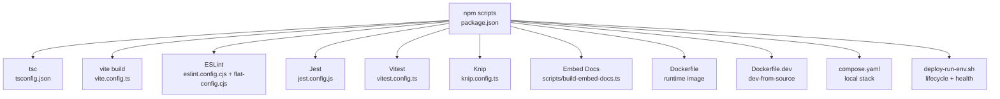

**Diagram sources**
- [package.json:38-116](file://package.json#L38-L116)
- [tsconfig.json:1-53](file://tsconfig.json#L1-L53)
- [vite.config.ts:1-44](file://vite.config.ts#L1-L44)
- [eslint.config.cjs:1-14](file://eslint.config.cjs#L1-L14)
- [eslint/flat-config.cjs:1-508](file://eslint/flat-config.cjs#L1-L508)
- [jest.config.js:1-72](file://jest.config.js#L1-L72)
- [vitest.config.ts:1-25](file://vitest.config.ts#L1-L25)
- [knip.config.ts:1-55](file://knip.config.ts#L1-L55)
- [scripts/build-embed-docs.ts:1-330](file://scripts/build-embed-docs.ts#L1-L330)
- [Dockerfile:1-76](file://Dockerfile#L1-L76)
- [Dockerfile.dev:1-68](file://Dockerfile.dev#L1-L68)
- [compose.yaml:1-183](file://compose.yaml#L1-L183)
- [scripts/deploy-run-env.sh:1-761](file://scripts/deploy-run-env.sh#L1-L761)

## Detailed Component Analysis

### Build System: TypeScript and Vite
- TypeScript
  - Strict compiler options, ES2022 target, NodeNext module resolution, declaration maps, source maps, and incremental builds.
  - Excludes UI and test files from backend build to keep dist minimal.
- Vite (UI)
  - Root at src/ui, base path /ui/, aliases for @/, and explicit asset inlining disabled to emit assets under /ui/assets/.
  - Code-splitting groups for react/react-dom/scheduler, @tiptap, and vendor chunks with prioritization.
  - Chunk size warning limit tuned for the UI bundle.

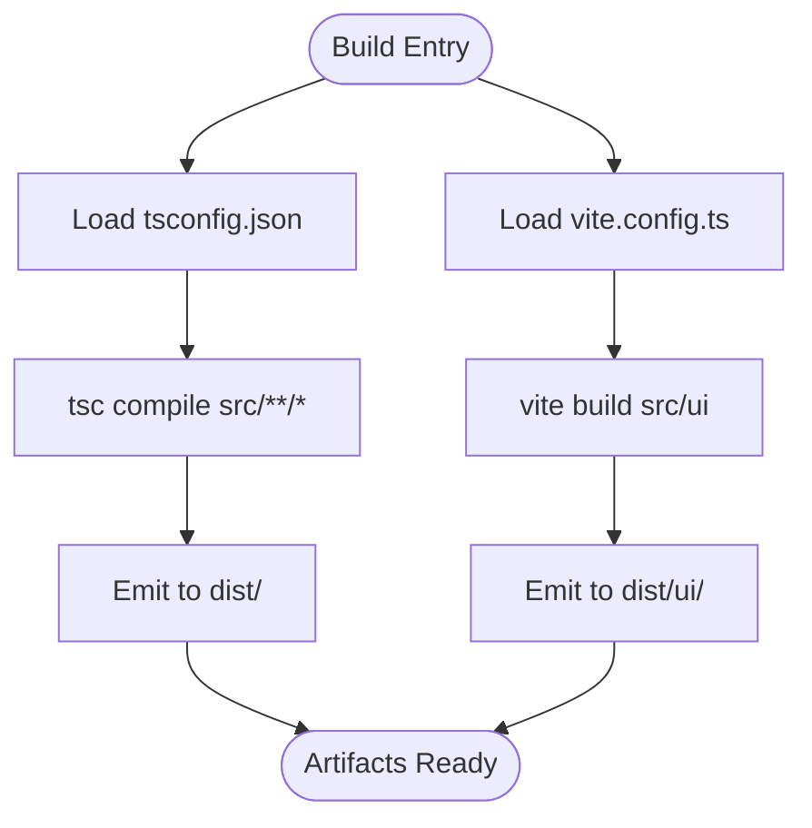

**Diagram sources**
- [tsconfig.json:1-53](file://tsconfig.json#L1-L53)
- [vite.config.ts:1-44](file://vite.config.ts#L1-L44)

**Section sources**
- [tsconfig.json:1-53](file://tsconfig.json#L1-L53)
- [vite.config.ts:1-44](file://vite.config.ts#L1-L44)

### Asset Management and UI Build
- AssetsInlineLimit is set to zero to avoid CSP violations with inlined images; assets are emitted under /ui/assets/*.
- Code-splitting groups ensure optimal loading of large libraries (React, Tiptap, vendor).
- UI environment variables are injected via a shared helper that reads package version.

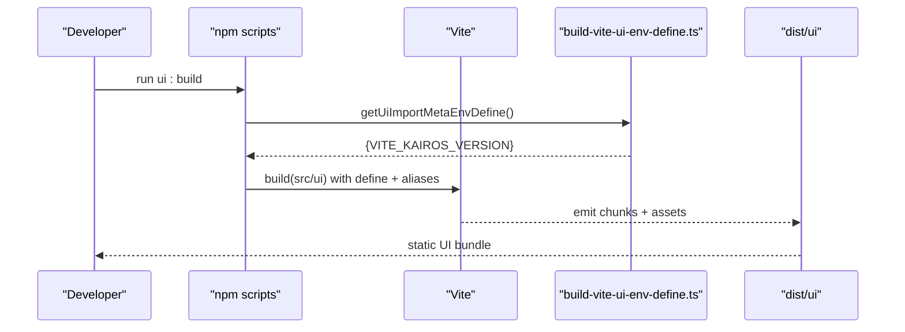

**Diagram sources**
- [vite.config.ts:10-44](file://vite.config.ts#L10-L44)
- [scripts/build-vite-ui-env-define.ts:18-24](file://scripts/build-vite-ui-env-define.ts#L18-L24)

**Section sources**
- [vite.config.ts:10-44](file://vite.config.ts#L10-L44)
- [scripts/build-vite-ui-env-define.ts:1-24](file://scripts/build-vite-ui-env-define.ts#L1-L24)

### Code Quality: ESLint, Formatting, and Plugins
- Flat config entry delegates to eslint/flat-config.cjs.
- Custom plugins:
  - kairos-forbidden-text: enforces brand/protocol wording policies.
  - kairos-codeql-line-comments: validates CodeQL comment integrity.
  - kairos-mcp-widget: enforces safe widget construction for MCP apps.
- Rules:
  - max-lines enforced per file with exceptions for specific files/dirs.
  - no-console errors for backend; relaxed in tests.
  - No test mocks outside unit tests; special allowances for integration/UI tests.
  - No inline ESLint overrides; all rules enforced.
- Parser and project settings:
  - TypeScript ESLint parser and plugin.
  - Separate tsconfigs for backend and UI tests.
- **Enhanced** Global ignore patterns now include `.qoder/**` to exclude auto-generated development tool files from linting scrutiny, improving developer experience by preventing false positives from generated content.

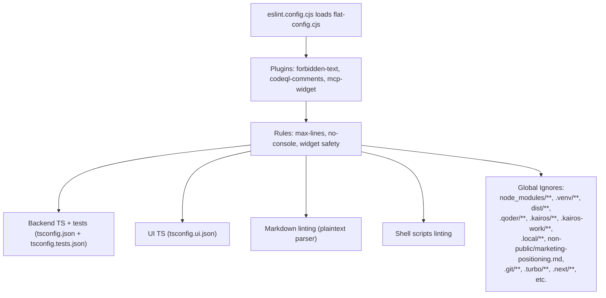

**Diagram sources**
- [eslint.config.cjs:1-14](file://eslint.config.cjs#L1-L14)
- [eslint/flat-config.cjs:1-508](file://eslint/flat-config.cjs#L1-L508)

**Section sources**
- [eslint.config.cjs:1-14](file://eslint.config.cjs#L1-L14)
- [eslint/flat-config.cjs:1-508](file://eslint/flat-config.cjs#L1-L508)

### Testing: Jest and Vitest
- Jest
  - ESM preset with ts-jest, NodeNext module resolution, and isolatedModules.
  - Coverage thresholds configurable via STRICT_COVERAGE environment.
  - Sequencer ensures deterministic ordering for dependent tests.
  - Setup files and global setup/teardown for auth-enabled environments.
- Vitest
  - jsdom environment for UI tests.
  - Reporter selection adapts to CI presence.

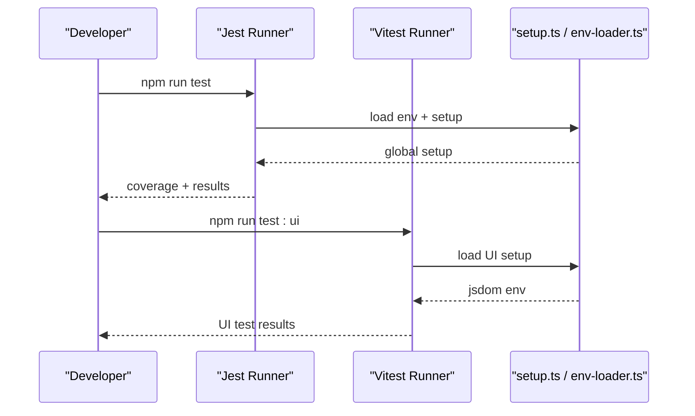

**Diagram sources**
- [jest.config.js:1-72](file://jest.config.js#L1-L72)
- [vitest.config.ts:1-25](file://vitest.config.ts#L1-L25)

**Section sources**
- [jest.config.js:1-72](file://jest.config.js#L1-L72)
- [vitest.config.ts:1-25](file://vitest.config.ts#L1-L25)

### Documentation Generation: Embedded MCP Resources
- The build embeds src/embed-docs/* into a TypeScript module for runtime access.
- Categories:
  - prompts: flat
  - tools: flat
  - resources: nested structure
  - templates: flat
  - mem: read from filesystem at runtime (copied to dist/embed-docs/mem/)
  - meta: collected by slug from mem/ and root markdown files
- Generators:
  - getPrompts(), getTools(), getResources(), getTemplates(), getMetaDoc()
  - listResourceKeys() enumerates all nested keys

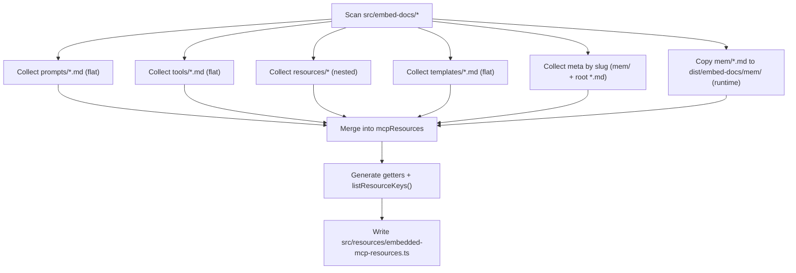

**Diagram sources**
- [scripts/build-embed-docs.ts:107-330](file://scripts/build-embed-docs.ts#L107-L330)

**Section sources**
- [scripts/build-embed-docs.ts:1-330](file://scripts/build-embed-docs.ts#L1-L330)

### Security Scanning: Trivy and Expiry Validation
- .trivyignore contains CVE exemptions with exp:YYYY-MM-DD entries.
- CI script validates expiry dates and fails if expired or invalid entries are found.
- Script warns about entries expiring soon.

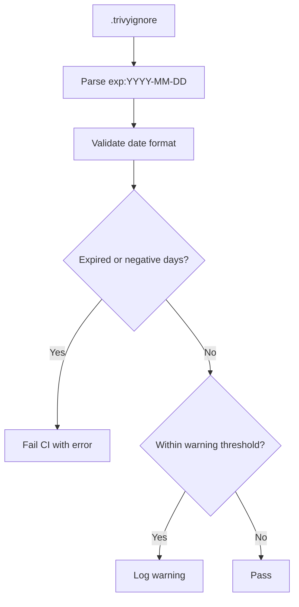

**Diagram sources**
- [.trivyignore:1-8](file://.trivyignore#L1-L8)
- [scripts/ci-check-trivyignore-expiry.py:30-87](file://scripts/ci-check-trivyignore-expiry.py#L30-L87)

**Section sources**
- [.trivyignore:1-8](file://.trivyignore#L1-L8)
- [scripts/ci-check-trivyignore-expiry.py:1-87](file://scripts/ci-check-trivyignore-expiry.py#L1-L87)

### Development Environment: Docker and Compose
- Production image installs the published npm package and exposes health checks.
- Development-from-source image builds locally and runs dist/.
- Compose profiles:
  - Mini: Qdrant + app
  - Fullstack: Qdrant + Redis/Valkey + Postgres + Keycloak
  - Optional UI: Redis Insight for Redis-compatible stores

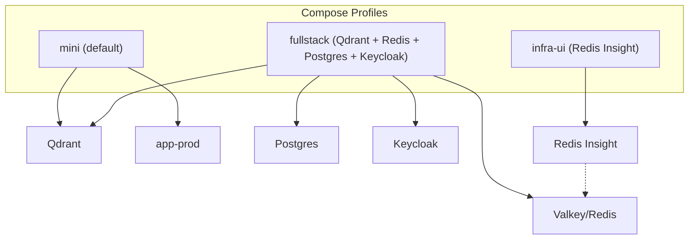

**Diagram sources**
- [compose.yaml:10-183](file://compose.yaml#L10-L183)
- [Dockerfile:1-76](file://Dockerfile#L1-L76)
- [Dockerfile.dev:1-68](file://Dockerfile.dev#L1-L68)

**Section sources**
- [compose.yaml:1-183](file://compose.yaml#L1-L183)
- [Dockerfile:1-76](file://Dockerfile#L1-L76)
- [Dockerfile.dev:1-68](file://Dockerfile.dev#L1-L68)

### Development Scripts and Workflows
- npm scripts orchestrate:
  - dev:build, dev:deploy, dev:start, dev:stop, dev:restart, dev:status, dev:logs
  - test, test:ui, test:load
  - ui:build, build, docker:build, docker:publish
  - lint, lint:fix, lint:skills, verify:clean, knip
  - version sync and release helpers
- deploy-run-env.sh manages environment lifecycle, health checks, and dependency readiness.
- dev-node-use.sh switches Node version using fnm and .nvmrc.

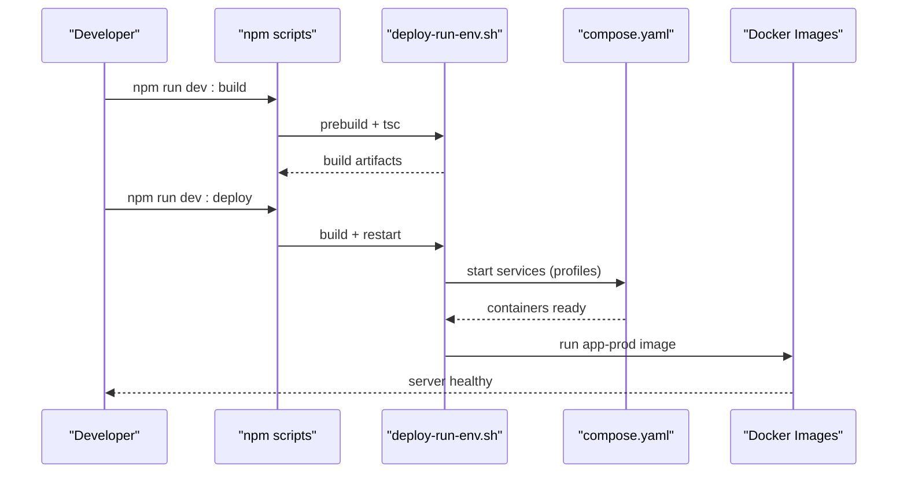

**Diagram sources**
- [package.json:38-116](file://package.json#L38-L116)
- [scripts/deploy-run-env.sh:211-339](file://scripts/deploy-run-env.sh#L211-L339)
- [compose.yaml:10-183](file://compose.yaml#L10-L183)
- [Dockerfile:1-76](file://Dockerfile#L1-L76)

**Section sources**
- [package.json:38-116](file://package.json#L38-L116)
- [scripts/deploy-run-env.sh:1-761](file://scripts/deploy-run-env.sh#L1-L761)
- [scripts/dev-node-use.sh:1-26](file://scripts/dev-node-use.sh#L1-L26)

### Code Standards, Pull Requests, and Release Management
- Code standards
  - ESLint enforces no inline overrides and strict rules for backend and UI.
  - Forbidden text and MCP widget safety rules apply to relevant files.
- Pull requests
  - Knip unused dependencies; CI validates clean working tree for AI coding rules enforcement.
  - Renovate automates dependency updates with grouping and security PRs.
- Releases
  - Semantic version bump helpers (major, minor, patch, rc, pre, beta).
  - Version sync across compose.yaml, Helm, and skills.

**Section sources**
- [eslint/flat-config.cjs:114-120](file://eslint/flat-config.cjs#L114-L120)
- [knip.config.ts:1-55](file://knip.config.ts#L1-L55)
- [scripts/deploy-run-env.sh:582-668](file://scripts/deploy-run-env.sh#L582-L668)
- [renovate.json:1-138](file://renovate.json#L1-L138)

## Dependency Analysis
- npm scripts orchestrate all tooling; engines require Node >= 24.
- TypeScript and Vite configurations constrain module resolution and output.
- ESLint flat config centralizes rules and plugins.
- Knip ignores generated files and build-time-only binaries to avoid false positives.
- Renovate groups updates and automerges security patches.

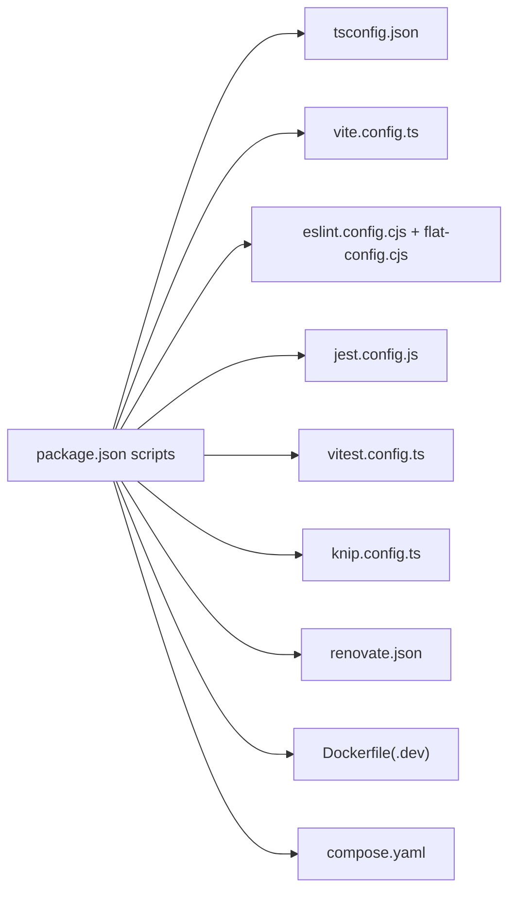

**Diagram sources**
- [package.json:38-116](file://package.json#L38-L116)
- [tsconfig.json:1-53](file://tsconfig.json#L1-L53)
- [vite.config.ts:1-44](file://vite.config.ts#L1-L44)
- [eslint.config.cjs:1-14](file://eslint.config.cjs#L1-L14)
- [eslint/flat-config.cjs:1-508](file://eslint/flat-config.cjs#L1-L508)
- [jest.config.js:1-72](file://jest.config.js#L1-L72)
- [vitest.config.ts:1-25](file://vitest.config.ts#L1-L25)
- [knip.config.ts:1-55](file://knip.config.ts#L1-L55)
- [renovate.json:1-138](file://renovate.json#L1-L138)
- [Dockerfile:1-76](file://Dockerfile#L1-L76)
- [Dockerfile.dev:1-68](file://Dockerfile.dev#L1-L68)
- [compose.yaml:1-183](file://compose.yaml#L1-L183)

**Section sources**
- [package.json:184-194](file://package.json#L184-L194)
- [knip.config.ts:23-51](file://knip.config.ts#L23-L51)
- [renovate.json:41-137](file://renovate.json#L41-L137)

## Performance Considerations
- TypeScript incremental builds reduce rebuild times.
- Vite code-splitting groups minimize initial payload and improve caching.
- UI asset emission avoids CSP inlined images; adjust assetsInlineLimit if inlining is desired.
- Knip helps prune unused dependencies to reduce bundle sizes and attack surface.
- **Enhanced** ESLint ignore patterns now exclude `.qoder/**` to prevent unnecessary linting of auto-generated development tool files, improving developer experience and reducing false positives.

## Troubleshooting Guide
- Lint failures
  - Run npm run lint and npm run lint:fix; verify no inline overrides and forbidden text violations.
  - **Updated** Check for `.qoder/**` related issues - this directory is now automatically ignored by ESLint to prevent linting of auto-generated development tool files.
- Test failures
  - Use npm run test or npm run test:ui; review coverage thresholds and sequencer order.
- Environment issues
  - Use npm run dev:start and npm run dev:status; check health endpoints and dependency readiness.
  - For auth-enabled environments, ensure Keycloak realms are configured.
- Trivy expiry
  - CI script validates .trivyignore entries; fix or remove expired entries.

**Section sources**
- [eslint/flat-config.cjs:114-120](file://eslint/flat-config.cjs#L114-L120)
- [jest.config.js:45-58](file://jest.config.js#L45-L58)
- [scripts/deploy-run-env.sh:411-458](file://scripts/deploy-run-env.sh#L411-L458)
- [scripts/ci-check-trivyignore-expiry.py:30-87](file://scripts/ci-check-trivyignore-expiry.py#L30-L87)

## Conclusion
KAIROS MCP's development tools provide a robust, automated pipeline for building, testing, linting, packaging, and deploying the backend and UI. The combination of strict TypeScript settings, Vite code-splitting, ESLint plugins, Knip, and Renovate ensures maintainable, secure, and efficient development. The environment scripts and Docker/Compose configurations streamline local workflows and reproducible deployments. **Enhanced** ESLint configuration now excludes `.qoder/**` from linting scrutiny, improving developer experience by preventing false positives from auto-generated development tool files.

## Appendices

### Appendix A: Key npm Scripts Reference
- Build and packaging
  - build, ui:build, docker:build, docker:publish, pack, npm:publish
- Development lifecycle
  - dev:start, dev:stop, dev:restart, dev:status, dev:logs, dev:deploy
- Testing
  - test, test:ui, test:load, test:ui:watch
- Quality and maintenance
  - lint, lint:fix, lint:skills, verify:clean, knip, ensure-coding-rules
- Versioning and releases
  - release:major, release:minor, release:patch, release:rc, release:pre, release:beta
  - version:sync, version:sync-skills, helm:sync-app-version, compose:sync-app-tag

**Section sources**
- [package.json:38-116](file://package.json#L38-L116)

### Appendix B: Environment Variables and Ports
- Ports
  - dev: 3300 (app), 9390 (metrics)
  - dev_simple: 4300 (app), 9490 (metrics)
  - prod: 3500 (app), 9390 (metrics)
- Key variables
  - QDRANT_URL, QDRANT_API_KEY, QDRANT_COLLECTION
  - TEI_BASE_URL
  - REDIS_URL, KAIROS_REDIS_PREFIX
  - LOG_TARGET, LOG_LEVEL, LOG_FORMAT

**Section sources**
- [scripts/deploy-run-env.sh:93-110](file://scripts/deploy-run-env.sh#L93-L110)
- [compose.yaml:53-137](file://compose.yaml#L53-L137)

### Appendix C: ESLint Ignore Patterns
**Updated** The ESLint configuration now includes enhanced ignore patterns to improve developer experience:

- **New Addition**: `.qoder/**` - Excludes auto-generated development tool files from linting scrutiny
- **Existing Patterns**: node_modules/**, .venv/**, dist/**, .kairos/**, .kairos-work/**, .local/**, .git/**, .turbo/**, .next/**, etc.
- **Purpose**: Prevents false positives and improves developer experience by excluding auto-generated content from linting

These ignore patterns ensure that generated development tool files don't trigger linting errors, allowing developers to focus on meaningful code improvements rather than false positive warnings.

**Section sources**
- [eslint/flat-config.cjs:25-112](file://eslint/flat-config.cjs#L25-L112)