# Development Tools

<cite>
**Referenced Files in This Document**
- [package.json](file://package.json)
- [tsconfig.json](file://tsconfig.json)
- [vite.config.ts](file://vite.config.ts)
- [eslint.config.cjs](file://eslint.config.cjs)
- [eslint/flat-config.cjs](file://eslint/flat-config.cjs)
- [jest.config.js](file://jest.config.js)
- [vitest.config.ts](file://vitest.config.ts)
- [scripts/build-embed-docs.ts](file://scripts/build-embed-docs.ts)
- [scripts/build-vite-ui-env-define.ts](file://scripts/build-vite-ui-env-define.ts)
- [Dockerfile](file://Dockerfile)
- [Dockerfile.dev](file://Dockerfile.dev)
- [compose.yaml](file://compose.yaml)
- [.trivyignore](file://.trivyignore)
- [scripts/ci-check-trivyignore-expiry.py](file://scripts/ci-check-trivyignore-expiry.py)
- [scripts/deploy-run-env.sh](file://scripts/deploy-run-env.sh)
- [scripts/dev-node-use.sh](file://scripts/dev-node-use.sh)
- [scripts/seed-test-snapshot.sh](file://scripts/seed-test-snapshot.sh)
- [scripts/import-test-snapshot.sh](file://scripts/import-test-snapshot.sh)
- [scripts/validate-mermaid.sh](file://scripts/validate-mermaid.sh)
- [.markdownlint.jsonc](file://.markdownlint.jsonc)
- [.puppeteer-config.json](file://.puppeteer-config.json)
- [knip.config.ts](file://knip.config.ts)
- [renovate.json](file://renovate.json)
</cite>

## Update Summary
**Changes Made**
- Updated documentation to reflect the current state where documentation quality assurance system (markdownlint-cli2, mermaid validation, validate-mermaid.sh, puppeteer-config.json) has been removed from codebase
- Removed references to markdownlint-cli2 and mermaid validation tools from documentation sections
- Updated troubleshooting guide to remove documentation quality assurance related sections
- Revised code standards section to reflect removal of documentation validation requirements

## Table of Contents
1. [Introduction](#introduction)
2. [Project Structure](#project-structure)
3. [Core Components](#core-components)
4. [Architecture Overview](#architecture-overview)
5. [Detailed Component Analysis](#detailed-component-analysis)
6. [Dependency Analysis](#dependency-analysis)
7. [Performance Considerations](#performance-considerations)
8. [Troubleshooting Guide](#troubleshooting-guide)
9. [Conclusion](#conclusion)
10. [Appendices](#appendices)

## Introduction
This document describes the development tools and workflows for KAIROS MCP. It covers the build system (TypeScript, Vite, and asset management), code quality tooling (ESLint, formatting, and security scanning), documentation generation for embedded resources and API references, development environment setup, debugging, local workflows, code standards, pull request processes, release management, and deployment preparation.

## Project Structure
The repository is a monorepo-style Node.js project with:
- A backend server written in TypeScript under src/
- A React-based UI built with Vite under src/ui/
- Scripts for building, testing, linting, packaging, and deployment under scripts/
- Docker images for production and development
- Compose configuration for local orchestration
- ESLint flat config with custom plugins and rules
- Knip configuration for unused dependency detection
- Renovate configuration for automated dependency updates
- **Removed**: Documentation quality assurance system (markdownlint-cli2, mermaid validation)

```mermaid
graph TB
subgraph "Build and Tooling"
Pkg["package.json<br/>scripts and engines"]
TS["tsconfig.json<br/>backend TS settings"]
ViteCfg["vite.config.ts<br/>UI build config"]
ESLintCfg["eslint.config.cjs<br/>flat config entry"]
ESLintFlat["eslint/flat-config.cjs<br/>rules and plugins"]
JestCfg["jest.config.js<br/>backend tests"]
VitestCfg["vitest.config.ts<br/>UI tests"]
Knip["knip.config.ts<br/>unused deps"]
Renovate["renovate.json<br/>automations"]
end
subgraph "Documentation Quality"
MDL["markdownlint-cli2<br/>docs validation"]
Mermaid["validate-mermaid.sh<br/>diagram validation"]
Puppeteer[".puppeteer-config.json<br/>mermaid rendering"]
end
subgraph "Runtime and Packaging"
Docker["Dockerfile<br/>runtime image"]
DockerDev["Dockerfile.dev<br/>dev-from-source"]
Compose["compose.yaml<br/>local stack"]
Trivy["trivyignore<br/>security exemptions"]
end
subgraph "Scripts"
BuildDocs["scripts/build-embed-docs.ts<br/>embed docs generator"]
BuildEnv["scripts/build-vite-ui-env-define.ts<br/>UI env define"]
EnvSh["scripts/deploy-run-env.sh<br/>dev/prod lifecycle + snapshot integration"]
DevNode["scripts/dev-node-use.sh<br/>Node version switcher"]
TrivyExpiry["scripts/ci-check-trivyignore-expiry.py<br/>expiry validator"]
SeedSnap["scripts/seed-test-snapshot.sh<br/>Qdrant snapshot seed"]
ImportSnap["scripts/import-test-snapshot.sh<br/>Qdrant snapshot import"]
ValidateMermaid["scripts/validate-mermaid.sh<br/>mermaid validation"]
end
Pkg --> TS
Pkg --> ViteCfg
Pkg --> ESLintCfg
ESLintCfg --> ESLintFlat
Pkg --> JestCfg
Pkg --> VitestCfg
Pkg --> Knip
Pkg --> Renovate
Pkg --> MDL
Pkg --> Mermaid
Pkg --> Puppeteer
Pkg --> Docker
Pkg --> DockerDev
Pkg --> Compose
Pkg --> Trivy
Pkg --> BuildDocs
ViteCfg --> BuildEnv
Pkg --> EnvSh
Pkg --> DevNode
Pkg --> TrivyExpiry
EnvSh --> SeedSnap
EnvSh --> ImportSnap
Pkg --> ValidateMermaid
```

**Diagram sources**
- [package.json:38-121](file://package.json#L38-L121)
- [tsconfig.json:1-53](file://tsconfig.json#L1-53)
- [vite.config.ts:1-44](file://vite.config.ts#L1-L44)
- [eslint.config.cjs:1-14](file://eslint.config.cjs#L1-L14)
- [eslint/flat-config.cjs:1-508](file://eslint/flat-config.cjs#L1-L508)
- [jest.config.js:1-72](file://jest.config.js#L1-L72)
- [vitest.config.ts:1-25](file://vitest.config.ts#L1-L25)
- [knip.config.ts:1-55](file://knip.config.ts#L1-L55)
- [renovate.json:1-138](file://renovate.json#L1-L138)
- [.markdownlint.jsonc:1-76](file://.markdownlint.jsonc#L1-L76)
- [scripts/validate-mermaid.sh:1-120](file://scripts/validate-mermaid.sh#L1-L120)
- [.puppeteer-config.json:1-4](file://.puppeteer-config.json#L1-L4)
- [Dockerfile:1-76](file://Dockerfile#L1-L76)
- [Dockerfile.dev:1-68](file://Dockerfile.dev#L1-L68)
- [compose.yaml:1-183](file://compose.yaml#L1-L183)
- [.trivyignore:1-8](file://.trivyignore#L1-L8)
- [scripts/build-embed-docs.ts:1-330](file://scripts/build-embed-docs.ts#L1-L330)
- [scripts/build-vite-ui-env-define.ts:1-24](file://scripts/build-vite-ui-env-define.ts#L1-L24)
- [scripts/deploy-run-env.sh:1-819](file://scripts/deploy-run-env.sh#L1-L819)
- [scripts/dev-node-use.sh:1-26](file://scripts/dev-node-use.sh#L1-L26)
- [scripts/ci-check-trivyignore-expiry.py:1-87](file://scripts/ci-check-trivyignore-expiry.py#L1-L87)
- [scripts/seed-test-snapshot.sh:1-255](file://scripts/seed-test-snapshot.sh#L1-L255)
- [scripts/import-test-snapshot.sh:1-162](file://scripts/import-test-snapshot.sh#L1-L162)

**Section sources**
- [package.json:1-202](file://package.json#L1-L202)
- [tsconfig.json:1-53](file://tsconfig.json#L1-L53)
- [vite.config.ts:1-44](file://vite.config.ts#L1-L44)
- [eslint.config.cjs:1-14](file://eslint.config.cjs#L1-L14)
- [eslint/flat-config.cjs:1-508](file://eslint/flat-config.cjs#L1-L508)
- [jest.config.js:1-72](file://jest.config.js#L1-L72)
- [vitest.config.ts:1-25](file://vitest.config.ts#L1-L25)
- [knip.config.ts:1-55](file://knip.config.ts#L1-L55)
- [renovate.json:1-138](file://renovate.json#L1-L138)
- [.markdownlint.jsonc:1-76](file://.markdownlint.jsonc#L1-L76)
- [scripts/validate-mermaid.sh:1-120](file://scripts/validate-mermaid.sh#L1-L120)
- [.puppeteer-config.json:1-4](file://.puppeteer-config.json#L1-L4)
- [Dockerfile:1-76](file://Dockerfile#L1-L76)
- [Dockerfile.dev:1-68](file://Dockerfile.dev#L1-L68)
- [compose.yaml:1-183](file://compose.yaml#L1-L183)
- [.trivyignore:1-8](file://.trivyignore#L1-L8)
- [scripts/build-embed-docs.ts:1-330](file://scripts/build-embed-docs.ts#L1-L330)
- [scripts/build-vite-ui-env-define.ts:1-24](file://scripts/build-vite-ui-env-define.ts#L1-L24)
- [scripts/deploy-run-env.sh:1-819](file://scripts/deploy-run-env.sh#L1-L819)
- [scripts/dev-node-use.sh:1-26](file://scripts/dev-node-use.sh#L1-L26)
- [scripts/ci-check-trivyignore-expiry.py:1-87](file://scripts/ci-check-trivyignore-expiry.py#L1-L87)
- [scripts/seed-test-snapshot.sh:1-255](file://scripts/seed-test-snapshot.sh#L1-L255)
- [scripts/import-test-snapshot.sh:1-162](file://scripts/import-test-snapshot.sh#L1-L162)

## Core Components
- Build system
  - TypeScript compilation for backend with strict settings and incremental builds.
  - Vite-based UI build with code-splitting groups and asset emission strategy.
- Code quality
  - ESLint flat config with custom plugins for forbidden text, CodeQL comment integrity, and MCP widget safety.
  - **Removed**: markdownlint-cli2 for comprehensive markdown documentation validation with custom configuration.
  - **Removed**: Mermaid diagram validation using @mermaid-js/mermaid-cli for structural diagram integrity checking.
  - Jest configuration for backend tests with coverage thresholds and sequencer.
  - Vitest configuration for UI tests with jsdom environment.
  - Knip unused dependency detection with tailored ignore lists.
- Documentation generation
  - Build-time embedding of markdown docs into a TypeScript module for runtime access.
- Security scanning
  - Trivy ignore list with expiry validation in CI.
- Development environment
  - Docker images for production and development-from-source.
  - Docker Compose for local orchestration of Qdrant, optional Redis, Postgres, and Keycloak.
  - Environment script for lifecycle management and health checks with integrated Qdrant snapshot support.
- **New**: Qdrant snapshot management system
  - Automated snapshot creation and restoration for CI/local test caching.
  - Integration with deployment environment for seamless test execution.
- Automation
  - Renovate for automated dependency updates across npm, GitHub Actions, Dockerfiles, and Helm.

**Section sources**
- [tsconfig.json:1-53](file://tsconfig.json#L1-L53)
- [vite.config.ts:1-44](file://vite.config.ts#L1-L44)
- [eslint/flat-config.cjs:1-508](file://eslint/flat-config.cjs#L1-L508)
- [jest.config.js:1-72](file://jest.config.js#L1-L72)
- [vitest.config.ts:1-25](file://vitest.config.ts#L1-L25)
- [knip.config.ts:1-55](file://knip.config.ts#L1-L55)
- [scripts/build-embed-docs.ts:1-330](file://scripts/build-embed-docs.ts#L1-L330)
- [Dockerfile:1-76](file://Dockerfile#L1-L76)
- [Dockerfile.dev:1-68](file://Dockerfile.dev#L1-L68)
- [compose.yaml:1-183](file://compose.yaml#L1-L183)
- [scripts/deploy-run-env.sh:346-370](file://scripts/deploy-run-env.sh#L346-L370)
- [scripts/seed-test-snapshot.sh:1-255](file://scripts/seed-test-snapshot.sh#L1-L255)
- [scripts/import-test-snapshot.sh:1-162](file://scripts/import-test-snapshot.sh#L1-L162)
- [renovate.json:1-138](file://renovate.json#L1-L138)

## Architecture Overview
The development toolchain integrates build, test, lint, packaging, and deployment steps orchestrated by npm scripts. The backend compiles to dist/, the UI builds to dist/ui/, and embedded docs are generated at build time. Docker images encapsulate runtime environments, while Compose provisions local infrastructure. **Removed**: Documentation quality assurance system with markdownlint-cli2 and mermaid validation has been eliminated from the toolchain.

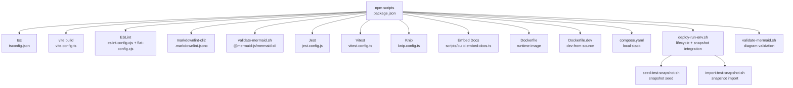

**Diagram sources**
- [package.json:38-121](file://package.json#L38-L121)
- [tsconfig.json:1-53](file://tsconfig.json#L1-L53)
- [vite.config.ts:1-44](file://vite.config.ts#L1-L44)
- [eslint.config.cjs:1-14](file://eslint.config.cjs#L1-L14)
- [eslint/flat-config.cjs:1-508](file://eslint/flat-config.cjs#L1-L508)
- [.markdownlint.jsonc:1-76](file://.markdownlint.jsonc#L1-L76)
- [scripts/validate-mermaid.sh:1-120](file://scripts/validate-mermaid.sh#L1-L120)
- [jest.config.js:1-72](file://jest.config.js#L1-L72)
- [vitest.config.ts:1-25](file://vitest.config.ts#L1-L25)
- [knip.config.ts:1-55](file://knip.config.ts#L1-L55)
- [scripts/build-embed-docs.ts:1-330](file://scripts/build-embed-docs.ts#L1-L330)
- [Dockerfile:1-76](file://Dockerfile#L1-L76)
- [Dockerfile.dev:1-68](file://Dockerfile.dev#L1-L68)
- [compose.yaml:1-183](file://compose.yaml#L1-L183)
- [scripts/deploy-run-env.sh:1-819](file://scripts/deploy-run-env.sh#L1-L819)
- [scripts/seed-test-snapshot.sh:1-255](file://scripts/seed-test-snapshot.sh#L1-L255)
- [scripts/import-test-snapshot.sh:1-162](file://scripts/import-test-snapshot.sh#L1-L162)

## Detailed Component Analysis

### Build System: TypeScript and Vite
- TypeScript
  - Strict compiler options, ES2022 target, NodeNext module resolution, declaration maps, source maps, and incremental builds.
  - Excludes UI and test files from backend build to keep dist minimal.
- Vite (UI)
  - Root at src/ui, base path /ui/, aliases for @/, and explicit asset inlining disabled to emit assets under /ui/assets/.
  - Code-splitting groups for react/react-dom/scheduler, @tiptap, and vendor chunks with prioritization.
  - Chunk size warning limit tuned for the UI bundle.

**Diagram sources**
- [tsconfig.json:1-53](file://tsconfig.json#L1-L53)
- [vite.config.ts:1-44](file://vite.config.ts#L1-L44)

**Section sources**
- [tsconfig.json:1-53](file://tsconfig.json#L1-L53)
- [vite.config.ts:1-44](file://vite.config.ts#L1-L44)

### Asset Management and UI Build
- AssetsInlineLimit is set to zero to avoid CSP violations with inlined images; assets are emitted under /ui/assets/*.
- Code-splitting groups ensure optimal loading of large libraries (React, Tiptap, vendor).
- UI environment variables are injected via a shared helper that reads package version.

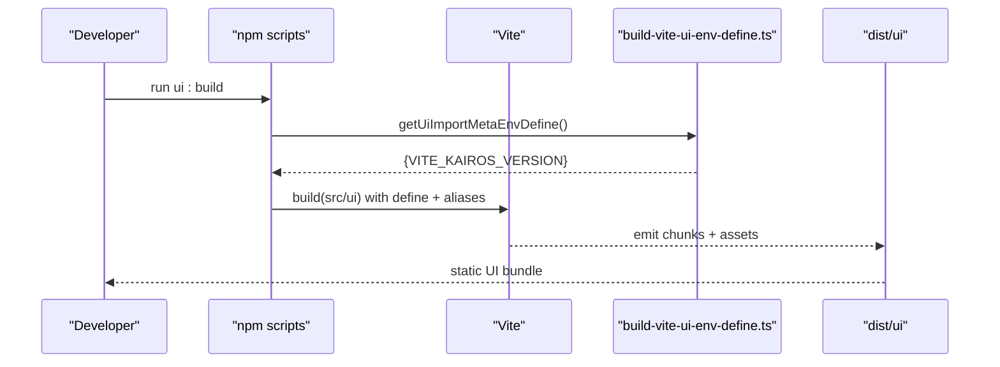

**Diagram sources**
- [vite.config.ts:10-44](file://vite.config.ts#L10-L44)
- [scripts/build-vite-ui-env-define.ts:18-24](file://scripts/build-vite-ui-env-define.ts#L18-L24)

**Section sources**
- [vite.config.ts:10-44](file://vite.config.ts#L10-L44)
- [scripts/build-vite-ui-env-define.ts:1-24](file://scripts/build-vite-ui-env-define.ts#L1-L24)

### Code Quality: ESLint and Plugins
- Flat config entry delegates to eslint/flat-config.cjs.
- Custom plugins:
  - kairos-forbidden-text: enforces brand/protocol wording policies.
  - kairos-codeql-line-comments: validates CodeQL comment integrity.
  - kairos-mcp-widget: enforces safe widget construction for MCP apps.
- Rules:
  - max-lines enforced per file with exceptions for specific files/dirs.
  - no-console errors for backend; relaxed in tests.
  - No test mocks outside unit tests; special allowances for integration/UI tests.
  - No inline ESLint overrides; all rules enforced.
- Parser and project settings:
  - TypeScript ESLint parser and plugin.
  - Separate tsconfigs for backend and UI tests.
- **Updated** Global ignore patterns now include `.qoder/**` to exclude auto-generated development tool files from linting scrutiny, improving developer experience by preventing false positives from generated content.
- **Removed**: Documentation quality assurance tools (markdownlint-cli2, mermaid validation) have been eliminated from the codebase.

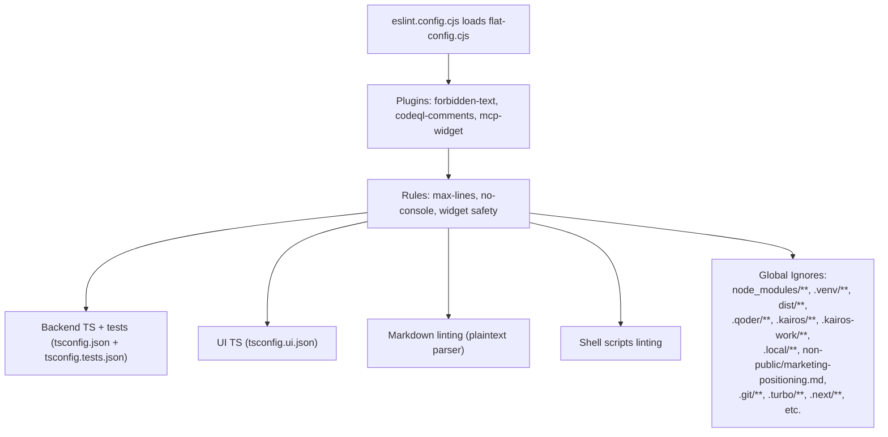

**Diagram sources**
- [eslint.config.cjs:1-14](file://eslint.config.cjs#L1-L14)
- [eslint/flat-config.cjs:1-508](file://eslint/flat-config.cjs#L1-L508)

**Section sources**
- [eslint.config.cjs:1-14](file://eslint.config.cjs#L1-L14)
- [eslint/flat-config.cjs:1-508](file://eslint/flat-config.cjs#L1-L508)

### Testing: Jest, Vitest, and Qdrant Snapshot-Based Testing
- Jest
  - ESM preset with ts-jest, NodeNext module resolution, and isolatedModules.
  - Coverage thresholds configurable via STRICT_COVERAGE environment.
  - Sequencer ensures deterministic ordering for dependent tests.
  - Setup files and global setup/teardown for auth-enabled environments.
- Vitest
  - jsdom environment for UI tests.
  - Reporter selection adapts to CI presence.
- **New**: Qdrant snapshot-based testing infrastructure
  - Automated snapshot creation and restoration for CI/local test caching.
  - Eliminates expensive training operations during test execution.
  - Reduces test execution time by 15-30x (1-2s vs 10-60s per test).
  - Provides deterministic test results without external API dependencies.

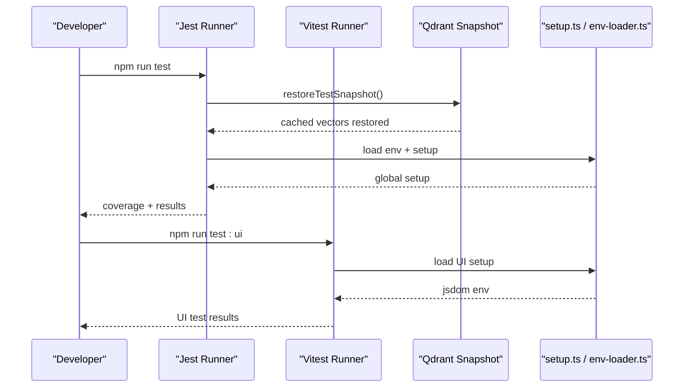

**Diagram sources**
- [jest.config.js:1-72](file://jest.config.js#L1-L72)
- [vitest.config.ts:1-25](file://vitest.config.ts#L1-L25)
- [scripts/seed-test-snapshot.sh:1-255](file://scripts/seed-test-snapshot.sh#L1-L255)
- [scripts/import-test-snapshot.sh:1-162](file://scripts/import-test-snapshot.sh#L1-L162)

**Section sources**
- [jest.config.js:1-72](file://jest.config.js#L1-L72)
- [vitest.config.ts:1-25](file://vitest.config.ts#L1-L25)
- [scripts/seed-test-snapshot.sh:1-255](file://scripts/seed-test-snapshot.sh#L1-L255)
- [scripts/import-test-snapshot.sh:1-162](file://scripts/import-test-snapshot.sh#L1-L162)

### Documentation Generation: Embedded MCP Resources
- The build embeds src/embed-docs/* into a TypeScript module for runtime access.
- Categories:
  - prompts: flat
  - tools: flat
  - resources: nested structure
  - templates: flat
  - mem: read from filesystem at runtime (copied to dist/embed-docs/mem/)
  - meta: collected by slug from mem/ and root markdown files
- Generators:
  - getPrompts(), getTools(), getResources(), getTemplates(), getMetaDoc()
  - listResourceKeys() enumerates all nested keys

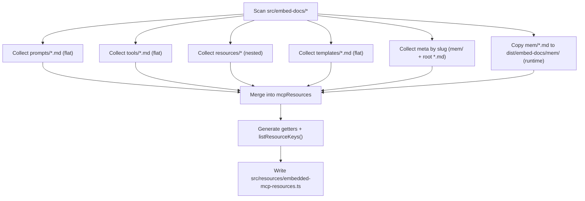

**Diagram sources**
- [scripts/build-embed-docs.ts:107-330](file://scripts/build-embed-docs.ts#L107-L330)

**Section sources**
- [scripts/build-embed-docs.ts:1-330](file://scripts/build-embed-docs.ts#L1-L330)

### Security Scanning: Trivy and Expiry Validation
- .trivyignore contains CVE exemptions with exp:YYYY-MM-DD entries.
- CI script validates expiry dates and fails if expired or invalid entries are found.
- Script warns about entries expiring soon.

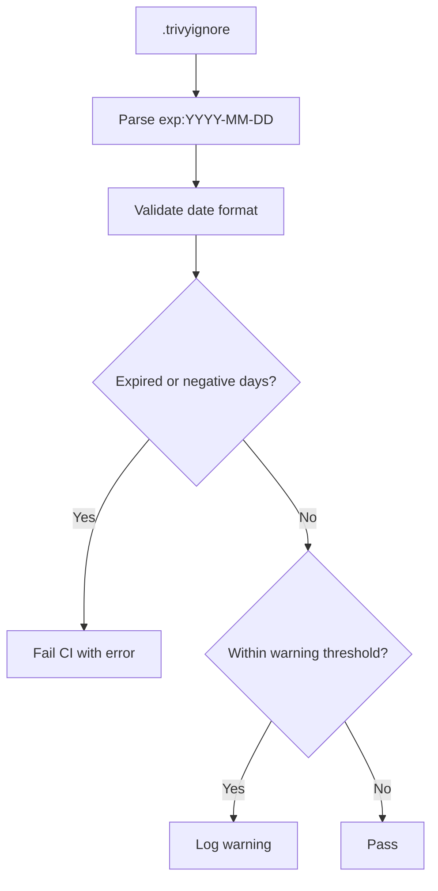

**Diagram sources**
- [.trivyignore:1-8](file://.trivyignore#L1-L8)
- [scripts/ci-check-trivyignore-expiry.py:30-87](file://scripts/ci-check-trivyignore-expiry.py#L30-L87)

**Section sources**
- [.trivyignore:1-8](file://.trivyignore#L1-L8)
- [scripts/ci-check-trivyignore-expiry.py:1-87](file://scripts/ci-check-trivyignore-expiry.py#L1-L87)

### Development Environment: Docker and Compose
- Production image installs the published npm package and exposes health checks.
- Development-from-source image builds locally and runs dist/.
- Compose profiles:
  - Mini: Qdrant + app
  - Fullstack: Qdrant + Redis/Valkey + Postgres + Keycloak
  - Optional UI: Redis Insight for Redis-compatible stores

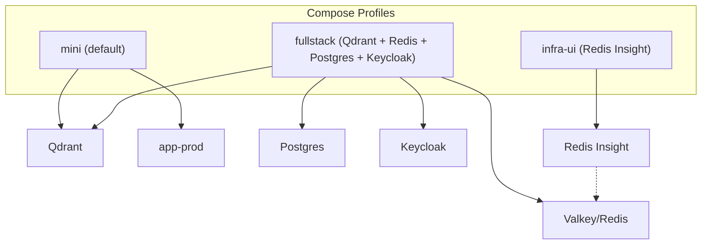

**Diagram sources**
- [compose.yaml:10-183](file://compose.yaml#L10-L183)
- [Dockerfile:1-76](file://Dockerfile#L1-L76)
- [Dockerfile.dev:1-68](file://Dockerfile.dev#L1-L68)

**Section sources**
- [compose.yaml:1-183](file://compose.yaml#L1-L183)
- [Dockerfile:1-76](file://Dockerfile#L1-L76)
- [Dockerfile.dev:1-68](file://Dockerfile.dev#L1-L68)

### Qdrant Snapshot Management System
**New**: The development environment now includes a comprehensive Qdrant snapshot management system for optimizing CI/local testing performance.

#### Snapshot Workflow
The system provides automated snapshot creation and restoration to eliminate expensive training overhead during tests:

1. **Snapshot Seed Process** (`seed-test-snapshot.sh`)
  - Trains test adapters using MCP tools
  - Creates Qdrant snapshots for main and traces collections
  - Downloads snapshots to `.local/qdrant-snapshot/`
  - Supports both local and CI modes

2. **Snapshot Import Process** (`import-test-snapshot.sh`)
  - Restores snapshots to Qdrant collections
  - Drops existing collections before import
  - Verifies snapshot integrity and collection data
  - Handles both main and traces collections

3. **Deployment Integration** (`deploy-run-env.sh`)
  - Automatically seeds snapshots in CI mode for dev_simple environment
  - Imports snapshots before test execution
  - Provides fallback mechanisms for missing snapshots

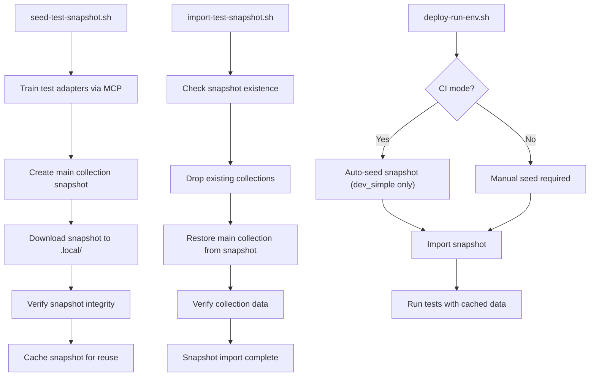

**Diagram sources**
- [scripts/seed-test-snapshot.sh:1-255](file://scripts/seed-test-snapshot.sh#L1-L255)
- [scripts/import-test-snapshot.sh:1-162](file://scripts/import-test-snapshot.sh#L1-L162)
- [scripts/deploy-run-env.sh:346-370](file://scripts/deploy-run-env.sh#L346-L370)

**Section sources**
- [scripts/seed-test-snapshot.sh:1-255](file://scripts/seed-test-snapshot.sh#L1-L255)
- [scripts/import-test-snapshot.sh:1-162](file://scripts/import-test-snapshot.sh#L1-L162)
- [scripts/deploy-run-env.sh:346-370](file://scripts/deploy-run-env.sh#L346-L370)

### Development Scripts and Workflows
- npm scripts orchestrate:
  - dev:build, dev:deploy, dev:start, dev:stop, dev:restart, dev:status, dev:logs
  - test, test:ui, test:load
  - ui:build, build, docker:build, docker:publish
  - lint, lint:fix, lint:skills, verify:clean, knip
  - version sync and release helpers
  - **New**: test:seed-snapshot, test:restore-snapshot for Qdrant snapshot management
  - **Removed**: lint:markdown, lint:markdown:fix for documentation validation
  - **Removed**: lint:mermaid for mermaid diagram validation
- deploy-run-env.sh manages environment lifecycle, health checks, and dependency readiness with integrated snapshot support.
- dev-node-use.sh switches Node version using fnm and .nvmrc.

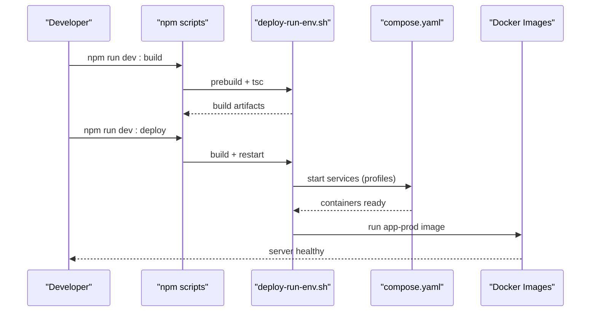

**Diagram sources**
- [package.json:38-121](file://package.json#L38-L121)
- [scripts/deploy-run-env.sh:211-339](file://scripts/deploy-run-env.sh#L211-L339)
- [compose.yaml:10-183](file://compose.yaml#L10-L183)
- [Dockerfile:1-76](file://Dockerfile#L1-L76)

**Section sources**
- [package.json:38-121](file://package.json#L38-L121)
- [scripts/deploy-run-env.sh:1-819](file://scripts/deploy-run-env.sh#L1-L819)
- [scripts/dev-node-use.sh:1-26](file://scripts/dev-node-use.sh#L1-L26)

### Code Standards, Pull Requests, and Release Management
- Code standards
  - ESLint enforces no inline overrides and strict rules for backend and UI.
  - Forbidden text and MCP widget safety rules apply to relevant files.
  - **Removed**: markdownlint-cli2 ensures comprehensive documentation quality with custom configuration.
  - **Removed**: Mermaid validation prevents broken diagram syntax in documentation.
- Pull requests
  - Knip unused dependencies; CI validates clean working tree for AI coding rules enforcement.
  - Renovate automates dependency updates with grouping and security PRs.
- Releases
  - Semantic version bump helpers (major, minor, patch, rc, pre, beta).
  - Version sync across compose.yaml, Helm, and skills.

**Section sources**
- [eslint/flat-config.cjs:114-120](file://eslint/flat-config.cjs#L114-L120)
- [knip.config.ts:1-55](file://knip.config.ts#L1-L55)
- [scripts/deploy-run-env.sh:582-668](file://scripts/deploy-run-env.sh#L582-L668)
- [renovate.json:1-138](file://renovate.json#L1-L138)

## Dependency Analysis
- npm scripts orchestrate all tooling; engines require Node >= 24.
- TypeScript and Vite configurations constrain module resolution and output.
- ESLint flat config centralizes rules and plugins.
- **Removed**: markdownlint-cli2 (v0.22.1) and @mermaid-js/mermaid-cli (v11.15.0) for documentation quality assurance.
- Knip ignores generated files and build-time-only binaries to avoid false positives.
- Renovate groups updates and automerges security patches.
- **New**: Qdrant snapshot management adds dependencies on curl, Python3, and Node.js for snapshot operations.

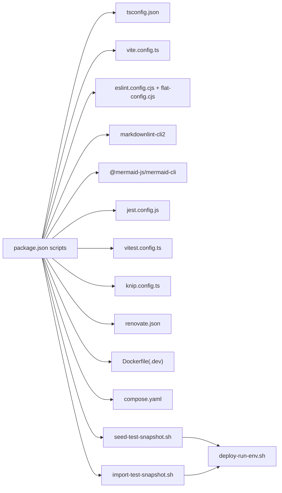

**Diagram sources**
- [package.json:38-121](file://package.json#L38-L121)
- [tsconfig.json:1-53](file://tsconfig.json#L1-L53)
- [vite.config.ts:1-44](file://vite.config.ts#L1-L44)
- [eslint.config.cjs:1-14](file://eslint.config.cjs#L1-L14)
- [eslint/flat-config.cjs:1-508](file://eslint/flat-config.cjs#L1-L508)
- [.markdownlint.jsonc:1-76](file://.markdownlint.jsonc#L1-L76)
- [scripts/validate-mermaid.sh:1-120](file://scripts/validate-mermaid.sh#L1-L120)
- [jest.config.js:1-72](file://jest.config.js#L1-L72)
- [vitest.config.ts:1-25](file://vitest.config.ts#L1-L25)
- [knip.config.ts:1-55](file://knip.config.ts#L1-L55)
- [renovate.json:1-138](file://renovate.json#L1-L138)
- [Dockerfile:1-76](file://Dockerfile#L1-L76)
- [Dockerfile.dev:1-68](file://Dockerfile.dev#L1-L68)
- [compose.yaml:1-183](file://compose.yaml#L1-L183)
- [scripts/seed-test-snapshot.sh:1-255](file://scripts/seed-test-snapshot.sh#L1-L255)
- [scripts/import-test-snapshot.sh:1-162](file://scripts/import-test-snapshot.sh#L1-L162)
- [scripts/deploy-run-env.sh:1-819](file://scripts/deploy-run-env.sh#L1-L819)

**Section sources**
- [package.json:184-202](file://package.json#L184-L202)
- [knip.config.ts:23-51](file://knip.config.ts#L23-L51)
- [renovate.json:41-137](file://renovate.json#L41-L137)

## Performance Considerations
- TypeScript incremental builds reduce rebuild times.
- Vite code-splitting groups minimize initial payload and improve caching.
- UI asset emission avoids CSP inlined images; adjust assetsInlineLimit if inlining is desired.
- Knip helps prune unused dependencies to reduce bundle sizes and attack surface.
- **Updated** ESLint ignore patterns now exclude `.qoder/**` to prevent unnecessary linting of auto-generated development tool files, improving developer experience and reducing false positives.
- **New**: Qdrant snapshot management significantly reduces test execution time by eliminating expensive training operations through cached vector data.
- **Removed**: Documentation quality assurance tools (markdownlint-cli2, mermaid validation) have been eliminated, removing validation overhead from the development workflow.

## Troubleshooting Guide
- Lint failures
  - Run npm run lint and npm run lint:fix; verify no inline overrides and forbidden text violations.
  - **Updated** Check for `.qoder/**` related issues - this directory is now automatically ignored by ESLint to prevent linting of auto-generated development tool files.
  - **Removed**: Documentation quality assurance tools (markdownlint-cli2, mermaid validation) have been eliminated from the toolchain.
- Test failures
  - Use npm run test or npm run test:ui; review coverage thresholds and sequencer order.
  - **New**: For snapshot-related test failures, run `npm run test:seed-snapshot` to recreate snapshots if they become corrupted.
  - **New**: Check snapshot file integrity in `.local/qdrant-snapshot/` and verify Qdrant connectivity.
- Environment issues
  - Use npm run dev:start and npm run dev:status; check health endpoints and dependency readiness.
  - For auth-enabled environments, ensure Keycloak realms are configured.
- Trivy expiry
  - CI script validates .trivyignore entries; fix or remove expired entries.
- **New**: Qdrant snapshot issues
  - Run `npm run test:seed-snapshot` to recreate snapshots if they become corrupted.
  - Check snapshot file integrity in `.local/qdrant-snapshot/`.
  - Verify Qdrant connectivity and API key configuration.
  - Use `npm run test:restore-snapshot` for manual snapshot restoration.
- **Removed**: Documentation quality assurance troubleshooting is no longer applicable as these tools have been removed.

**Section sources**
- [eslint/flat-config.cjs:114-120](file://eslint/flat-config.cjs#L114-L120)
- [jest.config.js:45-58](file://jest.config.js#L45-L58)
- [scripts/deploy-run-env.sh:411-458](file://scripts/deploy-run-env.sh#L411-L458)
- [scripts/ci-check-trivyignore-expiry.py:30-87](file://scripts/ci-check-trivyignore-expiry.py#L30-L87)
- [scripts/seed-test-snapshot.sh:228-255](file://scripts/seed-test-snapshot.sh#L228-L255)
- [scripts/import-test-snapshot.sh:118-162](file://scripts/import-test-snapshot.sh#L118-L162)

## Conclusion
KAIROS MCP's development tools provide a robust, automated pipeline for building, testing, linting, packaging, and deploying the backend and UI. The combination of strict TypeScript settings, Vite code-splitting, ESLint plugins, Knip, and Renovate ensures maintainable, secure, and efficient development. The environment scripts and Docker/Compose configurations streamline local workflows and reproducible deployments. **Updated** ESLint configuration now excludes `.qoder/**` from linting scrutiny, improving developer experience by preventing false positives from auto-generated development tool files. **New**: The Qdrant snapshot management system provides significant performance improvements for CI/local testing by caching trained vector data, eliminating expensive training operations during test execution. **Removed**: Documentation quality assurance system with markdownlint-cli2 and mermaid validation has been eliminated from the toolchain, simplifying the development workflow while maintaining essential code quality standards.

## Appendices

### Appendix A: Key npm Scripts Reference
- Build and packaging
  - build, ui:build, docker:build, docker:publish, pack, npm:publish
- Development lifecycle
  - dev:start, dev:stop, dev:restart, dev:status, dev:logs, dev:deploy
- Testing
  - test, test:ui, test:load, test:ui:watch, **New**: test:seed-snapshot, test:restore-snapshot
- Quality and maintenance
  - lint, lint:fix, lint:skills, verify:clean, knip, ensure-coding-rules
  - **Removed**: lint:markdown, lint:markdown:fix, lint:mermaid
- Versioning and releases
  - release:major, release:minor, release:patch, release:rc, release:pre, release:beta
  - version:sync, version:sync-skills, helm:sync-app-version, compose:sync-app-tag

**Section sources**
- [package.json:38-121](file://package.json#L38-L121)

### Appendix B: Environment Variables and Ports
- Ports
  - dev: 3300 (app), 9390 (metrics)
  - dev_simple: 4300 (app), 9490 (metrics)
  - prod: 3500 (app), 9390 (metrics)
- Key variables
  - QDRANT_URL, QDRANT_API_KEY, QDRANT_COLLECTION
  - TEI_BASE_URL
  - REDIS_URL, KAIROS_REDIS_PREFIX
  - LOG_TARGET, LOG_LEVEL, LOG_FORMAT
- **New**: Qdrant snapshot variables
  - QDRANT_SNAPSHOT_DIR: Directory for snapshot storage
  - CI: Flag for CI mode operation

**Section sources**
- [scripts/deploy-run-env.sh:93-110](file://scripts/deploy-run-env.sh#L93-L110)
- [compose.yaml:53-137](file://compose.yaml#L53-L137)

### Appendix C: ESLint Ignore Patterns
**Updated** The ESLint configuration now includes enhanced ignore patterns to improve developer experience:

- **New Addition**: `.qoder/**` - Excludes auto-generated development tool files from linting scrutiny
- **Existing Patterns**: node_modules/**, .venv/**, dist/**, .kairos/**, .kairos-work/**, .local/**, .git/**, .turbo/**, .next/**, etc.
- **Purpose**: Prevents false positives and improves developer experience by excluding auto-generated content from linting

These ignore patterns ensure that generated development tool files don't trigger linting errors, allowing developers to focus on meaningful code improvements rather than false positive warnings.

**Section sources**
- [eslint/flat-config.cjs:25-112](file://eslint/flat-config.cjs#L25-L112)

### Appendix D: Documentation Quality Assurance Reference
**Removed**: Documentation quality assurance system has been eliminated from the codebase. The following tools and configurations are no longer available:

- **Removed**: markdownlint-cli2 integration for comprehensive markdown documentation validation
- **Removed**: Mermaid diagram validation system using @mermaid-js/mermaid-cli for structural diagram integrity checking
- **Removed**: validate-mermaid.sh script for automated mermaid syntax validation
- **Removed**: .markdownlint.jsonc configuration file for custom markdown linting rules
- **Removed**: .puppeteer-config.json configuration for mermaid diagram rendering

**Section sources**
- [scripts/validate-mermaid.sh:1-120](file://scripts/validate-mermaid.sh#L1-L120)

### Appendix E: Qdrant Snapshot Management Reference
**New**: Comprehensive reference for Qdrant snapshot management system:

#### Snapshot Management Commands
- `npm run test:seed-snapshot`: Create and cache Qdrant snapshots for test adapters
- `npm run test:restore-snapshot`: Manually restore snapshots from cache

#### Snapshot Files
- Main collection: `.local/qdrant-snapshot/kairos_ci.snapshot`
- Traces collection: `.local/qdrant-snapshot/kairos_ci_traces.snapshot`

#### Integration Points
- CI mode: Automatic snapshot seeding/restoration in dev_simple environment
- Local mode: Manual snapshot management with authentication support
- Deployment integration: Seamless snapshot import during environment startup

#### Troubleshooting
- Corrupted snapshots: Recreate using `npm run test:seed-snapshot`
- Missing snapshots: Generate in CI mode or manually in dev_simple environment
- Connection issues: Verify QDRANT_URL and API key configuration

**Section sources**
- [scripts/seed-test-snapshot.sh:1-255](file://scripts/seed-test-snapshot.sh#L1-L255)
- [scripts/import-test-snapshot.sh:1-162](file://scripts/import-test-snapshot.sh#L1-L162)
- [scripts/deploy-run-env.sh:346-370](file://scripts/deploy-run-env.sh#L346-L370)