# Development Tools

<cite>
**Referenced Files in This Document**
- [package.json](file://package.json)
- [tsconfig.json](file://tsconfig.json)
- [vite.config.ts](file://vite.config.ts)
- [eslint.config.cjs](file://eslint.config.cjs)
- [eslint/flat-config.cjs](file://eslint/flat-config.cjs)
- [jest.config.js](file://jest.config.js)
- [vitest.config.ts](file://vitest.config.ts)
- [scripts/build-embed-docs.ts](file://scripts/build-embed-docs.ts)
- [scripts/build-vite-ui-env-define.ts](file://scripts/build-vite-ui-env-define.ts)
- [Dockerfile](file://Dockerfile)
- [Dockerfile.dev](file://Dockerfile.dev)
- [compose.yaml](file://compose.yaml)
- [.trivyignore](file://.trivyignore)
- [scripts/ci-check-trivyignore-expiry.py](file://scripts/ci-check-trivyignore-expiry.py)
- [scripts/deploy-run-env.sh](file://scripts/deploy-run-env.sh)
- [scripts/dev-node-use.sh](file://scripts/dev-node-use.sh)
- [scripts/seed-test-snapshot.sh](file://scripts/seed-test-snapshot.sh)
- [scripts/import-test-snapshot.sh](file://scripts/import-test-snapshot.sh)
- [scripts/validate-mermaid.sh](file://scripts/validate-mermaid.sh)
- [.markdownlint.jsonc](file://.markdownlint.jsonc)
- [.puppeteer-config.json](file://.puppeteer-config.json)
- [knip.config.ts](file://knip.config.ts)
- [renovate.json](file://renovate.json)
- [.devcontainer/README.md](file://.devcontainer/README.md)
- [.devcontainer/devcontainer-fullstack.json](file://.devcontainer/devcontainer-fullstack.json)
- [.devcontainer/devcontainer.json.base](file://.devcontainer/devcontainer.json.base)
- [.devcontainer/validate.sh](file://.devcontainer/validate.sh)
- [.devcontainer/docker-compose.extend.yml](file://.devcontainer/docker-compose.extend.yml)
- [.devcontainer/docker-compose-fullstack.extend.yml](file://.devcontainer/docker-compose-fullstack.extend.yml)
- [scripts/sync-wiki.sh](file://scripts/sync-wiki.sh)
- [src/cli/commands/cli-train.ts](file://src/cli/commands/cli-train.ts)
- [src/tools/artifact-mime.ts](file://src/tools/artifact-mime.ts)
- [src/tools/artifact-relative-path.ts](file://src/tools/artifact-relative-path.ts)
- [src/tools/train-artifact-adapter-uri.ts](file://src/tools/train-artifact-adapter-uri.ts)
- [src/tools/artifact-catalog.ts](file://src/tools/artifact-catalog.ts)
- [src/tools/skill-export/artifact-files.ts](file://src/tools/skill-export/artifact-files.ts)
- [src/http/http-export-artifact-download-routes.ts](file://src/http/http-export-artifact-download-routes.ts)
- [src/services/memory/store-artifact.ts](file://src/services/memory/store-artifact.ts)
- [tests/integration/cli-train-batch.test.ts](file://tests/integration/cli-train-batch.test.ts)
- [docs/CLI.md](file://docs/CLI.md)
- [docs/architecture/artifacts.md](file://docs/architecture/artifacts.md)
</cite>

## Update Summary
**Changes Made**
- Enhanced artifact handling capabilities documentation with improved automatic artifact discovery and upload functionality
- Updated CLI training documentation to reflect new automatic artifact discovery and upload workflow
- Enhanced artifact management workflow documentation with comprehensive MIME type handling and validation
- Added detailed artifact catalog and export system documentation
- Updated artifact sanitization and security validation processes

## Table of Contents
1. [Introduction](#introduction)
2. [Project Structure](#project-structure)
3. [Core Components](#core-components)
4. [Architecture Overview](#architecture-overview)
5. [Detailed Component Analysis](#detailed-component-analysis)
6. [Dependency Analysis](#dependency-analysis)
7. [Performance Considerations](#performance-considerations)
8. [Troubleshooting Guide](#troubleshooting-guide)
9. [Conclusion](#conclusion)
10. [Appendices](#appendices)

## Introduction
This document describes the development tools and workflows for KAIROS MCP. It covers the build system (TypeScript, Vite, and asset management), code quality tooling (ESLint, formatting, and security scanning), documentation generation for embedded resources and API references, development environment setup, debugging, local workflows, code standards, pull request processes, release management, and deployment preparation.

## Project Structure
The repository is a monorepo-style Node.js project with:
- A backend server written in TypeScript under src/
- A React-based UI built with Vite under src/ui/
- Scripts for building, testing, linting, packaging, and deployment under scripts/
- Docker images for production and development
- Compose configuration for local orchestration
- ESLint flat config with custom plugins and rules
- Knip configuration for unused dependency detection
- Renovate configuration for automated dependency updates
- **New**: Comprehensive Dev Container development infrastructure under .devcontainer/
- **New**: Enhanced documentation quality assurance system with markdownlint-cli2 and mermaid validation
- **New**: Advanced artifact handling system with automatic discovery and upload capabilities

```mermaid
graph TB
subgraph "Build and Tooling"
Pkg["package.json<br/>scripts and engines"]
TS["tsconfig.json<br/>backend TS settings"]
ViteCfg["vite.config.ts<br/>UI build config"]
ESLintCfg["eslint.config.cjs<br/>flat config entry"]
ESLintFlat["eslint/flat-config.cjs<br/>rules and plugins"]
JestCfg["jest.config.js<br/>backend tests"]
VitestCfg["vitest.config.ts<br/>UI tests"]
Knip["knip.config.ts<br/>unused deps"]
Renovate["renovate.json<br/>automations"]
end
subgraph "Documentation Quality"
MDL["markdownlint-cli2<br/>docs validation"]
Mermaid["validate-mermaid.sh<br/>diagram validation"]
Puppeteer[".puppeteer-config.json<br/>mermaid rendering"]
end
subgraph "Dev Container Infrastructure"
DevContainer[".devcontainer/<br/>development containers"]
Simple["devcontainer.json.base<br/>simple config"]
Fullstack["devcontainer-fullstack.json<br/>fullstack config"]
Validator["validate.sh<br/>configuration validation"]
DockerExt["docker-compose.extend.yml<br/>simple compose"]
FullstackExt["docker-compose-fullstack.extend.yml<br/>fullstack compose"]
end
subgraph "Runtime and Packaging"
Docker["Dockerfile<br/>runtime image"]
DockerDev["Dockerfile.dev<br/>dev-from-source"]
Compose["compose.yaml<br/>local stack"]
Trivy["trivyignore<br/>security exemptions"]
end
subgraph "Scripts"
BuildDocs["scripts/build-embed-docs.ts<br/>embed docs generator"]
BuildEnv["scripts/build-vite-ui-env-define.ts<br/>UI env define"]
EnvSh["scripts/deploy-run-env.sh<br/>dev/prod lifecycle + snapshot integration"]
DevNode["scripts/dev-node-use.sh<br/>Node version switcher"]
TrivyExpiry["scripts/ci-check-trivyignore-expiry.py<br/>expiry validator"]
SeedSnap["scripts/seed-test-snapshot.sh<br/>Qdrant snapshot seed"]
ImportSnap["scripts/import-test-snapshot.sh<br/>Qdrant snapshot import"]
ValidateMermaid["scripts/validate-mermaid.sh<br/>mermaid validation"]
SyncWiki["scripts/sync-wiki.sh<br/>wiki synchronization"]
end
subgraph "Artifact Handling System"
ArtifactCLI["src/cli/commands/cli-train.ts<br/>automatic artifact discovery"]
ArtifactMime["src/tools/artifact-mime.ts<br/>MIME type validation"]
ArtifactCatalog["src/tools/artifact-catalog.ts<br/>artifact listing"]
ArtifactStore["src/services/memory/store-artifact.ts<br/>artifact storage"]
ArtifactExport["src/http/http-export-artifact-download-routes.ts<br/>artifact download"]
SkillExport["src/tools/skill-export/artifact-files.ts<br/>export handling"]
end
Pkg --> TS
Pkg --> ViteCfg
Pkg --> ESLintCfg
ESLintCfg --> ESLintFlat
Pkg --> JestCfg
Pkg --> VitestCfg
Pkg --> Knip
Pkg --> Renovate
Pkg --> MDL
Pkg --> Mermaid
Pkg --> Puppeteer
Pkg --> DevContainer
Pkg --> Docker
Pkg --> DockerDev
Pkg --> Compose
Pkg --> Trivy
Pkg --> BuildDocs
ViteCfg --> BuildEnv
Pkg --> EnvSh
Pkg --> DevNode
Pkg --> TrivyExpiry
EnvSh --> SeedSnap
EnvSh --> ImportSnap
Pkg --> ValidateMermaid
Pkg --> SyncWiki
DevContainer --> Simple
DevContainer --> Fullstack
DevContainer --> Validator
DevContainer --> DockerExt
DevContainer --> FullstackExt
ArtifactCLI --> ArtifactMime
ArtifactCLI --> ArtifactCatalog
ArtifactMime --> ArtifactStore
ArtifactCatalog --> ArtifactStore
ArtifactExport --> SkillExport
```

**Diagram sources**
- [package.json:38-121](file://package.json#L38-L121)
- [tsconfig.json:1-53](file://tsconfig.json#L1-53)
- [vite.config.ts:1-44](file://vite.config.ts#L1-L44)
- [eslint.config.cjs:1-14](file://eslint.config.cjs#L1-L14)
- [eslint/flat-config.cjs:1-508](file://eslint/flat-config.cjs#L1-L508)
- [jest.config.js:1-72](file://jest.config.js#L1-L72)
- [vitest.config.ts:1-25](file://vitest.config.ts#L1-L25)
- [knip.config.ts:1-55](file://knip.config.ts#L1-L55)
- [renovate.json:1-138](file://renovate.json#L1-L138)
- [.markdownlint.jsonc:1-76](file://.markdownlint.jsonc#L1-L76)
- [scripts/validate-mermaid.sh:1-120](file://scripts/validate-mermaid.sh#L1-L120)
- [.puppeteer-config.json:1-4](file://.puppeteer-config.json#L1-L4)
- [Dockerfile:1-76](file://Dockerfile#L1-L76)
- [Dockerfile.dev:1-68](file://Dockerfile.dev#L1-L68)
- [compose.yaml:1-183](file://compose.yaml#L1-L183)
- [.trivyignore:1-8](file://.trivyignore#L1-L8)
- [scripts/build-embed-docs.ts:1-330](file://scripts/build-embed-docs.ts#L1-L330)
- [scripts/build-vite-ui-env-define.ts:1-24](file://scripts/build-vite-ui-env-define.ts#L1-L24)
- [scripts/deploy-run-env.sh:1-819](file://scripts/deploy-run-env.sh#L1-L819)
- [scripts/dev-node-use.sh:1-26](file://scripts/dev-node-use.sh#L1-L26)
- [scripts/ci-check-trivyignore-expiry.py:1-87](file://scripts/ci-check-trivyignore-expiry.py#L1-L87)
- [scripts/seed-test-snapshot.sh:1-255](file://scripts/seed-test-snapshot.sh#L1-L255)
- [scripts/import-test-snapshot.sh:1-162](file://scripts/import-test-snapshot.sh#L1-L162)
- [.devcontainer/README.md:1-212](file://.devcontainer/README.md#L1-L212)
- [.devcontainer/devcontainer-fullstack.json:1-92](file://.devcontainer/devcontainer-fullstack.json#L1-L92)
- [.devcontainer/devcontainer.json.base:1-84](file://.devcontainer/devcontainer.json.base#L1-L84)
- [.devcontainer/validate.sh:1-241](file://.devcontainer/validate.sh#L1-L241)
- [.devcontainer/docker-compose.extend.yml:1-34](file://.devcontainer/docker-compose.extend.yml#L1-L34)
- [.devcontainer/docker-compose-fullstack.extend.yml:1-32](file://.devcontainer/docker-compose-fullstack.extend.yml#L1-L32)
- [scripts/sync-wiki.sh:1-78](file://scripts/sync-wiki.sh#L1-L78)
- [src/cli/commands/cli-train.ts:1-328](file://src/cli/commands/cli-train.ts#L1-L328)
- [src/tools/artifact-mime.ts:1-50](file://src/tools/artifact-mime.ts#L1-L50)
- [src/tools/artifact-relative-path.ts:1-28](file://src/tools/artifact-relative-path.ts#L1-L28)
- [src/tools/train-artifact-adapter-uri.ts:1-37](file://src/tools/train-artifact-adapter-uri.ts#L1-L37)
- [src/tools/artifact-catalog.ts:1-117](file://src/tools/artifact-catalog.ts#L1-L117)
- [src/tools/skill-export/artifact-files.ts:1-88](file://src/tools/skill-export/artifact-files.ts#L1-L88)
- [src/http/http-export-artifact-download-routes.ts:1-61](file://src/http/http-export-artifact-download-routes.ts#L1-L61)
- [src/services/memory/store-artifact.ts:1-301](file://src/services/memory/store-artifact.ts#L1-L301)

**Section sources**
- [package.json:1-207](file://package.json#L1-L207)
- [tsconfig.json:1-53](file://tsconfig.json#L1-L53)
- [vite.config.ts:1-44](file://vite.config.ts#L1-L44)
- [eslint.config.cjs:1-14](file://eslint.config.cjs#L1-L14)
- [eslint/flat-config.cjs:1-508](file://eslint/flat-config.cjs#L1-L508)
- [jest.config.js:1-72](file://jest.config.js#L1-L72)
- [vitest.config.ts:1-25](file://vitest.config.ts#L1-L25)
- [knip.config.ts:1-55](file://knip.config.ts#L1-L55)
- [renovate.json:1-138](file://renovate.json#L1-L138)
- [.markdownlint.jsonc:1-76](file://.markdownlint.jsonc#L1-L76)
- [scripts/validate-mermaid.sh:1-120](file://scripts/validate-mermaid.sh#L1-L120)
- [.puppeteer-config.json:1-4](file://.puppeteer-config.json#L1-L4)
- [Dockerfile:1-76](file://Dockerfile#L1-L76)
- [Dockerfile.dev:1-68](file://Dockerfile.dev#L1-L68)
- [compose.yaml:1-183](file://compose.yaml#L1-L183)
- [.trivyignore:1-8](file://.trivyignore#L1-L8)
- [scripts/build-embed-docs.ts:1-330](file://scripts/build-embed-docs.ts#L1-L330)
- [scripts/build-vite-ui-env-define.ts:1-24](file://scripts/build-vite-ui-env-define.ts#L1-L24)
- [scripts/deploy-run-env.sh:1-819](file://scripts/deploy-run-env.sh#L1-L819)
- [scripts/dev-node-use.sh:1-26](file://scripts/dev-node-use.sh#L1-L26)
- [scripts/ci-check-trivyignore-expiry.py:1-87](file://scripts/ci-check-trivyignore-expiry.py#L1-L87)
- [scripts/seed-test-snapshot.sh:1-255](file://scripts/seed-test-snapshot.sh#L1-L255)
- [scripts/import-test-snapshot.sh:1-162](file://scripts/import-test-snapshot.sh#L1-L162)
- [.devcontainer/README.md:1-212](file://.devcontainer/README.md#L1-L212)
- [.devcontainer/devcontainer-fullstack.json:1-92](file://.devcontainer/devcontainer-fullstack.json#L1-L92)
- [.devcontainer/devcontainer.json.base:1-84](file://.devcontainer/devcontainer.json.base#L1-L84)
- [.devcontainer/validate.sh:1-241](file://.devcontainer/validate.sh#L1-L241)
- [.devcontainer/docker-compose.extend.yml:1-34](file://.devcontainer/docker-compose.extend.yml#L1-L34)
- [.devcontainer/docker-compose-fullstack.extend.yml:1-32](file://.devcontainer/docker-compose-fullstack.extend.yml#L1-L32)
- [scripts/sync-wiki.sh:1-78](file://scripts/sync-wiki.sh#L1-L78)

## Core Components
- Build system
  - TypeScript compilation for backend with strict settings and incremental builds.
  - Vite-based UI build with code-splitting groups and asset emission strategy.
- Code quality
  - ESLint flat config with custom plugins for forbidden text, CodeQL comment integrity, and MCP widget safety.
  - **New**: Comprehensive documentation quality assurance system with markdownlint-cli2 for markdown validation and mermaid diagram validation.
  - Jest configuration for backend tests with coverage thresholds and sequencer.
  - Vitest configuration for UI tests with jsdom environment.
  - Knip unused dependency detection with tailored ignore lists.
- Documentation generation
  - Build-time embedding of markdown docs into a TypeScript module for runtime access.
- Security scanning
  - Trivy ignore list with expiry validation in CI.
- Development environment
  - Docker images for production and development-from-source.
  - Docker Compose for local orchestration of Qdrant, optional Redis, Postgres, and Keycloak.
  - Environment script for lifecycle management and health checks with integrated Qdrant snapshot support.
- **New**: Comprehensive Dev Container development infrastructure
  - Two-tier Dev Container configurations: simple (Node.js + Qdrant) and fullstack (with Valkey, Postgres, Keycloak).
  - Automated validation system with JSON/YAML syntax checking, symlink verification, and container build testing.
  - Helper scripts for seamless configuration switching between simple and fullstack modes.
- **New**: Qdrant snapshot management system
  - Automated snapshot creation and restoration for CI/local test caching.
  - Integration with deployment environment for seamless test execution.
- **New**: Advanced artifact handling system
  - Automatic artifact discovery and upload in CLI training workflows.
  - Comprehensive MIME type validation and sanitization.
  - Artifact catalog management and export capabilities.
  - Secure artifact storage with SHA256 validation and relative path handling.
- Automation
  - Renovate for automated dependency updates across npm, GitHub Actions, Dockerfiles, and Helm.
  - **New**: Wiki synchronization workflow for forever-branch lifecycle management.

**Section sources**
- [tsconfig.json:1-53](file://tsconfig.json#L1-L53)
- [vite.config.ts:1-44](file://vite.config.ts#L1-L44)
- [eslint/flat-config.cjs:1-508](file://eslint/flat-config.cjs#L1-L508)
- [jest.config.js:1-72](file://jest.config.js#L1-L72)
- [vitest.config.ts:1-25](file://vitest.config.ts#L1-L25)
- [knip.config.ts:1-55](file://knip.config.ts#L1-L55)
- [scripts/build-embed-docs.ts:1-330](file://scripts/build-embed-docs.ts#L1-L330)
- [Dockerfile:1-76](file://Dockerfile#L1-L76)
- [Dockerfile.dev:1-68](file://Dockerfile.dev#L1-L68)
- [compose.yaml:1-183](file://compose.yaml#L1-L183)
- [scripts/deploy-run-env.sh:346-370](file://scripts/deploy-run-env.sh#L346-L370)
- [scripts/seed-test-snapshot.sh:1-255](file://scripts/seed-test-snapshot.sh#L1-L255)
- [scripts/import-test-snapshot.sh:1-162](file://scripts/import-test-snapshot.sh#L1-L162)
- [renovate.json:1-138](file://renovate.json#L1-L138)
- [.devcontainer/README.md:1-212](file://.devcontainer/README.md#L1-L212)
- [scripts/sync-wiki.sh:1-78](file://scripts/sync-wiki.sh#L1-L78)

## Architecture Overview
The development toolchain integrates build, test, lint, packaging, and deployment steps orchestrated by npm scripts. The backend compiles to dist/, the UI builds to dist/ui/, and embedded docs are generated at build time. Docker images encapsulate runtime environments, while Compose provisions local infrastructure. **New**: Comprehensive Dev Container infrastructure provides consistent, reproducible development environments with pre-configured dependencies and automated validation. **New**: Enhanced documentation quality assurance system ensures comprehensive markdown and diagram validation throughout the development lifecycle. **New**: Advanced artifact handling system provides automatic artifact discovery, validation, and upload capabilities for streamlined training workflows.

```mermaid
graph TB
NPM["npm scripts<br/>package.json"]
TSC["tsc<br/>tsconfig.json"]
Vite["vite build<br/>vite.config.ts"]
ESL["ESLint<br/>eslint.config.cjs + flat-config.cjs"]
MDL["markdownlint-cli2<br/>.markdownlint.jsonc"]
Mermaid["validate-mermaid.sh<br/>@mermaid-js/mermaid-cli"]
Jest["Jest<br/>jest.config.js"]
Vitest["Vitest<br/>vitest.config.ts"]
Knip["Knip<br/>knip.config.ts"]
DevContainer["Dev Container<br/>.devcontainer/"]
BuildDocs["Embed Docs<br/>scripts/build-embed-docs.ts"]
DockerProd["Dockerfile<br/>runtime image"]
DockerDev["Dockerfile.dev<br/>dev-from-source"]
Compose["compose.yaml<br/>local stack"]
EnvSh["deploy-run-env.sh<br/>lifecycle + snapshot integration"]
SeedSnap["seed-test-snapshot.sh<br/>snapshot seed"]
ImportSnap["import-test-snapshot.sh<br/>snapshot import"]
ValidateMermaid["validate-mermaid.sh<br/>diagram validation"]
SyncWiki["sync-wiki.sh<br/>wiki synchronization"]
ArtifactCLI["CLI Training<br/>automatic artifact handling"]
ArtifactMime["MIME Validation<br/>artifact type safety"]
ArtifactCatalog["Artifact Catalog<br/>listing and management"]
ArtifactStore["Artifact Storage<br/>secure persistence"]
ArtifactExport["Artifact Export<br/>download and distribution"]
NPM --> TSC
NPM --> Vite
NPM --> ESL
NPM --> MDL
NPM --> Mermaid
NPM --> Jest
NPM --> Vitest
NPM --> Knip
NPM --> DevContainer
NPM --> BuildDocs
NPM --> DockerProd
NPM --> DockerDev
NPM --> Compose
NPM --> EnvSh
EnvSh --> SeedSnap
EnvSh --> ImportSnap
NPM --> ValidateMermaid
NPM --> SyncWiki
ArtifactCLI --> ArtifactMime
ArtifactCLI --> ArtifactCatalog
ArtifactMime --> ArtifactStore
ArtifactCatalog --> ArtifactStore
ArtifactExport --> ArtifactStore
```

**Diagram sources**
- [package.json:38-121](file://package.json#L38-L121)
- [tsconfig.json:1-53](file://tsconfig.json#L1-L53)
- [vite.config.ts:1-44](file://vite.config.ts#L1-L44)
- [eslint.config.cjs:1-14](file://eslint.config.cjs#L1-L14)
- [eslint/flat-config.cjs:1-508](file://eslint/flat-config.cjs#L1-L508)
- [.markdownlint.jsonc:1-76](file://.markdownlint.jsonc#L1-L76)
- [scripts/validate-mermaid.sh:1-120](file://scripts/validate-mermaid.sh#L1-L120)
- [jest.config.js:1-72](file://jest.config.js#L1-L72)
- [vitest.config.ts:1-25](file://vitest.config.ts#L1-L25)
- [knip.config.ts:1-55](file://knip.config.ts#L1-L55)
- [.devcontainer/README.md:1-212](file://.devcontainer/README.md#L1-L212)
- [scripts/build-embed-docs.ts:1-330](file://scripts/build-embed-docs.ts#L1-L330)
- [Dockerfile:1-76](file://Dockerfile#L1-L76)
- [Dockerfile.dev:1-68](file://Dockerfile.dev#L1-L68)
- [compose.yaml:1-183](file://compose.yaml#L1-L183)
- [scripts/deploy-run-env.sh:1-819](file://scripts/deploy-run-env.sh#L1-L819)
- [scripts/seed-test-snapshot.sh:1-255](file://scripts/seed-test-snapshot.sh#L1-L255)
- [scripts/import-test-snapshot.sh:1-162](file://scripts/import-test-snapshot.sh#L1-L162)
- [src/cli/commands/cli-train.ts:1-328](file://src/cli/commands/cli-train.ts#L1-L328)
- [src/tools/artifact-mime.ts:1-50](file://src/tools/artifact-mime.ts#L1-L50)
- [src/tools/artifact-catalog.ts:1-117](file://src/tools/artifact-catalog.ts#L1-L117)
- [src/services/memory/store-artifact.ts:1-301](file://src/services/memory/store-artifact.ts#L1-L301)
- [src/http/http-export-artifact-download-routes.ts:1-61](file://src/http/http-export-artifact-download-routes.ts#L1-L61)

## Detailed Component Analysis

### Build System: TypeScript and Vite
- TypeScript
  - Strict compiler options, ES2022 target, NodeNext module resolution, declaration maps, source maps, and incremental builds.
  - Excludes UI and test files from backend build to keep dist minimal.
- Vite (UI)
  - Root at src/ui, base path /ui/, aliases for @/, and explicit asset inlining disabled to emit assets under /ui/assets/.
  - Code-splitting groups for react/react-dom/scheduler, @tiptap, and vendor chunks with prioritization.
  - Chunk size warning limit tuned for the UI bundle.

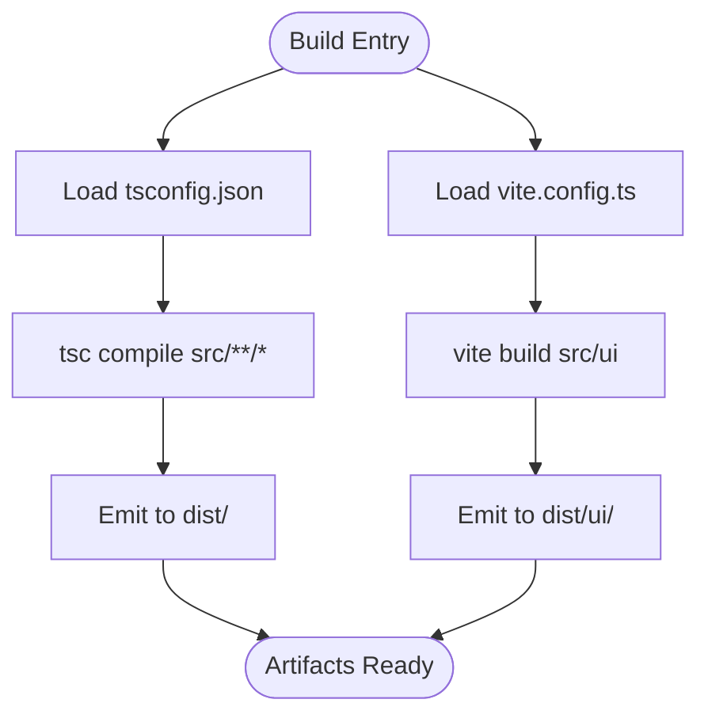

**Diagram sources**
- [tsconfig.json:1-53](file://tsconfig.json#L1-L53)
- [vite.config.ts:1-44](file://vite.config.ts#L1-L44)

**Section sources**
- [tsconfig.json:1-53](file://tsconfig.json#L1-L53)
- [vite.config.ts:1-44](file://vite.config.ts#L1-L44)

### Asset Management and UI Build
- AssetsInlineLimit is set to zero to avoid CSP violations with inlined images; assets are emitted under /ui/assets/*.
- Code-splitting groups ensure optimal loading of large libraries (React, Tiptap, vendor).
- UI environment variables are injected via a shared helper that reads package version.

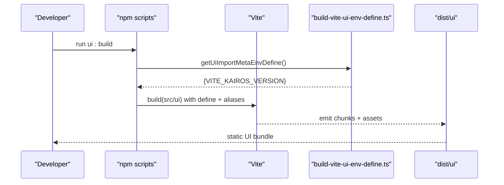

**Diagram sources**
- [vite.config.ts:10-44](file://vite.config.ts#L10-L44)
- [scripts/build-vite-ui-env-define.ts:18-24](file://scripts/build-vite-ui-env-define.ts#L18-L24)

**Section sources**
- [vite.config.ts:10-44](file://vite.config.ts#L10-L44)
- [scripts/build-vite-ui-env-define.ts:1-24](file://scripts/build-vite-ui-env-define.ts#L1-L24)

### Code Quality: ESLint and Plugins
- Flat config entry delegates to eslint/flat-config.cjs.
- Custom plugins:
  - kairos-forbidden-text: enforces brand/protocol wording policies.
  - kairos-codeql-line-comments: validates CodeQL comment integrity.
  - kairos-mcp-widget: enforces safe widget construction for MCP apps.
- Rules:
  - max-lines enforced per file with exceptions for specific files/dirs.
  - no-console errors for backend; relaxed in tests.
  - No test mocks outside unit tests; special allowances for integration/UI tests.
  - No inline ESLint overrides; all rules enforced.
- Parser and project settings:
  - TypeScript ESLint parser and plugin.
  - Separate tsconfigs for backend and UI tests.
- **Updated** Global ignore patterns now include `.qoder/**` to exclude auto-generated development tool files from linting scrutiny, improving developer experience by preventing false positives from generated content.
- **New**: Comprehensive documentation quality assurance system with markdownlint-cli2 and mermaid validation ensures high-quality documentation standards.

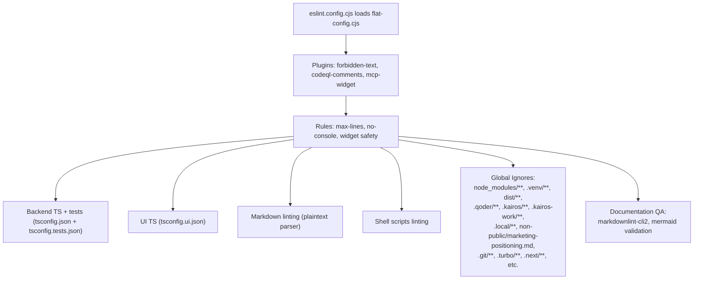

**Diagram sources**
- [eslint.config.cjs:1-14](file://eslint.config.cjs#L1-L14)
- [eslint/flat-config.cjs:1-508](file://eslint/flat-config.cjs#L1-L508)

**Section sources**
- [eslint.config.cjs:1-14](file://eslint.config.cjs#L1-L14)
- [eslint/flat-config.cjs:1-508](file://eslint/flat-config.cjs#L1-L508)

### Documentation Quality Assurance System
**New**: Comprehensive documentation quality assurance system ensures high standards for all project documentation.

#### Markdown Validation with markdownlint-cli2
- Custom configuration (.markdownlint.jsonc) defines project-specific linting rules
- Validates markdown files in docs/, README.md, CONTRIBUTING.md, and SECURITY.md
- Supports automatic fixing with lint:markdown:fix script
- Excludes problematic elements like hard tabs while enforcing best practices

#### Mermaid Diagram Validation
- validate-mermaid.sh script extracts and validates mermaid diagrams from markdown files
- Uses @mermaid-js/mermaid-cli (mmdc) for syntax validation
- Renders diagrams to SVG for visual verification
- Integrates with .puppeteer-config.json for headless browser rendering
- Supports batch validation across entire docs/ directory

#### Integration with Development Workflow
- Automated validation in CI pipelines
- Pre-commit hooks for quality gates
- Developer-friendly error reporting with color-coded output
- Support for both individual file validation and bulk processing

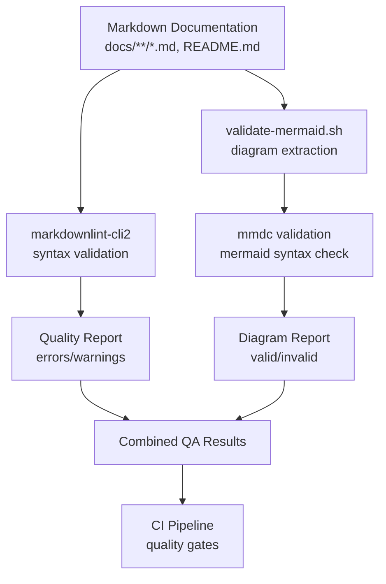

**Diagram sources**
- [.markdownlint.jsonc:1-76](file://.markdownlint.jsonc#L1-L76)
- [scripts/validate-mermaid.sh:1-120](file://scripts/validate-mermaid.sh#L1-L120)
- [.puppeteer-config.json:1-4](file://.puppeteer-config.json#L1-L4)

**Section sources**
- [.markdownlint.jsonc:1-76](file://.markdownlint.jsonc#L1-L76)
- [scripts/validate-mermaid.sh:1-120](file://scripts/validate-mermaid.sh#L1-L120)
- [.puppeteer-config.json:1-4](file://.puppeteer-config.json#L1-L4)

### Dev Container Development Infrastructure
**New**: Comprehensive Dev Container development infrastructure provides consistent, reproducible development environments.

#### Configuration Options
- **Simple Configuration** (devcontainer.json.base): Node.js 24 runtime with Qdrant vector database
- **Fullstack Configuration** (devcontainer-fullstack.json): Includes Valkey, PostgreSQL, and Keycloak
- Automatic switching between configurations via symlink management

#### Validation System
- validate.sh script performs comprehensive validation:
  - JSON/YAML syntax validation for all configuration files
  - Symlink verification and file existence checks
  - Docker Compose merge compatibility testing
  - Container build testing (full mode only)

#### Development Experience
- Live code editing with workspace mounting
- Pre-configured VS Code extensions and settings
- Automated dependency installation and build processes
- Port forwarding for all required services
- Secret management for API keys and credentials

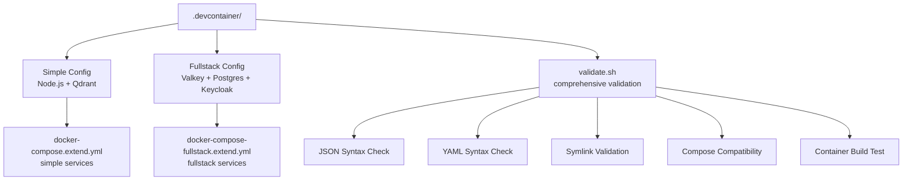

**Diagram sources**
- [.devcontainer/README.md:1-212](file://.devcontainer/README.md#L1-L212)
- [.devcontainer/devcontainer-fullstack.json:1-92](file://.devcontainer/devcontainer-fullstack.json#L1-L92)
- [.devcontainer/devcontainer.json.base:1-84](file://.devcontainer/devcontainer.json.base#L1-L84)
- [.devcontainer/validate.sh:1-241](file://.devcontainer/validate.sh#L1-L241)
- [.devcontainer/docker-compose.extend.yml:1-34](file://.devcontainer/docker-compose.extend.yml#L1-L34)
- [.devcontainer/docker-compose-fullstack.extend.yml:1-32](file://.devcontainer/docker-compose-fullstack.extend.yml#L1-L32)

**Section sources**
- [.devcontainer/README.md:1-212](file://.devcontainer/README.md#L1-L212)
- [.devcontainer/devcontainer-fullstack.json:1-92](file://.devcontainer/devcontainer-fullstack.json#L1-L92)
- [.devcontainer/devcontainer.json.base:1-84](file://.devcontainer/devcontainer.json.base#L1-L84)
- [.devcontainer/validate.sh:1-241](file://.devcontainer/validate.sh#L1-L241)
- [.devcontainer/docker-compose.extend.yml:1-34](file://.devcontainer/docker-compose.extend.yml#L1-L34)
- [.devcontainer/docker-compose-fullstack.extend.yml:1-32](file://.devcontainer/docker-compose-fullstack.extend.yml#L1-L32)

### Advanced Artifact Handling System
**New**: Comprehensive artifact handling system with automatic discovery and upload capabilities for streamlined training workflows.

#### Automatic Artifact Discovery and Upload
The CLI training system now provides intelligent artifact handling:

- **Directory Batch Processing**: When training directories, the CLI automatically discovers co-located artifact files alongside markdown files
- **Automatic MIME Type Inference**: Artifact files are automatically detected and processed based on filename extensions
- **Conditional Upload Logic**: Artifacts are only uploaded when the `--model` flag is provided, preventing accidental artifact storage
- **Batch Result Tracking**: Artifact upload results are tracked alongside adapter training results in batch operations

#### MIME Type Validation and Sanitization
- **Canonical Allowlist**: Comprehensive MIME type validation using a centralized allowlist
- **Extension Mapping**: Automatic MIME type inference from filename extensions
- **Security Validation**: Artifact sanitization rules prevent malicious content injection
- **Content Type Normalization**: Consistent MIME type handling across the system

#### Artifact Storage and Management
- **Secure Storage**: Artifacts are stored with SHA256 validation and metadata tracking
- **Relative Path Handling**: Support for skill-root-relative paths preserving export layout
- **Adapter Association**: Artifacts are properly linked to their parent adapters
- **Export Integration**: Artifacts are included in skill exports with proper file layout

#### Download and Distribution
- **Secure Download Links**: Temporary download URLs with expiration controls
- **Content Validation**: SHA256 verification for downloaded artifacts
- **Format Preservation**: Maintains original artifact content and metadata

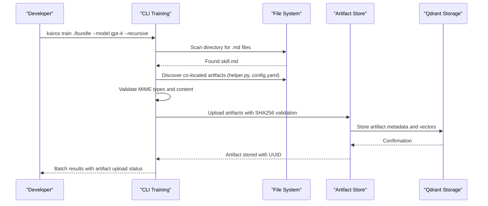

**Diagram sources**
- [src/cli/commands/cli-train.ts:189-222](file://src/cli/commands/cli-train.ts#L189-L222)
- [src/tools/artifact-mime.ts:42-48](file://src/tools/artifact-mime.ts#L42-L48)
- [src/services/memory/store-artifact.ts:168-300](file://src/services/memory/store-artifact.ts#L168-L300)

**Section sources**
- [src/cli/commands/cli-train.ts:1-328](file://src/cli/commands/cli-train.ts#L1-L328)
- [src/tools/artifact-mime.ts:1-50](file://src/tools/artifact-mime.ts#L1-L50)
- [src/tools/artifact-relative-path.ts:1-28](file://src/tools/artifact-relative-path.ts#L1-L28)
- [src/tools/train-artifact-adapter-uri.ts:1-37](file://src/tools/train-artifact-adapter-uri.ts#L1-L37)
- [src/tools/artifact-catalog.ts:1-117](file://src/tools/artifact-catalog.ts#L1-L117)
- [src/tools/skill-export/artifact-files.ts:1-88](file://src/tools/skill-export/artifact-files.ts#L1-L88)
- [src/http/http-export-artifact-download-routes.ts:1-61](file://src/http/http-export-artifact-download-routes.ts#L1-L61)
- [src/services/memory/store-artifact.ts:1-301](file://src/services/memory/store-artifact.ts#L1-L301)

### Testing: Jest, Vitest, and Qdrant Snapshot-Based Testing
- Jest
  - ESM preset with ts-jest, NodeNext module resolution, and isolatedModules.
  - Coverage thresholds configurable via STRICT_COVERAGE environment.
  - Sequencer ensures deterministic ordering for dependent tests.
  - Setup files and global setup/teardown for auth-enabled environments.
- Vitest
  - jsdom environment for UI tests.
  - Reporter selection adapts to CI presence.
- **New**: Qdrant snapshot-based testing infrastructure
  - Automated snapshot creation and restoration for CI/local test caching.
  - Eliminates expensive training operations during test execution.
  - Reduces test execution time by 15-30x (1-2s vs 10-60s per test).
  - Provides deterministic test results without external API dependencies.

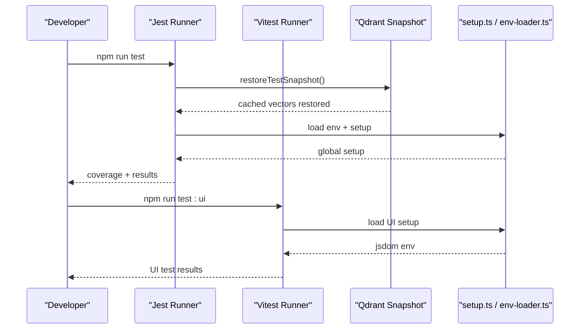

**Diagram sources**
- [jest.config.js:1-72](file://jest.config.js#L1-L72)
- [vitest.config.ts:1-25](file://vitest.config.ts#L1-L25)
- [scripts/seed-test-snapshot.sh:1-255](file://scripts/seed-test-snapshot.sh#L1-L255)
- [scripts/import-test-snapshot.sh:1-162](file://scripts/import-test-snapshot.sh#L1-L162)

**Section sources**
- [jest.config.js:1-72](file://jest.config.js#L1-L72)
- [vitest.config.ts:1-25](file://vitest.config.ts#L1-L25)
- [scripts/seed-test-snapshot.sh:1-255](file://scripts/seed-test-snapshot.sh#L1-L255)
- [scripts/import-test-snapshot.sh:1-162](file://scripts/import-test-snapshot.sh#L1-L162)

### Documentation Generation: Embedded MCP Resources
- The build embeds src/embed-docs/* into a TypeScript module for runtime access.
- Categories:
  - prompts: flat
  - tools: flat
  - resources: nested structure
  - templates: flat
  - mem: read from filesystem at runtime (copied to dist/embed-docs/mem/)
  - meta: collected by slug from mem/ and root markdown files
- Generators:
  - getPrompts(), getTools(), getResources(), getTemplates(), getMetaDoc()
  - listResourceKeys() enumerates all nested keys

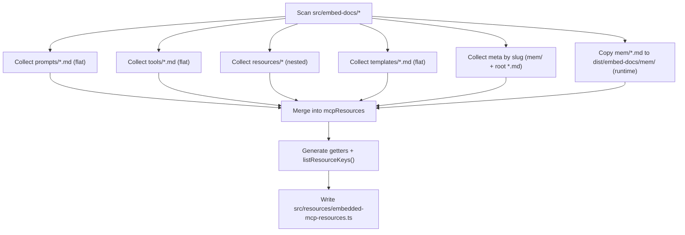

**Diagram sources**
- [scripts/build-embed-docs.ts:107-330](file://scripts/build-embed-docs.ts#L107-L330)

**Section sources**
- [scripts/build-embed-docs.ts:1-330](file://scripts/build-embed-docs.ts#L1-L330)

### Security Scanning: Trivy and Expiry Validation
- .trivyignore contains CVE exemptions with exp:YYYY-MM-DD entries.
- CI script validates expiry dates and fails if expired or invalid entries are found.
- Script warns about entries expiring soon.

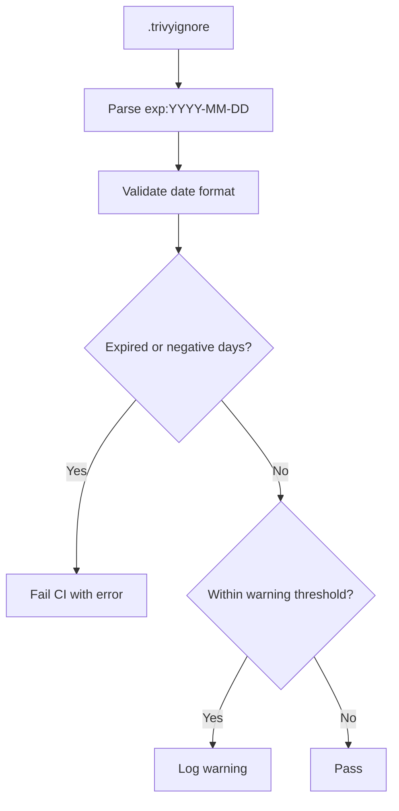

**Diagram sources**
- [.trivyignore:1-8](file://.trivyignore#L1-L8)
- [scripts/ci-check-trivyignore-expiry.py:30-87](file://scripts/ci-check-trivyignore-expiry.py#L30-L87)

**Section sources**
- [.trivyignore:1-8](file://.trivyignore#L1-L8)
- [scripts/ci-check-trivyignore-expiry.py:1-87](file://scripts/ci-check-trivyignore-expiry.py#L1-L87)

### Development Environment: Docker and Compose
- Production image installs the published npm package and exposes health checks.
- Development-from-source image builds locally and runs dist/.
- Compose profiles:
  - Mini: Qdrant + app
  - Fullstack: Qdrant + Redis/Valkey + Postgres + Keycloak
  - Optional UI: Redis Insight for Redis-compatible stores

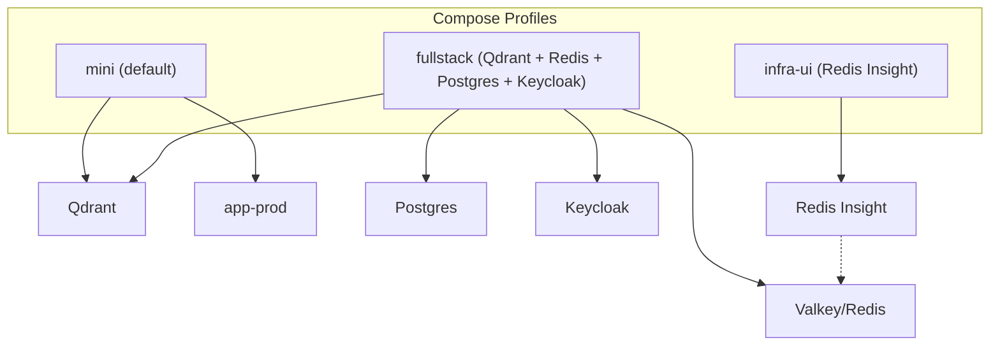

**Diagram sources**
- [compose.yaml:10-183](file://compose.yaml#L10-L183)
- [Dockerfile:1-76](file://Dockerfile#L1-L76)
- [Dockerfile.dev:1-68](file://Dockerfile.dev#L1-L68)

**Section sources**
- [compose.yaml:1-183](file://compose.yaml#L1-L183)
- [Dockerfile:1-76](file://Dockerfile#L1-L76)
- [Dockerfile.dev:1-68](file://Dockerfile.dev#L1-L68)

### Qdrant Snapshot Management System
**New**: The development environment now includes a comprehensive Qdrant snapshot management system for optimizing CI/local testing performance.

#### Snapshot Workflow
The system provides automated snapshot creation and restoration to eliminate expensive training overhead during tests:

1. **Snapshot Seed Process** (`seed-test-snapshot.sh`)
  - Trains test adapters using MCP tools
  - Creates Qdrant snapshots for main and traces collections
  - Downloads snapshots to `.local/qdrant-snapshot/`
  - Supports both local and CI modes

2. **Snapshot Import Process** (`import-test-snapshot.sh`)
  - Restores snapshots to Qdrant collections
  - Drops existing collections before import
  - Verifies snapshot integrity and collection data
  - Handles both main and traces collections

3. **Deployment Integration** (`deploy-run-env.sh`)
  - Automatically seeds snapshots in CI mode for dev_simple environment
  - Imports snapshots before test execution
  - Provides fallback mechanisms for missing snapshots

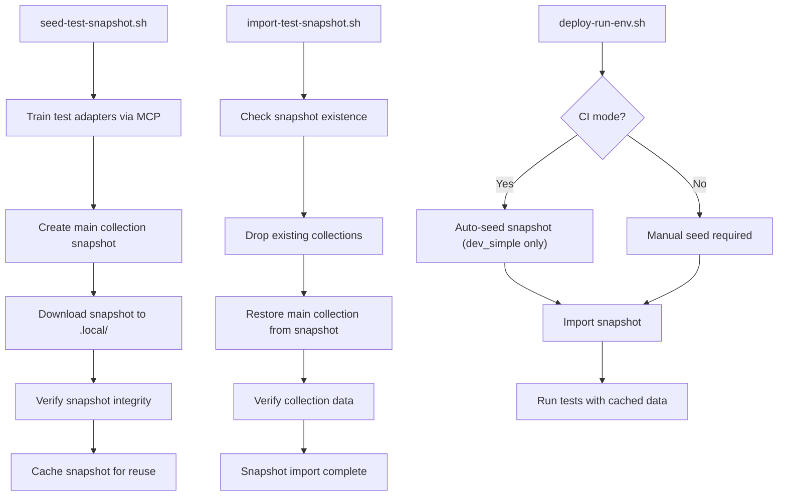

**Diagram sources**
- [scripts/seed-test-snapshot.sh:1-255](file://scripts/seed-test-snapshot.sh#L1-L255)
- [scripts/import-test-snapshot.sh:1-162](file://scripts/import-test-snapshot.sh#L1-L162)
- [scripts/deploy-run-env.sh:346-370](file://scripts/deploy-run-env.sh#L346-L370)

**Section sources**
- [scripts/seed-test-snapshot.sh:1-255](file://scripts/seed-test-snapshot.sh#L1-L255)
- [scripts/import-test-snapshot.sh:1-162](file://scripts/import-test-snapshot.sh#L1-L162)
- [scripts/deploy-run-env.sh:346-370](file://scripts/deploy-run-env.sh#L346-L370)

### Wiki Synchronization and Forever-Branch Lifecycle
**New**: Enhanced wiki synchronization workflow with forever-branch lifecycle management for continuous documentation updates.

#### Synchronization Process
- sync-wiki.sh script automates GitHub Wiki synchronization from .qoder/repowiki/en/content/
- One-way rsync ensures content mirroring without destructive operations
- Automatic commit messages include source commit hash and timestamp
- Supports both authenticated GitHub CLI and SSH key authentication

#### Forever-Branch Strategy
- Continuous synchronization maintains documentation parity with source changes
- Automated updates eliminate manual wiki maintenance overhead
- Version-controlled documentation history with source traceability
- Supports both manual triggers and CI-driven updates

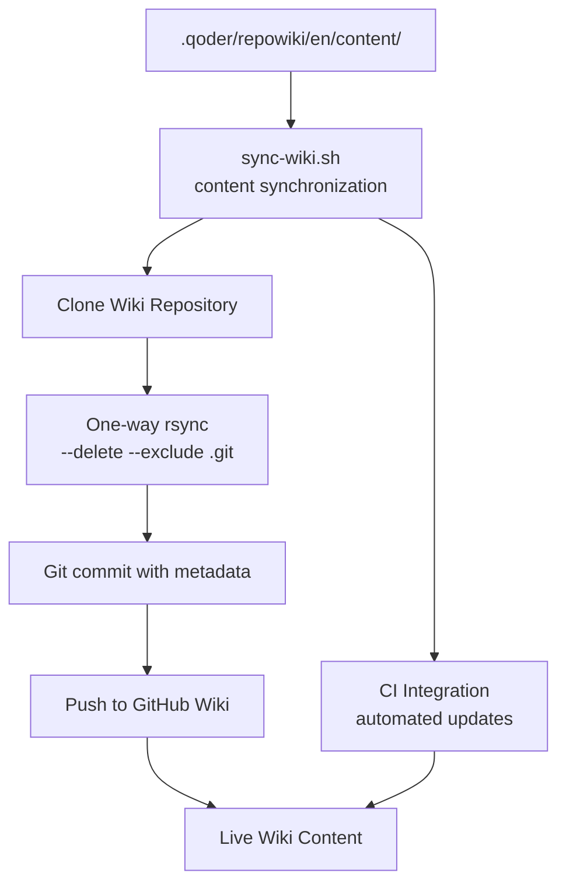

**Diagram sources**
- [scripts/sync-wiki.sh:1-78](file://scripts/sync-wiki.sh#L1-L78)

**Section sources**
- [scripts/sync-wiki.sh:1-78](file://scripts/sync-wiki.sh#L1-L78)

### Development Scripts and Workflows
- npm scripts orchestrate:
  - dev:build, dev:deploy, dev:start, dev:stop, dev:restart, dev:status, dev:logs
  - test, test:ui, test:load
  - ui:build, build, docker:build, docker:publish
  - lint, lint:fix, lint:skills, lint:markdown, lint:markdown:fix, lint:mermaid, verify:clean, knip
  - version sync and release helpers
  - **New**: test:seed-snapshot, test:restore-snapshot for Qdrant snapshot management
  - **New**: devcontainer:validate, devcontainer:validate:full, devcontainer:build, devcontainer:build:fullstack, devcontainer:test for Dev Container validation
- deploy-run-env.sh manages environment lifecycle, health checks, and dependency readiness with integrated snapshot support.
- dev-node-use.sh switches Node version using fnm and .nvmrc.

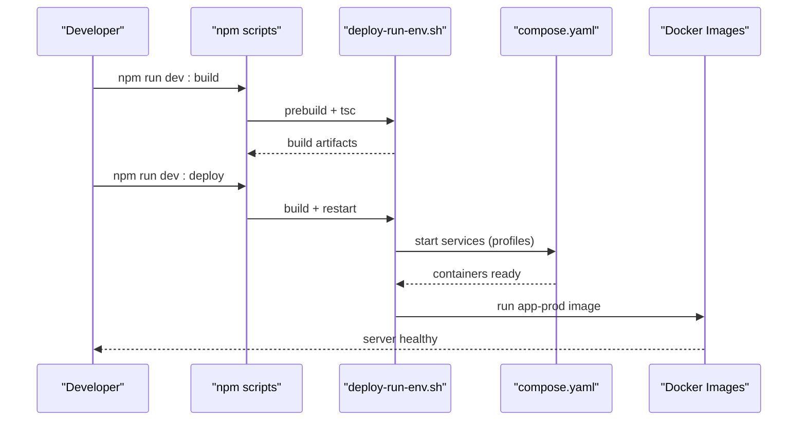

**Diagram sources**
- [package.json:38-121](file://package.json#L38-L121)
- [scripts/deploy-run-env.sh:211-339](file://scripts/deploy-run-env.sh#L211-L339)
- [compose.yaml:10-183](file://compose.yaml#L10-L183)
- [Dockerfile:1-76](file://Dockerfile#L1-L76)

**Section sources**
- [package.json:38-121](file://package.json#L38-L121)
- [scripts/deploy-run-env.sh:1-819](file://scripts/deploy-run-env.sh#L1-L819)
- [scripts/dev-node-use.sh:1-26](file://scripts/dev-node-use.sh#L1-L26)

### Code Standards, Pull Requests, and Release Management
- Code standards
  - ESLint enforces no inline overrides and strict rules for backend and UI.
  - Forbidden text and MCP widget safety rules apply to relevant files.
  - **New**: Comprehensive documentation quality assurance with markdownlint-cli2 and mermaid validation.
  - **New**: Dev Container validation requirements for configuration consistency.
  - **New**: Artifact handling standards for MIME type validation and security.
- Pull requests
  - Knip unused dependencies; CI validates clean working tree for AI coding rules enforcement.
  - Renovate automates dependency updates with grouping and security PRs.
  - **New**: Dev Container validation included in PR checks for configuration quality.
  - **New**: Artifact handling validation for security and compliance.
- Releases
  - Semantic version bump helpers (major, minor, patch, rc, pre, beta).
  - Version sync across compose.yaml, Helm, and skills.

**Section sources**
- [eslint/flat-config.cjs:114-120](file://eslint/flat-config.cjs#L114-L120)
- [knip.config.ts:1-55](file://knip.config.ts#L1-L55)
- [scripts/deploy-run-env.sh:582-668](file://scripts/deploy-run-env.sh#L582-L668)
- [renovate.json:1-138](file://renovate.json#L1-L138)
- [.devcontainer/README.md:182-189](file://.devcontainer/README.md#L182-L189)

## Dependency Analysis
- npm scripts orchestrate all tooling; engines require Node >= 24.
- TypeScript and Vite configurations constrain module resolution and output.
- ESLint flat config centralizes rules and plugins.
- **New**: Comprehensive documentation quality assurance system with markdownlint-cli2 (v0.22.1) and @mermaid-js/mermaid-cli (v11.15.0).
- Knip ignores generated files and build-time-only binaries to avoid false positives.
- Renovate groups updates and automerges security patches.
- **New**: Qdrant snapshot management adds dependencies on curl, Python3, and Node.js for snapshot operations.
- **New**: Dev Container infrastructure requires Docker, Docker Compose, and devcontainer CLI for validation.
- **New**: Wiki synchronization workflow depends on rsync, Git, and GitHub CLI or SSH keys.
- **New**: Artifact handling system introduces dependencies on MIME type validation, artifact sanitization, and secure storage.

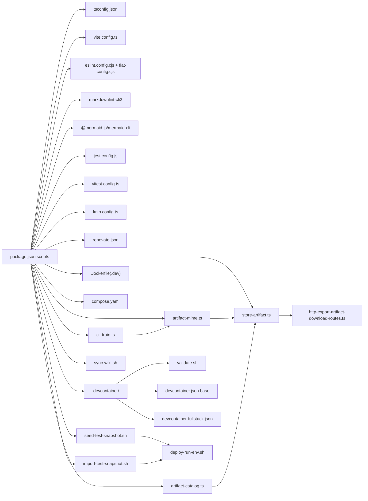

**Diagram sources**
- [package.json:38-121](file://package.json#L38-L121)
- [tsconfig.json:1-53](file://tsconfig.json#L1-L53)
- [vite.config.ts:1-44](file://vite.config.ts#L1-L44)
- [eslint.config.cjs:1-14](file://eslint.config.cjs#L1-L14)
- [eslint/flat-config.cjs:1-508](file://eslint/flat-config.cjs#L1-L508)
- [.markdownlint.jsonc:1-76](file://.markdownlint.jsonc#L1-L76)
- [scripts/validate-mermaid.sh:1-120](file://scripts/validate-mermaid.sh#L1-L120)
- [jest.config.js:1-72](file://jest.config.js#L1-L72)
- [vitest.config.ts:1-25](file://vitest.config.ts#L1-L25)
- [knip.config.ts:1-55](file://knip.config.ts#L1-L55)
- [renovate.json:1-138](file://renovate.json#L1-L138)
- [.devcontainer/README.md:1-212](file://.devcontainer/README.md#L1-L212)
- [Dockerfile:1-76](file://Dockerfile#L1-L76)
- [Dockerfile.dev:1-68](file://Dockerfile.dev#L1-L68)
- [compose.yaml:1-183](file://compose.yaml#L1-L183)
- [scripts/seed-test-snapshot.sh:1-255](file://scripts/seed-test-snapshot.sh#L1-L255)
- [scripts/import-test-snapshot.sh:1-162](file://scripts/import-test-snapshot.sh#L1-L162)
- [scripts/deploy-run-env.sh:1-819](file://scripts/deploy-run-env.sh#L1-L819)
- [scripts/sync-wiki.sh:1-78](file://scripts/sync-wiki.sh#L1-L78)
- [src/cli/commands/cli-train.ts:1-328](file://src/cli/commands/cli-train.ts#L1-L328)
- [src/tools/artifact-mime.ts:1-50](file://src/tools/artifact-mime.ts#L1-L50)
- [src/tools/artifact-catalog.ts:1-117](file://src/tools/artifact-catalog.ts#L1-L117)
- [src/services/memory/store-artifact.ts:1-301](file://src/services/memory/store-artifact.ts#L1-L301)

**Section sources**
- [package.json:184-207](file://package.json#L184-L207)
- [knip.config.ts:23-51](file://knip.config.ts#L23-L51)
- [renovate.json:41-137](file://renovate.json#L41-L137)

## Performance Considerations
- TypeScript incremental builds reduce rebuild times.
- Vite code-splitting groups minimize initial payload and improve caching.
- UI asset emission avoids CSP inlined images; adjust assetsInlineLimit if inlining is desired.
- Knip helps prune unused dependencies to reduce bundle sizes and attack surface.
- **Updated** ESLint ignore patterns now exclude `.qoder/**` to prevent unnecessary linting of auto-generated development tool files, improving developer experience and reducing false positives.
- **New**: Comprehensive documentation quality assurance system adds validation overhead but ensures high documentation standards.
- **New**: Dev Container infrastructure provides consistent performance across different development environments.
- **New**: Qdrant snapshot management significantly reduces test execution time by eliminating expensive training operations through cached vector data.
- **New**: Wiki synchronization workflow operates asynchronously to minimize impact on development workflow.
- **New**: Artifact handling system optimizes training workflows by automatically discovering and uploading co-located artifacts, reducing manual intervention and improving developer productivity.

## Troubleshooting Guide
- Lint failures
  - Run npm run lint and npm run lint:fix; verify no inline overrides and forbidden text violations.
  - **Updated** Check for `.qoder/**` related issues - this directory is now automatically ignored by ESLint to prevent linting of auto-generated development tool files.
  - **New**: For documentation quality issues, run npm run lint:markdown and npm run lint:mermaid to validate markdown and mermaid diagrams.
- Test failures
  - Use npm run test or npm run test:ui; review coverage thresholds and sequencer order.
  - **New**: For snapshot-related test failures, run `npm run test:seed-snapshot` to recreate snapshots if they become corrupted.
  - **New**: Check snapshot file integrity in `.local/qdrant-snapshot/` and verify Qdrant connectivity.
- Environment issues
  - Use npm run dev:start and npm run dev:status; check health endpoints and dependency readiness.
  - For auth-enabled environments, ensure Keycloak realms are configured.
- Trivy expiry
  - CI script validates .trivyignore entries; fix or remove expired entries.
- **New**: Dev Container issues
  - Run `npm run devcontainer:validate` to check configuration syntax and file references.
  - Use `npm run devcontainer:validate:full` for comprehensive build testing.
  - Check Docker and Docker Compose availability; ensure sufficient system resources.
  - Verify symlink configuration and file permissions.
- **New**: Wiki synchronization problems
  - Check GitHub CLI authentication or SSH key configuration.
  - Verify source directory .qoder/repowiki/en/content/ exists and contains content.
  - Review rsync and Git operations for permission issues.
- **New**: Documentation quality issues
  - Use markdownlint-cli2 configuration (.markdownlint.jsonc) for custom rule validation.
  - Run mermaid validation script for diagram syntax checking.
  - Check puppeteer configuration for headless browser rendering.
- **New**: Artifact handling issues
  - Verify MIME type validation using `src/tools/artifact-mime.ts`
  - Check artifact upload permissions and adapter URI resolution
  - Review artifact storage logs for SHA256 validation failures
  - Ensure relative paths follow skill-root-relative conventions

**Section sources**
- [eslint/flat-config.cjs:114-120](file://eslint/flat-config.cjs#L114-L120)
- [jest.config.js:45-58](file://jest.config.js#L45-L58)
- [scripts/deploy-run-env.sh:411-458](file://scripts/deploy-run-env.sh#L411-L458)
- [scripts/ci-check-trivyignore-expiry.py:30-87](file://scripts/ci-check-trivyignore-expiry.py#L30-L87)
- [scripts/seed-test-snapshot.sh:228-255](file://scripts/seed-test-snapshot.sh#L228-L255)
- [scripts/import-test-snapshot.sh:118-162](file://scripts/import-test-snapshot.sh#L118-L162)
- [.devcontainer/validate.sh:1-241](file://.devcontainer/validate.sh#L1-L241)
- [scripts/sync-wiki.sh:1-78](file://scripts/sync-wiki.sh#L1-L78)
- [src/cli/commands/cli-train.ts:189-222](file://src/cli/commands/cli-train.ts#L189-L222)
- [src/tools/artifact-mime.ts:34-48](file://src/tools/artifact-mime.ts#L34-L48)
- [src/services/memory/store-artifact.ts:205-207](file://src/services/memory/store-artifact.ts#L205-L207)

## Conclusion
KAIROS MCP's development tools provide a robust, automated pipeline for building, testing, linting, packaging, and deploying the backend and UI. The combination of strict TypeScript settings, Vite code-splitting, ESLint plugins, Knip, and Renovate ensures maintainable, secure, and efficient development. The environment scripts and Docker/Compose configurations streamline local workflows and reproducible deployments. **Updated** ESLint configuration now excludes `.qoder/**` from linting scrutiny, improving developer experience by preventing false positives from auto-generated development tool files. **New**: Comprehensive Dev Container infrastructure provides consistent, reproducible development environments with automated validation and seamless configuration switching. **New**: Enhanced documentation quality assurance system with markdownlint-cli2 and mermaid validation ensures high standards for all project documentation. **New**: Qdrant snapshot management system provides significant performance improvements for CI/local testing by caching trained vector data, eliminating expensive training operations during test execution. **New**: Wiki synchronization workflow with forever-branch lifecycle ensures continuous documentation updates and maintenance. **New**: Advanced artifact handling system streamlines training workflows with automatic artifact discovery, validation, and upload capabilities, significantly improving developer productivity and reducing manual intervention.

## Appendices

### Appendix A: Key npm Scripts Reference
- Build and packaging
  - build, ui:build, docker:build, docker:publish, pack, npm:publish
- Development lifecycle
  - dev:start, dev:stop, dev:restart, dev:status, dev:logs, dev:deploy
- Testing
  - test, test:ui, test:load, test:ui:watch, **New**: test:seed-snapshot, test:restore-snapshot
- Quality and maintenance
  - lint, lint:fix, lint:skills, lint:markdown, lint:markdown:fix, lint:mermaid, verify:clean, knip, ensure-coding-rules
  - **New**: devcontainer:validate, devcontainer:validate:full, devcontainer:build, devcontainer:build:fullstack, devcontainer:test
- Versioning and releases
  - release:major, release:minor, release:patch, release:rc, release:pre, release:beta
  - version:sync, version:sync-skills, helm:sync-app-version, compose:sync-app-tag

**Section sources**
- [package.json:38-121](file://package.json#L38-L121)

### Appendix B: Environment Variables and Ports
- Ports
  - dev: 3300 (app), 9390 (metrics)
  - dev_simple: 4300 (app), 9490 (metrics)
  - prod: 3500 (app), 9390 (metrics)
- Key variables
  - QDRANT_URL, QDRANT_API_KEY, QDRANT_COLLECTION
  - TEI_BASE_URL
  - REDIS_URL, KAIROS_REDIS_PREFIX
  - LOG_TARGET, LOG_LEVEL, LOG_FORMAT
- **New**: Qdrant snapshot variables
  - QDRANT_SNAPSHOT_DIR: Directory for snapshot storage
  - CI: Flag for CI mode operation
- **New**: Dev Container variables
  - NODE_ENV: Development environment setting
  - OPENAI_API_KEY: API key for embeddings
  - QDRANT_API_KEY: Vector database authentication
  - KEYCLOAK_ADMIN_PASSWORD: OIDC authentication credentials
- **New**: Artifact handling variables
  - ALLOWED_ARTIFACT_MIMES: Configurable MIME type allowlist
  - ARTIFACT_SANITIZATION_RULES: Custom artifact validation rules

**Section sources**
- [scripts/deploy-run-env.sh:93-110](file://scripts/deploy-run-env.sh#L93-L110)
- [compose.yaml:53-137](file://compose.yaml#L53-L137)
- [.devcontainer/devcontainer-fullstack.json:71-81](file://.devcontainer/devcontainer-fullstack.json#L71-L81)
- [.devcontainer/devcontainer.json.base:64-73](file://.devcontainer/devcontainer.json.base#L64-L73)
- [src/tools/artifact-mime.ts:18-22](file://src/tools/artifact-mime.ts#L18-L22)

### Appendix C: ESLint Ignore Patterns
**Updated** The ESLint configuration now includes enhanced ignore patterns to improve developer experience:

- **New Addition**: `.qoder/**` - Excludes auto-generated development tool files from linting scrutiny
- **Existing Patterns**: node_modules/**, .venv/**, dist/**, .kairos/**, .kairos-work/**, .local/**, .git/**, .turbo/**, .next/**, etc.
- **Purpose**: Prevents false positives and improves developer experience by excluding auto-generated content from linting

These ignore patterns ensure that generated development tool files don't trigger linting errors, allowing developers to focus on meaningful code improvements rather than false positive warnings.

**Section sources**
- [eslint/flat-config.cjs:25-112](file://eslint/flat-config.cjs#L25-L112)

### Appendix D: Dev Container Configuration Reference
**New**: Comprehensive reference for Dev Container development infrastructure:

#### Configuration Files
- `devcontainer.json.base`: Simple development configuration with Node.js and Qdrant
- `devcontainer-fullstack.json`: Fullstack configuration with Valkey, Postgres, and Keycloak
- `docker-compose.extend.yml`: Simple service definitions and volume mappings
- `docker-compose-fullstack.extend.yml`: Fullstack service definitions with additional dependencies

#### Validation System
- `validate.sh`: Comprehensive validation script checking JSON/YAML syntax, symlinks, file references, and container builds
- Supports both quick validation (--quick) and full validation (--full) modes
- Tests symlink resolution, compose file compatibility, and container build success

#### Development Features
- Pre-configured VS Code extensions for TypeScript, ESLint, Tailwind CSS, and Docker
- Automated dependency installation and build processes
- Port forwarding for all required services (3300, 9090, 6333, 6379, 5432, 8080, 9000)
- Secret management for API keys and credentials
- Live workspace mounting with hot-reload capabilities

#### Resource Requirements
- Simple configuration: 4 CPUs, 8GB RAM, 32GB storage
- Fullstack configuration: 6 CPUs, 12GB RAM, 40GB storage

**Section sources**
- [.devcontainer/README.md:1-212](file://.devcontainer/README.md#L1-L212)
- [.devcontainer/devcontainer-fullstack.json:1-92](file://.devcontainer/devcontainer-fullstack.json#L1-L92)
- [.devcontainer/devcontainer.json.base:1-84](file://.devcontainer/devcontainer.json.base#L1-L84)
- [.devcontainer/validate.sh:1-241](file://.devcontainer/validate.sh#L1-L241)
- [.devcontainer/docker-compose.extend.yml:1-34](file://.devcontainer/docker-compose.extend.yml#L1-L34)
- [.devcontainer/docker-compose-fullstack.extend.yml:1-32](file://.devcontainer/docker-compose-fullstack.extend.yml#L1-L32)

### Appendix E: Documentation Quality Assurance Reference
**New**: Comprehensive reference for documentation quality assurance system:

#### Markdown Validation Configuration
- **Configuration File**: .markdownlint.jsonc
- **Custom Rules**: ATX headings, dash lists, 2-space indents, line breaks, horizontal rules, fenced code blocks
- **Allowed Elements**: table, tr, td, th, tbody, strong, br, img, p, center, span, code
- **Disabled Rules**: MD013 (line length), MD036 (title underline), MD040 (language specifiers), MD060 (table spacing)
- **Supported**: Hard tab handling, TODO items for future rule enablement

#### Mermaid Diagram Validation
- **Script**: scripts/validate-mermaid.sh
- **Dependencies**: @mermaid-js/mermaid-cli (mmdc), puppeteer
- **Features**: Automatic diagram extraction, syntax validation, SVG rendering verification
- **Configuration**: .puppeteer-config.json for headless browser settings
- **Scope**: Validates all mermaid diagrams in docs/ directory

#### Integration Points
- Pre-commit hooks for automated validation
- CI pipeline integration for quality gates
- Developer-friendly error reporting with color-coded output
- Support for both individual file validation and bulk processing

#### Troubleshooting
- **Markdown Issues**: Check .markdownlint.jsonc configuration and run npm run lint:markdown
- **Mermaid Issues**: Ensure @mermaid-js/mermaid-cli is installed and mmdc is available
- **Puppeteer Issues**: Verify .puppeteer-config.json settings and headless browser availability

**Section sources**
- [.markdownlint.jsonc:1-76](file://.markdownlint.jsonc#L1-L76)
- [scripts/validate-mermaid.sh:1-120](file://scripts/validate-mermaid.sh#L1-L120)
- [.puppeteer-config.json:1-4](file://.puppeteer-config.json#L1-L4)

### Appendix F: Qdrant Snapshot Management Reference
**New**: Comprehensive reference for Qdrant snapshot management system:

#### Snapshot Management Commands
- `npm run test:seed-snapshot`: Create and cache Qdrant snapshots for test adapters
- `npm run test:restore-snapshot`: Manually restore snapshots from cache

#### Snapshot Files
- Main collection: `.local/qdrant-snapshot/kairos_ci.snapshot`
- Traces collection: `.local/qdrant-snapshot/kairos_ci_traces.snapshot`

#### Integration Points
- CI mode: Automatic snapshot seeding/restoration in dev_simple environment
- Local mode: Manual snapshot management with authentication support
- Deployment integration: Seamless snapshot import during environment startup

#### Troubleshooting
- Corrupted snapshots: Recreate using `npm run test:seed-snapshot`
- Missing snapshots: Generate in CI mode or manually in dev_simple environment
- Connection issues: Verify QDRANT_URL and API key configuration
- Use `npm run test:restore-snapshot` for manual snapshot restoration

**Section sources**
- [scripts/seed-test-snapshot.sh:1-255](file://scripts/seed-test-snapshot.sh#L1-L255)
- [scripts/import-test-snapshot.sh:1-162](file://scripts/import-test-snapshot.sh#L1-L162)
- [scripts/deploy-run-env.sh:346-370](file://scripts/deploy-run-env.sh#L346-L370)

### Appendix G: Wiki Synchronization Reference
**New**: Comprehensive reference for wiki synchronization workflow:

#### Synchronization Script
- **Script**: scripts/sync-wiki.sh
- **Purpose**: Sync .qoder/repowiki/en/content/ to GitHub Wiki repository
- **Authentication**: GitHub CLI (gh) or SSH key with push access
- **Process**: One-way rsync with automatic commit and push

#### Forever-Branch Lifecycle
- **Strategy**: Continuous synchronization maintains documentation parity
- **Automation**: CI integration for automatic updates
- **Traceability**: Commit messages include source commit hash and timestamp
- **Safety**: One-way sync prevents destructive operations

#### Integration Points
- Manual triggers for content updates
- CI pipelines for automated synchronization
- Version control for documentation history
- Source commit tracing for auditability

#### Troubleshooting
- Authentication issues: Verify GitHub CLI or SSH key configuration
- Permission problems: Check write access to wiki repository
- Content issues: Verify source directory exists and contains content
- Network problems: Check connectivity to GitHub

**Section sources**
- [scripts/sync-wiki.sh:1-78](file://scripts/sync-wiki.sh#L1-L78)

### Appendix H: Artifact Handling System Reference
**New**: Comprehensive reference for the advanced artifact handling system:

#### Automatic Artifact Discovery
- **Directory Scanning**: CLI scans directories for .md files and co-located artifacts
- **MIME Type Inference**: Automatic detection based on filename extensions
- **Conditional Upload**: Artifacts only uploaded when `--model` flag is provided
- **Batch Processing**: Artifact results tracked alongside adapter training results

#### MIME Type Validation
- **Allowlist Management**: Centralized MIME type validation using `ALLOWED_ARTIFACT_MIMES`
- **Extension Mapping**: Automatic MIME type inference from file extensions
- **Security Rules**: Artifact sanitization prevents malicious content injection
- **Normalization**: Consistent MIME type handling across the system

#### Artifact Storage and Retrieval
- **Secure Storage**: SHA256 validation and metadata tracking
- **Relative Path Support**: Skill-root-relative paths preserved in exports
- **Adapter Association**: Proper linking to parent adapters
- **Export Integration**: Included in skill exports with proper layout

#### Download and Distribution
- **Temporary Links**: Secure download URLs with expiration controls
- **Content Verification**: SHA256 validation for downloaded artifacts
- **Format Preservation**: Maintains original artifact content and metadata

#### CLI Usage Examples
- **Batch Training**: `kairos train ./bundle --force --recursive --model gpt-4`
- **Single File Artifact**: `kairos train config.yaml --adapter kairos://adapter/my-slug --model gpt-4`
- **Relative Path Export**: `kairos train script.py --adapter kairos://adapter/my-slug --model gpt-4 --relative-path scripts/deploy.sh`

**Section sources**
- [src/cli/commands/cli-train.ts:189-222](file://src/cli/commands/cli-train.ts#L189-L222)
- [src/tools/artifact-mime.ts:18-48](file://src/tools/artifact-mime.ts#L18-L48)
- [src/tools/artifact-relative-path.ts:6-27](file://src/tools/artifact-relative-path.ts#L6-L27)
- [src/tools/artifact-catalog.ts:80-117](file://src/tools/artifact-catalog.ts#L80-L117)
- [src/services/memory/store-artifact.ts:168-300](file://src/services/memory/store-artifact.ts#L168-L300)
- [tests/integration/cli-train-batch.test.ts:189-230](file://tests/integration/cli-train-batch.test.ts#L189-L230)
- [docs/CLI.md:218-241](file://docs/CLI.md#L218-L241)
- [docs/architecture/artifacts.md:333-359](file://docs/architecture/artifacts.md#L333-L359)