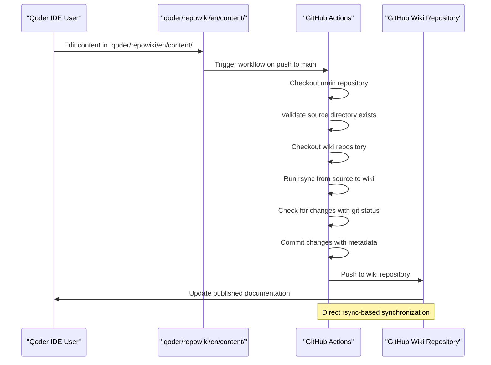
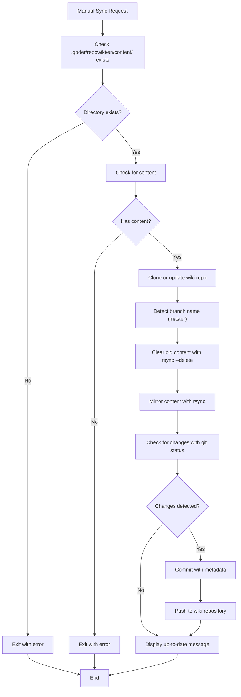
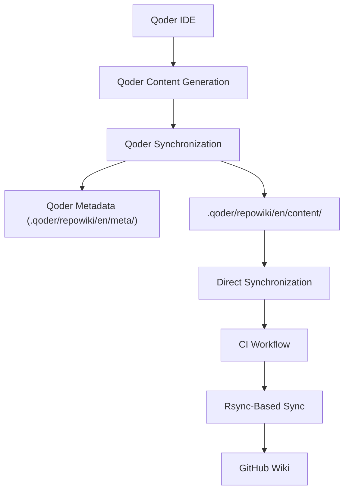

# Wiki Synchronization System

<cite>
**Referenced Files in This Document**
- [.agents/skills/kmcp-dev-repowiki-sync/SKILL.md](file://.agents/skills/kmcp-dev-repowiki-sync/SKILL.md)
- [.github/workflows/sync-qoder-repowiki-to-github-wiki.yml](file://.github/workflows/sync-qoder-repowiki-to-github-wiki.yml)
- [scripts/sync-wiki.sh](file://scripts/sync-wiki.sh)
- [scripts/setup-github-wiki-permissions.sh](file://scripts/setup-github-wiki-permissions.sh)
- [README.md](file://README.md)
- [AGENTS.md](file://AGENTS.md)
- [skills/README.md](file://skills/README.md)
</cite>

## Update Summary
**Changes Made**
- Removed comprehensive forever-branch lifecycle documentation that was previously covered in the repowiki-sync skill
- Streamlined documentation to focus on core functionality without detailed branching strategy guidance
- Updated both README.md and SKILL.md files to remove the specific forever-branch methodology
- Simplified architecture explanation to reflect the current rsync-based synchronization approach
- Removed detailed forever-branch workflow sections while maintaining essential operational guidance

## Table of Contents
1. [Introduction](#introduction)
2. [System Architecture](#system-architecture)
3. [Wiki Structure and Organization](#wiki-structure-and-organization)
4. [Synchronization Mechanisms](#synchronization-mechanisms)
5. [Manual Synchronization Process](#manual-synchronization-process)
6. [Automated Synchronization Workflow](#automated-synchronization-workflow)
7. [Wiki Content Management](#wiki-content-management)
8. [Documentation Generation System](#documentation-generation-system)
9. [Integration with Development Workflow](#integration-with-development-workflow)
10. [Troubleshooting and Maintenance](#troubleshooting-and-maintenance)

## Introduction

The Wiki Synchronization System is a comprehensive documentation management solution that maintains consistency between the source documentation in the `.qoder/repowiki/en/content/` directory and the GitHub Wiki repository. This system implements a straightforward rsync-based synchronization approach that automatically propagates documentation changes to the public GitHub Wiki while maintaining version control and development workflow integration.

**Updated** The system now features a simplified synchronization approach that eliminates the complexity of traditional forever-branch lifecycle management. The new system focuses on direct, reliable synchronization from the source content directory to the GitHub Wiki, with comprehensive tooling for both automated and manual synchronization. The approach emphasizes simplicity and reliability over complex branching strategies.

The system consists of two primary synchronization mechanisms: an automated GitHub Actions workflow and a manual Bash script. Both mechanisms ensure that documentation remains current and accessible to users while maintaining the integrity of the development process through direct content synchronization.

## System Architecture

The Wiki Synchronization System operates through a streamlined architecture that provides both automated and manual synchronization capabilities, centered around direct content synchronization:

```mermaid
graph TB
subgraph "Source Content"
SOURCE_DIR[".qoder/repowiki/en/content/"]
SOURCE_HOME["Home.md"]
SOURCE_SIDEBAR["_Sidebar.md"]
END
subgraph "Synchronization Layer"
AUTO_SYNC["GitHub Actions Workflow"]
MANUAL_SCRIPT["Manual Sync Script"]
END
subgraph "Target Repository"
GITHUB_WIKI["GitHub Wiki Repository"]
PUBLIC_DOCS["Public Documentation"]
end
subgraph "CI/CD Integration"
GITHUB_ACTIONS["GitHub Actions Runner"]
GIT_OPERATIONS["Git Operations"]
RSYNC_SYNC["Rsync-Based Sync"]
END
SOURCE_DIR --> SOURCE_HOME
SOURCE_DIR --> SOURCE_SIDEBAR
SOURCE_DIR --> AUTO_SYNC
SOURCE_DIR --> MANUAL_SCRIPT
AUTO_SYNC --> GITHUB_ACTIONS
GITHUB_ACTIONS --> GIT_OPERATIONS
GIT_OPERATIONS --> RSYNC_SYNC
RSYNC_SYNC --> GITHUB_WIKI
MANUAL_SCRIPT --> GIT_OPERATIONS
GITHUB_WIKI --> PUBLIC_DOCS
```

**Diagram sources**
- [.github/workflows/sync-qoder-repowiki-to-github-wiki.yml:1-67](file://.github/workflows/sync-qoder-repowiki-to-github-wiki.yml#L1-L67)

The architecture ensures simplicity and reliability, allowing documentation updates to be processed through either automated or manual pathways while maintaining consistency across both synchronization mechanisms. The source content directory serves as the central hub for all wiki content management.

## Wiki Structure and Organization

The wiki content is organized around a direct synchronization approach that provides a structured approach to documentation management with IDE integration and persistent content storage.

### Source Content Structure

The wiki follows a hierarchical structure optimized for direct synchronization:

```mermaid
graph TD
SOURCE_DIR[".qoder/repowiki/en/content/"]
subgraph "Source Content"
HOME["Home.md"]
SIDEBAR["_Sidebar.md"]
META[".qoder/repowiki/en/meta/"]
END
subgraph "Project Overview"
OVERVIEW["Getting Started"]
ARCH_OVERVIEW["Architecture Overview"]
CORE_CONCEPTS["Core Concepts"]
END
subgraph "Architecture & Design"
CORE_SERVICES["Core Services Architecture"]
DEPLOYMENT["Deployment & Infrastructure"]
MCP_PROTOCOL["MCP Protocol Architecture"]
END
subgraph "Core Services"
AUTH["Authentication & Authorization"]
MEMORY["Memory Management"]
EMBEDDING["Embedding Services"]
CACHE["Cache Layer"]
END
subgraph "MCP Protocol Tools"
ACTIVATE["Activate Tool"]
FORWARD["Forward Tool"]
TRAIN["Train Tool"]
REWARD["Reward Tool"]
OTHER_TOOLS["Other Tools"]
END
subgraph "User Interfaces"
CLI["CLI Interface"]
WEB_APP["Web Application"]
MCP_INTEGRATION["MCP Protocol Integration"]
END
SOURCE_DIR --> HOME
SOURCE_DIR --> SIDEBAR
SOURCE_DIR --> META
SOURCE_DIR --> OVERVIEW
SOURCE_DIR --> ARCH_OVERVIEW
SOURCE_DIR --> CORE_SERVICES
SOURCE_DIR --> MCP_PROTOCOL
SOURCE_DIR --> CORE_SERVICES
SOURCE_DIR --> MCP_PROTOCOL_TOOLS
SOURCE_DIR --> USER_INTERFACES
MCP_PROTOCOL_TOOLS --> ACTIVATE
MCP_PROTOCOL_TOOLS --> FORWARD
MCP_PROTOCOL_TOOLS --> TRAIN
MCP_PROTOCOL_TOOLS --> REWARD
MCP_PROTOCOL_TOOLS --> OTHER_TOOLS
```

**Diagram sources**
- [.agents/skills/kmcp-dev-repowiki-sync/SKILL.md:94-101](file://.agents/skills/kmcp-dev-repowiki-sync/SKILL.md#L94-L101)

### Content Organization Principles

The wiki employs several organizational principles to ensure maintainability and accessibility within the direct synchronization framework:

- **Direct Content Authority**: Content is managed through the `.qoder/repowiki/en/content/` directory with automatic generation and synchronization
- **One-Way Sync**: Content flows from source directory to GitHub Wiki, never the reverse
- **IDE-Friendly**: Structure optimized for Qoder IDE navigation and editing
- **Metadata Management**: Qoder-managed metadata in `.qoder/repowiki/en/meta/` for IDE functionality
- **Navigation Control**: `_Sidebar.md` controls GitHub Wiki navigation structure
- **Version Control**: All content is versioned alongside the main codebase with PR review process
- **Simplicity**: Direct synchronization approach eliminates complex branching strategies

**Section sources**
- [.agents/skills/kmcp-dev-repowiki-sync/SKILL.md:96-101](file://.agents/skills/kmcp-dev-repowiki-sync/SKILL.md#L96-L101)
- [.agents/skills/kmcp-dev-repowiki-sync/SKILL.md:104-114](file://.agents/skills/kmcp-dev-repowiki-sync/SKILL.md#L104-L114)

## Synchronization Mechanisms

The system provides two complementary synchronization mechanisms to accommodate different workflow requirements and use cases, with enhanced Qoder IDE integration and direct content synchronization support.

### Automated Synchronization

The automated synchronization mechanism operates through GitHub Actions and provides seamless integration with the development workflow through direct content synchronization:



**Diagram sources**
- [.github/workflows/sync-qoder-repowiki-to-github-wiki.yml:25-66](file://.github/workflows/sync-qoder-repowiki-to-github-wiki.yml#L25-L66)

### Manual Synchronization

The manual synchronization mechanism provides developers with direct control over the synchronization process and mirrors the automated workflow through direct content synchronization:



**Diagram sources**
- [scripts/sync-wiki.sh:29-77](file://scripts/sync-wiki.sh#L29-L77)

**Section sources**
- [scripts/sync-wiki.sh:1-78](file://scripts/sync-wiki.sh#L1-L78)

## Manual Synchronization Process

The manual synchronization process provides developers with granular control over documentation updates and is particularly useful for testing and development scenarios within the direct synchronization framework.

### Prerequisites and Setup

Before executing manual synchronization, developers must ensure the following prerequisites are met:

- **Source Directory Access**: Must have access to the `.qoder/repowiki/en/content/` directory
- **GitHub CLI Authentication**: The `gh` command-line tool must be authenticated with appropriate permissions
- **Repository Access**: Developers must have write access to both the main repository and the wiki repository
- **Network Connectivity**: Stable internet connection for Git operations
- **Git Configuration**: Proper Git user configuration for commit authorship
- **First-Time Setup**: Run `scripts/setup-github-wiki-permissions.sh` for initial wiki setup

### Execution Steps

The manual synchronization process follows a systematic approach to ensure reliability and consistency within the direct synchronization framework:

1. **Directory Validation**: The script first verifies that the `.qoder/repowiki/en/content/` directory exists and contains content
2. **Repository Cloning**: If the wiki repository doesn't exist locally, it's cloned from the remote repository
3. **Branch Detection**: The script determines the appropriate branch name (`master`) for synchronization
4. **Content Preparation**: Existing content is cleared using `rsync --delete` while preserving essential Git metadata
5. **Content Transfer**: New content is mirrored from the main repository to the wiki repository using rsync
6. **Change Detection**: The script checks for differences between old and new content using `git status --porcelain`
7. **Commit and Push**: When changes are detected, they are committed with descriptive metadata and pushed to the remote repository

### Error Handling and Recovery

The manual synchronization script implements comprehensive error handling to ensure graceful degradation:

- **Directory Existence Checks**: Validates the presence of required Qoder content directories before proceeding
- **Empty Directory Protection**: Prevents synchronization of empty Qoder content directories
- **Branch Resolution**: Handles the `master` branch naming convention
- **Permission Validation**: Ensures adequate permissions for Git operations
- **Network Resilience**: Provides meaningful error messages for network-related failures
- **Rsync Integration**: Uses rsync for efficient and reliable content synchronization

**Section sources**
- [scripts/sync-wiki.sh:8-11](file://scripts/sync-wiki.sh#L8-L11)
- [scripts/sync-wiki.sh:29-40](file://scripts/sync-wiki.sh#L29-L40)
- [scripts/sync-wiki.sh:42-53](file://scripts/sync-wiki.sh#L42-L53)
- [scripts/sync-wiki.sh:57-77](file://scripts/sync-wiki.sh#L57-L77)

## Automated Synchronization Workflow

The automated synchronization workflow operates through GitHub Actions and provides seamless integration with the continuous integration pipeline, now enhanced with direct content synchronization.

### Workflow Configuration

The GitHub Actions workflow is configured to trigger automatically when changes are made to the source content or the synchronization workflow itself:

```mermaid
stateDiagram-v2
[*] --> Push_Event
Push_Event --> Branch_Check
Branch_Check --> Path_Filter
Path_Filter --> Workflow_Running
Workflow_Running --> Repository_Checkout
Repository_Checkout --> Source_Validation
Source_Validation --> Wiki_Checkout
Wiki_Checkout --> Rsync_Sync
Rsync_Sync --> Change_Detection
Change_Detection --> Changes_Detected{"Changes?"}
Changes_Detected --> |Yes| Commit_Operation
Changes_Detected --> |No| Success_Message
Commit_Operation --> Push_Operation
Push_Operation --> Success_Message
Success_Message --> [*]
```

**Diagram sources**
- [.github/workflows/sync-qoder-repowiki-to-github-wiki.yml:3-18](file://.github/workflows/sync-qoder-repowiki-to-github-wiki.yml#L3-L18)

### Execution Environment

The automated workflow runs in a controlled environment with specific configurations:

- **Runner Environment**: Ubuntu Latest virtual environment for consistent execution
- **Repository Access**: Read/write permissions for the main repository and wiki repository
- **Authentication**: GitHub token-based authentication for secure operations
- **Path Filtering**: Triggers on changes to `.qoder/repowiki/en/content/**` and workflow files
- **Direct Synchronization**: Seamlessly integrates with direct content synchronization

### Content Processing Pipeline

The automated workflow processes content through a structured pipeline with enhanced rsync capabilities:

1. **Repository Checkout**: Both the main repository and wiki repository are checked out
2. **Source Validation**: Validates the existence of the `.qoder/repowiki/en/content/` directory
3. **Wiki Checkout**: The wiki repository is checked out with appropriate permissions
4. **Content Clearing**: Existing wiki content is cleared using `rsync --delete` while preserving Git metadata
5. **Content Copying**: New content is copied from the main repository to the wiki repository using rsync mirroring
6. **Hidden File Handling**: Special attention is paid to hidden files and directories during rsync operation
7. **Change Detection**: Git status is checked to identify modifications using `--porcelain` flag
8. **Commit Generation**: Descriptive commits are created with metadata about the source and timestamp
9. **Push Operations**: Changes are pushed to the wiki repository with proper attribution

**Section sources**
- [.github/workflows/sync-qoder-repowiki-to-github-wiki.yml:25-66](file://.github/workflows/sync-qoder-repowiki-to-github-wiki.yml#L25-L66)

## Wiki Content Management

The wiki content management system ensures that documentation remains organized, accessible, and synchronized across all platforms, with enhanced Qoder IDE integration and direct synchronization support.

### Content Structure and Organization

The wiki employs a systematic approach to content organization that reflects the project's technical architecture and direct synchronization framework:

#### Source Content Structure

The documentation is organized into logical hierarchies optimized for direct synchronization:

- **Source Content**: `.qoder/repowiki/en/content/` - Primary source of truth for documentation
- **Source Content Metadata**: `.qoder/repowiki/en/meta/` - Qoder-managed metadata for IDE functionality
- **Project Overview**: High-level introduction and getting started guides
- **Architecture & Design**: Technical architecture and design decisions
- **Core Services**: Detailed service documentation and implementation details
- **MCP Protocol Tools**: Comprehensive tool documentation and usage examples
- **User Interfaces**: Interface documentation for CLI, web application, and MCP integration
- **Navigation Control**: `_Sidebar.md` for GitHub Wiki navigation structure

#### Content Versioning and Synchronization

All wiki content is versioned alongside the main codebase, ensuring consistency and traceability through the direct synchronization approach:

- **Source of Truth**: The `.qoder/repowiki/en/content/` directory serves as the authoritative source of documentation
- **Version Control**: Documentation changes follow the same version control processes as code
- **Review Process**: Documentation changes undergo the same PR review process as code changes
- **Automated Propagation**: Approved changes are automatically propagated to the GitHub Wiki via rsync through the CI workflow
- **Direct Synchronization**: Content is automatically generated and synchronized through Qoder IDE

### Content Validation and Quality Assurance

The system implements several mechanisms to ensure content quality and consistency:

- **Structure Validation**: Ensures documentation follows established organizational patterns within the direct synchronization framework
- **Cross-Reference Validation**: Maintains consistency in internal linking
- **Content Completeness**: Verifies that all required sections are present
- **Formatting Standards**: Enforces consistent formatting and style guidelines
- **Qoder Compatibility**: Ensures content is compatible with Qoder IDE rendering
- **Navigation Integrity**: Validates sidebar structure and internal link consistency
- **Direct Synchronization Compliance**: Ensures content adheres to direct synchronization requirements

**Section sources**
- [.agents/skills/kmcp-dev-repowiki-sync/SKILL.md:96-101](file://.agents/skills/kmcp-dev-repowiki-sync/SKILL.md#L96-L101)
- [.agents/skills/kmcp-dev-repowiki-sync/SKILL.md:104-114](file://.agents/skills/kmcp-dev-repowiki-sync/SKILL.md#L104-L114)

## Documentation Generation System

Beyond simple synchronization, the system includes a sophisticated documentation generation system that enhances the developer experience and maintains consistency across different documentation formats, now integrated with Qoder IDE and direct synchronization.

### Qoder IDE Integration

The documentation generation system manages content through Qoder IDE integration and direct synchronization:



**Diagram sources**
- [.agents/skills/kmcp-dev-repowiki-sync/SKILL.md:178-185](file://.agents/skills/kmcp-dev-repowiki-sync/SKILL.md#L178-L185)

### Qoder Content Management

The Qoder IDE provides comprehensive content management capabilities within the direct synchronization framework:

#### Content Generation and Updates

The system implements sophisticated content generation from Qoder IDE through direct synchronization:

- **Automatic Generation**: Content generated on project open or Git HEAD changes (~120 min for large repos)
- **Incremental Updates**: Qoder detects code changes and offers "Update" for affected sections
- **Synchronization**: Manual synchronization between IDE wiki view and Git directory
- **Team Sharing**: Content directory is committed for team collaboration via `git pull`
- **Direct Synchronization**: Content is managed and synchronized through the `.qoder/repowiki/en/content/` directory

#### Metadata Management

The system manages Qoder-specific metadata within the direct synchronization framework:

- **Qoder-Managed**: Metadata in `.qoder/repowiki/en/meta/` is managed by Qoder IDE
- **IDE Functionality**: Metadata enables IDE wiki loading and navigation
- **Protected Content**: Do not edit `.qoder/repowiki/en/meta/` directly
- **Integration Points**: Metadata coordinates with CI workflow and manual sync scripts
- **Direct Synchronization Compliance**: Metadata supports direct synchronization requirements

#### Runtime Resource Registration

The generated resources are registered with the MCP server for dynamic access within the direct synchronization context:

- **Dynamic Registration**: Resources are registered at runtime with appropriate MIME types
- **Hierarchical Access**: Supports both flat and nested resource access patterns
- **Content Delivery**: Provides structured content delivery for MCP applications
- **Type Safety**: Maintains type safety through generated TypeScript interfaces
- **Direct Synchronization Persistence**: Resources persist through direct synchronization

**Section sources**
- [.agents/skills/kmcp-dev-repowiki-sync/SKILL.md:178-185](file://.agents/skills/kmcp-dev-repowiki-sync/SKILL.md#L178-L185)
- [.agents/skills/kmcp-dev-repowiki-sync/SKILL.md:99](file://.agents/skills/kmcp-dev-repowiki-sync/SKILL.md#L99)

## Integration with Development Workflow

The Wiki Synchronization System is deeply integrated into the development workflow, ensuring that documentation changes are synchronized seamlessly with code changes, with comprehensive Qoder IDE integration and direct synchronization support.

### Development Workflow Integration

The synchronization system integrates with the standard development workflow through several key mechanisms:

#### Direct Synchronization Integration

Documentation changes are now primarily managed through the direct synchronization approach:

- **Direct Synchronization Workflow**: Content is created and edited within the `.qoder/repowiki/en/content/` directory
- **Automatic Generation**: Qoder IDE automatically generates and updates content
- **Seamless Sync**: Changes are automatically synchronized between source directory and Git
- **Team Collaboration**: Content is committed for team sharing and collaboration via direct synchronization

#### Pull Request Integration

Documentation changes follow the same pull request workflow as code changes through the direct synchronization approach:

- **Standard PR Process**: Documentation changes require the same review and approval process
- **Direct Synchronization Preservation**: Approved changes trigger automatic synchronization to the wiki
- **Quality Gates**: Documentation changes can trigger the same quality checks as code changes
- **Branch Protection**: Wiki synchronization can be protected by branch protection rules

#### Continuous Integration Integration

The synchronization system participates in the continuous integration pipeline through the direct synchronization approach:

- **Workflow Triggering**: Changes to `.qoder/repowiki/en/content/` trigger the synchronization workflow
- **Direct Synchronization Status**: Synchronization status is reported as part of the CI pipeline
- **Failure Handling**: Synchronization failures are reported as CI pipeline failures
- **Rollback Support**: Failed synchronization attempts can trigger rollback procedures

#### Development Environment Integration

The system provides development environment support for documentation authors within the direct synchronization framework:

- **Local Testing**: Manual synchronization script supports local testing and validation
- **Preview Capabilities**: Developers can preview documentation changes before synchronization
- **Debugging Support**: Comprehensive logging and error reporting for troubleshooting
- **Direct Synchronization Integration**: Full integration with Qoder IDE for enhanced authoring experience

### Change Management and Governance

The system implements comprehensive change management and governance through the direct synchronization approach:

#### Change Tracking and Attribution

All synchronization activities are tracked and attributed within the direct synchronization framework:

- **Commit Metadata**: Synchronization commits include detailed metadata about the source
- **Author Attribution**: Changes are properly attributed to the original committer
- **Timestamp Tracking**: Precise timestamps are maintained for all synchronization events
- **Direct Synchronization Audit Trail**: Complete audit trail of all documentation changes
- **History Preservation**: Direct synchronization maintains complete change history

#### Quality Assurance and Validation

The system implements multiple layers of quality assurance within the direct synchronization framework:

- **Content Validation**: Validates content structure and formatting before synchronization
- **Cross-Reference Validation**: Ensures internal links and references are valid
- **Format Consistency**: Maintains consistent formatting across all documentation
- **Accessibility Compliance**: Validates accessibility compliance for public documentation
- **Qoder Compatibility**: Ensures content compatibility with Qoder IDE rendering
- **Direct Synchronization Compliance**: Validates direct synchronization requirements

**Section sources**
- [.agents/skills/kmcp-dev-repowiki-sync/SKILL.md:104-114](file://.agents/skills/kmcp-dev-repowiki-sync/SKILL.md#L104-L114)
- [.agents/skills/kmcp-dev-repowiki-sync/SKILL.md:178-185](file://.agents/skills/kmcp-dev-repowiki-sync/SKILL.md#L178-L185)

## Troubleshooting and Maintenance

The Wiki Synchronization System includes comprehensive troubleshooting and maintenance capabilities to ensure reliable operation and easy problem resolution, with enhanced guidance for Qoder IDE integration and direct synchronization.

### Common Issues and Solutions

#### Synchronization Failures

Several common issues can affect the synchronization process:

**Repository Access Issues**
- **Symptom**: Synchronization fails with authentication errors
- **Cause**: Insufficient permissions or expired authentication tokens
- **Solution**: Verify GitHub authentication and repository permissions; regenerate tokens if necessary

**Direct Synchronization Issues**
- **Symptom**: Source directory content not appearing in wiki
- **Cause**: Source directory not properly configured or content not generated
- **Solution**: Ensure source directory is properly configured; verify content generation process

**Network Connectivity Issues**
- **Symptom**: Synchronization fails with network timeout errors
- **Cause**: Temporary network connectivity problems
- **Solution**: Retry synchronization after network connectivity is restored; check firewall settings

**Content Conflicts**
- **Symptom**: Synchronization fails with merge conflict errors
- **Cause**: Concurrent modifications to the wiki repository
- **Solution**: Resolve conflicts manually or wait for the automated system to handle conflicts

#### Manual Synchronization Issues

Manual synchronization can encounter specific issues:

**Directory Validation Failures**
- **Symptom**: Script exits with directory not found errors
- **Cause**: Missing `.qoder/repowiki/en/content/` directory or incorrect path specification
- **Solution**: Verify the existence of the `.qoder/repowiki/en/content/` directory and correct the path

**Git Operation Failures**
- **Symptom**: Git operations fail with permission or configuration errors
- **Cause**: Incorrect Git configuration or insufficient permissions
- **Solution**: Configure Git properly and ensure adequate permissions for Git operations

**Direct Synchronization Setup Issues**
- **Symptom**: First-time setup fails or permissions not applied
- **Cause**: Missing or incomplete setup script execution
- **Solution**: Run `scripts/setup-github-wiki-permissions.sh` and verify permissions

### Maintenance Procedures

#### Regular Maintenance Tasks

The system requires regular maintenance to ensure optimal performance within the direct synchronization framework:

**Log Monitoring and Analysis**
- Monitor synchronization logs for errors and warnings
- Analyze synchronization frequency and success rates
- Identify patterns in synchronization failures
- Generate maintenance reports and alerts

**Direct Synchronization Health Checks**
- Verify direct synchronization integration and content generation
- Check for direct synchronization metadata corruption or issues
- Validate synchronized content quality
- Monitor direct synchronization performance and responsiveness

**Repository Health Checks**
- Verify repository integrity and consistency
- Check for orphaned or broken references
- Validate repository permissions and access
- Monitor repository size and growth trends

**Performance Optimization**
- Optimize synchronization timing and scheduling
- Monitor resource usage during synchronization
- Identify and resolve performance bottlenecks
- Implement caching strategies for improved performance

#### Backup and Recovery

The system implements comprehensive backup and recovery procedures within the direct synchronization framework:

**Automated Backups**
- Regular backups of the wiki repository
- Incremental backups for efficient storage utilization
- Off-site backup storage for disaster recovery
- Automated backup verification and validation

**Recovery Procedures**
- Disaster recovery procedures for complete repository restoration
- Incremental recovery procedures for partial restoration
- Rollback procedures for failed synchronization attempts
- Emergency recovery procedures for critical incidents

### Monitoring and Alerting

The system includes comprehensive monitoring and alerting capabilities:

#### Operational Monitoring

**Synchronization Metrics**
- Track synchronization success rates and failure rates
- Monitor synchronization duration and performance metrics
- Track repository size and growth trends
- Monitor resource utilization during synchronization

**Direct Synchronization Monitoring**
- Monitor direct synchronization content generation success rates
- Track direct synchronization synchronization frequency
- Monitor direct synchronization performance metrics
- Track direct synchronization user interaction patterns

**Health Monitoring**
- Monitor repository health and integrity
- Track system dependencies and availability
- Monitor external service dependencies (GitHub API)
- Track system performance and capacity utilization

#### Alerting and Notification

**Automated Alerts**
- Email notifications for critical synchronization failures
- Slack notifications for major operational issues
- Pager duty integration for emergency situations
- Automated ticket creation for recurring issues

**Escalation Procedures**
- Define escalation procedures for different types of issues
- Establish communication protocols for incident response
- Implement after-hours support procedures
- Coordinate with development teams for complex issues

**Direct Synchronization Specific Monitoring**
- Monitor direct synchronization lifecycle adherence
- Track direct synchronization history preservation
- Monitor direct synchronization content quality
- Monitor direct synchronization integration success

**Section sources**
- [scripts/sync-wiki.sh:19-24](file://scripts/sync-wiki.sh#L19-L24)
- [scripts/sync-wiki.sh:29-40](file://scripts/sync-wiki.sh#L29-L40)
- [.agents/skills/kmcp-dev-repowiki-sync/SKILL.md:116-123](file://.agents/skills/kmcp-dev-repowiki-sync/SKILL.md#L116-L123)