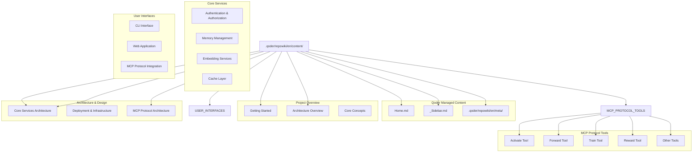
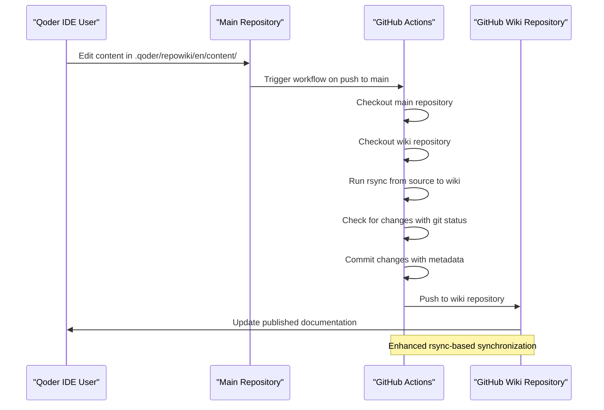
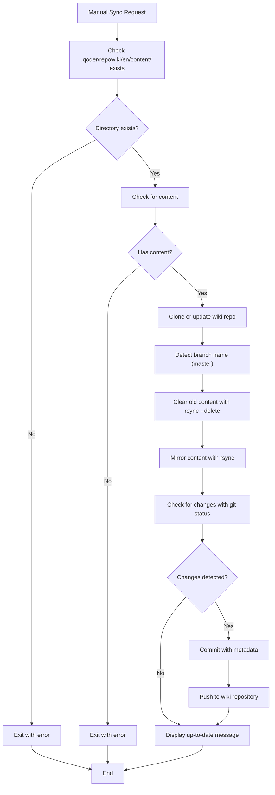
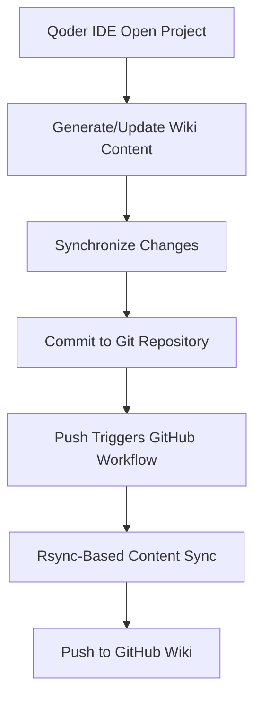
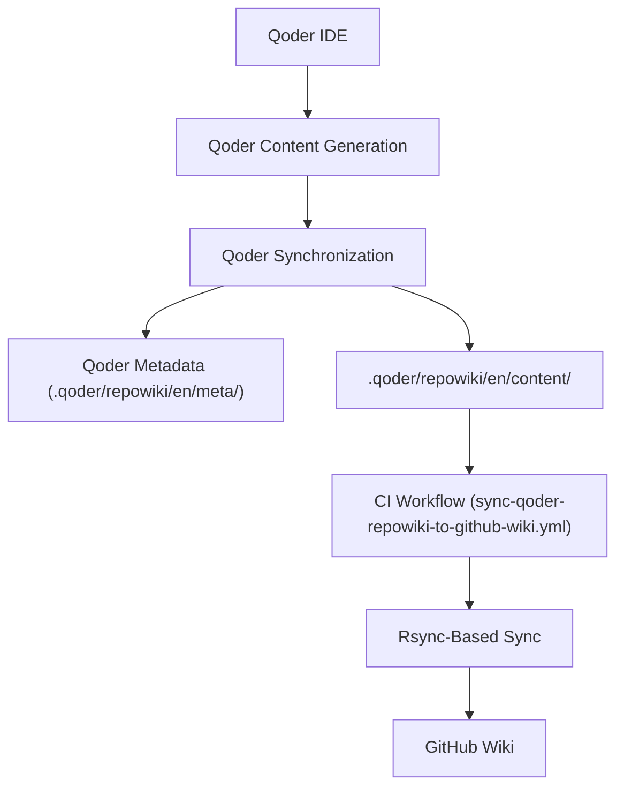

# Wiki Synchronization System

<cite>
**Referenced Files in This Document**
- [sync-wiki.sh](file://scripts/sync-wiki.sh)
- [kmcp-dev-repowiki-sync/SKILL.md](file://.agents/skills/kmcp-dev-repowiki-sync/SKILL.md)
- [.agents/skills/README.md](file://.agents/skills/README.md)
- [sync-wiki.yml](file://.github/workflows/sync-wiki.yml)
- [setup-github-wiki-permissions.sh](file://scripts/setup-github-wiki-permissions.sh)
- [wiki/README.md](file://wiki/README.md)
- [Getting Started.md](file://wiki/Project Overview/Getting Started.md)
- [Architecture & Design.md](file://wiki/Architecture & Design/Architecture & Design.md)
- [Memory Management.md](file://wiki/Core Services/Memory Management/Memory Management.md)
- [MCP Protocol Tools.md](file://wiki/MCP Protocol Tools/MCP Protocol Tools.md)
- [User Interfaces.md](file://wiki/User Interfaces/User Interfaces.md)
- [Project Overview.md](file://wiki/Project Overview/Project Overview.md)
- [build-embed-docs.ts](file://scripts/build-embed-docs.ts)
- [embedded-mcp-resources.ts](file://src/resources/embedded-mcp-resources.ts)
- [docs-resources.ts](file://src/resources/docs-resources.ts)
- [mem-dir-utils.ts](file://src/resources/mem-dir-utils.ts)
</cite>

## Update Summary
**Changes Made**
- Updated synchronization architecture to reflect new Qoder Repo Wiki system
- Added documentation for kmcp-dev-repowiki-sync skill and its integration
- Updated workflow configuration to reflect sync-qoder-repowiki-to-github-wiki.yml
- Enhanced manual synchronization process with rsync-based approach
- Updated content management to focus on .qoder/repowiki/en/content/ directory
- Added comprehensive Qoder IDE integration guidance

## Table of Contents
1. [Introduction](#introduction)
2. [System Architecture](#system-architecture)
3. [Wiki Structure and Organization](#wiki-structure-and-organization)
4. [Synchronization Mechanisms](#synchronization-mechanisms)
5. [Manual Synchronization Process](#manual-synchronization-process)
6. [Automated Synchronization Workflow](#automated-synchronization-workflow)
7. [Wiki Content Management](#wiki-content-management)
8. [Documentation Generation System](#documentation-generation-system)
9. [Integration with Development Workflow](#integration-with-development-workflow)
10. [Troubleshooting and Maintenance](#troubleshooting-and-maintenance)

## Introduction

The Wiki Synchronization System is a comprehensive documentation management solution that maintains consistency between the source documentation in the `.qoder/repowiki/en/content/` directory and the GitHub Wiki repository. This system ensures that all documentation changes are automatically propagated to the public GitHub Wiki while maintaining version control and development workflow integration.

**Updated** The system now features enhanced integration with Qoder IDE, providing a more streamlined development experience for documentation authors. The new system emphasizes one-way synchronization from Qoder-generated content to the GitHub Wiki, with comprehensive tooling for both automated and manual synchronization.

The system consists of three primary synchronization mechanisms: an automated GitHub Actions workflow, a manual Bash script, and Qoder IDE integration. Both mechanisms ensure that documentation remains current and accessible to users while maintaining the integrity of the development process.

## System Architecture

The Wiki Synchronization System operates through a multi-layered architecture that provides both automated and manual synchronization capabilities with Qoder IDE integration:

```mermaid
graph TB
subgraph "Qoder IDE Source"
QODER_REPO[".qoder/repowiki/en/content/"]
QODER_META[".qoder/repowiki/en/meta/"]
END
subgraph "Synchronization Layer"
AUTO_SYNC["GitHub Actions Workflow"]
MANUAL_SCRIPT["Manual Sync Script"]
QODER_INTEGRATION["Qoder IDE Integration"]
end
subgraph "Target Repository"
GITHUB_WIKI["GitHub Wiki Repository"]
PUBLIC_DOCS["Public Documentation"]
end
subgraph "CI/CD Integration"
GITHUB_ACTIONS["GitHub Actions Runner"]
GIT_OPERATIONS["Git Operations"]
RSYNC_SYNC["Rsync-Based Sync"]
END
QODER_REPO --> AUTO_SYNC
QODER_REPO --> MANUAL_SCRIPT
QODER_REPO --> QODER_INTEGRATION
QODER_META --> QODER_INTEGRATION
AUTO_SYNC --> GITHUB_ACTIONS
GITHUB_ACTIONS --> GIT_OPERATIONS
GIT_OPERATIONS --> RSYNC_SYNC
RSYNC_SYNC --> GITHUB_WIKI
MANUAL_SCRIPT --> GIT_OPERATIONS
QODER_INTEGRATION --> QODER_REPO
QODER_INTEGRATION --> QODER_META
GITHUB_WIKI --> PUBLIC_DOCS
```

**Diagram sources**
- [sync-wiki.sh:1-78](file://scripts/sync-wiki.sh#L1-L78)
- [kmcp-dev-repowiki-sync/SKILL.md:16-26](file://.agents/skills/kmcp-dev-repowiki-sync/SKILL.md#L16-L26)

The architecture ensures redundancy and flexibility, allowing documentation updates to be processed through either automated or manual pathways while maintaining consistency across both synchronization mechanisms and Qoder IDE integration.

## Wiki Structure and Organization

The wiki content is organized around the Qoder Repo Wiki system, which provides a structured approach to documentation management with IDE integration:

### Qoder Repo Wiki Structure

The wiki follows a hierarchical structure optimized for Qoder IDE integration:



**Diagram sources**
- [kmcp-dev-repowiki-sync/SKILL.md:30-38](file://.agents/skills/kmcp-dev-repowiki-sync/SKILL.md#L30-L38)

### Content Organization Principles

The wiki employs several organizational principles to ensure maintainability and accessibility:

- **Qoder Integration**: Content is managed through Qoder IDE with automatic generation and synchronization
- **One-Way Sync**: Content flows from `.qoder/repowiki/en/content/` to GitHub Wiki, never the reverse
- **IDE-Friendly**: Structure optimized for Qoder IDE navigation and editing
- **Metadata Management**: Qoder-managed metadata in `.qoder/repowiki/en/meta/` for IDE functionality
- **Navigation Control**: `_Sidebar.md` controls GitHub Wiki navigation structure
- **Version Control**: All content is versioned alongside the main codebase with PR review process

**Section sources**
- [kmcp-dev-repowiki-sync/SKILL.md:22-26](file://.agents/skills/kmcp-dev-repowiki-sync/SKILL.md#L22-L26)
- [kmcp-dev-repowiki-sync/SKILL.md:42-47](file://.agents/skills/kmcp-dev-repowiki-sync/SKILL.md#L42-L47)

## Synchronization Mechanisms

The system provides three complementary synchronization mechanisms to accommodate different workflow requirements and use cases, with enhanced Qoder IDE integration.

### Automated Synchronization

The automated synchronization mechanism operates through GitHub Actions and provides seamless integration with the development workflow:



**Diagram sources**
- [sync-wiki.sh:57-69](file://scripts/sync-wiki.sh#L57-L69)

### Manual Synchronization

The manual synchronization mechanism provides developers with direct control over the synchronization process and mirrors the automated workflow:



**Diagram sources**
- [sync-wiki.sh:29-77](file://scripts/sync-wiki.sh#L29-L77)

### Qoder IDE Integration

The Qoder IDE provides seamless integration with the synchronization system:



**Diagram sources**
- [kmcp-dev-repowiki-sync/SKILL.md:106-115](file://.agents/skills/kmcp-dev-repowiki-sync/SKILL.md#L106-L115)

**Section sources**
- [sync-wiki.sh:1-78](file://scripts/sync-wiki.sh#L1-L78)
- [kmcp-dev-repowiki-sync/SKILL.md:16-26](file://.agents/skills/kmcp-dev-repowiki-sync/SKILL.md#L16-L26)

## Manual Synchronization Process

The manual synchronization process provides developers with granular control over documentation updates and is particularly useful for testing and development scenarios.

### Prerequisites and Setup

Before executing manual synchronization, developers must ensure the following prerequisites are met:

- **Qoder IDE Integration**: Qoder IDE must be properly configured with the project
- **GitHub CLI Authentication**: The `gh` command-line tool must be authenticated with appropriate permissions
- **Repository Access**: Developers must have write access to both the main repository and the wiki repository
- **Network Connectivity**: Stable internet connection for Git operations
- **Git Configuration**: Proper Git user configuration for commit authorship
- **First-Time Setup**: Run `scripts/setup-github-wiki-permissions.sh` for initial wiki setup

### Execution Steps

The manual synchronization process follows a systematic approach to ensure reliability and consistency:

1. **Directory Validation**: The script first verifies that the `.qoder/repowiki/en/content/` directory exists and contains content
2. **Repository Cloning**: If the wiki repository doesn't exist locally, it's cloned from the remote repository
3. **Branch Detection**: The script determines the appropriate branch name (`master`) for synchronization
4. **Content Preparation**: Existing content is cleared using `rsync --delete` while preserving essential Git metadata
5. **Content Transfer**: New content is mirrored from the main repository to the wiki repository using rsync
6. **Change Detection**: The script checks for differences between old and new content using `git status --porcelain`
7. **Commit and Push**: When changes are detected, they are committed with descriptive metadata and pushed to the remote repository

### Error Handling and Recovery

The manual synchronization script implements comprehensive error handling to ensure graceful degradation:

- **Directory Existence Checks**: Validates the presence of required Qoder content directories before proceeding
- **Empty Directory Protection**: Prevents synchronization of empty Qoder content directories
- **Branch Resolution**: Handles the `master` branch naming convention
- **Permission Validation**: Ensures adequate permissions for Git operations
- **Network Resilience**: Provides meaningful error messages for network-related failures
- **Rsync Integration**: Uses rsync for efficient and reliable content synchronization

**Section sources**
- [sync-wiki.sh:8-11](file://scripts/sync-wiki.sh#L8-L11)
- [sync-wiki.sh:29-40](file://scripts/sync-wiki.sh#L29-L40)
- [sync-wiki.sh:42-53](file://scripts/sync-wiki.sh#L42-L53)
- [sync-wiki.sh:57-77](file://scripts/sync-wiki.sh#L57-L77)

## Automated Synchronization Workflow

The automated synchronization workflow operates through GitHub Actions and provides seamless integration with the continuous integration pipeline, now enhanced with Qoder IDE integration.

### Workflow Configuration

The GitHub Actions workflow is configured to trigger automatically when changes are made to the Qoder content or the synchronization workflow itself:

```mermaid
stateDiagram-v2
[*] --> Push_Event
Push_Event --> Branch_Check
Branch_Check --> Path_Filter
Path_Filter --> Workflow_Running
Workflow_Running --> Repository_Checkout
Repository_Checkout --> Content_Clearing
Content_Clearing --> Content_Copying
Content_Copying --> Rsync_Sync
Rsync_Sync --> Change_Detection
Change_Detection --> Changes_Detected{"Changes?"}
Changes_Detected --> |Yes| Commit_Operation
Changes_Detected --> |No| Success_Message
Commit_Operation --> Push_Operation
Push_Operation --> Success_Message
Success_Message --> [*]
```

**Diagram sources**
- [kmcp-dev-repowiki-sync/SKILL.md:25-26](file://.agents/skills/kmcp-dev-repowiki-sync/SKILL.md#L25-L26)

### Execution Environment

The automated workflow runs in a controlled environment with specific configurations:

- **Runner Environment**: Ubuntu Latest virtual environment for consistent execution
- **Repository Access**: Read/write permissions for the main repository and wiki repository
- **Authentication**: GitHub token-based authentication for secure operations
- **Path Filtering**: Triggers on changes to `.qoder/repowiki/en/content/**` and workflow files
- **Qoder Integration**: Seamlessly integrates with Qoder IDE content generation

### Content Processing Pipeline

The automated workflow processes content through a structured pipeline with enhanced rsync capabilities:

1. **Repository Checkout**: Both the main repository and wiki repository are checked out
2. **Content Clearing**: Existing wiki content is cleared using `rsync --delete` while preserving Git metadata
3. **Content Copying**: New content is copied from the main repository to the wiki repository using rsync mirroring
4. **Hidden File Handling**: Special attention is paid to hidden files and directories during rsync operation
5. **Change Detection**: Git status is checked to identify modifications using `--porcelain` flag
6. **Commit Generation**: Descriptive commits are created with metadata about the source and timestamp
7. **Push Operations**: Changes are pushed to the wiki repository with proper attribution

**Section sources**
- [kmcp-dev-repowiki-sync/SKILL.md:25-26](file://.agents/skills/kmcp-dev-repowiki-sync/SKILL.md#L25-L26)
- [kmcp-dev-repowiki-sync/SKILL.md:36-38](file://.agents/skills/kmcp-dev-repowiki-sync/SKILL.md#L36-L38)

## Wiki Content Management

The wiki content management system ensures that documentation remains organized, accessible, and synchronized across all platforms, with enhanced Qoder IDE integration.

### Content Structure and Organization

The wiki employs a systematic approach to content organization that reflects the project's technical architecture and Qoder IDE integration:

#### Qoder-Managed Content Structure

The documentation is organized into logical hierarchies optimized for Qoder IDE:

- **Qoder Content**: `.qoder/repowiki/en/content/` - Primary source of truth for documentation
- **Qoder Metadata**: `.qoder/repowiki/en/meta/` - Qoder-managed metadata for IDE functionality
- **Project Overview**: High-level introduction and getting started guides
- **Architecture & Design**: Technical architecture and design decisions
- **Core Services**: Detailed service documentation and implementation details
- **MCP Protocol Tools**: Comprehensive tool documentation and usage examples
- **User Interfaces**: Interface documentation for CLI, web application, and MCP integration
- **Navigation Control**: `_Sidebar.md` for GitHub Wiki navigation structure

#### Content Versioning and Synchronization

All wiki content is versioned alongside the main codebase, ensuring consistency and traceability:

- **Source of Truth**: The `.qoder/repowiki/en/content/` directory serves as the authoritative source of documentation
- **Version Control**: Documentation changes follow the same version control processes as code
- **Review Process**: Documentation changes undergo the same PR review process as code changes
- **Automated Propagation**: Approved changes are automatically propagated to the GitHub Wiki via rsync
- **Qoder Integration**: Content is automatically generated and synchronized through Qoder IDE

### Content Validation and Quality Assurance

The system implements several mechanisms to ensure content quality and consistency:

- **Structure Validation**: Ensures documentation follows established organizational patterns
- **Cross-Reference Validation**: Maintains consistency in internal linking
- **Content Completeness**: Verifies that all required sections are present
- **Formatting Standards**: Enforces consistent formatting and style guidelines
- **Qoder Compatibility**: Ensures content is compatible with Qoder IDE rendering
- **Navigation Integrity**: Validates sidebar structure and internal link consistency

**Section sources**
- [kmcp-dev-repowiki-sync/SKILL.md:32-38](file://.agents/skills/kmcp-dev-repowiki-sync/SKILL.md#L32-L38)
- [kmcp-dev-repowiki-sync/SKILL.md:42-47](file://.agents/skills/kmcp-dev-repowiki-sync/SKILL.md#L42-L47)

## Documentation Generation System

Beyond simple synchronization, the system includes a sophisticated documentation generation system that enhances the developer experience and maintains consistency across different documentation formats, now integrated with Qoder IDE.

### Qoder IDE Integration

The documentation generation system manages content through Qoder IDE integration:



**Diagram sources**
- [kmcp-dev-repowiki-sync/SKILL.md:106-115](file://.agents/skills/kmcp-dev-repowiki-sync/SKILL.md#L106-L115)

### Qoder Content Management

The Qoder IDE provides comprehensive content management capabilities:

#### Content Generation and Updates

The system implements sophisticated content generation from Qoder IDE:

- **Automatic Generation**: Content generated on project open or Git HEAD changes (~120 min for large repos)
- **Incremental Updates**: Qoder detects code changes and offers "Update" for affected sections
- **Synchronization**: Manual synchronization between IDE wiki view and Git directory
- **Team Sharing**: Content directory is committed for team collaboration via `git pull`

#### Metadata Management

The system manages Qoder-specific metadata:

- **Qoder-Managed**: Metadata in `.qoder/repowiki/en/meta/` is managed by Qoder IDE
- **IDE Functionality**: Metadata enables IDE wiki loading and navigation
- **Protected Content**: Do not edit `.qoder/repowiki/en/meta/` directly
- **Integration Points**: Metadata coordinates with CI workflow and manual sync scripts

#### Runtime Resource Registration

The generated resources are registered with the MCP server for dynamic access:

- **Dynamic Registration**: Resources are registered at runtime with appropriate MIME types
- **Hierarchical Access**: Supports both flat and nested resource access patterns
- **Content Delivery**: Provides structured content delivery for MCP applications
- **Type Safety**: Maintains type safety through generated TypeScript interfaces

**Section sources**
- [kmcp-dev-repowiki-sync/SKILL.md:106-115](file://.agents/skills/kmcp-dev-repowiki-sync/SKILL.md#L106-L115)
- [kmcp-dev-repowiki-sync/SKILL.md:35-36](file://.agents/skills/kmcp-dev-repowiki-sync/SKILL.md#L35-L36)

## Integration with Development Workflow

The Wiki Synchronization System is deeply integrated into the development workflow, ensuring that documentation changes are synchronized seamlessly with code changes, with comprehensive Qoder IDE integration.

### Development Workflow Integration

The synchronization system integrates with the standard development workflow through several key mechanisms:

#### Qoder IDE Integration

Documentation changes are now primarily managed through Qoder IDE:

- **IDE-First Workflow**: Content is created and edited within Qoder IDE
- **Automatic Generation**: Qoder IDE automatically generates and updates content
- **Seamless Sync**: Changes are automatically synchronized between IDE and Git
- **Team Collaboration**: Content is committed for team sharing and collaboration

#### Pull Request Integration

Documentation changes follow the same pull request workflow as code changes:

- **Standard PR Process**: Documentation changes require the same review and approval process
- **Automated Synchronization**: Approved changes trigger automatic synchronization to the wiki
- **Quality Gates**: Documentation changes can trigger the same quality checks as code changes
- **Branch Protection**: Wiki synchronization can be protected by branch protection rules

#### Continuous Integration Integration

The synchronization system participates in the continuous integration pipeline:

- **Workflow Triggering**: Changes to `.qoder/repowiki/en/content/` trigger the synchronization workflow
- **Status Reporting**: Synchronization status is reported as part of the CI pipeline
- **Failure Handling**: Synchronization failures are reported as CI pipeline failures
- **Rollback Support**: Failed synchronization attempts can trigger rollback procedures

#### Development Environment Integration

The system provides development environment support for documentation authors:

- **Local Testing**: Manual synchronization script supports local testing and validation
- **Preview Capabilities**: Developers can preview documentation changes before synchronization
- **Debugging Support**: Comprehensive logging and error reporting for troubleshooting
- **Qoder Integration**: Full integration with Qoder IDE for enhanced authoring experience

### Change Management and Governance

The system implements comprehensive change management and governance:

#### Change Tracking and Attribution

All synchronization activities are tracked and attributed:

- **Commit Metadata**: Synchronization commits include detailed metadata about the source
- **Author Attribution**: Changes are properly attributed to the original committer
- **Timestamp Tracking**: Precise timestamps are maintained for all synchronization events
- **Audit Trail**: Complete audit trail of all documentation changes and synchronization events

#### Quality Assurance and Validation

The system implements multiple layers of quality assurance:

- **Content Validation**: Validates content structure and formatting before synchronization
- **Cross-Reference Validation**: Ensures internal links and references are valid
- **Format Consistency**: Maintains consistent formatting across all documentation
- **Accessibility Compliance**: Validates accessibility compliance for public documentation
- **Qoder Compatibility**: Ensures content compatibility with Qoder IDE rendering

**Section sources**
- [kmcp-dev-repowiki-sync/SKILL.md:42-47](file://.agents/skills/kmcp-dev-repowiki-sync/SKILL.md#L42-L47)
- [kmcp-dev-repowiki-sync/SKILL.md:106-115](file://.agents/skills/kmcp-dev-repowiki-sync/SKILL.md#L106-L115)

## Troubleshooting and Maintenance

The Wiki Synchronization System includes comprehensive troubleshooting and maintenance capabilities to ensure reliable operation and easy problem resolution, with enhanced guidance for Qoder IDE integration.

### Common Issues and Solutions

#### Synchronization Failures

Several common issues can affect the synchronization process:

**Repository Access Issues**
- **Symptom**: Synchronization fails with authentication errors
- **Cause**: Insufficient permissions or expired authentication tokens
- **Solution**: Verify GitHub authentication and repository permissions; regenerate tokens if necessary

**Qoder IDE Integration Issues**
- **Symptom**: Qoder IDE content not appearing in wiki
- **Cause**: Qoder IDE not properly configured or content not generated
- **Solution**: Ensure Qoder IDE is properly configured; verify content generation process

**Network Connectivity Issues**
- **Symptom**: Synchronization fails with network timeout errors
- **Cause**: Temporary network connectivity problems
- **Solution**: Retry synchronization after network connectivity is restored; check firewall settings

**Content Conflicts**
- **Symptom**: Synchronization fails with merge conflict errors
- **Cause**: Concurrent modifications to the wiki repository
- **Solution**: Resolve conflicts manually or wait for the automated system to handle conflicts

#### Manual Synchronization Issues

Manual synchronization can encounter specific issues:

**Directory Validation Failures**
- **Symptom**: Script exits with directory not found errors
- **Cause**: Missing `.qoder/repowiki/en/content/` directory or incorrect path specification
- **Solution**: Verify the existence of the `.qoder/repowiki/en/content/` directory and correct the path

**Git Operation Failures**
- **Symptom**: Git operations fail with permission or configuration errors
- **Cause**: Incorrect Git configuration or insufficient permissions
- **Solution**: Configure Git properly and ensure adequate permissions for Git operations

**Qoder Setup Issues**
- **Symptom**: First-time setup fails or permissions not applied
- **Cause**: Missing or incomplete setup script execution
- **Solution**: Run `scripts/setup-github-wiki-permissions.sh` and verify permissions

### Maintenance Procedures

#### Regular Maintenance Tasks

The system requires regular maintenance to ensure optimal performance:

**Log Monitoring and Analysis**
- Monitor synchronization logs for errors and warnings
- Analyze synchronization frequency and success rates
- Identify patterns in synchronization failures
- Generate maintenance reports and alerts

**Qoder IDE Health Checks**
- Verify Qoder IDE integration and content generation
- Check for Qoder metadata corruption or issues
- Validate Qoder-generated content quality
- Monitor Qoder IDE performance and responsiveness

**Repository Health Checks**
- Verify repository integrity and consistency
- Check for orphaned or broken references
- Validate repository permissions and access
- Monitor repository size and growth trends

**Performance Optimization**
- Optimize synchronization timing and scheduling
- Monitor resource usage during synchronization
- Identify and resolve performance bottlenecks
- Implement caching strategies for improved performance

#### Backup and Recovery

The system implements comprehensive backup and recovery procedures:

**Automated Backups**
- Regular backups of the wiki repository
- Incremental backups for efficient storage utilization
- Off-site backup storage for disaster recovery
- Automated backup verification and validation

**Recovery Procedures**
- Disaster recovery procedures for complete repository restoration
- Incremental recovery procedures for partial restoration
- Rollback procedures for failed synchronization attempts
- Emergency recovery procedures for critical incidents

### Monitoring and Alerting

The system includes comprehensive monitoring and alerting capabilities:

#### Operational Monitoring

**Synchronization Metrics**
- Track synchronization success rates and failure rates
- Monitor synchronization duration and performance metrics
- Track repository size and growth trends
- Monitor resource utilization during synchronization

**Qoder IDE Monitoring**
- Monitor Qoder IDE content generation success rates
- Track Qoder IDE synchronization frequency
- Monitor Qoder IDE performance metrics
- Track Qoder IDE user interaction patterns

**Health Monitoring**
- Monitor repository health and integrity
- Track system dependencies and availability
- Monitor external service dependencies (GitHub API)
- Track system performance and capacity utilization

#### Alerting and Notification

**Automated Alerts**
- Email notifications for critical synchronization failures
- Slack notifications for major operational issues
- Pager duty integration for emergency situations
- Automated ticket creation for recurring issues

**Escalation Procedures**
- Define escalation procedures for different types of issues
- Establish communication protocols for incident response
- Implement after-hours support procedures
- Coordinate with development teams for complex issues

**Section sources**
- [sync-wiki.sh:19-24](file://scripts/sync-wiki.sh#L19-L24)
- [sync-wiki.sh:29-40](file://scripts/sync-wiki.sh#L29-L40)
- [kmcp-dev-repowiki-sync/SKILL.md:137-146](file://.agents/skills/kmcp-dev-repowiki-sync/SKILL.md#L137-L146)