# Docker Compose Orchestration

<cite>
**Referenced Files in This Document**
- [compose.yaml](file://compose.yaml)
- [Dockerfile](file://Dockerfile)
- [Dockerfile.dev](file://Dockerfile.dev)
- [Dockerfile.stdio](file://Dockerfile.stdio)
- [.devcontainer/docker-compose-fullstack.extend.yml](file://.devcontainer/docker-compose-fullstack.extend.yml)
- [.devcontainer/docker-compose.extend.yml](file://.devcontainer/docker-compose.extend.yml)
- [scripts/env/create-env.sh](file://scripts/env/create-env.sh)
- [scripts/deploy-run-env.sh](file://scripts/deploy-run-env.sh)
- [scripts/ci-wait-for-infra.sh](file://scripts/ci-wait-for-infra.sh)
- [docs/install/README.md](file://docs/install/README.md)
- [docs/install/docker-compose-full-stack.md](file://docs/install/docker-compose-full-stack.md)
- [docs/install/docker-compose-simple.md](file://docs/install/docker-compose-simple.md)
- [docs/keycloak/README.md](file://docs/keycloak/README.md)
- [src/config.ts](file://src/config.ts)
- [src/http/http-server-config.ts](file://src/http/http-server-config.ts)
- [src/services/qdrant/connection.ts](file://src/services/qdrant/connection.ts)
- [src/services/redis.ts](file://src/services/redis.ts)
</cite>

## Table of Contents
1. [Introduction](#introduction)
2. [Project Structure](#project-structure)
3. [Core Components](#core-components)
4. [Architecture Overview](#architecture-overview)
5. [Detailed Component Analysis](#detailed-component-analysis)
6. [Dependency Analysis](#dependency-analysis)
7. [Performance Considerations](#performance-considerations)
8. [Troubleshooting Guide](#troubleshooting-guide)
9. [Conclusion](#conclusion)
10. [Appendices](#appendices)

## Introduction
This document provides comprehensive guidance for orchestrating Kairos MCP with its dependencies using Docker Compose. It covers the complete service stack including PostgreSQL, Redis, Qdrant vector database, Keycloak authentication, and Ollama for local AI models. You will learn how to configure networking, volumes, environment variables, secrets, service discovery, load balancing, high availability, backup strategies, disaster recovery, and operational monitoring within Docker Compose environments. Multiple compose configurations are provided for development (with hot reload), production-ready setups (with scaling options), and minimal deployments.

## Project Structure
Kairos MCP is containerized with multiple Dockerfiles and a top-level Compose file that defines the full stack. Development extensions and scripts support local iteration, environment generation, and CI readiness.

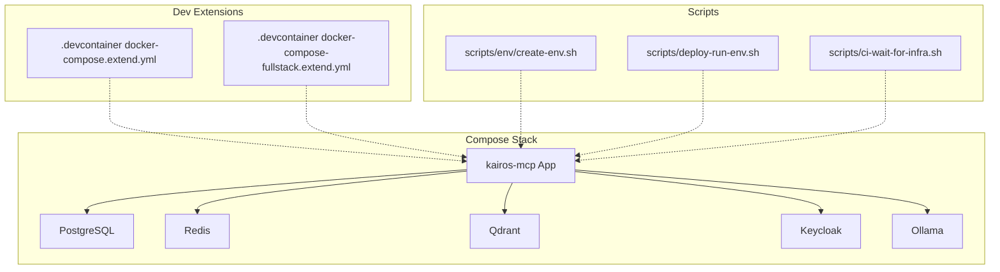

**Diagram sources**
- [compose.yaml:1-200](file://compose.yaml#L1-L200)
- [.devcontainer/docker-compose.extend.yml:1-200](file://.devcontainer/docker-compose.extend.yml#L1-L200)
- [.devcontainer/docker-compose-fullstack.extend.yml:1-200](file://.devcontainer/docker-compose-fullstack.extend.yml#L1-L200)
- [scripts/env/create-env.sh:1-200](file://scripts/env/create-env.sh#L1-L200)
- [scripts/deploy-run-env.sh:1-200](file://scripts/deploy-run-env.sh#L1-L200)
- [scripts/ci-wait-for-infra.sh:1-200](file://scripts/ci-wait-for-infra.sh#L1-L200)

**Section sources**
- [compose.yaml:1-200](file://compose.yaml#L1-L200)
- [Dockerfile:1-200](file://Dockerfile#L1-L200)
- [Dockerfile.dev:1-200](file://Dockerfile.dev#L1-L200)
- [Dockerfile.stdio:1-200](file://Dockerfile.stdio#L1-L200)
- [.devcontainer/docker-compose.extend.yml:1-200](file://.devcontainer/docker-compose.extend.yml#L1-L200)
- [.devcontainer/docker-compose-fullstack.extend.yml:1-200](file://.devcontainer/docker-compose-fullstack.extend.yml#L1-L200)
- [scripts/env/create-env.sh:1-200](file://scripts/env/create-env.sh#L1-L200)
- [scripts/deploy-run-env.sh:1-200](file://scripts/deploy-run-env.sh#L1-L200)
- [scripts/ci-wait-for-infra.sh:1-200](file://scripts/ci-wait-for-infra.sh#L1-L200)
- [docs/install/README.md:1-200](file://docs/install/README.md#L1-L200)
- [docs/install/docker-compose-full-stack.md:1-200](file://docs/install/docker-compose-full-stack.md#L1-L200)
- [docs/install/docker-compose-simple.md:1-200](file://docs/install/docker-compose-simple.md#L1-L200)

## Core Components
The core services required by Kairos MCP include:
- Application server (Kairos MCP)
- PostgreSQL for relational data
- Redis for caching and pub/sub
- Qdrant for vector search
- Keycloak for OIDC authentication
- Ollama for local model inference

These services are defined in the top-level Compose configuration and can be extended or overridden for different environments. The application reads runtime configuration from environment variables and connects to these services over the internal Docker network.

**Section sources**
- [compose.yaml:1-200](file://compose.yaml#L1-L200)
- [src/config.ts:1-200](file://src/config.ts#L1-L200)
- [src/http/http-server-config.ts:1-200](file://src/http/http-server-config.ts#L1-L200)
- [src/services/qdrant/connection.ts:1-200](file://src/services/qdrant/connection.ts#L1-L200)
- [src/services/redis.ts:1-200](file://src/services/redis.ts#L1-L200)

## Architecture Overview
The following diagram shows how Kairos MCP interacts with its dependencies via Docker networking and environment-driven configuration.

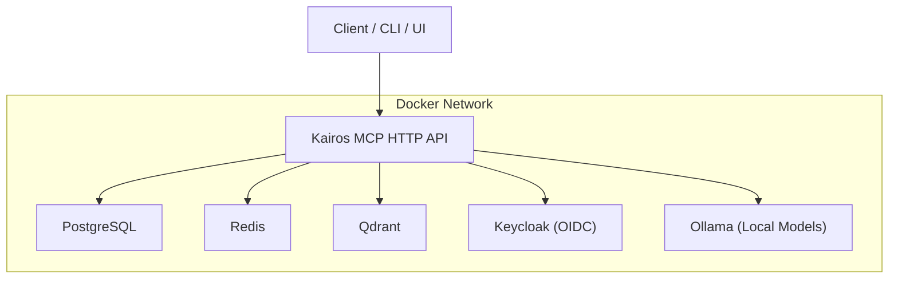

**Diagram sources**
- [compose.yaml:1-200](file://compose.yaml#L1-L200)
- [src/http/http-server-config.ts:1-200](file://src/http/http-server-config.ts#L1-L200)
- [src/services/qdrant/connection.ts:1-200](file://src/services/qdrant/connection.ts#L1-L200)
- [src/services/redis.ts:1-200](file://src/services/redis.ts#L1-L200)

## Detailed Component Analysis

### Service Definitions and Networking
- Services are declared in the top-level Compose file. Each service exposes ports as needed and joins the default Docker network.
- Service discovery uses service names as hostnames (e.g., postgres, redis, qdrant, keycloak, ollama).
- Health checks and depends_on patterns ensure startup order and readiness.

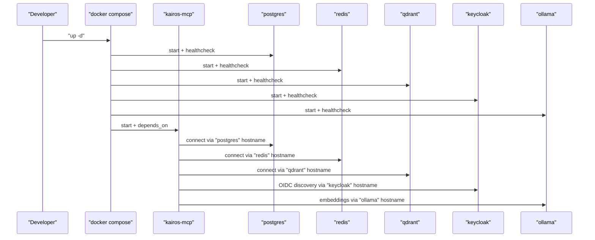

**Diagram sources**
- [compose.yaml:1-200](file://compose.yaml#L1-L200)
- [src/http/http-server-config.ts:1-200](file://src/http/http-server-config.ts#L1-L200)
- [src/services/qdrant/connection.ts:1-200](file://src/services/qdrant/connection.ts#L1-L200)
- [src/services/redis.ts:1-200](file://src/services/redis.ts#L1-L200)

**Section sources**
- [compose.yaml:1-200](file://compose.yaml#L1-L200)

### Volume Management and Persistent Storage
- Data directories for PostgreSQL, Qdrant, and other stateful services are mounted to named volumes or bind mounts.
- Use named volumes for portability across environments; use bind mounts for quick local iteration.
- Ensure volume ownership and permissions align with container user IDs.

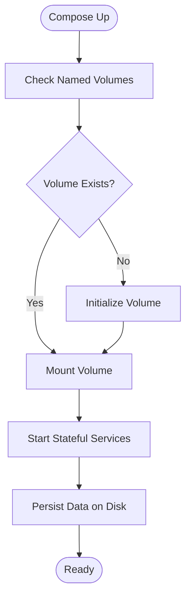

**Diagram sources**
- [compose.yaml:1-200](file://compose.yaml#L1-L200)

**Section sources**
- [compose.yaml:1-200](file://compose.yaml#L1-L200)

### Environment Variables and Secrets Handling
- Application configuration is driven by environment variables. Refer to the application config module for supported keys.
- Use .env files for local development and secret managers or Docker secrets for production.
- Scripts are available to generate environment templates and run the app with prepared env.

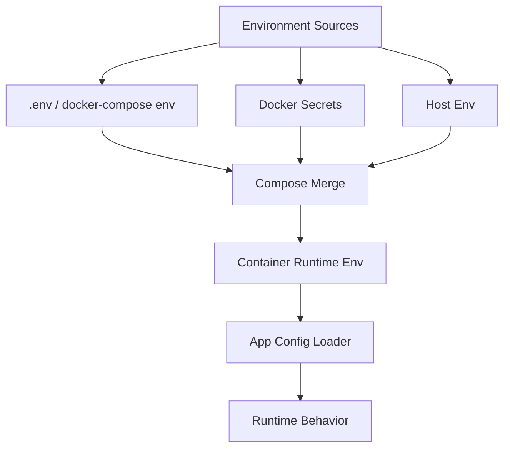

**Diagram sources**
- [src/config.ts:1-200](file://src/config.ts#L1-L200)
- [scripts/env/create-env.sh:1-200](file://scripts/env/create-env.sh#L1-L200)
- [scripts/deploy-run-env.sh:1-200](file://scripts/deploy-run-env.sh#L1-L200)

**Section sources**
- [src/config.ts:1-200](file://src/config.ts#L1-L200)
- [scripts/env/create-env.sh:1-200](file://scripts/env/create-env.sh#L1-L200)
- [scripts/deploy-run-env.sh:1-200](file://scripts/deploy-run-env.sh#L1-L200)

### Inter-Service Communication
- All services communicate over the default Docker network using service names as hostnames.
- Ports are exposed only when necessary (e.g., external access to Keycloak admin or Ollama).
- Health checks prevent premature connections and improve resilience.

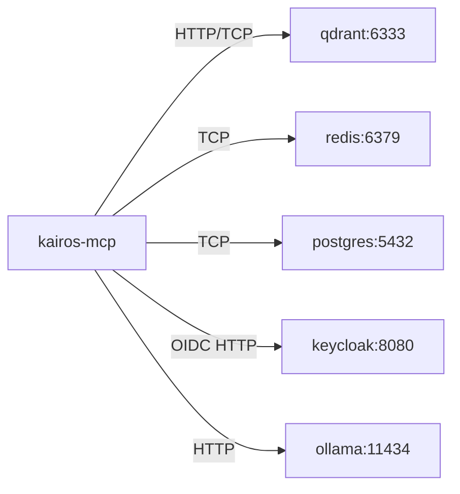

**Diagram sources**
- [compose.yaml:1-200](file://compose.yaml#L1-L200)
- [src/services/qdrant/connection.ts:1-200](file://src/services/qdrant/connection.ts#L1-L200)
- [src/services/redis.ts:1-200](file://src/services/redis.ts#L1-L200)

**Section sources**
- [compose.yaml:1-200](file://compose.yaml#L1-L200)
- [src/services/qdrant/connection.ts:1-200](file://src/services/qdrant/connection.ts#L1-L200)
- [src/services/redis.ts:1-200](file://src/services/redis.ts#L1-L200)

### Development Environment with Hot Reload
- Use the development Dockerfile and dev container extensions to enable live reload during development.
- Bind-mount source code and configuration to avoid rebuilds.
- Extend the base compose with additional services if needed.

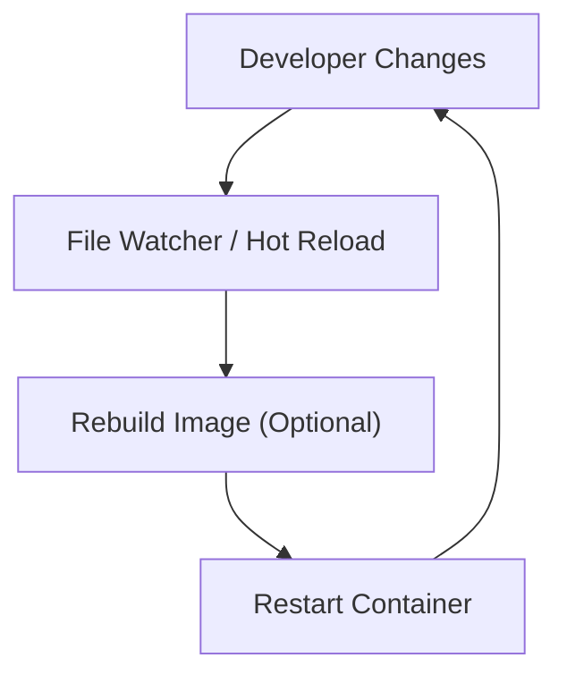

**Diagram sources**
- [Dockerfile.dev:1-200](file://Dockerfile.dev#L1-L200)
- [.devcontainer/docker-compose.extend.yml:1-200](file://.devcontainer/docker-compose.extend.yml#L1-L200)
- [.devcontainer/docker-compose-fullstack.extend.yml:1-200](file://.devcontainer/docker-compose-fullstack.extend.yml#L1-L200)

**Section sources**
- [Dockerfile.dev:1-200](file://Dockerfile.dev#L1-L200)
- [.devcontainer/docker-compose.extend.yml:1-200](file://.devcontainer/docker-compose.extend.yml#L1-L200)
- [.devcontainer/docker-compose-fullstack.extend.yml:1-200](file://.devcontainer/docker-compose-fullstack.extend.yml#L1-L200)

### Production-Ready Setup with Scaling Options
- Define replicas for stateless services (e.g., kairos-mcp) behind a reverse proxy or ingress.
- Use persistent volumes for stateful services (PostgreSQL, Qdrant).
- Configure resource limits, restart policies, and health checks.
- Externalize secrets via Docker secrets or an external secret store.

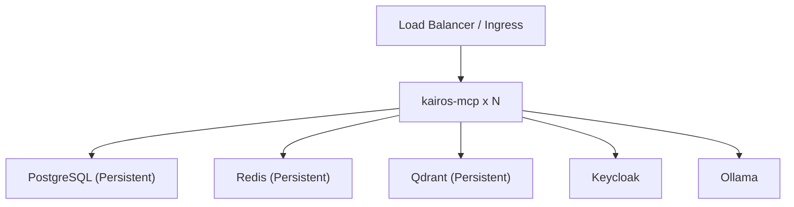

**Diagram sources**
- [compose.yaml:1-200](file://compose.yaml#L1-L200)

**Section sources**
- [compose.yaml:1-200](file://compose.yaml#L1-L200)

### Minimal Deployments
- For local testing or constrained environments, deploy only essential services (e.g., PostgreSQL, Redis, Qdrant) and disable optional features like Keycloak or Ollama.
- Adjust environment variables accordingly to skip unavailable services.

**Section sources**
- [compose.yaml:1-200](file://compose.yaml#L1-L200)
- [docs/install/docker-compose-simple.md:1-200](file://docs/install/docker-compose-simple.md#L1-L200)

### Backup Strategies and Disaster Recovery
- Back up PostgreSQL using native tools or snapshots of the volume.
- Snapshot Qdrant data directory or use built-in snapshotting mechanisms.
- Export Keycloak realm configurations periodically.
- Maintain offsite copies and test restore procedures regularly.

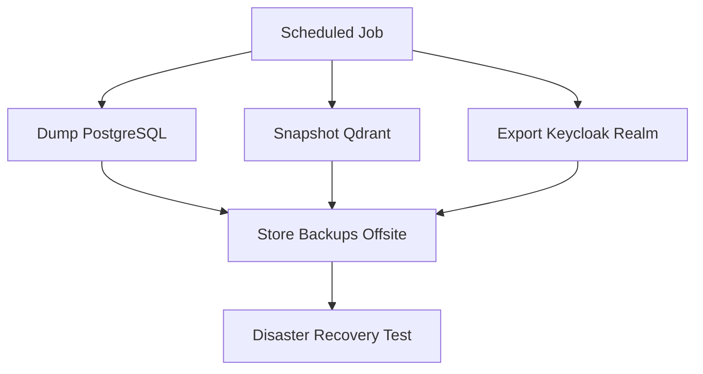

**Diagram sources**
- [compose.yaml:1-200](file://compose.yaml#L1-L200)

**Section sources**
- [compose.yaml:1-200](file://compose.yaml#L1-L200)

### Operational Monitoring
- Expose metrics endpoints and scrape them with Prometheus or similar tools.
- Centralize logs and forward to log aggregation systems.
- Use health checks and readiness probes to monitor service status.

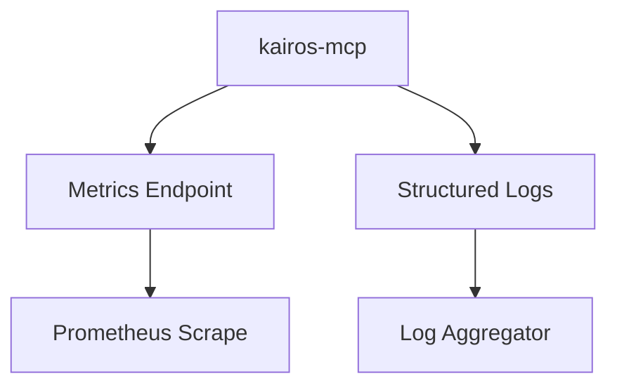

**Diagram sources**
- [compose.yaml:1-200](file://compose.yaml#L1-L200)

**Section sources**
- [compose.yaml:1-200](file://compose.yaml#L1-L200)

## Dependency Analysis
The application depends on several external services. The following diagram maps those dependencies and their connection points.

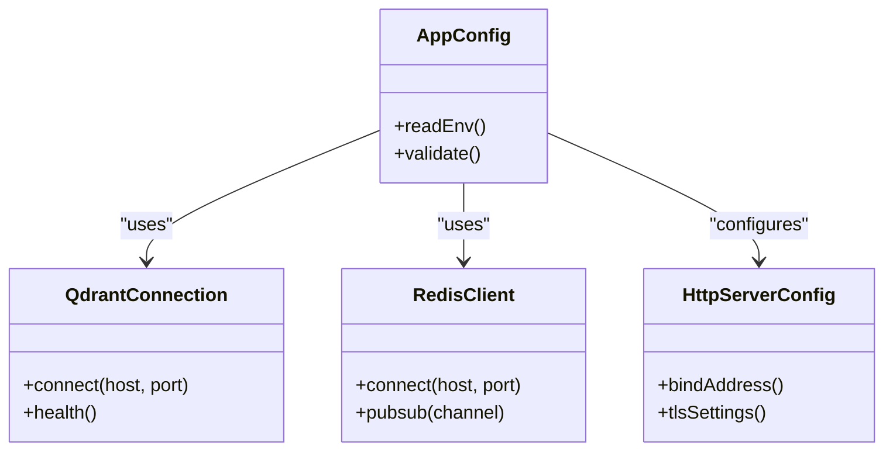

**Diagram sources**
- [src/config.ts:1-200](file://src/config.ts#L1-L200)
- [src/services/qdrant/connection.ts:1-200](file://src/services/qdrant/connection.ts#L1-L200)
- [src/services/redis.ts:1-200](file://src/services/redis.ts#L1-L200)
- [src/http/http-server-config.ts:1-200](file://src/http/http-server-config.ts#L1-L200)

**Section sources**
- [src/config.ts:1-200](file://src/config.ts#L1-L200)
- [src/services/qdrant/connection.ts:1-200](file://src/services/qdrant/connection.ts#L1-L200)
- [src/services/redis.ts:1-200](file://src/services/redis.ts#L1-L200)
- [src/http/http-server-config.ts:1-200](file://src/http/http-server-config.ts#L1-L200)

## Performance Considerations
- Tune connection pools for PostgreSQL and Redis based on expected concurrency.
- Allocate sufficient CPU and memory for Qdrant and Ollama depending on workload.
- Use compression and pagination for large exports and searches.
- Enable caching layers where appropriate and monitor cache hit rates.
- Scale horizontally for stateless components and vertically for stateful ones.

[No sources needed since this section provides general guidance]

## Troubleshooting Guide
Common issues and resolutions:
- Connection failures: verify service names, ports, and environment variables.
- Authentication errors: confirm Keycloak realm, client credentials, and redirect URIs.
- Vector search problems: check Qdrant collection initialization and embedding dimensions.
- Cache inconsistencies: validate Redis connectivity and TTL settings.
- Startup ordering: ensure health checks pass before dependent services start.

Use the CI wait script to probe infrastructure readiness during automated runs.

**Section sources**
- [scripts/ci-wait-for-infra.sh:1-200](file://scripts/ci-wait-for-infra.sh#L1-L200)
- [docs/keycloak/README.md:1-200](file://docs/keycloak/README.md#L1-L200)

## Conclusion
This guide outlines how to orchestrate Kairos MCP with its dependencies using Docker Compose. By leveraging service discovery, persistent volumes, environment-driven configuration, and robust health checks, you can deploy reliable stacks for development, production, and minimal scenarios. Incorporate backups, disaster recovery, and monitoring to maintain operational excellence.

[No sources needed since this section summarizes without analyzing specific files]

## Appendices

### Installation References
- Full stack installation guide
- Simple installation guide
- Prerequisites and Keycloak setup

**Section sources**
- [docs/install/README.md:1-200](file://docs/install/README.md#L1-L200)
- [docs/install/docker-compose-full-stack.md:1-200](file://docs/install/docker-compose-full-stack.md#L1-L200)
- [docs/install/docker-compose-simple.md:1-200](file://docs/install/docker-compose-simple.md#L1-L200)
- [docs/keycloak/README.md:1-200](file://docs/keycloak/README.md#L1-L200)