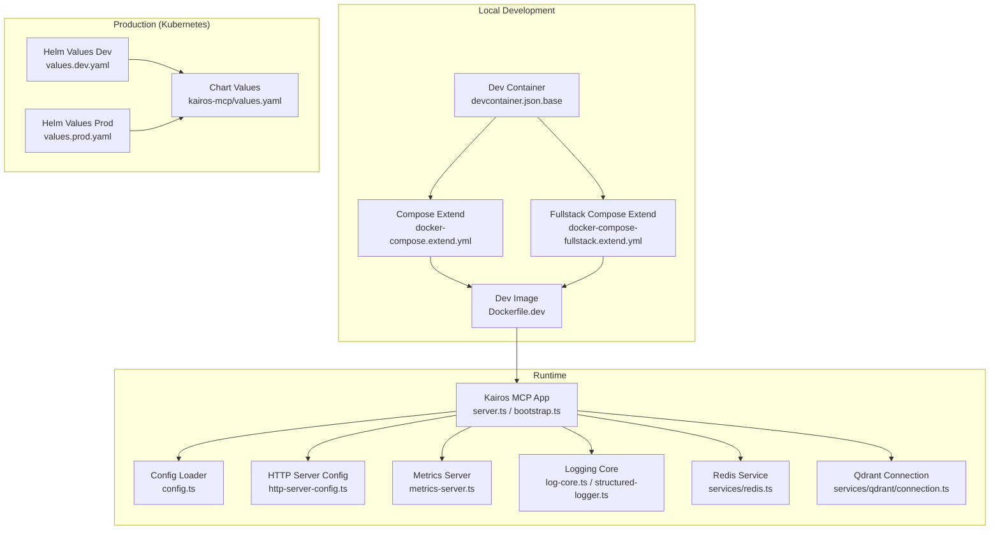
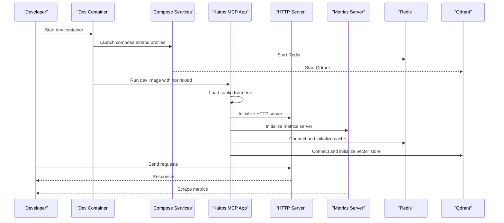
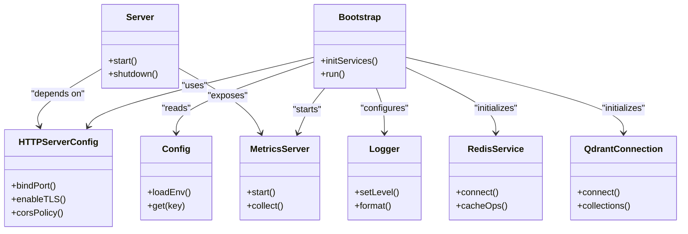

# Environment-Specific Configurations

<cite>
**Referenced Files in This Document**
- [compose.yaml](file://compose.yaml)
- [.devcontainer/docker-compose.extend.yml](file://devcontainer/docker-compose.extend.yml)
- [.devcontainer/docker-compose-fullstack.extend.yml](file://devcontainer/docker-compose-fullstack.extend.yml)
- [.devcontainer/devcontainer.json.base](file://devcontainer/devcontainer.json.base)
- [.devcontainer/devcontainer-fullstack.json](file://devcontainer/devcontainer-fullstack.json)
- [.devcontainer/use-config.sh](file://devcontainer/use-config.sh)
- [.devcontainer/validate.sh](file://devcontainer/validate.sh)
- [Dockerfile.dev](file://Dockerfile.dev)
- [Dockerfile](file://Dockerfile)
- [Dockerfile.stdio](file://Dockerfile.stdio)
- [scripts/deploy-run-env.sh](file://scripts/deploy-run-env.sh)
- [scripts/env/create-env.sh](file://scripts/env/create-env.sh)
- [helm/values.dev.yaml](file://helm/values.dev.yaml)
- [helm/values.prod.yaml](file://helm/values.prod.yaml)
- [helm/kairos-mcp/values.yaml](file://helm/kairos-mcp/values.yaml)
- [src/config.ts](file://src/config.ts)
- [src/http/http-server-config.ts](file://src/http/http-server-config.ts)
- [src/metrics-server.ts](file://src/metrics-server.ts)
- [src/utils/log-core.ts](file://src/utils/log-core.ts)
- [src/utils/structured-logger.ts](file://src/utils/structured-logger.ts)
- [src/services/redis.ts](file://src/services/redis.ts)
- [src/services/qdrant/connection.ts](file://src/services/qdrant/connection.ts)
- [src/bootstrap.ts](file://src/bootstrap.ts)
- [src/server.ts](file://src/server.ts)
- [docs/install/docker-compose-simple.md](file://docs/install/docker-compose-simple.md)
- [docs/install/docker-compose-full-stack.md](file://docs/install/docker-compose-full-stack.md)
</cite>

## Table of Contents
1. [Introduction](#introduction)
2. [Project Structure](#project-structure)
3. [Core Components](#core-components)
4. [Architecture Overview](#architecture-overview)
5. [Detailed Component Analysis](#detailed-component-analysis)
6. [Dependency Analysis](#dependency-analysis)
7. [Performance Considerations](#performance-considerations)
8. [Troubleshooting Guide](#troubleshooting-guide)
9. [Conclusion](#conclusion)
10. [Appendices](#appendices)

## Introduction
This document explains environment-specific Docker Compose configurations for Kairos MCP across development, production, and minimal deployment scenarios. It covers hot reload and debugging in development, scaling and high availability in production, secrets handling, configuration overrides, performance tuning, logging, monitoring, and security best practices. The guidance is grounded in the repository’s Dockerfiles, Compose files, Helm values, and runtime configuration modules.

## Project Structure
Kairos MCP provides multiple ways to run locally and at scale:
- Local development with Dev Containers and Compose extensions
- Simple single-node deployments via a base Compose file
- Full-stack local environments including Keycloak, Redis, Qdrant, and Postgres
- Production-grade Kubernetes deployments using Helm charts

**Diagram sources**
- [.devcontainer/devcontainer.json.base](file://devcontainer/devcontainer.json.base)
- [.devcontainer/docker-compose.extend.yml](file://devcontainer/docker-compose.extend.yml)
- [.devcontainer/docker-compose-fullstack.extend.yml](file://devcontainer/docker-compose-fullstack.extend.yml)
- [Dockerfile.dev](file://Dockerfile.dev)
- [src/server.ts](file://src/server.ts)
- [src/bootstrap.ts](file://src/bootstrap.ts)
- [src/config.ts](file://src/config.ts)
- [src/http/http-server-config.ts](file://src/http/http-server-config.ts)
- [src/metrics-server.ts](file://src/metrics-server.ts)
- [src/utils/log-core.ts](file://src/utils/log-core.ts)
- [src/utils/structured-logger.ts](file://src/utils/structured-logger.ts)
- [src/services/redis.ts](file://src/services/redis.ts)
- [src/services/qdrant/connection.ts](file://src/services/qdrant/connection.ts)
- [helm/values.dev.yaml](file://helm/values.dev.yaml)
- [helm/values.prod.yaml](file://helm/values.prod.yaml)
- [helm/kairos-mcp/values.yaml](file://helm/kairos-mcp/values.yaml)

**Section sources**
- [compose.yaml](file://compose.yaml)
- [.devcontainer/docker-compose.extend.yml](file://devcontainer/docker-compose.extend.yml)
- [.devcontainer/docker-compose-fullstack.extend.yml](file://devcontainer/docker-compose-fullstack.extend.yml)
- [Dockerfile.dev](file://Dockerfile.dev)
- [Dockerfile](file://Dockerfile)
- [Dockerfile.stdio](file://Dockerfile.stdio)
- [docs/install/docker-compose-simple.md](file://docs/install/docker-compose-simple.md)
- [docs/install/docker-compose-full-stack.md](file://docs/install/docker-compose-full-stack.md)

## Core Components
- Configuration loader: centralizes environment variables and defaults used by the application and services.
- HTTP server configuration: binds ports, TLS, CORS, and health endpoints.
- Metrics server: exposes Prometheus-compatible metrics.
- Logging core and structured logger: control log levels, formats, and destinations.
- External service integrations: Redis for caching/pub-sub and Qdrant for vector storage.
- Bootstrap and server entrypoints: orchestrate startup, dependency initialization, and lifecycle hooks.

Key responsibilities:
- Read environment variables and apply sensible defaults per environment.
- Initialize external connections (Redis, Qdrant).
- Start HTTP API and optional metrics endpoint.
- Configure logging and metrics collection.

**Section sources**
- [src/config.ts](file://src/config.ts)
- [src/http/http-server-config.ts](file://src/http/http-server-config.ts)
- [src/metrics-server.ts](file://src/metrics-server.ts)
- [src/utils/log-core.ts](file://src/utils/log-core.ts)
- [src/utils/structured-logger.ts](file://src/utils/structured-logger.ts)
- [src/services/redis.ts](file://src/services/redis.ts)
- [src/services/qdrant/connection.ts](file://src/services/qdrant/connection.ts)
- [src/bootstrap.ts](file://src/bootstrap.ts)
- [src/server.ts](file://src/server.ts)

## Architecture Overview
The runtime architecture centers on a Node.js application that reads configuration from environment variables, initializes external dependencies, and serves HTTP APIs and metrics. In development, hot reload and debuggers are enabled; in production, horizontal scaling and observability are emphasized.

**Diagram sources**
- [.devcontainer/devcontainer.json.base](file://devcontainer/devcontainer.json.base)
- [.devcontainer/docker-compose.extend.yml](file://devcontainer/docker-compose.extend.yml)
- [.devcontainer/docker-compose-fullstack.extend.yml](file://devcontainer/docker-compose-fullstack.extend.yml)
- [Dockerfile.dev](file://Dockerfile.dev)
- [src/config.ts](file://src/config.ts)
- [src/http/http-server-config.ts](file://src/http/http-server-config.ts)
- [src/metrics-server.ts](file://src/metrics-server.ts)
- [src/services/redis.ts](file://src/services/redis.ts)
- [src/services/qdrant/connection.ts](file://src/services/qdrant/connection.ts)

## Detailed Component Analysis

### Development Environment Setup
- Hot reload: The development image enables live reload during development to speed up iteration.
- Debugging: The dev image supports attaching debuggers for Node.js processes.
- Dev Container integration: Base Dev Container configuration orchestrates Compose profiles and volumes for code sync.
- Compose extensions: Separate extend files provide lightweight or full-stack stacks (including Keycloak, Redis, Qdrant, Postgres).
- Helper scripts: Scripts assist in creating environment files and validating configurations.

Recommended steps:
- Use the Dev Container to start the stack with hot reload and debugger support.
- Choose the appropriate Compose profile:
  - Lightweight: app + Redis + Qdrant
  - Full-stack: adds Keycloak and other infrastructure
- Ensure environment variables are present for required services.

Security considerations for development:
- Keep secrets out of version control; use local .env files mounted into containers.
- Disable strict TLS in local dev unless explicitly needed.

**Section sources**
- [.devcontainer/devcontainer.json.base](file://devcontainer/devcontainer.json.base)
- [.devcontainer/docker-compose.extend.yml](file://devcontainer/docker-compose.extend.yml)
- [.devcontainer/docker-compose-fullstack.extend.yml](file://devcontainer/docker-compose-fullstack.extend.yml)
- [.devcontainer/use-config.sh](file://devcontainer/use-config.sh)
- [.devcontainer/validate.sh](file://devcontainer/validate.sh)
- [Dockerfile.dev](file://Dockerfile.dev)
- [scripts/env/create-env.sh](file://scripts/env/create-env.sh)

### Production-Ready Configurations
- Scaling: Horizontal Pod Autoscaler and Vertical Pod Autoscaler templates exist in Helm for CPU/memory-based scaling.
- High availability: Stateful components (e.g., Redis failover, Postgres cluster) are provisioned via operators in Kubernetes.
- Load balancing: Ingress/Gateway resources expose services externally with TLS termination.
- Observability: ServiceMonitors and PrometheusRules enable metrics scraping and alerting.
- Secrets management: Kubernetes Secrets and Jobs generate credentials securely.

Operational notes:
- Use Helm values files for environment-specific tuning (dev vs prod).
- Enable TLS and secure OIDC providers in production.
- Tune resource requests/limits and autoscaling thresholds based on load tests.

**Section sources**
- [helm/kairos-mcp/templates/app-hpa.yaml](file://helm/kairos-mcp/templates/app-hpa.yaml)
- [helm/kairos-mcp/templates/app-vpa.yaml](file://helm/kairos-mcp/templates/qdrant-hpa.yaml)
- [helm/kairos-mcp/templates/qdrant-servicemonitor.yaml](file://helm/kairos-mcp/templates/qdrant-servicemonitor.yaml)
- [helm/kairos-mcp/templates/postgres-servicemonitor.yaml](file://helm/kairos-mcp/templates/postgres-servicemonitor.yaml)
- [helm/kairos-mcp/templates/redis-servicemonitor.yaml](file://helm/kairos-mcp/templates/redis-servicemonitor.yaml)
- [helm/kairos-mcp/templates/credentials-secret-generator-job.yaml](file://helm/kairos-mcp/templates/credentials-secret-generator-job.yaml)
- [helm/kairos-mcp/templates/gateway.yaml](file://helm/kairos-mcp/templates/gateway.yaml)
- [helm/values.dev.yaml](file://helm/values.dev.yaml)
- [helm/values.prod.yaml](file://helm/values.prod.yaml)
- [helm/kairos-mcp/values.yaml](file://helm/kairos-mcp/values.yaml)

### Minimal Deployment Scenarios
- Single-node Compose: A simple Compose setup runs the app with Redis and Qdrant for quick evaluation.
- Stdio mode: For CLI-only usage without HTTP, a dedicated stdio image can be used.
- Quick start guides: Documentation provides step-by-step instructions for running the minimal stack.

Use cases:
- Testing and evaluation
- CI pipelines
- Local demos

**Section sources**
- [compose.yaml](file://compose.yaml)
- [Dockerfile.stdio](file://Dockerfile.stdio)
- [docs/install/docker-compose-simple.md](file://docs/install/docker-compose-simple.md)

### Environment Variable Overrides and Configuration Management
- Centralized configuration: The application loads settings from environment variables with defaults suitable for each environment.
- Runtime flags: HTTP server configuration controls ports, TLS, CORS, and health endpoints.
- Bootstrap flow: Initialization order ensures dependencies are ready before serving traffic.
- Helpers: Scripts create default environment files and validate presence of required keys.

Best practices:
- Maintain separate .env files per environment and mount them into containers.
- Avoid committing secrets; prefer secret managers or platform-native secret stores.
- Validate configuration early in startup to fail fast on misconfiguration.

**Section sources**
- [src/config.ts](file://src/config.ts)
- [src/http/http-server-config.ts](file://src/http/http-server-config.ts)
- [src/bootstrap.ts](file://src/bootstrap.ts)
- [scripts/deploy-run-env.sh](file://scripts/deploy-run-env.sh)
- [scripts/env/create-env.sh](file://scripts/env/create-env.sh)

### Secrets Handling Across Environments
- Development: Mount local secret files into containers; avoid hardcoding values.
- Production: Use Kubernetes Secrets and automated credential generation jobs.
- OIDC and database credentials should be injected via environment variables bound to Secret objects.

Security recommendations:
- Rotate secrets regularly and automate rotation where possible.
- Restrict access to Secret objects using RBAC.
- Prefer short-lived tokens for inter-service communication when supported.

**Section sources**
- [helm/kairos-mcp/templates/credentials-secret-generator-job.yaml](file://helm/kairos-mcp/templates/credentials-secret-generator-job.yaml)
- [src/config.ts](file://src/config.ts)

### Performance Tuning Parameters
- Concurrency limits: Tune request concurrency and worker pools according to CPU/memory resources.
- Cache sizing: Adjust Redis memory limits and eviction policies for your workload.
- Vector store tuning: Configure Qdrant collection sizes and retention policies.
- Autoscaling: Set HPA/VPA targets based on observed latency and throughput.

Monitoring:
- Expose metrics endpoints and scrape with Prometheus.
- Define alerts for error rates, latency percentiles, and resource saturation.

**Section sources**
- [src/metrics-server.ts](file://src/metrics-server.ts)
- [src/services/redis.ts](file://src/services/redis.ts)
- [src/services/qdrant/connection.ts](file://src/services/qdrant/connection.ts)
- [helm/kairos-mcp/templates/app-hpa.yaml](file://helm/kairos-mcp/templates/app-hpa.yaml)
- [helm/kairos-mcp/templates/app-vpa.yaml](file://helm/kairos-mcp/templates/app-vpa.yaml)

### Logging Configurations
- Log level and format: Control verbosity and structured output via environment variables.
- Destinations: Stream logs to stdout/stderr for container orchestration to collect.
- Correlation IDs: Include request identifiers for tracing across services.

Recommendations:
- Use structured JSON logs in production for parsing and aggregation.
- Redact sensitive fields before emitting logs.

**Section sources**
- [src/utils/log-core.ts](file://src/utils/log-core.ts)
- [src/utils/structured-logger.ts](file://src/utils/structured-logger.ts)

### Monitoring Setup
- Metrics: Application and infrastructure metrics exposed for Prometheus scraping.
- ServiceMonitors: Predefined monitors for Redis, Qdrant, and Postgres.
- Alerting rules: PrometheusRule definitions for critical signals.

Operational tips:
- Align scrape intervals with alert thresholds.
- Retain metrics according to compliance requirements.

**Section sources**
- [src/metrics-server.ts](file://src/metrics-server.ts)
- [helm/kairos-mcp/templates/qdrant-servicemonitor.yaml](file://helm/kairos-mcp/templates/qdrant-servicemonitor.yaml)
- [helm/kairos-mcp/templates/postgres-servicemonitor.yaml](file://helm/kairos-mcp/templates/postgres-servicemonitor.yaml)
- [helm/kairos-mcp/templates/redis-servicemonitor.yaml](file://helm/kairos-mcp/templates/redis-servicemonitor.yaml)

### Security Considerations and Best Practices
- TLS termination at ingress/gateway for all external traffic.
- OIDC provider integration with least-privilege scopes.
- Network policies to restrict inter-service communication.
- Regular vulnerability scanning and dependency updates.
- Secure defaults in production images (non-root user, read-only filesystems where possible).

**Section sources**
- [helm/kairos-mcp/templates/gateway.yaml](file://helm/kairos-mcp/templates/gateway.yaml)
- [Dockerfile](file://Dockerfile)
- [Dockerfile.dev](file://Dockerfile.dev)

## Dependency Analysis
The following diagram maps key runtime dependencies and their relationships:

**Diagram sources**
- [src/config.ts](file://src/config.ts)
- [src/http/http-server-config.ts](file://src/http/http-server-config.ts)
- [src/metrics-server.ts](file://src/metrics-server.ts)
- [src/utils/log-core.ts](file://src/utils/log-core.ts)
- [src/utils/structured-logger.ts](file://src/utils/structured-logger.ts)
- [src/services/redis.ts](file://src/services/redis.ts)
- [src/services/qdrant/connection.ts](file://src/services/qdrant/connection.ts)
- [src/bootstrap.ts](file://src/bootstrap.ts)
- [src/server.ts](file://src/server.ts)

**Section sources**
- [src/config.ts](file://src/config.ts)
- [src/http/http-server-config.ts](file://src/http/http-server-config.ts)
- [src/metrics-server.ts](file://src/metrics-server.ts)
- [src/utils/log-core.ts](file://src/utils/log-core.ts)
- [src/utils/structured-logger.ts](file://src/utils/structured-logger.ts)
- [src/services/redis.ts](file://src/services/redis.ts)
- [src/services/qdrant/connection.ts](file://src/services/qdrant/connection.ts)
- [src/bootstrap.ts](file://src/bootstrap.ts)
- [src/server.ts](file://src/server.ts)

## Performance Considerations
- Right-size containers: Set CPU/memory requests and limits aligned with measured baselines.
- Tune connection pools: Adjust Redis and Qdrant client pool sizes to match concurrency.
- Enable compression and caching where applicable.
- Use autoscaling policies that respond to latency and queue depth.
- Monitor tail latencies and set SLOs accordingly.

[No sources needed since this section provides general guidance]

## Troubleshooting Guide
Common issues and resolutions:
- Missing environment variables: Validate required keys at startup; ensure .env files are mounted.
- Redis/Qdrant connectivity failures: Check network policies, service discovery, and credentials.
- TLS handshake errors: Verify certificate validity and issuer chain.
- Metrics not scraped: Confirm ServiceMonitor selectors and scrape targets.
- Logs too verbose: Adjust log level and filter sensitive data.

Operational checks:
- Health endpoints should return OK after successful initialization.
- Review structured logs for correlation IDs and error traces.
- Inspect autoscaling events and resource utilization graphs.

**Section sources**
- [src/bootstrap.ts](file://src/bootstrap.ts)
- [src/http/http-server-config.ts](file://src/http/http-server-config.ts)
- [src/metrics-server.ts](file://src/metrics-server.ts)
- [src/utils/log-core.ts](file://src/utils/log-core.ts)
- [src/utils/structured-logger.ts](file://src/utils/structured-logger.ts)

## Conclusion
Kairos MCP provides flexible, environment-aware configurations for development, testing, and production. By leveraging Dev Containers, Compose profiles, Helm values, and robust runtime configuration, teams can iterate quickly in development while ensuring reliability, scalability, and security in production. Adopting structured logging, comprehensive metrics, and autoscaling policies will help maintain performance and observability across all environments.

[No sources needed since this section summarizes without analyzing specific files]

## Appendices

### Quick Start References
- Simple Compose deployment guide
- Full-stack Compose guide including Keycloak and databases

**Section sources**
- [docs/install/docker-compose-simple.md](file://docs/install/docker-compose-simple.md)
- [docs/install/docker-compose-full-stack.md](file://docs/install/docker-compose-full-stack.md)