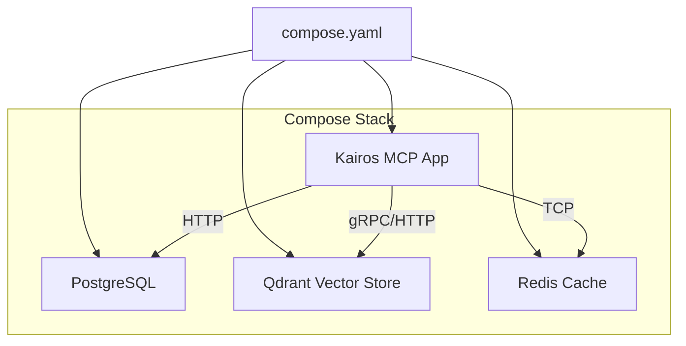
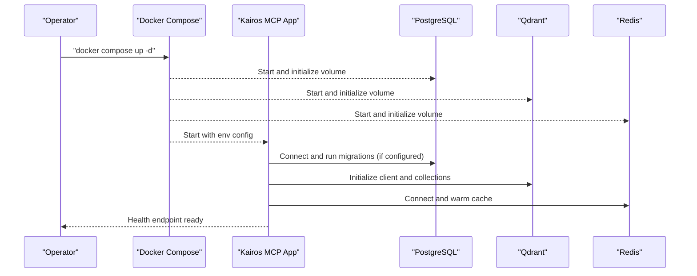
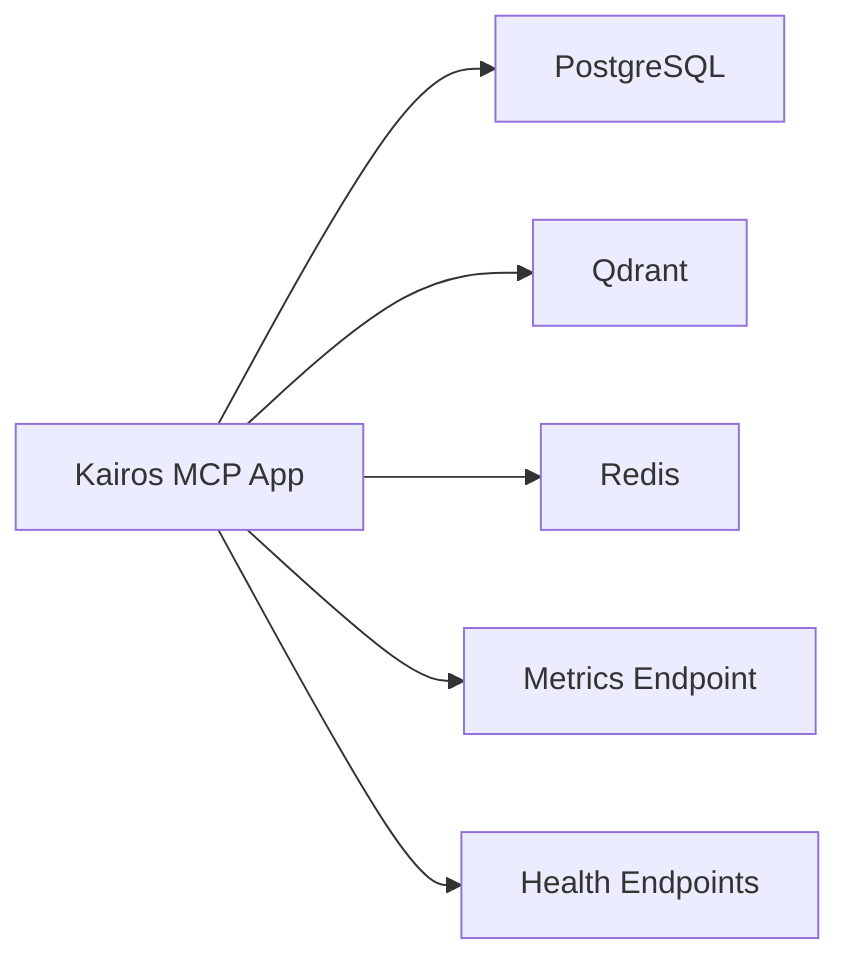

# Operations and Management

<cite>
**Referenced Files in This Document**
- [compose.yaml](file://compose.yaml)
- [Dockerfile](file://Dockerfile)
- [Dockerfile.dev](file://Dockerfile.dev)
- [Dockerfile.stdio](file://Dockerfile.stdio)
- [.devcontainer/docker-compose-fullstack.extend.yml](file://.devcontainer/docker-compose-fullstack.extend.yml)
- [.devcontainer/docker-compose.extend.yml](file://.devcontainer/docker-compose.extend.yml)
- [scripts/deploy-run-env.sh](file://scripts/deploy-run-env.sh)
- [src/server.ts](file://src/server.ts)
- [src/bootstrap.ts](file://src/bootstrap.ts)
- [src/config.ts](file://src/config.ts)
- [src/metrics-server.ts](file://src/metrics-server.ts)
- [src/http/http-health-routes.ts](file://src/http/http-health-routes.ts)
- [src/utils/log-core.ts](file://src/utils/log-core.ts)
- [src/utils/structured-logger.ts](file://src/utils/structured-logger.ts)
- [src/services/qdrant/connection.ts](file://src/services/qdrant/connection.ts)
- [src/services/qdrant/service.ts](file://src/services/qdrant/service.ts)
- [src/services/redis.ts](file://src/services/redis.ts)
- [src/services/key-value-store-factory.ts](file://src/services/key-value-store-factory.ts)
- [helm/kairos-mcp/values.yaml](file://helm/kairos-mcp/values.yaml)
- [helm/kairos-mcp/templates/kairos-mcp-deployment.yaml](file://helm/kairos-mcp/templates/kairos-mcp-deployment.yaml)
- [helm/kairos-mcp/templates/postgres-cluster-cr.yaml](file://helm/kairos-mcp/templates/postgres-cluster-cr.yaml)
- [helm/kairos-mcp/templates/redis-failover-cr.yaml](file://helm/kairos-mcp/templates/redis-failover-cr.yaml)
- [helm/kairos-mcp/templates/qdrant-hpa.yaml](file://helm/kairos-mcp/templates/qdrant-hpa.yaml)
- [helm/kairos-mcp/templates/app-hpa.yaml](file://helm/kairos-mcp/templates/app-hpa.yaml)
- [helm/kairos-mcp/templates/prometheusrule.yaml](file://helm/kairos-mcp/templates/prometheusrule.yaml)
- [helm/kairos-mcp/templates/app-servicemonitor.yaml](file://helm/kairos-mcp/templates/app-servicemonitor.yaml)
- [helm/kairos-mcp/templates/qdrant-servicemonitor.yaml](file://helm/kairos-mcp/templates/qdrant-servicemonitor.yaml)
- [helm/kairos-mcp/templates/postgres-servicemonitor.yaml](file://helm/kairos-mcp/templates/postgres-servicemonitor.yaml)
- [helm/kairos-mcp/templates/redis-servicemonitor.yaml](file://helm/kairos-mcp/templates/redis-servicemonitor.yaml)
- [docs/install/docker-compose-simple.md](file://docs/install/docker-compose-simple.md)
- [docs/install/docker-compose-full-stack.md](file://docs/install/docker-compose-full-stack.md)
- [docs/architecture/logging.md](file://docs/architecture/logging.md)
- [docs/security/incident-runbook.md](file://docs/security/incident-runbook.md)
</cite>

## Table of Contents
1. [Introduction](#introduction)
2. [Project Structure](#project-structure)
3. [Core Components](#core-components)
4. [Architecture Overview](#architecture-overview)
5. [Detailed Component Analysis](#detailed-component-analysis)
6. [Dependency Analysis](#dependency-analysis)
7. [Performance Considerations](#performance-considerations)
8. [Troubleshooting Guide](#troubleshooting-guide)
9. [Conclusion](#conclusion)
10. [Appendices](#appendices)

## Introduction
This document provides operational guidance for managing Kairos MCP deployments orchestrated with Docker Compose. It covers service lifecycle management, backup and restore strategies for persistent data (database and vector store), monitoring and logging using Docker’s built-in logging drivers and external aggregation systems, troubleshooting common issues, scaling considerations, container orchestration patterns, integration with container registries, disaster recovery procedures, data migration strategies, and maintenance windows for production environments.

The guidance is grounded in the repository’s Docker Compose configuration, application bootstrap and server startup logic, health endpoints, metrics exposure, and Helm templates that illustrate how services are wired together in more complex environments.

## Project Structure
At a high level, the deployment surface includes:
- A root Docker Compose file defining the application and its dependencies
- Application Dockerfiles for production and development variants
- Environment and runtime scripts used during deployment
- Health and metrics endpoints exposed by the application
- Optional Helm templates that demonstrate persistence, autoscaling, and observability integrations

**Diagram sources**
- [compose.yaml](file://compose.yaml)
- [src/server.ts](file://src/server.ts)
- [src/services/qdrant/connection.ts](file://src/services/qdrant/connection.ts)
- [src/services/redis.ts](file://src/services/redis.ts)

**Section sources**
- [compose.yaml](file://compose.yaml)
- [Dockerfile](file://Dockerfile)
- [Dockerfile.dev](file://Dockerfile.dev)
- [Dockerfile.stdio](file://Dockerfile.stdio)
- [scripts/deploy-run-env.sh](file://scripts/deploy-run-env.sh)

## Core Components
- Application entrypoint and server initialization: The application bootstraps configuration, starts HTTP routes, and exposes health and metrics endpoints.
- Persistence layers:
  - PostgreSQL for relational data
  - Qdrant for vector embeddings and search
  - Redis for caching and session state
- Observability:
  - Health check endpoints for liveness/readiness
  - Metrics endpoint for Prometheus scraping
  - Structured logging to stdout/stderr for Docker log drivers

Key implementation references:
- Server startup and route registration
- Health endpoints
- Metrics server
- Configuration loading
- External service connections (Qdrant, Redis)

**Section sources**
- [src/server.ts](file://src/server.ts)
- [src/bootstrap.ts](file://src/bootstrap.ts)
- [src/config.ts](file://src/config.ts)
- [src/metrics-server.ts](file://src/metrics-server.ts)
- [src/http/http-health-routes.ts](file://src/http/http-health-routes.ts)
- [src/services/qdrant/connection.ts](file://src/services/qdrant/connection.ts)
- [src/services/qdrant/service.ts](file://src/services/qdrant/service.ts)
- [src/services/redis.ts](file://src/services/redis.ts)
- [src/services/key-value-store-factory.ts](file://src/services/key-value-store-factory.ts)

## Architecture Overview
The typical Docker Compose stack consists of the Kairos MCP application plus three supporting services. The application connects to these services via environment-driven configuration.

**Diagram sources**
- [compose.yaml](file://compose.yaml)
- [src/bootstrap.ts](file://src/bootstrap.ts)
- [src/services/qdrant/connection.ts](file://src/services/qdrant/connection.ts)
- [src/services/redis.ts](file://src/services/redis.ts)

## Detailed Component Analysis

### Service Lifecycle Management
- Start: Bring up the full stack or individual services using Docker Compose. Use detached mode for background operation.
- Stop: Gracefully stop services; ensure long-running operations complete before shutdown.
- Restart: Perform rolling restarts at the service level to minimize downtime.
- Update: Rebuild images and update running containers without losing persistent data.

Operational commands:
- Start all services: `docker compose up -d`
- Start specific service: `docker compose up -d <service>`
- Stop all services: `docker compose down`
- Stop specific service: `docker compose stop <service>`
- Restart all services: `docker compose restart`
- Restart specific service: `docker compose restart <service>`
- Update image for a service: rebuild image then `docker compose up -d --no-deps <service>`

Best practices:
- Use named volumes for persistent data to survive container recreation.
- Apply updates with zero-downtime by starting new containers behind a load balancer or by orchestrating rolling restarts.
- Validate health endpoints after updates.

**Section sources**
- [compose.yaml](file://compose.yaml)
- [src/http/http-health-routes.ts](file://src/http/http-health-routes.ts)

### Backup and Restore Strategies
Persistent volumes typically include:
- Database data directory (PostgreSQL)
- Vector store data directory (Qdrant)
- Optional cache/session data (Redis)

Backup approaches:
- Volume snapshots: Use host-level snapshot tools to capture volume contents while services are quiesced or stopped.
- In-service backups:
  - PostgreSQL: Use native dump utilities to export logical backups.
  - Qdrant: Use snapshotting mechanisms provided by the vector store.
  - Redis: Use RDB/AOF snapshots or replication-based backups.

Restore procedures:
- Stop dependent services to avoid writes during restore.
- Replace volume contents with restored data.
- Verify integrity and permissions.
- Restart services and validate health endpoints.

Scheduling:
- Automate periodic backups using cron jobs or system schedulers.
- Retain multiple generations and test restores regularly.

**Section sources**
- [compose.yaml](file://compose.yaml)

### Monitoring and Logging
Logging:
- The application emits structured logs to stdout/stderr. Configure Docker logging drivers (e.g., json-file, gelf, fluentd, journald) to forward logs to an external aggregator such as Loki, Splunk, or ELK.

Monitoring:
- Expose a metrics endpoint for Prometheus scraping.
- Use service monitors or scrape configs to collect metrics from the app and dependencies.

Health checks:
- Implement liveness and readiness probes against health endpoints.
- Use health checks to gate traffic and trigger restarts on failures.

Configuration references:
- Metrics server setup
- Health routes
- Structured logger configuration

**Section sources**
- [src/metrics-server.ts](file://src/metrics-server.ts)
- [src/http/http-health-routes.ts](file://src/http/http-health-routes.ts)
- [src/utils/log-core.ts](file://src/utils/log-core.ts)
- [src/utils/structured-logger.ts](file://src/utils/structured-logger.ts)
- [docs/architecture/logging.md](file://docs/architecture/logging.md)

### Scaling Considerations
Horizontal scaling:
- Run multiple replicas of the application behind a reverse proxy or ingress controller.
- Ensure stateless design for the app layer; rely on shared databases and caches.
- Tune concurrency limits and resource requests/limits per replica.

Autoscaling:
- Use HorizontalPodAutoscaler-like patterns based on CPU/memory or custom metrics (request rate, queue depth).
- Scale database and vector store according to workload characteristics.

Container registries:
- Push images to a private registry and reference them in Compose or Kubernetes manifests.
- Pin versions and use immutable tags for reproducibility.

**Section sources**
- [helm/kairos-mcp/templates/app-hpa.yaml](file://helm/kairos-mcp/templates/app-hpa.yaml)
- [helm/kairos-mcp/templates/qdrant-hpa.yaml](file://helm/kairos-mcp/templates/qdrant-hpa.yaml)
- [helm/kairos-mcp/templates/kairos-mcp-deployment.yaml](file://helm/kairos-mcp/templates/kairos-mcp-deployment.yaml)

### Container Orchestration Patterns
While this guide focuses on Docker Compose, the Helm templates illustrate patterns applicable to larger deployments:
- Stateful services with persistent storage
- Autoscaling policies
- Service monitors for Prometheus
- Separate values files for dev/prod configurations

Adopting these patterns in Compose:
- Define explicit networks and volumes
- Use health checks and depends_on conditions
- Centralize configuration via environment files

**Section sources**
- [helm/kairos-mcp/values.yaml](file://helm/kairos-mcp/values.yaml)
- [helm/kairos-mcp/templates/postgres-cluster-cr.yaml](file://helm/kairos-mcp/templates/postgres-cluster-cr.yaml)
- [helm/kairos-mcp/templates/redis-failover-cr.yaml](file://helm/kairos-mcp/templates/redis-failover-cr.yaml)
- [helm/kairos-mcp/templates/prometheusrule.yaml](file://helm/kairos-mcp/templates/prometheusrule.yaml)
- [helm/kairos-mcp/templates/app-servicemonitor.yaml](file://helm/kairos-mcp/templates/app-servicemonitor.yaml)
- [helm/kairos-mcp/templates/qdrant-servicemonitor.yaml](file://helm/kairos-mcp/templates/qdrant-servicemonitor.yaml)
- [helm/kairos-mcp/templates/postgres-servicemonitor.yaml](file://helm/kairos-mcp/templates/postgres-servicemonitor.yaml)
- [helm/kairos-mcp/templates/redis-servicemonitor.yaml](file://helm/kairos-mcp/templates/redis-servicemonitor.yaml)

### Disaster Recovery Procedures
- Identify critical data stores and their persistence locations.
- Maintain offsite backups with encryption and access controls.
- Test restoration procedures regularly.
- Define RTO/RPO targets and align backup frequency accordingly.
- Document runbooks for failure scenarios and escalation paths.

**Section sources**
- [docs/security/incident-runbook.md](file://docs/security/incident-runbook.md)

### Data Migration Strategies
- Plan schema changes and vector index updates during maintenance windows.
- Use backward-compatible migrations where possible.
- Validate migrations in staging before applying to production.
- Rollback strategy: retain previous data snapshots and application versions.

**Section sources**
- [compose.yaml](file://compose.yaml)

### Maintenance Windows
- Schedule updates and migrations during low-traffic periods.
- Notify stakeholders and monitor closely post-change.
- Keep rollback plans ready and validated.

[No sources needed since this section provides general guidance]

## Dependency Analysis
The application depends on several external services and internal modules. Understanding these relationships helps diagnose connectivity and performance issues.

**Diagram sources**
- [compose.yaml](file://compose.yaml)
- [src/services/qdrant/connection.ts](file://src/services/qdrant/connection.ts)
- [src/services/redis.ts](file://src/services/redis.ts)
- [src/metrics-server.ts](file://src/metrics-server.ts)
- [src/http/http-health-routes.ts](file://src/http/http-health-routes.ts)

**Section sources**
- [compose.yaml](file://compose.yaml)
- [src/services/qdrant/connection.ts](file://src/services/qdrant/connection.ts)
- [src/services/redis.ts](file://src/services/redis.ts)
- [src/metrics-server.ts](file://src/metrics-server.ts)
- [src/http/http-health-routes.ts](file://src/http/http-health-routes.ts)

## Performance Considerations
- Resource allocation: Set appropriate CPU and memory limits for each service.
- Connection pooling: Tune connection pools for database and cache clients.
- Vector indexing: Monitor Qdrant collection sizes and optimize query parameters.
- Caching: Leverage Redis for hot paths and reduce downstream load.
- I/O throughput: Ensure disk performance for persistent volumes, especially for database and vector store.

[No sources needed since this section provides general guidance]

## Troubleshooting Guide
Common issues and resolutions:
- Service connectivity problems:
  - Verify network configuration and DNS resolution within the Compose network.
  - Check credentials and endpoints in environment variables.
  - Inspect logs for connection errors and timeouts.
- Resource constraints:
  - Review container resource limits and host capacity.
  - Monitor memory usage and swap behavior.
  - Adjust concurrency settings and batch sizes.
- Configuration errors:
  - Validate environment variable precedence and defaults.
  - Confirm required ports are open and not conflicting.
  - Ensure correct TLS certificates if enabled.

Diagnostic steps:
- Inspect logs: `docker compose logs -f <service>`
- Execute into containers: `docker compose exec <service> sh`
- Check health endpoints and metrics
- Validate volume mounts and permissions

**Section sources**
- [src/config.ts](file://src/config.ts)
- [src/bootstrap.ts](file://src/bootstrap.ts)
- [src/services/qdrant/connection.ts](file://src/services/qdrant/connection.ts)
- [src/services/redis.ts](file://src/services/redis.ts)
- [src/http/http-health-routes.ts](file://src/http/http-health-routes.ts)
- [src/metrics-server.ts](file://src/metrics-server.ts)

## Conclusion
Effective operations for Kairos MCP with Docker Compose hinge on clear lifecycle procedures, robust backup and restore strategies, comprehensive monitoring and logging, and proactive troubleshooting. By leveraging health endpoints, metrics, and structured logs, operators can maintain high availability and performance. For larger-scale deployments, adopt orchestration patterns demonstrated in Helm templates, including autoscaling and service monitors, while preserving data integrity through disciplined backup and migration practices.

[No sources needed since this section summarizes without analyzing specific files]

## Appendices

### Quick Reference Commands
- Start: `docker compose up -d`
- Stop: `docker compose down`
- Restart: `docker compose restart`
- Logs: `docker compose logs -f <service>`
- Exec: `docker compose exec <service> sh`
- Update: Rebuild image then `docker compose up -d --no-deps <service>`

**Section sources**
- [compose.yaml](file://compose.yaml)

### Installation Guides
- Simple Compose installation
- Full-stack Compose installation

**Section sources**
- [docs/install/docker-compose-simple.md](file://docs/install/docker-compose-simple.md)
- [docs/install/docker-compose-full-stack.md](file://docs/install/docker-compose-full-stack.md)