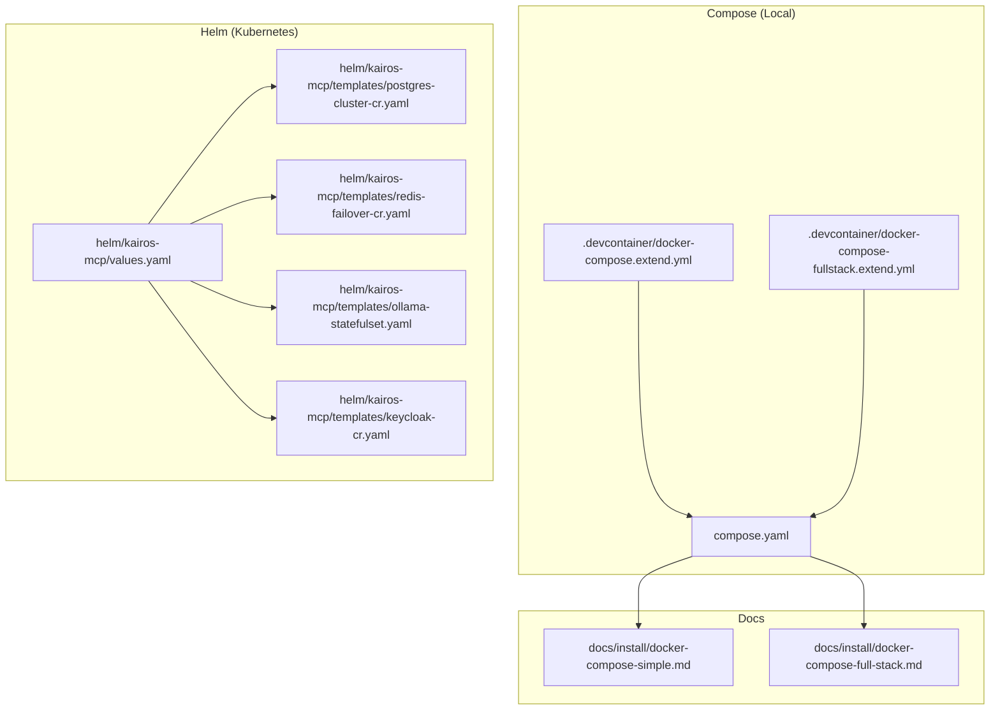
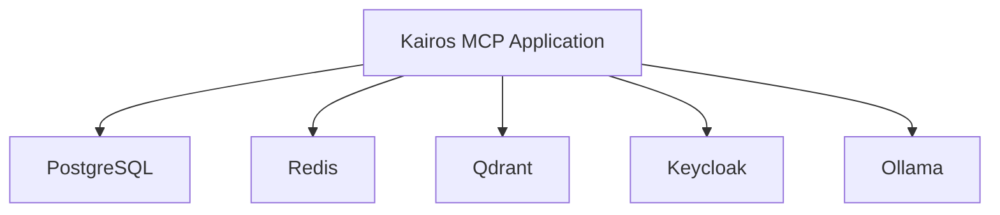
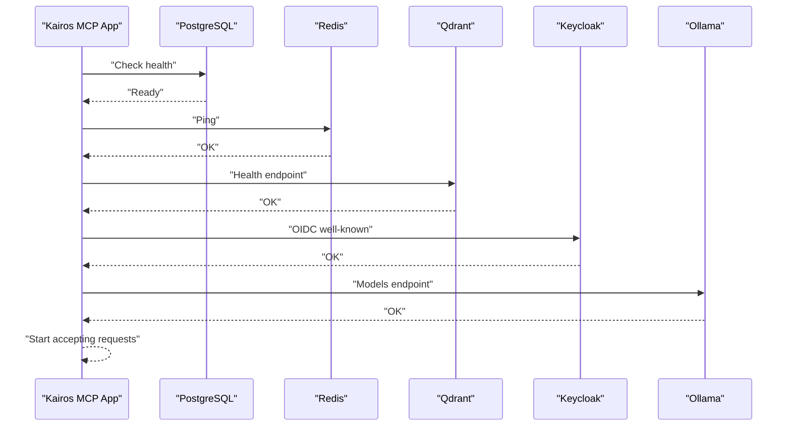

# Service Configuration and Dependencies

<cite>
**Referenced Files in This Document**
- [compose.yaml](file://compose.yaml)
- [docker-compose-fullstack.extend.yml](file://.devcontainer/docker-compose-fullstack.extend.yml)
- [docker-compose.extend.yml](file://.devcontainer/docker-compose.extend.yml)
- [docker-compose-simple.md](file://docs/install/docker-compose-simple.md)
- [docker-compose-full-stack.md](file://docs/install/docker-compose-full-stack.md)
- [README.md](file://docs/keycloak/README.md)
- [kairos-dev-realm.json](file://scripts/keycloak/import/kairos-dev-realm.json)
- [kairos-prod-realm.json](file://scripts/keycloak/import/kairos-prod-realm.json)
- [deploy-generate-dev-secrets.py](file://scripts/deploy-generate-dev-secrets.py)
- [deploy-run-env.sh](file://scripts/deploy-run-env.sh)
- [qdrant-binary.sh](file://scripts/qdrant-binary.sh)
- [values.yaml](file://helm/kairos-mcp/values.yaml)
- [ollama-statefulset.yaml](file://helm/kairos-mcp/templates/ollama-statefulset.yaml)
- [redis-failover-cr.yaml](file://helm/kairos-mcp/templates/redis-failover-cr.yaml)
- [postgres-cluster-cr.yaml](file://helm/kairos-mcp/templates/postgres-cluster-cr.yaml)
- [keycloak-cr.yaml](file://helm/kairos-mcp/templates/keycloak-cr.yaml)
- [http-health-routes.ts](file://src/http/http-health-routes.ts)
- [redis-cache.ts](file://src/services/redis-cache.ts)
- [qdrant/connection.ts](file://src/services/qdrant/connection.ts)
</cite>

## Table of Contents
1. [Introduction](#introduction)
2. [Project Structure](#project-structure)
3. [Core Components](#core-components)
4. [Architecture Overview](#architecture-overview)
5. [Detailed Component Analysis](#detailed-component-analysis)
6. [Dependency Analysis](#dependency-analysis)
7. [Performance Considerations](#performance-considerations)
8. [Troubleshooting Guide](#troubleshooting-guide)
9. [Conclusion](#conclusion)
10. [Appendices](#appendices)

## Introduction
This document explains how Kairos MCP services are configured and orchestrated using Docker Compose, including service definitions, networking, persistent volumes, environment variables, secrets management, health checks, restart policies, resource limits, startup order, dependency resolution, and graceful shutdown behavior. It covers the core infrastructure services: PostgreSQL database, Redis cache, Qdrant vector database, Keycloak authentication server, and Ollama AI model service.

## Project Structure
Kairos MCP provides multiple deployment options:
- A root-level Docker Compose file for local development and simple deployments.
- Devcontainer extensions for full-stack local development with additional services.
- Helm charts for Kubernetes-based production deployments.
- Documentation describing both simple and full-stack Compose setups.

**Diagram sources**
- [compose.yaml](file://compose.yaml)
- [docker-compose.extend.yml](file://.devcontainer/docker-compose.extend.yml)
- [docker-compose-fullstack.extend.yml](file://.devcontainer/docker-compose-fullstack.extend.yml)
- [docker-compose-simple.md](file://docs/install/docker-compose-simple.md)
- [docker-compose-full-stack.md](file://docs/install/docker-compose-full-stack.md)
- [values.yaml](file://helm/kairos-mcp/values.yaml)
- [postgres-cluster-cr.yaml](file://helm/kairos-mcp/templates/postgres-cluster-cr.yaml)
- [redis-failover-cr.yaml](file://helm/kairos-mcp/templates/redis-failover-cr.yaml)
- [ollama-statefulset.yaml](file://helm/kairos-mcp/templates/ollama-statefulset.yaml)
- [keycloak-cr.yaml](file://helm/kairos-mcp/templates/keycloak-cr.yaml)

**Section sources**
- [compose.yaml](file://compose.yaml)
- [docker-compose.extend.yml](file://.devcontainer/docker-compose.extend.yml)
- [docker-compose-fullstack.extend.yml](file://.devcontainer/docker-compose-fullstack.extend.yml)
- [docker-compose-simple.md](file://docs/install/docker-compose-simple.md)
- [docker-compose-full-stack.md](file://docs/install/docker-compose-full-stack.md)
- [values.yaml](file://helm/kairos-mcp/values.yaml)

## Core Components
The following services are central to Kairos MCP:
- PostgreSQL: relational data store for application state.
- Redis: caching and pub/sub for session/state and cross-process coordination.
- Qdrant: vector database for embeddings and semantic search.
- Keycloak: OpenID Connect provider for authentication and authorization.
- Ollama: local AI model serving for embeddings and generation.

Key configuration aspects include:
- Service definitions and ports
- Networks for inter-service communication
- Volumes for persistent storage
- Environment variables and secrets
- Health checks and readiness probes
- Restart policies and resource limits
- Startup ordering and dependencies

**Section sources**
- [compose.yaml](file://compose.yaml)
- [docker-compose-fullstack.extend.yml](file://.devcontainer/docker-compose-fullstack.extend.yml)
- [docker-compose.extend.yml](file://.devcontainer/docker-compose.extend.yml)
- [docker-compose-simple.md](file://docs/install/docker-compose-simple.md)
- [docker-compose-full-stack.md](file://docs/install/docker-compose-full-stack.md)

## Architecture Overview
At runtime, the Kairos MCP application depends on the above services. Networking is provided by a shared Docker network so that services can resolve each other by name. Persistent data is stored in named volumes or bind mounts. The application uses environment variables to discover and connect to these services.

[No sources needed since this diagram shows conceptual workflow, not actual code structure]

## Detailed Component Analysis

### PostgreSQL
- Purpose: durable relational storage for application data.
- Network: attached to the compose network; accessible via hostname from other services.
- Storage: persistent volume mounted to the container’s data directory.
- Environment: database name, user, password, and optional initialization scripts.
- Health check: built-in TCP or SQL probe to ensure readiness.
- Restart policy: typically always or unless-stopped.
- Resource limits: CPU and memory constraints recommended for production.

Operational notes:
- Ensure the database schema is initialized before the application starts.
- Use secrets for credentials rather than plaintext environment variables where possible.

**Section sources**
- [compose.yaml](file://compose.yaml)
- [docker-compose-full-stack.md](file://docs/install/docker-compose-full-stack.md)

### Redis
- Purpose: caching, rate limiting, and pub/sub for distributed features.
- Network: reachable by service name across containers.
- Storage: optional persistence volume if required by your use case.
- Environment: connection URL or host/port/password settings consumed by the app.
- Health check: ping-based readiness probe.
- Restart policy: always or unless-stopped.
- Resource limits: set appropriate CPU/memory caps.

Application integration:
- The application reads Redis configuration from environment variables and initializes a client at startup.

**Section sources**
- [compose.yaml](file://compose.yaml)
- [redis-cache.ts](file://src/services/redis-cache.ts)
- [docker-compose-full-stack.md](file://docs/install/docker-compose-full-stack.md)

### Qdrant
- Purpose: vector database for embeddings and similarity search.
- Network: exposed internally; accessed by the application via its service name.
- Storage: persistent volume for collection data and snapshots.
- Environment: API key or auth flags depending on deployment mode.
- Health check: HTTP endpoint indicating readiness.
- Restart policy: always or unless-stopped.
- Resource limits: allocate sufficient memory for vector operations.

Initialization:
- Scripts may be used to bootstrap collections or perform migrations during startup.

**Section sources**
- [compose.yaml](file://compose.yaml)
- [qdrant/connection.ts](file://src/services/qdrant/connection.ts)
- [qdrant-binary.sh](file://scripts/qdrant-binary.sh)
- [docker-compose-full-stack.md](file://docs/install/docker-compose-full-stack.md)

### Keycloak
- Purpose: OIDC identity provider for login flows and token validation.
- Network: internal service; optionally exposed externally via reverse proxy.
- Storage: realm configuration files imported into the container.
- Environment: admin credentials, realm names, and client registration details.
- Health check: HTTP probe against admin or public endpoints.
- Restart policy: always or unless-stopped.
- Resource limits: moderate CPU/memory allocation.

Realm import:
- Development and production realms are provided as JSON files and imported at startup.

**Section sources**
- [compose.yaml](file://compose.yaml)
- [README.md](file://docs/keycloak/README.md)
- [kairos-dev-realm.json](file://scripts/keycloak/import/kairos-dev-realm.json)
- [kairos-prod-realm.json](file://scripts/keycloak/import/kairos-prod-realm.json)
- [docker-compose-full-stack.md](file://docs/install/docker-compose-full-stack.md)

### Ollama
- Purpose: local model serving for embeddings and text generation.
- Network: internal service; accessed by the application via hostname.
- Storage: persistent volume for models and caches.
- Environment: model selection and API access settings.
- Health check: HTTP endpoint to verify model availability.
- Restart policy: always or unless-stopped.
- Resource limits: GPU/CPU and memory should be sized according to model size.

Note:
- In Kubernetes, Ollama is commonly deployed as a StatefulSet with persistent storage.

**Section sources**
- [compose.yaml](file://compose.yaml)
- [ollama-statefulset.yaml](file://helm/kairos-mcp/templates/ollama-statefulset.yaml)
- [docker-compose-full-stack.md](file://docs/install/docker-compose-full-stack.md)

## Dependency Analysis
Service discovery and connectivity:
- All services share a common Docker network; they communicate using service names as hostnames.
- The application resolves service endpoints via environment variables or default hostnames.

Startup order and readiness:
- The application waits for dependent services to become healthy before starting request handling.
- Health checks are defined for each service to signal readiness.

**Diagram sources**
- [http-health-routes.ts](file://src/http/http-health-routes.ts)
- [redis-cache.ts](file://src/services/redis-cache.ts)
- [qdrant/connection.ts](file://src/services/qdrant/connection.ts)

**Section sources**
- [compose.yaml](file://compose.yaml)
- [docker-compose-fullstack.extend.yml](file://.devcontainer/docker-compose-fullstack.extend.yml)
- [docker-compose.extend.yml](file://.devcontainer/docker-compose.extend.yml)

## Performance Considerations
- Set CPU and memory limits for all services to prevent resource contention.
- Tune Redis eviction policies and TTLs based on workload patterns.
- Size Qdrant memory for vector dimensions and expected cardinality.
- Allocate adequate disk I/O and storage capacity for PostgreSQL and Qdrant.
- Use connection pooling where applicable to reduce overhead.
- Monitor health endpoints and adjust timeouts accordingly.

[No sources needed since this section provides general guidance]

## Troubleshooting Guide
Common issues and resolutions:
- Connectivity failures: verify networks, hostnames, and port mappings.
- Authentication errors: confirm Keycloak realm and client configuration.
- Vector search failures: ensure Qdrant collections exist and are healthy.
- Cache misses or stale data: validate Redis connectivity and TTL settings.
- Model loading delays: check Ollama model availability and storage.

Operational utilities:
- Health routes expose status information for the application.
- Deployment scripts assist with environment setup and secret generation.

**Section sources**
- [http-health-routes.ts](file://src/http/http-health-routes.ts)
- [deploy-run-env.sh](file://scripts/deploy-run-env.sh)
- [deploy-generate-dev-secrets.py](file://scripts/deploy-generate-dev-secrets.py)

## Conclusion
Kairos MCP’s Docker Compose configuration defines a cohesive set of services that provide persistence, caching, vector search, authentication, and AI model serving. By leveraging shared networks, persistent volumes, health checks, and environment-driven configuration, the platform achieves reliable local and production deployments. For Kubernetes, Helm templates mirror these configurations using operators and custom resources.

[No sources needed since this section summarizes without analyzing specific files]

## Appendices

### Environment Variables and Secrets Management
- Environment variables drive service discovery and runtime behavior.
- Secrets should be injected via Docker secrets or external secret managers in production.
- Development helpers generate secure defaults for local runs.

**Section sources**
- [deploy-generate-dev-secrets.py](file://scripts/deploy-generate-dev-secrets.py)
- [deploy-run-env.sh](file://scripts/deploy-run-env.sh)
- [docker-compose-full-stack.md](file://docs/install/docker-compose-full-stack.md)

### Helm Production Notes
- Values file centralizes configuration for Kubernetes deployments.
- Operators manage Postgres, Redis, and Keycloak instances.
- Ollama is deployed as a StatefulSet with persistent storage.

**Section sources**
- [values.yaml](file://helm/kairos-mcp/values.yaml)
- [postgres-cluster-cr.yaml](file://helm/kairos-mcp/templates/postgres-cluster-cr.yaml)
- [redis-failover-cr.yaml](file://helm/kairos-mcp/templates/redis-failover-cr.yaml)
- [keycloak-cr.yaml](file://helm/kairos-mcp/templates/keycloak-cr.yaml)
- [ollama-statefulset.yaml](file://helm/kairos-mcp/templates/ollama-statefulset.yaml)