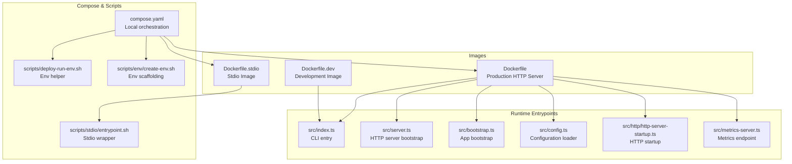
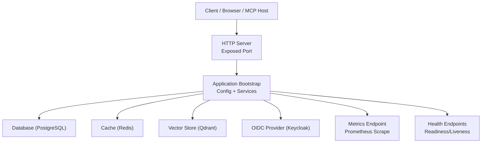
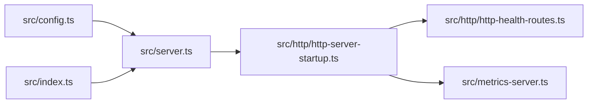

# Docker Deployment

<cite>
**Referenced Files in This Document**
- [Dockerfile](file://Dockerfile)
- [Dockerfile.dev](file://Dockerfile.dev)
- [Dockerfile.stdio](file://Dockerfile.stdio)
- [compose.yaml](file://compose.yaml)
- [.dockerignore](file://.dockerignore)
- [package.json](file://package.json)
- [src/index.ts](file://src/index.ts)
- [src/server.ts](file://src/server.ts)
- [src/bootstrap.ts](file://src/bootstrap.ts)
- [src/config.ts](file://src/config.ts)
- [src/http/http-server-startup.ts](file://src/http/http-server-startup.ts)
- [src/http/http-health-routes.ts](file://src/http/http-health-routes.ts)
- [src/metrics-server.ts](file://src/metrics-server.ts)
- [scripts/stdio/entrypoint.sh](file://scripts/stdio/entrypoint.sh)
- [scripts/deploy-run-env.sh](file://scripts/deploy-run-env.sh)
- [scripts/env/create-env.sh](file://scripts/env/create-env.sh)
- [docs/install/docker-compose-simple.md](file://docs/install/docker-compose-simple.md)
- [docs/install/docker-compose-full-stack.md](file://docs/install/docker-compose-full-stack.md)
</cite>

## Table of Contents
1. [Introduction](#introduction)
2. [Project Structure](#project-structure)
3. [Core Components](#core-components)
4. [Architecture Overview](#architecture-overview)
5. [Detailed Component Analysis](#detailed-component-analysis)
6. [Dependency Analysis](#dependency-analysis)
7. [Performance Considerations](#performance-considerations)
8. [Troubleshooting Guide](#troubleshooting-guide)
9. [Conclusion](#conclusion)
10. [Appendices](#appendices)

## Introduction
This document provides comprehensive Docker deployment guidance for Kairos MCP, covering standalone container deployments using official images, multi-stage builds, image optimization, and security hardening. It also includes production-grade Docker Compose configurations for service orchestration, volume management, and networking, along with environment variable configuration for production settings, database connections, and external integrations. Examples are provided for single-node and clustered deployments, as well as health checks, logging, and monitoring within Docker environments.

## Project Structure
Kairos MCP ships multiple Dockerfiles to support different runtime modes:
- A production HTTP server image
- A development-oriented image
- A lightweight stdio-based image for tooling integration

The repository also includes a top-level Docker Compose file for local orchestration and documentation examples for simple and full-stack deployments.

**Diagram sources**
- [Dockerfile](file://Dockerfile)
- [Dockerfile.dev](file://Dockerfile.dev)
- [Dockerfile.stdio](file://Dockerfile.stdio)
- [src/index.ts](file://src/index.ts)
- [src/server.ts](file://src/server.ts)
- [src/bootstrap.ts](file://src/bootstrap.ts)
- [src/config.ts](file://src/config.ts)
- [src/http/http-server-startup.ts](file://src/http/http-server-startup.ts)
- [src/metrics-server.ts](file://src/metrics-server.ts)
- [compose.yaml](file://compose.yaml)
- [scripts/stdio/entrypoint.sh](file://scripts/stdio/entrypoint.sh)
- [scripts/deploy-run-env.sh](file://scripts/deploy-run-env.sh)
- [scripts/env/create-env.sh](file://scripts/env/create-env.sh)

**Section sources**
- [Dockerfile](file://Dockerfile)
- [Dockerfile.dev](file://Dockerfile.dev)
- [Dockerfile.stdio](file://Dockerfile.stdio)
- [compose.yaml](file://compose.yaml)
- [src/index.ts](file://src/index.ts)
- [src/server.ts](file://src/server.ts)
- [src/bootstrap.ts](file://src/bootstrap.ts)
- [src/config.ts](file://src/config.ts)
- [src/http/http-server-startup.ts](file://src/http/http-server-startup.ts)
- [src/metrics-server.ts](file://src/metrics-server.ts)
- [scripts/stdio/entrypoint.sh](file://scripts/stdio/entrypoint.sh)
- [scripts/deploy-run-env.sh](file://scripts/deploy-run-env.sh)
- [scripts/env/create-env.sh](file://scripts/env/create-env.sh)

## Core Components
- Production HTTP server image: Builds the application and runs the HTTP server process exposed on a configurable port. Health endpoints and metrics are available for orchestration and observability.
- Development image: Includes additional tooling and dependencies suitable for interactive development and debugging.
- Stdio image: Provides a minimal runtime for CLI-driven or stdio-based integrations.

Key runtime components:
- Application bootstrap and configuration loading
- HTTP server initialization and route registration
- Health check routes for readiness/liveness
- Metrics server for Prometheus scraping

**Section sources**
- [Dockerfile](file://Dockerfile)
- [Dockerfile.dev](file://Dockerfile.dev)
- [Dockerfile.stdio](file://Dockerfile.stdio)
- [src/bootstrap.ts](file://src/bootstrap.ts)
- [src/config.ts](file://src/config.ts)
- [src/server.ts](file://src/server.ts)
- [src/http/http-server-startup.ts](file://src/http/http-server-startup.ts)
- [src/http/http-health-routes.ts](file://src/http/http-health-routes.ts)
- [src/metrics-server.ts](file://src/metrics-server.ts)

## Architecture Overview
The production image runs an HTTP server that serves API endpoints, UI assets, and MCP protocol handlers. The application reads configuration from environment variables and connects to external services such as databases and caches. Health and metrics endpoints enable orchestration and monitoring.

**Diagram sources**
- [src/server.ts](file://src/server.ts)
- [src/http/http-server-startup.ts](file://src/http/http-server-startup.ts)
- [src/config.ts](file://src/config.ts)
- [src/metrics-server.ts](file://src/metrics-server.ts)
- [src/http/http-health-routes.ts](file://src/http/http-health-routes.ts)

## Detailed Component Analysis

### Standalone Container Deployment
- Use the production image to run the HTTP server.
- Expose the configured HTTP port.
- Provide required environment variables for database, cache, vector store, and OIDC provider.
- Mount persistent volumes for data directories if applicable.
- Configure health checks via HTTP endpoints.

Recommended steps:
- Pull the official image.
- Run the container with environment variables and volume mounts.
- Verify health endpoints respond successfully.
- Confirm metrics endpoint is reachable by your monitoring system.

**Section sources**
- [Dockerfile](file://Dockerfile)
- [src/http/http-health-routes.ts](file://src/http/http-health-routes.ts)
- [src/metrics-server.ts](file://src/metrics-server.ts)
- [src/config.ts](file://src/config.ts)

### Multi-Stage Build Process
The production image uses a multi-stage build to separate build-time dependencies from runtime artifacts, minimizing final image size and attack surface.

Typical stages:
- Builder stage: installs dependencies, compiles TypeScript, and builds static assets.
- Runtime stage: copies only necessary artifacts and sets up a minimal user and working directory.

Benefits:
- Smaller image footprint
- Reduced vulnerability exposure
- Faster pulls and deployments

**Section sources**
- [Dockerfile](file://Dockerfile)

### Image Optimization
Optimization techniques applied in the production image:
- Multi-stage builds to exclude dev tools and source code.
- Layer caching strategies for dependency installation.
- Minimal base images for the runtime stage.
- Pruning unnecessary files and temporary artifacts.

Operational tips:
- Pin base image versions for reproducibility.
- Avoid installing extra packages at runtime.
- Use .dockerignore to exclude irrelevant files from the build context.

**Section sources**
- [Dockerfile](file://Dockerfile)
- [.dockerignore](file://.dockerignore)

### Security Hardening
Security best practices implemented:
- Non-root user execution inside the container.
- Read-only filesystem where possible.
- Minimal runtime dependencies.
- Secrets passed via environment variables or mounted secrets; avoid baking secrets into images.

Additional recommendations:
- Scan images with vulnerability scanners.
- Restrict capabilities and resource limits at runtime.
- Enable TLS termination at the ingress or reverse proxy layer.

**Section sources**
- [Dockerfile](file://Dockerfile)

### Docker Compose for Production
Use Docker Compose to orchestrate the application with its dependencies:
- Define the application service with environment variables and health checks.
- Define dependent services (database, cache, vector store).
- Configure networks and volumes for persistence and isolation.
- Set restart policies and resource constraints.

Example references:
- Simple stack example
- Full-stack example including Keycloak and other infrastructure

**Section sources**
- [compose.yaml](file://compose.yaml)
- [docs/install/docker-compose-simple.md](file://docs/install/docker-compose-simple.md)
- [docs/install/docker-compose-full-stack.md](file://docs/install/docker-compose-full-stack.md)

### Environment Variables Configuration
Configure the application via environment variables:
- General settings: ports, logging level, feature flags.
- Database connection: host, port, credentials, database name.
- Cache backend: Redis URL and options.
- Vector store: Qdrant URL and options.
- OIDC provider: issuer, client ID, client secret, scopes.
- External integrations: URLs and tokens as needed.

Environment helpers:
- Utility scripts can scaffold or validate environment files.
- Deploy helper scripts can normalize or inject runtime values.

**Section sources**
- [src/config.ts](file://src/config.ts)
- [scripts/env/create-env.sh](file://scripts/env/create-env.sh)
- [scripts/deploy-run-env.sh](file://scripts/deploy-run-env.sh)

### Single-Node Deployment
A single-node deployment runs one instance of the application alongside shared external services. Use Docker Compose to define all services in a single stack. Ensure:
- Persistent volumes for database and vector store.
- Proper network segmentation between services.
- Health checks for each service.
- Resource limits appropriate for workload.

**Section sources**
- [compose.yaml](file://compose.yaml)
- [docs/install/docker-compose-simple.md](file://docs/install/docker-compose-simple.md)

### Clustered Deployment
For high availability and scalability:
- Run multiple replicas behind a load balancer or ingress controller.
- Use externalized state stores (database, cache, vector store).
- Configure horizontal scaling based on CPU/memory utilization.
- Implement rolling updates and graceful shutdowns.
- Centralize logs and metrics collection.

Considerations:
- Sticky sessions are not required if stateless.
- Ensure idempotent startup and migration handling.
- Monitor queue backlogs and worker saturation.

[No sources needed since this section provides general guidance]

### Health Checks and Readiness
Expose health endpoints for orchestration:
- Liveness probe: indicates if the process is alive.
- Readiness probe: indicates if the service is ready to accept traffic.

Orchestration should:
- Wait for readiness before routing traffic.
- Restart containers on liveness failures.
- Drain connections gracefully during shutdown.

**Section sources**
- [src/http/http-health-routes.ts](file://src/http/http-health-routes.ts)

### Logging Configuration
Configure structured logging for containers:
- Log format: JSON for easy parsing.
- Log levels: set via environment variables.
- Output to stdout/stderr for container log collectors.
- Rotate logs at the platform level rather than inside the container.

**Section sources**
- [src/config.ts](file://src/config.ts)

### Monitoring Setup
Enable metrics collection:
- Expose metrics endpoint for Prometheus scraping.
- Label metrics with service identifiers.
- Configure scrape intervals and retention policies.
- Integrate with alerting rules for critical thresholds.

**Section sources**
- [src/metrics-server.ts](file://src/metrics-server.ts)

### Stdio Mode Integration
For CLI or tooling integrations, use the stdio image:
- Runs the application over standard input/output.
- Useful for embedding in automation pipelines or IDE plugins.
- Entrypoint script wraps the process and handles environment setup.

**Section sources**
- [Dockerfile.stdio](file://Dockerfile.stdio)
- [scripts/stdio/entrypoint.sh](file://scripts/stdio/entrypoint.sh)

## Dependency Analysis
The application depends on several external services and internal modules:
- HTTP server module initializes routes and middleware.
- Configuration module loads environment variables and validates them.
- Metrics server exposes operational metrics.
- Health routes provide probes for orchestration.

**Diagram sources**
- [src/config.ts](file://src/config.ts)
- [src/server.ts](file://src/server.ts)
- [src/http/http-server-startup.ts](file://src/http/http-server-startup.ts)
- [src/http/http-health-routes.ts](file://src/http/http-health-routes.ts)
- [src/metrics-server.ts](file://src/metrics-server.ts)
- [src/index.ts](file://src/index.ts)

**Section sources**
- [src/config.ts](file://src/config.ts)
- [src/server.ts](file://src/server.ts)
- [src/http/http-server-startup.ts](file://src/http/http-server-startup.ts)
- [src/http/http-health-routes.ts](file://src/http/http-health-routes.ts)
- [src/metrics-server.ts](file://src/metrics-server.ts)
- [src/index.ts](file://src/index.ts)

## Performance Considerations
- Scale horizontally by running multiple replicas behind a load balancer.
- Tune connection pools for database and cache based on replica count.
- Use efficient vector search configurations and indexing strategies.
- Monitor memory usage and adjust resource limits accordingly.
- Prefer externalized state stores to allow independent scaling.

[No sources needed since this section provides general guidance]

## Troubleshooting Guide
Common issues and resolutions:
- Health endpoint failures: verify readiness conditions and dependencies.
- Metrics not scraped: ensure endpoint path and labels are correct.
- Environment misconfiguration: validate required variables and formats.
- Volume permissions: ensure non-root user has access to mounted paths.
- Network connectivity: confirm DNS resolution and firewall rules.

Operational checks:
- Inspect container logs for errors and warnings.
- Validate environment variables at runtime.
- Test connectivity to external services from within the container.

**Section sources**
- [src/http/http-health-routes.ts](file://src/http/http-health-routes.ts)
- [src/metrics-server.ts](file://src/metrics-server.ts)
- [src/config.ts](file://src/config.ts)

## Conclusion
Kairos MCP provides robust Docker support through dedicated images for production, development, and stdio modes. The production image emphasizes security and performance with multi-stage builds and minimal runtime footprints. Docker Compose enables straightforward orchestration for both single-node and clustered deployments. By configuring environment variables, health checks, logging, and metrics appropriately, you can deploy Kairos MCP reliably in production environments.

[No sources needed since this section summarizes without analyzing specific files]

## Appendices

### Example References
- Simple Docker Compose deployment guide
- Full-stack Docker Compose deployment guide

**Section sources**
- [docs/install/docker-compose-simple.md](file://docs/install/docker-compose-simple.md)
- [docs/install/docker-compose-full-stack.md](file://docs/install/docker-compose-full-stack.md)