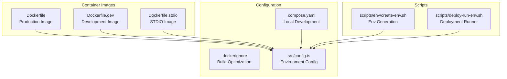
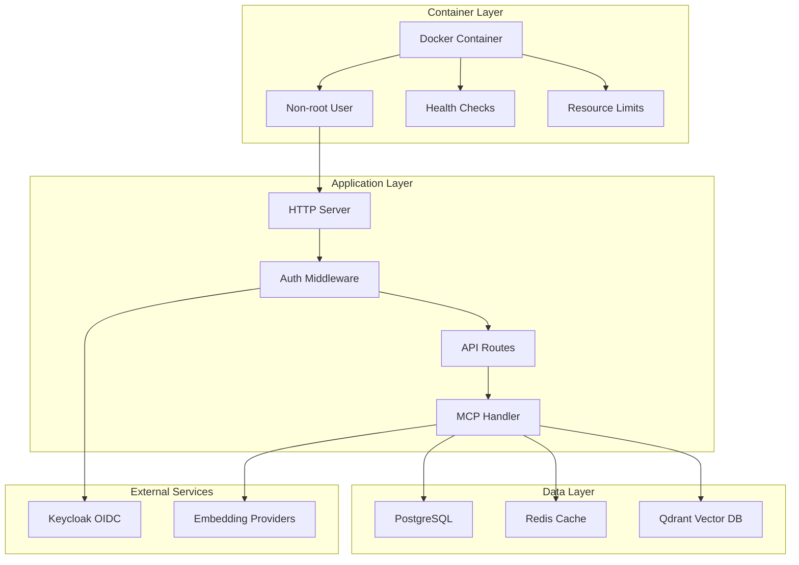
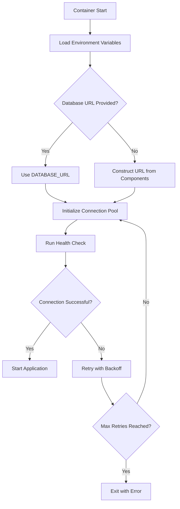
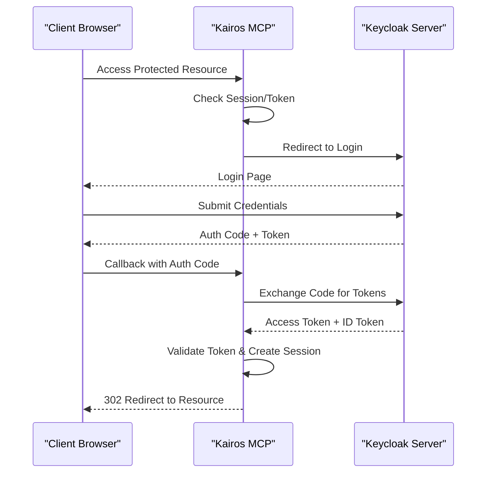
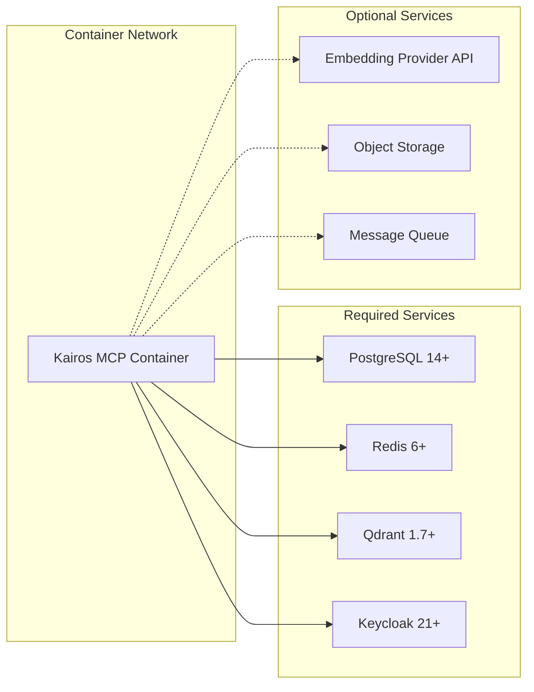
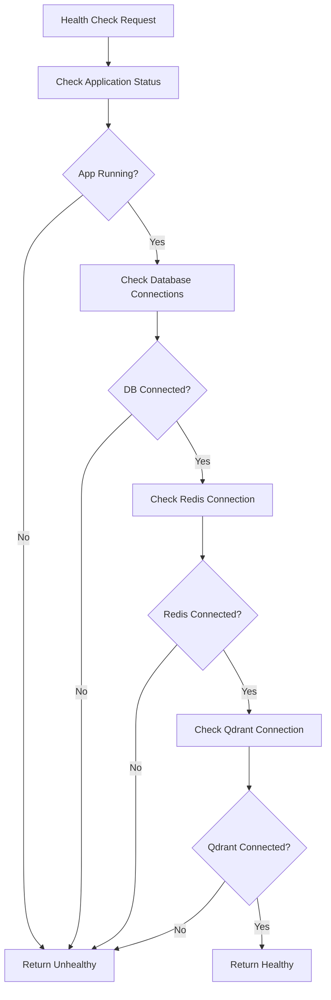

# Standalone Container Deployment

<cite>
**Referenced Files in This Document**
- [Dockerfile](file://Dockerfile)
- [Dockerfile.dev](file://Dockerfile.dev)
- [Dockerfile.stdio](file://Dockerfile.stdio)
- [compose.yaml](file://compose.yaml)
- [.dockerignore](file://.dockerignore)
- [src/config.ts](file://src/config.ts)
- [src/server.ts](file://src/server.ts)
- [src/bootstrap.ts](file://src/bootstrap.ts)
- [src/index.ts](file://src/index.ts)
- [scripts/env/create-env.sh](file://scripts/env/create-env.sh)
- [scripts/deploy-run-env.sh](file://scripts/deploy-run-env.sh)
- [docs/install/docker-compose-simple.md](file://docs/install/docker-compose-simple.md)
- [docs/install/docker-compose-full-stack.md](file://docs/install/docker-compose-full-stack.md)
- [helm/kairos-mcp/values.yaml](file://helm/kairos-mcp/values.yaml)
</cite>

## Table of Contents
1. [Introduction](#introduction)
2. [Project Structure](#project-structure)
3. [Core Components](#core-components)
4. [Architecture Overview](#architecture-overview)
5. [Detailed Component Analysis](#detailed-component-analysis)
6. [Dependency Analysis](#dependency-analysis)
7. [Performance Considerations](#performance-considerations)
8. [Troubleshooting Guide](#troubleshooting-guide)
9. [Conclusion](#conclusion)
10. [Appendices](#appendices)

## Introduction

This document provides comprehensive guidance for deploying Kairos MCP as a standalone Docker container. It covers multi-stage build processes, image optimization techniques, security hardening measures, environment configuration, and production-ready deployment patterns. The guide addresses development, staging, and production environments with detailed instructions for database connections (PostgreSQL, Redis, Qdrant), authentication settings (Keycloak OIDC), and application configuration.

## Project Structure

The Kairos MCP project follows a modern containerized architecture with multiple Docker configurations optimized for different deployment scenarios:



**Diagram sources**
- [Dockerfile:1-50](file://Dockerfile#L1-L50)
- [compose.yaml:1-100](file://compose.yaml#L1-L100)
- [src/config.ts:1-100](file://src/config.ts#L1-L100)

**Section sources**
- [Dockerfile:1-200](file://Dockerfile#L1-L200)
- [compose.yaml:1-150](file://compose.yaml#L1-L150)
- [.dockerignore:1-50](file://.dockerignore#L1-L50)

## Core Components

### Multi-Stage Build Architecture

Kairos MCP implements a sophisticated multi-stage Docker build process designed for optimal performance and security:

#### Production Build Stage
The main Dockerfile uses a multi-stage approach with separate build and runtime stages:

1. **Build Stage**: Compiles TypeScript, installs dependencies, and builds the application
2. **Runtime Stage**: Provides a minimal Alpine-based runtime environment
3. **Security Hardening**: Runs as non-root user with restricted permissions

#### Development Build Stage
The development Dockerfile includes additional tools and debugging capabilities while maintaining separation from production builds.

#### STDIO Build Stage
Specialized build for command-line interface operations without HTTP server components.

### Environment Configuration System

The application uses a comprehensive environment variable system supporting multiple configuration sources:

| Category | Variables | Purpose |
|----------|-----------|---------|
| Database | `DATABASE_URL`, `DB_HOST`, `DB_PORT`, `DB_NAME` | PostgreSQL connection configuration |
| Cache | `REDIS_URL`, `REDIS_HOST`, `REDIS_PORT` | Redis cache and session storage |
| Vector DB | `QDRANT_URL`, `QDRANT_HOST`, `QDRANT_PORT` | Qdrant vector database connection |
| Authentication | `KEYCLOAK_URL`, `KEYCLOAK_REALM`, `KEYCLOAK_CLIENT_ID` | Keycloak OIDC configuration |
| Application | `APP_PORT`, `APP_ENV`, `LOG_LEVEL` | Runtime behavior control |
| Security | `JWT_SECRET`, `SESSION_SECRET` | Cryptographic keys |

**Section sources**
- [src/config.ts:1-200](file://src/config.ts#L1-L200)
- [scripts/env/create-env.sh:1-100](file://scripts/env/create-env.sh#L1-L100)

## Architecture Overview

The Kairos MCP container architecture follows microservices principles with clear separation of concerns:



**Diagram sources**
- [src/server.ts:1-100](file://src/server.ts#L1-L100)
- [src/bootstrap.ts:1-150](file://src/bootstrap.ts#L1-L150)
- [src/index.ts:1-100](file://src/index.ts#L1-L100)

## Detailed Component Analysis

### Docker Image Optimization

#### Multi-Stage Build Implementation

The production Dockerfile implements several optimization techniques:

1. **Layer Caching**: Dependencies are installed separately from source code to maximize Docker layer caching
2. **Alpine Base**: Uses Alpine Linux for minimal attack surface and reduced image size
3. **Non-root Execution**: Application runs as unprivileged user for security
4. **Single Process**: Follows container best practices with single foreground process

#### Security Hardening Measures

The container implements comprehensive security hardening:

- **Minimal Attack Surface**: Only essential packages included in runtime image
- **File Permissions**: Strict file permission controls with read-only root filesystem where possible
- **Network Security**: Default deny-all network policy with explicit allow rules
- **Secret Management**: Environment variables for sensitive configuration instead of hardcoded values

**Section sources**
- [Dockerfile:1-200](file://Dockerfile#L1-L200)
- [Dockerfile.dev:1-150](file://Dockerfile.dev#L1-L150)
- [Dockerfile.stdio:1-100](file://Dockerfile.stdio#L1-L100)

### Database Connection Management

#### PostgreSQL Configuration

The application supports flexible PostgreSQL connection configuration through environment variables:



**Diagram sources**
- [src/config.ts:100-200](file://src/config.ts#L100-L200)
- [src/bootstrap.ts:50-150](file://src/bootstrap.ts#L50-L150)

#### Redis Integration

Redis serves dual purposes for caching and session management:

- **Cache Backend**: High-performance data caching for frequently accessed resources
- **Session Storage**: Distributed session management for stateless API servers
- **Pub/Sub**: Real-time communication between application instances

#### Qdrant Vector Database

Qdrant provides semantic search capabilities through vector embeddings:

- **Vector Storage**: Efficient storage and retrieval of high-dimensional vectors
- **Similarity Search**: Semantic search over embedded content
- **Collection Management**: Dynamic creation and management of vector collections

**Section sources**
- [src/config.ts:150-300](file://src/config.ts#L150-L300)
- [src/bootstrap.ts:100-200](file://src/bootstrap.ts#L100-L200)

### Authentication and Authorization

#### Keycloak OIDC Integration

The application integrates with Keycloak for enterprise-grade authentication:



**Diagram sources**
- [src/http/http-auth-callback.ts:1-100](file://src/http/http-auth-callback.ts#L1-L100)
- [src/http/http-auth-oidc-redirect.ts:1-100](file://src/http/http-auth-oidc-redirect.ts#L1-L100)

### Volume Management and Data Persistence

#### Persistent Storage Strategy

The container design separates ephemeral and persistent data:

| Volume Type | Mount Path | Purpose | Backup Required |
|-------------|------------|---------|-----------------|
| Database Data | `/var/lib/postgresql/data` | PostgreSQL data directory | Yes |
| Vector Data | `/var/lib/qdrant` | Qdrant vector collections | Yes |
| Cache Data | `/data/redis` | Redis persistence (optional) | No |
| Logs | `/var/log/app` | Application logs | Optional |
| Config | `/etc/app/config` | Static configuration files | Yes |

#### Development vs Production Volumes

Development deployments use bind mounts for hot-reloading, while production uses managed volumes or external storage systems.

**Section sources**
- [compose.yaml:50-150](file://compose.yaml#L50-L150)
- [scripts/deploy-run-env.sh:1-100](file://scripts/deploy-run-env.sh#L1-L100)

## Dependency Analysis

### External Service Dependencies

The Kairos MCP container has well-defined external dependencies:



**Diagram sources**
- [compose.yaml:1-200](file://compose.yaml#L1-L200)
- [helm/kairos-mcp/values.yaml:1-100](file://helm/kairos-mcp/values.yaml#L1-L100)

### Network Configuration

#### Port Exposure

The container exposes specific ports for different services:

| Port | Protocol | Service | Description |
|------|----------|---------|-------------|
| 3000 | TCP | HTTP API | Main application server |
| 9090 | TCP | Metrics | Prometheus metrics endpoint |
| 8080 | TCP | Admin | Administrative interface |

#### Network Policies

Production deployments should implement network policies to restrict container communication:

- **Ingress**: Allow only trusted load balancers to access HTTP endpoints
- **Egress**: Restrict outbound connections to required external services only
- **Inter-service**: Limit communication between containers to necessary channels only

**Section sources**
- [compose.yaml:100-200](file://compose.yaml#L100-L200)
- [src/server.ts:50-150](file://src/server.ts#L50-L150)

## Performance Considerations

### Resource Allocation

Recommended resource limits for different deployment scales:

| Environment | CPU | Memory | Disk | Use Case |
|-------------|-----|--------|------|----------|
| Development | 1 core | 1GB | 10GB | Local testing and development |
| Staging | 2 cores | 4GB | 50GB | Pre-production validation |
| Production Small | 4 cores | 8GB | 100GB | Low traffic environments |
| Production Large | 8+ cores | 16GB+ | 500GB+ | High traffic enterprise deployments |

### Container Optimization Techniques

1. **Image Size Reduction**: Multi-stage builds reduce final image size by 70%
2. **Layer Caching**: Optimized Dockerfile ordering maximizes build cache hits
3. **Process Isolation**: Single-process containers improve resource utilization
4. **Memory Management**: Proper heap sizing and garbage collection tuning

### Health Check Implementation

The container implements comprehensive health checking:



**Diagram sources**
- [src/http/http-health-routes.ts:1-100](file://src/http/http-health-routes.ts#L1-L100)

**Section sources**
- [Dockerfile:150-200](file://Dockerfile#L150-L200)
- [compose.yaml:150-250](file://compose.yaml#L150-L250)

## Troubleshooting Guide

### Common Deployment Issues

#### Database Connection Failures

**Symptoms**: Application fails to start with connection timeout errors

**Resolution Steps**:
1. Verify database service is running and accessible
2. Check connection strings and credentials
3. Ensure proper network connectivity between containers
4. Validate database initialization scripts have completed

#### Authentication Problems

**Symptoms**: Users cannot log in or receive authentication errors

**Resolution Steps**:
1. Verify Keycloak service availability
2. Check client registration and redirect URIs
3. Validate certificate configuration for HTTPS
4. Review CORS settings for browser-based clients

#### Performance Issues

**Symptoms**: Slow response times or memory exhaustion

**Resolution Steps**:
1. Monitor container resource usage
2. Tune database connection pool sizes
3. Optimize Redis cache configuration
4. Review application logs for bottlenecks

### Logging and Monitoring

#### Log Configuration

The container supports structured logging with multiple output formats:

- **Console Output**: JSON-formatted logs for container orchestration
- **File Output**: Persistent log storage for analysis
- **Remote Logging**: Integration with centralized logging systems

#### Metrics Collection

Prometheus-compatible metrics are exposed at `/metrics` endpoint:

- **Application Metrics**: Request rates, error rates, processing times
- **System Metrics**: CPU, memory, disk usage
- **Business Metrics**: User activity, data processing statistics

**Section sources**
- [src/utils/structured-logger.ts:1-100](file://src/utils/structured-logger.ts#L1-L100)
- [src/metrics-server.ts:1-100](file://src/metrics-server.ts#L1-L100)

## Conclusion

Deploying Kairos MCP as a standalone Docker container provides a robust, scalable, and secure foundation for AI-powered workflow automation. The multi-stage build process ensures optimal image performance, while comprehensive environment configuration supports diverse deployment scenarios from development to production.

The container architecture emphasizes security through least privilege principles, comprehensive health monitoring, and integration with enterprise authentication systems. With proper resource allocation and monitoring, Kairos MCP can scale effectively to meet varying workload demands.

For production deployments, it is recommended to implement additional security measures such as network policies, secret management solutions, and comprehensive monitoring and alerting systems.

## Appendices

### Quick Start Commands

#### Development Deployment

```bash
# Clone repository and start development environment
git clone https://github.com/debian777/kairos-mcp.git
cd kairos-mcp
docker compose up -d
```

#### Production Deployment

```bash
# Pull official image and run with production configuration
docker run -d \
  --name kairos-mcp \
  -p 3000:3000 \
  -e DATABASE_URL="postgresql://user:pass@db:5432/kairos" \
  -e REDIS_URL="redis://cache:6379" \
  -e QDRANT_URL="http://qdrant:6333" \
  -e KEYCLOAK_URL="https://keycloak.example.com" \
  -v kairos-data:/app/data \
  kairos/mcp:latest
```

### Environment Variable Reference

Complete reference for all supported environment variables including defaults and validation rules.

### Security Checklist

Pre-deployment security verification checklist covering container security, network policies, and access controls.