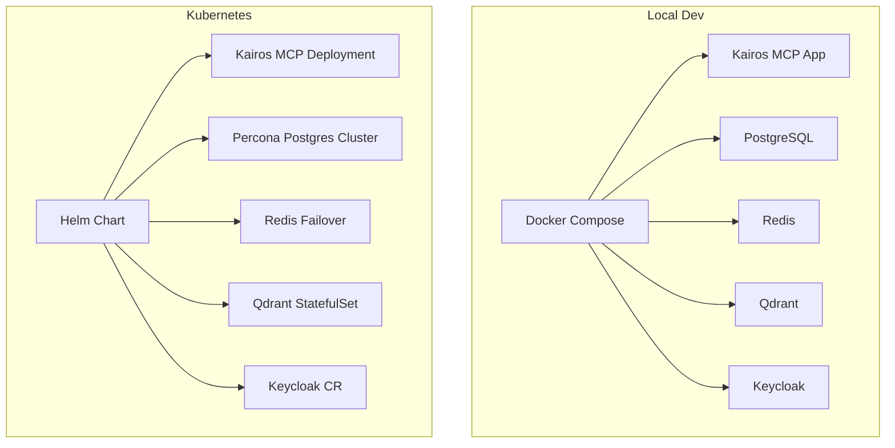
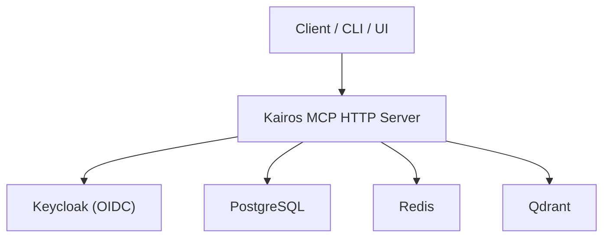
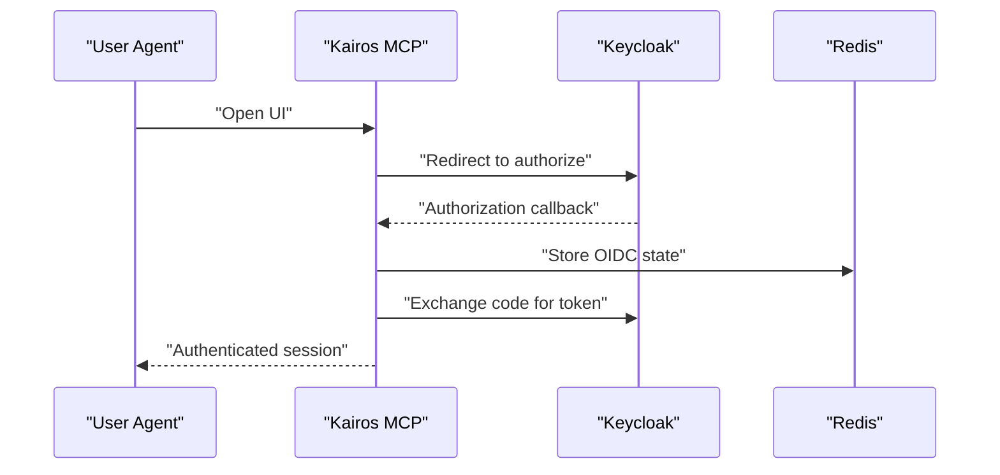
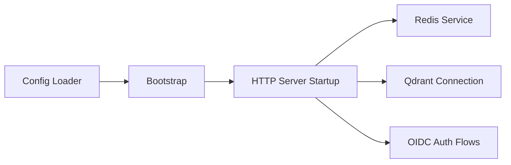

# Installation and Setup

<cite>
**Referenced Files in This Document**
- [README.md](file://README.md)
- [compose.yaml](file://compose.yaml)
- [Dockerfile](file://Dockerfile)
- [Dockerfile.dev](file://Dockerfile.dev)
- [.devcontainer/devcontainer.json.base](file://.devcontainer/devcontainer.json.base)
- [.devcontainer/docker-compose.extend.yml](file://.devcontainer/docker-compose.extend.yml)
- [.devcontainer/use-config.sh](file://.devcontainer/use-config.sh)
- [.devcontainer/validate.sh](file://.devcontainer/validate.sh)
- [scripts/env/create-env.sh](file://scripts/env/create-env.sh)
- [scripts/deploy-run-env.sh](file://scripts/deploy-run-env.sh)
- [helm/kairos-mcp/values.yaml](file://helm/kairos-mcp/values.yaml)
- [helm/kairos-mcp/Chart.yaml](file://helm/kairos-mcp/Chart.yaml)
- [helm/kairos-mcp/templates/kairos-mcp-deployment.yaml](file://helm/kairos-mcp/templates/kairos-mcp-deployment.yaml)
- [helm/kairos-mcp/templates/keycloak-cr.yaml](file://helm/kairos-mcp/templates/keycloak-cr.yaml)
- [helm/kairos-mcp/templates/postgres-cluster-cr.yaml](file://helm/kairos-mcp/templates/postgres-cluster-cr.yaml)
- [helm/kairos-mcp/templates/redis-failover-cr.yaml](file://helm/kairos-mcp/templates/redis-failover-cr.yaml)
- [helm/kairos-mcp/templates/qdrant-hpa.yaml](file://helm/kairos-mcp/templates/qdrant-hpa.yaml)
- [helm/.dev/values.yaml](file://helm/.dev/values.yaml)
- [helm/.dev/values-full.yaml](file://helm/.dev/values-full.yaml)
- [helm/.dev/values-tls.yaml](file://helm/.dev/values-tls.yaml)
- [helm/.dev/helm-deploy.sh](file://helm/.dev/helm-deploy.sh)
- [src/config.ts](file://src/config.ts)
- [src/bootstrap.ts](file://src/bootstrap.ts)
- [src/server.ts](file://src/server.ts)
- [src/http/http-server-startup.ts](file://src/http/http-server-startup.ts)
- [src/services/redis.ts](file://src/services/redis.ts)
- [src/services/qdrant/connection.ts](file://src/services/qdrant/connection.ts)
- [src/services/qdrant/initialization.ts](file://src/services/qdrant/initialization.ts)
- [src/services/memory/store-init.ts](file://src/services/memory/store-init.ts)
- [src/http/http-auth-callback.ts](file://src/http/http-auth-callback.ts)
- [src/http/http-auth-oidc-redirect.ts](file://src/http/http-auth-oidc-redirect.ts)
- [src/http/http-client-registration-proxy.ts](file://src/http/http-client-registration-proxy.ts)
- [src/http/oidc-profile-claims.ts](file://src/http/oidc-profile-claims.ts)
- [src/http/oidc-scopes.ts](file://src/http/oidc-scopes.ts)
- [src/services/oidc-state-store.ts](file://src/services/oidc-state-store.ts)
- [scripts/deploy-generate-dev-secrets.py](file://scripts/deploy-generate-dev-secrets.py)
- [scripts/deploy-configure-keycloak-realms.py](file://scripts/deploy-configure-keycloak-realms.py)
- [scripts/deploy-configure-keycloak-google-idp.py](file://scripts/deploy-configure-keycloak-google-idP.py)
- [scripts/deploy-add-keycloak-demo-user.sh](file://scripts/deploy-add-keycloak-demo-user.sh)
- [scripts/kairos-db-init/README.md](file://scripts/kairos-db-init/README.md)
- [scripts/seed-test-snapshot.sh](file://scripts/seed-test-snapshot.sh)
- [scripts/import-test-snapshot.sh](file://scripts/import-test-snapshot.sh)
</cite>

## Table of Contents
1. Introduction
2. Project Structure
3. Core Components
4. Architecture Overview
5. Detailed Component Analysis
6. Dependency Analysis
7. Performance Considerations
8. Troubleshooting Guide
9. Conclusion
10. Appendices

## Introduction
This document provides comprehensive installation and setup instructions for Kairos MCP across multiple environments:
- Local development with Docker Compose
- Production deployment with Kubernetes Helm charts
- Standalone containerized deployment

It covers prerequisites (Node.js, PostgreSQL, Redis, Qdrant, Keycloak), environment variables, OIDC security configuration, initial data seeding, and development environment setup including VS Code dev containers and debugging.

## Project Structure
Kairos MCP is a Node.js application packaged as containers and deployable via Docker Compose or Kubernetes Helm charts. The repository includes:
- Container definitions for production and development
- Docker Compose files for local stacks
- Helm chart for Kubernetes deployments
- Scripts to generate secrets, configure Keycloak, and seed data
- Source code that reads environment-driven configuration at startup

[No sources needed since this diagram shows conceptual workflow, not actual code structure]

## Core Components
- Application runtime: Node.js-based server started from the main entry points and configured via environment variables.
- Data stores:
  - PostgreSQL for relational persistence
  - Redis for caching and pub/sub
  - Qdrant for vector memory storage
- Identity provider: Keycloak for OIDC authentication and client registration
- Packaging and deployment:
  - Docker images for standalone/containerized runs
  - Helm chart for Kubernetes orchestration
  - Docker Compose for local full-stack development

Key configuration is loaded at bootstrap and used by HTTP server initialization, services, and OIDC flows.

**Section sources**
- [src/config.ts](file://src/config.ts)
- [src/bootstrap.ts](file://src/bootstrap.ts)
- [src/server.ts](file://src/server.ts)
- [src/http/http-server-startup.ts](file://src/http/http-server-startup.ts)

## Architecture Overview
The system integrates an application server with external identity and data services. In Kubernetes, operators provision managed instances of PostgreSQL, Redis, and optionally Keycloak. Qdrant can be deployed as a stateful workload.

**Diagram sources**
- [src/http/http-server-startup.ts](file://src/http/http-server-startup.ts)
- [src/services/redis.ts](file://src/services/redis.ts)
- [src/services/qdrant/connection.ts](file://src/services/qdrant/connection.ts)
- [src/http/http-auth-callback.ts](file://src/http/http-auth-callback.ts)

## Detailed Component Analysis

### Prerequisites
- Node.js: Use the version specified in the project’s Node tooling configuration. Ensure your environment matches the required major/minor version before building or running locally.
- External services:
  - PostgreSQL: Required for relational data
  - Redis: Required for caching and pub/sub
  - Qdrant: Required for vector memory
  - Keycloak: Required for OIDC authentication and client registration

Verify connectivity and credentials before starting the application.

**Section sources**
- [package.json](file://package.json)
- [src/config.ts](file://src/config.ts)

### Environment Variables
Kairos MCP reads configuration from environment variables at startup. Typical categories include:
- Database connection strings and credentials for PostgreSQL
- Redis URL and optional TLS settings
- Qdrant endpoint and optional auth tokens
- OIDC issuer URL, client ID, client secret, and redirect URIs
- Application base URL and feature flags
- Logging and metrics endpoints

Use the provided scripts to scaffold a .env file and generate secrets for development.

**Section sources**
- [src/config.ts](file://src/config.ts)
- [scripts/env/create-env.sh](file://scripts/env/create-env.sh)
- [scripts/deploy-run-env.sh](file://scripts/deploy-run-env.sh)
- [scripts/deploy-generate-dev-secrets.py](file://scripts/deploy-generate-dev-secrets.py)

### Local Development with Docker Compose
Steps:
1. Prepare environment variables using the helper script to create a .env file.
2. Start the full stack with Docker Compose.
3. Verify health endpoints and access the UI.
4. Seed initial data if needed.

Notes:
- The compose file defines services for the app, database, cache, vector store, and optional Keycloak.
- For local Keycloak integration, use the Keycloak realm import and client configuration scripts.

**Section sources**
- [compose.yaml](file://compose.yaml)
- [scripts/env/create-env.sh](file://scripts/env/create-env.sh)
- [scripts/deploy-configure-keycloak-realms.py](file://scripts/deploy-configure-keycloak-realms.py)
- [scripts/deploy-add-keycloak-demo-user.sh](file://scripts/deploy-add-keycloak-demo-user.sh)

### Standalone Containerized Deployment
Steps:
1. Build or pull the application image.
2. Provide environment variables for all dependencies (PostgreSQL, Redis, Qdrant, Keycloak).
3. Run the container with appropriate networking and volume mounts.
4. Initialize the database schema and seed data if required.

Tips:
- Use the production Dockerfile for optimized images.
- Ensure the container has network access to all external services.
- Configure health checks and resource limits as needed.

**Section sources**
- [Dockerfile](file://Dockerfile)
- [src/bootstrap.ts](file://src/bootstrap.ts)
- [src/server.ts](file://src/server.ts)
- [src/http/http-server-startup.ts](file://src/http/http-server-startup.ts)

### Kubernetes Deployment with Helm Charts
Steps:
1. Install required operators (PostgreSQL, Redis, Keycloak) if not present.
2. Customize values for your environment (TLS, domains, resources).
3. Deploy the Helm chart.
4. Validate ingress/gateway routes and OIDC configuration.
5. Seed data and verify health.

Notes:
- The chart provisions managed databases and caches via operators.
- Optional Keycloak CR and realm import are included.
- Use the provided dev values for quick local clusters.

**Section sources**
- [helm/kairos-mcp/Chart.yaml](file://helm/kairos-mcp/Chart.yaml)
- [helm/kairos-mcp/values.yaml](file://helm/kairos-mcp/values.yaml)
- [helm/kairos-mcp/templates/kairos-mcp-deployment.yaml](file://helm/kairos-mcp/templates/kairos-mcp-deployment.yaml)
- [helm/kairos-mcp/templates/postgres-cluster-cr.yaml](file://helm/kairos-mcp/templates/postgres-cluster-cr.yaml)
- [helm/kairos-mcp/templates/redis-failover-cr.yaml](file://helm/kairos-mcp/templates/redis-failover-cr.yaml)
- [helm/kairos-mcp/templates/keycloak-cr.yaml](file://helm/kairos-mcp/templates/keycloak-cr.yaml)
- [helm/.dev/values.yaml](file://helm/.dev/values.yaml)
- [helm/.dev/values-full.yaml](file://helm/.dev/values-full.yaml)
- [helm/.dev/values-tls.yaml](file://helm/.dev/values-tls.yaml)
- [helm/.dev/helm-deploy.sh](file://helm/.dev/helm-deploy.sh)

### Security Setup with OIDC Integration
Kairos MCP supports OIDC login flows and client registration proxying. Configure:
- OIDC issuer URL, client ID, client secret, and redirect URIs
- Scopes and profile claims mapping
- State store backend (e.g., Redis) for OIDC session state

For development, you can import a realm and add demo users. For production, ensure secure client registration and proper domain configuration.

**Diagram sources**
- [src/http/http-auth-oidc-redirect.ts](file://src/http/http-auth-oidc-redirect.ts)
- [src/http/http-auth-callback.ts](file://src/http/http-auth-callback.ts)
- [src/services/oidc-state-store.ts](file://src/services/oidc-state-store.ts)
- [src/http/oidc-scopes.ts](file://src/http/oidc-scopes.ts)
- [src/http/oidc-profile-claims.ts](file://src/http/oidc-profile-claims.ts)
- [src/http/http-client-registration-proxy.ts](file://src/http/http-client-registration-proxy.ts)

**Section sources**
- [src/http/http-auth-callback.ts](file://src/http/http-auth-callback.ts)
- [src/http/http-auth-oidc-redirect.ts](file://src/http/http-auth-oidc-redirect.ts)
- [src/http/http-client-registration-proxy.ts](file://src/http/http-client-registration-proxy.ts)
- [src/http/oidc-profile-claims.ts](file://src/http/oidc-profile-claims.ts)
- [src/http/oidc-scopes.ts](file://src/http/oidc-scopes.ts)
- [src/services/oidc-state-store.ts](file://src/services/oidc-state-store.ts)

### Initial Data Seeding
Seed test snapshots and initial datasets using provided scripts. These scripts interact with the application APIs to populate spaces, adapters, and artifacts.

Recommended flow:
1. Ensure the application is running and accessible.
2. Run the seed script to import test snapshots.
3. Optionally run additional import scripts for specific datasets.

**Section sources**
- [scripts/seed-test-snapshot.sh](file://scripts/seed-test-snapshot.sh)
- [scripts/import-test-snapshot.sh](file://scripts/import-test-snapshot.sh)
- [scripts/kairos-db-init/README.md](file://scripts/kairos-db-init/README.md)

### Development Environment Setup with VS Code Dev Containers
Use the provided dev container configuration to spin up a consistent development environment with all dependencies preconfigured.

Steps:
1. Open the repository in VS Code with the Dev Containers extension.
2. Select the recommended dev container configuration.
3. The container will build and start dependent services defined in the extend compose file.
4. Use the validation script to confirm environment readiness.

Debugging:
- Attach the Node debugger to the running process inside the container.
- Set breakpoints in source files and use the VS Code debug configuration provided by the dev container.

**Section sources**
- [.devcontainer/devcontainer.json.base](file://.devcontainer/devcontainer.json.base)
- [.devcontainer/docker-compose.extend.yml](file://.devcontainer/docker-compose.extend.yml)
- [.devcontainer/use-config.sh](file://.devcontainer/use-config.sh)
- [.devcontainer/validate.sh](file://.devcontainer/validate.sh)
- [Dockerfile.dev](file://Dockerfile.dev)

## Dependency Analysis
Kairos MCP depends on several external services and internal modules:
- Configuration module loads environment variables and exposes typed config
- Bootstrap initializes services and starts the HTTP server
- HTTP server registers routes and middleware
- Services connect to Redis, Qdrant, and perform OIDC flows

**Diagram sources**
- [src/config.ts](file://src/config.ts)
- [src/bootstrap.ts](file://src/bootstrap.ts)
- [src/http/http-server-startup.ts](file://src/http/http-server-startup.ts)
- [src/services/redis.ts](file://src/services/redis.ts)
- [src/services/qdrant/connection.ts](file://src/services/qdrant/connection.ts)
- [src/http/http-auth-callback.ts](file://src/http/http-auth-callback.ts)

**Section sources**
- [src/config.ts](file://src/config.ts)
- [src/bootstrap.ts](file://src/bootstrap.ts)
- [src/server.ts](file://src/server.ts)
- [src/http/http-server-startup.ts](file://src/http/http-server-startup.ts)
- [src/services/redis.ts](file://src/services/redis.ts)
- [src/services/qdrant/connection.ts](file://src/services/qdrant/connection.ts)

## Performance Considerations
- Tune Redis TTLs and connection pools according to expected load.
- Size Qdrant collections and shards based on memory volume and query patterns.
- Enable horizontal scaling behind a load balancer; ensure sticky sessions if using in-memory state stores.
- Monitor Prometheus metrics exposed by the application and adjust resource requests/limits accordingly.

[No sources needed since this section provides general guidance]

## Troubleshooting Guide
Common issues and resolutions:
- OIDC login failures:
  - Verify issuer URL, client ID/secret, and redirect URIs match Keycloak configuration.
  - Check scopes and profile claims mapping.
  - Ensure OIDC state store (Redis) is reachable and writable.
- Database connectivity errors:
  - Confirm PostgreSQL host, port, username, password, and database name.
  - Validate SSL/TLS settings if enabled.
- Redis connection errors:
  - Check Redis URL, credentials, and TLS options.
  - Ensure firewall rules allow traffic between app and Redis.
- Qdrant connection errors:
  - Verify endpoint URL and any required auth headers.
  - Confirm collection initialization completed successfully.
- Health check failures:
  - Inspect logs for service-specific errors.
  - Validate environment variables and secrets.

Operational tips:
- Use the validation script in dev containers to catch misconfigurations early.
- Generate secrets with the provided Python script during development.
- Import realms and clients with the Keycloak configuration scripts.

**Section sources**
- [src/http/http-auth-callback.ts](file://src/http/http-auth-callback.ts)
- [src/http/http-auth-oidc-redirect.ts](file://src/http/http-auth-oidc-redirect.ts)
- [src/services/redis.ts](file://src/services/redis.ts)
- [src/services/qdrant/connection.ts](file://src/services/qdrant/connection.ts)
- [src/services/qdrant/initialization.ts](file://src/services/qdrant/initialization.ts)
- [src/services/memory/store-init.ts](file://src/services/memory/store-init.ts)
- [.devcontainer/validate.sh](file://.devcontainer/validate.sh)
- [scripts/deploy-generate-dev-secrets.py](file://scripts/deploy-generate-dev-secrets.py)
- [scripts/deploy-configure-keycloak-realms.py](file://scripts/deploy-configure-keycloak-realms.py)

## Conclusion
You can deploy Kairos MCP locally with Docker Compose, in production with Kubernetes Helm charts, or as a standalone container. Ensure all prerequisites are met, configure environment variables securely, set up OIDC with Keycloak, and seed initial data using the provided scripts. For development, leverage VS Code dev containers and debugging configurations to streamline your workflow.

[No sources needed since this section summarizes without analyzing specific files]

## Appendices

### Quick Reference: Key Files and Roles
- Container images:
  - [Dockerfile](file://Dockerfile)
  - [Dockerfile.dev](file://Dockerfile.dev)
- Local stack:
  - [compose.yaml](file://compose.yaml)
- Helm chart:
  - [helm/kairos-mcp/Chart.yaml](file://helm/kairos-mcp/Chart.yaml)
  - [helm/kairos-mcp/values.yaml](file://helm/kairos-mcp/values.yaml)
- Runtime and configuration:
  - [src/config.ts](file://src/config.ts)
  - [src/bootstrap.ts](file://src/bootstrap.ts)
  - [src/server.ts](file://src/server.ts)
  - [src/http/http-server-startup.ts](file://src/http/http-server-startup.ts)
- Services:
  - [src/services/redis.ts](file://src/services/redis.ts)
  - [src/services/qdrant/connection.ts](file://src/services/qdrant/connection.ts)
  - [src/services/qdrant/initialization.ts](file://src/services/qdrant/initialization.ts)
  - [src/services/memory/store-init.ts](file://src/services/memory/store-init.ts)
- OIDC:
  - [src/http/http-auth-callback.ts](file://src/http/http-auth-callback.ts)
  - [src/http/http-auth-oidc-redirect.ts](file://src/http/http-auth-oidc-redirect.ts)
  - [src/http/http-client-registration-proxy.ts](file://src/http/http-client-registration-proxy.ts)
  - [src/http/oidc-profile-claims.ts](file://src/http/oidc-profile-claims.ts)
  - [src/http/oidc-scopes.ts](file://src/http/oidc-scopes.ts)
  - [src/services/oidc-state-store.ts](file://src/services/oidc-state-store.ts)
- Dev and utilities:
  - [.devcontainer/devcontainer.json.base](file://.devcontainer/devcontainer.json.base)
  - [.devcontainer/docker-compose.extend.yml](file://.devcontainer/docker-compose.extend.yml)
  - [.devcontainer/use-config.sh](file://.devcontainer/use-config.sh)
  - [.devcontainer/validate.sh](file://.devcontainer/validate.sh)
  - [scripts/env/create-env.sh](file://scripts/env/create-env.sh)
  - [scripts/deploy-run-env.sh](file://scripts/deploy-run-env.sh)
  - [scripts/deploy-generate-dev-secrets.py](file://scripts/deploy-generate-dev-secrets.py)
  - [scripts/deploy-configure-keycloak-realms.py](file://scripts/deploy-configure-keycloak-realms.py)
  - [scripts/deploy-add-keycloak-demo-user.sh](file://scripts/deploy-add-keycloak-demo-user.sh)
  - [scripts/seed-test-snapshot.sh](file://scripts/seed-test-snapshot.sh)
  - [scripts/import-test-snapshot.sh](file://scripts/import-test-snapshot.sh)
  - [scripts/kairos-db-init/README.md](file://scripts/kairos-db-init/README.md)

[No sources needed since this section lists references already cited above]