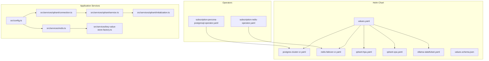
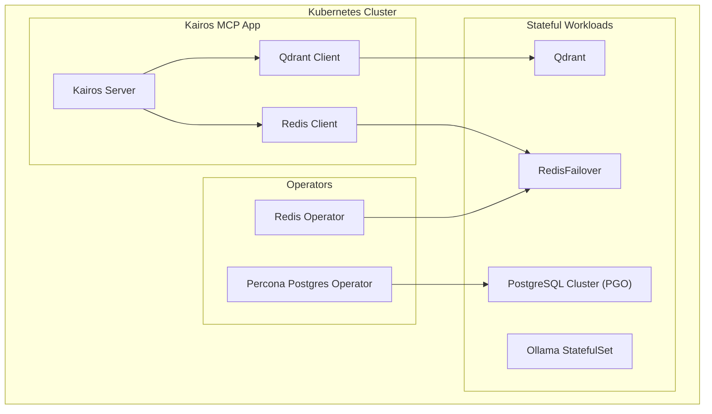
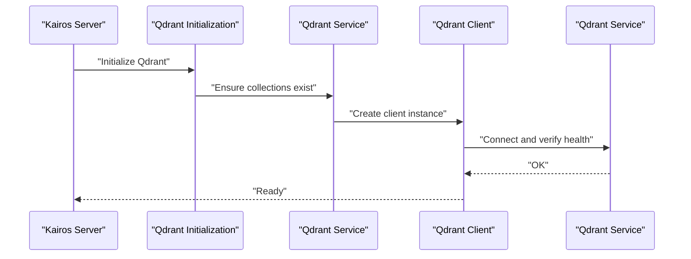
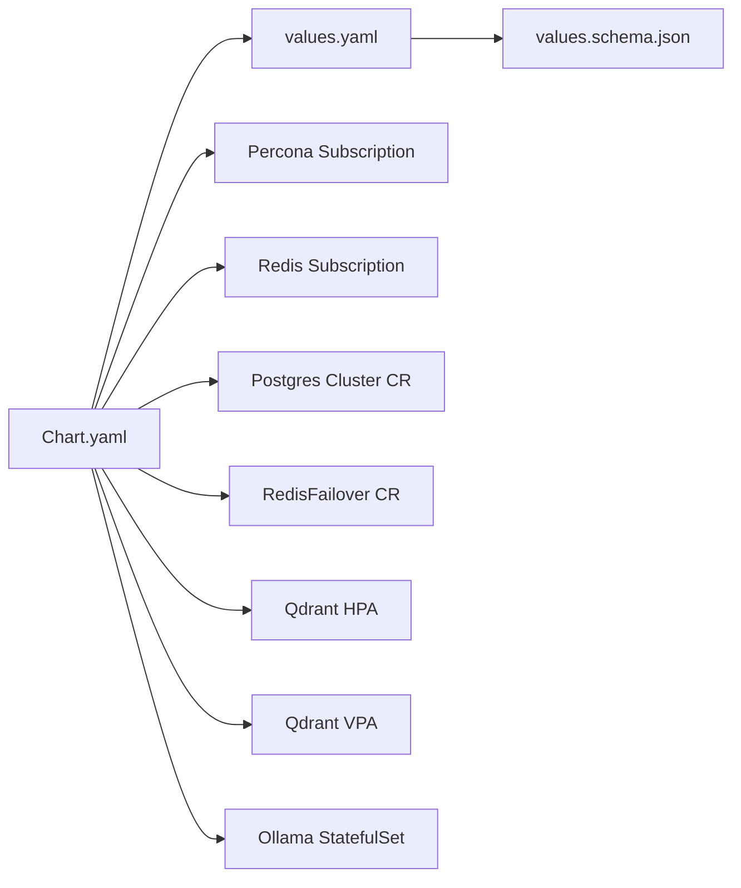

# Database and Storage Configuration

<cite>
**Referenced Files in This Document**
- [helm/kairos-mcp/templates/postgres-cluster-cr.yaml](file://helm/kairos-mcp/templates/postgres-cluster-cr.yaml)
- [helm/kairos-mcp/templates/redis-failover-cr.yaml](file://helm/kairos-mcp/templates/redis-failover-cr.yaml)
- [helm/kairos-mcp/templates/qdrant-hpa.yaml](file://helm/kairos-mcp/templates/qdrant-hpa.yaml)
- [helm/kairos-mcp/templates/qdrant-vpa.yaml](file://helm/kairos-mcp/templates/qdrant-vpa.yaml)
- [helm/kairos-mcp/templates/ollama-statefulset.yaml](file://helm/kairos-mcp/templates/ollama-statefulset.yaml)
- [helm/kairos-mcp/values.yaml](file://helm/kairos-mcp/values.yaml)
- [helm/kairos-mcp/values.schema.json](file://helm/kairos-mcp/values.schema.json)
- [helm/kairos-mcp/Chart.yaml](file://helm/kairos-mcp/Chart.yaml)
- [helm/operators/subscription-percona-postgresql-operator.yaml](file://helm/operators/subscription-percona-postgresql-operator.yaml)
- [helm/operators/subscription-redis-operator.yaml](file://helm/operators/subscription-redis-operator.yaml)
- [src/services/qdrant/connection.ts](file://src/services/qdrant/connection.ts)
- [src/services/qdrant/service.ts](file://src/services/qdrant/service.ts)
- [src/services/qdrant/initialization.ts](file://src/services/qdrant/initialization.ts)
- [src/services/redis.ts](file://src/services/redis.ts)
- [src/services/key-value-store-factory.ts](file://src/services/key-value-store-factory.ts)
- [src/config.ts](file://src/config.ts)
- [scripts/kairos-db-init/README.md](file://scripts/kairos-db-init/README.md)
</cite>

## Table of Contents
1. [Introduction](#introduction)
2. [Project Structure](#project-structure)
3. [Core Components](#core-components)
4. [Architecture Overview](#architecture-overview)
5. [Detailed Component Analysis](#detailed-component-analysis)
6. [Dependency Analysis](#dependency-analysis)
7. [Performance Considerations](#performance-considerations)
8. [Troubleshooting Guide](#troubleshooting-guide)
9. [Conclusion](#conclusion)
10. [Appendices](#appendices)

## Introduction
This document provides comprehensive guidance for configuring database and storage components in Kairos MCP deployments. It covers:
- PostgreSQL cluster setup using the Percona Operator
- Qdrant vector database configuration
- Redis failover setup
- Ollama stateful deployment
- Persistent volume claims, storage classes, and backup strategies
- Performance tuning parameters, connection pooling, and high availability configurations
- Data migration procedures and disaster recovery planning

The content is derived from Helm templates, operator subscriptions, application service modules, and configuration files within the repository.

## Project Structure
Kairos MCP deploys its data plane via Kubernetes Operators and Helm charts. The relevant infrastructure manifests are located under helm/kairos-mcp/templates and helm/operators. Application-side integration with Qdrant and Redis is implemented in src/services.

**Diagram sources**
- [helm/kairos-mcp/templates/postgres-cluster-cr.yaml](file://helm/kairos-mcp/templates/postgres-cluster-cr.yaml)
- [helm/kairos-mcp/templates/redis-failover-cr.yaml](file://helm/kairos-mcp/templates/redis-failover-cr.yaml)
- [helm/kairos-mcp/templates/qdrant-hpa.yaml](file://helm/kairos-mcp/templates/qdrant-hpa.yaml)
- [helm/kairos-mcp/templates/qdrant-vpa.yaml](file://helm/kairos-mcp/templates/qdrant-vpa.yaml)
- [helm/kairos-mcp/templates/ollama-statefulset.yaml](file://helm/kairos-mcp/templates/ollama-statefulset.yaml)
- [helm/kairos-mcp/values.yaml](file://helm/kairos-mcp/values.yaml)
- [helm/kairos-mcp/values.schema.json](file://helm/kairos-mcp/values.schema.json)
- [helm/operators/subscription-percona-postgresql-operator.yaml](file://helm/operators/subscription-percona-postgresql-operator.yaml)
- [helm/operators/subscription-redis-operator.yaml](file://helm/operators/subscription-redis-operator.yaml)
- [src/services/qdrant/connection.ts](file://src/services/qdrant/connection.ts)
- [src/services/qdrant/service.ts](file://src/services/qdrant/service.ts)
- [src/services/qdrant/initialization.ts](file://src/services/qdrant/initialization.ts)
- [src/services/redis.ts](file://src/services/redis.ts)
- [src/services/key-value-store-factory.ts](file://src/services/key-value-store-factory.ts)
- [src/config.ts](file://src/config.ts)

**Section sources**
- [helm/kairos-mcp/Chart.yaml](file://helm/kairos-mcp/Chart.yaml)
- [helm/kairos-mcp/values.yaml](file://helm/kairos-mcp/values.yaml)
- [helm/kairos-mcp/values.schema.json](file://helm/kairos-mcp/values.schema.json)

## Core Components
- PostgreSQL (Percona Operator): Deployed as a Cluster Custom Resource managed by the Percona PostgreSQL Operator.
- Qdrant: Vector database configured via Helm values; autoscaling via HPA/VPA.
- Redis: Failover cluster deployed via Redis Operator’s RedisFailover CR.
- Ollama: Stateful workload for embeddings/inference, deployed as a StatefulSet.
- Application Integration:
  - Qdrant client initialization and lifecycle management
  - Redis client and key-value store factory for caching and session/state
  - Centralized configuration loader

Key responsibilities:
- Provisioning persistent storage for each component
- Exposing services for application access
- Enabling HA and autoscaling where applicable
- Providing configuration hooks for performance tuning

**Section sources**
- [helm/kairos-mcp/templates/postgres-cluster-cr.yaml](file://helm/kairos-mcp/templates/postgres-cluster-cr.yaml)
- [helm/kairos-mcp/templates/redis-failover-cr.yaml](file://helm/kairos-mcp/templates/redis-failover-cr.yaml)
- [helm/kairos-mcp/templates/qdrant-hpa.yaml](file://helm/kairos-mcp/templates/qdrant-hpa.yaml)
- [helm/kairos-mcp/templates/qdrant-vpa.yaml](file://helm/kairos-mcp/templates/qdrant-vpa.yaml)
- [helm/kairos-mcp/templates/ollama-statefulset.yaml](file://helm/kairos-mcp/templates/ollama-statefulset.yaml)
- [src/services/qdrant/connection.ts](file://src/services/qdrant/connection.ts)
- [src/services/qdrant/service.ts](file://src/services/qdrant/service.ts)
- [src/services/qdrant/initialization.ts](file://src/services/qdrant/initialization.ts)
- [src/services/redis.ts](file://src/services/redis.ts)
- [src/services/key-value-store-factory.ts](file://src/services/key-value-store-factory.ts)
- [src/config.ts](file://src/config.ts)

## Architecture Overview
The following diagram shows how Kairos MCP integrates with its data stores and operators.

**Diagram sources**
- [helm/kairos-mcp/templates/postgres-cluster-cr.yaml](file://helm/kairos-mcp/templates/postgres-cluster-cr.yaml)
- [helm/kairos-mcp/templates/redis-failover-cr.yaml](file://helm/kairos-mcp/templates/redis-failover-cr.yaml)
- [helm/kairos-mcp/templates/qdrant-hpa.yaml](file://helm/kairos-mcp/templates/qdrant-hpa.yaml)
- [helm/kairos-mcp/templates/ollama-statefulset.yaml](file://helm/kairos-mcp/templates/ollama-statefulset.yaml)
- [src/services/qdrant/connection.ts](file://src/services/qdrant/connection.ts)
- [src/services/redis.ts](file://src/services/redis.ts)

## Detailed Component Analysis

### PostgreSQL Cluster (Percona Operator)
- Deployment model: Managed by the Percona PostgreSQL Operator via a Cluster Custom Resource.
- Persistence: Uses PVCs provisioned by the operator based on storage class settings.
- High availability: Multi-replica clusters with automatic failover handled by the operator.
- Backups: Operator-managed backups can be configured through the cluster CR.

Operational notes:
- Ensure the Percona Operator subscription is installed before deploying the cluster CR.
- Tune replica count, resources, and storage class according to workload requirements.
- Use secrets for credentials and TLS if required.

**Section sources**
- [helm/kairos-mcp/templates/postgres-cluster-cr.yaml](file://helm/kairos-mcp/templates/postgres-cluster-cr.yaml)
- [helm/operators/subscription-percona-postgresql-operator.yaml](file://helm/operators/subscription-percona-postgresql-operator.yaml)

### Qdrant Vector Database
- Deployment: Configured via Helm values; autoscaled with HPA and VPA.
- Initialization: Application initializes collections and performs readiness checks at startup.
- Connection: Client connects to the Qdrant service endpoint defined in configuration.

Configuration highlights:
- Autoscaling thresholds and resource requests/limits are set via HPA/VPA manifests.
- Service exposure and internal DNS names are used by the application.

**Section sources**
- [helm/kairos-mcp/templates/qdrant-hpa.yaml](file://helm/kairos-mcp/templates/qdrant-hpa.yaml)
- [helm/kairos-mcp/templates/qdrant-vpa.yaml](file://helm/kairos-mcp/templates/qdrant-vpa.yaml)
- [src/services/qdrant/connection.ts](file://src/services/qdrant/connection.ts)
- [src/services/qdrant/service.ts](file://src/services/qdrant/service.ts)
- [src/services/qdrant/initialization.ts](file://src/services/qdrant/initialization.ts)

### Redis Failover
- Deployment: RedisFailover CR managed by the Redis Operator.
- Persistence: Optional persistence enabled via CR; uses PVCs backed by storage class.
- High availability: Master-replica topology with automatic failover.

Operational notes:
- Configure memory limits and persistence options in the RedisFailover CR.
- Use TLS and authentication settings as needed for production.

**Section sources**
- [helm/kairos-mcp/templates/redis-failover-cr.yaml](file://helm/kairos-mcp/templates/redis-failover-cr.yaml)
- [helm/operators/subscription-redis-operator.yaml](file://helm/operators/subscription-redis-operator.yaml)

### Ollama Stateful Deployment
- Deployment: StatefulSet ensures stable network identity and persistent storage per replica.
- Storage: PVCs attached to each pod for model artifacts and runtime state.
- Scaling: Typically scaled to one primary replica for state consistency unless multi-node inference is explicitly supported.

Operational notes:
- Allocate sufficient CPU/GPU and memory for embedding workloads.
- Mount persistent volumes for model caches to avoid re-downloads.

**Section sources**
- [helm/kairos-mcp/templates/ollama-statefulset.yaml](file://helm/kairos-mcp/templates/ollama-statefulset.yaml)

### Application Integration and Configuration
- Qdrant client: Initializes connections, manages collection lifecycle, and exposes retrieval/update methods.
- Redis client: Provides cache and key-value store capabilities; integrated via a factory for different backends.
- Central config: Loads environment-driven settings for endpoints, timeouts, and feature toggles.

**Diagram sources**
- [src/services/qdrant/initialization.ts](file://src/services/qdrant/initialization.ts)
- [src/services/qdrant/service.ts](file://src/services/qdrant/service.ts)
- [src/services/qdrant/connection.ts](file://src/services/qdrant/connection.ts)

**Section sources**
- [src/services/qdrant/connection.ts](file://src/services/qdrant/connection.ts)
- [src/services/qdrant/service.ts](file://src/services/qdrant/service.ts)
- [src/services/qdrant/initialization.ts](file://src/services/qdrant/initialization.ts)
- [src/services/redis.ts](file://src/services/redis.ts)
- [src/services/key-value-store-factory.ts](file://src/services/key-value-store-factory.ts)
- [src/config.ts](file://src/config.ts)

## Dependency Analysis
The chart depends on external operators to manage stateful components. Values drive resource sizing, autoscaling, and feature flags.

**Diagram sources**
- [helm/kairos-mcp/Chart.yaml](file://helm/kairos-mcp/Chart.yaml)
- [helm/kairos-mcp/values.yaml](file://helm/kairos-mcp/values.yaml)
- [helm/kairos-mcp/values.schema.json](file://helm/kairos-mcp/values.schema.json)
- [helm/operators/subscription-percona-postgresql-operator.yaml](file://helm/operators/subscription-percona-postgresql-operator.yaml)
- [helm/operators/subscription-redis-operator.yaml](file://helm/operators/subscription-redis-operator.yaml)
- [helm/kairos-mcp/templates/postgres-cluster-cr.yaml](file://helm/kairos-mcp/templates/postgres-cluster-cr.yaml)
- [helm/kairos-mcp/templates/redis-failover-cr.yaml](file://helm/kairos-mcp/templates/redis-failover-cr.yaml)
- [helm/kairos-mcp/templates/qdrant-hpa.yaml](file://helm/kairos-mcp/templates/qdrant-hpa.yaml)
- [helm/kairos-mcp/templates/qdrant-vpa.yaml](file://helm/kairos-mcp/templates/qdrant-vpa.yaml)
- [helm/kairos-mcp/templates/ollama-statefulset.yaml](file://helm/kairos-mcp/templates/ollama-statefulset.yaml)

**Section sources**
- [helm/kairos-mcp/Chart.yaml](file://helm/kairos-mcp/Chart.yaml)
- [helm/kairos-mcp/values.yaml](file://helm/kairos-mcp/values.yaml)
- [helm/kairos-mcp/values.schema.json](file://helm/kairos-mcp/values.schema.json)

## Performance Considerations
- PostgreSQL
  - Set appropriate replica counts and resource requests/limits in the cluster CR.
  - Choose a storage class with suitable IOPS and throughput for OLTP workloads.
  - Enable WAL archiving and configure backup schedules via the operator.
- Qdrant
  - Size replicas and tune HPA thresholds based on vector dimensionality and query load.
  - Use VPA to right-size CPU/memory over time.
  - Ensure adequate disk space for index growth.
- Redis
  - Configure memory limits and eviction policies in the RedisFailover CR.
  - Enable persistence only if durability is required; otherwise use ephemeral mode for speed.
  - Place on low-latency storage for cache-heavy workloads.
- Ollama
  - Allocate GPU/CPU and memory proportional to model size and concurrency.
  - Persist model caches to avoid repeated downloads.
  - Limit concurrent requests if necessary to prevent resource exhaustion.

[No sources needed since this section provides general guidance]

## Troubleshooting Guide
- Connectivity issues
  - Verify service endpoints and DNS resolution for Qdrant and Redis.
  - Check TLS and authentication settings in application configuration.
- Startup failures
  - Inspect Qdrant initialization logs for collection creation errors.
  - Confirm Redis connectivity and permissions.
- Storage problems
  - Validate PVC bindings and storage class availability.
  - Review operator status for PostgreSQL and RedisFailover.
- Backup and restore
  - Use operator-native backup mechanisms for PostgreSQL and Redis.
  - For Qdrant, leverage snapshotting features exposed by the service.

**Section sources**
- [src/services/qdrant/initialization.ts](file://src/services/qdrant/initialization.ts)
- [src/services/redis.ts](file://src/services/redis.ts)
- [helm/kairos-mcp/templates/postgres-cluster-cr.yaml](file://helm/kairos-mcp/templates/postgres-cluster-cr.yaml)
- [helm/kairos-mcp/templates/redis-failover-cr.yaml](file://helm/kairos-mcp/templates/redis-failover-cr.yaml)

## Conclusion
Kairos MCP leverages Kubernetes Operators and Helm to deploy and manage its data plane components. By correctly configuring the Percona PostgreSQL cluster, Qdrant, Redis failover, and Ollama stateful sets—along with appropriate storage classes, autoscaling, and backup strategies—you can achieve a robust, scalable, and high-availability deployment. Application-side integration points provide clear hooks for initialization, health checks, and operational controls.

[No sources needed since this section summarizes without analyzing specific files]

## Appendices

### Persistent Volume Claims and Storage Classes
- PostgreSQL: PVCs are created by the Percona Operator based on the cluster CR and storage class.
- Redis: Optional persistence uses PVCs defined in the RedisFailover CR.
- Qdrant: If persistence is enabled, PVCs are bound per replica.
- Ollama: Each replica mounts a PVC for model artifacts and runtime state.

**Section sources**
- [helm/kairos-mcp/templates/postgres-cluster-cr.yaml](file://helm/kairos-mcp/templates/postgres-cluster-cr.yaml)
- [helm/kairos-mcp/templates/redis-failover-cr.yaml](file://helm/kairos-mcp/templates/redis-failover-cr.yaml)
- [helm/kairos-mcp/templates/ollama-statefulset.yaml](file://helm/kairos-mcp/templates/ollama-statefulset.yaml)

### Backup Strategies
- PostgreSQL: Use Percona Operator backup resources and retention policies.
- Redis: Enable persistence and schedule snapshots; consider offloading to object storage.
- Qdrant: Utilize snapshot APIs or operator-backed mechanisms if available.
- Ollama: Snapshot PVC contents or replicate models across nodes.

**Section sources**
- [helm/kairos-mcp/templates/postgres-cluster-cr.yaml](file://helm/kairos-mcp/templates/postgres-cluster-cr.yaml)
- [helm/kairos-mcp/templates/redis-failover-cr.yaml](file://helm/kairos-mcp/templates/redis-failover-cr.yaml)

### Data Migration Procedures
- PostgreSQL: Perform logical dumps and restores using operator tools or pg_dump/pg_restore workflows.
- Qdrant: Export/import collections via snapshotting and restoration steps.
- Redis: Dump RDB/AOF and restore to new instances during upgrades.
- Ollama: Copy model directories between PVCs or pre-warm images.

**Section sources**
- [scripts/kairos-db-init/README.md](file://scripts/kairos-db-init/README.md)

### Disaster Recovery Planning
- Define RPO/RTO targets for each component.
- Automate backups and test restores regularly.
- Maintain runbooks for operator-driven failovers and manual interventions.
- Keep configuration drift under control via GitOps and versioned Helm values.

[No sources needed since this section provides general guidance]