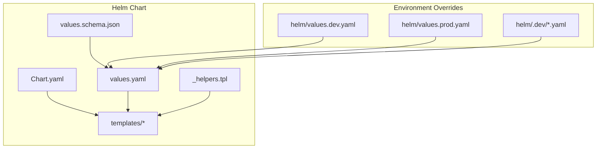
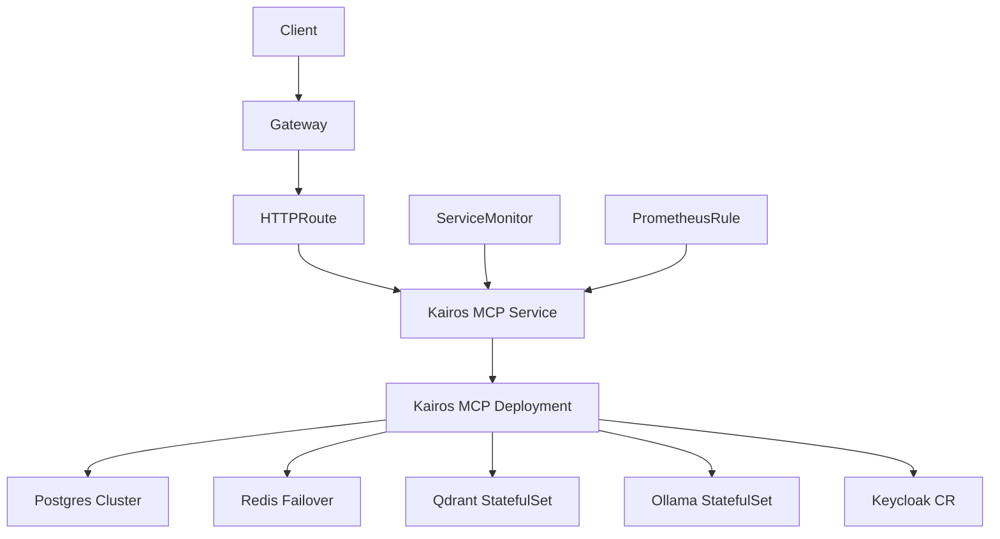
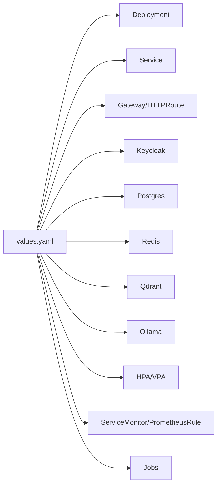

# Helm Chart Structure and Configuration

<cite>
**Referenced Files in This Document**
- [Chart.yaml](file://helm/kairos-mcp/Chart.yaml)
- [values.yaml](file://helm/kairos-mcp/values.yaml)
- [values.schema.json](file://helm/kairos-mcp/values.schema.json)
- [_helpers.tpl](file://helm/kairos-mcp/templates/_helpers.tpl)
- [kairos-mcp-deployment.yaml](file://helm/kairos-mcp/templates/kairos-mcp-deployment.yaml)
- [kairos-mcp-service.yaml](file://helm/kairos-mcp/templates/kairos-mcp-service.yaml)
- [app-hpa.yaml](file://helm/kairos-mcp/templates/app-hpa.yaml)
- [app-vpa.yaml](file://helm/kairos-mcp/templates/app-vpa.yaml)
- [app-servicemonitor.yaml](file://helm/kairos-mcp/templates/app-servicemonitor.yaml)
- [prometheusrule.yaml](file://helm/kairos-mcp/templates/prometheusrule.yaml)
- [gateway.yaml](file://helm/kairos-mcp/templates/gateway.yaml)
- [httproute-mcp.yaml](file://helm/kairos-mcp/templates/httproute-mcp.yaml)
- [gateway-certificate.yaml](file://helm/kairos-mcp/templates/gateway-certificate.yaml)
- [keycloak-cr.yaml](file://helm/kairos-mcp/templates/keycloak-cr.yaml)
- [keycloak-realm-import.yaml](file://helm/kairos-mcp/templates/keycloak-realm-import.yaml)
- [keycloak-dcr-cleanup-cronjob.yaml](file://helm/kairos-mcp/templates/keycloak-dcr-cleanup-cronjob.yaml)
- [postgres-cluster-cr.yaml](file://helm/kairos-mcp/templates/postgres-cluster-cr.yaml)
- [redis-failover-cr.yaml](file://helm/kairos-mcp/templates/redis-failover-cr.yaml)
- [qdrant-statefulset.yaml](file://helm/kairos-mcp/templates/qdrant-statefulset.yaml)
- [ollama-statefulset.yaml](file://helm/kairos-mcp/templates/ollama-statefulset.yaml)
- [credentials-secret-generator-job.yaml](file://helm/kairos-mcp/templates/credentials-secret-generator-job.yaml)
- [operator-precheck-job.yaml](file://helm/kairos-mcp/templates/operator-precheck-job.yaml)
- [NOTES.txt](file://helm/kairos-mcp/templates/NOTES.txt)
- [README.md](file://helm/kairos-mcp/README.md)
- [values.dev.yaml](file://helm/values.dev.yaml)
- [values.prod.yaml](file://helm/values.prod.yaml)
- [.dev/values.yaml](file://helm/.dev/values.yaml)
- [.dev/values-http.yaml](file://helm/.dev/values-http.yaml)
- [.dev/values-tls.yaml](file://helm/.dev/values-tls.yaml)
- [.dev/values-full.yaml](file://helm/.dev/values-full.yaml)
- [.dev/values-tls-redis.yaml](file://helm/.dev/values-tls-redis.yaml)
- [helm-bump-version.mjs](file://scripts/helm-bump-version.mjs)
- [helm-sync-app-version.mjs](file://scripts/helm-sync-app-version.mjs)
</cite>

## Update Summary
**Changes Made**
- Updated project structure section to reflect removal of development utilities and helper scripts
- Simplified dependency analysis to focus on core Helm chart components only
- Removed references to deprecated eslint configuration and skill authoring templates
- Streamlined troubleshooting guide to remove outdated development tool references

## Table of Contents
1. [Introduction](#introduction)
2. [Project Structure](#project-structure)
3. [Core Components](#core-components)
4. [Architecture Overview](#architecture-overview)
5. [Detailed Component Analysis](#detailed-component-analysis)
6. [Dependency Analysis](#dependency-analysis)
7. [Performance Considerations](#performance-considerations)
8. [Troubleshooting Guide](#troubleshooting-guide)
9. [Conclusion](#conclusion)
10. [Appendices](#appendices)

## Introduction
This document explains the Kairos MCP Helm chart structure, configuration options, template organization, helper functions, conditional rendering, versioning strategy, and upgrade procedures. It is intended for platform engineers and operators deploying Kairos MCP on Kubernetes using Helm. The goal is to provide a clear understanding of how the chart is organized, what can be configured, and how to customize it for different environments.

## Project Structure
The Helm chart resides under helm/kairos-mcp and follows standard Helm conventions:
- Chart metadata and dependencies are defined in Chart.yaml.
- Default values and environment overrides are provided in values.yaml and additional values files.
- Templates render Kubernetes resources conditionally based on values.
- A JSON schema validates user-provided values.

**Updated** Development utilities and helper scripts have been streamlined to focus on core deployment functionality.

**Diagram sources**
- [Chart.yaml](file://helm/kairos-mcp/Chart.yaml)
- [values.yaml](file://helm/kairos-mcp/values.yaml)
- [values.schema.json](file://helm/kairos-mcp/values.schema.json)
- [_helpers.tpl](file://helm/kairos-mcp/templates/_helpers.tpl)
- [kairos-mcp-deployment.yaml](file://helm/kairos-mcp/templates/kairos-mcp-deployment.yaml)
- [kairos-mcp-service.yaml](file://helm/kairos-mcp/templates/kairos-mcp-service.yaml)
- [app-hpa.yaml](file://helm/kairos-mcp/templates/app-hpa.yaml)
- [app-vpa.yaml](file://helm/kairos-mcp/templates/app-vpa.yaml)
- [app-servicemonitor.yaml](file://helm/kairos-mcp/templates/app-servicemonitor.yaml)
- [prometheusrule.yaml](file://helm/kairos-mcp/templates/prometheusrule.yaml)
- [gateway.yaml](file://helm/kairos-mcp/templates/gateway.yaml)
- [httproute-mcp.yaml](file://helm/kairos-mcp/templates/httproute-mcp.yaml)
- [gateway-certificate.yaml](file://helm/kairos-mcp/templates/gateway-certificate.yaml)
- [keycloak-cr.yaml](file://helm/kairos-mcp/templates/keycloak-cr.yaml)
- [keycloak-realm-import.yaml](file://helm/kairos-mcp/templates/keycloak-realm-import.yaml)
- [keycloak-dcr-cleanup-cronjob.yaml](file://helm/kairos-mcp/templates/keycloak-dcr-cleanup-cronjob.yaml)
- [postgres-cluster-cr.yaml](file://helm/kairos-mcp/templates/postgres-cluster-cr.yaml)
- [redis-failover-cr.yaml](file://helm/kairos-mcp/templates/redis-failover-cr.yaml)
- [qdrant-statefulset.yaml](file://helm/kairos-mcp/templates/qdrant-statefulset.yaml)
- [ollama-statefulset.yaml](file://helm/kairos-mcp/templates/ollama-statefulset.yaml)
- [credentials-secret-generator-job.yaml](file://helm/kairos-mcp/templates/credentials-secret-generator-job.yaml)
- [operator-precheck-job.yaml](file://helm/kairos-mcp/templates/operator-precheck-job.yaml)
- [NOTES.txt](file://helm/kairos-mcp/templates/NOTES.txt)
- [values.dev.yaml](file://helm/values.dev.yaml)
- [values.prod.yaml](file://helm/values.prod.yaml)
- [.dev/values.yaml](file://helm/.dev/values.yaml)
- [.dev/values-http.yaml](file://helm/.dev/values-http.yaml)
- [.dev/values-tls.yaml](file://helm/.dev/values-tls.yaml)
- [.dev/values-full.yaml](file://helm/.dev/values-full.yaml)
- [.dev/values-tls-redis.yaml](file://helm/.dev/values-tls-redis.yaml)

**Section sources**
- [Chart.yaml](file://helm/kairos-mcp/Chart.yaml)
- [values.yaml](file://helm/kairos-mcp/values.yaml)
- [values.schema.json](file://helm/kairos-mcp/values.schema.json)
- [README.md](file://helm/kairos-mcp/README.md)

## Core Components
- Chart metadata (versioning, appVersion, dependencies): Chart.yaml
- Values and defaults: values.yaml
- Values validation: values.schema.json
- Shared helpers and naming: _helpers.tpl
- Application resources: deployment, service, autoscaling, monitoring
- Ingress/Gateway and routes: gateway, httproute, certificate
- Optional infrastructure components: Keycloak, Postgres, Redis, Qdrant, Ollama
- Jobs and prechecks: credentials generator, operator precheck

Key responsibilities:
- Rendering application Deployment and Service with configurable replicas, resources, probes, and environment variables.
- Conditional creation of optional services (Keycloak, Postgres, Redis, Qdrant, Ollama).
- Exposing the application via Gateway API or HTTPRoute with TLS support.
- Enabling Prometheus scraping and alerting rules.
- Generating secrets and performing pre-install checks.

**Section sources**
- [Chart.yaml](file://helm/kairos-mcp/Chart.yaml)
- [values.yaml](file://helm/kairos-mcp/values.yaml)
- [values.schema.json](file://helm/kairos-mcp/values.schema.json)
- [_helpers.tpl](file://helm/kairos-mcp/templates/_helpers.tpl)
- [kairos-mcp-deployment.yaml](file://helm/kairos-mcp/templates/kairos-mcp-deployment.yaml)
- [kairos-mcp-service.yaml](file://helm/kairos-mcp/templates/kairos-mcp-service.yaml)
- [app-hpa.yaml](file://helm/kairos-mcp/templates/app-hpa.yaml)
- [app-vva.yaml](file://helm/kairos-mcp/templates/app-vpa.yaml)
- [app-servicemonitor.yaml](file://helm/kairos-mcp/templates/app-servicemonitor.yaml)
- [prometheusrule.yaml](file://helm/kairos-mcp/templates/prometheusrule.yaml)
- [gateway.yaml](file://helm/kairos-mcp/templates/gateway.yaml)
- [httproute-mcp.yaml](file://helm/kairos-mcp/templates/httproute-mcp.yaml)
- [gateway-certificate.yaml](file://helm/kairos-mcp/templates/gateway-certificate.yaml)
- [keycloak-cr.yaml](file://helm/kairos-mcp/templates/keycloak-cr.yaml)
- [keycloak-realm-import.yaml](file://helm/kairos-mcp/templates/keycloak-realm-import.yaml)
- [keycloak-dcr-cleanup-cronjob.yaml](file://helm/kairos-mcp/templates/keycloak-dcr-cleanup-cronjob.yaml)
- [postgres-cluster-cr.yaml](file://helm/kairos-mcp/templates/postgres-cluster-cr.yaml)
- [redis-failover-cr.yaml](file://helm/kairos-mcp/templates/redis-failover-cr.yaml)
- [qdrant-statefulset.yaml](file://helm/kairos-mcp/templates/qdrant-statefulset.yaml)
- [ollama-statefulset.yaml](file://helm/kairos-mcp/templates/ollama-statefulset.yaml)
- [credentials-secret-generator-job.yaml](file://helm/kairos-mcp/templates/credentials-secret-generator-job.yaml)
- [operator-precheck-job.yaml](file://helm/kairos-mcp/templates/operator-precheck-job.yaml)

## Architecture Overview
The chart deploys the Kairos MCP application along with optional infrastructure components and exposes it through the Gateway API. Autoscaling and monitoring are enabled via HPA/VPA and ServiceMonitor/PrometheusRule.

**Diagram sources**
- [kairos-mcp-deployment.yaml](file://helm/kairos-mcp/templates/kairos-mcp-deployment.yaml)
- [kairos-mcp-service.yaml](file://helm/kairos-mcp/templates/kairos-mcp-service.yaml)
- [gateway.yaml](file://helm/kairos-mcp/templates/gateway.yaml)
- [httproute-mcp.yaml](file://helm/kairos-mcp/templates/httproute-mcp.yaml)
- [postgres-cluster-cr.yaml](file://helm/kairos-mcp/templates/postgres-cluster-cr.yaml)
- [redis-failover-cr.yaml](file://helm/kairos-mcp/templates/redis-failover-cr.yaml)
- [qdrant-statefulset.yaml](file://helm/kairos-mcp/templates/qdrant-statefulset.yaml)
- [ollama-statefulset.yaml](file://helm/kairos-mcp/templates/ollama-statefulset.yaml)
- [keycloak-cr.yaml](file://helm/kairos-mcp/templates/keycloak-cr.yaml)
- [app-servicemonitor.yaml](file://helm/kairos-mcp/templates/app-servicemonitor.yaml)
- [prometheusrule.yaml](file://helm/kairos-mcp/templates/prometheusrule.yaml)

## Detailed Component Analysis

### Chart Metadata and Versioning
- Chart.yaml defines chart version, appVersion, and any dependencies.
- App version synchronization and bumping are supported by scripts that update both chart and application versions consistently.

Upgrade considerations:
- Use the provided scripts to keep chart and app versions in sync before release.
- Follow semantic versioning; patch for bug fixes, minor for features, major for breaking changes.

**Section sources**
- [Chart.yaml](file://helm/kairos-mcp/Chart.yaml)
- [helm-bump-version.mjs](file://scripts/helm-bump-version.mjs)
- [helm-sync-app-version.mjs](file://scripts/helm-sync-app-version.mjs)

### Values and Schema Validation
- values.yaml contains all configurable options grouped by feature areas (application, ingress/gateway, auth, storage, observability, etc.).
- values.schema.json enforces types, required fields, and allowed enumerations to prevent misconfiguration.

Common value categories:
- Application image, replicas, resources, probes, environment variables
- Gateway and HTTPRoute settings (TLS, hosts, paths)
- Authentication (Keycloak integration flags and endpoints)
- Storage backends (Postgres, Redis, Qdrant)
- Observability (ServiceMonitor, PrometheusRule)
- Autoscaling (HPA, VPA)

Validation examples:
- Boolean toggles enable/disable optional components like Keycloak, Redis, Qdrant, Ollama.
- String values enforce URL formats and hostnames.
- Numeric ranges constrain CPU/memory requests/limits and replica counts.

**Section sources**
- [values.yaml](file://helm/kairos-mcp/values.yaml)
- [values.schema.json](file://helm/kairos-mcp/values.schema.json)

### Template Organization and Helpers
- _helpers.tpl provides reusable templates for names, labels, selectors, and common blocks used across resource templates.
- Each template file corresponds to a specific Kubernetes resource and uses helpers for consistent naming and labeling.

Conditional rendering patterns:
- Feature flags control whether resources are created (e.g., Keycloak, Redis, Qdrant, Ollama).
- Environment-specific behavior is driven by values (e.g., enabling TLS, exposing via Gateway vs. NodePort).

Best practices:
- Keep shared logic in helpers to avoid duplication.
- Use boolean flags to toggle optional components cleanly.
- Centralize label and selector definitions for consistency.

**Section sources**
- [_helpers.tpl](file://helm/kairos-mcp/templates/_helpers.tpl)
- [kairos-mcp-deployment.yaml](file://helm/kairos-mcp/templates/kairos-mcp-deployment.yaml)
- [kairos-mcp-service.yaml](file://helm/kairos-mcp/templates/kairos-mcp-service.yaml)
- [app-hpa.yaml](file://helm/kairos-mcp/templates/app-hpa.yaml)
- [app-vpa.yaml](file://helm/kairos-mcp/templates/app-vpa.yaml)
- [app-servicemonitor.yaml](file://helm/kairos-mcp/templates/app-servicemonitor.yaml)
- [prometheusrule.yaml](file://helm/kairos-mcp/templates/prometheusrule.yaml)
- [gateway.yaml](file://helm/kairos-mcp/templates/gateway.yaml)
- [httproute-mcp.yaml](file://helm/kairos-mcp/templates/httproute-mcp.yaml)
- [gateway-certificate.yaml](file://helm/kairos-mcp/templates/gateway-certificate.yaml)
- [keycloak-cr.yaml](file://helm/kairos-mcp/templates/keycloak-cr.yaml)
- [keycloak-realm-import.yaml](file://helm/kairos-mcp/templates/keycloak-realm-import.yaml)
- [keycloak-dcr-cleanup-cronjob.yaml](file://helm/kairos-mcp/templates/keycloak-dcr-cleanup-cronjob.yaml)
- [postgres-cluster-cr.yaml](file://helm/kairos-mcp/templates/postgres-cluster-cr.yaml)
- [redis-failover-cr.yaml](file://helm/kairos-mcp/templates/redis-failover-cr.yaml)
- [qdrant-statefulset.yaml](file://helm/kairos-mcp/templates/qdrant-statefulset.yaml)
- [ollama-statefulset.yaml](file://helm/kairos-mcp/templates/ollama-statefulset.yaml)
- [credentials-secret-generator-job.yaml](file://helm/kairos-mcp/templates/credentials-secret-generator-job.yaml)
- [operator-precheck-job.yaml](file://helm/kairos-mcp/templates/operator-precheck-job.yaml)

### Application Deployment and Service
- Deployment configures container images, replicas, resource requests/limits, liveness/readiness/startup probes, and environment variables.
- Service exposes the Deployment internally within the cluster.

Configuration highlights:
- Image registry and tag derived from values.
- Probes tuned for startup time and health checks.
- Environment variables sourced from ConfigMaps/Secrets as needed.

**Section sources**
- [kairos-mcp-deployment.yaml](file://helm/kairos-mcp/templates/kairos-mcp-deployment.yaml)
- [kairos-mcp-service.yaml](file://helm/kairos-mcp/templates/kairos-mcp-service.yaml)

### Autoscaling and Resource Management
- HPA scales replicas based on CPU/memory utilization thresholds.
- VPA recommends or applies resource requests/limits automatically.

Configuration highlights:
- Target metrics and scaling policies.
- Min/max replica bounds.
- VPA update modes and recommendations.

**Section sources**
- [app-hpa.yaml](file://helm/kairos-mcp/templates/app-hpa.yaml)
- [app-vpa.yaml](file://helm/kairos-mcp/templates/app-vpa.yaml)

### Observability
- ServiceMonitor enables Prometheus scraping of application metrics.
- PrometheusRule defines alerts for key operational signals.

Configuration highlights:
- Scrape intervals and endpoints.
- Alert thresholds and annotations.

**Section sources**
- [app-servicemonitor.yaml](file://helm/kairos-mcp/templates/app-servicemonitor.yaml)
- [prometheusrule.yaml](file://helm/kairos-mcp/templates/prometheusrule.yaml)

### Gateway and Routing
- Gateway resource configures the ingress controller entry point.
- HTTPRoute binds hosts and paths to the application Service.
- Certificate resource manages TLS termination if enabled.

Configuration highlights:
- Hostnames, paths, and TLS settings.
- Reference to GatewayClass and certificate issuers.

**Section sources**
- [gateway.yaml](file://helm/kairos-mcp/templates/gateway.yaml)
- [httproute-mcp.yaml](file://helm/kairos-mcp/templates/httproute-mcp.yaml)
- [gateway-certificate.yaml](file://helm/kairos-mcp/templates/gateway-certificate.yaml)

### Authentication (Keycloak)
- Keycloak Custom Resource provisions an identity provider instance.
- Realm import job/configmap loads realm configuration.
- DCR cleanup cronjob maintains client registrations.

Configuration highlights:
- Keycloak endpoint URLs and admin access.
- Realm import source and initialization flags.
- Cleanup schedule and retention policies.

**Section sources**
- [keycloak-cr.yaml](file://helm/kairos-mcp/templates/keycloak-cr.yaml)
- [keycloak-realm-import.yaml](file://helm/kairos-mcp/templates/keycloak-realm-import.yaml)
- [keycloak-dcr-cleanup-cronjob.yaml](file://helm/kairos-mcp/templates/keycloak-dcr-cleanup-cronjob.yaml)

### Data Stores and Backends
- Postgres Cluster CR provisions relational storage.
- Redis Failover CR provides caching/session store.
- Qdrant StatefulSet offers vector search capabilities.
- Ollama StatefulSet provides local model serving.

Configuration highlights:
- Storage classes, persistence sizes, and backup strategies.
- Replicas and resource constraints per component.
- Network policies and internal service exposure.

**Section sources**
- [postgres-cluster-cr.yaml](file://helm/kairos-mcp/templates/postgres-cluster-cr.yaml)
- [redis-failover-cr.yaml](file://helm/kairos-mcp/templates/redis-failover-cr.yaml)
- [qdrant-statefulset.yaml](file://helm/kairos-mcp/templates/qdrant-statefulset.yaml)
- [ollama-statefulset.yaml](file://helm/kairos-mcp/templates/ollama-statefulset.yaml)

### Secrets Generation and Prechecks
- Credentials secret generator Job creates necessary secrets at install/upgrade time.
- Operator precheck Job validates prerequisites (operators, CRDs) before proceeding.

Configuration highlights:
- Secret keys and data sources.
- Precheck timeouts and failure handling.

**Section sources**
- [credentials-secret-generator-job.yaml](file://helm/kairos-mcp/templates/credentials-secret-generator-job.yaml)
- [operator-precheck-job.yaml](file://helm/kairos-mcp/templates/operator-precheck-job.yaml)

### Post-Install Notes
- NOTES.txt prints helpful information after installation (endpoints, credentials location, next steps).

**Section sources**
- [NOTES.txt](file://helm/kairos-mcp/templates/NOTES.txt)

## Dependency Analysis
The chart's dependency graph shows how values drive template rendering and which components depend on each other.

**Updated** Simplified to focus on core Helm chart dependencies without development utility references.

**Diagram sources**
- [values.yaml](file://helm/kairos-mcp/values.yaml)
- [kairos-mcp-deployment.yaml](file://helm/kairos-mcp/templates/kairos-mcp-deployment.yaml)
- [kairos-mcp-service.yaml](file://helm/kairos-mcp/templates/kairos-mcp-service.yaml)
- [gateway.yaml](file://helm/kairos-mcp/templates/gateway.yaml)
- [httproute-mcp.yaml](file://helm/kairos-mcp/templates/httproute-mcp.yaml)
- [keycloak-cr.yaml](file://helm/kairos-mcp/templates/keycloak-cr.yaml)
- [postgres-cluster-cr.yaml](file://helm/kairos-mcp/templates/postgres-cluster-cr.yaml)
- [redis-failover-cr.yaml](file://helm/kairos-mcp/templates/redis-failover-cr.yaml)
- [qdrant-statefulset.yaml](file://helm/kairos-mcp/templates/qdrant-statefulset.yaml)
- [ollama-statefulset.yaml](file://helm/kairos-mcp/templates/ollama-statefulset.yaml)
- [app-hpa.yaml](file://helm/kairos-mcp/templates/app-hpa.yaml)
- [app-vpa.yaml](file://helm/kairos-mcp/templates/app-vpa.yaml)
- [app-servicemonitor.yaml](file://helm/kairos-mcp/templates/app-servicemonitor.yaml)
- [prometheusrule.yaml](file://helm/kairos-mcp/templates/prometheusrule.yaml)
- [credentials-secret-generator-job.yaml](file://helm/kairos-mcp/templates/credentials-secret-generator-job.yaml)
- [operator-precheck-job.yaml](file://helm/kairos-mcp/templates/operator-precheck-job.yaml)

**Section sources**
- [values.yaml](file://helm/kairos-mcp/values.yaml)
- [Chart.yaml](file://helm/kairos-mcp/Chart.yaml)

## Performance Considerations
- Set appropriate CPU/memory requests and limits in Deployment values to ensure stable scheduling and performance.
- Enable HPA for horizontal scaling under load; tune target utilization thresholds based on observed metrics.
- Use VPA to refine resource requests/limits over time.
- Configure readiness/liveness probes to balance fast recovery and false positives.
- For stateful components (Postgres, Redis, Qdrant), choose suitable storage classes and sizing to meet I/O requirements.

## Troubleshooting Guide
- Validate values against the schema before installing/upgrading to catch misconfigurations early.
- Check NOTES.txt output for endpoints and credential locations.
- Inspect Job logs for credentials generation and operator precheck failures.
- Review Gateway and HTTPRoute status for routing issues; verify TLS certificates are issued.
- Confirm ServiceMonitor and PrometheusRule are created and scraped successfully.

**Updated** Removed references to deprecated development tools and simplified troubleshooting steps.

**Section sources**
- [values.schema.json](file://helm/kairos-mcp/values.schema.json)
- [NOTES.txt](file://helm/kairos-mcp/templates/NOTES.txt)
- [credentials-secret-generator-job.yaml](file://helm/kairos-mcp/templates/credentials-secret-generator-job.yaml)
- [operator-precheck-job.yaml](file://helm/kairos-mcp/templates/operator-precheck-job.yaml)
- [gateway.yaml](file://helm/kairos-mcp/templates/gateway.yaml)
- [httproute-mcp.yaml](file://helm/kairos-mcp/templates/httproute-mcp.yaml)
- [gateway-certificate.yaml](file://helm/kairos-mcp/templates/gateway-certificate.yaml)
- [app-servicemonitor.yaml](file://helm/kairos-mcp/templates/app-servicemonitor.yaml)
- [prometheusrule.yaml](file://helm/kairos-mcp/templates/prometheusrule.yaml)

## Conclusion
The Kairos MCP Helm chart provides a comprehensive, configurable, and validated way to deploy the application and its optional infrastructure components. By leveraging values.yaml and values.schema.json, operators can tailor deployments for development, staging, and production environments. Helper templates ensure consistency, while conditional rendering supports flexible architectures. Versioning and upgrade processes are streamlined with supporting scripts.

## Appendices

### Environment-Specific Configurations
- Development: use helm/values.dev.yaml for lightweight setup.
- Production: use helm/values.prod.yaml for hardened defaults.
- Local dev profiles: helm/.dev/values*.yaml cover HTTP-only, TLS, full stack, and TLS+Redis scenarios.

Usage example pattern:
- helm install kairos-mcp ./helm/kairos-mcp -f helm/values.dev.yaml
- helm upgrade kairos-mcp ./helm/kairos-mcp -f helm/values.prod.yaml --set key=value

**Section sources**
- [values.dev.yaml](file://helm/values.dev.yaml)
- [values.prod.yaml](file://helm/values.prod.yaml)
- [.dev/values.yaml](file://helm/.dev/values.yaml)
- [.dev/values-http.yaml](file://helm/.dev/values-http.yaml)
- [.dev/values-tls.yaml](file://helm/.dev/values-tls.yaml)
- [.dev/values-full.yaml](file://helm/.dev/values-full.yaml)
- [.dev/values-tls-redis.yaml](file://helm/.dev/values-tls-redis.yaml)

### Upgrade Procedures
- Test upgrades in a non-production namespace first.
- Review NOTES.txt post-upgrade for new endpoints or credential changes.
- Monitor Jobs (credentials generator, operator precheck) for successful completion.
- Verify Gateway/HTTPRoute and TLS certificate status.
- Confirm ServiceMonitor and PrometheusRule are active and scraping.

**Section sources**
- [NOTES.txt](file://helm/kairos-mcp/templates/NOTES.txt)
- [credentials-secret-generator-job.yaml](file://helm/kairos-mcp/templates/credentials-secret-generator-job.yaml)
- [operator-precheck-job.yaml](file://helm/kairos-mcp/templates/operator-precheck-job.yaml)
- [gateway.yaml](file://helm/kairos-mcp/templates/gateway.yaml)
- [httproute-mcp.yaml](file://helm/kairos-mcp/templates/httproute-mcp.yaml)
- [gateway-certificate.yaml](file://helm/kairos-mcp/templates/gateway-certificate.yaml)
- [app-servicemonitor.yaml](file://helm/kairos-mcp/templates/app-servicemonitor.yaml)
- [prometheusrule.yaml](file://helm/kairos-mcp/templates/prometheusrule.yaml)