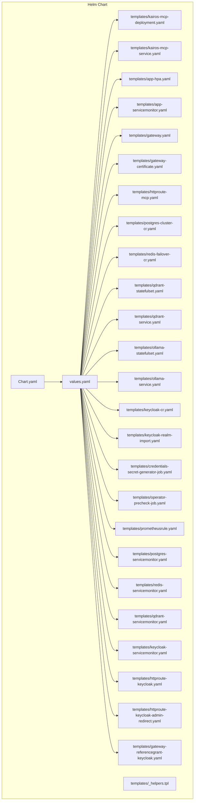
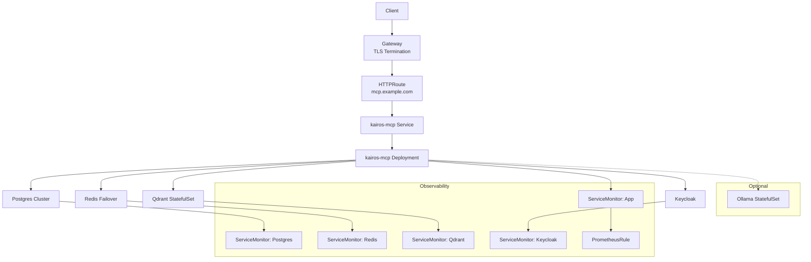
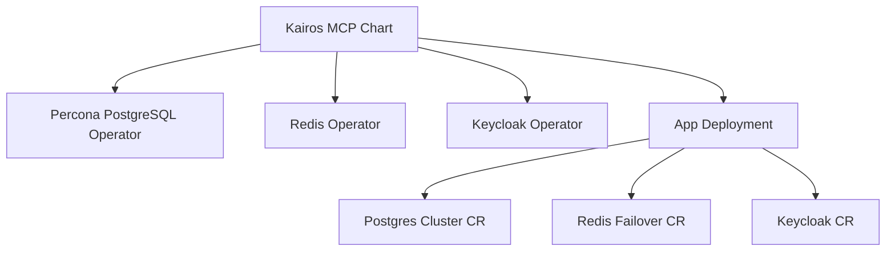

# Kubernetes and Helm Deployment

<cite>
**Referenced Files in This Document**
- [helm/kairos-mcp/Chart.yaml](file://helm/kairos-mcp/Chart.yaml)
- [helm/kairos-mcp/values.yaml](file://helm/kairos-mcp/values.yaml)
- [helm/kairos-mcp/values.schema.json](file://helm/kairos-mcp/values.schema.json)
- [helm/kairos-mcp/templates/_helpers.tpl](file://helm/kairos-mcp/templates/_helpers.tpl)
- [helm/kairos-mcp/templates/kairos-mcp-deployment.yaml](file://helm/kairos-mcp/templates/kairos-mcp-deployment.yaml)
- [helm/kairos-mcp/templates/kairos-mcp-service.yaml](file://helm/kairos-mcp/templates/kairos-mcp-service.yaml)
- [helm/kairos-mcp/templates/app-hpa.yaml](file://helm/kairos-mcp/templates/app-hpa.yaml)
- [helm/kairos-mcp/templates/app-servicemonitor.yaml](file://helm/kairos-mcp/templates/app-servicemonitor.yaml)
- [helm/kairos-mcp/templates/gateway.yaml](file://helm/kairos-mcp/templates/gateway.yaml)
- [helm/kairos-mcp/templates/gateway-certificate.yaml](file://helm/kairos-mcp/templates/gateway-certificate.yaml)
- [helm/kairos-mcp/templates/httproute-mcp.yaml](file://helm/kairos-mcp/templates/httproute-mcp.yaml)
- [helm/kairos-mcp/templates/postgres-cluster-cr.yaml](file://helm/kairos-mcp/templates/postgres-cluster-cr.yaml)
- [helm/kairos-mcp/templates/redis-failover-cr.yaml](file://helm/kairos-mcp/templates/redis-failover-cr.yaml)
- [helm/kairos-mcp/templates/qdrant-statefulset.yaml](file://helm/kairos-mcp/templates/qdrant-statefulset.yaml)
- [helm/kairos-mcp/templates/qdrant-service.yaml](file://helm/kairos-mcp/templates/qdrant-service.yaml)
- [helm/kairos-mcp/templates/ollama-statefulset.yaml](file://helm/kairos-mcp/templates/ollama-statefulset.yaml)
- [helm/kairos-mcp/templates/ollama-service.yaml](file://helm/kairos-mcp/templates/ollama-service.yaml)
- [helm/kairos-mcp/templates/keycloak-cr.yaml](file://helm/kairos-mcp/templates/keycloak-cr.yaml)
- [helm/kairos-mcp/templates/keycloak-realm-import.yaml](file://helm/kairos-mcp/templates/keycloak-realm-import.yaml)
- [helm/kairos-mcp/templates/credentials-secret-generator-job.yaml](file://helm/kairos-mcp/templates/credentials-secret-generator-job.yaml)
- [helm/kairos-mcp/templates/operator-precheck-job.yaml](file://helm/kairos-mcp/templates/operator-precheck-job.yaml)
- [helm/kairos-mcp/templates/prometheusrule.yaml](file://helm/kairos-mcp/templates/prometheusrule.yaml)
- [helm/kairos-mcp/templates/postgres-servicemonitor.yaml](file://helm/kairos-mcp/templates/postgres-servicemonitor.yaml)
- [helm/kairos-mcp/templates/redis-servicemonitor.yaml](file://helm/kairos-mcp/templates/redis-servicemonitor.yaml)
- [helm/kairos-mcp/templates/qdrant-servicemonitor.yaml](file://helm/kairos-mcp/templates/qdrant-servicemonitor.yaml)
- [helm/kairos-mcp/templates/keycloak-servicemonitor.yaml](file://helm/kairos-mcp/templates/keycloak-servicemonitor.yaml)
- [helm/kairos-mcp/templates/httproute-keycloak.yaml](file://helm/kairos-mcp/templates/httproute-keycloak.yaml)
- [helm/kairos-mcp/templates/httproute-keycloak-admin-redirect.yaml](file://helm/kairos-mcp/templates/httproute-keycloak-admin-redirect.yaml)
- [helm/kairos-mcp/templates/gateway-referencegrant-keycloak.yaml](file://helm/kairos-mcp/templates/gateway-referencegrant-keycloak.yaml)
- [helm/kairos-mcp/files/kairos-realm.json](file://helm/kairos-mcp/files/kairos-realm.json)
- [helm/kairos-mcp/docs/OPERATORS.md](file://helm/kairos-mcp/docs/OPERATORS.md)
- [helm/README.md](file://helm/README.md)
- [helm/values.prod.yaml](file://helm/values.prod.yaml)
- [helm/.dev/values.yaml](file://helm/.dev/values.yaml)
- [helm/.dev/values-tls.yaml](file://helm/.dev/values-tls.yaml)
- [helm/.dev/values-http.yaml](file://helm/.dev/values-http.yaml)
- [helm/.dev/values-full.yaml](file://helm/.dev/values-full.yaml)
- [helm/.dev/helm-deploy.sh](file://helm/.dev/helm-deploy.sh)
- [helm/.dev/helm-update.sh](file://helm/.dev/helm-update.sh)
- [scripts/env/create-env.sh](file://scripts/env/create-env.sh)
- [src/metrics-server.ts](file://src/metrics-server.ts)
- [src/http/http-metrics-middleware.ts](file://src/http/http-metrics-middleware.ts)
</cite>

## Table of Contents
1. [Introduction](#introduction)
2. [Project Structure](#project-structure)
3. [Core Components](#core-components)
4. [Architecture Overview](#architecture-overview)
5. [Detailed Component Analysis](#detailed-component-analysis)
6. [Dependency Analysis](#dependency-analysis)
7. [Performance Considerations](#performance-considerations)
8. [Troubleshooting Guide](#troubleshooting-guide)
9. [Conclusion](#conclusion)
10. [Appendices](#appendices)

## Introduction
This document provides comprehensive guidance for deploying Kairos MCP on Kubernetes using the provided Helm chart. It covers the complete chart structure, values configuration, customization options, and production best practices. You will find instructions for Deployments, Services, ConfigMaps, Secrets, Ingress/Gateway resources, persistent storage setup, SSL/TLS management, scaling strategies (including HPA), monitoring with Prometheus metrics, logging aggregation, and alerting. Platform-specific notes for AWS EKS, GKE, and Azure AKS are included to help you optimize your deployment.

## Project Structure
The Helm chart is located under helm/kairos-mcp and includes:
- Chart metadata and default values
- Templates for application components and dependencies
- Operator-based resources for Postgres, Redis, Keycloak, and optional Ollama/Qdrant
- Gateway and HTTPRoute templates for TLS and routing
- ServiceMonitors and PrometheusRule for observability
- Helper templates and documentation

**Diagram sources**
- [helm/kairos-mcp/Chart.yaml](file://helm/kairos-mcp/Chart.yaml)
- [helm/kairos-mcp/values.yaml](file://helm/kairos-mcp/values.yaml)
- [helm/kairos-mcp/templates/_helpers.tpl](file://helm/kairos-mcp/templates/_helpers.tpl)
- [helm/kairos-mcp/templates/kairos-mcp-deployment.yaml](file://helm/kairos-mcp/templates/kairos-mcp-deployment.yaml)
- [helm/kairos-mcp/templates/kairos-mcp-service.yaml](file://helm/kairos-mcp/templates/kairos-mcp-service.yaml)
- [helm/kairos-mcp/templates/app-hpa.yaml](file://helm/kairos-mcp/templates/app-hpa.yaml)
- [helm/kairos-mcp/templates/app-servicemonitor.yaml](file://helm/kairos-mcp/templates/app-servicemonitor.yaml)
- [helm/kairos-mcp/templates/gateway.yaml](file://helm/kairos-mcp/templates/gateway.yaml)
- [helm/kairos-mcp/templates/gateway-certificate.yaml](file://helm/kairos-mcp/templates/gateway-certificate.yaml)
- [helm/kairos-mcp/templates/httproute-mcp.yaml](file://helm/kairos-mcp/templates/httproute-mcp.yaml)
- [helm/kairos-mcp/templates/postgres-cluster-cr.yaml](file://helm/kairos-mcp/templates/postgres-cluster-cr.yaml)
- [helm/kairos-mcp/templates/redis-failover-cr.yaml](file://helm/kairos-mcp/templates/redis-failover-cr.yaml)
- [helm/kairos-mcp/templates/qdrant-statefulset.yaml](file://helm/kairos-mcp/templates/qdrant-statefulset.yaml)
- [helm/kairos-mcp/templates/qdrant-service.yaml](file://helm/kairos-mcp/templates/qdrant-service.yaml)
- [helm/kairos-mcp/templates/ollama-statefulset.yaml](file://helm/kairos-mcp/templates/ollama-statefulset.yaml)
- [helm/kairos-mcp/templates/ollama-service.yaml](file://helm/kairos-mcp/templates/ollama-service.yaml)
- [helm/kairos-mcp/templates/keycloak-cr.yaml](file://helm/kairos-mcp/templates/keycloak-cr.yaml)
- [helm/kairos-mcp/templates/keycloak-realm-import.yaml](file://helm/kairos-mcp/templates/keycloak-realm-import.yaml)
- [helm/kairos-mcp/templates/credentials-secret-generator-job.yaml](file://helm/kairos-mcp/templates/credentials-secret-generator-job.yaml)
- [helm/kairos-mcp/templates/operator-precheck-job.yaml](file://helm/kairos-mcp/templates/operator-precheck-job.yaml)
- [helm/kairos-mcp/templates/prometheusrule.yaml](file://helm/kairos-mcp/templates/prometheusrule.yaml)
- [helm/kairos-mcp/templates/postgres-servicemonitor.yaml](file://helm/kairos-mcp/templates/postgres-servicemonitor.yaml)
- [helm/kairos-mcp/templates/redis-servicemonitor.yaml](file://helm/kairos-mcp/templates/redis-servicemonitor.yaml)
- [helm/kairos-mcp/templates/qdrant-servicemonitor.yaml](file://helm/kairos-mcp/templates/qdrant-servicemonitor.yaml)
- [helm/kairos-mcp/templates/keycloak-servicemonitor.yaml](file://helm/kairos-mcp/templates/keycloak-servicemonitor.yaml)
- [helm/kairos-mcp/templates/httproute-keycloak.yaml](file://helm/kairos-mcp/templates/httproute-keycloak.yaml)
- [helm/kairos-mcp/templates/httproute-keycloak-admin-redirect.yaml](file://helm/kairos-mcp/templates/httproute-keycloak-admin-redirect.yaml)
- [helm/kairos-mcp/templates/gateway-referencegrant-keycloak.yaml](file://helm/kairos-mcp/templates/gateway-referencegrant-keycloak.yaml)

**Section sources**
- [helm/kairos-mcp/Chart.yaml](file://helm/kairos-mcp/Chart.yaml)
- [helm/kairos-mcp/values.yaml](file://helm/kairos-mcp/values.yaml)
- [helm/kairos-mcp/templates/_helpers.tpl](file://helm/kairos-mcp/templates/_helpers.tpl)
- [helm/README.md](file://helm/README.md)

## Core Components
Kairos MCP’s Helm chart provisions the following core components:
- Application Deployment and Service for the main server
- Horizontal Pod Autoscaler (HPA) for scaling based on CPU/memory or custom metrics
- Gateway and HTTPRoute resources for ingress and TLS termination
- Database (Postgres) via operator-managed Cluster CR
- Cache and session store (Redis Failover) via operator-managed Failover CR
- Vector database (Qdrant) StatefulSet and Service
- Optional AI inference service (Ollama) StatefulSet and Service
- Identity provider (Keycloak) managed by operator, including realm import
- Secret generation job for dynamic credentials
- Pre-install precheck job to validate prerequisites
- Observability: ServiceMonitors for Prometheus scraping and PrometheusRule for alerts

Key configuration entry points:
- Chart metadata and versioning: [helm/kairos-mcp/Chart.yaml](file://helm/kairos-mcp/Chart.yaml)
- Default values and overrides: [helm/kairos-mcp/values.yaml](file://helm/kairos-mcp/values.yaml)
- Values schema validation: [helm/kairos-mcp/values.schema.json](file://helm/kairos-mcp/values.schema.json)
- Shared helpers and naming: [helm/kairos-mcp/templates/_helpers.tpl](file://helm/kairos-mcp/templates/_helpers.tpl)

Production-ready defaults and examples:
- Production values example: [helm/values.prod.yaml](file://helm/values.prod.yaml)
- Development values and variants:
  - [helm/.dev/values.yaml](file://helm/.dev/values.yaml)
  - [helm/.dev/values-tls.yaml](file://helm/.dev/values-tls.yaml)
  - [helm/.dev/values-http.yaml](file://helm/.dev/values-http.yaml)
  - [helm/.dev/values-full.yaml](file://helm/.dev/values-full.yaml)

Operator requirements and installation references:
- Operators overview and usage: [helm/kairos-mcp/docs/OPERATORS.md](file://helm/kairos-mcp/docs/OPERATORS.md)

**Section sources**
- [helm/kairos-mcp/Chart.yaml](file://helm/kairos-mcp/Chart.yaml)
- [helm/kairos-mcp/values.yaml](file://helm/kairos-mcp/values.yaml)
- [helm/kairos-mcp/values.schema.json](file://helm/kairos-mcp/values.schema.json)
- [helm/kairos-mcp/templates/_helpers.tpl](file://helm/kairos-mcp/templates/_helpers.tpl)
- [helm/values.prod.yaml](file://helm/values.prod.yaml)
- [helm/.dev/values.yaml](file://helm/.dev/values.yaml)
- [helm/.dev/values-tls.yaml](file://helm/.dev/values-tls.yaml)
- [helm/.dev/values-http.yaml](file://helm/.dev/values-http.yaml)
- [helm/.dev/values-full.yaml](file://helm/.dev/values-full.yaml)
- [helm/kairos-mcp/docs/OPERATORS.md](file://helm/kairos-mcp/docs/OPERATORS.md)

## Architecture Overview
The deployed architecture consists of:
- Ingress/Gateway layer terminating TLS and routing traffic to the app
- App pods running the Kairos MCP server
- Persistent data stores: Postgres (relational), Redis (cache/sessions), Qdrant (vector search)
- Optional Ollama for local model inference
- Keycloak for OIDC authentication and realm configuration
- Monitoring stack integration via ServiceMonitors and PrometheusRules

**Diagram sources**
- [helm/kairos-mcp/templates/gateway.yaml](file://helm/kairos-mcp/templates/gateway.yaml)
- [helm/kairos-mcp/templates/httproute-mcp.yaml](file://helm/kairos-mcp/templates/httproute-mcp.yaml)
- [helm/kairos-mcp/templates/kairos-mcp-service.yaml](file://helm/kairos-mcp/templates/kairos-mcp-service.yaml)
- [helm/kairos-mcp/templates/kairos-mcp-deployment.yaml](file://helm/kairos-mcp/templates/kairos-mcp-deployment.yaml)
- [helm/kairos-mcp/templates/postgres-cluster-cr.yaml](file://helm/kairos-mcp/templates/postgres-cluster-cr.yaml)
- [helm/kairos-mcp/templates/redis-failover-cr.yaml](file://helm/kairos-mcp/templates/redis-failover-cr.yaml)
- [helm/kairos-mcp/templates/qdrant-statefulset.yaml](file://helm/kairos-mcp/templates/qdrant-statefulset.yaml)
- [helm/kairos-mcp/templates/ollama-statefulset.yaml](file://helm/kairos-mcp/templates/ollama-statefulset.yaml)
- [helm/kairos-mcp/templates/keycloak-cr.yaml](file://helm/kairos-mcp/templates/keycloak-cr.yaml)
- [helm/kairos-mcp/templates/app-servicemonitor.yaml](file://helm/kairos-mcp/templates/app-servicemonitor.yaml)
- [helm/kairos-mcp/templates/postgres-servicemonitor.yaml](file://helm/kairos-mcp/templates/postgres-servicemonitor.yaml)
- [helm/kairos-mcp/templates/redis-servicemonitor.yaml](file://helm/kairos-mcp/templates/redis-servicemonitor.yaml)
- [helm/kairos-mcp/templates/qdrant-servicemonitor.yaml](file://helm/kairos-mcp/templates/qdrant-servicemonitor.yaml)
- [helm/kairos-mcp/templates/keycloak-servicemonitor.yaml](file://helm/kairos-mcp/templates/keycloak-servicemonitor.yaml)
- [helm/kairos-mcp/templates/prometheusrule.yaml](file://helm/kairos-mcp/templates/prometheusrule.yaml)

## Detailed Component Analysis

### Application Deployment and Service
- Deployment manages replicas, container image, environment variables, resource requests/limits, probes, and pod security context.
- Service exposes the app internally within the cluster.
- HPA scales replicas based on CPU/memory utilization or custom metrics.

Configuration highlights:
- Replicas and autoscaling thresholds: [helm/kairos-mcp/templates/app-hpa.yaml](file://helm/kairos-mcp/templates/app-hpa.yaml)
- Resource limits and requests: [helm/kairos-mcp/templates/kairos-mcp-deployment.yaml](file://helm/kairos-mcp/templates/kairos-mcp-deployment.yaml)
- Internal service exposure: [helm/kairos-mcp/templates/kairos-mcp-service.yaml](file://helm/kairos-mcp/templates/kairos-mcp-service.yaml)

Scaling strategy:
- Use HPA with conservative CPU thresholds initially; tune based on observed load.
- For memory-bound workloads, consider memory-based scaling or vertical scaling first.

**Section sources**
- [helm/kairos-mcp/templates/kairos-mcp-deployment.yaml](file://helm/kairos-mcp/templates/kairos-mcp-deployment.yaml)
- [helm/kairos-mcp/templates/kairos-mcp-service.yaml](file://helm/kairos-mcp/templates/kairos-mcp-service.yaml)
- [helm/kairos-mcp/templates/app-hpa.yaml](file://helm/kairos-mcp/templates/app-hpa.yaml)

### Ingress and TLS Management
- Gateway resource defines the gateway class and listener configuration.
- Certificate resource manages TLS certificates (e.g., via cert-manager).
- HTTPRoute routes external traffic to the internal Service.

Recommended steps:
- Configure a supported GatewayClass for your platform.
- Provide certificate issuer details in values.
- Set domain names and paths for HTTPRoute rules.

References:
- Gateway: [helm/kairos-mcp/templates/gateway.yaml](file://helm/kairos-mcp/templates/gateway.yaml)
- Certificate: [helm/kairos-mcp/templates/gateway-certificate.yaml](file://helm/kairos-mcp/templates/gateway-certificate.yaml)
- HTTPRoute: [helm/kairos-mcp/templates/httproute-mcp.yaml](file://helm/kairos-mcp/templates/httproute-mcp.yaml)

**Section sources**
- [helm/kairos-mcp/templates/gateway.yaml](file://helm/kairos-mcp/templates/gateway.yaml)
- [helm/kairos-mcp/templates/gateway-certificate.yaml](file://helm/kairos-mcp/templates/gateway-certificate.yaml)
- [helm/kairos-mcp/templates/httproute-mcp.yaml](file://helm/kairos-mcp/templates/httproute-mcp.yaml)

### Database Persistence (Postgres)
- Postgres Cluster CR provisions a highly available relational database.
- Storage classes and volume sizes should be tuned per workload.
- Ensure backups and snapshots are configured at the cluster level.

References:
- Postgres Cluster: [helm/kairos-mcp/templates/postgres-cluster-cr.yaml](file://helm/kairos-mcp/templates/postgres-cluster-cr.yaml)
- ServiceMonitor for Postgres: [helm/kairos-mcp/templates/postgres-servicemonitor.yaml](file://helm/kairos-mcp/templates/postgres-servicemonitor.yaml)

**Section sources**
- [helm/kairos-mcp/templates/postgres-cluster-cr.yaml](file://helm/kairos-mcp/templates/postgres-cluster-cr.yaml)
- [helm/kairos-mcp/templates/postgres-servicemonitor.yaml](file://helm/kairos-mcp/templates/postgres-servicemonitor.yaml)

### Cache and Sessions (Redis)
- Redis Failover CR provides a clustered cache/session backend.
- Tune memory limits and persistence settings according to usage patterns.

References:
- Redis Failover: [helm/kairos-mcp/templates/redis-failover-cr.yaml](file://helm/kairos-mcp/templates/redis-failover-cr.yaml)
- ServiceMonitor for Redis: [helm/kairos-mcp/templates/redis-servicemonitor.yaml](file://helm/kairos-mcp/templates/redis-servicemonitor.yaml)

**Section sources**
- [helm/kairos-mcp/templates/redis-failover-cr.yaml](file://helm/kairos-mcp/templates/redis-failover-cr.yaml)
- [helm/kairos-mcp/templates/redis-servicemonitor.yaml](file://helm/kairos-mcp/templates/redis-servicemonitor.yaml)

### Vector Database (Qdrant)
- Qdrant StatefulSet ensures stable network identities and persistent storage for vector embeddings.
- Adjust replica count and storage size based on dataset scale.

References:
- StatefulSet: [helm/kairos-mcp/templates/qdrant-statefulset.yaml](file://helm/kairos-mcp/templates/qdrant-statefulset.yaml)
- Service: [helm/kairos-mcp/templates/qdrant-service.yaml](file://helm/kairos-mcp/templates/qdrant-service.yaml)
- ServiceMonitor: [helm/kairos-mcp/templates/qdrant-servicemonitor.yaml](file://helm/kairos-mcp/templates/qdrant-servicemonitor.yaml)

**Section sources**
- [helm/kairos-mcp/templates/qdrant-statefulset.yaml](file://helm/kairos-mcp/templates/qdrant-statefulset.yaml)
- [helm/kairos-mcp/templates/qdrant-service.yaml](file://helm/kairos-mcp/templates/qdrant-service.yaml)
- [helm/kairos-mcp/templates/qdrant-servicemonitor.yaml](file://helm/kairos-mcp/templates/qdrant-servicemonitor.yaml)

### AI Inference (Ollama) — Optional
- Ollama StatefulSet and Service provide local model inference capabilities.
- Enable only if required; ensure GPU node pools and storage are provisioned.

References:
- StatefulSet: [helm/kairos-mcp/templates/ollama-statefulset.yaml](file://helm/kairos-mcp/templates/ollama-statefulset.yaml)
- Service: [helm/kairos-mcp/templates/ollama-service.yaml](file://helm/kairos-mcp/templates/ollama-service.yaml)

**Section sources**
- [helm/kairos-mcp/templates/ollama-statefulset.yaml](file://helm/kairos-mcp/templates/ollama-statefulset.yaml)
- [helm/kairos-mcp/templates/ollama-service.yaml](file://helm/kairos-mcp/templates/ollama-service.yaml)

### Identity Provider (Keycloak)
- Keycloak CR configures the identity provider instance.
- Realm import applies predefined realms and client configurations.
- Admin redirect and reference grants enable secure admin access.

References:
- Keycloak CR: [helm/kairos-mcp/templates/keycloak-cr.yaml](file://helm/kairos-mcp/templates/keycloak-cr.yaml)
- Realm Import: [helm/kairos-mcp/templates/keycloak-realm-import.yaml](file://helm/kairos-mcp/templates/keycloak-realm-import.yaml)
- Realm JSON file: [helm/kairos-mcp/files/kairos-realm.json](file://helm/kairos-mcp/files/kairos-realm.json)
- HTTPRoute for Keycloak: [helm/kairos-mcp/templates/httproute-keycloak.yaml](file://helm/kairos-mcp/templates/httproute-keycloak.yaml)
- Admin Redirect Route: [helm/kairos-mcp/templates/httproute-keycloak-admin-redirect.yaml](file://helm/kairos-mcp/templates/httproute-keycloak-admin-redirect.yaml)
- Reference Grant: [helm/kairos-mcp/templates/gateway-referencegrant-keycloak.yaml](file://helm/kairos-mcp/templates/gateway-referencegrant-keycloak.yaml)
- ServiceMonitor: [helm/kairos-mcp/templates/keycloak-servicemonitor.yaml](file://helm/kairos-mcp/templates/keycloak-servicemonitor.yaml)

**Section sources**
- [helm/kairos-mcp/templates/keycloak-cr.yaml](file://helm/kairos-mcp/templates/keycloak-cr.yaml)
- [helm/kairos-mcp/templates/keycloak-realm-import.yaml](file://helm/kairos-mcp/templates/keycloak-realm-import.yaml)
- [helm/kairos-mcp/files/kairos-realm.json](file://helm/kairos-mcp/files/kairos-realm.json)
- [helm/kairos-mcp/templates/httproute-keycloak.yaml](file://helm/kairos-mcp/templates/httproute-keycloak.yaml)
- [helm/kairos-mcp/templates/httproute-keycloak-admin-redirect.yaml](file://helm/kairos-mcp/templates/httproute-keycloak-admin-redirect.yaml)
- [helm/kairos-mcp/templates/gateway-referencegrant-keycloak.yaml](file://helm/kairos-mcp/templates/gateway-referencegrant-keycloak.yaml)
- [helm/kairos-mcp/templates/keycloak-servicemonitor.yaml](file://helm/kairos-mcp/templates/keycloak-servicemonitor.yaml)

### Secrets and Credentials
- Dynamic secret generation job creates secrets for application and services.
- Ensure RBAC permissions are granted for the job.

References:
- Secret Generator Job: [helm/kairos-mcp/templates/credentials-secret-generator-job.yaml](file://helm/kairos-mcp/templates/credentials-secret-generator-job.yaml)

**Section sources**
- [helm/kairos-mcp/templates/credentials-secret-generator-job.yaml](file://helm/kairos-mcp/templates/credentials-secret-generator-job.yaml)

### Pre-install Precheck
- Validates prerequisites such as operators and CRDs before installing the chart.

Reference:
- Precheck Job: [helm/kairos-mcp/templates/operator-precheck-job.yaml](file://helm/kairos-mcp/templates/operator-precheck-job.yaml)

**Section sources**
- [helm/kairos-mcp/templates/operator-precheck-job.yaml](file://helm/kairos-mcp/templates/operator-precheck-job.yaml)

### Observability: Metrics, Logging, Alerting
- Application metrics endpoint exposed and scraped via ServiceMonitor.
- PrometheusRule defines alerts for key operational signals.
- Logs should be aggregated centrally (e.g., Loki/Fluent Bit) outside the chart scope.

References:
- App ServiceMonitor: [helm/kairos-mcp/templates/app-servicemonitor.yaml](file://helm/kairos-mcp/templates/app-servicemonitor.yaml)
- PrometheusRule: [helm/kairos-mcp/templates/prometheusrule.yaml](file://helm/kairos-mcp/templates/prometheusrule.yaml)
- Metrics server implementation: [src/metrics-server.ts](file://src/metrics-server.ts)
- HTTP metrics middleware: [src/http/http-metrics-middleware.ts](file://src/http/http-metrics-middleware.ts)

**Section sources**
- [helm/kairos-mcp/templates/app-servicemonitor.yaml](file://helm/kairos-mcp/templates/app-servicemonitor.yaml)
- [helm/kairos-mcp/templates/prometheusrule.yaml](file://helm/kairos-mcp/templates/prometheusrule.yaml)
- [src/metrics-server.ts](file://src/metrics-server.ts)
- [src/http/http-metrics-middleware.ts](file://src/http/http-metrics-middleware.ts)

## Dependency Analysis
The chart depends on several operators and CRDs:
- Percona PostgreSQL Operator for Postgres clusters
- Redis Operator for Redis failover clusters
- Keycloak Operator for identity management
- Optional NGrok operator for development tunneling

**Diagram sources**
- [helm/kairos-mcp/templates/postgres-cluster-cr.yaml](file://helm/kairos-mcp/templates/postgres-cluster-cr.yaml)
- [helm/kairos-mcp/templates/redis-failover-cr.yaml](file://helm/kairos-mcp/templates/redis-failover-cr.yaml)
- [helm/kairos-mcp/templates/keycloak-cr.yaml](file://helm/kairos-mcp/templates/keycloak-cr.yaml)
- [helm/kairos-mcp/templates/kairos-mcp-deployment.yaml](file://helm/kairos-mcp/templates/kairos-mcp-deployment.yaml)
- [helm/kairos-mcp/docs/OPERATORS.md](file://helm/kairos-mcp/docs/OPERATORS.md)

**Section sources**
- [helm/kairos-mcp/docs/OPERATORS.md](file://helm/kairos-mcp/docs/OPERATORS.md)
- [helm/kairos-mcp/templates/postgres-cluster-cr.yaml](file://helm/kairos-mcp/templates/postgres-cluster-cr.yaml)
- [helm/kairos-mcp/templates/redis-failover-cr.yaml](file://helm/kairos-mcp/templates/redis-failover-cr.yaml)
- [helm/kairos-mcp/templates/keycloak-cr.yaml](file://helm/kairos-mcp/templates/keycloak-cr.yaml)
- [helm/kairos-mcp/templates/kairos-mcp-deployment.yaml](file://helm/kairos-mcp/templates/kairos-mcp-deployment.yaml)

## Performance Considerations
- Resource requests and limits:
  - Set realistic CPU/memory requests and limits for the app, Qdrant, and Ollama.
  - Monitor actual usage and adjust accordingly.
- Autoscaling:
  - Start with HPA based on CPU utilization; add memory-based scaling if needed.
  - Consider custom metrics (e.g., request rate) for more precise scaling.
- Storage:
  - Choose appropriate storage classes and sizes for Postgres, Redis, and Qdrant.
  - Enable snapshots/backups for Postgres and Qdrant where supported.
- Networking:
  - Ensure GatewayClass and HTTPRoute are optimized for low latency.
  - Use connection pooling for database connections if necessary.
- Concurrency:
  - Tune application concurrency settings via environment variables.
  - Monitor queue depths and worker utilization.

[No sources needed since this section provides general guidance]

## Troubleshooting Guide
Common issues and resolutions:
- Prerequisites not met:
  - Run the precheck job to verify operators and CRDs are installed.
  - Check logs of the precheck job for detailed errors.
- TLS/Certificate failures:
  - Verify certificate issuer and issuer namespace.
  - Ensure GatewayClass is correctly configured and available.
- Authentication problems:
  - Confirm Keycloak realm and client configuration.
  - Validate HTTPRoute and reference grants for Keycloak endpoints.
- Database connectivity:
  - Check Postgres Cluster status and storage provisioning.
  - Review connection strings and secrets.
- Cache/session issues:
  - Inspect Redis Failover status and memory usage.
  - Validate network policies and firewall rules.
- Metrics not scraping:
  - Confirm ServiceMonitor targets and scrape intervals.
  - Check PrometheusRule availability and alert firing.

Operational references:
- Precheck job: [helm/kairos-mcp/templates/operator-precheck-job.yaml](file://helm/kairos-mcp/templates/operator-precheck-job.yaml)
- Secret generator job: [helm/kairos-mcp/templates/credentials-secret-generator-job.yaml](file://helm/kairos-mcp/templates/credentials-secret-generator-job.yaml)
- ServiceMonitors:
  - [helm/kairos-mcp/templates/app-servicemonitor.yaml](file://helm/kairos-mcp/templates/app-servicemonitor.yaml)
  - [helm/kairos-mcp/templates/postgres-servicemonitor.yaml](file://helm/kairos-mcp/templates/postgres-servicemonitor.yaml)
  - [helm/kairos-mcp/templates/redis-servicemonitor.yaml](file://helm/kairos-mcp/templates/redis-servicemonitor.yaml)
  - [helm/kairos-mcp/templates/qdrant-servicemonitor.yaml](file://helm/kairos-mcp/templates/qdrant-servicemonitor.yaml)
  - [helm/kairos-mcp/templates/keycloak-servicemonitor.yaml](file://helm/kairos-mcp/templates/keycloak-servicemonitor.yaml)
- PrometheusRule: [helm/kairos-mcp/templates/prometheusrule.yaml](file://helm/kairos-mcp/templates/prometheusrule.yaml)

**Section sources**
- [helm/kairos-mcp/templates/operator-precheck-job.yaml](file://helm/kairos-mcp/templates/operator-precheck-job.yaml)
- [helm/kairos-mcp/templates/credentials-secret-generator-job.yaml](file://helm/kairos-mcp/templates/credentials-secret-generator-job.yaml)
- [helm/kairos-mcp/templates/app-servicemonitor.yaml](file://helm/kairos-mcp/templates/app-servicemonitor.yaml)
- [helm/kairos-mcp/templates/postgres-servicemonitor.yaml](file://helm/kairos-mcp/templates/postgres-servicemonitor.yaml)
- [helm/kairos-mcp/templates/redis-servicemonitor.yaml](file://helm/kairos-mcp/templates/redis-servicemonitor.yaml)
- [helm/kairos-mcp/templates/qdrant-servicemonitor.yaml](file://helm/kairos-mcp/templates/qdrant-servicemonitor.yaml)
- [helm/kairos-mcp/templates/keycloak-servicemonitor.yaml](file://helm/kairos-mcp/templates/keycloak-servicemonitor.yaml)
- [helm/kairos-mcp/templates/prometheusrule.yaml](file://helm/kairos-mcp/templates/prometheusrule.yaml)

## Conclusion
The Kairos MCP Helm chart provides a production-ready foundation for deploying the application with robust dependencies, observability, and extensibility. By tuning values for your environment, configuring TLS and ingress properly, and enabling autoscaling and monitoring, you can achieve a reliable and scalable deployment across major cloud platforms.

[No sources needed since this section summarizes without analyzing specific files]

## Appendices

### Values Configuration Summary
- Application:
  - Image, replicas, resources, environment variables, probes
- Ingress/Gateway:
  - GatewayClass, domains, paths, TLS certificate issuer
- Databases:
  - Postgres storage class, size, backup settings
  - Redis memory limits, persistence, clustering
  - Qdrant storage class, size, replicas
- Identity:
  - Keycloak realm import, clients, admin access
- Observability:
  - ServiceMonitor targets, scrape intervals
  - PrometheusRule alerts

References:
- Default values: [helm/kairos-mcp/values.yaml](file://helm/kairos-mcp/values.yaml)
- Values schema: [helm/kairos-mcp/values.schema.json](file://helm/kairos-mcp/values.schema.json)
- Production example: [helm/values.prod.yaml](file://helm/values.prod.yaml)

**Section sources**
- [helm/kairos-mcp/values.yaml](file://helm/kairos-mcp/values.yaml)
- [helm/kairos-mcp/values.schema.json](file://helm/kairos-mcp/values.schema.json)
- [helm/values.prod.yaml](file://helm/values.prod.yaml)

### Environment Variables and Secrets
- Create environment files and secrets using helper scripts.
- Ensure sensitive values are stored securely and referenced by the chart.

References:
- Environment creation script: [scripts/env/create-env.sh](file://scripts/env/create-env.sh)

**Section sources**
- [scripts/env/create-env.sh](file://scripts/env/create-env.sh)

### Helm Operations
- Install the chart with production values.
- Upgrade and rollback as needed.
- Use development values for quick iteration.

References:
- Helm README: [helm/README.md](file://helm/README.md)
- Dev deploy script: [helm/.dev/helm-deploy.sh](file://helm/.dev/helm-deploy.sh)
- Dev update script: [helm/.dev/helm-update.sh](file://helm/.dev/helm-update.sh)
- Dev values:
  - [helm/.dev/values.yaml](file://helm/.dev/values.yaml)
  - [helm/.dev/values-tls.yaml](file://helm/.dev/values-tls.yaml)
  - [helm/.dev/values-http.yaml](file://helm/.dev/values-http.yaml)
  - [helm/.dev/values-full.yaml](file://helm/.dev/values-full.yaml)

**Section sources**
- [helm/README.md](file://helm/README.md)
- [helm/.dev/helm-deploy.sh](file://helm/.dev/helm-deploy.sh)
- [helm/.dev/helm-update.sh](file://helm/.dev/helm-update.sh)
- [helm/.dev/values.yaml](file://helm/.dev/values.yaml)
- [helm/.dev/values-tls.yaml](file://helm/.dev/values-tls.yaml)
- [helm/.dev/values-http.yaml](file://helm/.dev/values-http.yaml)
- [helm/.dev/values-full.yaml](file://helm/.dev/values-full.yaml)

### Platform-Specific Notes

#### AWS EKS
- Use an NLB or ALB Ingress controller compatible with GatewayClass.
- Configure cert-manager with ACM for automatic TLS.
- Choose gp3 or io2 storage classes for Postgres and Qdrant.
- Scale nodes with Cluster Autoscaler; use spot instances for non-critical workloads.

[No sources needed since this section provides general guidance]

#### Google GKE
- Use GKE Ingress or Gateway API with Google Cloud Load Balancing.
- Configure cert-manager with Let’s Encrypt or Google-managed certificates.
- Select SSD-backed storage classes for high-performance databases.
- Utilize Node Auto-Provisioning and autoscaling for efficient scaling.

[No sources needed since this section provides general guidance]

#### Azure AKS
- Use Azure Application Gateway or NGINX Ingress Controller with GatewayClass.
- Configure cert-manager with Azure Key Vault or Let’s Encrypt.
- Choose Premium SSD or Ultra Disk storage classes for databases.
- Leverage Virtual Kubelet or Azure Container Instances for burstable workloads.

[No sources needed since this section provides general guidance]