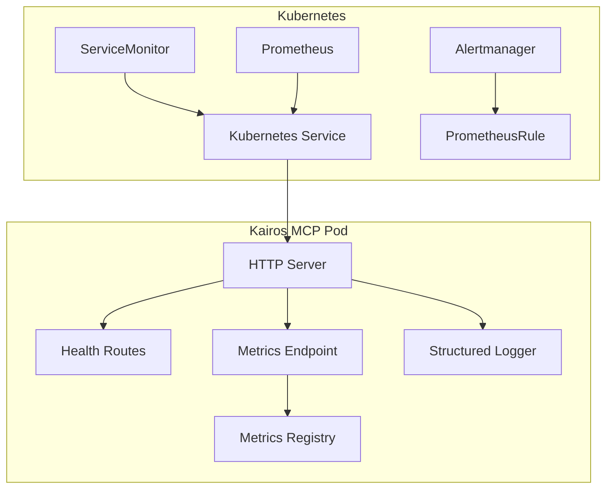
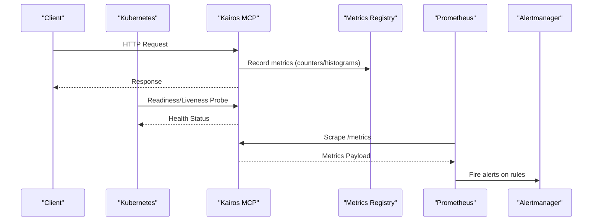
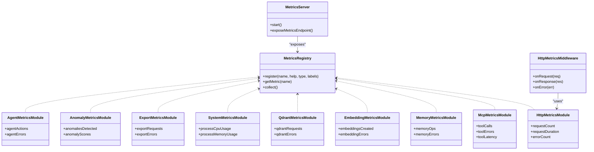
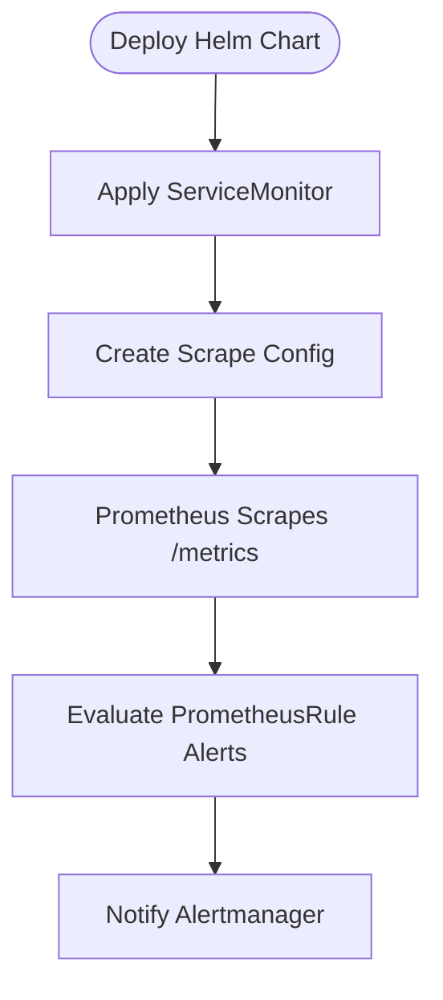
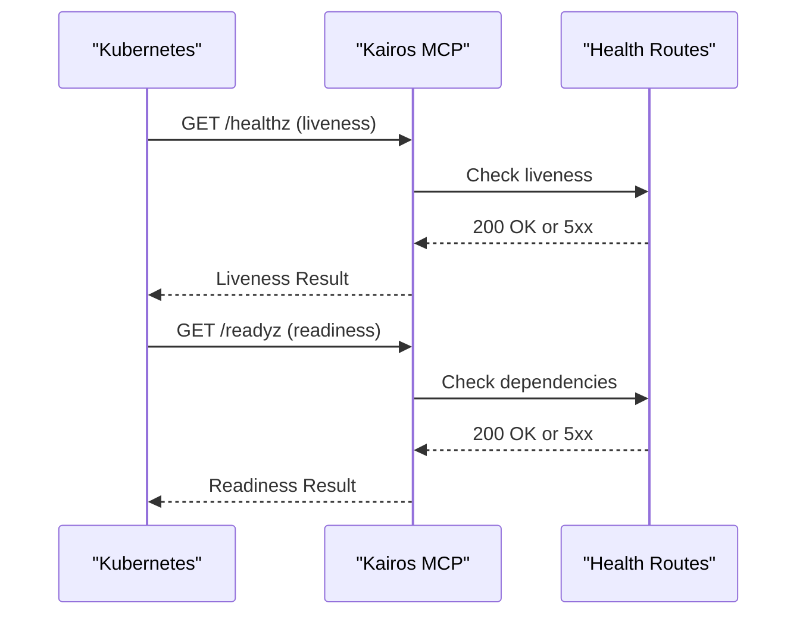
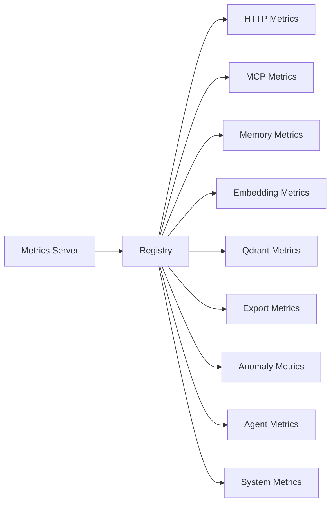

# Monitoring and Observability

<cite>
**Referenced Files in This Document**
- [http-health-routes.ts](file://src/http/http-health-routes.ts)
- [http-metrics-middleware.ts](file://src/http/http-metrics-middleware.ts)
- [metrics-server.ts](file://src/metrics-server.ts)
- [services/metrics/registry.ts](file://src/services/metrics/registry.ts)
- [services/metrics/http-metrics.ts](file://src/services/metrics/http-metrics.ts)
- [services/metrics/mcp-metrics.ts](file://src/services/metrics/mcp-metrics.ts)
- [services/metrics/memory-metrics.ts](file://src/services/metrics/memory-metrics.ts)
- [services/metrics/embedding-metrics.ts](file://src/services/metrics/embedding-metrics.ts)
- [services/metrics/qdrant-metrics.ts](file://src/services/metrics/qdrant-metrics.ts)
- [services/metrics/system-metrics.ts](file://src/services/metrics/system-metrics.ts)
- [services/metrics/export-metrics.ts](file://src/services/metrics/export-metrics.ts)
- [services/metrics/anomaly-metrics.ts](file://src/services/metrics/anomaly-metrics.ts)
- [services/metrics/agent-metrics.ts](file://src/services/metrics/agent-metrics.ts)
- [helm/kairos-mcp/templates/app-servicemonitor.yaml](file://helm/kairos-mcp/templates/app-servicemonitor.yaml)
- [helm/kairos-mcp/templates/prometheusrule.yaml](file://helm/kairos-mcp/templates/prometheusrule.yaml)
- [utils/structured-logger.ts](file://src/utils/structured-logger.ts)
- [utils/log-core.ts](file://src/utils/log-core.ts)
- [tests/integration/prometheus-scrape.test.ts](file://tests/integration/prometheus-scrape.test.ts)
- [tests/integration/metrics-endpoint.test.ts](file://tests/integration/metrics-endpoint.test.ts)
- [tests/integration/metrics-operational.test.ts](file://tests/integration/metrics-operational.test.ts)
</cite>

## Table of Contents
1. [Introduction](#introduction)
2. [Project Structure](#project-structure)
3. [Core Components](#core-components)
4. [Architecture Overview](#architecture-overview)
5. [Detailed Component Analysis](#detailed-component-analysis)
6. [Dependency Analysis](#dependency-analysis)
7. [Performance Considerations](#performance-considerations)
8. [Troubleshooting Guide](#troubleshooting-guide)
9. [Conclusion](#conclusion)
10. [Appendices](#appendices)

## Introduction
This document provides comprehensive monitoring and observability guidance for Kairos MCP. It covers Prometheus metrics collection, ServiceMonitor configuration, alerting rules, logging aggregation strategies, structured logging formats, log retention policies, health check endpoints, readiness/liveness probes, performance monitoring, Grafana dashboard creation, and troubleshooting workflows using collected metrics and logs.

## Project Structure
Kairos MCP exposes metrics via an HTTP endpoint and integrates with Prometheus through Kubernetes ServiceMonitors. Health checks are provided as dedicated routes. Logging is centralized through a structured logger that can be aggregated by external systems.

**Diagram sources**
- [http-health-routes.ts](file://src/http/http-health-routes.ts)
- [http-metrics-middleware.ts](file://src/http/http-metrics-middleware.ts)
- [metrics-server.ts](file://src/metrics-server.ts)
- [services/metrics/registry.ts](file://src/services/metrics/registry.ts)
- [utils/structured-logger.ts](file://src/utils/structured-logger.ts)
- [helm/kairos-mcp/templates/app-servicemonitor.yaml](file://helm/kairos-mcp/templates/app-servicemonitor.yaml)
- [helm/kairos-mcp/templates/prometheusrule.yaml](file://helm/kairos-mcp/templates/prometheusrule.yaml)

**Section sources**
- [http-health-routes.ts](file://src/http/http-health-routes.ts)
- [http-metrics-middleware.ts](file://src/http/http-metrics-middleware.ts)
- [metrics-server.ts](file://src/metrics-server.ts)
- [services/metrics/registry.ts](file://src/services/metrics/registry.ts)
- [utils/structured-logger.ts](file://src/utils/structured-logger.ts)
- [helm/kairos-mcp/templates/app-servicemonitor.yaml](file://helm/kairos-mcp/templates/app-servicemonitor.yaml)
- [helm/kairos-mcp/templates/prometheusrule.yaml](file://helm/kairos-mcp/templates/prometheusrule.yaml)

## Core Components
- Metrics registry: Central registry to collect and expose application metrics.
- HTTP metrics middleware: Instruments HTTP requests (latency, status codes, throughput).
- Domain-specific metrics modules: MCP operations, memory/Qdrant interactions, embeddings, exports, anomalies, agents, and system-level counters.
- Metrics server: Exposes the /metrics endpoint for Prometheus scraping.
- Health routes: Provide liveness/readiness semantics for orchestration.
- Structured logger: Produces JSON logs with consistent fields for aggregation.

Key responsibilities:
- Collect counters, histograms, and gauges across components.
- Instrument request lifecycle and business flows.
- Surface standardized metrics for Prometheus.
- Provide health endpoints for Kubernetes probes.
- Emit structured logs for centralized ingestion.

**Section sources**
- [services/metrics/registry.ts](file://src/services/metrics/registry.ts)
- [http-metrics-middleware.ts](file://src/http/http-metrics-middleware.ts)
- [services/metrics/http-metrics.ts](file://src/services/metrics/http-metrics.ts)
- [services/metrics/mcp-metrics.ts](file://src/services/metrics/mcp-metrics.ts)
- [services/metrics/memory-metrics.ts](file://src/services/metrics/memory-metrics.ts)
- [services/metrics/embedding-metrics.ts](file://src/services/metrics/embedding-metrics.ts)
- [services/metrics/qdrant-metrics.ts](file://src/services/metrics/qdrant-metrics.ts)
- [services/metrics/system-metrics.ts](file://src/services/metrics/system-metrics.ts)
- [services/metrics/export-metrics.ts](file://src/services/metrics/export-metrics.ts)
- [services/metrics/anomaly-metrics.ts](file://src/services/metrics/anomaly-metrics.ts)
- [services/metrics/agent-metrics.ts](file://src/services/metrics/agent-metrics.ts)
- [metrics-server.ts](file://src/metrics-server.ts)
- [http-health-routes.ts](file://src/http/http-health-routes.ts)
- [utils/structured-logger.ts](file://src/utils/structured-logger.ts)

## Architecture Overview
The observability architecture integrates Prometheus scraping, alerting, and dashboards with Kairos MCP’s internal metrics and logging subsystems.

**Diagram sources**
- [http-health-routes.ts](file://src/http/http-health-routes.ts)
- [http-metrics-middleware.ts](file://src/http/http-metrics-middleware.ts)
- [metrics-server.ts](file://src/metrics-server.ts)
- [services/metrics/registry.ts](file://src/services/metrics/registry.ts)
- [helm/kairos-mcp/templates/app-servicemonitor.yaml](file://helm/kairos-mcp/templates/app-servicemonitor.yaml)
- [helm/kairos-mcp/templates/prometheusrule.yaml](file://helm/kairos-mcp/templates/prometheusrule.yaml)

## Detailed Component Analysis

### Metrics Collection and Exposure
- Registry: Provides a central place to define and access metrics types and instances.
- HTTP middleware: Wraps request handling to record latency, status, and method labels.
- Domain modules: Add specific metrics for MCP tools, memory/Qdrant operations, embedding providers, export flows, anomaly detection, agent activity, and system stats.
- Metrics server: Serves the /metrics endpoint consumed by Prometheus.

**Diagram sources**
- [services/metrics/registry.ts](file://src/services/metrics/registry.ts)
- [http-metrics-middleware.ts](file://src/http/http-metrics-middleware.ts)
- [services/metrics/http-metrics.ts](file://src/services/metrics/http-metrics.ts)
- [services/metrics/mcp-metrics.ts](file://src/services/metrics/mcp-metrics.ts)
- [services/metrics/memory-metrics.ts](file://src/services/metrics/memory-metrics.ts)
- [services/metrics/embedding-metrics.ts](file://src/services/metrics/embedding-metrics.ts)
- [services/metrics/qdrant-metrics.ts](file://src/services/metrics/qdrant-metrics.ts)
- [services/metrics/system-metrics.ts](file://src/services/metrics/system-metrics.ts)
- [services/metrics/export-metrics.ts](file://src/services/metrics/export-metrics.ts)
- [services/metrics/anomaly-metrics.ts](file://src/services/metrics/anomaly-metrics.ts)
- [services/metrics/agent-metrics.ts](file://src/services/metrics/agent-metrics.ts)
- [metrics-server.ts](file://src/metrics-server.ts)

**Section sources**
- [services/metrics/registry.ts](file://src/services/metrics/registry.ts)
- [http-metrics-middleware.ts](file://src/http/http-metrics-middleware.ts)
- [services/metrics/http-metrics.ts](file://src/services/metrics/http-metrics.ts)
- [services/metrics/mcp-metrics.ts](file://src/services/metrics/mcp-metrics.ts)
- [services/metrics/memory-metrics.ts](file://src/services/metrics/memory-metrics.ts)
- [services/metrics/embedding-metrics.ts](file://src/services/metrics/embedding-metrics.ts)
- [services/metrics/qdrant-metrics.ts](file://src/services/metrics/qdrant-metrics.ts)
- [services/metrics/system-metrics.ts](file://src/services/metrics/system-metrics.ts)
- [services/metrics/export-metrics.ts](file://src/services/metrics/export-metrics.ts)
- [services/metrics/anomaly-metrics.ts](file://src/services/metrics/anomaly-metrics.ts)
- [services/metrics/agent-metrics.ts](file://src/services/metrics/agent-metrics.ts)
- [metrics-server.ts](file://src/metrics-server.ts)

### Prometheus Integration
- ServiceMonitor: Declares how Prometheus scrapes the Kairos MCP service.
- PrometheusRule: Defines alerting rules based on exposed metrics.

**Diagram sources**
- [helm/kairos-mcp/templates/app-servicemonitor.yaml](file://helm/kairos-mcp/templates/app-servicemonitor.yaml)
- [helm/kairos-mcp/templates/prometheusrule.yaml](file://helm/kairos-mcp/templates/prometheusrule.yaml)
- [metrics-server.ts](file://src/metrics-server.ts)

**Section sources**
- [helm/kairos-mcp/templates/app-servicemonitor.yaml](file://helm/kairos-mcp/templates/app-servicemonitor.yaml)
- [helm/kairos-mcp/templates/prometheusrule.yaml](file://helm/kairos-mcp/templates/prometheusrule.yaml)
- [tests/integration/prometheus-scrape.test.ts](file://tests/integration/prometheus-scrape.test.ts)

### Health Checks and Probes
- Health routes provide endpoints suitable for readiness and liveness probes.
- These should return appropriate HTTP statuses to signal pod state to Kubernetes.

**Diagram sources**
- [http-health-routes.ts](file://src/http/http-health-routes.ts)

**Section sources**
- [http-health-routes.ts](file://src/http/http-health-routes.ts)

### Logging Aggregation and Retention
- Structured logger emits JSON-formatted logs with consistent fields for correlation and filtering.
- Recommended aggregation strategy:
  - Sidecar or DaemonSet-based collectors (e.g., Fluent Bit, Vector) tail container stdout/stderr.
  - Ship logs to a centralized store (e.g., Loki, Elasticsearch).
- Retention policy recommendations:
  - Hot storage (short-term): 7–14 days for high-cardinality operational logs.
  - Cold storage (long-term): 30–90 days for compliance and audit trails.
  - Apply index/time-based partitioning and TTL policies at the storage layer.

Best practices:
- Include trace IDs, tenant context, and operation identifiers in log lines.
- Avoid sensitive data in logs; sanitize before emission.
- Use log levels consistently (debug, info, warn, error).

**Section sources**
- [utils/structured-logger.ts](file://src/utils/structured-logger.ts)
- [utils/log-core.ts](file://src/utils/log-core.ts)

### Performance Monitoring
- HTTP latency histograms and error rates via HTTP metrics module.
- Business KPIs:
  - MCP tool call counts, errors, and latencies.
  - Memory/Qdrant operation success/failure and durations.
  - Embedding creation counts and errors.
  - Export request volume and failure rates.
  - Anomaly detection events and scores.
  - Agent action counters and error rates.
  - System resource usage (CPU, memory).

Operational tips:
- Set histogram buckets appropriate for expected latency ranges.
- Label metrics with stable dimensions (method, path, tool name, space) to avoid cardinality explosion.
- Monitor p95/p99 latency and error budgets.

**Section sources**
- [services/metrics/http-metrics.ts](file://src/services/metrics/http-metrics.ts)
- [services/metrics/mcp-metrics.ts](file://src/services/metrics/mcp-metrics.ts)
- [services/metrics/memory-metrics.ts](file://src/services/metrics/memory-metrics.ts)
- [services/metrics/embedding-metrics.ts](file://src/services/metrics/embedding-metrics.ts)
- [services/metrics/qdrant-metrics.ts](file://src/services/metrics/qdrant-metrics.ts)
- [services/metrics/export-metrics.ts](file://src/services/metrics/export-metrics.ts)
- [services/metrics/anomaly-metrics.ts](file://src/services/metrics/anomaly-metrics.ts)
- [services/metrics/agent-metrics.ts](file://src/services/metrics/agent-metrics.ts)
- [services/metrics/system-metrics.ts](file://src/services/metrics/system-metrics.ts)

## Dependency Analysis
The following diagram shows key relationships between metrics modules and the registry/server.

**Diagram sources**
- [services/metrics/registry.ts](file://src/services/metrics/registry.ts)
- [services/metrics/http-metrics.ts](file://src/services/metrics/http-metrics.ts)
- [services/metrics/mcp-metrics.ts](file://src/services/metrics/mcp-metrics.ts)
- [services/metrics/memory-metrics.ts](file://src/services/metrics/memory-metrics.ts)
- [services/metrics/embedding-metrics.ts](file://src/services/metrics/embedding-metrics.ts)
- [services/metrics/qdrant-metrics.ts](file://src/services/metrics/qdrant-metrics.ts)
- [services/metrics/export-metrics.ts](file://src/services/metrics/export-metrics.ts)
- [services/metrics/anomaly-metrics.ts](file://src/services/metrics/anomaly-metrics.ts)
- [services/metrics/agent-metrics.ts](file://src/services/metrics/agent-metrics.ts)
- [services/metrics/system-metrics.ts](file://src/services/metrics/system-metrics.ts)
- [metrics-server.ts](file://src/metrics-server.ts)

**Section sources**
- [services/metrics/registry.ts](file://src/services/metrics/registry.ts)
- [metrics-server.ts](file://src/metrics-server.ts)

## Performance Considerations
- Prefer counters and histograms over frequent gauge updates where possible.
- Keep label cardinality bounded; avoid per-request dynamic labels.
- Batch metric increments when processing large payloads.
- Ensure histogram buckets align with SLI targets (e.g., p95 latency).
- Separate long-running background tasks from hot paths to reduce latency variance.
- Monitor process CPU and memory usage to detect leaks or saturation.

[No sources needed since this section provides general guidance]

## Troubleshooting Guide
Common issues and remediation steps:

- Prometheus cannot scrape /metrics:
  - Verify ServiceMonitor targetPort and path.
  - Confirm network policies allow Prometheus to reach the service.
  - Validate metrics endpoint availability via integration tests.

- Missing or incomplete metrics:
  - Ensure all domain modules register metrics with the registry.
  - Check middleware instrumentation is applied to routes.
  - Review unit and integration tests for coverage.

- High error rates or latency spikes:
  - Inspect HTTP metrics for status code distribution and latency percentiles.
  - Correlate with MCP tool errors and Qdrant operation failures.
  - Review system metrics for resource constraints.

- Health probe failures:
  - Check liveness/readiness route responses.
  - Validate dependency health (e.g., Qdrant, Redis) within readiness checks.

- Log gaps or unstructured entries:
  - Confirm structured logger initialization and output format.
  - Ensure sidecar collectors are running and shipping logs.

Useful references:
- Prometheus scrape behavior and validation.
- Metrics endpoint behavior under load.
- Operational metrics coverage.

**Section sources**
- [tests/integration/prometheus-scrape.test.ts](file://tests/integration/prometheus-scrape.test.ts)
- [tests/integration/metrics-endpoint.test.ts](file://tests/integration/metrics-endpoint.test.ts)
- [tests/integration/metrics-operational.test.ts](file://tests/integration/metrics-operational.test.ts)
- [http-health-routes.ts](file://src/http/http-health-routes.ts)
- [utils/structured-logger.ts](file://src/utils/structured-logger.ts)

## Conclusion
Kairos MCP provides robust observability through a centralized metrics registry, HTTP instrumentation, domain-specific metrics, and health endpoints. Integrated with Prometheus via ServiceMonitor and PrometheusRule, it supports alerting and dashboarding. Structured logging enables effective log aggregation and analysis. Following the recommended practices ensures reliable monitoring, fast troubleshooting, and informed capacity planning.

[No sources needed since this section summarizes without analyzing specific files]

## Appendices

### Grafana Dashboard Creation
- Data source: Configure Prometheus as a data source pointing to your cluster’s Prometheus service.
- Panels:
  - HTTP Requests: Rate and latency by method/path.
  - MCP Tools: Calls, errors, and latency distributions.
  - Memory/Qdrant: Operation success/error rates and durations.
  - Embeddings: Created count and error rate.
  - Exports: Volume and failure rate.
  - Anomalies: Detection events and score trends.
  - Agents: Actions and errors.
  - System: CPU and memory usage.
- Alerts:
  - Define thresholds for error rates, latency percentiles, and resource usage using PrometheusRule definitions.
  - Route alerts to Alertmanager channels (email, Slack, PagerDuty).

[No sources needed since this section provides general guidance]