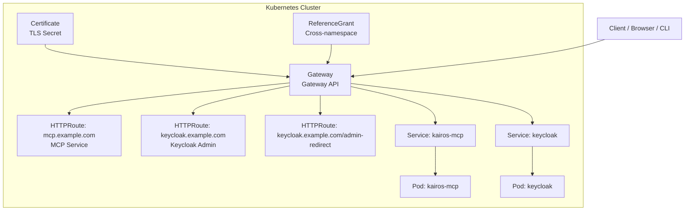
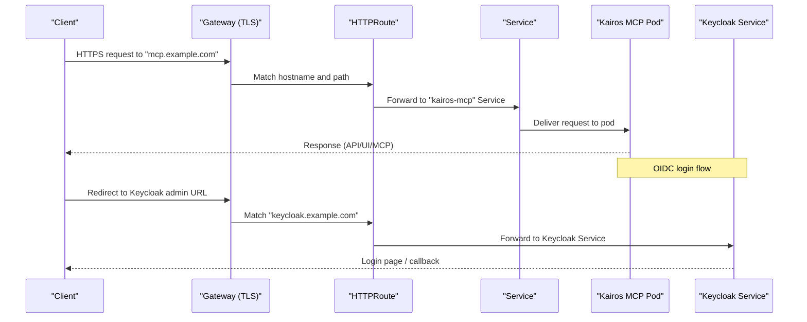
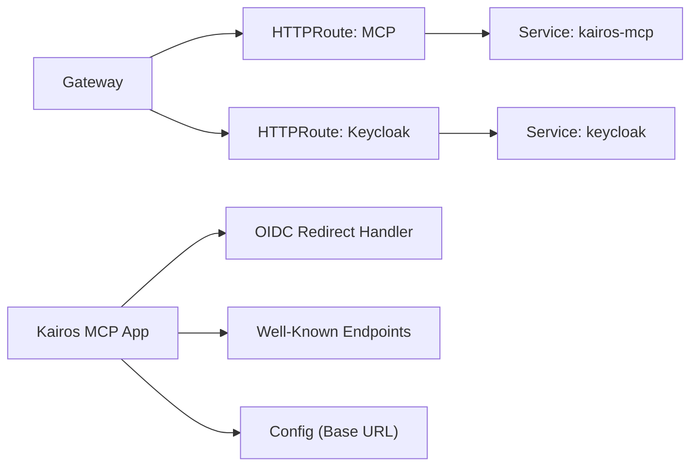

# Networking and Ingress Setup

<cite>
**Referenced Files in This Document**
- [helm/kairos-mcp/templates/gateway.yaml](file://helm/kairos-mcp/templates/gateway.yaml)
- [helm/kairos-mcp/templates/httproute-mcp.yaml](file://helm/kairos-mcp/templates/httproute-mcp.yaml)
- [helm/kairos-mcp/templates/httproute-keycloak.yaml](file://helm/kairos-mcp/templates/httproute-keycloak.yaml)
- [helm/kairos-mcp/templates/httproute-keycloak-admin-redirect.yaml](file://helm/kairos-mcp/templates/httproute-keycloak-admin-redirect.yaml)
- [helm/kairos-mcp/templates/gateway-certificate.yaml](file://helm/kairos-mcp/templates/gateway-certificate.yaml)
- [helm/kairos-mcp/templates/gateway-referencegrant-keycloak.yaml](file://helm/kairos-mcp/templates/gateway-referencegrant-keycloak.yaml)
- [helm/kairos-mcp/values.yaml](file://helm/kairos-mcp/values.yaml)
- [helm/kairos-mcp/Chart.yaml](file://helm/kairos-mcp/Chart.yaml)
- [helm/infrastructure/gatewayclass-ngrok.yaml](file://helm/infrastructure/gatewayclass-ngrok.yaml)
- [helm/infrastructure/catalogsource-ngrok.yaml](file://helm/infrastructure/catalogsource-ngrok.yaml)
- [src/http/http-server-config.ts](file://src/http/http-server-config.ts)
- [src/http/http-auth-oidc-redirect.ts](file://src/http/http-auth-oidc-redirect.ts)
- [src/http/http-client-registration-proxy.ts](file://src/http/http-client-registration-proxy.ts)
- [src/http/http-well-known.ts](file://src/http/http-well-known.ts)
- [src/config.ts](file://src/config.ts)
</cite>

## Table of Contents
1. [Introduction](#introduction)
2. [Project Structure](#project-structure)
3. [Core Components](#core-components)
4. [Architecture Overview](#architecture-overview)
5. [Detailed Component Analysis](#detailed-component-analysis)
6. [Dependency Analysis](#dependency-analysis)
7. [Performance Considerations](#performance-considerations)
8. [Troubleshooting Guide](#troubleshooting-guide)
9. [Conclusion](#conclusion)
10. [Appendices](#appendices)

## Introduction
This document explains how to configure networking and ingress for Kairos MCP deployments using Kubernetes Gateway API, HTTPRoute resources, and TLS certificate management. It covers SSL/TLS termination, domain routing, multi-tenant considerations, Keycloak integration routes, exposure of the MCP service, and internal communication patterns. It also provides guidance for different ingress controllers (NGINX, Traefik, Contour) and cloud provider load balancers.

## Project Structure
The networking configuration is primarily defined in Helm templates under helm/kairos-mcp/templates and values files. The application exposes HTTP endpoints and integrates with Keycloak via OIDC. Internal services include PostgreSQL, Redis, Qdrant, and Ollama.

**Diagram sources**
- [helm/kairos-mcp/templates/gateway.yaml](file://helm/kairos-mcp/templates/gateway.yaml)
- [helm/kairos-mcp/templates/httproute-mcp.yaml](file://helm/kairos-mcp/templates/httproute-mcp.yaml)
- [helm/kairos-mcp/templates/httproute-keycloak.yaml](file://helm/kairos-mcp/templates/httproute-keycloak.yaml)
- [helm/kairos-mcp/templates/httproute-keycloak-admin-redirect.yaml](file://helm/kairos-mcp/templates/httproute-keycloak-admin-redirect.yaml)
- [helm/kairos-mcp/templates/gateway-certificate.yaml](file://helm/kairos-mcp/templates/gateway-certificate.yaml)
- [helm/kairos-mcp/templates/gateway-referencegrant-keycloak.yaml](file://helm/kairos-mcp/templates/gateway-referencegrant-keycloak.yaml)

**Section sources**
- [helm/kairos-mcp/templates/gateway.yaml](file://helm/kairos-mcp/templates/gateway.yaml)
- [helm/kairos-mcp/templates/httproute-mcp.yaml](file://helm/kairos-mcp/templates/httproute-mcp.yaml)
- [helm/kairos-mcp/templates/httproute-keycloak.yaml](file://helm/kairos-mcp/templates/httproute-keycloak.yaml)
- [helm/kairos-mcp/templates/httproute-keycloak-admin-redirect.yaml](file://helm/kairos-mcp/templates/httproute-keycloak-admin-redirect.yaml)
- [helm/kairos-mcp/templates/gateway-certificate.yaml](file://helm/kairos-mcp/templates/gateway-certificate.yaml)
- [helm/kairos-mcp/templates/gateway-referencegrant-keycloak.yaml](file://helm/kairos-mcp/templates/gateway-referencegrant-keycloak.yaml)

## Core Components
- Gateway API Gateway: Defines the entry point for external traffic and binds a TLS certificate.
- HTTPRoutes: Route hostnames to backend Services (MCP and Keycloak).
- TLS Certificate: Manages certificates referenced by the Gateway.
- ReferenceGrant: Allows cross-namespace references from Gateway to Keycloak Service.
- Application HTTP Server: Configures base URLs, OIDC redirect URIs, and well-known endpoints.

Key responsibilities:
- Terminate TLS at the Gateway.
- Perform hostname-based routing to MCP and Keycloak.
- Ensure secure redirects and consistent base URLs for OIDC flows.
- Expose health and well-known endpoints for monitoring and discovery.

**Section sources**
- [helm/kairos-mcp/templates/gateway.yaml](file://helm/kairos-mcp/templates/gateway.yaml)
- [helm/kairos-mcp/templates/httproute-mcp.yaml](file://helm/kairos-mcp/templates/httproute-mcp.yaml)
- [helm/kairos-mcp/templates/httproute-keycloak.yaml](file://helm/kairos-mcp/templates/httproute-keycloak.yaml)
- [helm/kairos-mcp/templates/httproute-keycloak-admin-redirect.yaml](file://helm/kairos-mcp/templates/httproute-keycloak-admin-redirect.yaml)
- [helm/kairos-mcp/templates/gateway-certificate.yaml](file://helm/kairos-mcp/templates/gateway-certificate.yaml)
- [helm/kairos-mcp/templates/gateway-referencegrant-keycloak.yaml](file://helm/kairos-mcp/templates/gateway-referencegrant-keycloak.yaml)
- [src/http/http-server-config.ts](file://src/http/http-server-config.ts)
- [src/http/http-auth-oidc-redirect.ts](file://src/http/http-auth-oidc-redirect.ts)
- [src/http/http-client-registration-proxy.ts](file://src/http/http-client-registration-proxy.ts)
- [src/http/http-well-known.ts](file://src/http/http-well-known.ts)
- [src/config.ts](file://src/config.ts)

## Architecture Overview
The following diagram shows the end-to-end flow from client to application and Keycloak, including TLS termination and route resolution.

**Diagram sources**
- [helm/kairos-mcp/templates/gateway.yaml](file://helm/kairos-mcp/templates/gateway.yaml)
- [helm/kairos-mcp/templates/httproute-mcp.yaml](file://helm/kairos-mcp/templates/httproute-mcp.yaml)
- [helm/kairos-mcp/templates/httproute-keycloak.yaml](file://helm/kairos-mcp/templates/httproute-keycloak.yaml)
- [helm/kairos-mcp/templates/httproute-keycloak-admin-redirect.yaml](file://helm/kairos-mcp/templates/httproute-keycloak-admin-redirect.yaml)

## Detailed Component Analysis

### Gateway API Gateway and TLS
- A Gateway resource defines listeners for HTTP(S) and binds a TLS certificate secret.
- The certificate is provisioned or managed externally and mounted as a Secret referenced by the Gateway.
- For development, an ngrok GatewayClass may be used to expose routes without a full cluster ingress controller.

Operational notes:
- Ensure the certificate Secret exists before applying the Gateway.
- Validate that the GatewayClass matches your controller (e.g., NGINX, Contour, Traefik).
- Confirm listener ports and protocol settings align with your controller’s capabilities.

**Section sources**
- [helm/kairos-mcp/templates/gateway.yaml](file://helm/kairos-mcp/templates/gateway.yaml)
- [helm/kairos-mcp/templates/gateway-certificate.yaml](file://helm/kairos-mcp/templates/gateway-certificate.yaml)
- [helm/infrastructure/gatewayclass-ngrok.yaml](file://helm/infrastructure/gatewayclass-ngrok.yaml)
- [helm/infrastructure/catalogsource-ngrok.yaml](file://helm/infrastructure/catalogsource-ngrok.yaml)

### HTTPRoute Definitions
- HTTPRoute for MCP: Routes hostnames like mcp.example.com to the kairos-mcp Service.
- HTTPRoute for Keycloak: Routes keycloak.example.com to the Keycloak Service.
- HTTPRoute for Keycloak admin redirect: Ensures admin redirect paths are correctly routed.

Routing best practices:
- Use explicit hostnames per environment to avoid conflicts.
- Keep path prefixes clear and consistent across environments.
- Apply appropriate timeouts and retries if supported by your controller.

**Section sources**
- [helm/kairos-mcp/templates/httproute-mcp.yaml](file://helm/kairos-mcp/templates/httproute-mcp.yaml)
- [helm/kairos-mcp/templates/httproute-keycloak.yaml](file://helm/kairos-mcp/templates/httproute-keycloak.yaml)
- [helm/kairos-mcp/templates/httproute-keycloak-admin-redirect.yaml](file://helm/kairos-mcp/templates/httproute-keycloak-admin-redirect.yaml)

### TLS Certificate Management
- Certificates are referenced by the Gateway via a Secret.
- You can use cert-manager or an external CA to provision certs and store them as Secrets.
- Ensure the certificate includes all required SANs for your domains.

Validation checklist:
- Secret name and namespace match the Gateway reference.
- Certificate validity and expiration are monitored.
- Controller supports the selected TLS configuration.

**Section sources**
- [helm/kairos-mcp/templates/gateway-certificate.yaml](file://helm/kairos-mcp/templates/gateway-certificate.yaml)
- [helm/kairos-mcp/templates/gateway.yaml](file://helm/kairos-mcp/templates/gateway.yaml)

### Cross-Namespace References (ReferenceGrant)
- When Keycloak resides in a different namespace than the Gateway, a ReferenceGrant allows the Gateway to reference the Keycloak Service.
- Configure the grant to allow the specific Service and Port.

Security considerations:
- Limit grants to the minimum required scope.
- Avoid granting broad access across namespaces.

**Section sources**
- [helm/kairos-mcp/templates/gateway-referencegrant-keycloak.yaml](file://helm/kairos-mcp/templates/gateway-referencegrant-keycloak.yaml)

### Application HTTP Configuration and OIDC Integration
- Base URL configuration ensures correct absolute URLs for UI and API.
- OIDC redirect URIs must match the configured Keycloak client settings.
- Well-known endpoints support discovery and health checks.

Configuration alignment:
- Set base URL to the public-facing HTTPS domain.
- Ensure OIDC redirect URIs include the exact path expected by the app.
- Verify client registration proxy behavior if dynamic client registration is enabled.

**Section sources**
- [src/http/http-server-config.ts](file://src/http/http-server-config.ts)
- [src/http/http-auth-oidc-redirect.ts](file://src/http/http-auth-oidc-redirect.ts)
- [src/http/http-client-registration-proxy.ts](file://src/http/http-client-registration-proxy.ts)
- [src/http/http-well-known.ts](file://src/http/http-well-known.ts)
- [src/config.ts](file://src/config.ts)

### Multi-Tenant Routing Patterns
- Use distinct hostnames per tenant (e.g., tenantA.mcp.example.com) with separate HTTPRoutes.
- Alternatively, route by path prefix (e.g., /tenantA/) when single-host routing is preferred.
- Combine with Keycloak realms or clients scoped per tenant for isolation.

Operational tips:
- Maintain consistent naming conventions for hostnames and routes.
- Centralize certificate management to cover wildcard or multi-domain scenarios.
- Monitor per-tenant metrics and logs for observability.

[No sources needed since this section provides general guidance]

### Ingress Controller Examples

#### NGINX Ingress Controller
- If not using Gateway API, map hostnames to Services via Ingress resources.
- Enable TLS by referencing Secrets containing certificates.
- Configure annotations for upstream headers and timeouts as needed.

[No sources needed since this section provides general guidance]

#### Traefik Ingress Controller
- Use Traefik CRDs (IngressRoute) or standard Ingress resources.
- Attach TLS stores and middlewares for advanced routing and security.
- Ensure redirect behaviors align with OIDC requirements.

[No sources needed since this section provides general guidance]

#### Contour Ingress Controller
- Map hostnames to Services using Ingress or Contour-specific resources.
- Manage TLS secrets and ensure proper certificate propagation.
- Validate path-based routing if multiple tenants share a hostname.

[No sources needed since this section provides general guidance]

#### Cloud Provider Load Balancers
- Use managed load balancers (AWS ALB/NLB, GCP LB, Azure LB) with TLS termination.
- Integrate with DNS providers for automated certificate provisioning (e.g., cert-manager).
- Align health check paths with application health endpoints.

[No sources needed since this section provides general guidance]

## Dependency Analysis
The following diagram illustrates dependencies between networking components and application modules.

**Diagram sources**
- [helm/kairos-mcp/templates/gateway.yaml](file://helm/kairos-mcp/templates/gateway.yaml)
- [helm/kairos-mcp/templates/httproute-mcp.yaml](file://helm/kairos-mcp/templates/httproute-mcp.yaml)
- [helm/kairos-mcp/templates/httproute-keycloak.yaml](file://helm/kairos-mcp/templates/httproute-keycloak.yaml)
- [src/http/http-auth-oidc-redirect.ts](file://src/http/http-auth-oidc-redirect.ts)
- [src/http/http-well-known.ts](file://src/http/http-well-known.ts)
- [src/http/http-server-config.ts](file://src/http/http-server-config.ts)
- [src/config.ts](file://src/config.ts)

**Section sources**
- [helm/kairos-mcp/templates/gateway.yaml](file://helm/kairos-mcp/templates/gateway.yaml)
- [helm/kairos-mcp/templates/httproute-mcp.yaml](file://helm/kairos-mcp/templates/httproute-mcp.yaml)
- [helm/kairos-mcp/templates/httproute-keycloak.yaml](file://helm/kairos-mcp/templates/httproute-keycloak.yaml)
- [src/http/http-auth-oidc-redirect.ts](file://src/http/http-auth-oidc-redirect.ts)
- [src/http/http-well-known.ts](file://src/http/http-well-known.ts)
- [src/http/http-server-config.ts](file://src/http/http-server-config.ts)
- [src/config.ts](file://src/config.ts)

## Performance Considerations
- Prefer connection pooling and keep-alive at the ingress layer.
- Tune timeouts and retries based on expected request durations.
- Use horizontal scaling for pods behind Services and adjust HPA policies.
- Monitor latency and error rates per route and service.

[No sources needed since this section provides general guidance]

## Troubleshooting Guide
Common issues and resolutions:
- TLS handshake failures: Verify certificate Secret contents and SANs; ensure Gateway references the correct Secret.
- Route not matching: Check HTTPRoute hostnames and paths; confirm GatewayClass and controller status.
- OIDC redirect errors: Align base URL and redirect URI with Keycloak client configuration.
- Cross-namespace routing errors: Ensure ReferenceGrant exists and permits the target Service and Port.
- Health endpoint unreachable: Validate well-known and health routes are exposed and accessible.

**Section sources**
- [helm/kairos-mcp/templates/gateway.yaml](file://helm/kairos-mcp/templates/gateway.yaml)
- [helm/kairos-mcp/templates/httproute-mcp.yaml](file://helm/kairos-mcp/templates/httproute-mcp.yaml)
- [helm/kairos-mcp/templates/httproute-keycloak.yaml](file://helm/kairos-mcp/templates/httproute-keycloak.yaml)
- [helm/kairos-mcp/templates/gateway-referencegrant-keycloak.yaml](file://helm/kairos-mcp/templates/gateway-referencegrant-keycloak.yaml)
- [src/http/http-auth-oidc-redirect.ts](file://src/http/http-auth-oidc-redirect.ts)
- [src/http/http-well-known.ts](file://src/http/http-well-known.ts)

## Conclusion
By leveraging Kubernetes Gateway API, HTTPRoute definitions, and robust TLS management, you can securely expose Kairos MCP and integrate it with Keycloak. Consistent base URL configuration and careful OIDC setup ensure reliable authentication flows. For non-Gateway environments, equivalent configurations exist for NGINX, Traefik, Contour, and cloud load balancers.

[No sources needed since this section summarizes without analyzing specific files]

## Appendices

### Values and Chart Metadata
- Chart metadata and default values influence networking parameters such as hostnames, TLS enablement, and service exposure.

**Section sources**
- [helm/kairos-mcp/Chart.yaml](file://helm/kairos-mcp/Chart.yaml)
- [helm/kairos-mcp/values.yaml](file://helm/kairos-mcp/values.yaml)