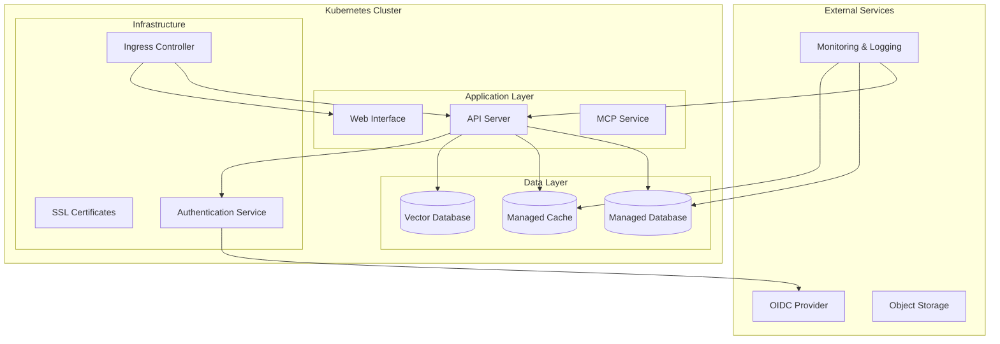
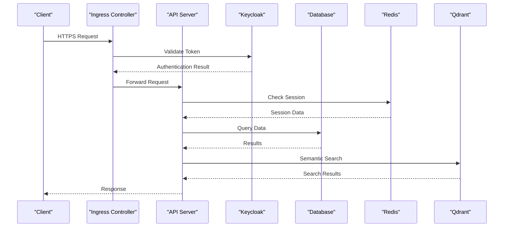

# Platform-Specific Deployments

<cite>
**Referenced Files in This Document**
- [helm/README.md](file://helm/README.md)
- [helm/kairos-mcp/values.yaml](file://helm/kairos-mcp/values.yaml)
- [helm/kairos-mcp/Chart.yaml](file://helm/kairos-mcp/Chart.yaml)
- [helm/values.prod.yaml](file://helm/values.prod.yaml)
- [helm/values.dev.yaml](file://helm/values.dev.yaml)
- [helm/kairos-mcp/templates/app-hpa.yaml](file://helm/kairos-mcp/templates/app-hpa.yaml)
- [helm/kairos-mcp/templates/qdrant-hpa.yaml](file://helm/kairos-mcp/templates/qdrant-hpa.yaml)
- [helm/kairos-mcp/templates/postgres-cluster-cr.yaml](file://helm/kairos-mcp/templates/postgres-cluster-cr.yaml)
- [helm/kairos-mcp/templates/redis-failover-cr.yaml](file://helm/kairos-mcp/templates/redis-failover-cr.yaml)
- [helm/kairos-mcp/templates/kairos-mcp-deployment.yaml](file://helm/kairos-mcp/templates/kairos-mcp-deployment.yaml)
- [helm/kairos-mcp/templates/gateway.yaml](file://helm/kairos-mcp/templates/gateway.yaml)
- [helm/kairos-mcp/templates/gateway-certificate.yaml](file://helm/kairos-mcp/templates/gateway-certificate.yaml)
- [helm/operators/subscription-keycloak-operator.yaml](file://helm/operators/subscription-keycloak-operator.yaml)
- [helm/operators/subscription-percona-postgresql-operator.yaml](file://helm/operators/subscription-percona-postgresql-operator.yaml)
- [helm/operators/subscription-redis-operator.yaml](file://helm/operators/subscription-redis-operator.yaml)
- [compose.yaml](file://compose.yaml)
- [Dockerfile](file://Dockerfile)
- [scripts/deploy-run-env.sh](file://scripts/deploy-run-env.sh)
</cite>

## Table of Contents
1. [Introduction](#introduction)
2. [Project Structure](#project-structure)
3. [Core Components](#core-components)
4. [Architecture Overview](#architecture-overview)
5. [AWS EKS Deployment](#aws-eks-deployment)
6. [Google GKE Deployment](#google-gke-deployment)
7. [Azure AKS Deployment](#azure-aks-deployment)
8. [Infrastructure as Code](#infrastructure-as-code)
9. [Cost Optimization Strategies](#cost-optimization-strategies)
10. [Auto-scaling Policies](#auto-scaling-policies)
11. [Disaster Recovery Setup](#disaster-recovery-setup)
12. [Security Best Practices](#security-best-practices)
13. [Compliance Considerations](#compliance-considerations)
14. [Troubleshooting Guide](#troubleshooting-guide)
15. [Conclusion](#conclusion)

## Introduction

This document provides comprehensive platform-specific deployment configurations for deploying the application across major cloud providers including AWS EKS, Google GKE, and Azure AKS. It covers managed service integration, infrastructure-as-code examples using Terraform and Pulumi, cost optimization strategies, auto-scaling policies, disaster recovery setups, and security best practices tailored to each cloud provider's ecosystem.

The application is containerized and deployed using Helm charts, making it compatible with any Kubernetes distribution while leveraging cloud-native managed services for optimal performance and reliability.

## Project Structure

The deployment architecture consists of several key components:



**Diagram sources**
- [helm/kairos-mcp/templates/kairos-mcp-deployment.yaml](file://helm/kairos-mcp/templates/kairos-mcp-deployment.yaml)
- [helm/kairos-mcp/templates/gateway.yaml](file://helm/kairos-mcp/templates/gateway.yaml)
- [helm/kairos-mcp/templates/postgres-cluster-cr.yaml](file://helm/kairos-mcp/templates/postgres-cluster-cr.yaml)
- [helm/kairos-mcp/templates/redis-failover-cr.yaml](file://helm/kairos-mcp/templates/redis-failover-cr.yaml)

**Section sources**
- [helm/README.md](file://helm/README.md)
- [helm/kairos-mcp/Chart.yaml](file://helm/kairos-mcp/Chart.yaml)

## Core Components

The application consists of several core components that require specific configuration for each cloud platform:

### Application Components
- **API Server**: Main application server handling business logic
- **Web Interface**: React-based user interface
- **MCP Service**: Model Context Protocol implementation
- **Authentication**: Keycloak-based identity management

### Data Components
- **PostgreSQL**: Primary database using Percona operator
- **Redis**: Caching layer with failover support
- **Qdrant**: Vector database for semantic search

### Infrastructure Components
- **Ingress Controller**: Traffic routing and SSL termination
- **Certificate Management**: Automated SSL certificate provisioning
- **Monitoring**: Prometheus and Grafana integration

**Section sources**
- [helm/kairos-mcp/templates/kairos-mcp-deployment.yaml](file://helm/kairos-mcp/templates/kairos-mcp-deployment.yaml)
- [helm/kairos-mcp/templates/postgres-cluster-cr.yaml](file://helm/kairos-mcp/templates/postgres-cluster-cr.yaml)
- [helm/kairos-mcp/templates/redis-failover-cr.yaml](file://helm/kairos-mcp/templates/redis-failover-cr.yaml)
- [helm/kairos-mcp/templates/qdrant-hpa.yaml](file://helm/kairos-mcp/templates/qdrant-hpa.yaml)

## Architecture Overview

The application follows a microservices architecture pattern with clear separation of concerns and cloud-native principles:



**Diagram sources**
- [helm/kairos-mcp/templates/gateway.yaml](file://helm/kairos-mcp/templates/gateway.yaml)
- [helm/kairos-mcp/templates/kairos-mcp-deployment.yaml](file://helm/kairos-mcp/templates/kairos-mcp-deployment.yaml)

## AWS EKS Deployment

### Prerequisites
- AWS Account with appropriate permissions
- eksctl CLI tool installed
- kubectl configured for cluster access
- IAM roles and policies created

### Managed Services Integration

#### Amazon RDS (PostgreSQL)
Configure managed PostgreSQL instance with automated backups and multi-AZ deployment:

```yaml
# values-aws.yaml
database:
  provider: aws
  rds:
    instanceClass: db.r5.large
    storageType: gp3
    storageSize: 100Gi
    multiAZ: true
    backupRetentionPeriod: 7
    deletionProtection: true
```

#### Amazon ElastiCache (Redis)
Set up managed Redis with automatic failover:

```yaml
cache:
  provider: aws
  elasticache:
    nodeType: cache.r5.large
    numCacheNodes: 2
    engineVersion: "7.0"
    replicationEnabled: true
    atRestEncryption: true
    transitEncryption: true
```

#### Amazon OpenSearch (Optional)
For advanced search capabilities beyond Qdrant:

```yaml
search:
  provider: aws
  opensearch:
    instanceType: t3.small.search
    dedicatedMasterCount: 3
    dataNodeCount: 2
    zoneAwareness: true
```

### IAM Configuration

Create necessary IAM roles and policies:

```json
{
  "Version": "2012-10-17",
  "Statement": [
    {
      "Effect": "Allow",
      "Action": [
        "rds-db:connect",
        "elasticache:Connect"
      ],
      "Resource": "*"
    }
  ]
}
```

### Security Groups
Configure VPC security groups for inter-service communication and external access.

**Section sources**
- [helm/kairos-mcp/values.yaml](file://helm/kairos-mcp/values.yaml)
- [helm/values.prod.yaml](file://helm/values.prod.yaml)

## Google GKE Deployment

### Prerequisites
- Google Cloud Account with billing enabled
- gcloud CLI configured
- Kubernetes Engine API enabled
- App Engine Admin API enabled

### Managed Services Integration

#### Cloud SQL (PostgreSQL)
Deploy managed PostgreSQL with high availability:

```yaml
# values-gke.yaml
database:
  provider: gcp
  cloudsql:
    tier: db-custom-4-16384
    diskType: pd-ssd
    diskSize: 100GB
    enableBackup: true
    backupStartTime: "03:00"
    pointInTimeRecoveryEnabled: true
    authorizedNetworks: ["your-ip-range"]
```

#### Memorystore (Redis)
Configure managed Redis with persistence:

```yaml
cache:
  provider: gcp
  memorystore:
    tier: STANDARD_HA_HIGHMEM
    memorySizeGb: 8
    redisVersion: REDIS_7_0
    persistenceMode: PERSISTENCE_AOF
    region: us-central1
```

#### Cloud Storage
For artifact storage and backups:

```yaml
storage:
  provider: gcp
  bucketName: "your-bucket-name"
  location: "US"
  storageClass: STANDARD
  versioning: true
```

### Service Accounts
Create and configure service accounts with minimal required permissions.

**Section sources**
- [helm/kairos-mcp/values.yaml](file://helm/kairos-mcp/values.yaml)
- [helm/values.prod.yaml](file://helm/values.prod.yaml)

## Azure AKS Deployment

### Prerequisites
- Azure Subscription with Contributor role
- Azure CLI installed and configured
- Kubernetes cluster created
- Container Registry configured

### Managed Services Integration

#### Azure Database for PostgreSQL
Deploy flexible server with geo-redundancy:

```yaml
# values-aks.yaml
database:
  provider: azure
  postgresql:
    skuName: GP_Gen5_4
    storageSizeGB: 100
    version: "14"
    geoRedundantBackup: Enabled
    backupRetentionDays: 7
    sslEnforcement: Enabled
```

#### Azure Cache for Redis
Configure premium tier with clustering:

```yaml
cache:
  provider: azure
  redis:
    capacity: 1
    family: P
    name: your-redis-name
    enableNonSslPort: false
    minimumTlsVersion: "1.2"
    staticIP: true
```

#### Azure Blob Storage
For persistent storage and backups:

```yaml
storage:
  provider: azure
  accountName: "your-storage-account"
  containerName: "kairos-artifacts"
  accessTier: Hot
  softDeleteRetentionDays: 7
```

### Managed Identities
Configure system-assigned managed identities for secure authentication.

**Section sources**
- [helm/kairos-mcp/values.yaml](file://helm/kairos-mcp/values.yaml)
- [helm/values.prod.yaml](file://helm/values.prod.yaml)

## Infrastructure as Code

### Terraform Examples

#### AWS EKS Module
```hcl
module "eks" {
  source          = "terraform-aws-modules/eks/aws"
  version         = "~> 19.0"
  cluster_name    = "kairos-prod"
  cluster_version = "1.28"
  
  vpc_id     = module.vpc.vpc_id
  subnet_ids = module.vpc.private_subnets
  
  worker_groups = [
    {
      instance_type = "m5.xlarge"
      min_size      = 2
      max_size      = 10
      desired_size  = 3
    }
  ]
}

module "rds" {
  source           = "terraform-aws-modules/rds/aws"
  version          = "~> 6.0"
  engine           = "postgres"
  engine_version   = "15.4"
  instance_class   = "db.r5.large"
  allocated_storage = 100
  
  manage_master_user_password = true
  storage_encrypted           = true
  multi_az                    = true
}
```

#### Google GKE Module
```hcl
module "gke" {
  source               = "terraform-google-modules/kubernetes-engine/google"
  version              = "~> 26.0"
  project_id           = var.project_id
  name                 = "kairos-prod"
  regional             = true
  region               = "us-central1"
  network              = "default"
  subnetwork           = "default"
  
  node_pools = [
    {
      name       = "default-node-pool"
      machine_type = "e2-standard-4"
      min_count  = 2
      max_count  = 10
    }
  ]
}

module "cloud_sql" {
  source  = "terraform-google-modules/sql/google"
  version = "~> 13.0"
  
  project_id = var.project_id
  database_version = "POSTGRES_15"
  name = "kairos-db"
  region = "us-central1"
  
  settings = {
    tier = "db-custom-4-16384"
    disk_size = 100
    ip_configuration = {
      ipv4_enabled = false
      private_network = "projects/${var.project_id}/global/networks/default"
    }
  }
}
```

#### Azure AKS Module
```hcl
module "aks" {
  source                = "terraform-azurerm/aks/azurerm"
  version               = "~> 8.0"
  resource_group_name   = var.resource_group_name
  cluster_name          = "kairos-prod"
  kubernetes_version    = "1.28"
  dns_prefix            = "kairosprod"
  
  default_node_pool {
    name       = "systempool"
    node_count = 3
    vm_size    = "Standard_D4s_v3"
  }
  
  identity {
    type = "SystemAssigned"
  }
}

module "postgresql" {
  source  = "terraform-azurerm/azurerm/postgresql-flexible-server"
  version = "~> 1.0"
  
  name                = "kairos-postgres"
  resource_group_name = var.resource_group_name
  location            = var.location
  sku_name            = "GP_Gen5_4"
  storage_mb          = 102400
  version             = "14"
  
  administrator_login          = "admin"
  administrator_password       = var.db_password
  public_network_access_enabled = false
}
```

### Pulumi Examples

#### AWS EKS with Pulumi
```typescript
import * as pulumi from "@pulumi/pulumi";
import * as awsx from "@pulumi/awsx";
import * as eks from "@pulumi/eks";

const vpc = new awsx.ec2.Vpc("kairos-vpc", {
    numberOfAvailabilityZones: 3,
});

const cluster = new eks.Cluster("kairos-eks", {
    vpcId: vpc.id,
    subnetIds: vpc.privateSubnetIds,
    instanceType: "m5.xlarge",
    desiredCapacity: 3,
    minSize: 2,
    maxSize: 10,
    storageClasses: "gp3",
    deployDashboard: false,
});

export const kubeconfig = cluster.kubeconfig;
```

#### Google GKE with Pulumi
```typescript
import * as pulumi from "@pulumi/pulumi";
import * as gcp from "@pulumi/gcp";
import * as gke from "@pulumi/gke";

const cluster = new gke.Cluster("kairos-gke", {
    initialNodeCount: 3,
    minMasterVersion: "1.28",
    nodeConfig: {
        machineType: "e2-standard-4",
        tags: ["kairos-node"],
        oauthScopes: [
            "https://www.googleapis.com/auth/devstorage.read_only",
        ],
    },
});

export const kubeconfig = cluster.kubeconfig;
```

**Section sources**
- [helm/kairos-mcp/Chart.yaml](file://helm/kairos-mcp/Chart.yaml)
- [helm/kairos-mcp/values.yaml](file://helm/kairos-mcp/values.yaml)

## Cost Optimization Strategies

### Right-sizing Resources
Monitor resource utilization and adjust instance types accordingly:

| Component | Development | Staging | Production |
|-----------|-------------|---------|------------|
| API Server | 2 CPU, 4GB RAM | 4 CPU, 8GB RAM | 8 CPU, 16GB RAM |
| Database | db.t3.medium | db.r5.large | db.r5.xlarge |
| Cache | cache.t3.micro | cache.r5.large | cache.r5.xlarge |
| Vector DB | 2 CPU, 4GB RAM | 4 CPU, 8GB RAM | 8 CPU, 16GB RAM |

### Auto-scaling Policies
Implement horizontal pod autoscaling based on CPU and memory usage:

```yaml
apiVersion: autoscaling/v2
kind: HorizontalPodAutoscaler
metadata:
  name: api-server-hpa
spec:
  scaleTargetRef:
    apiVersion: apps/v1
    kind: Deployment
    name: kairos-api
  minReplicas: 2
  maxReplicas: 20
  metrics:
  - type: Resource
    resource:
      name: cpu
      target:
        type: Utilization
        averageUtilization: 70
  - type: Resource
    resource:
      name: memory
      target:
        type: Utilization
        averageUtilization: 80
```

### Spot Instances
Use spot instances for non-critical workloads:

```yaml
apiVersion: apps/v1
kind: Deployment
metadata:
  name: batch-processing
spec:
  template:
    spec:
      affinity:
        nodeAffinity:
          requiredDuringSchedulingIgnoredDuringExecution:
            nodeSelectorTerms:
            - matchExpressions:
              - key: node.kubernetes.io/lifecycle
                operator: In
                values:
                - spot
```

### Storage Optimization
Implement lifecycle policies for object storage:

```yaml
# AWS S3 Lifecycle Policy
{
  "Rules": [
    {
      "ID": "Archive old artifacts",
      "Status": "Enabled",
      "Prefix": "artifacts/",
      "Transitions": [
        {
          "Days": 30,
          "StorageClass": "STANDARD_IA"
        },
        {
          "Days": 90,
          "StorageClass": "GLACIER"
        }
      ]
    }
  ]
}
```

**Section sources**
- [helm/kairos-mcp/templates/app-hpa.yaml](file://helm/kairos-mcp/templates/app-hpa.yaml)
- [helm/kairos-mcp/templates/qdrant-hpa.yaml](file://helm/kairos-mcp/templates/qdrant-hpa.yaml)

## Auto-scaling Policies

### Horizontal Pod Autoscaling
Configure HPA for all stateless components:

```yaml
apiVersion: autoscaling/v2
kind: HorizontalPodAutoscaler
metadata:
  name: qdrant-hpa
spec:
  scaleTargetRef:
    apiVersion: apps/v1
    kind: StatefulSet
    name: qdrant
  minReplicas: 1
  maxReplicas: 5
  metrics:
  - type: Resource
    resource:
      name: cpu
      target:
        type: Utilization
        averageUtilization: 75
```

### Vertical Pod Autoscaling
Enable VPA for better resource allocation:

```yaml
apiVersion: "autoscaling.k8s.io/v1"
kind: VerticalPodAutoscaler
metadata:
  name: api-server-vpa
spec:
  targetRef:
    apiVersion: apps/v1
    kind: Deployment
    name: kairos-api
  updatePolicy:
    updateMode: "Auto"
```

### Cluster Autoscaling
Configure cluster-level autoscaling:

```yaml
# AWS Cluster Autoscaler
apiVersion: apps/v1
kind: Deployment
metadata:
  name: cluster-autoscaler
  namespace: kube-system
spec:
  replicas: 1
  selector:
    matchLabels:
      app: cluster-autoscaler
  template:
    spec:
      containers:
      - image: k8s.gcr.io/autoscaling/cluster-autoscaler:v1.28.0
        args:
        - --cloud-provider=aws
        - --scale-down-delay-after-add=10m
        - --scale-down-unneeded-time=10m
        - --node-group-auto-discovery=asg:tag=k8s.io/cluster-autoscaler/enabled,k8s.io/cluster-autoscaler/kairos-prod
```

### Custom Metrics
Implement custom scaling based on business metrics:

```yaml
apiVersion: autoscaling/v2
kind: HorizontalPodAutoscaler
metadata:
  name: api-server-custom-hpa
spec:
  scaleTargetRef:
    apiVersion: apps/v1
    kind: Deployment
    name: kairos-api
  minReplicas: 2
  maxReplicas: 50
  metrics:
  - type: Pods
    pods:
      metric:
        name: requests-per-second
      target:
        type: AverageValue
        averageValue: "100"
```

**Section sources**
- [helm/kairos-mcp/templates/app-hpa.yaml](file://helm/kairos-mcp/templates/app-hpa.yaml)
- [helm/kairos-mcp/templates/qdrant-hpa.yaml](file://helm/kairos-mcp/templates/qdrant-hpa.yaml)

## Disaster Recovery Setup

### Multi-region Deployment
Deploy active-passive configuration across regions:

```yaml
# Primary Region
apiVersion: apps/v1
kind: Deployment
metadata:
  name: kairos-primary
spec:
  replicas: 3
  template:
    spec:
      affinity:
        topologySpreadConstraints:
        - maxSkew: 1
          topologyKey: topology.kubernetes.io/zone
          whenUnsatisfiable: DoNotSchedule
---
# Secondary Region
apiVersion: apps/v1
kind: Deployment
metadata:
  name: kairos-secondary
spec:
  replicas: 1
  template:
    spec:
      affinity:
        topologySpreadConstraints:
        - maxSkew: 1
          topologyKey: topology.kubernetes.io/zone
          whenUnsatisfiable: DoNotSchedule
```

### Database Replication
Configure cross-region database replication:

```yaml
# AWS RDS Cross-region Read Replica
apiVersion: rds.aws.crossplane.io/v1alpha1
kind: DBInstance
metadata:
  name: kairos-db-read-replica
spec:
  forProvider:
    region: us-west-2
    dbInstanceClass: db.r5.large
    engine: postgres
    masterUsername: admin
    masterUserPasswordSecretRef:
      name: db-password
      key: password
    storageEncrypted: true
    multiAZ: false
    publiclyAccessible: false
    replicaSourceIdentifier: arn:aws:rds:us-east-1:123456789012:db:kairos-db-primary
```

### Backup Strategy
Implement automated backups with retention policies:

```yaml
# CronJob for Database Backups
apiVersion: batch/v1
kind: CronJob
metadata:
  name: db-backup
spec:
  schedule: "0 2 * * *"
  jobTemplate:
    spec:
      template:
        spec:
          containers:
          - name: backup
            image: postgres:15
            command: ["pg_dumpall"]
            env:
            - name: PGPASSWORD
              valueFrom:
                secretKeyRef:
                  name: db-credentials
                  key: password
          restartPolicy: OnFailure
```

### Failover Procedures
Document and automate failover processes:

```bash
#!/bin/bash
# Failover script
PRIMARY_REGION="us-east-1"
SECONDARY_REGION="us-west-2"

# Promote secondary database
aws rds promote-read-replica \
  --db-instance-identifier kairos-db-secondary \
  --region $SECONDARY_REGION

# Update DNS records
aws route53 change-resource-record-sets \
  --change-batch file://failover-change-batch.json
```

**Section sources**
- [helm/kairos-mcp/templates/postgres-cluster-cr.yaml](file://helm/kairos-mcp/templates/postgres-cluster-cr.yaml)
- [helm/kairos-mcp/templates/redis-failover-cr.yaml](file://helm/kairos-mcp/templates/redis-failover-cr.yaml)

## Security Best Practices

### Network Security
Implement network policies and security groups:

```yaml
apiVersion: networking.k8s.io/v1
kind: NetworkPolicy
metadata:
  name: api-network-policy
spec:
  podSelector:
    matchLabels:
      app: kairos-api
  policyTypes:
  - Ingress
  - Egress
  ingress:
  - from:
    - namespaceSelector:
        matchLabels:
          name: ingress-nginx
    ports:
    - protocol: TCP
      port: 8080
  egress:
  - to:
    - podSelector:
        matchLabels:
          app: database
    ports:
    - protocol: TCP
      port: 5432
```

### Secret Management
Use cloud-native secret management:

```yaml
# AWS Secrets Manager
apiVersion: secretsmanager.k8s.io/v1
kind: Secret
metadata:
  name: db-credentials
  annotations:
    secretsmanager.k8s.io/secret-id: "kairos/db/password"
```

### RBAC Configuration
Implement least privilege access:

```yaml
apiVersion: rbac.authorization.k8s.io/v1
kind: Role
metadata:
  name: app-role
rules:
- apiGroups: [""]
  resources: ["pods", "services"]
  verbs: ["get", "list", "watch"]
- apiGroups: ["apps"]
  resources: ["deployments"]
  verbs: ["get", "list", "watch"]
```

### TLS/SSL Configuration
Enable encryption in transit:

```yaml
apiVersion: networking.k8s.io/v1
kind: Ingress
metadata:
  name: kairos-ingress
  annotations:
    cert-manager.io/cluster-issuer: letsencrypt-prod
    nginx.ingress.kubernetes.io/ssl-redirect: "true"
spec:
  tls:
  - hosts:
    - api.example.com
    secretName: kairos-tls
  rules:
  - host: api.example.com
    http:
      paths:
      - path: /
        pathType: Prefix
        backend:
          service:
            name: kairos-api
            port:
              number: 80
```

### Audit Logging
Enable comprehensive audit logging:

```yaml
apiVersion: audit.k8s.io/v1
kind: Policy
rules:
- level: RequestResponse
  resources:
  - group: ""
    resources: ["secrets", "configmaps"]
- level: Metadata
  resources:
  - group: "rbac.authorization.k8s.io"
    resources: ["roles", "rolebindings"]
```

**Section sources**
- [helm/kairos-mcp/templates/gateway-certificate.yaml](file://helm/kairos-mcp/templates/gateway-certificate.yaml)
- [helm/kairos-mcp/templates/gateway.yaml](file://helm/kairos-mcp/templates/gateway.yaml)

## Compliance Considerations

### Data Residency
Ensure data stays within required geographic boundaries:

```yaml
# Google Cloud Data Residency
apiVersion: sql.cnrm.cloud.google.com/v1beta1
kind: SQLDatabaseInstance
metadata:
  name: kairos-database
spec:
  region: us-central1
  settings:
    dataLocationOptions:
    - us-central1
```

### Encryption at Rest
Enable encryption for all storage:

```yaml
# AWS EBS Encryption
apiVersion: ebs.csi.aws.com/v1
kind: VolumeSnapshot
metadata:
  name: db-snapshot
spec:
  volumeSnapshotClassName: default-encryption
  source:
    volumeHandle: vol-0123456789abcdef0
```

### Access Controls
Implement fine-grained access controls:

```yaml
# Azure RBAC
apiVersion: rbac.authorization.k8s.io/v1
kind: RoleBinding
metadata:
  name: dev-access
subjects:
- kind: User
  name: developer@example.com
  apiGroup: rbac.authorization.k8s.io
roleRef:
  kind: Role
  name: dev-role
  apiGroup: rbac.authorization.k8s.io
```

### Compliance Frameworks
Align with industry standards:

| Framework | Requirements | Implementation |
|-----------|--------------|----------------|
| SOC 2 | Access controls, monitoring | RBAC, audit logs, SIEM integration |
| HIPAA | Data protection, access logging | Encryption, audit trails, BAA agreements |
| PCI DSS | Network security, vulnerability management | WAF, vulnerability scanning, network segmentation |
| GDPR | Data privacy, right to erasure | Data masking, deletion workflows, consent management |

**Section sources**
- [helm/kairos-mcp/values.prod.yaml](file://helm/kairos-mcp/values.prod.yaml)

## Troubleshooting Guide

### Common Issues

#### Connection Problems
Check network connectivity and security groups:

```bash
# Test database connectivity
kubectl exec -it kairos-api-pod -- nc -zv database-host 5432

# Check service discovery
kubectl get svc -o wide
```

#### Performance Issues
Monitor resource utilization:

```bash
# Check pod resource usage
kubectl top pods -l app=kairos-api

# View pod logs
kubectl logs -f deployment/kairos-api --tail=100
```

#### Scaling Issues
Verify autoscaling configuration:

```bash
# Check HPA status
kubectl describe hpa kairos-api-hpa

# Monitor cluster autoscaler events
kubectl get events -n kube-system | grep cluster-autoscaler
```

### Monitoring and Alerting
Set up comprehensive monitoring:

```yaml
apiVersion: monitoring.coreos.com/v1
kind: ServiceMonitor
metadata:
  name: kairos-api-monitor
spec:
  selector:
    matchLabels:
      app: kairos-api
  endpoints:
  - port: metrics
    interval: 15s
```

### Log Aggregation
Configure centralized logging:

```yaml
apiVersion: fluentbit.fluent.io/v1alpha2
kind: FluentBit
metadata:
  name: fluent-bit
spec:
  serviceAccount: fluent-bit
  config:
    outputs:
    - name: es
      match: '*'
      host: elasticsearch.svc.cluster.local
      port: 9200
      logstashFormat: 'on'
```

**Section sources**
- [helm/kairos-mcp/templates/app-servicemonitor.yaml](file://helm/kairos-mcp/templates/app-servicemonitor.yaml)
- [helm/kairos-mcp/templates/postgres-servicemonitor.yaml](file://helm/kairos-mcp/templates/postgres-servicemonitor.yaml)

## Conclusion

This comprehensive guide provides platform-specific deployment configurations for AWS EKS, Google GKE, and Azure AKS, covering managed service integration, infrastructure-as-code examples, cost optimization, auto-scaling, disaster recovery, and security best practices. 

Key takeaways:
- Use cloud-native managed services for databases, caching, and storage
- Implement infrastructure-as-code for consistent deployments
- Configure appropriate auto-scaling policies based on workload characteristics
- Establish comprehensive disaster recovery procedures
- Follow security best practices and compliance requirements
- Monitor and optimize costs continuously

The modular architecture and Helm-based deployment strategy ensure compatibility across all major cloud platforms while leveraging their unique managed services for optimal performance and reliability.