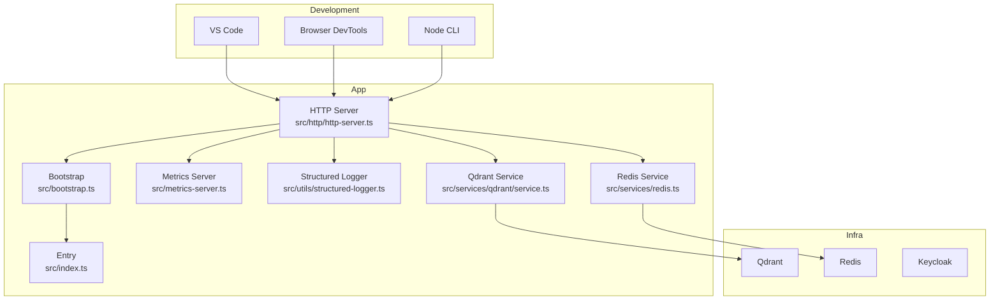
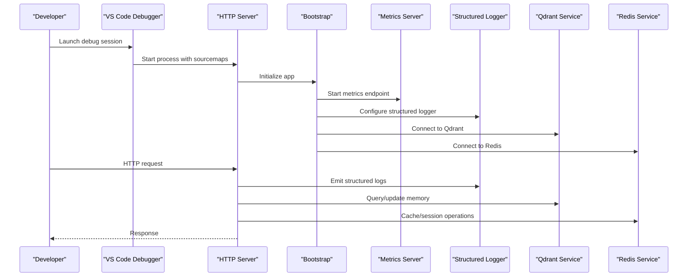
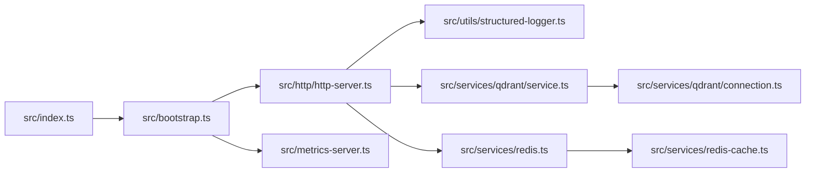

# Debugging and Development Tools

<cite>
**Referenced Files in This Document**
- [package.json](file://package.json)
- [tsconfig.json](file://tsconfig.json)
- [vite.config.ts](file://vite.config.ts)
- [vitest.config.ts](file://vitest.config.ts)
- [jest.config.js](file://jest.config.js)
- [.devcontainer/devcontainer.json.base](file://.devcontainer/devcontainer.json.base)
- [.devcontainer/devcontainer-fullstack.json](file://.devcontainer/devcontainer-fullstack.json)
- [.devcontainer/docker-compose.extend.yml](file://.devcontainer/docker-compose.extend.yml)
- [.devcontainer/docker-compose-fullstack.extend.yml](file://.devcontainer/docker-compose-fullstack.extend.yml)
- [src/server.ts](file://src/server.ts)
- [src/bootstrap.ts](file://src/bootstrap.ts)
- [src/index.ts](file://src/index.ts)
- [src/metrics-server.ts](file://src/metrics-server.ts)
- [src/http/http-server.ts](file://src/http/http-server.ts)
- [src/http/http-server-startup.ts](file://src/http/http-server-startup.ts)
- [src/http/http-metrics-middleware.ts](file://src/http/http-metrics-middleware.ts)
- [src/utils/log-core.ts](file://src/utils/log-core.ts)
- [src/utils/structured-logger.ts](file://src/utils/structured-logger.ts)
- [src/utils/global-error-handlers.ts](file://src/utils/global-error-handlers.ts)
- [src/services/qdrant/connection.ts](file://src/services/qdrant/connection.ts)
- [src/services/qdrant/service.ts](file://src/services/qdrant/service.ts)
- [src/services/redis.ts](file://src/services/redis.ts)
- [src/services/redis-cache.ts](file://src/services/redis-cache.ts)
- [src/cli/commands/serve.ts](file://src/cli/commands/serve.ts)
- [scripts/deploy-run-env.sh](file://scripts/deploy-run-env.sh)
- [scripts/build-vite-ui-env-define.ts](file://scripts/build-vite-ui-env-define.ts)
- [tests/setup.ts](file://tests/setup.ts)
- [tests/jest-sequencer.cjs](file://tests/jest-sequencer.cjs)
- [tests/ui/setup.ts](file://tests/ui/setup.ts)
- [compose.yaml](file://compose.yaml)
</cite>

## Table of Contents
1. [Introduction](#introduction)
2. [Project Structure](#project-structure)
3. [Core Components](#core-components)
4. [Architecture Overview](#architecture-overview)
5. [Detailed Component Analysis](#detailed-component-analysis)
6. [Dependency Analysis](#dependency-analysis)
7. [Performance Considerations](#performance-considerations)
8. [Troubleshooting Guide](#troubleshooting-guide)
9. [Conclusion](#conclusion)
10. [Appendices](#appendices)

## Introduction
This document provides comprehensive guidance for debugging and developing Kairos MCP across backend TypeScript, frontend React (Vite), tests (Jest/Vitest), logging, performance profiling, distributed components, database queries, and external API calls. It includes configuration references, VS Code launch setups, browser dev tools integration, test isolation strategies, structured logging, and troubleshooting tips to accelerate development workflows.

## Project Structure
Kairos MCP is a full-stack TypeScript application with:
- Backend server and HTTP/MCP handlers
- Frontend React UI built with Vite
- Tests using Jest and Vitest
- Dev container and Docker Compose for local infrastructure
- Structured logging and metrics middleware

**Diagram sources**
- [src/http/http-server.ts](file://src/http/http-server.ts)
- [src/bootstrap.ts](file://src/bootstrap.ts)
- [src/index.ts](file://src/index.ts)
- [src/metrics-server.ts](file://src/metrics-server.ts)
- [src/utils/structured-logger.ts](file://src/utils/structured-logger.ts)
- [src/services/qdrant/service.ts](file://src/services/qdrant/service.ts)
- [src/services/redis.ts](file://src/services/redis.ts)

**Section sources**
- [package.json](file://package.json)
- [tsconfig.json](file://tsconfig.json)
- [vite.config.ts](file://vite.config.ts)
- [.devcontainer/devcontainer-fullstack.json](file://.devcontainer/devcontainer-fullstack.json)
- [compose.yaml](file://compose.yaml)

## Core Components
- Backend entrypoints and bootstrap orchestrate the HTTP server, metrics, and services.
- Logging is centralized via structured logger utilities.
- Frontend uses Vite for fast reload and source maps.
- Tests are configured for both Jest and Vitest with dedicated setup files.

**Section sources**
- [src/index.ts](file://src/index.ts)
- [src/bootstrap.ts](file://src/bootstrap.ts)
- [src/http/http-server.ts](file://src/http/http-server.ts)
- [src/metrics-server.ts](file://src/metrics-server.ts)
- [src/utils/structured-logger.ts](file://src/utils/structured-logger.ts)
- [vite.config.ts](file://vite.config.ts)
- [jest.config.js](file://jest.config.js)
- [vitest.config.ts](file://vitest.config.ts)

## Architecture Overview
The runtime architecture integrates an HTTP server, optional metrics endpoint, structured logging, and integrations with Qdrant and Redis. The CLI can start the server, while the frontend communicates over HTTP.

**Diagram sources**
- [src/http/http-server.ts](file://src/http/http-server.ts)
- [src/bootstrap.ts](file://src/bootstrap.ts)
- [src/metrics-server.ts](file://src/metrics-server.ts)
- [src/utils/structured-logger.ts](file://src/utils/structured-logger.ts)
- [src/services/qdrant/service.ts](file://src/services/qdrant/service.ts)
- [src/services/redis.ts](file://src/services/redis.ts)

## Detailed Component Analysis

### Backend TypeScript Debugging with VS Code
- Source maps: Ensure TypeScript compilation emits source maps for accurate breakpoints.
- Launch configurations: Use Node.js debug targets that run the server entrypoint and pass environment variables.
- Breakpoints: Set breakpoints in HTTP handlers, services, and CLI commands; verify mapping by checking compiled output paths.
- Environment: Load env via scripts or devcontainer settings.

Recommended steps:
- Confirm tsconfig emits source maps.
- Create VS Code launch tasks targeting the server entrypoint and CLI serve command.
- Attach debugger to running processes if needed.

**Section sources**
- [tsconfig.json](file://tsconfig.json)
- [src/index.ts](file://src/index.ts)
- [src/cli/commands/serve.ts](file://src/cli/commands/serve.ts)
- [.devcontainer/devcontainer.json.base](file://.devcontainer/devcontainer.json.base)
- [.devcontainer/devcontainer-fullstack.json](file://.devcontainer/devcontainer-fullstack.json)

### Frontend React Debugging with Vite
- Vite dev server enables hot module replacement and source maps.
- Browser developer tools can attach directly to the dev server.
- Environment variables for the UI are defined through build scripts.

Recommended steps:
- Run the Vite dev server and open the provided URL in your browser.
- Use Sources panel to navigate to TSX/TS files via source maps.
- Inspect network requests and XHR/fetch calls in the Network tab.

**Section sources**
- [vite.config.ts](file://vite.config.ts)
- [scripts/build-vite-ui-env-define.ts](file://scripts/build-vite-ui-env-define.ts)

### Test Debugging: Jest and Vitest
- Jest: Uses its own config and sequencer; setup file initializes environment.
- Vitest: Separate config for Vite-based tests; supports browser and Node modes.
- Isolation: Use per-test teardown, unique fixtures, and controlled randomness/time.

Recommended steps:
- For Jest, use the provided setup and custom sequencer to control ordering.
- For Vitest, leverage Vite’s HMR and source maps for precise breakpoints.
- Enable coverage reporting via respective configs.

**Section sources**
- [jest.config.js](file://jest.config.js)
- [vitest.config.ts](file://vitest.config.ts)
- [tests/setup.ts](file://tests/setup.ts)
- [tests/jest-sequencer.cjs](file://tests/jest-sequencer.cjs)
- [tests/ui/setup.ts](file://tests/ui/setup.ts)

### Logging Configuration and Structured Logging
- Centralized structured logger utility provides consistent log shapes.
- Global error handlers capture unhandled exceptions and emit diagnostics.
- HTTP metrics middleware exposes operational metrics.

Recommended steps:
- Configure log level and destinations via environment variables.
- Use structured logger in services and handlers for traceable events.
- Aggregate logs from containers and dev environments into a central system.

**Section sources**
- [src/utils/structured-logger.ts](file://src/utils/structured-logger.ts)
- [src/utils/log-core.ts](file://src/utils/log-core.ts)
- [src/utils/global-error-handlers.ts](file://src/utils/global-error-handlers.ts)
- [src/http/http-metrics-middleware.ts](file://src/http/http-metrics-middleware.ts)

### Performance Profiling and Memory Leak Detection
- Node profiler: Use CPU/memory profilers during development to identify hotspots and leaks.
- Metrics: Expose Prometheus-compatible metrics via the metrics server and middleware.
- Bottlenecks: Profile I/O-bound operations (Qdrant, Redis) and HTTP endpoints.

Recommended steps:
- Capture heap snapshots under load to detect retained objects.
- Use flame graphs to pinpoint slow functions.
- Correlate metrics with logs for root cause analysis.

**Section sources**
- [src/metrics-server.ts](file://src/metrics-server.ts)
- [src/http/http-metrics-middleware.ts](file://src/http/http-metrics-middleware.ts)

### Distributed Components Debugging
- Qdrant: Validate connection, collections, and query shapes; inspect service layer methods.
- Redis: Verify connectivity, cache invalidation, and pub/sub behavior.
- External APIs: Add request/response tracing and timeouts; mock in tests.

Recommended steps:
- Use structured logs around outbound calls with correlation IDs.
- Instrument retries and circuit breakers where applicable.
- Simulate failures in tests to validate resilience.

**Section sources**
- [src/services/qdrant/connection.ts](file://src/services/qdrant/connection.ts)
- [src/services/qdrant/service.ts](file://src/services/qdrant/service.ts)
- [src/services/redis.ts](file://src/services/redis.ts)
- [src/services/redis-cache.ts](file://src/services/redis-cache.ts)

### Database Queries and External API Calls
- Qdrant queries: Validate vector search parameters and payload schemas.
- Redis caching: Ensure keys and TTLs align with business logic.
- External APIs: Wrap calls with retry/backoff and detailed error context.

Recommended steps:
- Log query payloads and results at appropriate levels.
- Benchmark critical paths and add instrumentation.
- Use feature flags to toggle expensive operations in dev.

**Section sources**
- [src/services/qdrant/service.ts](file://src/services/qdrant/service.ts)
- [src/services/redis-cache.ts](file://src/services/redis-cache.ts)

### Local Infrastructure and Environment
- Docker Compose provisions Qdrant, Redis, and other dependencies.
- Devcontainer provides a consistent environment with preconfigured tools.
- Scripts manage environment variables and deployment readiness.

Recommended steps:
- Start infra with compose and ensure health checks pass.
- Use devcontainer to avoid host-specific issues.
- Align local env with CI via shared scripts.

**Section sources**
- [compose.yaml](file://compose.yaml)
- [.devcontainer/devcontainer-fullstack.json](file://.devcontainer/devcontainer-fullstack.json)
- [.devcontainer/docker-compose.extend.yml](file://.devcontainer/docker-compose.extend.yml)
- [.devcontainer/docker-compose-fullstack.extend.yml](file://.devcontainer/docker-compose-fullstack.extend.yml)
- [scripts/deploy-run-env.sh](file://scripts/deploy-run-env.sh)

## Dependency Analysis
High-level dependency relationships between core modules:

**Diagram sources**
- [src/index.ts](file://src/index.ts)
- [src/bootstrap.ts](file://src/bootstrap.ts)
- [src/http/http-server.ts](file://src/http/http-server.ts)
- [src/metrics-server.ts](file://src/metrics-server.ts)
- [src/utils/structured-logger.ts](file://src/utils/structured-logger.ts)
- [src/services/qdrant/service.ts](file://src/services/qdrant/service.ts)
- [src/services/qdrant/connection.ts](file://src/services/qdrant/connection.ts)
- [src/services/redis.ts](file://src/services/redis.ts)
- [src/services/redis-cache.ts](file://src/services/redis-cache.ts)

**Section sources**
- [src/index.ts](file://src/index.ts)
- [src/bootstrap.ts](file://src/bootstrap.ts)
- [src/http/http-server.ts](file://src/http/http-server.ts)
- [src/metrics-server.ts](file://src/metrics-server.ts)
- [src/utils/structured-logger.ts](file://src/utils/structured-logger.ts)
- [src/services/qdrant/service.ts](file://src/services/qdrant/service.ts)
- [src/services/qdrant/connection.ts](file://src/services/qdrant/connection.ts)
- [src/services/redis.ts](file://src/services/redis.ts)
- [src/services/redis-cache.ts](file://src/services/redis-cache.ts)

## Performance Considerations
- Prefer streaming responses for large exports and artifacts.
- Cache frequently accessed data in Redis with appropriate TTLs.
- Limit concurrency for heavy operations and backpressure-sensitive I/O.
- Use metrics and logs to track p95/p99 latencies and error rates.
- Profile before optimizing; focus on hot paths identified by CPU/heap profiles.

[No sources needed since this section provides general guidance]

## Troubleshooting Guide
Common issues and resolutions:
- Breakpoints not hit in VS Code:
  - Verify source map generation and correct working directory.
  - Ensure the debug target runs the same code path as production.
- Frontend not reloading:
  - Check Vite dev server logs and port conflicts.
  - Clear browser cache and confirm HMR script injection.
- Tests flaky due to shared state:
  - Use per-test isolation, unique fixtures, and reset caches.
  - Control time and randomness deterministically.
- Qdrant/Redis connectivity errors:
  - Validate URLs, credentials, and firewall rules.
  - Inspect service logs and health endpoints.
- High memory usage:
  - Capture heap snapshots under realistic loads.
  - Identify retained objects and reduce allocations.

**Section sources**
- [tsconfig.json](file://tsconfig.json)
- [vite.config.ts](file://vite.config.ts)
- [tests/setup.ts](file://tests/setup.ts)
- [tests/jest-sequencer.cjs](file://tests/jest-sequencer.cjs)
- [src/services/qdrant/connection.ts](file://src/services/qdrant/connection.ts)
- [src/services/redis.ts](file://src/services/redis.ts)
- [src/utils/global-error-handlers.ts](file://src/utils/global-error-handlers.ts)

## Conclusion
By leveraging VS Code debugging, Vite dev tooling, structured logging, and robust test configurations, developers can efficiently diagnose and resolve issues across the full stack. Integrating metrics and profiling further enhances observability and performance tuning.

[No sources needed since this section summarizes without analyzing specific files]

## Appendices

### Appendix A: VS Code Launch Configurations
- Node.js: Target server entrypoint with environment variables loaded from scripts or devcontainer.
- CLI: Attach to CLI serve command for MCP flows.
- Attach: Use attach mode for externally started processes.

**Section sources**
- [.devcontainer/devcontainer.json.base](file://.devcontainer/devcontainer.json.base)
- [.devcontainer/devcontainer-fullstack.json](file://.devcontainer/devcontainer-fullstack.json)
- [src/index.ts](file://src/index.ts)
- [src/cli/commands/serve.ts](file://src/cli/commands/serve.ts)

### Appendix B: Environment Variables and Scripts
- Use deploy-run-env.sh to standardize environment loading.
- Build-time UI env define script injects variables into the frontend bundle.

**Section sources**
- [scripts/deploy-run-env.sh](file://scripts/deploy-run-env.sh)
- [scripts/build-vite-ui-env-define.ts](file://scripts/build-vite-ui-env-define.ts)

### Appendix C: Test Coverage and Reporting
- Jest: Configure coverage thresholds and reporters.
- Vitest: Enable coverage via Vite plugin and collect reports.
- Combine outputs for unified reporting in CI.

**Section sources**
- [jest.config.js](file://jest.config.js)
- [vitest.config.ts](file://vitest.config.ts)