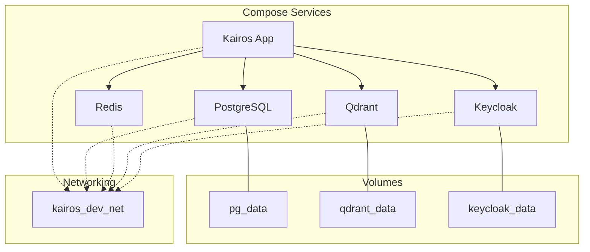
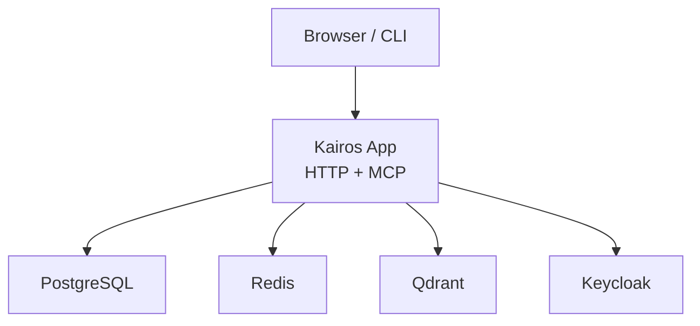
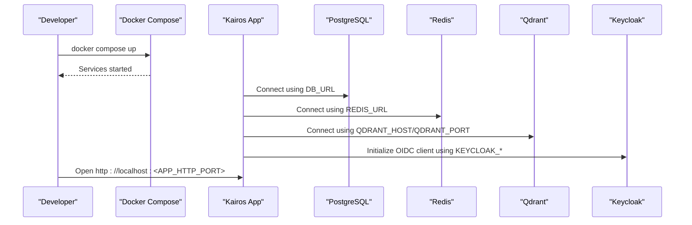
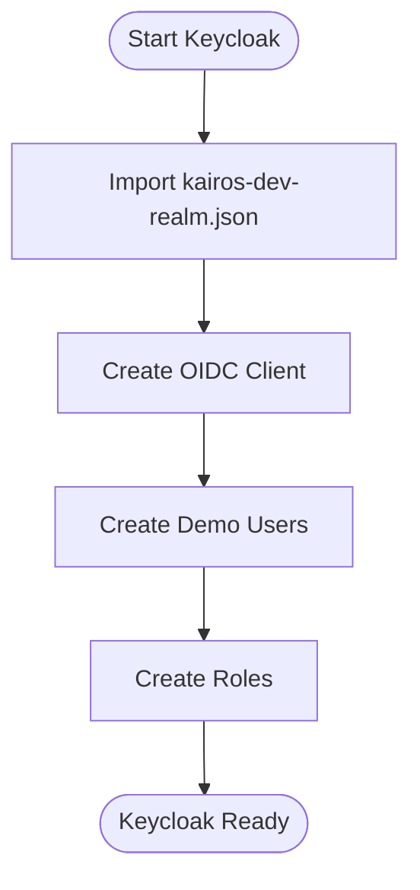
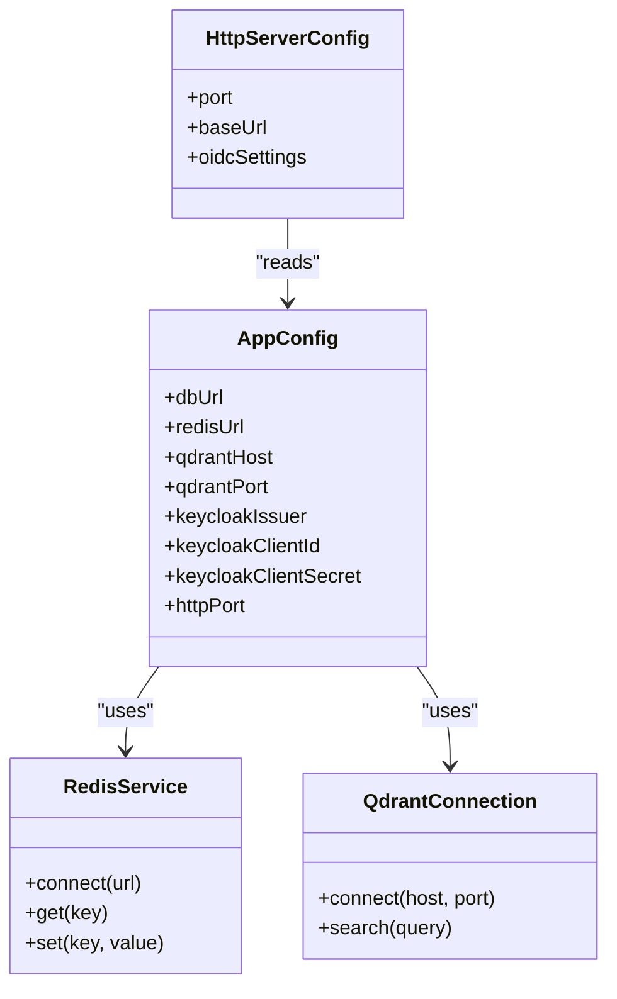
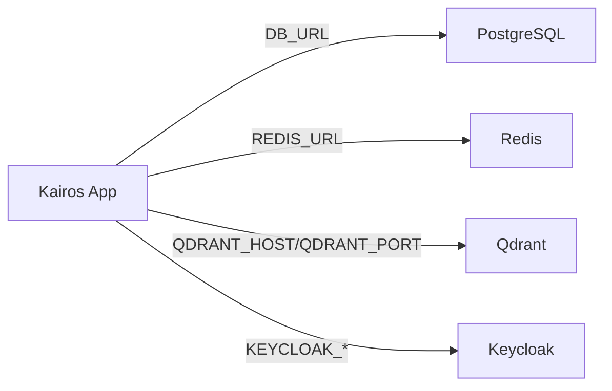

# Docker Compose Development Environment

<cite>
**Referenced Files in This Document**
- [compose.yaml](file://compose.yaml)
- [Dockerfile.dev](file://Dockerfile.dev)
- [scripts/env/create-env.sh](file://scripts/env/create-env.sh)
- [scripts/deploy-run-env.sh](file://scripts/deploy-run-env.sh)
- [scripts/ci-wait-for-infra.sh](file://scripts/ci-wait-for-infra.sh)
- [scripts/qdrant-binary.sh](file://scripts/qdrant-binary.sh)
- [scripts/keycloak/import/kairos-dev-realm.json](file://scripts/keycloak/import/kairos-dev-realm.json)
- [helm/kairos-mcp/files/kairos-realm.json](file://helm/kairos-mcp/files/kairos-realm.json)
- [src/config.ts](file://src/config.ts)
- [src/http/http-server-config.ts](file://src/http/http-server-config.ts)
- [src/services/redis.ts](file://src/services/redis.ts)
- [src/services/qdrant/connection.ts](file://src/services/qdrant/connection.ts)
</cite>

## Update Summary
**Changes Made**
- Updated to reflect the removal of complex Docker Compose-based devcontainer configurations
- Simplified development environment setup with streamlined local development approach
- Removed references to extensive DevContainer configurations and related scripts
- Maintained core Docker Compose functionality for service orchestration while simplifying the overall development workflow

## Table of Contents
1. [Introduction](#introduction)
2. [Project Structure](#project-structure)
3. [Core Components](#core-components)
4. [Architecture Overview](#architecture-overview)
5. [Detailed Component Analysis](#detailed-component-analysis)
6. [Dependency Analysis](#dependency-analysis)
7. [Performance Considerations](#performance-considerations)
8. [Troubleshooting Guide](#troubleshooting-guide)
9. [Conclusion](#conclusion)
10. [Appendices](#appendices)

## Introduction
This document explains how to run the Kairos MCP development environment using Docker Compose. It covers the full service stack (PostgreSQL, Redis, Qdrant vector database, and Keycloak), environment configuration via .env files, database initialization, Keycloak realm setup with default users and roles, container networking, volume management, port mappings, development-specific features (hot reload, debugging ports, dev dependencies), and common issues such as port conflicts, memory limits, and network connectivity problems. It also provides commands for starting, stopping, and managing the environment.

**Updated** The development environment setup has been significantly simplified by removing complex Docker Compose-based devcontainer configurations. Local development now uses a streamlined approach without containerized environments, focusing on essential Docker Compose services for infrastructure components while allowing direct local application development.

## Project Structure
The repository includes:
- A top-level Docker Compose file that defines the local development services.
- Scripts to generate a .env file and bootstrap runtime configuration.
- Keycloak realm import JSONs for development and production.
- Application code that reads environment variables to configure services at runtime.
- Simplified development workflow without complex DevContainer configurations.

[No sources needed since this diagram shows conceptual workflow, not actual code structure]

## Core Components
- PostgreSQL: Relational store for application data.
- Redis: Cache and pub/sub backend.
- Qdrant: Vector database for embeddings and semantic search.
- Keycloak: Identity provider for OIDC-based authentication.
- Kairos App: The main application container built from the development image.

Environment-driven configuration is central:
- Database URLs and credentials are provided via environment variables.
- Redis connection URL is configured via environment variables.
- Qdrant host and port are configured via environment variables.
- Keycloak endpoints and client settings are configured via environment variables.

Development images include hot reload and debugging support.

**Section sources**
- [compose.yaml:1-200](file://compose.yaml#L1-L200)
- [Dockerfile.dev:1-200](file://Dockerfile.dev#L1-L200)
- [src/config.ts:1-200](file://src/config.ts#L1-L200)
- [src/http/http-server-config.ts:1-200](file://src/http/http-server-config.ts#L1-L200)
- [src/services/redis.ts:1-200](file://src/services/redis.ts#L1-L200)
- [src/services/qdrant/connection.ts:1-200](file://src/services/qdrant/connection.ts#L1-L200)

## Architecture Overview
The development stack runs locally inside Docker Compose. The app connects to PostgreSQL, Redis, Qdrant, and Keycloak over an internal Docker network. Persistent volumes keep data across restarts. Port mappings expose UI and API endpoints on localhost.

[No sources needed since this diagram shows conceptual workflow, not actual code structure]

## Detailed Component Analysis

### Service Stack and Networking
- Services:
  - PostgreSQL: Exposed internally; persistent volume mounted.
  - Redis: Exposed internally; persistent volume mounted.
  - Qdrant: Exposed internally; persistent volume mounted.
  - Keycloak: Exposed internally; persistent volume mounted.
  - Kairos App: Exposes HTTP ports to localhost for development.
- Networking:
  - All services share a custom bridge network for stable DNS names.
  - The app uses service names (e.g., postgres, redis, qdrant, keycloak) to connect.
- Ports:
  - App HTTP port mapped to localhost for browser access.
  - Optional debug ports exposed for Node.js debugging.

**Diagram sources**
- [compose.yaml:1-200](file://compose.yaml#L1-L200)
- [src/config.ts:1-200](file://src/config.ts#L1-L200)
- [src/http/http-server-config.ts:1-200](file://src/http/http-server-config.ts#L1-L200)
- [src/services/redis.ts:1-200](file://src/services/redis.ts#L1-L200)
- [src/services/qdrant/connection.ts:1-200](file://src/services/qdrant/connection.ts#L1-L200)

### Environment Variables and .env Configuration
- Use the provided script to scaffold a .env file with defaults and comments.
- Required variables include:
  - Database URL or DSN components for PostgreSQL.
  - Redis URL for cache and pub/sub.
  - Qdrant host and port for vector operations.
  - Keycloak realm, client ID, client secret, issuer URL, and redirect URI.
  - Application HTTP port and base URL.
- Runtime configuration loader reads these variables at startup.

Steps:
1. Generate a .env file using the helper script.
2. Review and adjust values for your local setup.
3. Start services; the app will read .env automatically if configured by Compose.

**Section sources**
- [scripts/env/create-env.sh:1-200](file://scripts/env/create-env.sh#L1-L200)
- [scripts/deploy-run-env.sh:1-200](file://scripts/deploy-run-env.sh#L1-L200)
- [src/config.ts:1-200](file://src/config.ts#L1-L200)
- [src/http/http-server-config.ts:1-200](file://src/http/http-server-config.ts#L1-L200)

### Database Initialization
- PostgreSQL initialization can be performed using standard init scripts or migration tools.
- Ensure the database user and schema exist before starting the app.
- For local development, you may seed initial data after first boot.

Recommendations:
- Create a dedicated database and user matching your .env configuration.
- Run migrations or seed scripts once after the first successful start.

**Section sources**
- [compose.yaml:1-200](file://compose.yaml#L1-L200)
- [scripts/deploy-run-env.sh:1-200](file://scripts/deploy-run-env.sh#L1-L200)

### Keycloak Realm Setup and Default Users/Roles
- Import a development realm JSON into Keycloak during first boot.
- The realm JSON contains clients, roles, and example users suitable for development.
- Configure the app's OIDC settings to match the imported realm and client.

Steps:
1. Mount the realm JSON into Keycloak and enable auto-import on startup.
2. Verify the realm exists and the client is configured.
3. Update .env with the correct realm, client ID, client secret, and issuer URL.
4. Test login flow through the app's OIDC redirect.

**Diagram sources**
- [scripts/keycloak/import/kairos-dev-realm.json:1-200](file://scripts/keycloak/import/kairos-dev-realm.json#L1-L200)
- [helm/kairos-mcp/files/kairos-realm.json:1-200](file://helm/kairos-mcp/files/kairos-realm.json#L1-L200)
- [compose.yaml:1-200](file://compose.yaml#L1-L200)

### Container Networking and Volume Management
- Networking:
  - Custom bridge network ensures stable service discovery by name.
  - Avoid host networking unless required for specific tooling.
- Volumes:
  - PostgreSQL data persisted under a named volume.
  - Qdrant data persisted under a named volume.
  - Keycloak data persisted under a named volume.
  - Redis data optionally persisted under a named volume.
- Port Mappings:
  - Map the app HTTP port to localhost for development.
  - Optionally map debug ports for remote debugging.

Best practices:
- Keep internal ports consistent between Compose and environment variables.
- Use named volumes to avoid accidental data loss.

### Development-Specific Configurations
- Hot Reload:
  - The development image mounts source directories and triggers rebuilds on changes.
  - Use the dev server mode to watch for file changes.
- Debugging:
  - Expose Node.js inspector port for IDE debugging.
  - Attach debugger to the running container.
- Dev Dependencies:
  - The development image installs dev-only packages.
  - Useful for running tests and linting inside the container.

Tips:
- Leverage the simplified development workflow without complex DevContainer configurations.
- Use the provided scripts to validate environment readiness.

**Section sources**
- [Dockerfile.dev:1-200](file://Dockerfile.dev#L1-L200)

### Application Integration Points
- PostgreSQL:
  - Connection string configured via environment variable.
  - Used for relational data storage.
- Redis:
  - Connection URL configured via environment variable.
  - Used for caching and pub/sub.
- Qdrant:
  - Host and port configured via environment variables.
  - Used for vector similarity search.
- Keycloak:
  - OIDC issuer, client ID, client secret, and redirect URI configured via environment variables.
  - Used for authentication and authorization.

**Diagram sources**
- [src/config.ts:1-200](file://src/config.ts#L1-L200)
- [src/services/redis.ts:1-200](file://src/services/redis.ts#L1-L200)
- [src/services/qdrant/connection.ts:1-200](file://src/services/qdrant/connection.ts#L1-L200)
- [src/http/http-server-config.ts:1-200](file://src/http/http-server-config.ts#L1-L200)

**Section sources**
- [src/config.ts:1-200](file://src/config.ts#L1-L200)
- [src/services/redis.ts:1-200](file://src/services/redis.ts#L1-L200)
- [src/services/qdrant/connection.ts:1-200](file://src/services/qdrant/connection.ts#L1-L200)
- [src/http/http-server-config.ts:1-200](file://src/http/http-server-config.ts#L1-L200)

## Dependency Analysis
The application depends on external services defined in Compose. The following diagram maps runtime dependencies and their configuration points.

**Diagram sources**
- [compose.yaml:1-200](file://compose.yaml#L1-L200)
- [src/config.ts:1-200](file://src/config.ts#L1-L200)
- [src/services/redis.ts:1-200](file://src/services/redis.ts#L1-L200)
- [src/services/qdrant/connection.ts:1-200](file://src/services/qdrant/connection.ts#L1-L200)

**Section sources**
- [compose.yaml:1-200](file://compose.yaml#L1-L200)
- [src/config.ts:1-200](file://src/config.ts#L1-L200)

## Performance Considerations
- Memory Limits:
  - Set appropriate memory limits for containers to prevent OOM kills.
  - Tune Qdrant heap size if performing large vector operations.
- CPU Limits:
  - Allocate sufficient CPU shares for concurrent workloads.
- Network Latency:
  - Keep services on the same Docker network to minimize latency.
- Caching:
  - Enable Redis-backed caches where applicable to reduce database load.
- Persistence:
  - Use SSD-backed volumes for databases to improve I/O performance.

## Troubleshooting Guide
Common issues and resolutions:
- Port Conflicts:
  - If the app HTTP port is already in use, change the mapping in Compose or set a different port in .env.
  - Check for other processes listening on the same port.
- Memory Limits:
  - Increase container memory limits if services crash due to insufficient memory.
  - Monitor logs for out-of-memory errors.
- Network Connectivity:
  - Ensure all services are on the same network and reachable by service name.
  - Validate environment variables for correct hostnames and ports.
- Keycloak Login Failures:
  - Confirm realm and client configuration matches .env settings.
  - Verify redirect URIs and CORS settings in Keycloak.
- Database Initialization:
  - Ensure the database exists and credentials are correct.
  - Run migrations or seed scripts if the app fails to find expected tables.

Useful commands:
- Start the environment: docker compose up
- Stop the environment: docker compose down
- View logs: docker compose logs -f <service>
- Rebuild dev image: docker compose build --no-cache
- Execute a one-off command: docker compose run --rm app <command>

**Section sources**
- [scripts/ci-wait-for-infra.sh:1-200](file://scripts/ci-wait-for-infra.sh#L1-L200)
- [scripts/qdrant-binary.sh:1-200](file://scripts/qdrant-binary.sh#L1-L200)
- [compose.yaml:1-200](file://compose.yaml#L1-L200)

## Conclusion
The Docker Compose development environment provides a complete, reproducible stack for Kairos MCP. By configuring environment variables, initializing the database, importing the Keycloak realm, and leveraging development features like hot reload and debugging, you can efficiently develop and test the application locally. The simplified development workflow removes complex DevContainer configurations while maintaining essential Docker Compose functionality for infrastructure services. Follow the troubleshooting guide to resolve common issues and ensure smooth operation.

## Appendices

### Quick Start Commands
- Generate .env: run the environment creation script.
- Start services: docker compose up
- Access UI: open http://localhost:<APP_HTTP_PORT>
- Stop services: docker compose down

**Section sources**
- [scripts/env/create-env.sh:1-200](file://scripts/env/create-env.sh#L1-L200)
- [compose.yaml:1-200](file://compose.yaml#L1-L200)