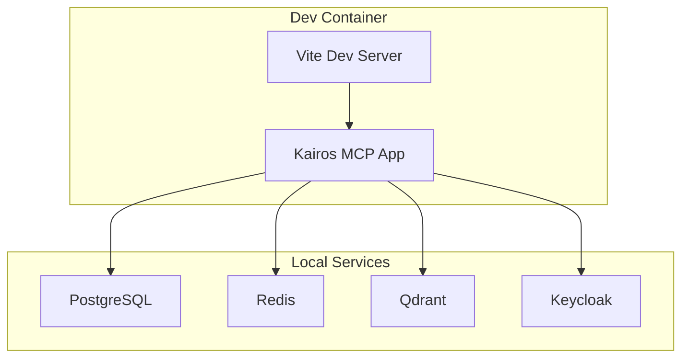
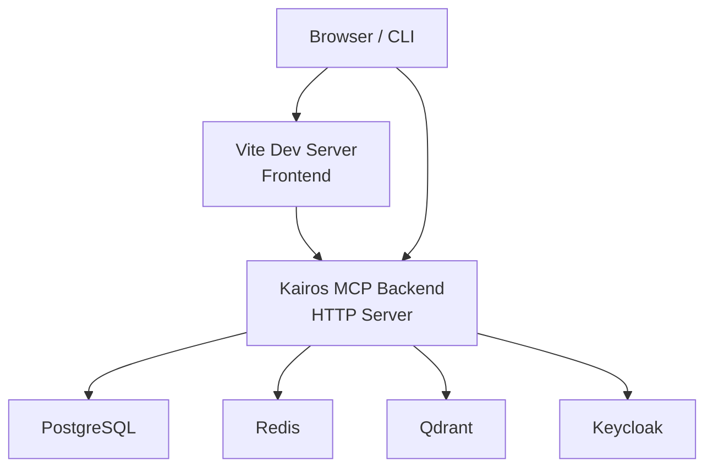
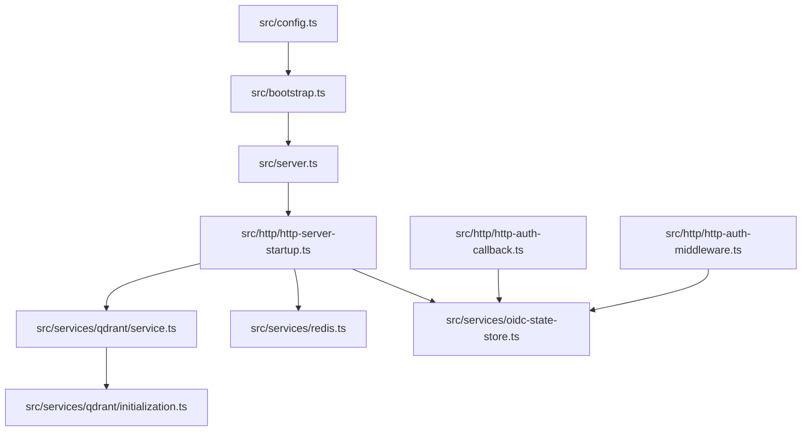

# Local Development Setup

<cite>
**Referenced Files in This Document**
- [compose.yaml](file://compose.yaml)
- [.devcontainer/devcontainer.json.base](file://.devcontainer/devcontainer.json.base)
- [.devcontainer/devcontainer-fullstack.json](file://.devcontainer/devcontainer-fullstack.json)
- [.devcontainer/docker-compose.extend.yml](file://.devcontainer/docker-compose.extend.yml)
- [.devcontainer/docker-compose-fullstack.extend.yml](file://.devcontainer/docker-compose-fullstack.extend.yml)
- [.devcontainer/use-config.sh](file://.devcontainer/use-config.sh)
- [.devcontainer/validate.sh](file://.devcontainer/validate.sh)
- [Dockerfile.dev](file://Dockerfile.dev)
- [package.json](file://package.json)
- [vite.config.ts](file://vite.config.ts)
- [tsconfig.json](file://tsconfig.json)
- [tsconfig.ui.json](file://tsconfig.ui.json)
- [jest.config.js](file://jest.config.js)
- [vitest.config.ts](file://vitest.config.ts)
- [scripts/env/create-env.sh](file://scripts/env/create-env.sh)
- [scripts/deploy-run-env.sh](file://scripts/deploy-run-env.sh)
- [scripts/keycloak/import/kairos-dev-realm.json](file://scripts/keycloak/import/kairos-dev-realm.json)
- [src/config.ts](file://src/config.ts)
- [src/bootstrap.ts](file://src/bootstrap.ts)
- [src/server.ts](file://src/server.ts)
- [src/http/http-server-startup.ts](file://src/http/http-server-startup.ts)
- [src/services/qdrant/service.ts](file://src/services/qdrant/service.ts)
- [src/services/qdrant/initialization.ts](file://src/services/qdrant/initialization.ts)
- [src/services/redis.ts](file://src/services/redis.ts)
- [src/services/oidc-state-store.ts](file://src/services/oidc-state-store.ts)
- [src/http/http-auth-callback.ts](file://src/http/http-auth-callback.ts)
- [src/http/http-auth-middleware.ts](file://src/http/http-auth-middleware.ts)
- [src/ui/main.tsx](file://src/ui/main.tsx)
- [src/ui/App.tsx](file://src/ui/App.tsx)
</cite>

## Table of Contents
1. [Introduction](#introduction)
2. [Project Structure](#project-structure)
3. [Core Components](#core-components)
4. [Architecture Overview](#architecture-overview)
5. [Detailed Component Analysis](#detailed-component-analysis)
6. [Dependency Analysis](#dependency-analysis)
7. [Performance Considerations](#performance-considerations)
8. [Troubleshooting Guide](#troubleshooting-guide)
9. [Conclusion](#conclusion)
10. [Appendices](#appendices)

## Introduction
This document provides a complete local development setup for Kairos MCP, including:
- Docker Compose environment with PostgreSQL, Redis, Qdrant, and Keycloak
- VS Code dev containers for consistent developer experience
- Environment variable configuration and database initialization
- Keycloak realm import and OIDC flow validation
- Debugging configurations for backend TypeScript and frontend React
- Hot reload, test execution, and best practices
- Troubleshooting common issues and performance tips

## Project Structure
The repository includes:
- Infrastructure definitions for local services via Docker Compose
- Dev container definitions to standardize the development environment
- Scripts to generate environment files and run the application
- Backend server startup and HTTP service wiring
- Frontend Vite-based React app configuration
- Test runners (Jest and Vitest)

[No sources needed since this diagram shows conceptual workflow, not actual code structure]

**Section sources**
- [compose.yaml:1-200](file://compose.yaml#L1-L200)
- [.devcontainer/devcontainer-fullstack.json:1-200](file://.devcontainer/devcontainer-fullstack.json#L1-L200)
- [.devcontainer/docker-compose-fullstack.extend.yml:1-200](file://.devcontainer/docker-compose-fullstack.extend.yml#L1-L200)

## Core Components
- Docker Compose stack defines all required services for local development.
- Dev container definitions provide a reproducible environment with preinstalled tools and extensions.
- Environment generation script creates .env from templates and validates required variables.
- Application bootstrap initializes services (database, cache, vector store, OIDC).
- HTTP server starts API routes, middleware, and static UI assets.
- Frontend uses Vite for hot reloading and integrates with backend APIs.

**Section sources**
- [compose.yaml:1-200](file://compose.yaml#L1-L200)
- [.devcontainer/devcontainer-fullstack.json:1-200](file://.devcontainer/devcontainer-fullstack.json#L1-L200)
- [.devcontainer/docker-compose-fullstack.extend.yml:1-200](file://.devcontainer/docker-compose-fullstack.extend.yml#L1-L200)
- [scripts/env/create-env.sh:1-200](file://scripts/env/create-env.sh#L1-L200)
- [src/bootstrap.ts:1-200](file://src/bootstrap.ts#L1-L200)
- [src/server.ts:1-200](file://src/server.ts#L1-L200)
- [src/http/http-server-startup.ts:1-200](file://src/http/http-server-startup.ts#L1-L200)
- [vite.config.ts:1-200](file://vite.config.ts#L1-L200)

## Architecture Overview
The local development architecture connects the app to infrastructure services and exposes both API and UI endpoints.

**Diagram sources**
- [compose.yaml:1-200](file://compose.yaml#L1-L200)
- [src/server.ts:1-200](file://src/server.ts#L1-L200)
- [src/http/http-server-startup.ts:1-200](file://src/http/http-server-startup.ts#L1-L200)
- [vite.config.ts:1-200](file://vite.config.ts#L1-L200)

## Detailed Component Analysis

### Docker Compose Development Environment
- Defines services for PostgreSQL, Redis, Qdrant, and Keycloak.
- Exposes ports for local access and sets up volumes for persistence.
- Provides health checks and restart policies for reliability.

Steps:
- Ensure Docker is installed and running.
- Start the full stack using the compose file.
- Verify services are healthy by checking logs or accessing endpoints.

**Section sources**
- [compose.yaml:1-200](file://compose.yaml#L1-L200)

### VS Code Dev Containers
- Base dev container definition configures Node.js, TypeScript, and tooling.
- Fullstack dev container extends base with additional services and scripts.
- Helper scripts validate environment and apply configuration overrides.

Steps:
- Open the project in VS Code.
- Select the fullstack dev container profile.
- Reopen in container to install dependencies and start services.

**Section sources**
- [.devcontainer/devcontainer.json.base:1-200](file://.devcontainer/devcontainer.json.base#L1-L200)
- [.devcontainer/devcontainer-fullstack.json:1-200](file://.devcontainer/devcontainer-fullstack.json#L1-L200)
- [.devcontainer/use-config.sh:1-200](file://.devcontainer/use-config.sh#L1-L200)
- [.devcontainer/validate.sh:1-200](file://.devcontainer/validate.sh#L1-L200)

### Environment Variables Configuration
- Use the environment creation script to generate .env with defaults and prompts.
- Required variables include database URLs, Redis URL, Qdrant endpoint, and Keycloak settings.
- The deployment runner script can be used to source environment before starting the app.

Steps:
- Run the environment creation script to produce .env.
- Review and adjust values for local services.
- Source or load environment variables as needed.

**Section sources**
- [scripts/env/create-env.sh:1-200](file://scripts/env/create-env.sh#L1-L200)
- [scripts/deploy-run-env.sh:1-200](file://scripts/deploy-run-env.sh#L1-L200)
- [src/config.ts:1-200](file://src/config.ts#L1-L200)

### Database Initialization
- PostgreSQL schema and seed data are initialized during application bootstrap.
- Vector collections in Qdrant are created on first run if missing.
- Redis is used for caching and session state.

Steps:
- Start the app; it will initialize DB migrations and Qdrant collections.
- Confirm tables exist and vector collections are present.

**Section sources**
- [src/bootstrap.ts:1-200](file://src/bootstrap.ts#L1-L200)
- [src/services/qdrant/initialization.ts:1-200](file://src/services/qdrant/initialization.ts#L1-L200)
- [src/services/qdrant/service.ts:1-200](file://src/services/qdrant/service.ts#L1-L200)
- [src/services/redis.ts:1-200](file://src/services/redis.ts#L1-L200)

### Keycloak Realm Setup
- Import the development realm JSON into Keycloak to configure clients and users.
- Configure OIDC client IDs, secrets, and redirect URIs to match local URLs.
- Validate OIDC callback and authentication middleware behavior.

Steps:
- Start Keycloak and create an admin user.
- Import kairos-dev-realm.json into the appropriate realm.
- Update client configuration for local development URLs.
- Test login flow through the app’s auth callback route.

**Section sources**
- [scripts/keycloak/import/kairos-dev-realm.json:1-200](file://scripts/keycloak/import/kairos-dev-realm.json#L1-L200)
- [src/http/http-auth-callback.ts:1-200](file://src/http/http-auth-callback.ts#L1-L200)
- [src/http/http-auth-middleware.ts:1-200](file://src/http/http-auth-middleware.ts#L1-L200)
- [src/services/oidc-state-store.ts:1-200](file://src/services/oidc-state-store.ts#L1-L200)

### Backend TypeScript Debugging
- Attach a Node.js debugger to the running backend process.
- Use breakpoints in HTTP handlers, services, and middleware.
- Inspect environment variables and service connections at runtime.

Steps:
- Start the backend in debug mode.
- Configure VS Code launch task to attach to the process.
- Set breakpoints in key modules such as HTTP routes and OIDC handling.

**Section sources**
- [src/server.ts:1-200](file://src/server.ts#L1-L200)
- [src/http/http-server-startup.ts:1-200](file://src/http/http-server-startup.ts#L1-L200)
- [src/http/http-auth-callback.ts:1-200](file://src/http/http-auth-callback.ts#L1-L200)
- [src/services/oidc-state-store.ts:1-200](file://src/services/oidc-state-store.ts#L1-L200)

### Frontend React Debugging
- Use Vite dev server for hot module replacement and live reload.
- Configure browser debugging with source maps enabled.
- Intercept network requests to verify API calls and responses.

Steps:
- Start the Vite dev server.
- Open the app in the browser and use Developer Tools.
- Set breakpoints in React components and hooks.

**Section sources**
- [vite.config.ts:1-200](file://vite.config.ts#L1-L200)
- [src/ui/main.tsx:1-200](file://src/ui/main.tsx#L1-L200)
- [src/ui/App.tsx:1-200](file://src/ui/App.tsx#L1-L200)

### Hot Reload Setup
- Backend: Use a process manager or Node inspector to auto-restart on changes.
- Frontend: Vite provides HMR out of the box for React components and styles.

Steps:
- For backend, run with a watcher that restarts the process when files change.
- For frontend, ensure Vite is configured and running.

**Section sources**
- [vite.config.ts:1-200](file://vite.config.ts#L1-L200)
- [package.json:1-200](file://package.json#L1-L200)

### Test Execution
- Unit tests: Jest for backend and Vitest for frontend utilities.
- Integration tests: End-to-end flows against local services.
- Snapshot tests: UI snapshots for stable rendering.

Steps:
- Run unit tests with the configured test runner.
- Execute integration tests after starting all services.
- Generate and update snapshots as needed.

**Section sources**
- [jest.config.js:1-200](file://jest.config.js#L1-L200)
- [vitest.config.ts:1-200](file://vitest.config.ts#L1-L200)
- [package.json:1-200](file://package.json#L1-L200)

### Development Workflow Best Practices
- Keep environment variables centralized and validated before starting services.
- Use dev containers to avoid “works on my machine” issues.
- Commit only necessary changes to realm imports and environment templates.
- Regularly prune unused dependencies and clean build artifacts.

[No sources needed since this section doesn't analyze specific source files]

## Dependency Analysis
The following diagram illustrates core runtime dependencies between application modules and external services.

**Diagram sources**
- [src/config.ts:1-200](file://src/config.ts#L1-L200)
- [src/bootstrap.ts:1-200](file://src/bootstrap.ts#L1-L200)
- [src/server.ts:1-200](file://src/server.ts#L1-L200)
- [src/http/http-server-startup.ts:1-200](file://src/http/http-server-startup.ts#L1-L200)
- [src/services/qdrant/service.ts:1-200](file://src/services/qdrant/service.ts#L1-L200)
- [src/services/qdrant/initialization.ts:1-200](file://src/services/qdrant/initialization.ts#L1-L200)
- [src/services/redis.ts:1-200](file://src/services/redis.ts#L1-L200)
- [src/services/oidc-state-store.ts:1-200](file://src/services/oidc-state-store.ts#L1-L200)
- [src/http/http-auth-callback.ts:1-200](file://src/http/http-auth-callback.ts#L1-L200)
- [src/http/http-auth-middleware.ts:1-200](file://src/http/http-auth-middleware.ts#L1-L200)

**Section sources**
- [src/config.ts:1-200](file://src/config.ts#L1-L200)
- [src/bootstrap.ts:1-200](file://src/bootstrap.ts#L1-L200)
- [src/server.ts:1-200](file://src/server.ts#L1-L200)
- [src/http/http-server-startup.ts:1-200](file://src/http/http-server-startup.ts#L1-L200)
- [src/services/qdrant/service.ts:1-200](file://src/services/qdrant/service.ts#L1-L200)
- [src/services/qdrant/initialization.ts:1-200](file://src/services/qdrant/initialization.ts#L1-L200)
- [src/services/redis.ts:1-200](file://src/services/redis.ts#L1-L200)
- [src/services/oidc-state-store.ts:1-200](file://src/services/oidc-state-store.ts#L1-L200)
- [src/http/http-auth-callback.ts:1-200](file://src/http/http-auth-callback.ts#L1-L200)
- [src/http/http-auth-middleware.ts:1-200](file://src/http/http-auth-middleware.ts#L1-L200)

## Performance Considerations
- Prefer local SSD storage for Docker volumes to improve I/O performance.
- Limit concurrent operations in tests to reduce resource contention.
- Use connection pooling for database and Redis where applicable.
- Avoid excessive logging in hot paths during development.
- Monitor memory usage of Qdrant and adjust collection sizes accordingly.

[No sources needed since this section provides general guidance]

## Troubleshooting Guide
Common issues and resolutions:
- Service connectivity errors: Verify hostnames and ports in environment variables.
- Keycloak login failures: Ensure realm import succeeded and redirect URIs match local URLs.
- Qdrant collection errors: Reinitialize collections by restarting the app after clearing state.
- Redis timeouts: Check Redis availability and increase timeout settings if needed.
- Frontend HMR not working: Confirm Vite dev server is running and CORS settings allow local requests.

**Section sources**
- [src/config.ts:1-200](file://src/config.ts#L1-L200)
- [src/services/redis.ts:1-200](file://src/services/redis.ts#L1-L200)
- [src/services/qdrant/initialization.ts:1-200](file://src/services/qdrant/initialization.ts#L1-L200)
- [src/http/http-auth-callback.ts:1-200](file://src/http/http-auth-callback.ts#L1-L200)
- [vite.config.ts:1-200](file://vite.config.ts#L1-L200)

## Conclusion
By following this guide, you can set up a robust local development environment for Kairos MCP using Docker Compose and VS Code dev containers. Proper environment configuration, Keycloak realm setup, and debugging workflows will streamline your development experience. Use the troubleshooting tips and performance recommendations to maintain a smooth and efficient local setup.

[No sources needed since this section summarizes without analyzing specific files]

## Appendices

### Quick Start Checklist
- Install Docker and VS Code with Dev Containers extension.
- Start the fullstack dev container profile.
- Generate environment variables using the provided script.
- Start services and initialize database and vector collections.
- Import Keycloak realm and validate OIDC login.
- Launch backend and frontend servers for debugging.

[No sources needed since this section doesn't analyze specific source files]