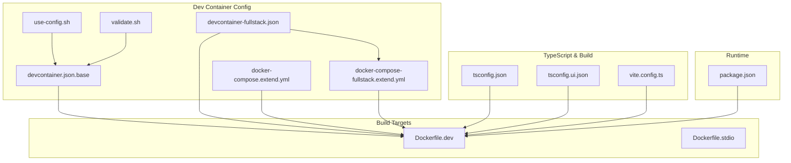
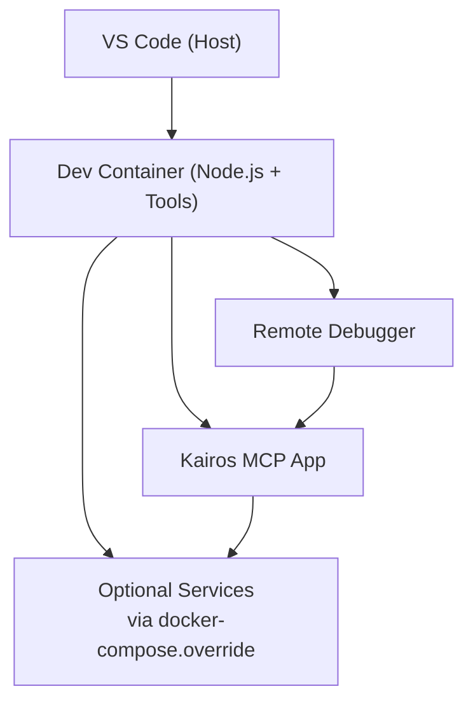
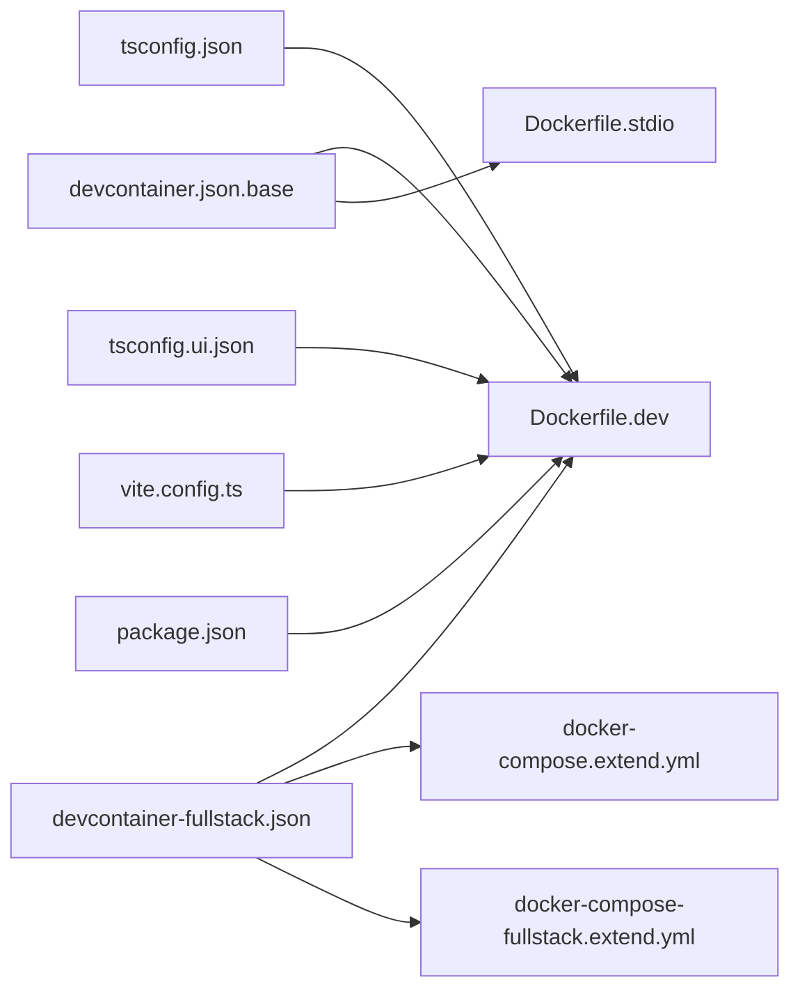

# VS Code Dev Container Configuration

<cite>
**Referenced Files in This Document**
- [.devcontainer/devcontainer.json.base](file://.devcontainer/devcontainer.json.base)
- [.devcontainer/devcontainer-fullstack.json](file://.devcontainer/devcontainer-fullstack.json)
- [.devcontainer/docker-compose.extend.yml](file://.devcontainer/docker-compose.extend.yml)
- [.devcontainer/docker-compose-fullstack.extend.yml](file://.devcontainer/docker-compose-fullstack.extend.yml)
- [.devcontainer/use-config.sh](file://.devcontainer/use-config.sh)
- [.devcontainer/validate.sh](file://.devcontainer/validate.sh)
- [Dockerfile.dev](file://Dockerfile.dev)
- [Dockerfile.stdio](file://Dockerfile.stdio)
- [tsconfig.json](file://tsconfig.json)
- [tsconfig.ui.json](file://tsconfig.ui.json)
- [vite.config.ts](file://vite.config.ts)
- [package.json](file://package.json)
</cite>

## Table of Contents
1. [Introduction](#introduction)
2. [Project Structure](#project-structure)
3. [Core Components](#core-components)
4. [Architecture Overview](#architecture-overview)
5. [Detailed Component Analysis](#detailed-component-analysis)
6. [Dependency Analysis](#dependency-analysis)
7. [Performance Considerations](#performance-considerations)
8. [Troubleshooting Guide](#troubleshooting-guide)
9. [Conclusion](#conclusion)
10. [Appendices](#appendices)

## Introduction
This document explains how to use the VS Code Dev Container setup for Kairos MCP development. It covers the dev container configuration, Node.js and TypeScript settings used during development, multi-stage build process, local code mounting, remote debugging, automatic extension installation, and environment customization. It also provides troubleshooting guidance for common issues such as permissions, network access, and performance optimization, along with instructions for extending the dev container to meet specific needs.

## Project Structure
The dev container configuration is organized under .devcontainer with a base configuration and optional full-stack profile that adds additional services via Docker Compose. The project includes multiple Dockerfiles for different runtime targets (development server and stdio-based server), and TypeScript/Vite configurations that define compilation and UI build behavior.

**Diagram sources**
- [.devcontainer/devcontainer.json.base](file://.devcontainer/devcontainer.json.base)
- [.devcontainer/devcontainer-fullstack.json](file://.devcontainer/devcontainer-fullstack.json)
- [.devcontainer/docker-compose.extend.yml](file://.devcontainer/docker-compose.extend.yml)
- [.devcontainer/docker-compose-fullstack.extend.yml](file://.devcontainer/docker-compose-fullstack.extend.yml)
- [.devcontainer/use-config.sh](file://.devcontainer/use-config.sh)
- [.devcontainer/validate.sh](file://.devcontainer/validate.sh)
- [Dockerfile.dev](file://Dockerfile.dev)
- [Dockerfile.stdio](file://Dockerfile.stdio)
- [tsconfig.json](file://tsconfig.json)
- [tsconfig.ui.json](file://tsconfig.ui.json)
- [vite.config.ts](file://vite.config.ts)
- [package.json](file://package.json)

**Section sources**
- [.devcontainer/devcontainer.json.base](file://.devcontainer/devcontainer.json.base)
- [.devcontainer/devcontainer-fullstack.json](file://.devcontainer/devcontainer-fullstack.json)
- [.devcontainer/docker-compose.extend.yml](file://.devcontainer/docker-compose.extend.yml)
- [.devcontainer/docker-compose-fullstack.extend.yml](file://.devcontainer/docker-compose-fullstack.extend.yml)
- [.devcontainer/use-config.sh](file://.devcontainer/use-config.sh)
- [.devcontainer/validate.sh](file://.devcontainer/validate.sh)
- [Dockerfile.dev](file://Dockerfile.dev)
- [Dockerfile.stdio](file://Dockerfile.stdio)
- [tsconfig.json](file://tsconfig.json)
- [tsconfig.ui.json](file://tsconfig.ui.json)
- [vite.config.ts](file://vite.config.ts)
- [package.json](file://package.json)

## Core Components
- Base dev container configuration: Defines the image, features, extensions, and default lifecycle hooks for a consistent development experience.
- Full-stack profile: Extends the base configuration with additional services (e.g., databases or caches) via Docker Compose overrides.
- Dockerfiles: Provide multi-stage builds for development and stdio server targets, including Node.js version pinning and dependency caching.
- TypeScript and Vite configs: Define compilation targets, module resolution, and UI build behavior used inside the dev container.
- Utility scripts: Validate and switch between dev container configurations.

Key responsibilities:
- Ensure reproducible Node.js and toolchain versions across machines.
- Mount local source code into the container for fast iteration.
- Install recommended VS Code extensions automatically.
- Provide optional service composition for full-stack scenarios.
- Support remote debugging by exposing ports and configuring launch profiles.

**Section sources**
- [.devcontainer/devcontainer.json.base](file://.devcontainer/devcontainer.json.base)
- [.devcontainer/devcontainer-fullstack.json](file://.devcontainer/devcontainer-fullstack.json)
- [.devcontainer/docker-compose.extend.yml](file://.devcontainer/docker-compose.extend.yml)
- [.devcontainer/docker-compose-fullstack.extend.yml](file://.devcontainer/docker-compose-fullstack.extend.yml)
- [Dockerfile.dev](file://Dockerfile.dev)
- [Dockerfile.stdio](file://Dockerfile.stdio)
- [tsconfig.json](file://tsconfig.json)
- [tsconfig.ui.json](file://tsconfig.ui.json)
- [vite.config.ts](file://vite.config.ts)
- [package.json](file://package.json)

## Architecture Overview
The dev container architecture layers a base image with Node.js and development tools, then applies VS Code features and extensions. Optional Docker Compose files add backend services required by the application. The build pipeline uses multi-stage Dockerfiles to optimize cache usage and reduce image size while preserving debuggability.

[No sources needed since this diagram shows conceptual workflow, not actual code structure]

## Detailed Component Analysis

### Dev Container Base Configuration
The base configuration defines the development image, Node.js version, VS Code extensions, and lifecycle hooks. It typically:
- Selects a Node.js image or feature set aligned with the project’s requirements.
- Installs recommended extensions for TypeScript, linting, testing, and debugging.
- Sets up workspace folders and mounts the local repository into the container.
- Provides pre/post-create and post-start hooks to install dependencies and validate the environment.

Customization points:
- Change the Node.js version by updating the image or feature selection.
- Add or remove VS Code extensions to tailor the IDE experience.
- Adjust volume mounts if you need to share additional host directories.

**Section sources**
- [.devcontainer/devcontainer.json.base](file://.devcontainer/devcontainer.json.base)
- [.devcontainer/use-config.sh](file://.devcontainer/use-config.sh)
- [.devcontainer/validate.sh](file://.devcontainer/validate.sh)

### Full-Stack Profile and Docker Compose Overrides
The full-stack profile extends the base configuration by composing additional services required for end-to-end development (for example, database or cache services). It leverages Docker Compose override files to inject extra containers without modifying the base image.

Highlights:
- docker-compose.extend.yml: Adds shared services or volumes commonly used across profiles.
- docker-compose-fullstack.extend.yml: Adds services specific to the full-stack scenario.
- The profile references these compose files from the dev container configuration.

Usage:
- Open the repository in VS Code and select the full-stack dev container profile.
- The compose files will start auxiliary services alongside your app.

**Section sources**
- [.devcontainer/devcontainer-fullstack.json](file://.devcontainer/devcontainer-fullstack.json)
- [.devcontainer/docker-compose.extend.yml](file://.devcontainer/docker-compose.extend.yml)
- [.devcontainer/docker-compose-fullstack.extend.yml](file://.devcontainer/docker-compose-fullstack.extend.yml)

### Multi-Stage Build Process
The project uses separate Dockerfiles for different targets:
- Development server target: Optimized for interactive development, hot reload, and debugging.
- Stdio server target: Minimal image suitable for running the CLI/stdio mode.

Typical stages:
- Builder stage: Installs dependencies and compiles TypeScript using tsconfig definitions.
- Runtime stage: Copies only necessary artifacts and sets the entrypoint for the app.

Benefits:
- Faster rebuilds due to layer caching.
- Smaller runtime images.
- Consistent toolchain across environments.

Customization:
- Update Node.js version in the builder stage to match package.json engines.
- Add additional build steps (e.g., asset generation) before copying artifacts.

**Section sources**
- [Dockerfile.dev](file://Dockerfile.dev)
- [Dockerfile.stdio](file://Dockerfile.stdio)
- [tsconfig.json](file://tsconfig.json)
- [tsconfig.ui.json](file://tsconfig.ui.json)
- [vite.config.ts](file://vite.config.ts)
- [package.json](file://package.json)

### TypeScript Compilation Settings
TypeScript configuration defines the compilation target, module system, path aliases, and strictness flags. The UI-specific config tailors output for the frontend build pipeline.

Key aspects:
- Target and module options ensure compatibility with the Node.js runtime used in the dev container.
- Path mappings support clean imports across packages.
- Separate UI config aligns with Vite’s expectations.

Recommendations:
- Keep tsconfig settings aligned with the Node.js version in the dev container.
- Use incremental builds to speed up recompilation during development.

**Section sources**
- [tsconfig.json](file://tsconfig.json)
- [tsconfig.ui.json](file://tsconfig.ui.json)
- [vite.config.ts](file://vite.config.ts)

### Development Dependencies and Scripts
Development dependencies include linters, formatters, test runners, and build tools. Scripts orchestrate tasks like building, testing, and serving the application.

Guidance:
- Ensure all dev dependencies are installed inside the container via lifecycle hooks.
- Pin versions in package.json to maintain consistency across machines.

**Section sources**
- [package.json](file://package.json)

### Remote Debugging Setup
To enable remote debugging:
- Expose the debugger port in the dev container configuration.
- Configure a VS Code launch profile to attach to the running process.
- Start the app with debugging flags enabled.

Best practices:
- Use named ports to avoid conflicts.
- Restrict debugging exposure to localhost when possible.
- Leverage VS Code’s integrated terminal inside the container for streamlined workflows.

**Section sources**
- [.devcontainer/devcontainer.json.base](file://.devcontainer/devcontainer.json.base)
- [.devcontainer/devcontainer-fullstack.json](file://.devcontainer/devcontainer-fullstack.json)

### Local Code Mounting and Hot Reload
Local code is mounted into the container so changes on the host reflect immediately. For optimal performance:
- Prefer bind mounts over copy-on-build for source code.
- Exclude node_modules from sync to avoid overhead.
- Enable file watching optimizations in the editor and build tools.

**Section sources**
- [.devcontainer/devcontainer.json.base](file://.devcontainer/devcontainer.json.base)

### Automatic Extension Installation
Recommended extensions are installed automatically when the dev container starts. This ensures consistent tooling across team members.

How it works:
- The dev container configuration lists extensions to install.
- VS Code installs them on first run and updates them according to policy.

Customization:
- Add language-specific or productivity extensions as needed.
- Remove unnecessary extensions to reduce startup time.

**Section sources**
- [.devcontainer/devcontainer.json.base](file://.devcontainer/devcontainer.json.base)

### Environment Validation and Switching Utilities
Utility scripts help validate the dev container environment and switch between configurations:
- validate.sh: Checks prerequisites and environment variables.
- use-config.sh: Switches between base and full-stack profiles.

Usage:
- Run validation after opening the dev container to catch misconfiguration early.
- Use the switching script to toggle profiles without manual edits.

**Section sources**
- [.devcontainer/validate.sh](file://.devcontainer/validate.sh)
- [.devcontainer/use-config.sh](file://.devcontainer/use-config.sh)

## Dependency Analysis
The dev container depends on:
- Node.js runtime and toolchain defined in the Dockerfiles.
- TypeScript and Vite configurations for compilation and UI builds.
- Optional Docker Compose files for auxiliary services.
- VS Code extensions for IDE capabilities.

**Diagram sources**
- [.devcontainer/devcontainer.json.base](file://.devcontainer/devcontainer.json.base)
- [.devcontainer/devcontainer-fullstack.json](file://.devcontainer/devcontainer-fullstack.json)
- [.devcontainer/docker-compose.extend.yml](file://.devcontainer/docker-compose.extend.yml)
- [.devcontainer/docker-compose-fullstack.extend.yml](file://.devcontainer/docker-compose-fullstack.extend.yml)
- [Dockerfile.dev](file://Dockerfile.dev)
- [Dockerfile.stdio](file://Dockerfile.stdio)
- [tsconfig.json](file://tsconfig.json)
- [tsconfig.ui.json](file://tsconfig.ui.json)
- [vite.config.ts](file://vite.config.ts)
- [package.json](file://package.json)

**Section sources**
- [.devcontainer/devcontainer.json.base](file://.devcontainer/devcontainer.json.base)
- [.devcontainer/devcontainer-fullstack.json](file://.devcontainer/devcontainer-fullstack.json)
- [.devcontainer/docker-compose.extend.yml](file://.devcontainer/docker-compose.extend.yml)
- [.devcontainer/docker-compose-fullstack.extend.yml](file://.devcontainer/docker-compose-fullstack.extend.yml)
- [Dockerfile.dev](file://Dockerfile.dev)
- [Dockerfile.stdio](file://Dockerfile.stdio)
- [tsconfig.json](file://tsconfig.json)
- [tsconfig.ui.json](file://tsconfig.ui.json)
- [vite.config.ts](file://vite.config.ts)
- [package.json](file://package.json)

## Performance Considerations
- Cache Node.js modules in Docker layers to speed up rebuilds.
- Avoid syncing large directories (e.g., node_modules) into the container.
- Use incremental TypeScript builds and Vite’s dev server for fast feedback.
- Limit background processes and heavy extensions in the dev container.
- Prefer Linux-native filesystems for better file watch performance.

[No sources needed since this section provides general guidance]

## Troubleshooting Guide
Common issues and resolutions:
- Permission problems:
  - Ensure the user inside the container has write access to mounted directories.
  - Adjust volume mount ownership or use rootless modes appropriately.
- Network access:
  - Verify proxy settings and DNS resolution inside the container.
  - Confirm that required ports are exposed and not blocked by host firewalls.
- Slow builds:
  - Check that dependency caching is effective.
  - Reduce unnecessary file syncs and disable unused extensions.
- Service connectivity:
  - Validate Docker Compose services are running and reachable via internal networking.
  - Inspect logs for initialization errors.

Validation helpers:
- Use the provided validation script to check prerequisites and environment variables.
- Switch profiles using the configuration utility to isolate issues.

**Section sources**
- [.devcontainer/validate.sh](file://.devcontainer/validate.sh)
- [.devcontainer/use-config.sh](file://.devcontainer/use-config.sh)
- [.devcontainer/devcontainer.json.base](file://.devcontainer/devcontainer.json.base)
- [.devcontainer/devcontainer-fullstack.json](file://.devcontainer/devcontainer-fullstack.json)

## Conclusion
The Kairos MCP dev container setup provides a consistent, reproducible development environment across machines. By leveraging a base configuration, optional full-stack profile, multi-stage Dockerfiles, and well-defined TypeScript/Vite settings, developers can focus on coding rather than environment management. With proper debugging, extension automation, and performance tuning, teams can collaborate efficiently and minimize “works on my machine” issues.

[No sources needed since this section summarizes without analyzing specific files]

## Appendices

### How to Customize the Development Environment
- Change Node.js version:
  - Update the image or feature selection in the dev container configuration and align Dockerfiles accordingly.
- Add new services:
  - Extend docker-compose.override files to include additional containers.
- Tailor VS Code extensions:
  - Modify the extension list in the dev container configuration.
- Adjust build behavior:
  - Edit tsconfig and vite configurations to change compilation targets or UI build options.

**Section sources**
- [.devcontainer/devcontainer.json.base](file://.devcontainer/devcontainer.json.base)
- [.devcontainer/devcontainer-fullstack.json](file://.devcontainer/devcontainer-fullstack.json)
- [.devcontainer/docker-compose.extend.yml](file://.devcontainer/docker-compose.extend.yml)
- [.devcontainer/docker-compose-fullstack.extend.yml](file://.devcontainer/docker-compose-fullstack.extend.yml)
- [Dockerfile.dev](file://Dockerfile.dev)
- [Dockerfile.stdio](file://Dockerfile.stdio)
- [tsconfig.json](file://tsconfig.json)
- [tsconfig.ui.json](file://tsconfig.ui.json)
- [vite.config.ts](file://vite.config.ts)