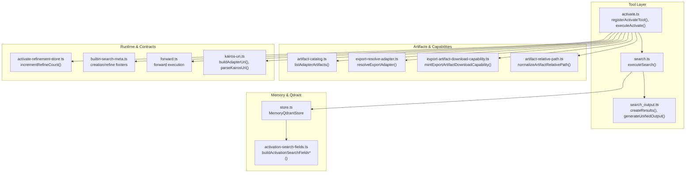
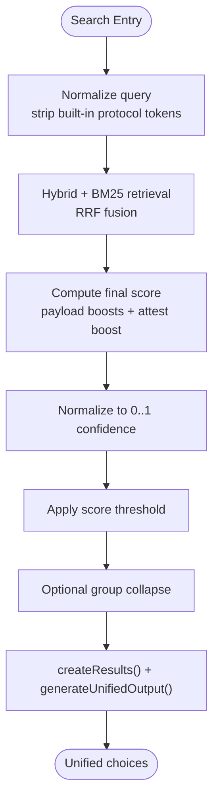
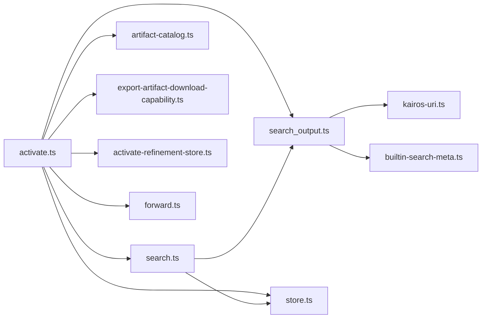

# Activate Tool

<cite>
**Referenced Files in This Document**
- [activate.ts](file://src/tools/activate.ts)
- [activate_schema.ts](file://src/tools/activate_schema.ts)
- [search.ts](file://src/tools/search.ts)
- [search_output.ts](file://src/tools/search_output.ts)
- [store.ts](file://src/services/memory/store.ts)
- [activation-search-fields.ts](file://src/services/memory/activation-search-fields.ts)
- [activate-refinement-store.ts](file://src/services/activate-refinement-store.ts)
- [export-artifact-download-capability.ts](file://src/services/export-artifact-download-capability.ts)
- [artifact-catalog.ts](file://src/tools/artifact-catalog.ts)
- [export-resolve-adapter.ts](file://src/tools/export-resolve-adapter.ts)
- [artifact-relative-path.ts](file://src/tools/artifact-relative-path.ts)
- [kairos-uri.ts](file://src/tools/kairos-uri.ts)
- [builtin-search-meta.ts](file://src/constants/builtin-search-meta.ts)
- [search-query.md](file://docs/architecture/search-query.md)
- [forward.ts](file://src/tools/forward.ts)
</cite>

## Table of Contents
1. [Introduction](#introduction)
2. [Project Structure](#project-structure)
3. [Core Components](#core-components)
4. [Architecture Overview](#architecture-overview)
5. [Detailed Component Analysis](#detailed-component-analysis)
6. [Dependency Analysis](#dependency-analysis)
7. [Performance Considerations](#performance-considerations)
8. [Troubleshooting Guide](#troubleshooting-guide)
9. [Conclusion](#conclusion)
10. [Appendices](#appendices)

## Introduction
The Activate Tool is the entry point for discovering and ranking protocol adapters based on user intent. It orchestrates semantic search, transforms raw Qdrant scores into bounded confidence, enriches choices with linked artifacts and next actions, and integrates with the refinement loop and forward execution. This document explains the semantic search pipeline, ranking and scoring, input/output schemas, artifact linking, command materialization, refinement store integration, and practical usage patterns.

## Project Structure
The Activate Tool is implemented as an MCP tool with a tight integration to the search pipeline and memory store. Key modules include:
- Tool entry and orchestration: activate.ts
- Input/output schemas: activate_schema.ts
- Search pipeline: search.ts and search_output.ts
- Memory store and Qdrant integration: store.ts
- Activation search fields: activation-search-fields.ts
- Refinement tracking: activate-refinement-store.ts
- Artifact linking and download capabilities: export-artifact-download-capability.ts, artifact-catalog.ts, export-resolve-adapter.ts, artifact-relative-path.ts
- URI handling: kairos-uri.ts
- Built-in meta for creation/refine footers: builtin-search-meta.ts
- Workflow and architecture docs: search-query.md
- Forward tool integration: forward.ts



**Diagram sources**
- [activate.ts:208-234](file://src/tools/activate.ts#L208-L234)
- [search.ts:187-248](file://src/tools/search.ts#L187-L248)
- [search_output.ts:117-238](file://src/tools/search_output.ts#L117-L238)
- [store.ts:142-144](file://src/services/memory/store.ts#L142-L144)
- [activation-search-fields.ts:42-92](file://src/services/memory/activation-search-fields.ts#L42-L92)
- [artifact-catalog.ts](file://src/tools/artifact-catalog.ts)
- [export-resolve-adapter.ts](file://src/tools/export-resolve-adapter.ts)
- [export-artifact-download-capability.ts:61-87](file://src/services/export-artifact-download-capability.ts#L61-L87)
- [artifact-relative-path.ts](file://src/tools/artifact-relative-path.ts)
- [activate-refinement-store.ts:13-23](file://src/services/activate-refinement-store.ts#L13-L23)
- [builtin-search-meta.ts](file://src/constants/builtin-search-meta.ts)
- [forward.ts:93-317](file://src/tools/forward.ts#L93-L317)
- [kairos-uri.ts](file://src/tools/kairos-uri.ts)

**Section sources**
- [activate.ts:236-283](file://src/tools/activate.ts#L236-L283)
- [search.ts:187-248](file://src/tools/search.ts#L187-L248)
- [store.ts:20-53](file://src/services/memory/store.ts#L20-L53)

## Core Components
- Activate Tool orchestration: registers the tool, validates inputs, executes search, maps results to activation choices, and enriches with artifacts and next actions.
- Search pipeline: performs hybrid vector and sparse retrieval, applies thresholds, and generates unified choices with roles (match/refine/create).
- Memory store: exposes searchMemories and Qdrant client access for vector operations.
- Activation search fields: constructs dense/sparse text fields for activation-focused embeddings.
- Refinement store: tracks refinement iterations per execution to gate footer messages.
- Artifact linking: resolves adapter artifacts, mints short-lived download capabilities, and produces shell materialization commands.
- Forward integration: choices include next_action guidance to call forward with the selected adapter URI.

**Section sources**
- [activate.ts:208-234](file://src/tools/activate.ts#L208-L234)
- [search.ts:139-181](file://src/tools/search.ts#L139-L181)
- [store.ts:142-144](file://src/services/memory/store.ts#L142-L144)
- [activation-search-fields.ts:42-92](file://src/services/memory/activation-search-fields.ts#L42-L92)
- [activate-refinement-store.ts:13-23](file://src/services/activate-refinement-store.ts#L13-L23)
- [export-artifact-download-capability.ts:61-87](file://src/services/export-artifact-download-capability.ts#L61-L87)
- [forward.ts:93-317](file://src/tools/forward.ts#L93-L317)

## Architecture Overview
The Activate Tool follows a strict protocol: activate → forward (loop) → reward. It leverages Qdrant for hybrid retrieval and ranking, normalizes scores to a 0.0–1.0 confidence range, and returns choices with precise next actions.

```mermaid
sequenceDiagram
participant Agent as "Agent"
participant Activate as "activate.ts"
participant Search as "search.ts"
participant Store as "MemoryQdrantStore"
participant Qdrant as "Qdrant"
participant Output as "search_output.ts"
Agent->>Activate : "activate(query, execution_id?, space?, max_choices?)"
Activate->>Search : "executeSearch(input, space scope)"
Search->>Store : "searchMemories(query, limit, collapse)"
Store->>Qdrant : "hybrid + BM25 search"
Qdrant-->>Store : "ranked memories + scores"
Store-->>Search : "candidates"
Search->>Output : "createResults(), generateUnifiedOutput()"
Output-->>Search : "choices (match/refine/create)"
Search-->>Activate : "SearchOutput"
Activate->>Activate : "mapSearchToActivate() enrich artifacts + next_action"
Activate-->>Agent : "ActivateOutput(choices[], next_action, execution_id)"
```

**Diagram sources**
- [activate.ts:208-234](file://src/tools/activate.ts#L208-L234)
- [search.ts:187-248](file://src/tools/search.ts#L187-L248)
- [store.ts:142-144](file://src/services/memory/store.ts#L142-L144)
- [search_output.ts:117-238](file://src/tools/search_output.ts#L117-L238)

## Detailed Component Analysis

### Semantic Search and Ranking
- Hybrid retrieval: dense vectors (primary, adapter title, activation patterns), sparse BM25, and reciprocal rank fusion (RRF) to combine signals.
- Payload boosting: final score includes adapter metadata matches and attest boost for quality.
- Score normalization: raw Qdrant scores mapped to bounded confidence in 0.0–1.0 for public exposure.
- Thresholding and grouping: configurable thresholds and optional group collapse to improve recall and diversity.
- Cache: Redis-backed cache for unified activate/search results keyed by normalized query, space, and limits.



**Diagram sources**
- [search.ts:37-55](file://src/tools/search.ts#L37-L55)
- [search.ts:139-181](file://src/tools/search.ts#L139-L181)
- [search_output.ts:77-92](file://src/tools/search_output.ts#L77-L92)
- [search_output.ts:117-238](file://src/tools/search_output.ts#L117-L238)
- [search-query.md:94-125](file://docs/architecture/search-query.md#L94-L125)

**Section sources**
- [search.ts:187-248](file://src/tools/search.ts#L187-L248)
- [search_output.ts:70-92](file://src/tools/search_output.ts#L70-L92)
- [search-query.md:11-25](file://docs/architecture/search-query.md#L11-L25)

### Input Schema: Query Parameters, Execution ID, Space Scoping
- query: Required string describing the desired adapter behavior.
- execution_id: Optional UUID to continue a refinement sequence; echoed back to preserve context.
- space/space_id: Optional scoping to a user/group/personal space; supports aliases.
- max_choices: Optional integer constrained by minimum and maximum caps.

Space scoping:
- When provided, the search runs within the specified space context; otherwise falls back to tenant defaults.
- Cache keys incorporate the effective space to isolate results per scope.

**Section sources**
- [activate_schema.ts:69-88](file://src/tools/activate_schema.ts#L69-L88)
- [search.ts:193-198](file://src/tools/search.ts#L193-L198)
- [search.ts:201-247](file://src/tools/search.ts#L201-L247)

### Output Schema: Choices, Roles, Activation Scores, Next Action
- must_obey: Always true; agents must select one choice and follow its next_action.
- message: Human-readable summary of matches and guidance.
- next_action: Global directive to pick a choice and follow its guidance.
- execution_id: Server-issued execution identifier for refinement continuity.
- query: Echo of the input query for client/UI context.
- choices: Array of discriminated union items:
  - match: Adapter found; includes uri, label, adapter_name, activation_score (0.0–1.0), tags, next_action, adapter_version, activation_patterns, space_name, slug, forward_first_call, optional linked_artifacts.
  - refine: Meta choice to refine the query; includes forward_first_call to start refine protocol.
  - create: Meta choice to create a new adapter; forward_first_call is null.
- kairos_local_artifact_dir: Optional hints for local artifact directory resolution.

Roles and semantics:
- match: Found adapter with bounded confidence; includes artifact materialization commands when applicable.
- refine: Guidance to refine the query using a dedicated protocol.
- create: Option to create a new adapter when no relevant matches exist.

**Section sources**
- [activate_schema.ts:90-116](file://src/tools/activate_schema.ts#L90-L116)
- [search_output.ts:52-66](file://src/tools/search_output.ts#L52-L66)
- [search_output.ts:117-238](file://src/tools/search_output.ts#L117-L238)

### Artifact Linking Mechanism and Materialization
- Adapter artifacts: For each match, the tool resolves the adapter and lists linked artifacts.
- Capability minting: Short-lived download URLs are minted with signatures and expiry; includes filename, content-type, and SHA-256.
- Relative path normalization: Ensures safe and consistent artifact paths; defaults to a safe structure if unspecified.
- Materialization command: Generates a shell command to download, verify SHA-256, and set permissions in the designated local artifact directory.

```mermaid
sequenceDiagram
participant Activate as "activate.ts"
participant ER as "export-resolve-adapter.ts"
participant AC as "artifact-catalog.ts"
participant EAC as "export-artifact-download-capability.ts"
participant AR as "artifact-relative-path.ts"
Activate->>ER : "resolveExportAdapter(adapterUri)"
ER-->>Activate : "adapterId"
Activate->>AC : "listAdapterArtifacts(adapterId)"
AC-->>Activate : "artifact list"
Activate->>AR : "normalizeArtifactRelativePath()"
Activate->>EAC : "mintExportArtifactDownloadCapability(artifact)"
EAC-->>Activate : "{url, expires_at, filename, content_type}"
Activate-->>Activate : "materializeCommand(download_url, relative_path, sha256)"
```

**Diagram sources**
- [activate.ts:124-176](file://src/tools/activate.ts#L124-L176)
- [export-resolve-adapter.ts](file://src/tools/export-resolve-adapter.ts)
- [artifact-catalog.ts](file://src/tools/artifact-catalog.ts)
- [export-artifact-download-capability.ts:61-87](file://src/services/export-artifact-download-capability.ts#L61-L87)
- [artifact-relative-path.ts](file://src/tools/artifact-relative-path.ts)

**Section sources**
- [activate.ts:124-176](file://src/tools/activate.ts#L124-L176)
- [export-artifact-download-capability.ts:61-87](file://src/services/export-artifact-download-capability.ts#L61-L87)

### Refinement Store Integration
- Refinement count: Per execution_id, increments a counter to limit footer messages during early refinement cycles.
- TTL: Counter persists for a defined window to maintain session semantics.
- Footer gating: When refinement count exceeds a threshold, refine footer is hidden to avoid overwhelming the agent.

**Section sources**
- [activate-refinement-store.ts:13-23](file://src/services/activate-refinement-store.ts#L13-L23)
- [activate.ts:214-217](file://src/tools/activate.ts#L214-L217)

### Integration with Forward Tool
- next_action guidance: Choices include precise instructions to call forward with the selected adapter URI.
- First-call forwarding: Match choices include forward_first_call with the adapter slug-form URI; refine choices include a dedicated refine URI.
- Chain root resolution: When applicable, the tool resolves the chain root to present the correct URI/label for forwarding.

**Section sources**
- [search_output.ts:134-173](file://src/tools/search_output.ts#L134-L173)
- [forward.ts:93-317](file://src/tools/forward.ts#L93-L317)

### Canonical Adapter URI Resolution
- Slug normalization: If the choice lacks a slug, the tool derives one from adapter_name or label to produce a stable kairos://adapter/{slug} URI.
- Validation: Emits an error if a non-slug URI is encountered at emit time.

**Section sources**
- [activate.ts:29-41](file://src/tools/activate.ts#L29-L41)
- [kairos-uri.ts](file://src/tools/kairos-uri.ts)

## Dependency Analysis
- activate.ts depends on:
  - search.ts for hybrid retrieval and unified output
  - search_output.ts for result shaping and role assignment
  - memory store for vector search
  - artifact catalog and capability minting for linked artifacts
  - refinement store for gating refine footer
  - forward tool for next_action guidance
- search.ts depends on:
  - MemoryQdrantStore.searchMemories
  - Redis cache for performance
  - search_output.ts for unified output construction
- search_output.ts depends on:
  - adapter navigation and memory accessors
  - URI building and slug normalization
  - built-in meta for refine/create footers



**Diagram sources**
- [activate.ts:208-234](file://src/tools/activate.ts#L208-L234)
- [search.ts:187-248](file://src/tools/search.ts#L187-L248)
- [search_output.ts:117-238](file://src/tools/search_output.ts#L117-L238)
- [store.ts:142-144](file://src/services/memory/store.ts#L142-L144)
- [artifact-catalog.ts](file://src/tools/artifact-catalog.ts)
- [export-artifact-download-capability.ts:61-87](file://src/services/export-artifact-download-capability.ts#L61-L87)
- [activate-refinement-store.ts:13-23](file://src/services/activate-refinement-store.ts#L13-L23)
- [forward.ts:93-317](file://src/tools/forward.ts#L93-L317)
- [kairos-uri.ts](file://src/tools/kairos-uri.ts)
- [builtin-search-meta.ts](file://src/constants/builtin-search-meta.ts)

**Section sources**
- [activate.ts:208-234](file://src/tools/activate.ts#L208-L234)
- [search.ts:187-248](file://src/tools/search.ts#L187-L248)
- [search_output.ts:117-238](file://src/tools/search_output.ts#L117-L238)

## Performance Considerations
- Caching: Unified activate/search results are cached with a TTL to reduce repeated Qdrant queries for identical inputs and scopes.
- Limit tuning: max_choices is clamped to configured min/max; larger limits increase latency and cost.
- Group collapse: Optional de-duplication by chain root reduces redundant choices and improves UX.
- Score normalization: Converting raw scores to bounded confidence avoids downstream recomputation and ensures consistent UI behavior.
- Embedding generation: Batched embeddings are used for activation-aware fields; failures fall back to zero vectors to keep the pipeline resilient.

[No sources needed since this section provides general guidance]

## Troubleshooting Guide
- No relevant results:
  - The tool returns only refine/create choices when no matches meet the threshold.
  - Verify query phrasing and consider using forward with refine to improve matching.
- Invalid adapter URI:
  - Emit-time validation requires slug-form URIs; ensure adapter slugs are normalized.
- Artifact download failures:
  - Verify capability minting succeeded and the download URL is still valid (TTL).
  - Confirm the local artifact directory path and permissions.
- Execution continuity:
  - Provide execution_id to refine; the refinement store increments counts per execution to gate footer messages.
- Forward errors:
  - Ensure the chosen adapter URI is correct and the adapter exists; forward handles missing layers gracefully.

**Section sources**
- [activate.ts:152-156](file://src/tools/activate.ts#L152-L156)
- [activate.ts:40](file://src/tools/activate.ts#L40)
- [export-artifact-download-capability.ts:61-87](file://src/services/export-artifact-download-capability.ts#L61-L87)
- [activate-refinement-store.ts:13-23](file://src/services/activate-refinement-store.ts#L13-L23)
- [forward.ts:106-108](file://src/tools/forward.ts#L106-L108)

## Conclusion
The Activate Tool provides a robust, semantically grounded discovery mechanism for protocol adapters. By leveraging hybrid vector and sparse retrieval, normalizing scores, and enriching choices with artifacts and precise next actions, it enables agents to confidently select and execute the right adapter. The refinement store and forward integration close the loop for iterative improvement and execution.

[No sources needed since this section summarizes without analyzing specific files]

## Appendices

### Practical Examples

- Example 1: Query yields multiple matches
  - Input: query with sufficient specificity
  - Output: multiple match choices with activation_score, linked_artifacts (if any), and next_action guiding forward
  - Interpretation: choose the highest-confidence match; if artifacts are present, materialize them first

- Example 2: No relevant results
  - Input: vague or novel query
  - Output: refine and create choices only
  - Interpretation: refine the query using the refine protocol or create a new adapter

- Example 3: Execution refinement
  - Input: include execution_id to continue a refinement loop
  - Behavior: refine footer is gated based on internal count; subsequent activates echo the same execution_id

- Example 4: Artifact-linked adapter
  - Output: linked_artifacts with download_url, sha256, and materialize command
  - Interpretation: download and verify artifacts, then call forward with the adapter URI

**Section sources**
- [activate.ts:180-205](file://src/tools/activate.ts#L180-L205)
- [search_output.ts:220-237](file://src/tools/search_output.ts#L220-L237)
- [activate-refinement-store.ts:13-23](file://src/services/activate-refinement-store.ts#L13-L23)

### Best Practices for Semantic Search Queries
- Keep queries concise yet descriptive; avoid including built-in protocol URIs/tokens.
- Use activation patterns and tags present in adapters to improve matching.
- Iterate with refine when initial results are weak; reuse execution_id for continuity.
- Prefer slug-form adapter URIs when invoking forward to ensure deterministic routing.

**Section sources**
- [search.ts:37-55](file://src/tools/search.ts#L37-L55)
- [search_output.ts:134-173](file://src/tools/search_output.ts#L134-L173)