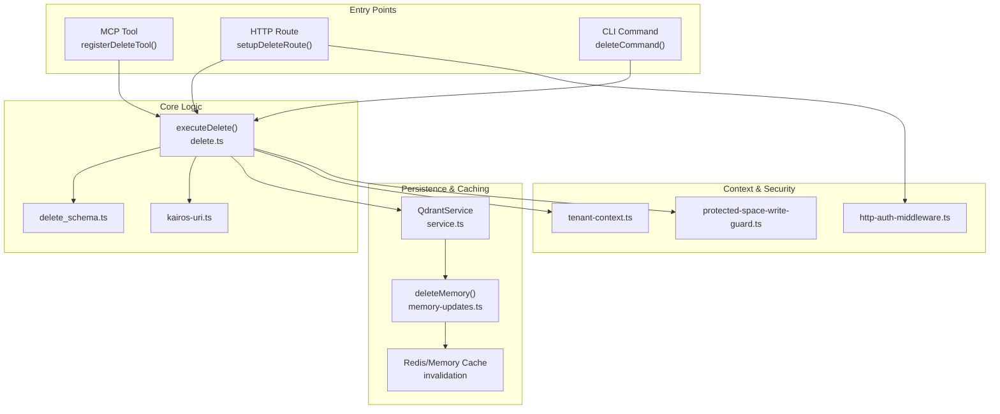
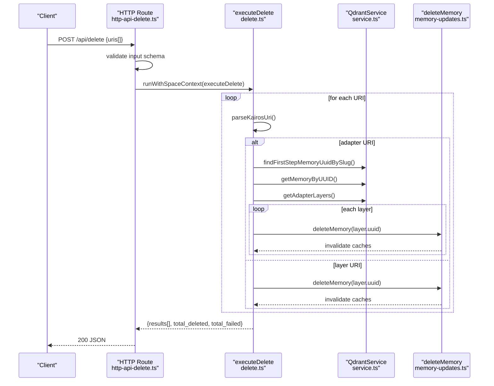
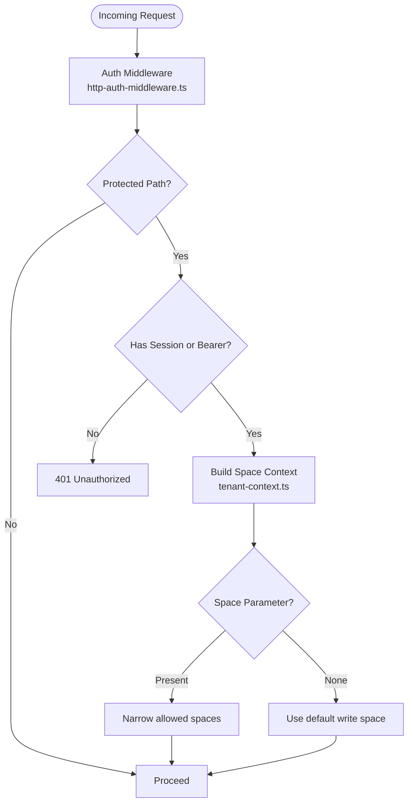
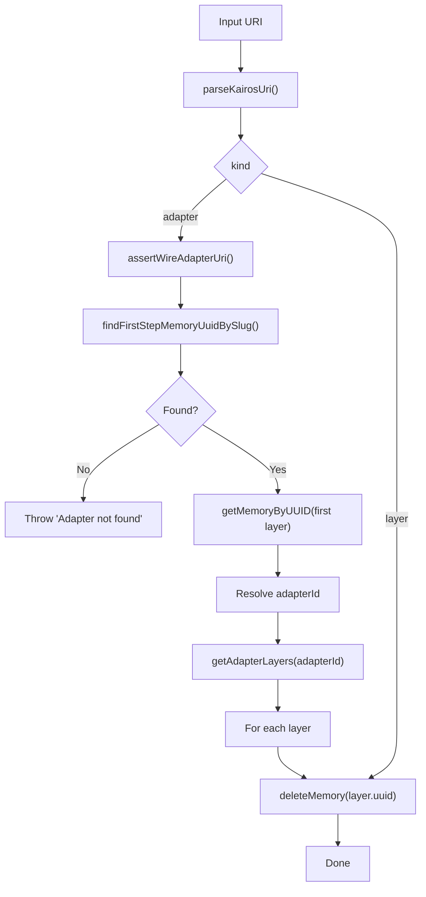
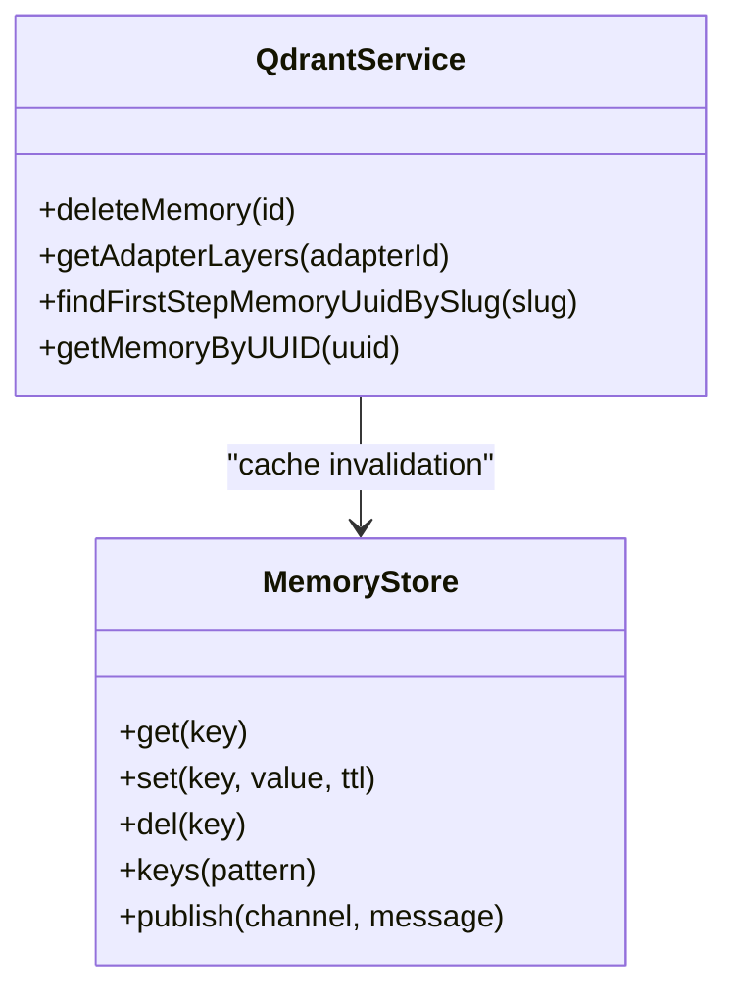
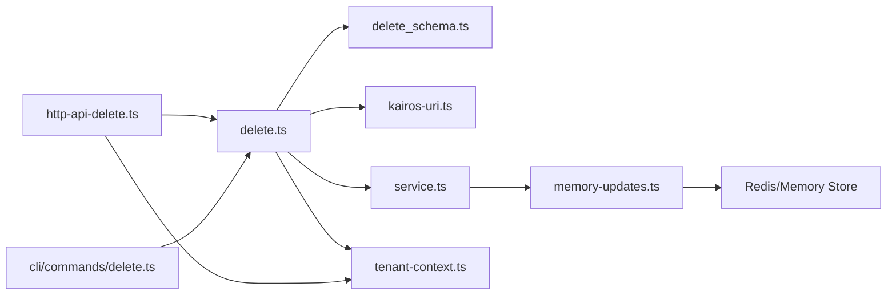

# Delete Tool

<cite>
**Referenced Files in This Document**
- [delete.ts](file://src/tools/delete.ts)
- [delete_schema.ts](file://src/tools/delete_schema.ts)
- [http-api-delete.ts](file://src/http/http-api-delete.ts)
- [delete.ts](file://src/cli/commands/delete.ts)
- [service.ts](file://src/services/qdrant/service.ts)
- [memory-updates.ts](file://src/services/qdrant/memory-updates.ts)
- [kairos-uri.ts](file://src/tools/kairos-uri.ts)
- [tenant-context.ts](file://src/utils/tenant-context.ts)
- [http-auth-middleware.ts](file://src/http/http-auth-middleware.ts)
- [workflow-delete.md](file://docs/architecture/workflow-delete.md)
- [memory-store.ts](file://src/services/memory-store.ts)
- [protected-space-write-guard.ts](file://src/utils/protected-space-write-guard.ts)
- [audit-log-events.ts](file://src/utils/audit-log-events.ts)
</cite>

## Table of Contents
1. [Introduction](#introduction)
2. [Project Structure](#project-structure)
3. [Core Components](#core-components)
4. [Architecture Overview](#architecture-overview)
5. [Detailed Component Analysis](#detailed-component-analysis)
6. [Dependency Analysis](#dependency-analysis)
7. [Performance Considerations](#performance-considerations)
8. [Troubleshooting Guide](#troubleshooting-guide)
9. [Conclusion](#conclusion)
10. [Appendices](#appendices)

## Introduction
The Delete Tool removes adapter and layer resources by URI from the memory store. It supports:
- Deleting a single adapter (all steps) or individual layers
- Bulk deletion via a non-empty array of URIs
- Consistent output schema reporting per-URI status and totals
- Shared execution logic across MCP tool, HTTP API, and CLI
- Integration with the Qdrant memory store and cache invalidation
- Space-aware deletion through tenant context and optional space scoping

This document explains the input/output schemas, permission and scope handling, cascade deletion behavior, audit trail considerations, and operational safety mechanisms.

## Project Structure
The Delete Tool spans three primary entry points and integrates with Qdrant and caching:
- MCP tool registration and execution
- HTTP route for programmatic deletion
- CLI command for local deletion
- Shared execution logic and schema validation
- Qdrant service and memory updates for deletion and cache invalidation
- Tenant context and auth middleware for space scoping and permissions
- Protected space guard to prevent writes to system/app spaces

**Diagram sources**
- [delete.ts:73-115](file://src/tools/delete.ts#L73-L115)
- [http-api-delete.ts:11-35](file://src/http/http-api-delete.ts#L11-L35)
- [delete.ts:11-25](file://src/cli/commands/delete.ts#L11-L25)
- [delete_schema.ts:14-29](file://src/tools/delete_schema.ts#L14-L29)
- [kairos-uri.ts:38-108](file://src/tools/kairos-uri.ts#L38-L108)
- [service.ts:98-100](file://src/services/qdrant/service.ts#L98-L100)
- [memory-updates.ts:199-233](file://src/services/qdrant/memory-updates.ts#L199-L233)
- [tenant-context.ts:293-298](file://src/utils/tenant-context.ts#L293-L298)
- [http-auth-middleware.ts:167-313](file://src/http/http-auth-middleware.ts#L167-L313)
- [protected-space-write-guard.ts:1-16](file://src/utils/protected-space-write-guard.ts#L1-L16)

**Section sources**
- [delete.ts:11-115](file://src/tools/delete.ts#L11-L115)
- [http-api-delete.ts:8-35](file://src/http/http-api-delete.ts#L8-L35)
- [delete.ts:1-27](file://src/cli/commands/delete.ts#L1-L27)
- [delete_schema.ts:1-33](file://src/tools/delete_schema.ts#L1-L33)
- [service.ts:16-152](file://src/services/qdrant/service.ts#L16-L152)
- [memory-updates.ts:199-233](file://src/services/qdrant/memory-updates.ts#L199-L233)
- [tenant-context.ts:293-298](file://src/utils/tenant-context.ts#L293-L298)
- [http-auth-middleware.ts:167-313](file://src/http/http-auth-middleware.ts#L167-L313)
- [protected-space-write-guard.ts:1-16](file://src/utils/protected-space-write-guard.ts#L1-L16)

## Core Components
- Input schema: Non-empty array of adapter or layer URIs
- Output schema: Per-URI result with status and message, plus totals
- Execution: Validates URIs, resolves adapter chains, deletes layers, aggregates results
- Persistence: Delegates to Qdrant delete with cache invalidation
- Context: Uses tenant/space context for scoping and metrics
- Security: Auth middleware enforces access; protected space guard prevents writes to system/app spaces

**Section sources**
- [delete_schema.ts:14-29](file://src/tools/delete_schema.ts#L14-L29)
- [delete.ts:12-71](file://src/tools/delete.ts#L12-L71)
- [memory-updates.ts:199-233](file://src/services/qdrant/memory-updates.ts#L199-L233)
- [tenant-context.ts:293-298](file://src/utils/tenant-context.ts#L293-L298)
- [http-auth-middleware.ts:167-313](file://src/http/http-auth-middleware.ts#L167-L313)
- [protected-space-write-guard.ts:1-16](file://src/utils/protected-space-write-guard.ts#L1-L16)

## Architecture Overview
The Delete Tool follows a shared execution model:
- MCP tool registers the tool with loose input schema and structured output schema
- HTTP route validates JSON input and runs within space context
- CLI command forwards URIs to the same execution logic
- Execution resolves URIs, handles adapters vs layers, and deletes via Qdrant
- Qdrant delete triggers cache invalidation and emits metrics

**Diagram sources**
- [http-api-delete.ts:11-35](file://src/http/http-api-delete.ts#L11-L35)
- [delete.ts:12-71](file://src/tools/delete.ts#L12-L71)
- [service.ts:77-84](file://src/services/qdrant/service.ts#L77-L84)
- [memory-updates.ts:199-233](file://src/services/qdrant/memory-updates.ts#L199-L233)

## Detailed Component Analysis

### Input Schema
- Field: uris (non-empty array)
- Allowed values:
  - Adapter URIs: kairos://adapter/{uuid|slug}
  - Layer URIs: kairos://layer/{uuid}[?execution_id={uuid}]
- Validation ensures at least one URI and correct format.

**Section sources**
- [delete_schema.ts:14-19](file://src/tools/delete_schema.ts#L14-L19)
- [kairos-uri.ts:10-21](file://src/tools/kairos-uri.ts#L10-L21)

### Output Schema
- results: array of objects with uri, status ("deleted"|"error"), message
- total_deleted: number
- total_failed: number
- Behavior: Partial success is supported; total counts reflect per-URI outcomes.

**Section sources**
- [delete_schema.ts:21-29](file://src/tools/delete_schema.ts#L21-L29)
- [workflow-delete.md:47-66](file://docs/architecture/workflow-delete.md#L47-L66)

### Permission Validation and Scope
- Auth middleware enforces authentication for protected paths and scopes requests to allowed spaces
- Space context determines default write space and allowed spaces
- Protected space guard prevents writing to system/app spaces; use personal/group spaces instead

**Diagram sources**
- [http-auth-middleware.ts:167-313](file://src/http/http-auth-middleware.ts#L167-L313)
- [tenant-context.ts:293-298](file://src/utils/tenant-context.ts#L293-L298)
- [protected-space-write-guard.ts:1-16](file://src/utils/protected-space-write-guard.ts#L1-L16)

**Section sources**
- [http-auth-middleware.ts:167-313](file://src/http/http-auth-middleware.ts#L167-L313)
- [tenant-context.ts:293-298](file://src/utils/tenant-context.ts#L293-L298)
- [protected-space-write-guard.ts:1-16](file://src/utils/protected-space-write-guard.ts#L1-L16)

### Cascade Deletion Logic
- Adapter URI:
  - Resolve canonical adapter URI
  - Find first step memory UUID by slug
  - Retrieve adapter head memory to determine adapter ID
  - Fetch all layers for the adapter
  - Delete each layer individually
- Layer URI:
  - Delete the specific layer UUID

**Diagram sources**
- [delete.ts:21-64](file://src/tools/delete.ts#L21-L64)
- [kairos-uri.ts:38-108](file://src/tools/kairos-uri.ts#L38-L108)
- [service.ts:77-84](file://src/services/qdrant/service.ts#L77-L84)

**Section sources**
- [delete.ts:21-64](file://src/tools/delete.ts#L21-L64)
- [kairos-uri.ts:38-108](file://src/tools/kairos-uri.ts#L38-L108)
- [service.ts:77-84](file://src/services/qdrant/service.ts#L77-L84)

### Integration with Memory Store and Cache
- Qdrant delete:
  - Validates ID, checks existence, performs deletion
  - Invalidates memory and search caches and publishes invalidation events
- Memory store:
  - Provides in-memory key-value store for development without Redis
  - Uses space-aware keys and TTL semantics

**Diagram sources**
- [service.ts:98-100](file://src/services/qdrant/service.ts#L98-L100)
- [memory-updates.ts:200-233](file://src/services/qdrant/memory-updates.ts#L200-L233)
- [memory-store.ts:23-177](file://src/services/memory-store.ts#L23-L177)

**Section sources**
- [memory-updates.ts:199-233](file://src/services/qdrant/memory-updates.ts#L199-L233)
- [memory-store.ts:1-178](file://src/services/memory-store.ts#L1-L178)

### Audit Trail Maintenance
- The Delete Tool itself does not emit dedicated audit log entries for deletions
- Embedding/anomaly audit utilities exist for other subsystems and demonstrate the audit event building pattern
- Recommendation: Integrate a dedicated audit event builder for deletion operations to capture actor, target, and outcome

**Section sources**
- [audit-log-events.ts:1-71](file://src/utils/audit-log-events.ts#L1-L71)

### Practical Workflows and Examples
- Single adapter deletion:
  - Input: uris = ["kairos://adapter/{uuid|slug}"]
  - Output: One "deleted" result and totals updated accordingly
- Multiple adapter deletion:
  - Input: uris = ["kairos://adapter/a", "kairos://adapter/b", ...]
  - Output: Per-URI results with combined totals
- Mixed adapter and layer deletion:
  - Input: uris = ["kairos://adapter/{uuid}", "kairos://layer/{uuid}"]
  - Output: Mixed statuses; adapter expands to all layers
- Partial failure:
  - Some URIs fail while others succeed; report per-URI status and totals

**Section sources**
- [workflow-delete.md:76-151](file://docs/architecture/workflow-delete.md#L76-L151)
- [delete_schema.ts:21-29](file://src/tools/delete_schema.ts#L21-L29)

### Safety Mechanisms and Best Practices
- Input validation: Non-empty array of properly formatted URIs
- Existence checks: Qdrant throws when a memory is not found
- Partial success: Continue processing remaining URIs even if one fails
- Cache invalidation: Automatic after delete to prevent stale reads
- Protected spaces: Prevent accidental writes to system/app spaces
- Idempotency: Deleting a non-existent memory raises an error; avoid repeated attempts on the same URI
- Recovery procedures:
  - Re-import training artifacts and re-activate steps to restore adapter chains
  - Use export/download capabilities to back up artifacts prior to deletion

**Section sources**
- [memory-updates.ts:204-210](file://src/services/qdrant/memory-updates.ts#L204-L210)
- [protected-space-write-guard.ts:1-16](file://src/utils/protected-space-write-guard.ts#L1-L16)
- [workflow-delete.md:179-186](file://docs/architecture/workflow-delete.md#L179-L186)

## Dependency Analysis
The Delete Tool depends on:
- URI parsing and validation
- Qdrant service for retrieval and deletion
- Tenant context for space scoping
- Auth middleware for access control
- Cache invalidation for consistency

**Diagram sources**
- [delete.ts:1-11](file://src/tools/delete.ts#L1-L11)
- [delete_schema.ts:1-3](file://src/tools/delete_schema.ts#L1-L3)
- [kairos-uri.ts:1-136](file://src/tools/kairos-uri.ts#L1-L136)
- [service.ts:1-152](file://src/services/qdrant/service.ts#L1-L152)
- [memory-updates.ts:1-235](file://src/services/qdrant/memory-updates.ts#L1-L235)
- [http-api-delete.ts:1-38](file://src/http/http-api-delete.ts#L1-L38)
- [tenant-context.ts:1-307](file://src/utils/tenant-context.ts#L1-L307)
- [delete.ts:1-27](file://src/cli/commands/delete.ts#L1-L27)

**Section sources**
- [delete.ts:1-11](file://src/tools/delete.ts#L1-L11)
- [http-api-delete.ts:1-38](file://src/http/http-api-delete.ts#L1-L38)
- [delete.ts:1-27](file://src/cli/commands/delete.ts#L1-L27)
- [service.ts:1-152](file://src/services/qdrant/service.ts#L1-L152)
- [memory-updates.ts:1-235](file://src/services/qdrant/memory-updates.ts#L1-L235)
- [tenant-context.ts:1-307](file://src/utils/tenant-context.ts#L1-L307)

## Performance Considerations
- Batch URIs efficiently: The executor iterates and deletes per URI; consider batching network calls at the caller level
- Cache invalidation cost: Deletes trigger cache invalidation; monitor latency under bulk operations
- Metrics: MCP tool and Qdrant operations expose counters and timers for observability

[No sources needed since this section provides general guidance]

## Troubleshooting Guide
Common issues and resolutions:
- Invalid URI format:
  - Ensure URIs match kairos://adapter/{uuid|slug} or kairos://layer/{uuid}[?execution_id=...]
- Adapter not found:
  - Confirm the adapter slug exists and resolves to a first-step memory
- Memory not found:
  - Verify the layer UUID exists in the current space
- Authentication failures:
  - Ensure session or Bearer token is valid for protected paths
- Protected space write:
  - Do not attempt to delete in system/app spaces; fork to a personal or group space

**Section sources**
- [kairos-uri.ts:105-108](file://src/tools/kairos-uri.ts#L105-L108)
- [delete.ts:28-30](file://src/tools/delete.ts#L28-L30)
- [memory-updates.ts:207-209](file://src/services/qdrant/memory-updates.ts#L207-L209)
- [http-auth-middleware.ts:248-281](file://src/http/http-auth-middleware.ts#L248-L281)
- [protected-space-write-guard.ts:5-11](file://src/utils/protected-space-write-guard.ts#L5-L11)

## Conclusion
The Delete Tool provides a robust, schema-validated mechanism to remove adapter and layer resources. Its shared execution logic ensures consistent behavior across MCP, HTTP, and CLI. With proper auth, space scoping, and cache invalidation, it supports safe, partial-success deletions. For production hardening, integrate dedicated audit events and adopt pre-deletion backups.

[No sources needed since this section summarizes without analyzing specific files]

## Appendices

### API Definitions
- HTTP endpoint: POST /api/delete
  - Body: { uris: ["kairos://adapter/..."/"kairos://layer/..."] }
  - Response: { results[], total_deleted, total_failed }

**Section sources**
- [http-api-delete.ts:11-35](file://src/http/http-api-delete.ts#L11-L35)
- [delete_schema.ts:14-29](file://src/tools/delete_schema.ts#L14-L29)

### MCP Tool Registration
- Tool name: delete
- Input schema: Loose wrapper around delete_input_schema
- Output schema: delete_output_schema
- Metrics: Input size, duration, errors, calls

**Section sources**
- [delete.ts:73-115](file://src/tools/delete.ts#L73-L115)
- [delete_schema.ts:14-29](file://src/tools/delete_schema.ts#L14-L29)