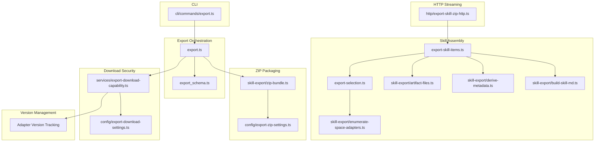
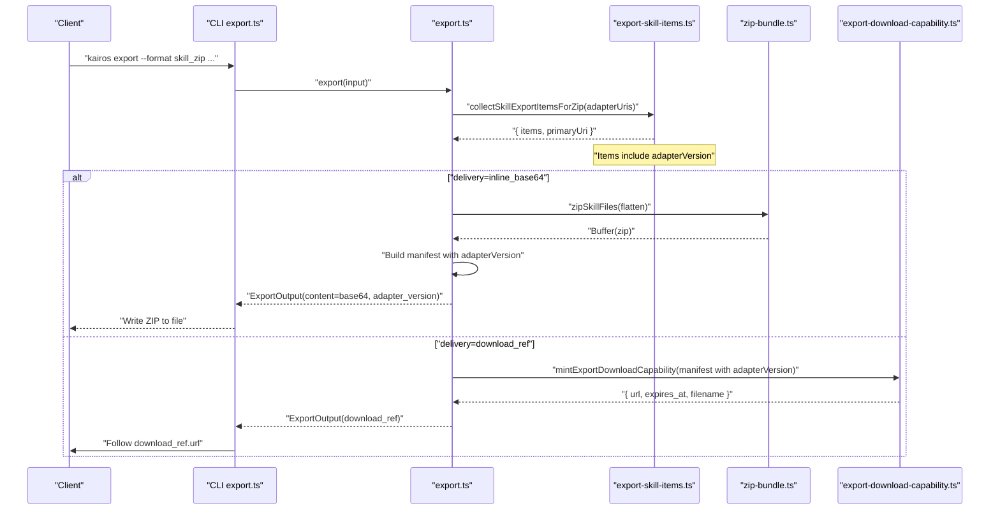
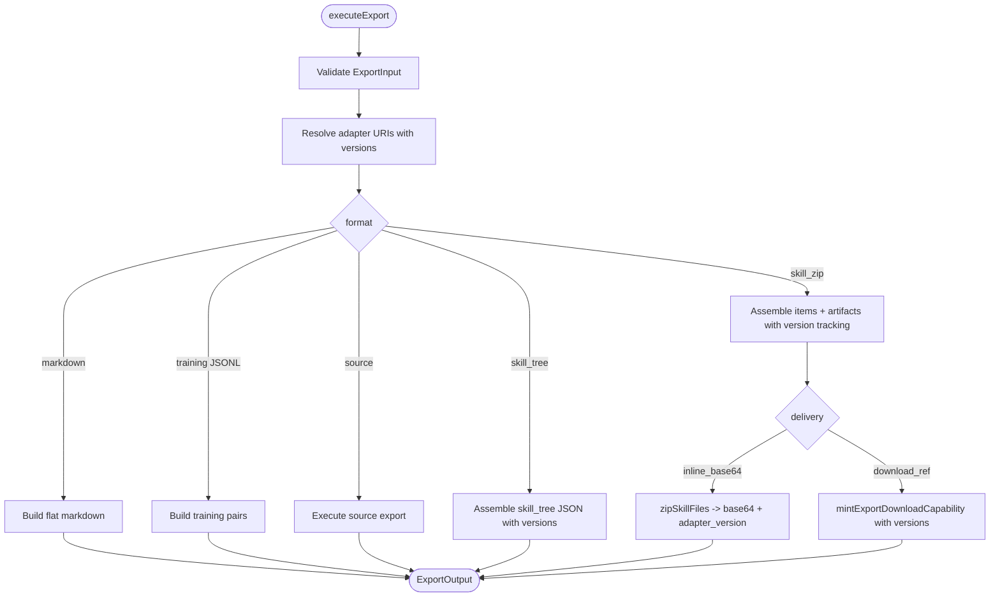
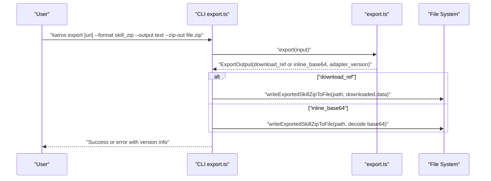
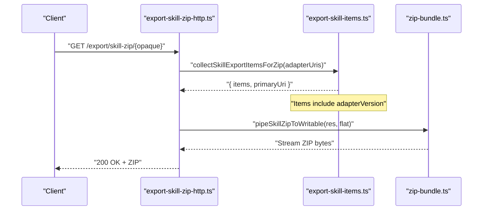
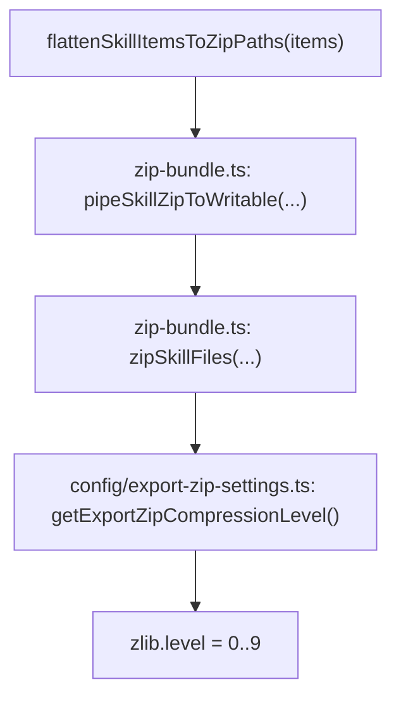
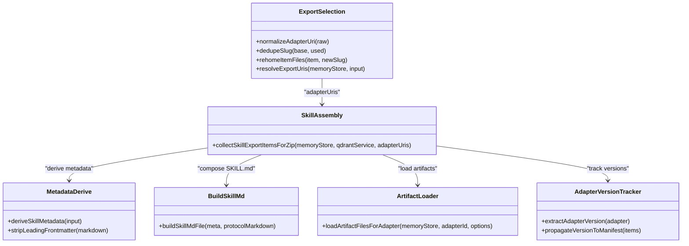
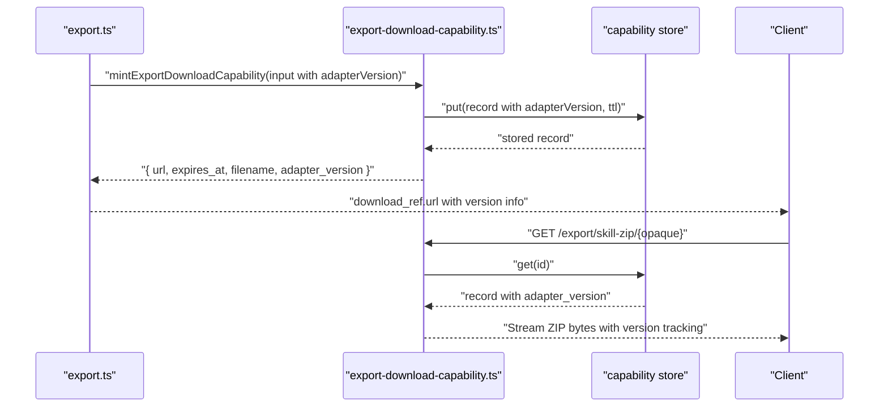
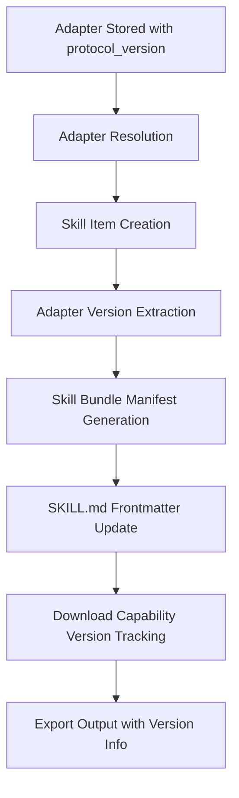
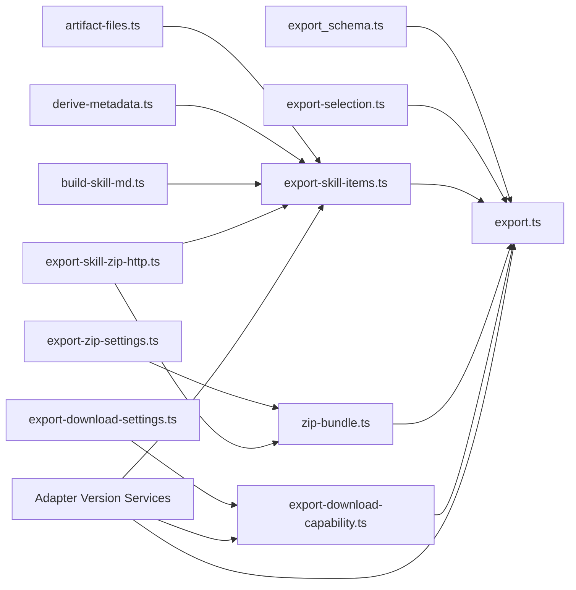

# Export Tool

<cite>
**Referenced Files in This Document**
- [src/tools/export.ts](file://src/tools/export.ts)
- [src/tools/export_schema.ts](file://src/tools/export_schema.ts)
- [src/cli/commands/export.ts](file://src/cli/commands/export.ts)
- [src/http/export-skill-zip-http.ts](file://src/http/export-skill-zip-http.ts)
- [src/config/export-zip-settings.ts](file://src/config/export-zip-settings.ts)
- [src/config/export-download-settings.ts](file://src/config/export-download-settings.ts)
- [src/tools/skill-export/zip-bundle.ts](file://src/tools/skill-export/zip-bundle.ts)
- [src/tools/export-skill-items.ts](file://src/tools/export-skill-items.ts)
- [src/tools/export-selection.ts](file://src/tools/export-selection.ts)
- [src/tools/skill-export/artifact-files.ts](file://src/tools/skill-export/artifact-files.ts)
- [src/tools/skill-export/derive-metadata.ts](file://src/tools/skill-export/derive-metadata.ts)
- [src/tools/skill-export/build-skill-md.ts](file://src/tools/skill-export/build-skill-md.ts)
- [src/tools/skill-export/enumerate-space-adapters.ts](file://src/tools/skill-export/enumerate-space-adapters.ts)
- [src/services/export-download-capability.ts](file://src/services/export-download-capability.ts)
- [src/services/export-download-capability-store.ts](file://src/services/export-download-capability-store.ts)
- [src/services/memory/store-adapter.ts](file://src/services/memory/store-adapter.ts)
- [src/services/memory/store-adapter-default-handler.ts](file://src/services/memory/store-adapter-default-handler.ts)
- [src/services/memory/store-adapter-header-handler.ts](file://src/services/memory/store-adapter-header-handler.ts)
- [src/services/qdrant/memory-retrieval.ts](file://src/services/qdrant/memory-retrieval.ts)
- [src/tools/activate.ts](file://src/tools/activate.ts)
- [src/tools/activate_schema.ts](file://src/tools/activate_schema.ts)
</cite>

## Update Summary
**Changes Made**
- Enhanced adapter version propagation in skill tree exports, skill bundle manifests, and SKILL.md frontmatter
- Updated output schema to include adapter_version field for single adapter exports
- Added adapter version information to skill bundle manifest structure
- Improved version tracking for both individual adapters and multi-adapter bundles

## Table of Contents
1. [Introduction](#introduction)
2. [Project Structure](#project-structure)
3. [Core Components](#core-components)
4. [Architecture Overview](#architecture-overview)
5. [Detailed Component Analysis](#detailed-component-analysis)
6. [Dependency Analysis](#dependency-analysis)
7. [Performance Considerations](#performance-considerations)
8. [Troubleshooting Guide](#troubleshooting-guide)
9. [Conclusion](#conclusion)
10. [Appendices](#appendices)

## Introduction
This document explains the Export Tool implementation that creates and packages skill bundles into distributable protocol packages. It covers how export selections are interpreted, how artifacts and metadata are collected, how ZIP bundles are assembled, and how outputs are delivered via inline base64 or short-lived download references. The tool now includes enhanced adapter version propagation that ensures consumers can properly track which adapter versions they're working with across skill tree exports, skill bundle manifests, and SKILL.md frontmatter. It also documents input and output schemas, compression options, security controls, and best practices for sharing and distributing skills.

## Project Structure
The Export Tool spans several modules:
- Export orchestration and tool registration
- Input/output schemas and validation
- CLI command for local export
- HTTP streaming for ZIP downloads
- ZIP bundling and compression settings
- Skill item assembly and artifact loading
- Download capability minting and verification
- Metadata derivation and sanitization utilities
- Adapter version propagation and tracking

**Diagram sources**
- [src/tools/export.ts:1-315](file://src/tools/export.ts#L1-L315)
- [src/tools/export_schema.ts:1-150](file://src/tools/export_schema.ts#L1-L150)
- [src/cli/commands/export.ts:1-153](file://src/cli/commands/export.ts#L1-L153)
- [src/http/export-skill-zip-http.ts:1-37](file://src/http/export-skill-zip-http.ts#L1-L37)
- [src/tools/skill-export/zip-bundle.ts:1-67](file://src/tools/skill-export/zip-bundle.ts#L1-L67)
- [src/config/export-zip-settings.ts:1-28](file://src/config/export-zip-settings.ts#L1-L28)
- [src/tools/export-skill-items.ts:1-56](file://src/tools/export-skill-items.ts#L1-L56)
- [src/tools/export-selection.ts:1-67](file://src/tools/export-selection.ts#L1-L67)
- [src/tools/skill-export/artifact-files.ts:1-88](file://src/tools/skill-export/artifact-files.ts#L1-L88)
- [src/tools/skill-export/derive-metadata.ts:1-113](file://src/tools/skill-export/derive-metadata.ts#L1-L113)
- [src/tools/skill-export/build-skill-md.ts:1-23](file://src/tools/skill-export/build-skill-md.ts#L1-L23)
- [src/tools/skill-export/enumerate-space-adapters.ts:1-49](file://src/tools/skill-export/enumerate-space-adapters.ts#L1-L49)
- [src/services/export-download-capability.ts:1-112](file://src/services/export-download-capability.ts#L1-L112)
- [src/config/export-download-settings.ts:1-31](file://src/config/export-download-settings.ts#L1-L31)

**Section sources**
- [src/tools/export.ts:1-315](file://src/tools/export.ts#L1-L315)
- [src/tools/export_schema.ts:1-150](file://src/tools/export_schema.ts#L1-L150)
- [src/cli/commands/export.ts:1-153](file://src/cli/commands/export.ts#L1-L153)
- [src/http/export-skill-zip-http.ts:1-37](file://src/http/export-skill-zip-http.ts#L1-L37)
- [src/tools/skill-export/zip-bundle.ts:1-67](file://src/tools/skill-export/zip-bundle.ts#L1-L67)
- [src/config/export-zip-settings.ts:1-28](file://src/config/export-zip-settings.ts#L1-L28)
- [src/tools/export-skill-items.ts:1-56](file://src/tools/export-skill-items.ts#L1-L56)
- [src/tools/export-selection.ts:1-67](file://src/tools/export-selection.ts#L1-L67)
- [src/tools/skill-export/artifact-files.ts:1-88](file://src/tools/skill-export/artifact-files.ts#L1-L88)
- [src/tools/skill-export/derive-metadata.ts:1-113](file://src/tools/skill-export/derive-metadata.ts#L1-L113)
- [src/tools/skill-export/build-skill-md.ts:1-23](file://src/tools/skill-export/build-skill-md.ts#L1-L23)
- [src/tools/skill-export/enumerate-space-adapters.ts:1-49](file://src/tools/skill-export/enumerate-space-adapters.ts#L1-L49)
- [src/services/export-download-capability.ts:1-112](file://src/services/export-download-capability.ts#L1-L112)
- [src/config/export-download-settings.ts:1-31](file://src/config/export-download-settings.ts#L1-L31)

## Core Components
- Export orchestration: parses inputs, resolves selection, executes format-specific logic, and emits structured outputs with enhanced adapter version tracking.
- Input schema: validates mutually exclusive selection modes, format constraints, and delivery options.
- Output schema: defines fields for content, metadata, diagnostics, download references, and adapter version information.
- CLI export command: builds ExportInput from flags, invokes the export tool, and writes results to stdout or disk.
- HTTP streaming: streams ZIP bytes to clients with appropriate headers and telemetry.
- ZIP bundling: streams ZIP archives with configurable compression levels.
- Skill assembly: collects SKILL.md and artifacts, derives metadata, appends checksums, and deduplicates slugs with version information.
- Artifact loading: loads attached artifacts, normalizes relative paths, runs sanitization, and computes hashes.
- Download capability: mints short-lived, signed references for ZIP downloads with secure storage and version tracking.
- Adapter version management: tracks and propagates adapter versions across exports, manifests, and frontmatter.

**Section sources**
- [src/tools/export.ts:40-269](file://src/tools/export.ts#L40-L269)
- [src/tools/export_schema.ts:44-146](file://src/tools/export_schema.ts#L44-L146)
- [src/cli/commands/export.ts:28-151](file://src/cli/commands/export.ts#L28-L151)
- [src/http/export-skill-zip-http.ts:11-36](file://src/http/export-skill-zip-http.ts#L11-L36)
- [src/tools/skill-export/zip-bundle.ts:19-53](file://src/tools/skill-export/zip-bundle.ts#L19-L53)
- [src/tools/export-skill-items.ts:17-55](file://src/tools/export-skill-items.ts#L17-L55)
- [src/tools/skill-export/artifact-files.ts:30-87](file://src/tools/skill-export/artifact-files.ts#L30-L87)
- [src/services/export-download-capability.ts:63-111](file://src/services/export-download-capability.ts#L63-L111)

## Architecture Overview
The Export Tool supports multiple output formats and delivery mechanisms with enhanced adapter version tracking. At runtime, the tool:
- Validates inputs and resolves adapter URIs with version information
- Executes format-specific handlers (markdown, training JSONL, source, skill_tree, skill_zip)
- For skill_zip, assembles items with adapter version tracking, loads artifacts, computes checksums, and produces either inline base64 or a download reference
- Streams ZIP bytes for HTTP requests or writes to disk for CLI
- Propagates adapter versions to skill tree exports, skill bundle manifests, and SKILL.md frontmatter

**Diagram sources**
- [src/cli/commands/export.ts:96-151](file://src/cli/commands/export.ts#L96-L151)
- [src/tools/export.ts:176-264](file://src/tools/export.ts#L176-L264)
- [src/tools/export-skill-items.ts:17-55](file://src/tools/export-skill-items.ts#L17-L55)
- [src/tools/skill-export/zip-bundle.ts:39-53](file://src/tools/skill-export/zip-bundle.ts#L39-L53)
- [src/services/export-download-capability.ts:63-90](file://src/services/export-download-capability.ts#L63-L90)

## Detailed Component Analysis

### Export Orchestration and Tool Registration
- Parses and validates inputs against the export schema with adapter version support.
- Resolves adapter URIs from single URI, adapter list, or space enumeration with version tracking.
- Supports formats: markdown, training JSONL variants, source, skill_tree, skill_zip.
- Emits structured outputs with optional diagnostics, metadata, download references, and adapter version information.

**Diagram sources**
- [src/tools/export.ts:62-269](file://src/tools/export.ts#L62-L269)
- [src/tools/export_selection.ts:37-66](file://src/tools/export-selection.ts#L37-L66)
- [src/tools/export-skill-items.ts:17-55](file://src/tools/export-skill-items.ts#L17-L55)
- [src/tools/skill-export/zip-bundle.ts:39-53](file://src/tools/skill-export/zip-bundle.ts#L39-L53)
- [src/services/export-download-capability.ts:63-90](file://src/services/export-download-capability.ts#L63-L90)

**Section sources**
- [src/tools/export.ts:40-315](file://src/tools/export.ts#L40-L315)
- [src/tools/export_schema.ts:44-146](file://src/tools/export_schema.ts#L44-L146)

### Input Schema: Selection, Formats, and Packaging Parameters
- Selection modes: single URI, array of adapters, or exporting all adapters in a space.
- Format options: markdown, training JSONL variants, source, skill_tree, skill_zip.
- Delivery options: download_ref (default) or inline_base64 for skill_zip.
- Validation ensures exactly one selection mode and format-specific constraints.

Key constraints:
- Exactly one selection mode.
- space_name required with all_adapters.
- markdown requires a single URI.
- Training formats require a single adapter or layer URI.
- At most a configured maximum number of adapters per export.

**Section sources**
- [src/tools/export_schema.ts:22-113](file://src/tools/export_schema.ts#L22-L113)

### Output Schema: Results, Package Info, and Downloads
- Fields include uri, format, content_type, content, item_count, adapter metadata, optional space info, content_encoding, bundle_sha256, export_adapter_count, skill_bundle_manifest, and download_ref.
- For skill_zip with inline_base64, content is base64-encoded ZIP bytes and content_encoding is set accordingly.
- For download_ref, content is empty and download_ref contains a short-lived URL with filename and content-type.
- **Updated**: adapter_version field is included for single adapter exports to track version information.

**Section sources**
- [src/tools/export_schema.ts:117-146](file://src/tools/export_schema.ts#L117-L146)

### CLI Export Workflow
- Builds ExportInput from flags and positional URI.
- Invokes the export tool and prints either raw content (markdown) or JSON.
- For skill_zip, optionally follows download_ref to write ZIP to disk or prints JSON for inspection.
- **Updated**: Displays adapter version information for single adapter exports.

**Diagram sources**
- [src/cli/commands/export.ts:96-151](file://src/cli/commands/export.ts#L96-L151)
- [src/tools/export.ts:176-264](file://src/tools/export.ts#L176-L264)

**Section sources**
- [src/cli/commands/export.ts:28-151](file://src/cli/commands/export.ts#L28-L151)

### HTTP Streaming for ZIP Downloads
- Streams ZIP bytes directly to the HTTP response with appropriate headers.
- Sets Content-Disposition filename and custom headers for telemetry and metadata.
- Uses PassThrough to avoid buffering the full archive in memory.
- **Updated**: Includes adapter version information in download capabilities.

**Diagram sources**
- [src/http/export-skill-zip-http.ts:11-36](file://src/http/export-skill-zip-http.ts#L11-L36)
- [src/tools/export-skill-items.ts:17-55](file://src/tools/export-skill-items.ts#L17-L55)
- [src/tools/skill-export/zip-bundle.ts:19-34](file://src/tools/skill-export/zip-bundle.ts#L19-L34)

**Section sources**
- [src/http/export-skill-zip-http.ts:11-36](file://src/http/export-skill-zip-http.ts#L11-L36)

### ZIP Bundling and Compression Options
- ZIP archives are streamed using a library with zlib compression.
- Compression level is configurable via environment variable with a validated range.
- Default filename for HTTP downloads is standardized.
- **Updated**: Maintains adapter version information throughout the bundling process.

**Diagram sources**
- [src/tools/skill-export/zip-bundle.ts:55-67](file://src/tools/skill-export/zip-bundle.ts#L55-L67)
- [src/tools/skill-export/zip-bundle.ts:19-53](file://src/tools/skill-export/zip-bundle.ts#L19-L53)
- [src/config/export-zip-settings.ts:17-27](file://src/config/export-zip-settings.ts#L17-L27)

**Section sources**
- [src/tools/skill-export/zip-bundle.ts:11-53](file://src/tools/skill-export/zip-bundle.ts#L11-L53)
- [src/config/export-zip-settings.ts:5-27](file://src/config/export-zip-settings.ts#L5-L27)

### Skill Item Assembly and Artifact Collection
- Assembles each skill item with derived metadata and protocol content including adapter version information.
- Loads artifacts, normalizes relative paths, runs sanitization, and computes SHA-256.
- Deduplicates slugs across items and rehomes file paths to avoid collisions.
- Appends a SHA256SUMS file for each skill.
- **Updated**: Propagates adapter version information to skill items for version tracking.

**Diagram sources**
- [src/tools/export-selection.ts:8-66](file://src/tools/export-selection.ts#L8-L66)
- [src/tools/export-skill-items.ts:17-55](file://src/tools/export-skill-items.ts#L17-L55)
- [src/tools/skill-export/artifact-files.ts:30-87](file://src/tools/skill-export/artifact-files.ts#L30-L87)
- [src/tools/skill-export/derive-metadata.ts:62-99](file://src/tools/skill-export/derive-metadata.ts#L62-L99)
- [src/tools/skill-export/build-skill-md.ts:18-22](file://src/tools/skill-export/build-skill-md.ts#L18-L22)

**Section sources**
- [src/tools/export-skill-items.ts:17-55](file://src/tools/export-skill-items.ts#L17-L55)
- [src/tools/skill-export/artifact-files.ts:30-87](file://src/tools/skill-export/artifact-files.ts#L30-L87)
- [src/tools/skill-export/derive-metadata.ts:62-99](file://src/tools/skill-export/derive-metadata.ts#L62-L99)
- [src/tools/skill-export/build-skill-md.ts:18-22](file://src/tools/skill-export/build-skill-md.ts#L18-L22)
- [src/tools/export-selection.ts:14-35](file://src/tools/export-selection.ts#L14-L35)

### Download Capability and Security Controls
- Mints a short-lived, signed opaque token containing an expiration and payload with adapter version information.
- Stores the capability with TTL and verifies signatures and expiry during download.
- Provides a public base URL resolution and defaults to localhost if not configured.
- **Updated**: Includes adapter version tracking in download capabilities for better version management.

**Diagram sources**
- [src/tools/export.ts:243-251](file://src/tools/export.ts#L243-L251)
- [src/services/export-download-capability.ts:63-111](file://src/services/export-download-capability.ts#L63-L111)

**Section sources**
- [src/services/export-download-capability.ts:63-111](file://src/services/export-download-capability.ts#L63-L111)
- [src/config/export-download-settings.ts:17-30](file://src/config/export-download-settings.ts#L17-L30)

### Adapter Version Propagation System
- **New Feature**: Enhanced adapter version tracking throughout the export process.
- Adapter versions are propagated from stored adapters to skill items, manifests, and frontmatter.
- Version information is maintained for both individual adapters and multi-adapter bundles.
- Supports semantic versioning and protocol version tracking.

**Diagram sources**
- [src/services/memory/store-adapter.ts:73](file://src/services/memory/store-adapter.ts#L73)
- [src/services/memory/store-adapter-default-handler.ts:95](file://src/services/memory/store-adapter-default-handler.ts#L95)
- [src/services/memory/store-adapter-header-handler.ts:147](file://src/services/memory/store-adapter-header-handler.ts#L147)
- [src/services/qdrant/memory-retrieval.ts:125](file://src/services/qdrant/memory-retrieval.ts#L125)
- [src/tools/activate.ts:87](file://src/tools/activate.ts#L87)

**Section sources**
- [src/services/memory/store-adapter.ts:73](file://src/services/memory/store-adapter.ts#L73)
- [src/services/memory/store-adapter-default-handler.ts:95](file://src/services/memory/store-adapter-default-handler.ts#L95)
- [src/services/memory/store-adapter-header-handler.ts:147](file://src/services/memory/store-adapter-header-handler.ts#L147)
- [src/services/qdrant/memory-retrieval.ts:125](file://src/services/qdrant/memory-retrieval.ts#L125)
- [src/tools/activate.ts:87](file://src/tools/activate.ts#L87)
- [src/tools/activate_schema.ts:41](file://src/tools/activate_schema.ts#L41)

### Practical Examples and Workflows
- Single adapter to flat markdown:
  - Select a single adapter URI and set format to markdown.
  - Output is a single-file markdown document with adapter version information.
- Multi-adapter bundle as skill_tree:
  - Provide an adapter list or export all adapters in a space.
  - Output is a JSON skill_tree with per-skill file lists, version tracking, and diagnostics.
- Multi-adapter bundle as skill_zip:
  - Choose skill_zip with delivery=download_ref to receive a short-lived URL with version info.
  - Alternatively, choose delivery=inline_base64 to receive base64-encoded ZIP bytes with version tracking.
- Training data export:
  - Select a single adapter URI and choose one of the training JSONL formats.
  - Output is NDJSON training pairs suitable for downstream training with version information.

Package customization tips:
- Adjust KAIROS_EXPORT_ZIP_COMPRESSION_LEVEL to balance speed and size.
- Use space_name with all_adapters to export curated sets with version tracking.
- Prefer download_ref for large bundles to avoid inline base64 overhead while maintaining version information.
- Monitor adapter_version field for single adapter exports to ensure proper version tracking.

Distribution strategies:
- Share download_ref URLs with recipients who can access the platform and view version information.
- Distribute inline_base64 ZIPs for offline scenarios, ensuring recipient systems can decode safely with version tracking.
- Include skill_bundle_manifest for automation and verification with version information.
- Use adapter_version field to ensure consumers can track which adapter versions they're working with.

**Section sources**
- [src/tools/export.ts:84-264](file://src/tools/export.ts#L84-L264)
- [src/tools/export_schema.ts:44-113](file://src/tools/export_schema.ts#L44-L113)
- [src/config/export-zip-settings.ts:17-27](file://src/config/export-zip-settings.ts#L17-L27)

## Dependency Analysis
The Export Tool composes multiple subsystems with clear boundaries and enhanced version tracking:
- Input validation depends on URI regexes and format enums.
- Selection resolution depends on space context and adapter enumeration with version tracking.
- Skill assembly depends on metadata derivation, artifact loading, checksum computation, and adapter version propagation.
- Delivery depends on download capability signing, storage, and version tracking.
- ZIP streaming depends on compression settings and archiver library with version preservation.
- Adapter version management depends on store adapters, handler functions, and retrieval services.

**Diagram sources**
- [src/tools/export_schema.ts:1-150](file://src/tools/export_schema.ts#L1-L150)
- [src/tools/export.ts:1-315](file://src/tools/export.ts#L1-L315)
- [src/tools/export-selection.ts:1-67](file://src/tools/export-selection.ts#L1-L67)
- [src/tools/export-skill-items.ts:1-56](file://src/tools/export-skill-items.ts#L1-L56)
- [src/tools/skill-export/artifact-files.ts:1-88](file://src/tools/skill-export/artifact-files.ts#L1-L88)
- [src/tools/skill-export/derive-metadata.ts:1-113](file://src/tools/skill-export/derive-metadata.ts#L1-L113)
- [src/tools/skill-export/build-skill-md.ts:1-23](file://src/tools/skill-export/build-skill-md.ts#L1-L23)
- [src/tools/skill-export/zip-bundle.ts:1-67](file://src/tools/skill-export/zip-bundle.ts#L1-L67)
- [src/config/export-zip-settings.ts:1-28](file://src/config/export-zip-settings.ts#L1-L28)
- [src/services/export-download-capability.ts:1-112](file://src/services/export-download-capability.ts#L1-L112)
- [src/config/export-download-settings.ts:1-31](file://src/config/export-download-settings.ts#L1-L31)
- [src/http/export-skill-zip-http.ts:1-37](file://src/http/export-skill-zip-http.ts#L1-L37)

**Section sources**
- [src/tools/export.ts:1-315](file://src/tools/export.ts#L1-L315)
- [src/tools/export_schema.ts:1-150](file://src/tools/export_schema.ts#L1-L150)
- [src/tools/export-selection.ts:1-67](file://src/tools/export-selection.ts#L1-L67)
- [src/tools/export-skill-items.ts:1-56](file://src/tools/export-skill-items.ts#L1-L56)
- [src/tools/skill-export/artifact-files.ts:1-88](file://src/tools/skill-export/artifact-files.ts#L1-L88)
- [src/tools/skill-export/derive-metadata.ts:1-113](file://src/tools/skill-export/derive-metadata.ts#L1-L113)
- [src/tools/skill-export/build-skill-md.ts:1-23](file://src/tools/skill-export/build-skill-md.ts#L1-L23)
- [src/tools/skill-export/zip-bundle.ts:1-67](file://src/tools/skill-export/zip-bundle.ts#L1-L67)
- [src/config/export-zip-settings.ts:1-28](file://src/config/export-zip-settings.ts#L1-L28)
- [src/services/export-download-capability.ts:1-112](file://src/services/export-download-capability.ts#L1-L112)
- [src/config/export-download-settings.ts:1-31](file://src/config/export-download-settings.ts#L1-L31)
- [src/http/export-skill-zip-http.ts:1-37](file://src/http/export-skill-zip-http.ts#L1-L37)

## Performance Considerations
- Streaming ZIP: Archives are streamed to avoid buffering the full ZIP in memory, reducing peak memory usage.
- Compression trade-offs: Lower compression levels reduce CPU time but increase file size; higher levels increase CPU time but reduce size. Tune KAIROS_EXPORT_ZIP_COMPRESSION_LEVEL per workload.
- Bulk exports: When exporting many adapters, prefer download_ref to avoid large inline payloads.
- Deduplication: Slug deduplication prevents filesystem conflicts and reduces unnecessary file copies.
- **Updated**: Adapter version tracking adds minimal overhead while providing crucial version information for consumers.

## Troubleshooting Guide
Common issues and resolutions:
- Invalid selection mode: Ensure exactly one of uri, adapters, or all_adapters with space_name.
- Unsupported format for selection: Use skill_tree or skill_zip for multi-adapter bundles; use markdown for single adapter.
- Missing download_ref or inline content: For skill_zip, verify delivery option and check response fields.
- Large exports: Use download_ref to avoid base64 overhead.
- Artifact path issues: Invalid relative paths are normalized or fall back to a safe default; warnings are emitted as diagnostics.
- **Updated**: Missing adapter_version: Ensure adapters have protocol_version stored; check adapter version propagation in exports.

**Section sources**
- [src/tools/export_schema.ts:54-113](file://src/tools/export_schema.ts#L54-L113)
- [src/tools/export.ts:266-268](file://src/tools/export.ts#L266-L268)
- [src/cli/commands/export.ts:109-145](file://src/cli/commands/export.ts#L109-L145)
- [src/tools/skill-export/artifact-files.ts:44-59](file://src/tools/skill-export/artifact-files.ts#L44-L59)

## Conclusion
The Export Tool provides a robust, validated pipeline to produce skill bundles in multiple formats with enhanced adapter version tracking. It supports flexible selection modes, secure delivery via short-lived download references, efficient streaming ZIP packaging, and comprehensive version management. The new adapter version propagation ensures consumers can properly track which adapter versions they're working with across skill tree exports, skill bundle manifests, and SKILL.md frontmatter. By tuning compression, leveraging download_ref for large bundles, following the input/output schemas, and utilizing version tracking, teams can reliably share and distribute skills with proper version control.

## Appendices

### Input Schema Reference
- Selection: uri, adapters (array), all_adapters (with space_name)
- Format: markdown, trace_jsonl, reward_jsonl, sft_jsonl, preference_jsonl, source, skill_tree, skill_zip
- Delivery: download_ref (default), inline_base64 (only for skill_zip)
- Include reward: boolean (default true for training formats)

**Section sources**
- [src/tools/export_schema.ts:44-113](file://src/tools/export_schema.ts#L44-L113)

### Output Schema Reference
- Required: uri, format, content_type, content
- Optional: item_count, adapter_name, adapter_version, space_id, space_name, space_type
- Encoding: content_encoding (base64), bundle_sha256, export_adapter_count
- Manifest: skill_bundle_manifest (JSON string) with version tracking
- Download: download_ref (url, expires_at, filename, content_type)

**Updated**: adapter_version field added for single adapter exports to track version information.

**Section sources**
- [src/tools/export_schema.ts:124-146](file://src/tools/export_schema.ts#L124-L146)

### Security and Best Practices
- Use download_ref for large or sensitive bundles to avoid exposing binary content inline.
- Configure KAIROS_EXPORT_DOWNLOAD_SECRET and KAIROS_EXPORT_DOWNLOAD_TTL_SEC appropriately.
- Validate and sanitize artifact content and paths; rely on built-in sanitization rules.
- Prefer deterministic filenames and manifests for reproducible distributions.
- **Updated**: Monitor adapter_version field to ensure proper version tracking and consumer awareness.
- **Updated**: Use adapter version information for dependency management and compatibility checking.

**Section sources**
- [src/config/export-download-settings.ts:17-30](file://src/config/export-download-settings.ts#L17-L30)
- [src/tools/skill-export/artifact-files.ts:30-87](file://src/tools/skill-export/artifact-files.ts#L30-L87)
- [src/services/export-download-capability.ts:63-111](file://src/services/export-download-capability.ts#L63-L111)

### Adapter Version Tracking Implementation
- **New Section**: Adapter version propagation system for comprehensive version tracking.
- Adapter versions are extracted from stored adapters and propagated through the export pipeline.
- Version information is maintained in skill items, manifests, and frontmatter.
- Supports semantic versioning and protocol version tracking for better compatibility management.

**Section sources**
- [src/services/memory/store-adapter.ts:73](file://src/services/memory/store-adapter.ts#L73)
- [src/services/memory/store-adapter-default-handler.ts:95](file://src/services/memory/store-adapter-default-handler.ts#L95)
- [src/services/memory/store-adapter-header-handler.ts:147](file://src/services/memory/store-adapter-header-handler.ts#L147)
- [src/services/qdrant/memory-retrieval.ts:125](file://src/services/qdrant/memory-retrieval.ts#L125)
- [src/tools/activate.ts:87](file://src/tools/activate.ts#L87)
- [src/tools/activate_schema.ts:41](file://src/tools/activate_schema.ts#L41)