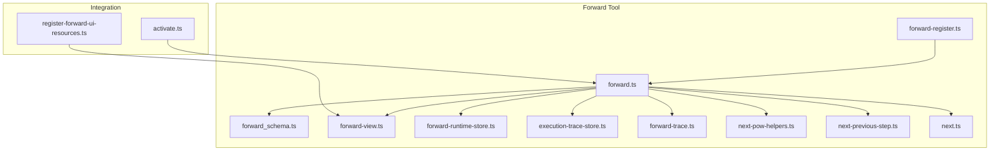
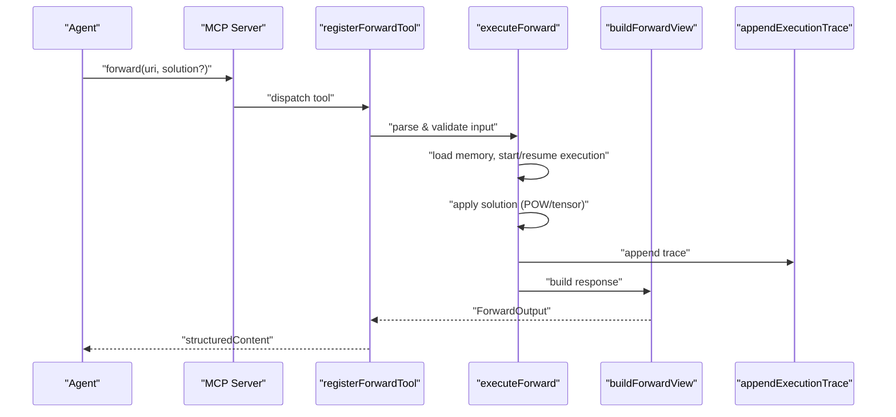
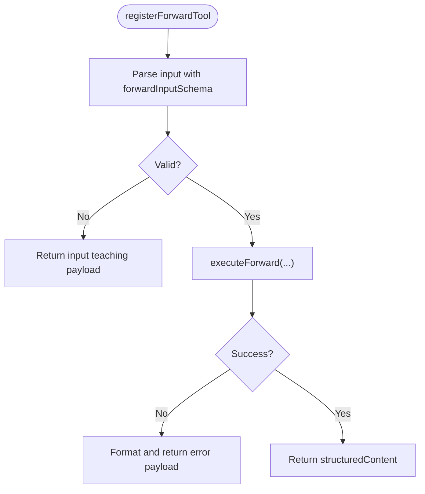
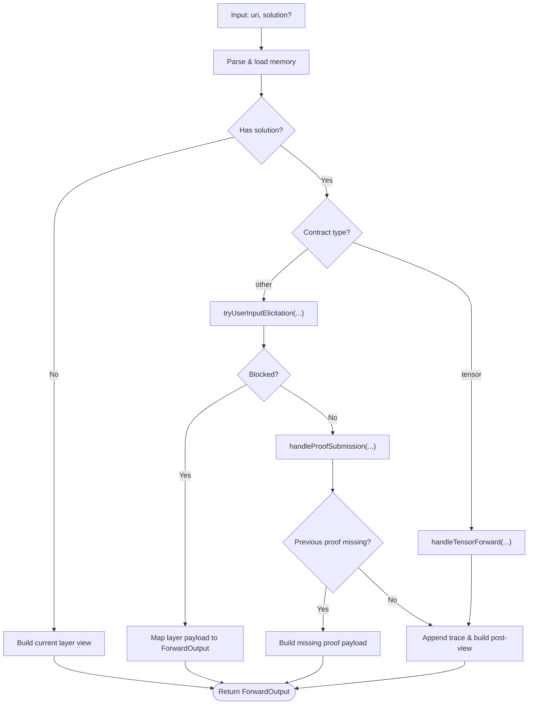
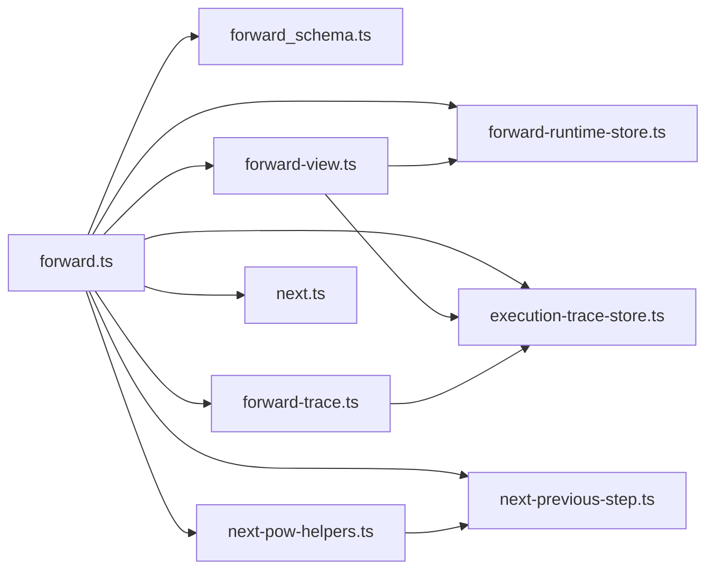

# Forward Tool

<cite>
**Referenced Files in This Document**
- [forward.ts](file://src/tools/forward.ts)
- [forward_schema.ts](file://src/tools/forward_schema.ts)
- [forward-register.ts](file://src/tools/forward-register.ts)
- [forward-trace.ts](file://src/tools/forward-trace.ts)
- [forward-view.ts](file://src/tools/forward-view.ts)
- [forward-runtime-store.ts](file://src/services/forward-runtime-store.ts)
- [execution-trace-store.ts](file://src/services/execution-trace-store.ts)
- [next-pow-helpers.ts](file://src/tools/next-pow-helpers.ts)
- [next-previous-step.ts](file://src/tools/next-previous-step.ts)
- [next.ts](file://src/tools/next.ts)
- [activate.ts](file://src/tools/activate.ts)
- [register-forward-ui-resources.ts](file://src/mcp-apps/register-forward-ui-resources.ts)
</cite>

## Table of Contents
1. [Introduction](#introduction)
2. [Project Structure](#project-structure)
3. [Core Components](#core-components)
4. [Architecture Overview](#architecture-overview)
5. [Detailed Component Analysis](#detailed-component-analysis)
6. [Dependency Analysis](#dependency-analysis)
7. [Performance Considerations](#performance-considerations)
8. [Troubleshooting Guide](#troubleshooting-guide)
9. [Conclusion](#conclusion)
10. [Appendices](#appendices)

## Introduction
The Forward Tool orchestrates agent-driven protocol execution by advancing through adapter layers, validating solutions against inference contracts, and managing execution state. It supports multiple proof modalities (shell, MCP tool calls, user input, comments) and tensor-based contracts, with robust error handling, retry logic, and execution tracing. It integrates tightly with the Activation Tool to bootstrap runs and with the Reward Tool to finalize them.

## Project Structure
The Forward Tool implementation centers on a small set of cohesive modules:
- Registration and orchestration: forward-register.ts, forward.ts
- Input/output schemas: forward_schema.ts
- View building and UI metadata: forward-view.ts, register-forward-ui-resources.ts
- Runtime state and tracing: forward-runtime-store.ts, execution-trace-store.ts, forward-trace.ts
- Proof-of-work and step navigation: next-pow-helpers.ts, next-previous-step.ts, next.ts
- Activation integration: activate.ts

**Diagram sources**
- [forward-register.ts:18-65](file://src/tools/forward-register.ts#L18-L65)
- [forward.ts:93-317](file://src/tools/forward.ts#L93-L317)
- [forward_schema.ts:244-351](file://src/tools/forward_schema.ts#L244-L351)
- [forward-view.ts:249-298](file://src/tools/forward-view.ts#L249-L298)
- [forward-runtime-store.ts:25-79](file://src/services/forward-runtime-store.ts#L25-L79)
- [execution-trace-store.ts:54-305](file://src/services/execution-trace-store.ts#L54-L305)
- [forward-trace.ts:93-229](file://src/tools/forward-trace.ts#L93-L229)
- [next-pow-helpers.ts:155-322](file://src/tools/next-pow-helpers.ts#L155-L322)
- [next-previous-step.ts:29-157](file://src/tools/next-previous-step.ts#L29-L157)
- [next.ts:137-273](file://src/tools/next.ts#L137-L273)
- [activate.ts:208-284](file://src/tools/activate.ts#L208-L284)
- [register-forward-ui-resources.ts:18-40](file://src/mcp-apps/register-forward-ui-resources.ts#L18-L40)

**Section sources**
- [forward-register.ts:18-65](file://src/tools/forward-register.ts#L18-L65)
- [forward.ts:93-317](file://src/tools/forward.ts#L93-L317)
- [forward_schema.ts:244-351](file://src/tools/forward_schema.ts#L244-L351)
- [forward-view.ts:249-298](file://src/tools/forward-view.ts#L249-L298)
- [forward-runtime-store.ts:25-79](file://src/services/forward-runtime-store.ts#L25-L79)
- [execution-trace-store.ts:54-305](file://src/services/execution-trace-store.ts#L54-L305)
- [forward-trace.ts:93-229](file://src/tools/forward-trace.ts#L93-L229)
- [next-pow-helpers.ts:155-322](file://src/tools/next-pow-helpers.ts#L155-L322)
- [next-previous-step.ts:29-157](file://src/tools/next-previous-step.ts#L29-L157)
- [next.ts:137-273](file://src/tools/next.ts#L137-L273)
- [activate.ts:208-284](file://src/tools/activate.ts#L208-L284)
- [register-forward-ui-resources.ts:18-40](file://src/mcp-apps/register-forward-ui-resources.ts#L18-L40)

## Core Components
- Forward registration and orchestration: registerForwardTool wires the tool into the MCP server, validates inputs, and invokes executeForward.
- Execution engine: executeForward parses URIs, loads memory, manages execution lifecycle, applies solutions, and builds responses.
- Schema enforcement: forwardInputSchema, forwardMcpWireInputSchema, forwardOutputSchema define strict shapes for inputs, outputs, and wire compatibility.
- View building: buildForwardView constructs the response payload, contract, and next_call guidance.
- Runtime state: ForwardRuntimeStore persists execution metadata and tensors across steps.
- Tracing: ExecutionTraceStore persists per-layer traces; forward-trace utilities append tensor inputs/outputs and reasoning traces.
- Proof-of-work: next-pow-helpers validates submissions, manages nonces and proof hashes, and handles user input elicitation.
- Previous-step bridging: next-previous-step enables robust handling of missing contracts and proof hash mismatches.

**Section sources**
- [forward-register.ts:18-65](file://src/tools/forward-register.ts#L18-L65)
- [forward.ts:93-317](file://src/tools/forward.ts#L93-L317)
- [forward_schema.ts:244-351](file://src/tools/forward_schema.ts#L244-L351)
- [forward-view.ts:249-298](file://src/tools/forward-view.ts#L249-L298)
- [forward-runtime-store.ts:25-79](file://src/services/forward-runtime-store.ts#L25-L79)
- [execution-trace-store.ts:54-305](file://src/services/execution-trace-store.ts#L54-L305)
- [forward-trace.ts:93-229](file://src/tools/forward-trace.ts#L93-L229)
- [next-pow-helpers.ts:155-322](file://src/tools/next-pow-helpers.ts#L155-L322)
- [next-previous-step.ts:29-157](file://src/tools/next-previous-step.ts#L29-L157)

## Architecture Overview
The Forward Tool is a stateful engine that:
- Accepts a URI (adapter slug/UUID or layer URI) and optional solution
- Resolves the target memory, starts or resumes an execution, and builds a contract
- Validates and stores solutions, advances to the next layer, and records execution traces
- Returns structured guidance for the next step or completion

**Diagram sources**
- [forward-register.ts:31-64](file://src/tools/forward-register.ts#L31-L64)
- [forward.ts:93-317](file://src/tools/forward.ts#L93-L317)
- [forward-view.ts:249-298](file://src/tools/forward-view.ts#L249-L298)
- [forward-trace.ts:93-116](file://src/tools/forward-trace.ts#L93-L116)

## Detailed Component Analysis

### Forward Registration and Orchestration
- registerForwardTool registers the tool with the MCP server, sets input/output schemas, and wraps execution with metrics and error handling.
- It delegates to executeForward for the core logic and returns structured content.

**Diagram sources**
- [forward-register.ts:31-64](file://src/tools/forward-register.ts#L31-L64)
- [forward_schema.ts:244-267](file://src/tools/forward_schema.ts#L244-L267)

**Section sources**
- [forward-register.ts:18-65](file://src/tools/forward-register.ts#L18-L65)
- [forward_schema.ts:244-267](file://src/tools/forward_schema.ts#L244-L267)

### Execution Engine: executeForward
- Parses and normalizes the input URI, loads memory, and starts or resumes an execution.
- Handles tensor contracts and non-tensor contracts differently.
- Applies solutions via proof-of-work helpers, ensures previous proofs, and builds post-submission views.
- Records execution traces and quality metadata.

**Diagram sources**
- [forward.ts:93-317](file://src/tools/forward.ts#L93-L317)
- [forward-trace.ts:132-229](file://src/tools/forward-trace.ts#L132-L229)
- [next-pow-helpers.ts:155-322](file://src/tools/next-pow-helpers.ts#L155-L322)
- [next-previous-step.ts:108-157](file://src/tools/next-previous-step.ts#L108-L157)

**Section sources**
- [forward.ts:93-317](file://src/tools/forward.ts#L93-L317)

### Input Schema: ForwardInput and Wire Compatibility
- ForwardInput requires uri and optionally solution.
- Solution normalization supports both legacy and v2 formats, auto-populating outcome and evidence envelopes.
- Strict validation enforces start vs. continuation semantics and rejects invalid combinations.

Key validation rules:
- First call: omit solution; include solution only on continuation with execution_id.
- Non-tensor contracts: echo nonce and proof_hash when present.
- Tensor contracts: enforce output name/type constraints and lengths.

**Section sources**
- [forward_schema.ts:244-267](file://src/tools/forward_schema.ts#L244-L267)
- [forward_schema.ts:175-226](file://src/tools/forward_schema.ts#L175-L226)
- [forward_schema.ts:269-306](file://src/tools/forward_schema.ts#L269-L306)

### Output Schema: ForwardOutput
- Includes must_obey, current_layer, contract, tensor_in (for tensor contracts), next_action, proof_hash, execution_id, message, error_code, retry_count, and next_call.
- next_call encodes the recommended next step: either forward with a solution template or reward to finalize.

**Section sources**
- [forward_schema.ts:320-346](file://src/tools/forward_schema.ts#L320-L346)

### View Building and UI Integration
- buildForwardView composes the response from memory, contract, and runtime metadata.
- It computes next_action and next_call guidance, and injects UI-related fields (adapter labels, artifact dirs).
- register-forward-ui-resources exposes inline HTML resources for UI presentation.

**Section sources**
- [forward-view.ts:249-298](file://src/tools/forward-view.ts#L249-L298)
- [register-forward-ui-resources.ts:18-40](file://src/mcp-apps/register-forward-ui-resources.ts#L18-L40)

### Runtime State Management
- ForwardRuntimeStore persists execution metadata and tensor values with TTL.
- Provides requireTensorInputs for tensor contracts and setTensor for storing computed tensors.

**Section sources**
- [forward-runtime-store.ts:25-79](file://src/services/forward-runtime-store.ts#L25-L79)

### Execution Tracing
- appendExecutionTrace writes a single trace point with layer context, tensor inputs/outputs, and optional reasoning trace.
- ExecutionTraceStore persists and retrieves execution traces, ensuring adapter URI consistency and maintaining sorted order by layer index.

**Section sources**
- [forward-trace.ts:93-116](file://src/tools/forward-trace.ts#L93-L116)
- [execution-trace-store.ts:170-197](file://src/services/execution-trace-store.ts#L170-L197)

### Proof-of-Work and Nonce Handling
- handleProofSubmission validates submission types, nonces, and proof hashes against expectations.
- Builds challenges with nonces and refreshes TTL for preview stability.
- Manages retry counts and produces error payloads with next_action guidance.

**Section sources**
- [next-pow-helpers.ts:155-322](file://src/tools/next-pow-helpers.ts#L155-L322)
- [forward-view.ts:177-181](file://src/tools/forward-view.ts#L177-L181)

### Continue/Next Action Logic and Step Navigation
- tryApplySolutionToPreviousStep bridges missing contracts by applying solutions to the previous step when required.
- tryApplySolutionToPreviousStepWhenSolutionMatchesPrevious prevents proof hash mismatches by routing matching solutions to the previous step.
- ensurePreviousProofCompleted blocks progression until required prior steps are completed.

**Section sources**
- [next-previous-step.ts:29-157](file://src/tools/next-previous-step.ts#L29-L157)

### Integration with Activation Tool
- activate returns choices with next_action typically pointing to forward with no solution to start a run.
- The Forward Tool consumes the execution_id from activation to maintain continuity across steps.

**Section sources**
- [activate.ts:208-284](file://src/tools/activate.ts#L208-L284)

## Dependency Analysis
The Forward Tool’s internal dependencies form a tight loop around memory loading, contract validation, proof-of-work, and view construction.

**Diagram sources**
- [forward.ts:93-317](file://src/tools/forward.ts#L93-L317)
- [forward-view.ts:249-298](file://src/tools/forward-view.ts#L249-L298)
- [forward-trace.ts:93-229](file://src/tools/forward-trace.ts#L93-L229)
- [next-pow-helpers.ts:155-322](file://src/tools/next-pow-helpers.ts#L155-L322)
- [next-previous-step.ts:29-157](file://src/tools/next-previous-step.ts#L29-L157)
- [next.ts:137-273](file://src/tools/next.ts#L137-L273)

**Section sources**
- [forward.ts:93-317](file://src/tools/forward.ts#L93-L317)
- [forward-view.ts:249-298](file://src/tools/forward-view.ts#L249-L298)
- [forward-trace.ts:93-229](file://src/tools/forward-trace.ts#L93-L229)
- [next-pow-helpers.ts:155-322](file://src/tools/next-pow-helpers.ts#L155-L322)
- [next-previous-step.ts:29-157](file://src/tools/next-previous-step.ts#L29-L157)
- [next.ts:137-273](file://src/tools/next.ts#L137-L273)

## Performance Considerations
- Asynchronous IO: Memory and Qdrant operations are awaited; ensure upstream caching (e.g., Redis cache for memory) is configured to reduce latency.
- Tracing persistence: Fire-and-forget trace persistence avoids blocking; failures are logged but do not fail requests.
- Tensor contracts: requireTensorInputs throws early if required inputs are missing, preventing wasted computation.
- Retry gating: MAX_RETRIES and retry counters prevent infinite loops; consider client-side backoff strategies.

[No sources needed since this section provides general guidance]

## Troubleshooting Guide
Common issues and recovery strategies:
- Nonce mismatch: Ensure the submitted nonce matches the current contract; re-fetch the contract to refresh TTL.
- Missing proof hash: Include proof_hash from the previous response or current contract; the system will compute and persist it.
- Type mismatch: Verify solution.type matches contract.type; adjust submission accordingly.
- Comment validation: Comments must meet minimum length and semantic relevance thresholds; revise to engage with step content.
- Previous step required: Complete or re-run the previous step first; the system will guide the next action.
- Tensor contract errors: Validate tensor name, type, and bounds; align with contract.output specification.

Operational tips:
- Use execution_id consistently across steps to maintain continuity.
- Inspect next_action and next_call for precise guidance on the next step.
- Enable reasoning traces via solution.trace to aid debugging.

**Section sources**
- [next-pow-helpers.ts:195-211](file://src/tools/next-pow-helpers.ts#L195-L211)
- [next-pow-helpers.ts:266-297](file://src/tools/next-pow-helpers.ts#L266-L297)
- [next-previous-step.ts:108-157](file://src/tools/next-previous-step.ts#L108-L157)
- [forward-trace.ts:132-229](file://src/tools/forward-trace.ts#L132-L229)

## Conclusion
The Forward Tool provides a robust, schema-enforced engine for executing protocol adapters. Its layered design—URIs, contracts, proof-of-work, runtime state, and tracing—ensures reliable stepwise execution, clear error signaling, and strong observability. Integration with Activation and Reward completes the end-to-end workflow, enabling agents to execute protocols safely and transparently.

[No sources needed since this section summarizes without analyzing specific files]

## Appendices

### Practical Examples

- First call to start a run:
  - URI: kairos://adapter/{slug-or-uuid}
  - Solution: omitted
  - Outcome: contract returned with next_action to call forward with the first layer URI and a solution matching the contract type.

- Continuing a run:
  - URI: kairos://layer/{uuid}?execution_id={execution_id}
  - Solution: include type, outcome, and evidence; echo nonce and proof_hash when present
  - Outcome: next layer view or completion with reward guidance.

- Tensor contract:
  - Provide tensor.name and tensor.value aligned with contract.output; system validates type and bounds and advances automatically.

- Error recovery:
  - Follow next_action guidance; for persistent issues, consider tuning or rewarding with failure and feedback.

[No sources needed since this section provides general guidance]

### Best Practices for Protocol Development
- Define clear inference contracts per layer; prefer explicit required flags for mandatory steps.
- Use tensor contracts for deterministic, structured outputs; ensure output names/types are precise.
- Keep user_input prompts actionable and scoped; avoid ambiguous instructions.
- Provide meaningful comments that reflect actual outcomes and engage with step content.
- Leverage execution traces and next_action to iteratively refine protocol steps.

[No sources needed since this section provides general guidance]