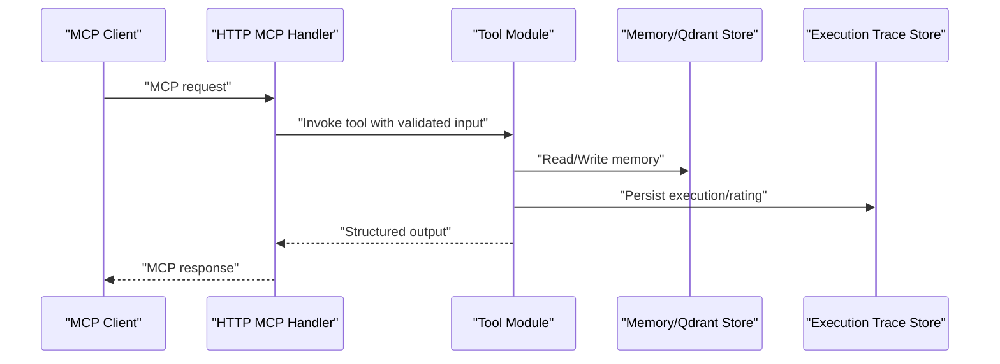
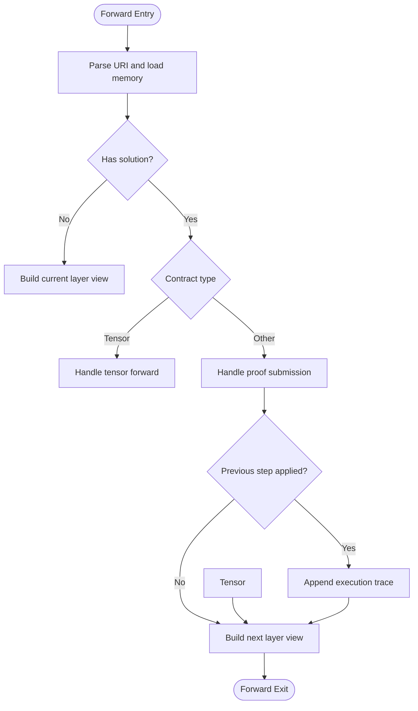
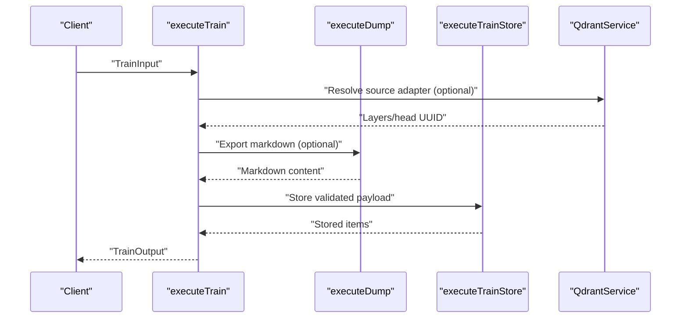
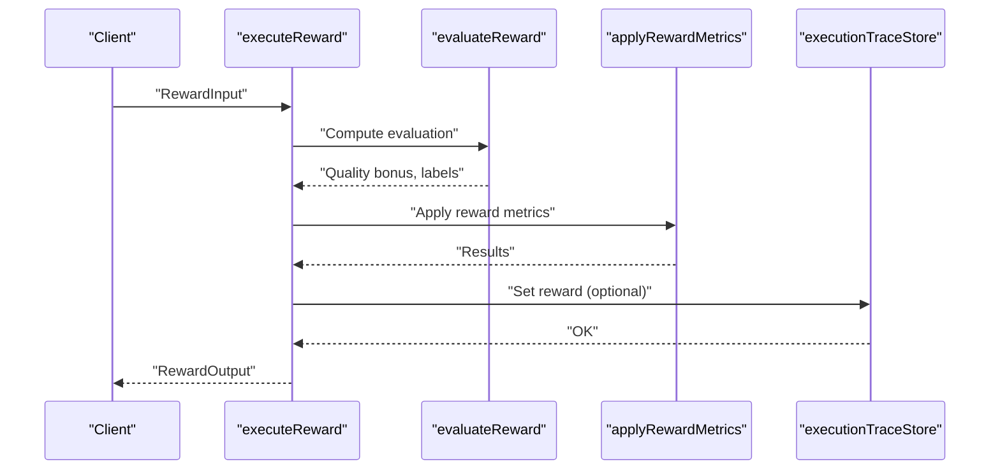
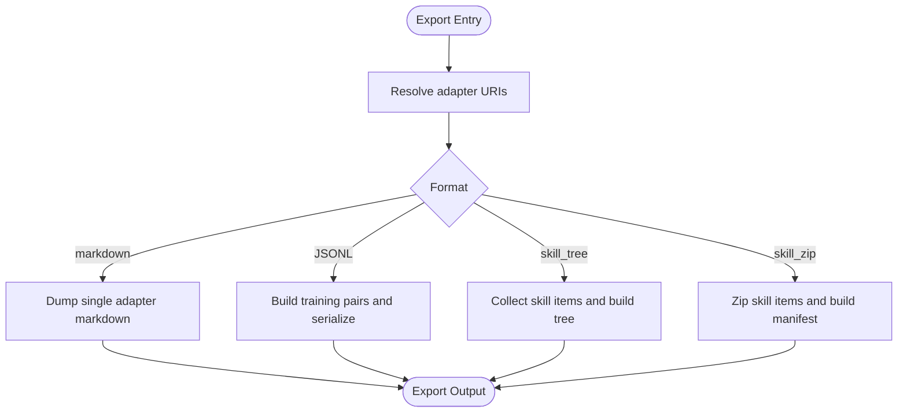
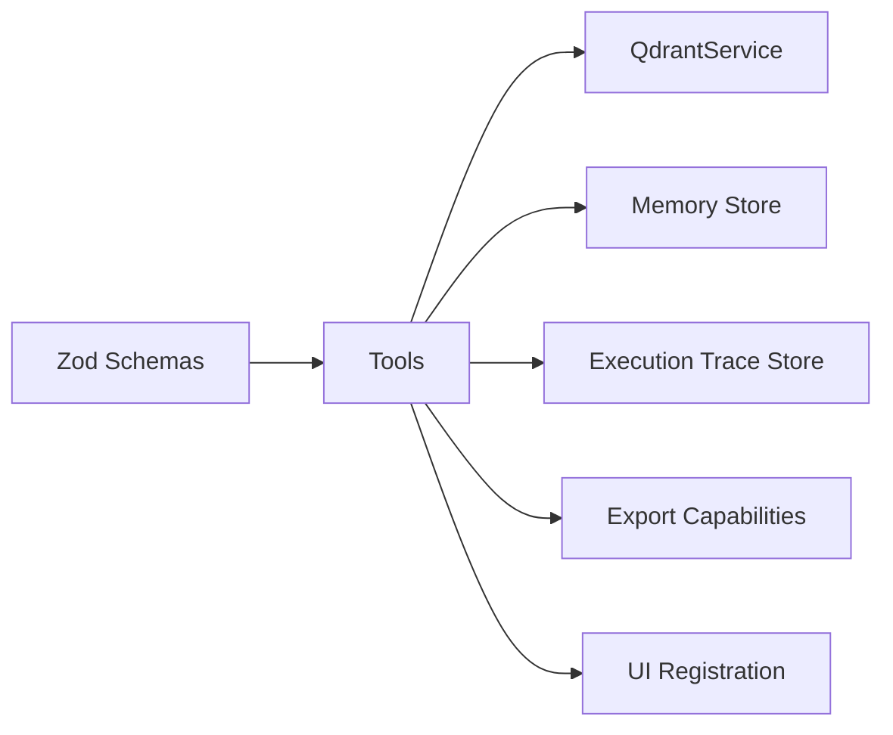

# MCP Protocol Tools

<cite>
**Referenced Files in This Document**
- [activate.ts](file://src/tools/activate.ts)
- [activate_schema.ts](file://src/tools/activate_schema.ts)
- [forward.ts](file://src/tools/forward.ts)
- [forward_schema.ts](file://src/tools/forward_schema.ts)
- [train.ts](file://src/tools/train.ts)
- [train_schema.ts](file://src/tools/train_schema.ts)
- [reward.ts](file://src/tools/reward.ts)
- [reward_schema.ts](file://src/tools/reward_schema.ts)
- [tune.ts](file://src/tools/tune.ts)
- [tune_schema.ts](file://src/tools/tune_schema.ts)
- [delete.ts](file://src/tools/delete.ts)
- [delete_schema.ts](file://src/tools/delete_schema.ts)
- [export.ts](file://src/tools/export.ts)
- [export_schema.ts](file://src/tools/export_schema.ts)
- [spaces.ts](file://src/tools/spaces.ts)
- [spaces_schema.ts](file://src/tools/spaces_schema.ts)
- [search.ts](file://src/tools/search.ts)
- [search_output.ts](file://src/tools/search_output.ts)
- [search_schema.ts](file://src/tools/search_schema.ts)
- [qdrant/service.ts](file://src/services/qdrant/service.ts)
- [memory/store.ts](file://src/services/memory/store.ts)
- [execution-trace-store.ts](file://src/services/execution-trace-store.ts)
- [forward-runtime-store.ts](file://src/services/forward-runtime-store.ts)
- [activate-refinement-store.ts](file://src/services/activate-refinement-store.ts)
- [export-artifact-download-capability.ts](file://src/services/export-artifact-download-capability.ts)
- [export-download-capability.ts](file://src/services/export-download-capability.ts)
- [mcp-apps/kairos-ui-constants.ts](file://src/mcp-apps/kairos-ui-constants.ts)
- [mcp-apps/register-activate-ui-resources.ts](file://src/mcp-apps/register-activate-ui-resources.ts)
- [mcp-apps/register-forward-ui-resources.ts](file://src/mcp-apps/register-forward-ui-resources.ts)
- [mcp-apps/register-spaces-ui-resources.ts](file://src/mcp-apps/register-spaces-ui-resources.ts)
- [mcp-apps/list-offerings-for-ui.ts](file://src/mcp-apps/list-offerings-for-ui.ts)
- [http-api-routes.ts](file://src/http/http-api-routes.ts)
- [http-mcp-handler.ts](file://src/http/http-mcp-handler.ts)
- [bootstrap.ts](file://src/bootstrap.ts)
- [index.ts](file://src/index.ts)
</cite>

## Table of Contents
1. [Introduction](#introduction)
2. [Project Structure](#project-structure)
3. [Core Components](#core-components)
4. [Architecture Overview](#architecture-overview)
5. [Detailed Component Analysis](#detailed-component-analysis)
6. [Dependency Analysis](#dependency-analysis)
7. [Performance Considerations](#performance-considerations)
8. [Troubleshooting Guide](#troubleshooting-guide)
9. [Conclusion](#conclusion)
10. [Appendices](#appendices)

## Introduction
This document describes the eight MCP protocol tools implemented in KAIROS MCP: activate, forward, train, reward, tune, delete, export, and spaces. It explains each tool’s purpose, input/output schemas, execution flow, and integration patterns. It also covers semantic search in activate, the layer execution engine in forward, protocol storage in train, performance scoring in reward, content updates in tune, resource cleanup in delete, skill bundle creation in export, and space management in spaces. Practical examples are referenced from the codebase, along with error handling strategies and best practices for tool usage, discovery, resource registration, and UI capability extensions.

## Project Structure
KAIROS MCP organizes MCP tools under src/tools with dedicated schemas and runtime implementations. Tools integrate with Qdrant-backed memory stores, execution tracing, and UI capability registration. HTTP routes and the MCP handler bridge external clients to tool execution.

```mermaid
graph TB
subgraph "MCP Tools"
ACT["activate.ts"]
FWD["forward.ts"]
TRN["train.ts"]
RWD["reward.ts"]
TUN["tune.ts"]
DEL["delete.ts"]
EXP["export.ts"]
SPA["spaces.ts"]
end
subgraph "Schemas"
ACTS["activate_schema.ts"]
FWDS["forward_schema.ts"]
TRNS["train_schema.ts"]
RWDS["reward_schema.ts"]
TUNS["tune_schema.ts"]
DELS["delete_schema.ts"]
EXPS["export_schema.ts"]
SPAS["spaces_schema.ts"]
end
subgraph "Services"
QDR["services/qdrant/service.ts"]
MEM["services/memory/store.ts"]
ETS["services/execution-trace-store.ts"]
FRS["services/forward-runtime-store.ts"]
ARS["services/activate-refinement-store.ts"]
EAC["services/export-artifact-download-capability.ts"]
EDC["services/export-download-capability.ts"]
end
ACT --- ACTS
FWD --- FWDS
TRN --- TRNS
RWD --- RWDS
TUN --- TUNS
DEL --- DELS
EXP --- EXPS
SPA --- SPAS
ACT -.-> QDR
FWD -.-> QDR
TRN -.-> QDR
RWD -.-> QDR
EXP -.-> QDR
SPA -.-> QDR
FWD -.-> MEM
TRN -.-> MEM
EXP -.-> MEM
FWD -.-> ETS
FWD -.-> FRS
ACT -.-> ARS
EXP -.-> EAC
EXP -.-> EDC
```



**Diagram sources**
- [activate.ts:1-284](file://src/tools/activate.ts#L1-L284)
- [forward.ts:1-318](file://src/tools/forward.ts#L1-L318)
- [train.ts:1-346](file://src/tools/train.ts#L1-L346)
- [reward.ts:1-156](file://src/tools/reward.ts#L1-L156)
- [tune.ts:1-58](file://src/tools/tune.ts#L1-L58)
- [delete.ts:1-116](file://src/tools/delete.ts#L1-L116)
- [export.ts:1-315](file://src/tools/export.ts#L1-L315)
- [spaces.ts:1-273](file://src/tools/spaces.ts#L1-L273)
- [activate_schema.ts:1-120](file://src/tools/activate_schema.ts#L1-L120)
- [forward_schema.ts:1-351](file://src/tools/forward_schema.ts#L1-L351)
- [train_schema.ts:1-218](file://src/tools/train_schema.ts#L1-L218)
- [reward_schema.ts:1-53](file://src/tools/reward_schema.ts#L1-L53)
- [tune_schema.ts:1-55](file://src/tools/tune_schema.ts#L1-L55)
- [delete_schema.ts:1-33](file://src/tools/delete_schema.ts#L1-L33)
- [export_schema.ts:1-150](file://src/tools/export_schema.ts#L1-L150)
- [spaces_schema.ts:1-53](file://src/tools/spaces_schema.ts#L1-L53)
- [qdrant/service.ts](file://src/services/qdrant/service.ts)
- [memory/store.ts](file://src/services/memory/store.ts)
- [execution-trace-store.ts](file://src/services/execution-trace-store.ts)
- [forward-runtime-store.ts](file://src/services/forward-runtime-store.ts)
- [activate-refinement-store.ts](file://src/services/activate-refinement-store.ts)
- [export-artifact-download-capability.ts](file://src/services/export-artifact-download-capability.ts)
- [export-download-capability.ts](file://src/services/export-download-capability.ts)

**Section sources**
- [activate.ts:1-284](file://src/tools/activate.ts#L1-L284)
- [forward.ts:1-318](file://src/tools/forward.ts#L1-L318)
- [train.ts:1-346](file://src/tools/train.ts#L1-L346)
- [reward.ts:1-156](file://src/tools/reward.ts#L1-L156)
- [tune.ts:1-58](file://src/tools/tune.ts#L1-L58)
- [delete.ts:1-116](file://src/tools/delete.ts#L1-L116)
- [export.ts:1-315](file://src/tools/export.ts#L1-L315)
- [spaces.ts:1-273](file://src/tools/spaces.ts#L1-L273)

## Core Components
- activate: Semantic search and adapter discovery, returning ranked choices with optional linked artifacts and guidance to call forward.
- forward: Layer execution engine supporting tensor, shell, MCP, user_input, and comment contracts; manages execution traces, proof-of-work, and progression.
- train: Registers new adapters or artifacts; supports forking from a source adapter and artifact storage with MIME-aware normalization.
- reward: Records outcomes and scores for adapter layers, computes evaluation labels and eligibility for SFT/preference datasets, and persists ratings.
- tune: Updates content or metadata of adapters/layers and optionally moves them to a different space.
- delete: Removes adapters and their layers by URI, with robust error reporting per URI.
- export: Exports adapter markdown, training JSONL, skill bundles, or raw source; supports inline ZIP or download references.
- spaces: Lists available spaces, adapter counts, and optionally adapter titles and artifacts for UI rendering.

**Section sources**
- [activate.ts:208-234](file://src/tools/activate.ts#L208-L234)
- [forward.ts:93-317](file://src/tools/forward.ts#L93-L317)
- [train.ts:134-238](file://src/tools/train.ts#L134-L238)
- [reward.ts:27-110](file://src/tools/reward.ts#L27-L110)
- [tune.ts:1-58](file://src/tools/tune.ts#L1-L58)
- [delete.ts:12-71](file://src/tools/delete.ts#L12-L71)
- [export.ts:40-269](file://src/tools/export.ts#L40-L269)
- [spaces.ts:190-207](file://src/tools/spaces.ts#L190-L207)

## Architecture Overview
The MCP tools are registered with the server and invoked via the MCP protocol. Inputs are validated against Zod schemas; outputs are returned as structured content. Tools interact with:
- Qdrant-backed memory store for retrieval and persistence
- Execution trace store for reward and progress tracking
- Capability services for secure artifact and bundle downloads
- UI registration for MCP apps and widgets



**Diagram sources**
- [http-mcp-handler.ts](file://src/http/http-mcp-handler.ts)
- [http-api-routes.ts](file://src/http/http-api-routes.ts)
- [bootstrap.ts](file://src/bootstrap.ts)
- [index.ts](file://src/index.ts)

## Detailed Component Analysis

### activate
Purpose
- Find the best matching adapter for a user query, including refine/create suggestions and optional linked artifacts. Returns choices with guidance to call forward.

Input schema highlights
- query: Textual activation query
- execution_id: Optional UUID to continue a refinement sequence
- space/space_id: Scope to a specific space
- max_choices: Limit on returned choices

Output schema highlights
- choices: Match/refine/create variants with roles, scores, next actions, and optional linked artifacts
- execution_id: Server-assigned ID for refinement
- kairos_local_artifact_dir: Client-side artifact directory hints

Execution flow
- Executes semantic search and maps results to activation choices
- Resolves export adapters and lists linked artifacts with download capabilities
- Builds guidance messages and materialization commands for artifacts
- Tracks refinement count to gate footer messages

Integration patterns
- Uses Qdrant service for search
- Leverages artifact catalog and download capability minting
- Emits UI meta for MCP app presentation

```mermaid
sequenceDiagram
participant Client as "Client"
participant Activate as "executeActivate"
participant Search as "executeSearch"
participant Qdrant as "QdrantService"
participant Artifacts as "Artifact Catalog"
participant Cap as "Export Download Capability"
Client->>Activate : "ActivateInput"
Activate->>Search : "Execute semantic search"
Search->>Qdrant : "Search"
Qdrant-->>Search : "Search results"
Activate->>Artifacts : "List adapter artifacts"
Artifacts->>Cap : "Mint download capability"
Cap-->>Artifacts : "Capability URL"
Artifacts-->>Activate : "Linked artifacts"
Activate-->>Client : "ActivateOutput"
```

**Diagram sources**
- [activate.ts:208-234](file://src/tools/activate.ts#L208-L234)
- [search.ts](file://src/tools/search.ts)
- [export-artifact-download-capability.ts](file://src/services/export-artifact-download-capability.ts)

**Section sources**
- [activate.ts:1-284](file://src/tools/activate.ts#L1-L284)
- [activate_schema.ts:1-120](file://src/tools/activate_schema.ts#L1-L120)

### forward
Purpose
- Drive adapter execution through layers, enforcing contracts, collecting solutions, and advancing execution state.

Input schema highlights
- uri: Adapter slug or layer URI
- solution: Required for continuation calls; includes type, outcome, and evidence payload

Output schema highlights
- contract: Current layer contract (tensor, shell, MCP, user_input, comment)
- next_call: Suggests next action (forward or reward)
- execution_id: Active run identifier
- proof_hash: Hash for proof-based layers

Execution flow
- Loads memory for the given URI; starts a new execution if needed
- Handles tensor, shell, MCP, user_input, and comment contracts
- Manages proof-of-work submission and prerequisite completion
- Persists execution traces and updates step quality
- Advances to next layer or signals completion



**Diagram sources**
- [forward.ts:93-317](file://src/tools/forward.ts#L93-L317)
- [forward_schema.ts:1-351](file://src/tools/forward_schema.ts#L1-L351)

**Section sources**
- [forward.ts:1-318](file://src/tools/forward.ts#L1-L318)
- [forward_schema.ts:1-351](file://src/tools/forward_schema.ts#L1-L351)

### train
Purpose
- Register new adapters or artifacts; supports forking from a source adapter and artifact storage.

Input schema highlights
- content: Protocol markdown or artifact content
- llm_model_id: Model identifier for attribution
- force_update: Overwrite existing adapter with same label
- protocol_version: Adapter version
- space: Target space ("personal" or group)
- source_adapter_uri: Fork from an existing adapter
- mime/artifact_name/adapter_uri: Artifact mode controls
- relative_path: Artifact path normalization

Execution flow
- Resolves content from input or forks from a source adapter
- Normalizes MIME and artifact paths
- Stores content via the training store, resolving adapter URIs and outputs
- Returns items with URIs, layer/artifact UUIDs, and tags



**Diagram sources**
- [train.ts:134-238](file://src/tools/train.ts#L134-L238)

**Section sources**
- [train.ts:1-346](file://src/tools/train.ts#L1-L346)
- [train_schema.ts:1-218](file://src/tools/train_schema.ts#L1-L218)

### reward
Purpose
- Attach reward signals to adapter layers after execution, compute evaluation labels, and persist ratings.

Input schema highlights
- uri: Layer URI
- outcome: success/failure
- score: Optional normalized score
- feedback/rater/rubric_version/llm_model_id: Attribution and feedback

Execution flow
- Validates URI and evaluates reward
- Applies reward metrics to Qdrant
- Persists rating to execution trace store when execution_id is present
- Returns results with eligibility flags and blockers



**Diagram sources**
- [reward.ts:27-110](file://src/tools/reward.ts#L27-L110)
- [reward-metrics.ts](file://src/services/reward-metrics.ts)
- [execution-trace-store.ts](file://src/services/execution-trace-store.ts)

**Section sources**
- [reward.ts:1-156](file://src/tools/reward.ts#L1-L156)
- [reward_schema.ts:1-53](file://src/tools/reward_schema.ts#L1-L53)

### tune
Purpose
- Update content or metadata of adapters/layers and optionally move them to another space.

Input schema highlights
- uris: Non-empty array of adapter/layer URIs
- content: Updated content bodies (parallel to uris)
- updates: Advanced field updates
- space: Move all layers to a new space

Execution flow
- Validates input shape and counts
- Lazily initializes Qdrant service if needed
- Executes tune operation and returns per-URI results

**Section sources**
- [tune.ts:1-58](file://src/tools/tune.ts#L1-L58)
- [tune_schema.ts:1-55](file://src/tools/tune_schema.ts#L1-L55)

### delete
Purpose
- Remove adapters and their layers by URI with per-URI results.

Input schema highlights
- uris: Non-empty array of adapter/layer URIs

Execution flow
- Parses URIs and resolves adapter slugs to layer UUIDs
- Deletes all layers of an adapter or individual layers
- Aggregates results and counts

**Section sources**
- [delete.ts:1-116](file://src/tools/delete.ts#L1-L116)
- [delete_schema.ts:1-33](file://src/tools/delete_schema.ts#L1-L33)

### export
Purpose
- Export adapters/markdown, training JSONL, or skill bundles; support inline ZIP or download references.

Input schema highlights
- uri/adapters/all_adapters/space_name: Selection modes
- format: markdown, trace_jsonl, reward_jsonl, sft_jsonl, preference_jsonl, source, skill_tree, skill_zip
- delivery: download_ref or inline_base64 (ZIP)
- include_reward: Include rewards in training formats

Execution flow
- Resolves adapter URIs and handles artifact/source exports
- Supports flat markdown, training JSONL, and skill bundles
- Builds manifests and ZIPs; mints download capabilities



**Diagram sources**
- [export.ts:62-269](file://src/tools/export.ts#L62-L269)

**Section sources**
- [export.ts:1-315](file://src/tools/export.ts#L1-L315)
- [export_schema.ts:1-150](file://src/tools/export_schema.ts#L1-L150)

### spaces
Purpose
- List spaces with human-readable names, adapter counts, and optionally adapter titles and artifacts.

Input schema highlights
- include_adapter_titles: Include adapters with titles and layer counts
- include_widget_html: Append HTML table for UI
- include_artifacts: Include artifact metadata per adapter

Execution flow
- Builds space info by scrolling Qdrant points and grouping by adapter
- Normalizes slugs and builds adapter URIs
- Renders optional HTML widget for UI

**Section sources**
- [spaces.ts:1-273](file://src/tools/spaces.ts#L1-L273)
- [spaces_schema.ts:1-53](file://src/tools/spaces_schema.ts#L1-L53)

## Dependency Analysis
- Tools depend on Zod schemas for input validation and structured outputs.
- Qdrant service is central for search, retrieval, and persistence.
- Memory store bridges tool logic to Qdrant.
- Execution trace store persists reward and execution metadata.
- Capability services mint short-lived download links for artifacts and bundles.
- UI registration integrates MCP apps and widgets for activate, forward, and spaces.



**Diagram sources**
- [activate_schema.ts:1-120](file://src/tools/activate_schema.ts#L1-L120)
- [forward_schema.ts:1-351](file://src/tools/forward_schema.ts#L1-L351)
- [train_schema.ts:1-218](file://src/tools/train_schema.ts#L1-L218)
- [reward_schema.ts:1-53](file://src/tools/reward_schema.ts#L1-L53)
- [tune_schema.ts:1-55](file://src/tools/tune_schema.ts#L1-L55)
- [delete_schema.ts:1-33](file://src/tools/delete_schema.ts#L1-L33)
- [export_schema.ts:1-150](file://src/tools/export_schema.ts#L1-L150)
- [spaces_schema.ts:1-53](file://src/tools/spaces_schema.ts#L1-L53)
- [qdrant/service.ts](file://src/services/qdrant/service.ts)
- [memory/store.ts](file://src/services/memory/store.ts)
- [execution-trace-store.ts](file://src/services/execution-trace-store.ts)
- [export-artifact-download-capability.ts](file://src/services/export-artifact-download-capability.ts)
- [export-download-capability.ts](file://src/services/export-download-capability.ts)
- [mcp-apps/register-activate-ui-resources.ts](file://src/mcp-apps/register-activate-ui-resources.ts)
- [mcp-apps/register-forward-ui-resources.ts](file://src/mcp-apps/register-forward-ui-resources.ts)
- [mcp-apps/register-spaces-ui-resources.ts](file://src/mcp-apps/register-spaces-ui-resources.ts)

**Section sources**
- [activate.ts:1-284](file://src/tools/activate.ts#L1-L284)
- [forward.ts:1-318](file://src/tools/forward.ts#L1-L318)
- [train.ts:1-346](file://src/tools/train.ts#L1-L346)
- [reward.ts:1-156](file://src/tools/reward.ts#L1-L156)
- [tune.ts:1-58](file://src/tools/tune.ts#L1-L58)
- [delete.ts:1-116](file://src/tools/delete.ts#L1-L116)
- [export.ts:1-315](file://src/tools/export.ts#L1-L315)
- [spaces.ts:1-273](file://src/tools/spaces.ts#L1-L273)

## Performance Considerations
- Input/output size metrics are recorded per tool to monitor throughput and payload sizes.
- Tool durations are measured to identify hotspots.
- Qdrant scroll limits and pagination are used to avoid heavy queries in spaces.
- Artifact and bundle exports are optimized with capability-based downloads and optional inline encoding.

[No sources needed since this section provides general guidance]

## Troubleshooting Guide
Common issues and strategies
- Validation errors: Tools return structured validation errors via teaching helpers; inspect parsed errors and adjust inputs accordingly.
- Duplicate adapters: Train tool normalizes DUPLICATE_ADAPTER and SIMILAR_MEMORY_FOUND errors with actionable next actions.
- Reward persistence failures: Reward tool wraps persistence errors into a clear failure message with retry guidance.
- Missing proofs: Forward tool enforces prerequisite completion and returns blocked payloads with retry guidance.
- Space resolution: Spaces tool deduplicates space IDs and aggregates adapter counts; verify allowed spaces and app space inclusion.

**Section sources**
- [train.ts:56-83](file://src/tools/train.ts#L56-L83)
- [reward.ts:18-25](file://src/tools/reward.ts#L18-L25)
- [forward.ts:167-195](file://src/tools/forward.ts#L167-L195)
- [spaces.ts:60-64](file://src/tools/spaces.ts#L60-L64)

## Conclusion
KAIROS MCP tools provide a cohesive protocol for semantic activation, controlled execution, training, reward, tuning, deletion, exporting, and space management. Their schemas enforce strong contracts, while integration with Qdrant, memory stores, and capability services ensures scalable and secure operations. UI registration and widget rendering further enhance usability across MCP apps.

[No sources needed since this section summarizes without analyzing specific files]

## Appendices

### Tool Discovery and Registration
- Tools are registered with the server and exposed via MCP offerings.
- UI capability extensions are integrated for activate, forward, and spaces tools.

**Section sources**
- [mcp-apps/list-offerings-for-ui.ts](file://src/mcp-apps/list-offerings-for-ui.ts)
- [mcp-apps/register-activate-ui-resources.ts](file://src/mcp-apps/register-activate-ui-resources.ts)
- [mcp-apps/register-forward-ui-resources.ts](file://src/mcp-apps/register-forward-ui-resources.ts)
- [mcp-apps/register-spaces-ui-resources.ts](file://src/mcp-apps/register-spaces-ui-resources.ts)

### UI Capability Extensions
- Activate tool registers UI metadata for presentation.
- Spaces tool can render HTML widgets for space listings.

**Section sources**
- [mcp-apps/kairos-ui-constants.ts](file://src/mcp-apps/kairos-ui-constants.ts)
- [spaces.ts:213-272](file://src/tools/spaces.ts#L213-L272)