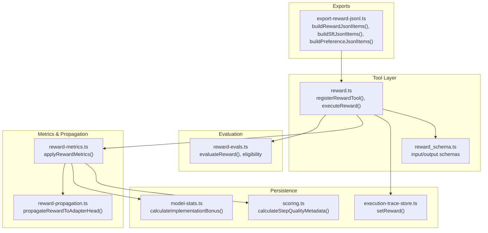
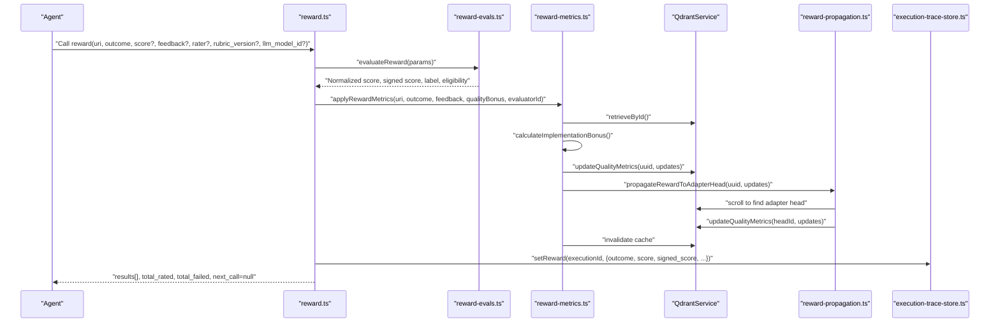
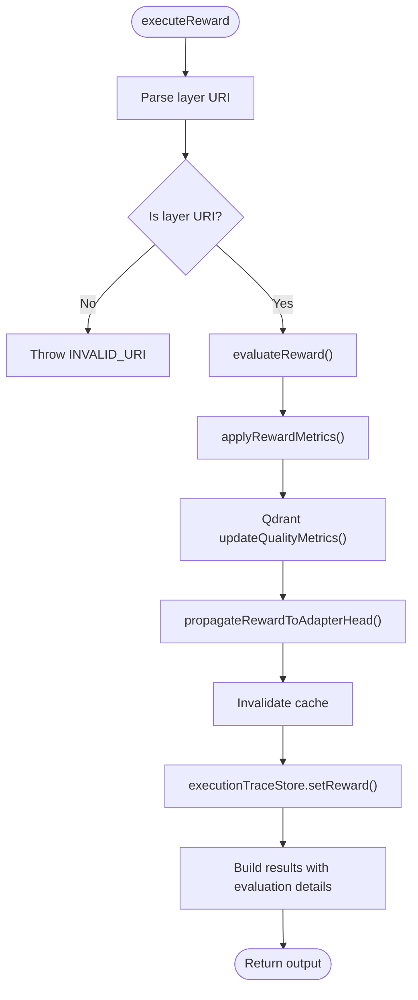
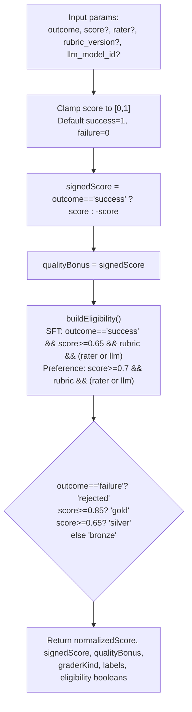
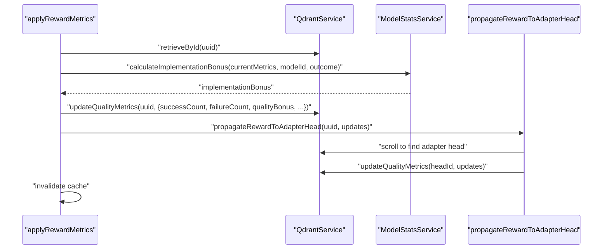
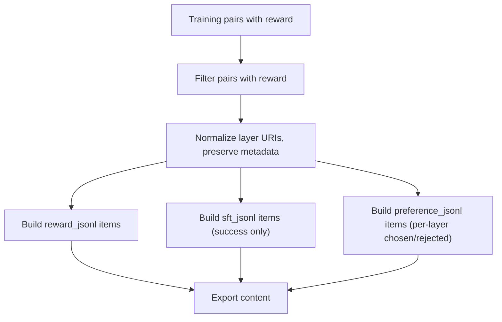
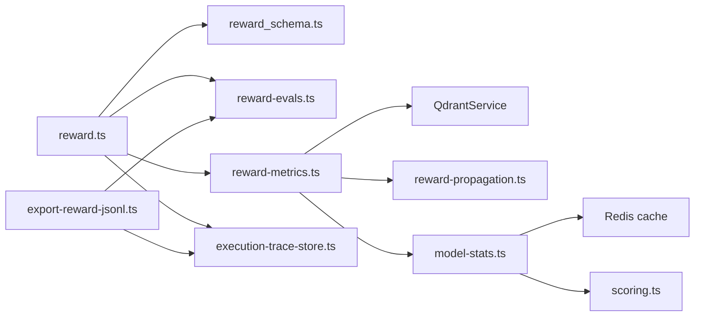

# Reward Tool

<cite>
**Referenced Files in This Document**
- [reward.ts](file://src/tools/reward.ts)
- [reward_schema.ts](file://src/tools/reward_schema.ts)
- [reward-evals.ts](file://src/services/reward-evals.ts)
- [reward-metrics.ts](file://src/services/reward-metrics.ts)
- [reward-propagation.ts](file://src/services/qdrant/reward-propagation.ts)
- [workflow-reward.md](file://docs/architecture/workflow-reward.md)
- [memory.ts](file://src/types/memory.ts)
- [execution-trace-store.ts](file://src/services/execution-trace-store.ts)
- [export-reward-jsonl.ts](file://src/tools/export-reward-jsonl.ts)
- [scoring.ts](file://src/services/stats/scoring.ts)
- [model-stats.ts](file://src/services/stats/model-stats.ts)
- [v4-kairos-reward.test.ts](file://tests/integration/v4-kairos-reward.test.ts)
- [reward.test.ts](file://tests/unit/reward.test.ts)
- [reward-evals.test.ts](file://tests/integration/reward-evals.test.ts)
- [reward-export-evals.test.ts](file://tests/integration/reward-export-evals.test.ts)
</cite>

## Table of Contents
1. [Introduction](#introduction)
2. [Project Structure](#project-structure)
3. [Core Components](#core-components)
4. [Architecture Overview](#architecture-overview)
5. [Detailed Component Analysis](#detailed-component-analysis)
6. [Dependency Analysis](#dependency-analysis)
7. [Performance Considerations](#performance-considerations)
8. [Troubleshooting Guide](#troubleshooting-guide)
9. [Conclusion](#conclusion)
10. [Appendices](#appendices)

## Introduction
This document describes the Reward Tool implementation that measures agent execution quality and integrates reward signals into the training and evaluation pipeline. It explains the performance scoring and evaluation system, reward propagation to adapter heads, and feedback loop integration with Qdrant, Redis cache, and execution traces. It documents the input and output schemas, evaluation algorithms, and thresholds used to gate training exports (SFT and Preference). Practical examples illustrate reward scoring workflows, eligibility criteria, and performance analysis. Finally, it addresses bias mitigation, fairness considerations, and best practices for designing robust reward systems.

## Project Structure
The Reward Tool spans several modules:
- Tool registration and execution: [reward.ts](file://src/tools/reward.ts)
- Input/output schemas: [reward_schema.ts](file://src/tools/reward_schema.ts)
- Evaluation logic and eligibility: [reward-evals.ts](file://src/services/reward-evals.ts)
- Metrics application and propagation: [reward-metrics.ts](file://src/services/reward-metrics.ts), [reward-propagation.ts](file://src/services/qdrant/reward-propagation.ts)
- Execution trace persistence: [execution-trace-store.ts](file://src/services/execution-trace-store.ts)
- Export utilities for training datasets: [export-reward-jsonl.ts](file://src/tools/export-reward-jsonl.ts)
- Quality scoring utilities: [scoring.ts](file://src/services/stats/scoring.ts), [model-stats.ts](file://src/services/stats/model-stats.ts)
- Documentation and workflow: [workflow-reward.md](file://docs/architecture/workflow-reward.md)
- Types: [memory.ts](file://src/types/memory.ts)
- Tests: [reward.test.ts](file://tests/unit/reward.test.ts), [reward-evals.test.ts](file://tests/integration/reward-evals.test.ts), [reward-export-evals.test.ts](file://tests/integration/reward-export-evals.test.ts), [v4-kairos-reward.test.ts](file://tests/integration/v4-kairos-reward.test.ts)

**Diagram sources**
- [reward.ts:112-156](file://src/tools/reward.ts#L112-L156)
- [reward_schema.ts:10-48](file://src/tools/reward_schema.ts#L10-L48)
- [reward-evals.ts:105-147](file://src/services/reward-evals.ts#L105-L147)
- [reward-metrics.ts:20-120](file://src/services/reward-metrics.ts#L20-L120)
- [reward-propagation.ts:13-76](file://src/services/qdrant/reward-propagation.ts#L13-L76)
- [execution-trace-store.ts:199-209](file://src/services/execution-trace-store.ts#L199-L209)
- [export-reward-jsonl.ts:96-182](file://src/tools/export-reward-jsonl.ts#L96-L182)
- [scoring.ts:74-106](file://src/services/stats/scoring.ts#L74-L106)
- [model-stats.ts:149-191](file://src/services/stats/model-stats.ts#L149-L191)

**Section sources**
- [reward.ts:1-156](file://src/tools/reward.ts#L1-L156)
- [reward_schema.ts:1-53](file://src/tools/reward_schema.ts#L1-L53)
- [workflow-reward.md:1-152](file://docs/architecture/workflow-reward.md#L1-L152)

## Core Components
- Tool registration and execution:
  - Registers the reward tool with input/output schemas and handles validation, metrics, and errors.
  - Executes evaluation, applies reward metrics, and persists reward into execution traces.
- Evaluation engine:
  - Normalizes scores, computes signed quality bonuses, infers grader kind, and determines eligibility for SFT and Preference exports.
- Metrics application and propagation:
  - Updates Qdrant quality metrics, propagates reward to the adapter head, and invalidates caches.
- Export utilities:
  - Build normalized reward JSONL and training-ready formats (SFT, Preference) with eligibility gating.

**Section sources**
- [reward.ts:27-110](file://src/tools/reward.ts#L27-L110)
- [reward-evals.ts:17-27](file://src/services/reward-evals.ts#L17-L27)
- [reward-metrics.ts:20-120](file://src/services/reward-metrics.ts#L20-L120)
- [export-reward-jsonl.ts:96-182](file://src/tools/export-reward-jsonl.ts#L96-L182)

## Architecture Overview
The Reward Tool participates in the finalization of an adapter execution. After the agent completes the last layer, it calls reward with outcome and optional evaluator metadata. The tool evaluates the reward, updates Qdrant quality metrics, propagates the reward to the adapter head, and optionally persists the reward into the execution trace. Export utilities then transform the reward data into training-ready formats.

**Diagram sources**
- [reward.ts:27-110](file://src/tools/reward.ts#L27-L110)
- [reward-evals.ts:105-147](file://src/services/reward-evals.ts#L105-L147)
- [reward-metrics.ts:20-120](file://src/services/reward-metrics.ts#L20-L120)
- [reward-propagation.ts:13-76](file://src/services/qdrant/reward-propagation.ts#L13-L76)
- [execution-trace-store.ts:199-209](file://src/services/execution-trace-store.ts#L199-L209)

## Detailed Component Analysis

### Tool Registration and Execution
- Validates input against the loose schema wrapper and Zod schema.
- Parses the layer URI and ensures it targets a layer (not an adapter).
- Evaluates reward and prepares metrics input.
- Applies reward metrics to Qdrant and propagates to the adapter head.
- Persists reward into the execution trace when an execution_id is present.
- Returns structured output with evaluation details and eligibility flags.

**Diagram sources**
- [reward.ts:27-110](file://src/tools/reward.ts#L27-L110)
- [reward-evals.ts:105-147](file://src/services/reward-evals.ts#L105-L147)
- [reward-metrics.ts:20-120](file://src/services/reward-metrics.ts#L20-L120)
- [reward-propagation.ts:13-76](file://src/services/qdrant/reward-propagation.ts#L13-L76)
- [execution-trace-store.ts:199-209](file://src/services/execution-trace-store.ts#L199-L209)

**Section sources**
- [reward.ts:112-156](file://src/tools/reward.ts#L112-L156)
- [reward.ts:27-110](file://src/tools/reward.ts#L27-L110)

### Evaluation Engine and Eligibility
- Normalizes scores to [0, 1], clamping invalid values.
- Computes signed quality bonus equal to the outcome-weighted score.
- Infers grader kind from presence of model or rater identity.
- Determines eligibility for SFT and Preference exports based on outcome, score thresholds, and rubric metadata.
- Assigns evaluation label tiers (gold, silver, bronze, rejected) based on normalized score and outcome.

**Diagram sources**
- [reward-evals.ts:105-147](file://src/services/reward-evals.ts#L105-L147)
- [reward-evals.ts:55-93](file://src/services/reward-evals.ts#L55-L93)

**Section sources**
- [reward-evals.ts:17-27](file://src/services/reward-evals.ts#L17-L27)
- [reward-evals.ts:29-39](file://src/services/reward-evals.ts#L29-L39)
- [reward-evals.ts:105-147](file://src/services/reward-evals.ts#L105-L147)

### Metrics Application and Reward Propagation
- Retrieves the Qdrant point by UUID derived from the layer URI.
- Computes an implementation bonus via model stats and adds it to a basic quality bonus.
- Updates quality metrics (counts, last rated, rater, quality bonus) and usage context if provided.
- Propagates the reward to the adapter head by finding the head layer and updating its metrics.
- Invalidates caches to refresh downstream queries.

**Diagram sources**
- [reward-metrics.ts:20-120](file://src/services/reward-metrics.ts#L20-L120)
- [reward-propagation.ts:13-76](file://src/services/qdrant/reward-propagation.ts#L13-L76)
- [model-stats.ts:149-191](file://src/services/stats/model-stats.ts#L149-L191)

**Section sources**
- [reward-metrics.ts:20-120](file://src/services/reward-metrics.ts#L20-L120)
- [reward-propagation.ts:13-76](file://src/services/qdrant/reward-propagation.ts#L13-L76)

### Export Utilities and Training Integration
- Builds normalized reward JSONL items preserving rubric metadata and eligibility flags.
- Generates SFT samples by pairing instructions/responses for successful rewards meeting SFT thresholds.
- Generates Preference samples by pairing chosen (success) and rejected (failure) responses per layer when eligible.

**Diagram sources**
- [export-reward-jsonl.ts:96-182](file://src/tools/export-reward-jsonl.ts#L96-L182)

**Section sources**
- [export-reward-jsonl.ts:96-182](file://src/tools/export-reward-jsonl.ts#L96-L182)

### Input Schema
- uri: Layer URI (kairos://layer/{uuid}?execution_id={uuid})
- outcome: success or failure
- score: optional normalized score in [0, 1]
- feedback: optional evaluator note
- rater: optional evaluator identifier
- rubric_version: optional rubric or policy version
- llm_model_id: optional model identifier for attribution

Validation ensures:
- uri matches the layer URI pattern.
- feedback is present when provided (minimum length 1).
- score is within [0, 1] when provided.

**Section sources**
- [reward_schema.ts:3-18](file://src/tools/reward_schema.ts#L3-L18)
- [workflow-reward.md:39-57](file://docs/architecture/workflow-reward.md#L39-L57)

### Output Schema
- results: array of reward rows with:
  - uri, outcome, score (nullable), feedback, rater, rubric_version, llm_model_id (nullable)
  - grader_kind: human, model, unknown
  - evaluation_label: gold, silver, bronze, rejected
  - exportable_for_sft, exportable_for_preference, sft_blockers, preference_blockers
  - rated_at (ISO 8601)
- total_rated, total_failed, next_call

Validation rules:
- results non-empty on success.
- total_rated + total_failed equals result rows.
- rated_at is ISO 8601.
- exportable flags align with blocker arrays.

**Section sources**
- [reward_schema.ts:28-48](file://src/tools/reward_schema.ts#L28-L48)
- [workflow-reward.md:61-91](file://docs/architecture/workflow-reward.md#L61-L91)
- [workflow-reward.md:136-143](file://docs/architecture/workflow-reward.md#L136-L143)

### Reward Evaluation Algorithms and Thresholds
- Default scores: success=1, failure=0 (normalized).
- Score clamping to [0,1].
- Signed quality bonus equals normalized score for success, negative for failure.
- Eligibility thresholds:
  - SFT: outcome==success, score>=0.65, rubric present, and evaluator identity present.
  - Preference: score>=0.7 and evaluator identity present.
- Labels:
  - failure -> rejected
  - score>=0.85 -> gold
  - score>=0.65 -> silver
  - else -> bronze

**Section sources**
- [reward-evals.ts:29-32](file://src/services/reward-evals.ts#L29-L32)
- [reward-evals.ts:125-134](file://src/services/reward-evals.ts#L125-L134)
- [workflow-reward.md:120-133](file://docs/architecture/workflow-reward.md#L120-L133)

### Integration with Training System
- reward_jsonl: includes all stored rewards; preserves normalized fields even if stricter gates are not met.
- sft_jsonl: requires SFT eligibility (outcome success, score threshold met, rubric present, evaluator identity).
- preference_jsonl: requires Preference eligibility (score threshold met, rubric present, evaluator identity).
- Export eligibility helpers:
  - isRewardEligibleForSft and isRewardEligibleForPreference support gating during export.

**Section sources**
- [workflow-reward.md:120-133](file://docs/architecture/workflow-reward.md#L120-L133)
- [export-reward-jsonl.ts:102-182](file://src/tools/export-reward-jsonl.ts#L102-L182)
- [reward-evals.ts:149-167](file://src/services/reward-evals.ts#L149-L167)

### Practical Examples and Workflows
- Ungraded success reward:
  - Outcome success with default score; without rubric_version and evaluator identity, exportable_for_sft/exportable_for_preference remain false; sft_blockers and preference_blockers include missing metadata.
- Model-graded success/failure rewards:
  - With rubric_version and llm_model_id, both SFT and Preference become eligible; Preference pairs success and failure responses per layer for preference learning.
- Trace export:
  - Captures execution traces with reward metadata; reward export maintains stable schema and canonical layer URIs.

**Section sources**
- [reward-evals.test.ts:3-44](file://tests/integration/reward-evals.test.ts#L3-L44)
- [reward-export-evals.test.ts:105-312](file://tests/integration/reward-export-evals.test.ts#L105-L312)

## Dependency Analysis
The Reward Tool composes several subsystems:
- Tool layer depends on schemas, evaluation, metrics application, propagation, and execution trace persistence.
- Metrics application depends on Qdrant, Redis cache, and model stats.
- Model stats depends on Redis-backed key-value store and contributes to quality metadata calculation.
- Export utilities depend on reward evaluation and training pair generation.

**Diagram sources**
- [reward.ts:1-12](file://src/tools/reward.ts#L1-L12)
- [reward-metrics.ts:1-6](file://src/services/reward-metrics.ts#L1-L6)
- [model-stats.ts:15-25](file://src/services/stats/model-stats.ts#L15-L25)
- [scoring.ts:1-6](file://src/services/stats/scoring.ts#L1-L6)
- [export-reward-jsonl.ts:1-4](file://src/tools/export-reward-jsonl.ts#L1-L4)

**Section sources**
- [reward.ts:1-12](file://src/tools/reward.ts#L1-L12)
- [reward-metrics.ts:1-6](file://src/services/reward-metrics.ts#L1-L6)
- [model-stats.ts:15-25](file://src/services/stats/model-stats.ts#L15-L25)
- [scoring.ts:1-6](file://src/services/stats/scoring.ts#L1-L6)
- [export-reward-jsonl.ts:1-4](file://src/tools/export-reward-jsonl.ts#L1-L4)

## Performance Considerations
- Qdrant operations:
  - Retrieval and update are O(1) by point ID; propagation performs a single scroll to locate the adapter head.
- Caching:
  - Cache invalidation occurs after metrics updates and propagation to ensure immediate visibility of updated quality metrics.
- Throughput:
  - The tool processes a single layer URI per call; batch processing should be handled externally.
- Resilience:
  - On Qdrant or persistence failures, the tool throws a structured error and avoids partial writes to execution traces.

[No sources needed since this section provides general guidance]

## Troubleshooting Guide
Common issues and resolutions:
- Invalid layer URI:
  - Ensure the URI targets a layer (kairos://layer/{uuid}) and optionally includes execution_id.
- Persistence failures:
  - If Qdrant metrics update fails, the tool throws a structured error and does not persist reward in execution traces.
- Missing rubric metadata:
  - Without rubric_version and evaluator identity, rewards are not exportable for SFT or Preference; blockers are recorded in the output.
- Cache invalidation:
  - If cache invalidation fails after propagation, the tool logs a warning but still considers the reward applied.

**Section sources**
- [reward.ts:32-34](file://src/tools/reward.ts#L32-L34)
- [reward.ts:57-62](file://src/tools/reward.ts#L57-L62)
- [reward.test.ts:16-35](file://tests/unit/reward.test.ts#L16-L35)
- [workflow-reward.md:111-117](file://docs/architecture/workflow-reward.md#L111-L117)

## Conclusion
The Reward Tool provides a robust mechanism to capture agent execution outcomes, normalize and evaluate rewards, propagate quality signals to adapter heads, and integrate with training exports. Its evaluation logic, eligibility thresholds, and export utilities enable controlled use of reward data for supervised fine-tuning and preference modeling. Proper rubric metadata and evaluator identity are essential for export readiness and fairness.

[No sources needed since this section summarizes without analyzing specific files]

## Appendices

### Bias Mitigation and Fairness Considerations
- Require rubric_version and evaluator identity to gate sensitive training exports.
- Use explicit thresholds for SFT and Preference eligibility to avoid low-quality or unattributed signals.
- Prefer model-graded rewards when available to maintain consistent attribution and reduce human bias variability.
- Monitor grader_kind distributions and adjust rubric versions to ensure balanced coverage across evaluators.

[No sources needed since this section provides general guidance]

### Best Practices for Reward Systems
- Define clear rubrics with explicit scoring criteria and include rubric_version consistently.
- Attribute rewards to either a human rater or LLM model to enable traceability and fairness.
- Provide structured feedback to improve interpretability and downstream analysis.
- Regularly review blockers and eligibility flags to identify gaps in metadata or scoring.

[No sources needed since this section provides general guidance]