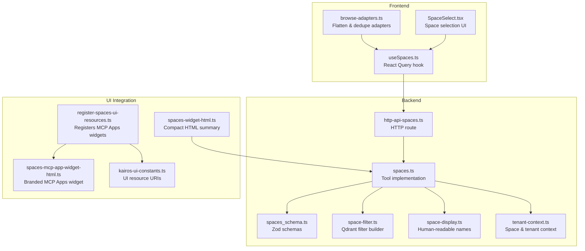
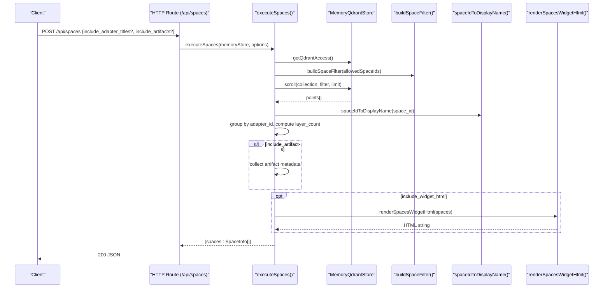
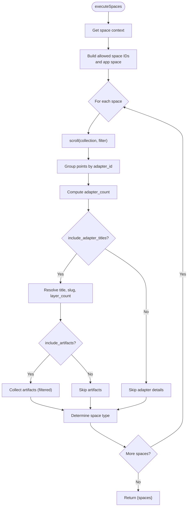
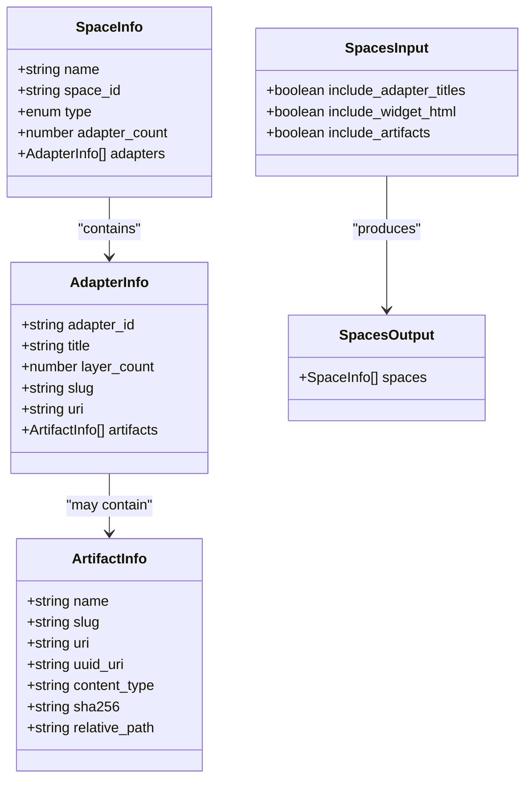
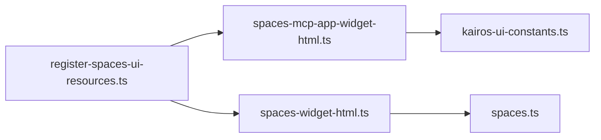
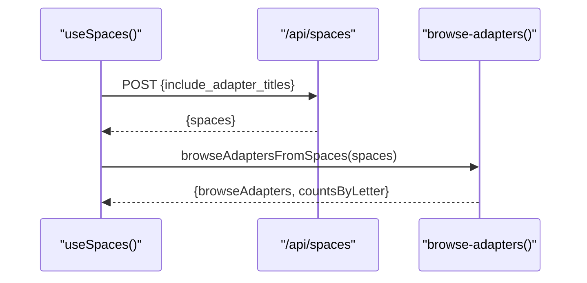
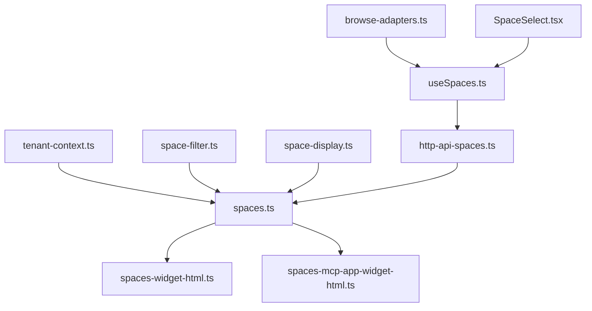

# Spaces Tool

<cite>
**Referenced Files in This Document**
- [spaces.ts](file://src/tools/spaces.ts)
- [spaces_schema.ts](file://src/tools/spaces_schema.ts)
- [http-api-spaces.ts](file://src/http/http-api-spaces.ts)
- [spaces-widget-html.ts](file://src/mcp-apps/spaces-widget-html.ts)
- [spaces-mcp-app-widget-html.ts](file://src/mcp-apps/spaces-mcp-app-widget-html.ts)
- [register-spaces-ui-resources.ts](file://src/mcp-apps/register-spaces-ui-resources.ts)
- [kairos-ui-constants.ts](file://src/mcp-apps/kairos-ui-constants.ts)
- [useSpaces.ts](file://src/ui/hooks/useSpaces.ts)
- [browse-adapters.ts](file://src/ui/utils/browse-adapters.ts)
- [SpaceSelect.tsx](file://src/ui/components/SpaceSelect.tsx)
- [space-display.ts](file://src/utils/space-display.ts)
- [space-filter.ts](file://src/utils/space-filter.ts)
- [tenant-context.ts](file://src/utils/tenant-context.ts)
- [spaces.ts (CLI command)](file://src/cli/commands/spaces.ts)
</cite>

## Table of Contents
1. [Introduction](#introduction)
2. [Project Structure](#project-structure)
3. [Core Components](#core-components)
4. [Architecture Overview](#architecture-overview)
5. [Detailed Component Analysis](#detailed-component-analysis)
6. [Dependency Analysis](#dependency-analysis)
7. [Performance Considerations](#performance-considerations)
8. [Troubleshooting Guide](#troubleshooting-guide)
9. [Conclusion](#conclusion)
10. [Appendices](#appendices)

## Introduction
The Spaces Tool organizes protocols and adapters into logical groupings called spaces. It exposes a consistent interface to list available spaces, count adapters per space, optionally include adapter titles and layer counts, and generate UI metadata for presentation. It integrates with the UI system to provide both a compact HTML summary and a branded MCP Apps widget, while enforcing permission scoping via tenant and space context derived from authentication.

## Project Structure
The Spaces Tool spans backend tooling, HTTP API, UI integration, and frontend utilities:

- Backend tool and schemas: define inputs/outputs, permission scoping, adapter counting, and optional artifact metadata.
- HTTP API: exposes a POST endpoint to list spaces with optional adapter details.
- UI integration: registers MCP Apps resources and renders a branded widget; also provides a compact HTML fallback.
- Frontend utilities: flatten adapters across spaces, deduplicate by adapter_id, and compute browse-by-letter counts.

**Diagram sources**
- [spaces.ts:190-272](file://src/tools/spaces.ts#L190-L272)
- [spaces_schema.ts:1-53](file://src/tools/spaces_schema.ts#L1-L53)
- [http-api-spaces.ts:11-31](file://src/http/http-api-spaces.ts#L11-L31)
- [space-filter.ts:14-26](file://src/utils/space-filter.ts#L14-L26)
- [space-display.ts:24-37](file://src/utils/space-display.ts#L24-L37)
- [tenant-context.ts:115-119](file://src/utils/tenant-context.ts#L115-L119)
- [register-spaces-ui-resources.ts:18-40](file://src/mcp-apps/register-spaces-ui-resources.ts#L18-L40)
- [spaces-widget-html.ts:34-82](file://src/mcp-apps/spaces-widget-html.ts#L34-L82)
- [spaces-mcp-app-widget-html.ts:16-409](file://src/mcp-apps/spaces-mcp-app-widget-html.ts#L16-L409)
- [kairos-ui-constants.ts:7-58](file://src/mcp-apps/kairos-ui-constants.ts#L7-L58)
- [useSpaces.ts:24-47](file://src/ui/hooks/useSpaces.ts#L24-L47)
- [browse-adapters.ts:17-62](file://src/ui/utils/browse-adapters.ts#L17-L62)
- [SpaceSelect.tsx:22-53](file://src/ui/components/SpaceSelect.tsx#L22-L53)

**Section sources**
- [spaces.ts:1-273](file://src/tools/spaces.ts#L1-L273)
- [spaces_schema.ts:1-53](file://src/tools/spaces_schema.ts#L1-L53)
- [http-api-spaces.ts:1-32](file://src/http/http-api-spaces.ts#L1-L32)
- [register-spaces-ui-resources.ts:1-41](file://src/mcp-apps/register-spaces-ui-resources.ts#L1-L41)
- [spaces-widget-html.ts:1-83](file://src/mcp-apps/spaces-widget-html.ts#L1-L83)
- [spaces-mcp-app-widget-html.ts:1-410](file://src/mcp-apps/spaces-mcp-app-widget-html.ts#L1-L410)
- [kairos-ui-constants.ts:1-68](file://src/mcp-apps/kairos-ui-constants.ts#L1-L68)
- [useSpaces.ts:1-47](file://src/ui/hooks/useSpaces.ts#L1-L47)
- [browse-adapters.ts:1-63](file://src/ui/utils/browse-adapters.ts#L1-L63)
- [SpaceSelect.tsx:1-67](file://src/ui/components/SpaceSelect.tsx#L1-L67)
- [space-display.ts:1-38](file://src/utils/space-display.ts#L1-L38)
- [space-filter.ts:1-48](file://src/utils/space-filter.ts#L1-L48)
- [tenant-context.ts:1-307](file://src/utils/tenant-context.ts#L1-L307)

## Core Components
- Spaces tool implementation: builds space info from Qdrant scroll results, computes adapter counts, optionally resolves titles, slugs, and artifacts, and supports optional HTML widget rendering.
- Schemas: define input parameters (adapter inclusion flags) and output structure (spaces array with optional adapters).
- HTTP API: wraps tool execution with space context and returns structured JSON.
- UI integration: registers MCP Apps resources and renders a branded widget; also provides a compact HTML summary.
- Frontend utilities: flatten adapters across spaces, dedupe by adapter_id preferring higher layer_count, and compute per-letter counts.

**Section sources**
- [spaces.ts:190-272](file://src/tools/spaces.ts#L190-L272)
- [spaces_schema.ts:3-52](file://src/tools/spaces_schema.ts#L3-L52)
- [http-api-spaces.ts:11-31](file://src/http/http-api-spaces.ts#L11-L31)
- [spaces-widget-html.ts:34-82](file://src/mcp-apps/spaces-widget-html.ts#L34-L82)
- [spaces-mcp-app-widget-html.ts:16-409](file://src/mcp-apps/spaces-mcp-app-widget-html.ts#L16-L409)
- [browse-adapters.ts:17-62](file://src/ui/utils/browse-adapters.ts#L17-L62)

## Architecture Overview
The Spaces Tool orchestrates permission scoping, adapter counting, and UI metadata generation across backend, HTTP, and UI layers.

**Diagram sources**
- [http-api-spaces.ts:11-31](file://src/http/http-api-spaces.ts#L11-L31)
- [spaces.ts:66-207](file://src/tools/spaces.ts#L66-L207)
- [space-filter.ts:14-26](file://src/utils/space-filter.ts#L14-L26)
- [space-display.ts:24-37](file://src/utils/space-display.ts#L24-L37)
- [spaces-widget-html.ts:34-82](file://src/mcp-apps/spaces-widget-html.ts#L34-L82)

## Detailed Component Analysis

### Backend Tool: Spaces
Responsibilities:
- Resolve allowed space IDs from tenant context.
- Scroll Qdrant points per space with a space filter.
- Group by adapter_id to compute adapter counts and layer counts.
- Optionally include adapter titles, slugs, and artifacts.
- Render optional HTML summary for hosts that consume HTML content.

Key behaviors:
- Deduplicates space IDs and includes the app space.
- Builds human-readable names and infers space type from IDs.
- Computes layer_count either from adapter metadata or sibling rows.
- Sanitizes artifact metadata and filters by allowed MIME types.

**Diagram sources**
- [spaces.ts:60-207](file://src/tools/spaces.ts#L60-L207)
- [space-filter.ts:14-26](file://src/utils/space-filter.ts#L14-L26)
- [space-display.ts:14-37](file://src/utils/space-display.ts#L14-L37)

**Section sources**
- [spaces.ts:60-207](file://src/tools/spaces.ts#L60-L207)
- [space-filter.ts:14-47](file://src/utils/space-filter.ts#L14-L47)
- [space-display.ts:14-37](file://src/utils/space-display.ts#L14-L37)

### Schemas: Inputs and Outputs
Inputs:
- include_adapter_titles: boolean (optional, default false) — include per-space adapters with title and layer_count.
- include_widget_html: boolean (optional, default false) — append an HTML summary; implies adapter titles are loaded.
- include_artifacts: boolean (optional, default false) — include artifact metadata per adapter; implies adapter titles.

Outputs:
- spaces: array of space entries with name, space_id, type, adapter_count, and optional adapters.
- Each adapter includes adapter_id, title, layer_count, slug, uri, and optional artifacts.

**Diagram sources**
- [spaces_schema.ts:3-52](file://src/tools/spaces_schema.ts#L3-L52)

**Section sources**
- [spaces_schema.ts:1-53](file://src/tools/spaces_schema.ts#L1-L53)

### HTTP API: /api/spaces
- Accepts include_adapter_titles and include_artifacts in the request body.
- Wraps execution with space context derived from the request.
- Returns 200 JSON with spaces or 500 with error payload.

**Section sources**
- [http-api-spaces.ts:11-31](file://src/http/http-api-spaces.ts#L11-L31)

### UI Integration: MCP Apps Widgets
- Registers two HTML resources for the spaces widget: standard MCP Apps and Skybridge profiles.
- Provides a compact HTML renderer for hosts that render HTML directly from tool content.
- Provides a branded MCP Apps widget with theming support and JSON-RPC messaging.

**Diagram sources**
- [register-spaces-ui-resources.ts:18-40](file://src/mcp-apps/register-spaces-ui-resources.ts#L18-L40)
- [spaces-mcp-app-widget-html.ts:16-409](file://src/mcp-apps/spaces-mcp-app-widget-html.ts#L16-L409)
- [spaces-widget-html.ts:34-82](file://src/mcp-apps/spaces-widget-html.ts#L34-L82)
- [kairos-ui-constants.ts:7-58](file://src/mcp-apps/kairos-ui-constants.ts#L7-L58)

**Section sources**
- [register-spaces-ui-resources.ts:1-41](file://src/mcp-apps/register-spaces-ui-resources.ts#L1-L41)
- [spaces-widget-html.ts:1-83](file://src/mcp-apps/spaces-widget-html.ts#L1-L83)
- [spaces-mcp-app-widget-html.ts:1-410](file://src/mcp-apps/spaces-mcp-app-widget-html.ts#L1-L410)
- [kairos-ui-constants.ts:1-68](file://src/mcp-apps/kairos-ui-constants.ts#L1-L68)

### Frontend Hooks and Utilities
- useSpaces: React Query hook that posts to /api/spaces and returns spaces with optional adapter details.
- browse-adapters: Flattens adapters across spaces, deduplicates by adapter_id (preferring higher layer_count), and computes per-letter counts.
- SpaceSelect: Renders a dropdown of spaces with type badges.

**Diagram sources**
- [useSpaces.ts:24-47](file://src/ui/hooks/useSpaces.ts#L24-L47)
- [browse-adapters.ts:17-62](file://src/ui/utils/browse-adapters.ts#L17-L62)

**Section sources**
- [useSpaces.ts:1-47](file://src/ui/hooks/useSpaces.ts#L1-L47)
- [browse-adapters.ts:1-63](file://src/ui/utils/browse-adapters.ts#L1-L63)
- [SpaceSelect.tsx:22-67](file://src/ui/components/SpaceSelect.tsx#L22-L67)

## Dependency Analysis
- Permission scoping: Tenant context determines allowedSpaceIds and defaultWriteSpaceId; the tool reports only spaces in allowedSpaceIds plus the app space.
- Adapter counting: Aggregates by adapter_id and computes layer_count from metadata or sibling rows.
- UI metadata: Tool includes structuredContent for MCP Apps; optional HTML content for hosts that render HTML directly.
- Frontend integration: React Query hook consumes the HTTP API; utilities flatten and dedupe adapters for browsing.

**Diagram sources**
- [tenant-context.ts:115-119](file://src/utils/tenant-context.ts#L115-L119)
- [spaces.ts:60-207](file://src/tools/spaces.ts#L60-L207)
- [space-filter.ts:14-26](file://src/utils/space-filter.ts#L14-L26)
- [space-display.ts:24-37](file://src/utils/space-display.ts#L24-L37)
- [http-api-spaces.ts:11-31](file://src/http/http-api-spaces.ts#L11-L31)
- [spaces-widget-html.ts:34-82](file://src/mcp-apps/spaces-widget-html.ts#L34-L82)
- [spaces-mcp-app-widget-html.ts:16-409](file://src/mcp-apps/spaces-mcp-app-widget-html.ts#L16-L409)
- [useSpaces.ts:24-47](file://src/ui/hooks/useSpaces.ts#L24-L47)
- [browse-adapters.ts:17-62](file://src/ui/utils/browse-adapters.ts#L17-L62)
- [SpaceSelect.tsx:22-67](file://src/ui/components/SpaceSelect.tsx#L22-L67)

**Section sources**
- [spaces.ts:60-207](file://src/tools/spaces.ts#L60-L207)
- [tenant-context.ts:115-145](file://src/utils/tenant-context.ts#L115-L145)
- [space-filter.ts:14-47](file://src/utils/space-filter.ts#L14-L47)
- [space-display.ts:14-37](file://src/utils/space-display.ts#L14-L37)
- [http-api-spaces.ts:11-31](file://src/http/http-api-spaces.ts#L11-L31)
- [useSpaces.ts:24-47](file://src/ui/hooks/useSpaces.ts#L24-L47)
- [browse-adapters.ts:17-62](file://src/ui/utils/browse-adapters.ts#L17-L62)
- [SpaceSelect.tsx:22-67](file://src/ui/components/SpaceSelect.tsx#L22-L67)

## Performance Considerations
- Scrolling limit: The tool scrolls with a fixed limit per space to bound query cost.
- Deduplication: Adapter aggregation by adapter_id reduces redundant processing.
- Conditional loading: Adapter titles and artifacts are only computed when requested.
- UI rendering: The compact HTML renderer avoids heavy DOM manipulation and relies on minimal markup.

[No sources needed since this section provides general guidance]

## Troubleshooting Guide
Common issues and resolutions:
- No spaces returned: Verify allowedSpaceIds from tenant context and ensure the app space is included.
- Missing adapter details: Confirm include_adapter_titles or include_widget_html is set; artifacts require include_adapter_titles.
- Widget not rendering: Ensure MCP Apps resources are registered and the host supports the expected MIME profile.
- Incorrect space type or name: Validate space_id format and display mapping logic.

**Section sources**
- [spaces.ts:60-207](file://src/tools/spaces.ts#L60-L207)
- [register-spaces-ui-resources.ts:18-40](file://src/mcp-apps/register-spaces-ui-resources.ts#L18-L40)
- [spaces-widget-html.ts:34-82](file://src/mcp-apps/spaces-widget-html.ts#L34-L82)
- [space-display.ts:24-37](file://src/utils/space-display.ts#L24-L37)

## Conclusion
The Spaces Tool provides a robust mechanism to organize adapters into spaces, enforce permission scoping, and deliver UI metadata for both compact HTML summaries and branded MCP Apps widgets. Its schema-driven design, conditional computation of adapter details, and frontend utilities enable efficient browsing and selection of adapters across spaces.

[No sources needed since this section summarizes without analyzing specific files]

## Appendices

### Input Schema Reference
- include_adapter_titles: boolean (optional) — include per-space adapters with title and layer_count.
- include_widget_html: boolean (optional) — append an HTML summary; implies adapter titles are loaded.
- include_artifacts: boolean (optional) — include artifact metadata per adapter; implies adapter titles.

**Section sources**
- [spaces_schema.ts:3-21](file://src/tools/spaces_schema.ts#L3-L21)

### Output Schema Reference
- spaces: array of:
  - name: string
  - space_id: string
  - type: enum ["personal", "group", "app", "other"]
  - adapter_count: number
  - adapters: optional array of:
    - adapter_id: string
    - title: string
    - layer_count: number
    - slug: string or null
    - uri: string (ready-to-use kairos://adapter/{slug})
    - artifacts: optional array of:
      - name: string
      - slug: string
      - uri: string
      - uuid_uri: string
      - content_type: string
      - sha256: string
      - relative_path: string or null

**Section sources**
- [spaces_schema.ts:23-52](file://src/tools/spaces_schema.ts#L23-L52)

### Practical Workflows and Examples
- Listing spaces with adapter counts:
  - HTTP: POST /api/spaces with include_adapter_titles=false.
  - CLI: spaces command with --include-adapter-titles.
- Including adapter details:
  - HTTP: POST /api/spaces with include_adapter_titles=true.
  - UI: useSpaces hook with includeAdapterTitles=true.
- Generating HTML summary:
  - Tool input: include_widget_html=true; tool returns structuredContent plus HTML content.
- Organizing adapters:
  - Use browse-adapters utility to flatten and dedupe adapters across spaces.
  - Use SpaceSelect to choose a space by name or id.

**Section sources**
- [http-api-spaces.ts:11-31](file://src/http/http-api-spaces.ts#L11-L31)
- [spaces.ts (CLI command):9-27](file://src/cli/commands/spaces.ts#L9-L27)
- [useSpaces.ts:24-47](file://src/ui/hooks/useSpaces.ts#L24-L47)
- [browse-adapters.ts:17-62](file://src/ui/utils/browse-adapters.ts#L17-L62)
- [SpaceSelect.tsx:22-67](file://src/ui/components/SpaceSelect.tsx#L22-L67)

### Best Practices
- Prefer space names in tool invocations (activate, train, tune) rather than raw ids.
- Use include_adapter_titles when multiple protocols share labels to disambiguate adapters.
- Leverage include_artifacts for detailed artifact inspection when needed.
- Keep include_widget_html enabled for hosts that render HTML directly from tool content.
- Organize teams around group spaces and reserve personal spaces for individual workloads.

[No sources needed since this section provides general guidance]