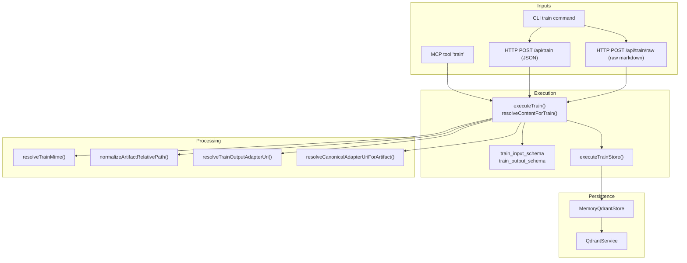
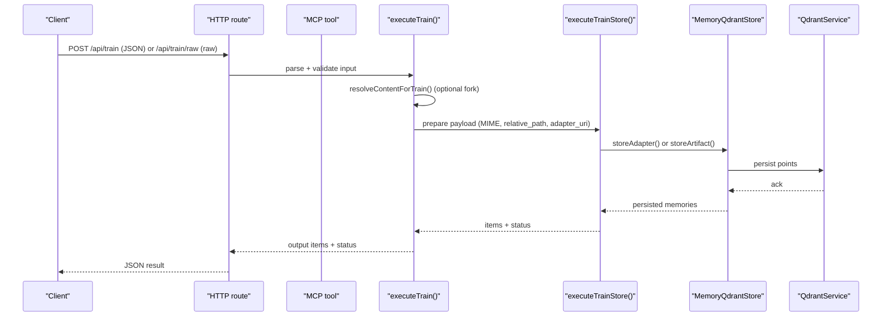
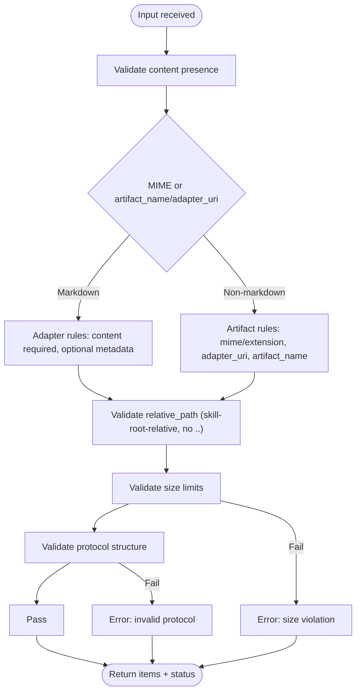
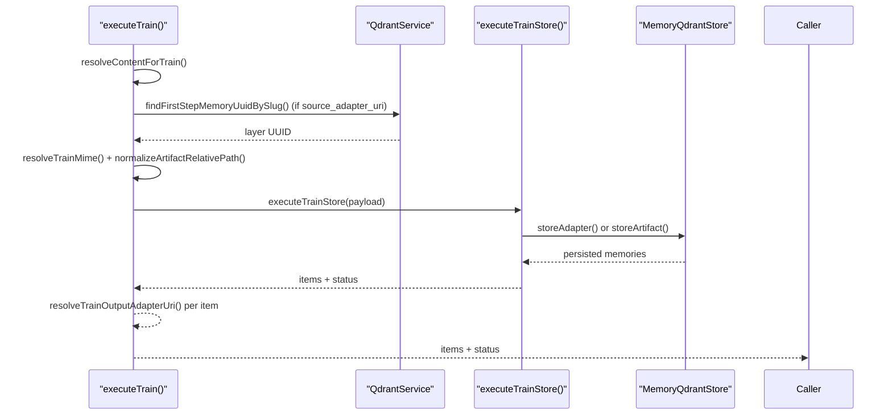
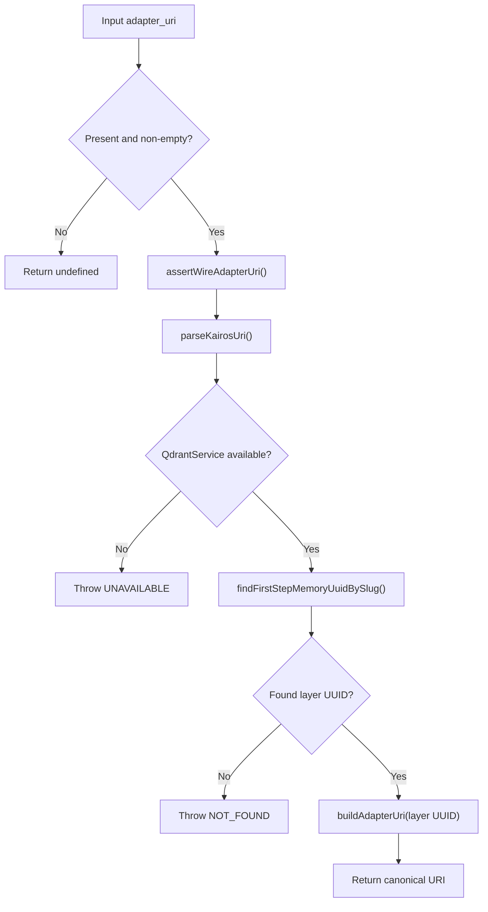
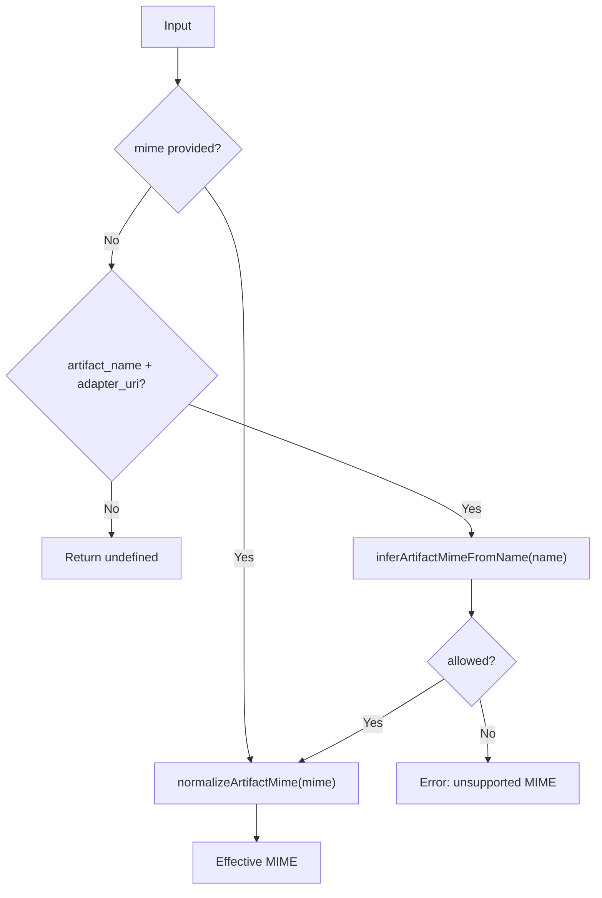
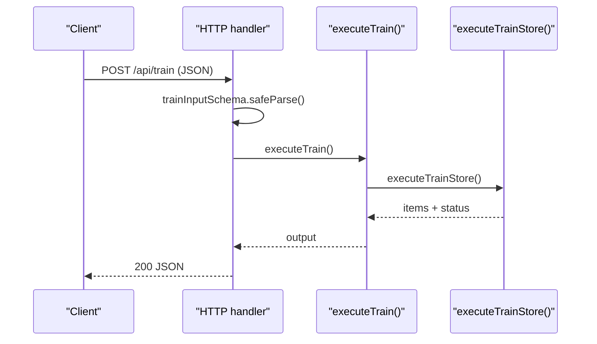
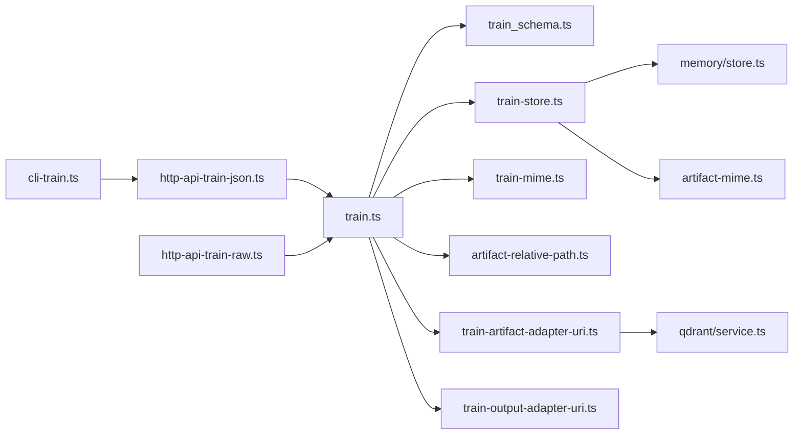

# Train Tool

<cite>
**Referenced Files in This Document**
- [src/tools/train.ts](file://src/tools/train.ts)
- [src/tools/train_schema.ts](file://src/tools/train_schema.ts)
- [src/tools/train-store.ts](file://src/tools/train-store.ts)
- [src/tools/train-mime.ts](file://src/tools/train-mime.ts)
- [src/tools/train-artifact-adapter-uri.ts](file://src/tools/train-artifact-adapter-uri.ts)
- [src/tools/train-output-adapter-uri.ts](file://src/tools/train-output-adapter-uri.ts)
- [src/tools/artifact-mime.ts](file://src/tools/artifact-mime.ts)
- [src/tools/artifact-relative-path.ts](file://src/tools/artifact-relative-path.ts)
- [src/http/http-api-train-json.ts](file://src/http/http-api-train-json.ts)
- [src/http/http-api-train-raw.ts](file://src/http/http-api-train-raw.ts)
- [src/cli/commands/cli-train.ts](file://src/cli/commands/cli-train.ts)
- [src/services/memory/store.ts](file://src/services/memory/store.ts)
- [src/services/qdrant/service.ts](file://src/services/qdrant/service.ts)
- [src/utils/frontmatter.ts](file://src/utils/frontmatter.ts)
- [src/tools/skill-export/artifact-sanitization/run-sanitization.ts](file://src/tools/skill-export/artifact-sanitization/run-sanitization.ts)
- [src/tools/skill-export/artifact-sanitization/default-rules.ts](file://src/tools/skill-export/artifact-sanitization/default-rules.ts)
- [src/tools/skill-export/artifact-sanitization/extension-mime-map.ts](file://src/tools/skill-export/artifact-sanitization/extension-mime-map.ts)
- [tests/unit/train-artifact-adapter-uri.test.ts](file://tests/unit/train-artifact-adapter-uri.test.ts)
- [tests/unit/train-artifact-mime-inference.test.ts](file://tests/unit/train-artifact-mime-inference.test.ts)
- [tests/unit/train-schema-fork.test.ts](file://tests/unit/train-schema-fork.test.ts)
- [tests/unit/train-schema-relative-path.test.ts](file://tests/unit/train-schema-relative-path.test.ts)
- [tests/unit/train-similarity-guard.test.ts](file://tests/unit/train-similarity-guard.test.ts)
- [tests/unit/train-similarity-query.test.ts](file://tests/unit/train-similarity-query.test.ts)
- [tests/integration/kairos-train-basic.test.ts](file://tests/integration/kairos-train-basic.test.ts)
- [tests/integration/kairos-train-validation.test.ts](file://tests/integration/kairos-train-validation.test.ts)
- [tests/integration/kairos-train-artifact.test.ts](file://tests/integration/kairos-train-artifact.test.ts)
- [tests/integration/kairos-train-import-data.test.ts](file://tests/integration/kairos-train-import-data.test.ts)
- [tests/integration/kairos-train-integration.test.ts](file://tests/integration/kairos-train-integration.test.ts)
</cite>

## Table of Contents
1. [Introduction](#introduction)
2. [Project Structure](#project-structure)
3. [Core Components](#core-components)
4. [Architecture Overview](#architecture-overview)
5. [Detailed Component Analysis](#detailed-component-analysis)
6. [Dependency Analysis](#dependency-analysis)
7. [Performance Considerations](#performance-considerations)
8. [Troubleshooting Guide](#troubleshooting-guide)
9. [Conclusion](#conclusion)
10. [Appendices](#appendices)

## Introduction
The Train Tool ingests markdown protocols and embedded artifacts, validates inputs, resolves artifact metadata, and persists content into the memory store. It supports two modes:
- Adapter mode: stores markdown protocols with frontmatter and metadata into adapter layers.
- Artifact mode: stores arbitrary text content (scripts, configs, etc.) under a parent adapter with MIME-type enforcement and optional relative path preservation.

The tool exposes an MCP tool, HTTP endpoints, and a CLI command. It enforces strict validation rules, normalizes MIME types, resolves adapter URIs, and sanitizes content and paths.

## Project Structure
The Train Tool spans several modules:
- Input validation and schemas
- Execution orchestration (MCP tool registration, HTTP routes, CLI)
- Storage and persistence (Qdrant-backed memory store)
- Artifact processing (MIME inference, adapter URI resolution, relative path normalization)
- Sanitization pipeline (export-time rules; training also applies size and structure checks)

**Diagram sources**
- [src/tools/train.ts:134-238](file://src/tools/train.ts#L134-L238)
- [src/tools/train_schema.ts:54-168](file://src/tools/train_schema.ts#L54-L168)
- [src/tools/train-store.ts:47-130](file://src/tools/train-store.ts#L47-L130)
- [src/tools/train-mime.ts:4-20](file://src/tools/train-mime.ts#L4-L20)
- [src/tools/train-artifact-adapter-uri.ts:5-36](file://src/tools/train-artifact-adapter-uri.ts#L5-L36)
- [src/tools/train-output-adapter-uri.ts:4-32](file://src/tools/train-output-adapter-uri.ts#L4-L32)
- [src/tools/artifact-relative-path.ts:7-27](file://src/tools/artifact-relative-path.ts#L7-L27)
- [src/services/memory/store.ts:20-152](file://src/services/memory/store.ts#L20-L152)
- [src/services/qdrant/service.ts:16-152](file://src/services/qdrant/service.ts#L16-L152)

**Section sources**
- [src/tools/train.ts:134-238](file://src/tools/train.ts#L134-L238)
- [src/tools/train_schema.ts:54-168](file://src/tools/train_schema.ts#L54-L168)
- [src/tools/train-store.ts:47-130](file://src/tools/train-store.ts#L47-L130)
- [src/tools/train-mime.ts:4-20](file://src/tools/train-mime.ts#L4-L20)
- [src/tools/train-artifact-adapter-uri.ts:5-36](file://src/tools/train-artifact-adapter-uri.ts#L5-L36)
- [src/tools/train-output-adapter-uri.ts:4-32](file://src/tools/train-output-adapter-uri.ts#L4-L32)
- [src/tools/artifact-relative-path.ts:7-27](file://src/tools/artifact-relative-path.ts#L7-L27)
- [src/services/memory/store.ts:20-152](file://src/services/memory/store.ts#L20-L152)
- [src/services/qdrant/service.ts:16-152](file://src/services/qdrant/service.ts#L16-L152)

## Core Components
- Input schemas define allowed fields, constraints, and cross-field dependencies for training adapters and artifacts.
- Execution orchestrator validates inputs, resolves content (including optional fork from another adapter), infers MIME, normalizes paths, and dispatches to storage.
- Storage layer validates sizes and structure, enforces MIME allowlists, and persists either adapter layers or artifacts.
- Utility modules handle MIME normalization, adapter URI canonicalization, and relative path normalization.

Key responsibilities:
- Validation: Zod schemas enforce required fields, MIME semantics, and relative path rules.
- Artifact processing: MIME inference, allowlist enforcement, and relative path normalization.
- Persistence: Adapter markdown validation and storage, artifact content validation and storage.
- Output: Construct URIs for layers or artifacts, and include adapter URIs derived from memory or input.

**Section sources**
- [src/tools/train_schema.ts:54-168](file://src/tools/train_schema.ts#L54-L168)
- [src/tools/train.ts:134-238](file://src/tools/train.ts#L134-L238)
- [src/tools/train-store.ts:47-130](file://src/tools/train-store.ts#L47-L130)
- [src/tools/artifact-mime.ts:22-50](file://src/tools/artifact-mime.ts#L22-L50)

## Architecture Overview
The Train Tool integrates three transports with a shared execution engine and storage backend.

**Diagram sources**
- [src/http/http-api-train-json.ts:51-107](file://src/http/http-api-train-json.ts#L51-L107)
- [src/http/http-api-train-raw.ts:53-136](file://src/http/http-api-train-raw.ts#L53-L136)
- [src/tools/train.ts:134-238](file://src/tools/train.ts#L134-L238)
- [src/tools/train-store.ts:47-130](file://src/tools/train-store.ts#L47-L130)
- [src/services/memory/store.ts:123-133](file://src/services/memory/store.ts#L123-L133)
- [src/services/qdrant/service.ts:77-84](file://src/services/qdrant/service.ts#L77-L84)

## Detailed Component Analysis

### Input Schema and Validation Rules
The input schema defines:
- Adapter mode: content must be non-empty markdown; optional protocol_version, space, force_update, source_adapter_uri.
- Artifact mode: content must be non-markdown text; requires artifact_name and adapter_uri; mime may be inferred from artifact_name extension; relative_path allowed only for artifacts.
- Cross-field constraints ensure semantic consistency (e.g., artifact fields are rejected for markdown MIME).

**Diagram sources**
- [src/tools/train_schema.ts:90-155](file://src/tools/train_schema.ts#L90-L155)
- [src/tools/train-store.ts:64-112](file://src/tools/train-store.ts#L64-L112)

**Section sources**
- [src/tools/train_schema.ts:54-168](file://src/tools/train_schema.ts#L54-L168)
- [src/tools/train-store.ts:47-130](file://src/tools/train-store.ts#L47-L130)

### Execution Orchestration
The execution orchestrator:
- Resolves content from input or forks from a source adapter via Qdrant.
- Infers MIME for artifacts and normalizes relative paths.
- Dispatches to storage with a normalized payload.
- Builds output items with appropriate URIs (layer or artifact), adapter URIs, labels, tags, and content types.

**Diagram sources**
- [src/tools/train.ts:134-238](file://src/tools/train.ts#L134-L238)
- [src/tools/train-store.ts:47-130](file://src/tools/train-store.ts#L47-L130)
- [src/services/qdrant/service.ts:82-84](file://src/services/qdrant/service.ts#L82-L84)
- [src/services/memory/store.ts:123-133](file://src/services/memory/store.ts#L123-L133)

**Section sources**
- [src/tools/train.ts:134-238](file://src/tools/train.ts#L134-L238)

### Artifact Adapter URI Resolution
When training artifacts, the adapter URI can be provided as a slug or UUID. The resolver:
- Validates the input URI format.
- Resolves the slug to a canonical layer UUID via Qdrant.
- Returns a canonical adapter URI for downstream use.

**Diagram sources**
- [src/tools/train-artifact-adapter-uri.ts:5-36](file://src/tools/train-artifact-adapter-uri.ts#L5-L36)
- [src/services/qdrant/service.ts:82-84](file://src/services/qdrant/service.ts#L82-L84)

**Section sources**
- [src/tools/train-artifact-adapter-uri.ts:5-36](file://src/tools/train-artifact-adapter-uri.ts#L5-L36)

### MIME Type Detection and Normalization
MIME detection follows a precedence:
- Explicit mime field takes priority.
- If absent but artifact_name and adapter_uri are present, MIME is inferred from the filename extension.
- The detected MIME is normalized and checked against the allowlist.

**Diagram sources**
- [src/tools/train-mime.ts:4-20](file://src/tools/train-mime.ts#L4-L20)
- [src/tools/artifact-mime.ts:34-48](file://src/tools/artifact-mime.ts#L34-L48)

**Section sources**
- [src/tools/train-mime.ts:4-20](file://src/tools/train-mime.ts#L4-L20)
- [src/tools/artifact-mime.ts:22-50](file://src/tools/artifact-mime.ts#L22-L50)

### Relative Path Normalization
Relative paths for artifacts must be skill-root-relative and must not traverse outside the skill root. The validator rejects:
- Paths starting with “/”
- Segments containing “..”
- Empty or trailing slash segments
- Excessive length

**Section sources**
- [src/tools/artifact-relative-path.ts:7-27](file://src/tools/artifact-relative-path.ts#L7-L27)
- [src/tools/train_schema.ts:6-43](file://src/tools/train_schema.ts#L6-L43)

### Output Adapter URI Resolution
Output adapter URIs are derived from:
- Memory slug/name
- Item or input adapter URIs
- Fallback to canonical adapter ID

**Section sources**
- [src/tools/train-output-adapter-uri.ts:4-32](file://src/tools/train-output-adapter-uri.ts#L4-L32)

### HTTP Endpoints and CLI
- HTTP JSON endpoint: Validates JSON body, resolves space context, executes training, and returns structured results or sanitized error payloads.
- HTTP RAW endpoint: Reads raw markdown from request body, infers attributes from headers/query, validates, and executes training.
- CLI train: Supports single-file and directory batch modes, artifact mode detection, and emits JSON results. In batch mode with `--model`, co-located artifact files are auto-discovered and uploaded alongside each adapter.

**Diagram sources**
- [src/http/http-api-train-json.ts:51-107](file://src/http/http-api-train-json.ts#L51-L107)
- [src/tools/train.ts:134-238](file://src/tools/train.ts#L134-L238)
- [src/tools/train-store.ts:47-130](file://src/tools/train-store.ts#L47-L130)

**Section sources**
- [src/http/http-api-train-json.ts:51-173](file://src/http/http-api-train-json.ts#L51-L173)
- [src/http/http-api-train-raw.ts:53-199](file://src/http/http-api-train-raw.ts#L53-L199)
- [src/cli/commands/cli-train.ts:56-276](file://src/cli/commands/cli-train.ts#L56-L276)

## Dependency Analysis
- Execution depends on schemas for validation and on storage for persistence.
- Artifact mode depends on MIME utilities and relative path normalization.
- Adapter URI resolution depends on Qdrant for slug-to-UUID mapping.
- HTTP and CLI layers depend on the execution engine and inject space context.

**Diagram sources**
- [src/tools/train.ts:1-346](file://src/tools/train.ts#L1-L346)
- [src/tools/train_schema.ts:1-218](file://src/tools/train_schema.ts#L1-L218)
- [src/tools/train-store.ts:1-131](file://src/tools/train-store.ts#L1-L131)
- [src/tools/train-mime.ts:1-22](file://src/tools/train-mime.ts#L1-L22)
- [src/tools/train-artifact-adapter-uri.ts:1-37](file://src/tools/train-artifact-adapter-uri.ts#L1-L37)
- [src/tools/train-output-adapter-uri.ts:1-33](file://src/tools/train-output-adapter-uri.ts#L1-L33)
- [src/tools/artifact-relative-path.ts:1-28](file://src/tools/artifact-relative-path.ts#L1-L28)
- [src/tools/artifact-mime.ts:1-50](file://src/tools/artifact-mime.ts#L1-L50)
- [src/services/memory/store.ts:1-152](file://src/services/memory/store.ts#L1-L152)
- [src/services/qdrant/service.ts:1-152](file://src/services/qdrant/service.ts#L1-L152)
- [src/http/http-api-train-json.ts:1-173](file://src/http/http-api-train-json.ts#L1-L173)
- [src/http/http-api-train-raw.ts:1-199](file://src/http/http-api-train-raw.ts#L1-L199)
- [src/cli/commands/cli-train.ts:1-276](file://src/cli/commands/cli-train.ts#L1-L276)

**Section sources**
- [src/tools/train.ts:1-346](file://src/tools/train.ts#L1-L346)
- [src/tools/train-store.ts:1-131](file://src/tools/train-store.ts#L1-L131)
- [src/services/qdrant/service.ts:1-152](file://src/services/qdrant/service.ts#L1-L152)

## Performance Considerations
- Validation occurs early to avoid unnecessary storage calls.
- Fork resolution requires Qdrant; ensure availability to prevent blocking.
- Large payloads are bounded by HTTP body limits; consider chunking or streaming for very large artifacts.
- Batch CLI operations reduce round-trips for directory scans.

[No sources needed since this section provides general guidance]

## Troubleshooting Guide
Common issues and resolutions:
- Invalid input schema: Review field-specific messages returned by the schema validator.
- Duplicate adapter: Use force_update to overwrite or choose a different label.
- Similar memory found: Inspect suggested matches and adjust content/title accordingly.
- Unsupported MIME: Ensure artifact_name has a recognized extension or supply mime explicitly.
- Invalid adapter URI: Provide a valid kairos://adapter/{slug} or UUID.
- Relative path errors: Use skill-root-relative paths with forward slashes and no “..” segments.
- Source adapter unavailable: Ensure Qdrant is reachable when using source_adapter_uri.

**Section sources**
- [src/tools/train.ts:56-83](file://src/tools/train.ts#L56-L83)
- [src/http/http-api-train-json.ts:117-170](file://src/http/http-api-train-json.ts#L117-L170)
- [src/http/http-api-train-raw.ts:138-197](file://src/http/http-api-train-raw.ts#L138-L197)
- [src/tools/train-store.ts:64-112](file://src/tools/train-store.ts#L64-L112)

## Conclusion
The Train Tool provides a robust, validated pathway to ingest protocols and artifacts into the system. Its schema-driven validation, MIME normalization, and adapter URI resolution ensure consistent and secure storage. The HTTP and CLI surfaces enable flexible workflows, while the MCP tool integrates seamlessly into agent pipelines.

[No sources needed since this section summarizes without analyzing specific files]

## Appendices

### Input Schema Reference
- Adapter mode
  - content: required string (markdown)
  - llm_model_id: required string
  - force_update: optional boolean
  - protocol_version: optional string
  - space: optional literal "personal" or string
  - source_adapter_uri: optional kairos://adapter/{slug}
- Artifact mode
  - content: required string (non-markdown text)
  - llm_model_id: required string
  - mime: optional string; inferred if omitted with artifact_name
  - artifact_name: required for artifact mode
  - adapter_uri: required for artifact mode
  - relative_path: optional skill-root-relative path
  - force_update, protocol_version, space: same as adapter mode

**Section sources**
- [src/tools/train_schema.ts:54-168](file://src/tools/train_schema.ts#L54-L168)

### Output Schema Reference
- items: array of
  - uri: string (kairos://layer/{uuid} or kairos://artifact/{uuid})
  - layer_uuid: optional string
  - artifact_uuid: optional string
  - adapter_uri: optional kairos://adapter/{slug}
  - label: string
  - tags: array of string
  - content_type: optional string
- status: literal "stored"

**Section sources**
- [src/tools/train_schema.ts:157-168](file://src/tools/train_schema.ts#L157-L168)

### Practical Workflows and Examples
- Train a markdown protocol
  - Use HTTP JSON or CLI with content and llm_model_id; optionally set protocol_version and space.
- Fork from an existing adapter
  - Provide source_adapter_uri and llm_model_id; optional content overrides exported body.
- Attach an artifact to an adapter
  - Supply content, llm_model_id, mime (or infer from artifact_name), adapter_uri, and optional relative_path.
- Batch training from a directory
  - CLI supports recursive scanning of `.md` files (excluding `README.md`). When `--model` is provided, co-located artifact-compatible files (`.py`, `.sh`, `.yaml`, `.yml`, `.js`, `.toml`, etc.) in the same directory as each `.md` file are automatically uploaded as artifacts linked to that adapter. Artifact results appear nested under `artifacts[]` in each batch result entry.

**Section sources**
- [src/http/http-api-train-json.ts:51-107](file://src/http/http-api-train-json.ts#L51-L107)
- [src/http/http-api-train-raw.ts:53-136](file://src/http/http-api-train-raw.ts#L53-L136)
- [src/cli/commands/cli-train.ts:56-276](file://src/cli/commands/cli-train.ts#L56-L276)

### Best Practices
- Authoring protocols
  - Include frontmatter with title and optional slug; keep content concise and well-structured.
- Training data preparation
  - Validate MIME and filenames; ensure relative_path reflects intended export layout.
- Quality assurance
  - Use force_update judiciously; review similarity warnings; sanitize sensitive content before upload.

[No sources needed since this section provides general guidance]