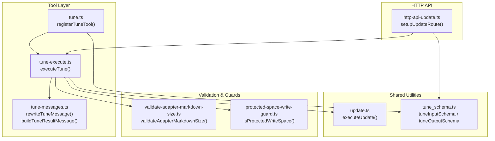
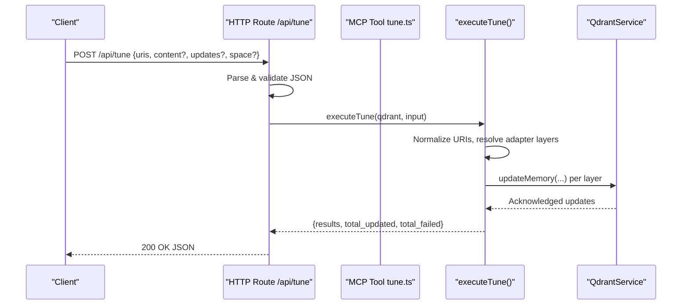
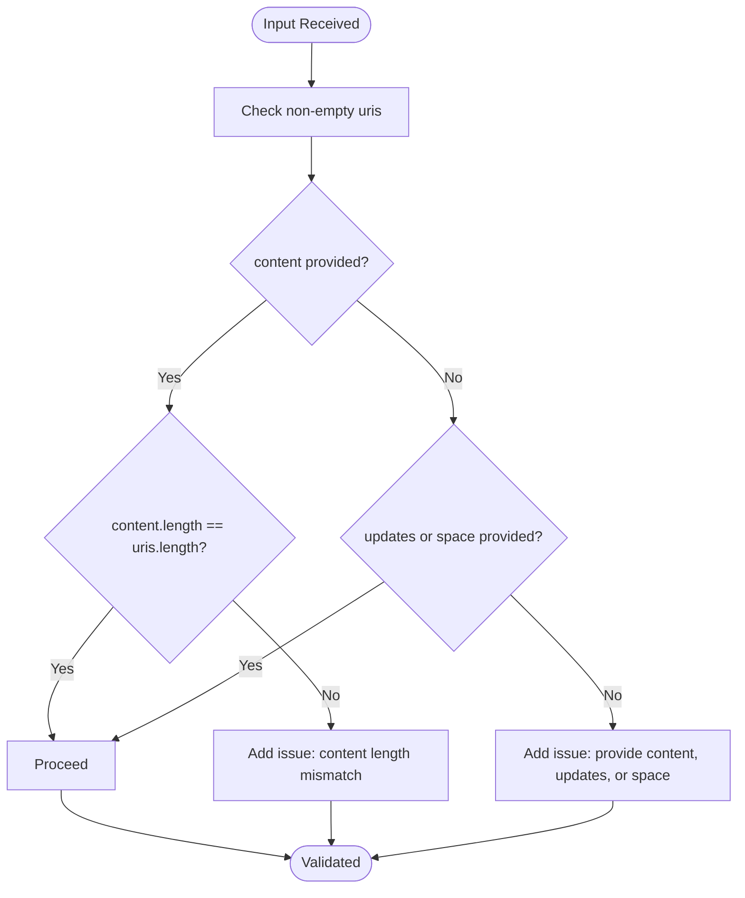
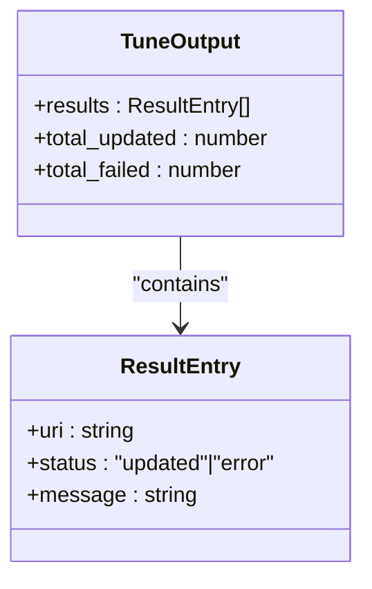
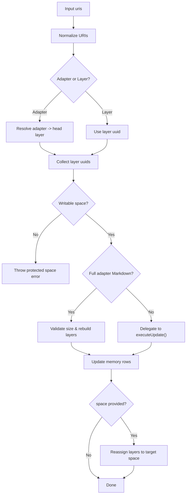
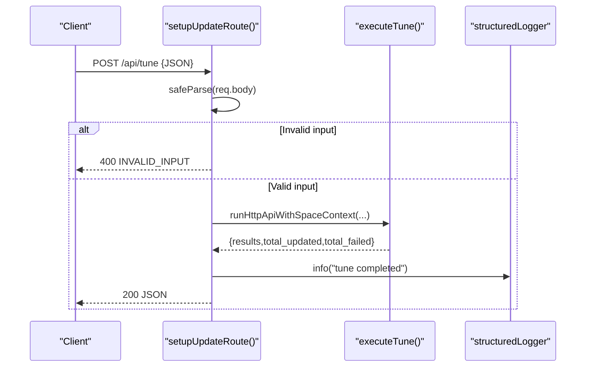
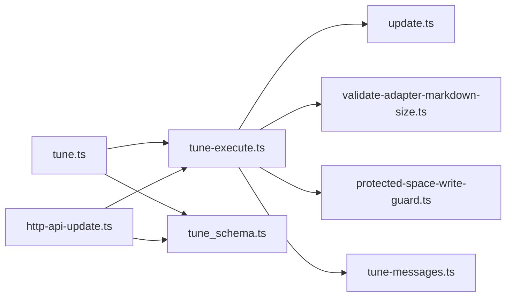

# Tune Tool

<cite>
**Referenced Files in This Document**
- [tune.ts](file://src/tools/tune.ts)
- [tune-execute.ts](file://src/tools/tune-execute.ts)
- [tune_schema.ts](file://src/tools/tune_schema.ts)
- [tune-messages.ts](file://src/tools/tune-messages.ts)
- [http-api-update.ts](file://src/http/http-api-update.ts)
- [update.ts](file://src/tools/update.ts)
- [validate-adapter-markdown-size.ts](file://src/services/memory/validate-adapter-markdown-size.ts)
- [protected-space-write-guard.ts](file://src/utils/protected-space-write-guard.ts)
- [tune.md](file://src/embed-docs/tools/tune.md)
- [workflow-tune.md](file://docs/architecture/workflow-tune.md)
</cite>

## Table of Contents
1. [Introduction](#introduction)
2. [Project Structure](#project-structure)
3. [Core Components](#core-components)
4. [Architecture Overview](#architecture-overview)
5. [Detailed Component Analysis](#detailed-component-analysis)
6. [Dependency Analysis](#dependency-analysis)
7. [Performance Considerations](#performance-considerations)
8. [Troubleshooting Guide](#troubleshooting-guide)
9. [Conclusion](#conclusion)
10. [Appendices](#appendices)

## Introduction
The Tune Tool enables in-place updates to existing stored adapter content and optional space reassignment. It supports updating either:
- Full adapter content via Markdown bodies (preferred for textual changes), or
- Individual layer fields via advanced updates.

It integrates with the training pipeline by complementing the Train Tool for structural changes and enabling iterative protocol improvements without disrupting adapter identity. The system enforces size limits, protected space rules, and provides robust error reporting and messaging.

## Project Structure
The Tune Tool spans several modules:
- Tool registration and orchestration
- Execution engine for in-place updates and space moves
- HTTP API binding
- Validation utilities and messaging helpers
- Documentation and workflow specs

**Diagram sources**
- [tune.ts:12-57](file://src/tools/tune.ts#L12-L57)
- [tune-execute.ts:216-347](file://src/tools/tune-execute.ts#L216-L347)
- [tune-messages.ts:7-22](file://src/tools/tune-messages.ts#L7-L22)
- [http-api-update.ts:11-34](file://src/http/http-api-update.ts#L11-L34)
- [update.ts:8-72](file://src/tools/update.ts#L8-L72)
- [validate-adapter-markdown-size.ts:33-108](file://src/services/memory/validate-adapter-markdown-size.ts#L33-L108)
- [protected-space-write-guard.ts:5-16](file://src/utils/protected-space-write-guard.ts#L5-L16)
- [tune_schema.ts:14-50](file://src/tools/tune_schema.ts#L14-L50)

**Section sources**
- [tune.ts:12-57](file://src/tools/tune.ts#L12-L57)
- [tune-execute.ts:216-347](file://src/tools/tune-execute.ts#L216-L347)
- [http-api-update.ts:11-34](file://src/http/http-api-update.ts#L11-L34)
- [tune_schema.ts:14-50](file://src/tools/tune_schema.ts#L14-L50)

## Core Components
- Input schema: Defines accepted fields, constraints, and validations for Tune Tool requests.
- Output schema: Standardizes per-target results and aggregated counts.
- Tool registration: Binds the Tune Tool to the MCP server with input/output schemas and metrics.
- Execution engine: Orchestrates normalization, validation, updates, and optional space moves.
- HTTP API: Exposes POST /api/tune with request parsing and response formatting.
- Messaging helpers: Produces user-friendly messages and normalizes error text.
- Validation and guards: Enforces Markdown size limits and protected space rules.

**Section sources**
- [tune_schema.ts:14-50](file://src/tools/tune_schema.ts#L14-L50)
- [tune.ts:12-57](file://src/tools/tune.ts#L12-L57)
- [tune-execute.ts:216-347](file://src/tools/tune-execute.ts#L216-L347)
- [http-api-update.ts:11-34](file://src/http/http-api-update.ts#L11-L34)
- [tune-messages.ts:7-22](file://src/tools/tune-messages.ts#L7-L22)
- [validate-adapter-markdown-size.ts:33-108](file://src/services/memory/validate-adapter-markdown-size.ts#L33-L108)
- [protected-space-write-guard.ts:5-16](file://src/utils/protected-space-write-guard.ts#L5-L16)

## Architecture Overview
The Tune Tool follows a layered architecture:
- HTTP layer validates JSON and delegates to the execution engine.
- Tool layer parses MCP input, applies loose schema compatibility, and invokes execution.
- Execution layer resolves URIs, validates content, applies updates, and optionally reassigns spaces.
- Shared utilities handle validation and messaging.

**Diagram sources**
- [http-api-update.ts:11-34](file://src/http/http-api-update.ts#L11-L34)
- [tune.ts:22-54](file://src/tools/tune.ts#L22-L54)
- [tune-execute.ts:216-347](file://src/tools/tune-execute.ts#L216-L347)

## Detailed Component Analysis

### Input Schema and Validation
- Accepts:
  - uris: Non-empty array of adapter or layer URIs.
  - content: Optional array of Markdown bodies (parallel to uris).
  - updates: Optional record of advanced field updates.
  - space: Optional target space identifier ("personal" or group path).
- Validation ensures:
  - content length equals uris length when provided.
  - At least one of content, updates, or space is provided.
  - Adapter Markdown size limits apply when editing full adapters.

**Diagram sources**
- [tune_schema.ts:24-40](file://src/tools/tune_schema.ts#L24-L40)

**Section sources**
- [tune_schema.ts:14-40](file://src/tools/tune_schema.ts#L14-L40)
- [workflow-tune.md:47-65](file://docs/architecture/workflow-tune.md#L47-L65)

### Output Schema and Messaging
- Output includes:
  - results: Per-target entries with uri, status, and message.
  - total_updated: Count of successful updates.
  - total_failed: Count of failures.
- Messages are normalized to refer to adapter layers consistently and replace legacy terms.

**Diagram sources**
- [tune_schema.ts:42-50](file://src/tools/tune_schema.ts#L42-L50)

**Section sources**
- [tune_schema.ts:42-50](file://src/tools/tune_schema.ts#L42-L50)
- [tune-messages.ts:13-22](file://src/tools/tune-messages.ts#L13-L22)

### Execution Engine: Applying Changes
Key steps:
- Resolve target URIs:
  - Layer URIs remain as-is.
  - Adapter URIs resolve to the head layer of the adapter set.
- Normalize URIs and collect layer UUIDs:
  - Select adapter layers considering space context and preferred space.
  - Assert writable spaces.
- Apply updates:
  - Full adapter Markdown in-place rebuilds layers while preserving adapter identity.
  - Layer-specific updates use the shared update executor.
- Optional space reassignment:
  - Moves all layers of each adapter to the target space after successful updates.

**Diagram sources**
- [tune-execute.ts:87-124](file://src/tools/tune-execute.ts#L87-L124)
- [tune-execute.ts:126-214](file://src/tools/tune-execute.ts#L126-L214)
- [tune-execute.ts:291-340](file://src/tools/tune-execute.ts#L291-L340)
- [update.ts:8-72](file://src/tools/update.ts#L8-L72)

**Section sources**
- [tune-execute.ts:216-347](file://src/tools/tune-execute.ts#L216-L347)
- [tune-execute.ts:87-124](file://src/tools/tune-execute.ts#L87-L124)
- [tune-execute.ts:126-214](file://src/tools/tune-execute.ts#L126-L214)
- [update.ts:8-72](file://src/tools/update.ts#L8-L72)

### HTTP API Integration
- Route: POST /api/tune
- Behavior:
  - Parses and validates JSON against the input schema.
  - Executes within the space context.
  - Returns structured JSON with results and totals.
  - Logs structured info and errors.

**Diagram sources**
- [http-api-update.ts:11-34](file://src/http/http-api-update.ts#L11-L34)

**Section sources**
- [http-api-update.ts:11-34](file://src/http/http-api-update.ts#L11-L34)

### Message Processing and Human-Friendly Outputs
- Rewrites generic memory references to adapter layer terminology.
- Normalizes error messages to include the affected layer URI.
- Builds success messages indicating the updated layer.

**Section sources**
- [tune-messages.ts:7-22](file://src/tools/tune-messages.ts#L7-L22)

### Version Management and Protocol Integrity
- Full adapter Markdown updates:
  - Validates total size and per-line constraints.
  - Parses frontmatter to propagate protocol version to rebuilt layers.
  - Ensures adapter identity remains unchanged by requiring matching H1-derived adapter UUID.
  - Enforces equal layer counts; structural changes require Train Tool with force_update.
- Layer-only updates:
  - Apply advanced field updates or body content with per-line and total size checks.

**Section sources**
- [tune-execute.ts:126-214](file://src/tools/tune-execute.ts#L126-L214)
- [validate-adapter-markdown-size.ts:33-108](file://src/services/memory/validate-adapter-markdown-size.ts#L33-L108)

### Conflict Resolution and Safety Guards
- Protected space guard prevents modifications to system/app spaces.
- Size validators prevent oversized or malformed Markdown bodies.
- Strict equality checks for adapter identity and layer counts.

**Section sources**
- [protected-space-write-guard.ts:5-16](file://src/utils/protected-space-write-guard.ts#L5-L16)
- [validate-adapter-markdown-size.ts:33-108](file://src/services/memory/validate-adapter-markdown-size.ts#L33-L108)
- [tune-execute.ts:159-170](file://src/tools/tune-execute.ts#L159-L170)

### Integration with Training Pipeline
- Use Tune for in-place edits without changing adapter identity.
- Use Train with force_update for structural changes (e.g., H1 change or layer count changes).

**Section sources**
- [workflow-tune.md:108-114](file://docs/architecture/workflow-tune.md#L108-L114)

## Dependency Analysis

**Diagram sources**
- [tune.ts:1-10](file://src/tools/tune.ts#L1-L10)
- [tune-execute.ts:1-14](file://src/tools/tune-execute.ts#L1-L14)
- [http-api-update.ts:1-6](file://src/http/http-api-update.ts#L1-L6)

**Section sources**
- [tune.ts:1-10](file://src/tools/tune.ts#L1-L10)
- [tune-execute.ts:1-14](file://src/tools/tune-execute.ts#L1-L14)
- [http-api-update.ts:1-6](file://src/http/http-api-update.ts#L1-L6)

## Performance Considerations
- Single-pass validation for Markdown size reduces overhead.
- Batch-like processing per URI with minimal branching improves throughput.
- Prefer content arrays aligned with uris to avoid repeated parsing.
- Use layer URIs for targeted updates to minimize write volume.

## Troubleshooting Guide
Common issues and resolutions:
- Invalid input schema:
  - Ensure uris is non-empty and content length matches uris when provided.
  - Provide at least one of content, updates, or space.
- Protected space errors:
  - Move to a personal or allowed group space before tuning.
- Size limit violations:
  - Reduce total bytes or line lengths; respect per-line and total size caps.
- Structural changes:
  - Use Train Tool with force_update for H1 changes or layer count adjustments.
- Space reassignment failures:
  - Verify target space is allowed and reachable; retry after correcting permissions.

**Section sources**
- [tune_schema.ts:24-40](file://src/tools/tune_schema.ts#L24-L40)
- [protected-space-write-guard.ts:13-16](file://src/utils/protected-space-write-guard.ts#L13-L16)
- [validate-adapter-markdown-size.ts:33-108](file://src/services/memory/validate-adapter-markdown-size.ts#L33-L108)
- [workflow-tune.md:108-114](file://docs/architecture/workflow-tune.md#L108-L114)

## Conclusion
The Tune Tool provides a safe, schema-driven mechanism for in-place adapter and layer updates, with strong validation, protective guards, and clear messaging. It complements the Train Tool for structural changes and integrates seamlessly with the HTTP API and MCP tooling. By following the documented workflows and safeguards, teams can iteratively improve protocols collaboratively and reliably.

## Appendices

### Practical Workflows and Examples
- Iterative protocol improvement:
  - Export adapter or layer content, edit locally, and apply with Tune.
  - Use space to move layers after updates for organizational clarity.
- Change approval process:
  - Validate Markdown size and frontmatter version prior to Tune.
  - Gate space moves with permission checks.
- Rollback mechanisms:
  - Reassign layers back to previous spaces.
  - Re-apply previously exported content via Tune to revert changes.

**Section sources**
- [workflow-tune.md:100-105](file://docs/architecture/workflow-tune.md#L100-L105)
- [tune.md:12-22](file://src/embed-docs/tools/tune.md#L12-L22)