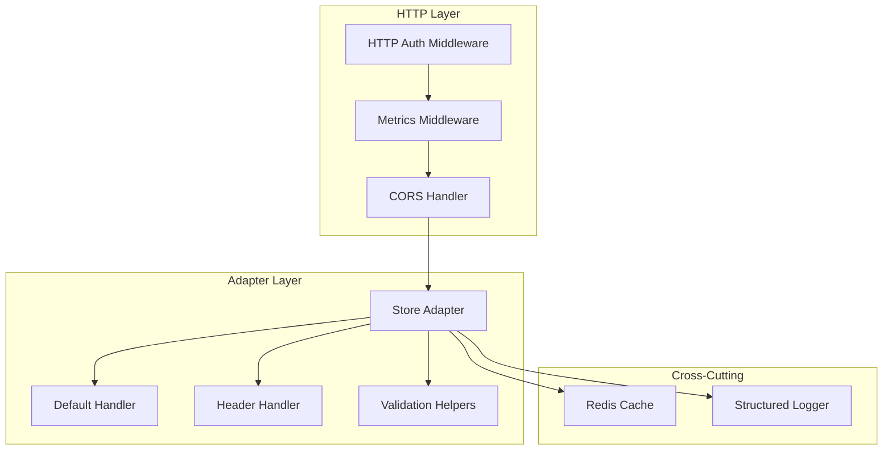
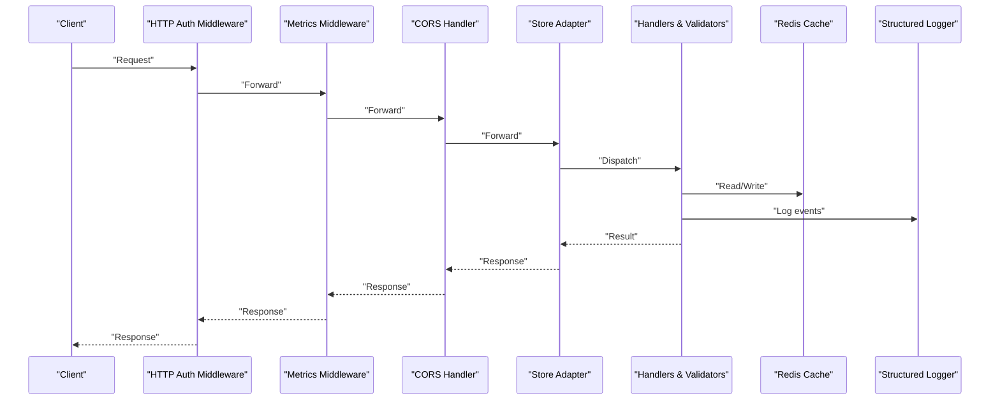
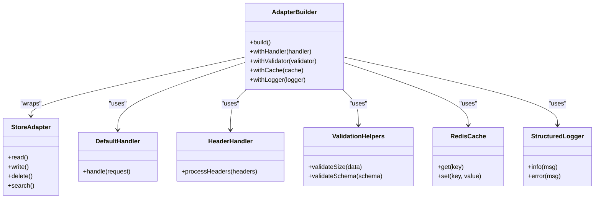
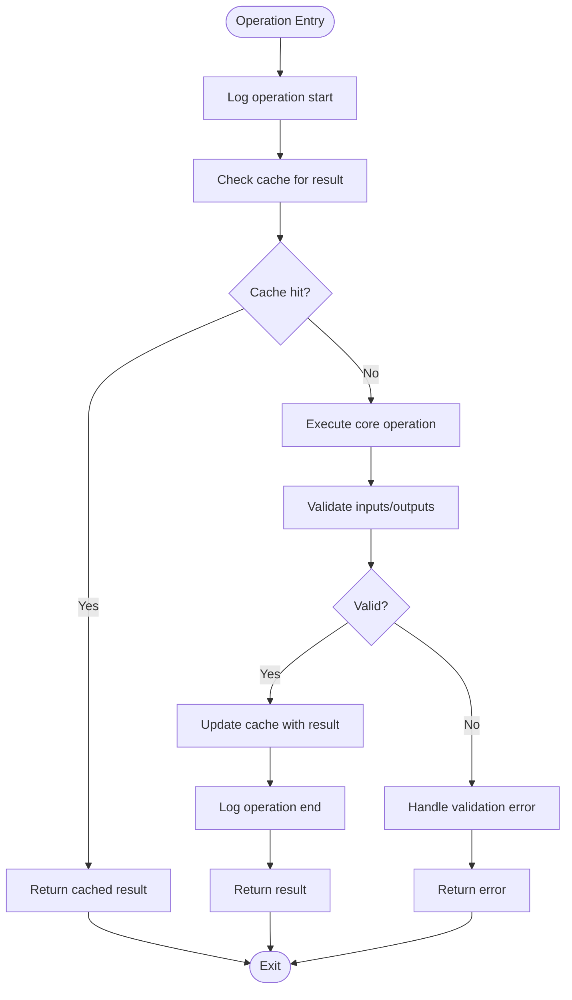
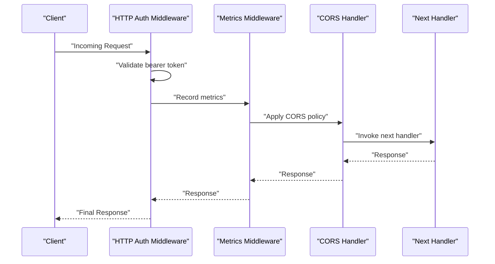
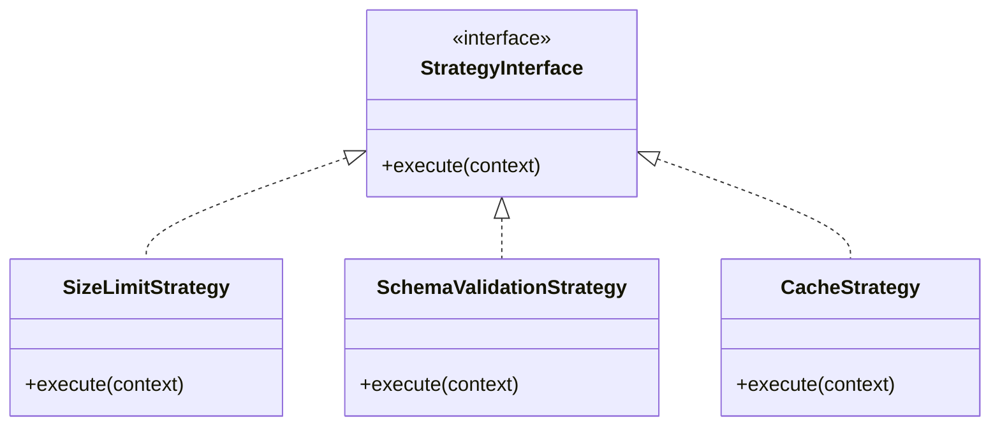
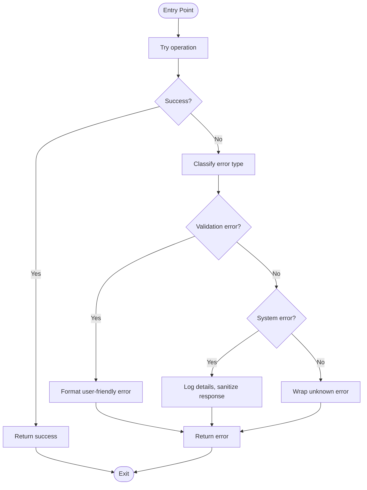
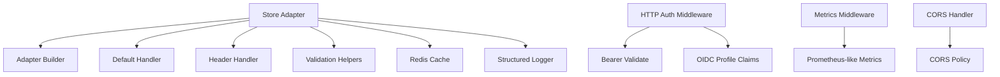

# Adapter Composition Patterns

<cite>
**Referenced Files in This Document**
- [adapter-builder.ts](file://src/services/memory/adapter-builder.ts)
- [store-adapter.ts](file://src/services/memory/store-adapter.ts)
- [store-adapter-default-handler.ts](file://src/services/memory/store-adapter-default-handler.ts)
- [store-adapter-header-handler.ts](file://src/services/memory/store-adapter-header-handler.ts)
- [store-adapter-helpers.ts](file://src/services/memory/store-adapter-helpers.ts)
- [validate-adapter-markdown-size.ts](file://src/services/memory/validate-adapter-markdown-size.ts)
- [memory-store.ts](file://src/services/memory-store.ts)
- [http-auth-middleware.ts](file://src/http/http-auth-middleware.ts)
- [http-metrics-middleware.ts](file://src/http/http-metrics-middleware.ts)
- [http-mcp-cors.ts](file://src/http/http-mcp-cors.ts)
- [bearer-validate.ts](file://src/http/bearer-validate.ts)
- [oidc-profile-claims.ts](file://src/http/oidc-profile-claims.ts)
- [redis-cache.ts](file://src/services/redis-cache.ts)
- [structured-logger.ts](file://src/utils/structured-logger.ts)
</cite>

## Table of Contents
1. [Introduction](#introduction)
2. [Project Structure](#project-structure)
3. [Core Components](#core-components)
4. [Architecture Overview](#architecture-overview)
5. [Detailed Component Analysis](#detailed-component-analysis)
6. [Dependency Analysis](#dependency-analysis)
7. [Performance Considerations](#performance-considerations)
8. [Troubleshooting Guide](#troubleshooting-guide)
9. [Conclusion](#conclusion)

## Introduction
This document explains advanced adapter composition patterns and middleware chains used to build complex data transformation pipelines. It focuses on:
- Decorator pattern for cross-cutting concerns (logging, caching, validation)
- Chain of responsibility for request/response processing
- Strategy pattern for pluggable behaviors
- Reusable adapter components and middleware stacks
- Orchestration patterns and error propagation strategies

The goal is to help you design composable, testable, and maintainable pipelines that can be extended without modifying core logic.

## Project Structure
The repository implements a layered architecture where adapters and middleware are composed into pipelines. Key areas include:
- Memory store adapters with builder and handlers
- HTTP middleware stack for authentication, metrics, and CORS
- Caching and logging utilities used as reusable decorators
- Validation helpers applied within the pipeline

[No sources needed since this diagram shows conceptual workflow, not actual code structure]

## Core Components
- Store Adapter: Defines the contract for memory operations and provides a base for composing behavior.
- Adapter Builder: Assembles an adapter instance by wrapping it with handlers and utilities.
- Default Handler: Implements standard behavior when no specific handler matches.
- Header Handler: Processes headers and metadata during adapter operations.
- Validation Helpers: Enforce constraints such as size limits and schema rules.
- Cross-Cutting Utilities: Logging and caching services used as decorators across layers.

These components enable decorator-style composition, allowing each concern to be added or removed independently.

**Section sources**
- [store-adapter.ts](file://src/services/memory/store-adapter.ts)
- [adapter-builder.ts](file://src/services/memory/adapter-builder.ts)
- [store-adapter-default-handler.ts](file://src/services/memory/store-adapter-default-handler.ts)
- [store-adapter-header-handler.ts](file://src/services/memory/store-adapter-header-handler.ts)
- [store-adapter-helpers.ts](file://src/services/memory/store-adapter-helpers.ts)
- [validate-adapter-markdown-size.ts](file://src/services/memory/validate-adapter-markdown-size.ts)
- [structured-logger.ts](file://src/utils/structured-logger.ts)
- [redis-cache.ts](file://src/services/redis-cache.ts)

## Architecture Overview
The system composes adapters and middleware using a decorator chain. Requests flow through HTTP middleware, then into the adapter layer where handlers and validators apply transformations. Cross-cutting concerns like caching and logging wrap operations transparently.

**Diagram sources**
- [http-auth-middleware.ts](file://src/http/http-auth-middleware.ts)
- [http-metrics-middleware.ts](file://src/http/http-metrics-middleware.ts)
- [http-mcp-cors.ts](file://src/http/http-mcp-cors.ts)
- [store-adapter.ts](file://src/services/memory/store-adapter.ts)
- [store-adapter-default-handler.ts](file://src/services/memory/store-adapter-default-handler.ts)
- [store-adapter-header-handler.ts](file://src/services/memory/store-adapter-header-handler.ts)
- [validate-adapter-markdown-size.ts](file://src/services/memory/validate-adapter-markdown-size.ts)
- [redis-cache.ts](file://src/services/redis-cache.ts)
- [structured-logger.ts](file://src/utils/structured-logger.ts)

## Detailed Component Analysis

### Store Adapter and Builder
The adapter defines a consistent interface for memory operations. The builder wraps the adapter with handlers and utilities, enabling flexible composition.

**Diagram sources**
- [store-adapter.ts](file://src/services/memory/store-adapter.ts)
- [adapter-builder.ts](file://src/services/memory/adapter-builder.ts)
- [store-adapter-default-handler.ts](file://src/services/memory/store-adapter-default-handler.ts)
- [store-adapter-header-handler.ts](file://src/services/memory/store-adapter-header-handler.ts)
- [store-adapter-helpers.ts](file://src/services/memory/store-adapter-helpers.ts)
- [validate-adapter-markdown-size.ts](file://src/services/memory/validate-adapter-markdown-size.ts)
- [redis-cache.ts](file://src/services/redis-cache.ts)
- [structured-logger.ts](file://src/utils/structured-logger.ts)

**Section sources**
- [store-adapter.ts](file://src/services/memory/store-adapter.ts)
- [adapter-builder.ts](file://src/services/memory/adapter-builder.ts)
- [store-adapter-default-handler.ts](file://src/services/memory/store-adapter-default-handler.ts)
- [store-adapter-header-handler.ts](file://src/services/memory/store-adapter-header-handler.ts)
- [store-adapter-helpers.ts](file://src/services/memory/store-adapter-helpers.ts)
- [validate-adapter-markdown-size.ts](file://src/services/memory/validate-adapter-markdown-size.ts)
- [redis-cache.ts](file://src/services/redis-cache.ts)
- [structured-logger.ts](file://src/utils/structured-logger.ts)

### Decorator Pattern for Cross-Cutting Concerns
Decorators wrap core operations to add logging, caching, and validation without changing the underlying implementation.

**Diagram sources**
- [store-adapter.ts](file://src/services/memory/store-adapter.ts)
- [validate-adapter-markdown-size.ts](file://src/services/memory/validate-adapter-markdown-size.ts)
- [redis-cache.ts](file://src/services/redis-cache.ts)
- [structured-logger.ts](file://src/utils/structured-logger.ts)

**Section sources**
- [store-adapter.ts](file://src/services/memory/store-adapter.ts)
- [validate-adapter-markdown-size.ts](file://src/services/memory/validate-adapter-markdown-size.ts)
- [redis-cache.ts](file://src/services/redis-cache.ts)
- [structured-logger.ts](file://src/utils/structured-logger.ts)

### Chain of Responsibility in HTTP Middleware
HTTP requests traverse a chain of middleware modules, each responsible for a single concern.

**Diagram sources**
- [http-auth-middleware.ts](file://src/http/http-auth-middleware.ts)
- [http-metrics-middleware.ts](file://src/http/http-metrics-middleware.ts)
- [http-mcp-cors.ts](file://src/http/http-mcp-cors.ts)
- [bearer-validate.ts](file://src/http/bearer-validate.ts)
- [oidc-profile-claims.ts](file://src/http/oidc-profile-claims.ts)

**Section sources**
- [http-auth-middleware.ts](file://src/http/http-auth-middleware.ts)
- [http-metrics-middleware.ts](file://src/http/http-metrics-middleware.ts)
- [http-mcp-cors.ts](file://src/http/http-mcp-cors.ts)
- [bearer-validate.ts](file://src/http/bearer-validate.ts)
- [oidc-profile-claims.ts](file://src/http/oidc-profile-claims.ts)

### Strategy Pattern for Pluggable Behaviors
Strategies allow swapping implementations at runtime, such as different validation rules or cache backends.

[No sources needed since this diagram shows conceptual strategy pattern, not specific code structure]

**Section sources**
- [store-adapter-helpers.ts](file://src/services/memory/store-adapter-helpers.ts)
- [validate-adapter-markdown-size.ts](file://src/services/memory/validate-adapter-markdown-size.ts)
- [redis-cache.ts](file://src/services/redis-cache.ts)

### Error Propagation Strategies
Errors should propagate consistently through the chain, preserving context while avoiding leaks of sensitive details.

[No sources needed since this diagram shows conceptual error propagation, not specific code structure]

**Section sources**
- [store-adapter.ts](file://src/services/memory/store-adapter.ts)
- [structured-logger.ts](file://src/utils/structured-logger.ts)

## Dependency Analysis
The following diagram maps key dependencies between adapter components and middleware.

**Diagram sources**
- [store-adapter.ts](file://src/services/memory/store-adapter.ts)
- [adapter-builder.ts](file://src/services/memory/adapter-builder.ts)
- [store-adapter-default-handler.ts](file://src/services/memory/store-adapter-default-handler.ts)
- [store-adapter-header-handler.ts](file://src/services/memory/store-adapter-header-handler.ts)
- [store-adapter-helpers.ts](file://src/services/memory/store-adapter-helpers.ts)
- [validate-adapter-markdown-size.ts](file://src/services/memory/validate-adapter-markdown-size.ts)
- [redis-cache.ts](file://src/services/redis-cache.ts)
- [structured-logger.ts](file://src/utils/structured-logger.ts)
- [http-auth-middleware.ts](file://src/http/http-auth-middleware.ts)
- [bearer-validate.ts](file://src/http/bearer-validate.ts)
- [oidc-profile-claims.ts](file://src/http/oidc-profile-claims.ts)
- [http-metrics-middleware.ts](file://src/http/http-metrics-middleware.ts)
- [http-mcp-cors.ts](file://src/http/http-mcp-cors.ts)

**Section sources**
- [store-adapter.ts](file://src/services/memory/store-adapter.ts)
- [adapter-builder.ts](file://src/services/memory/adapter-builder.ts)
- [store-adapter-default-handler.ts](file://src/services/memory/store-adapter-default-handler.ts)
- [store-adapter-header-handler.ts](file://src/services/memory/store-adapter-header-handler.ts)
- [store-adapter-helpers.ts](file://src/services/memory/store-adapter-helpers.ts)
- [validate-adapter-markdown-size.ts](file://src/services/memory/validate-adapter-markdown-size.ts)
- [redis-cache.ts](file://src/services/redis-cache.ts)
- [structured-logger.ts](file://src/utils/structured-logger.ts)
- [http-auth-middleware.ts](file://src/http/http-auth-middleware.ts)
- [bearer-validate.ts](file://src/http/bearer-validate.ts)
- [oidc-profile-claims.ts](file://src/http/oidc-profile-claims.ts)
- [http-metrics-middleware.ts](file://src/http/http-metrics-middleware.ts)
- [http-mcp-cors.ts](file://src/http/http-mcp-cors.ts)

## Performance Considerations
- Prefer caching read-heavy operations to reduce latency and backend load.
- Keep validation lightweight; defer expensive checks until necessary.
- Use structured logging selectively to avoid overhead in hot paths.
- Compose middleware lazily to minimize initialization costs.
- Monitor metrics to identify bottlenecks and tune cache TTLs accordingly.

[No sources needed since this section provides general guidance]

## Troubleshooting Guide
Common issues and resolutions:
- Authentication failures: Verify bearer tokens and OIDC claims configuration.
- CORS errors: Ensure allowed origins and methods match client expectations.
- Validation errors: Inspect size limits and schema definitions.
- Cache misses or stale data: Review cache keys and invalidation policies.
- Logging noise: Adjust log levels and filter sensitive fields.

**Section sources**
- [http-auth-middleware.ts](file://src/http/http-auth-middleware.ts)
- [bearer-validate.ts](file://src/http/bearer-validate.ts)
- [oidc-profile-claims.ts](file://src/http/oidc-profile-claims.ts)
- [http-mcp-cors.ts](file://src/http/http-mcp-cors.ts)
- [validate-adapter-markdown-size.ts](file://src/services/memory/validate-adapter-markdown-size.ts)
- [redis-cache.ts](file://src/services/redis-cache.ts)
- [structured-logger.ts](file://src/utils/structured-logger.ts)

## Conclusion
By leveraging decorator patterns, chain of responsibility, and strategy implementations, the system achieves high composability and extensibility. Adapters and middleware can be mixed and matched to build robust data transformation pipelines. Clear error propagation and performance-conscious design ensure reliability and scalability.

[No sources needed since this section summarizes without analyzing specific files]