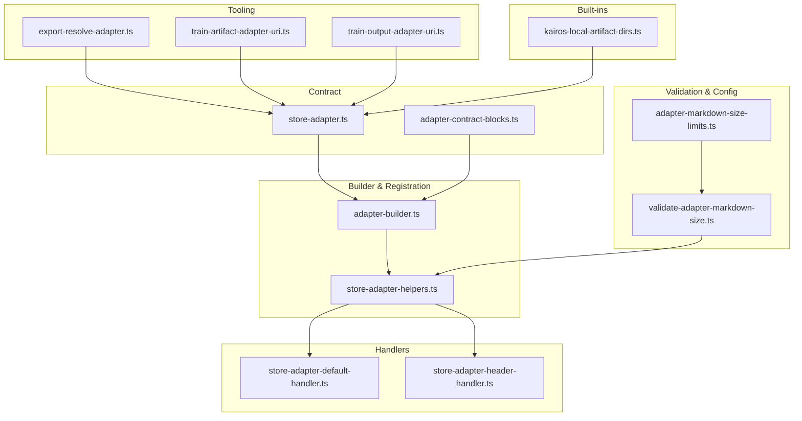
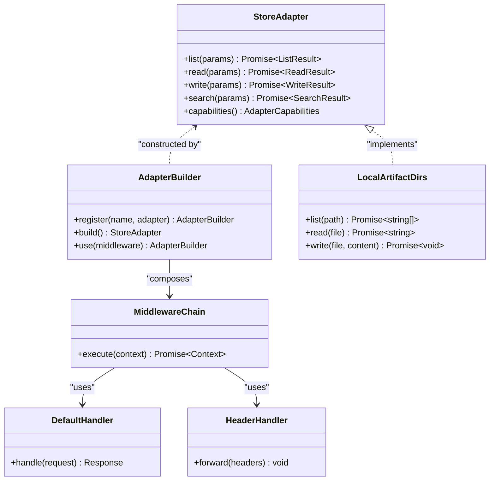
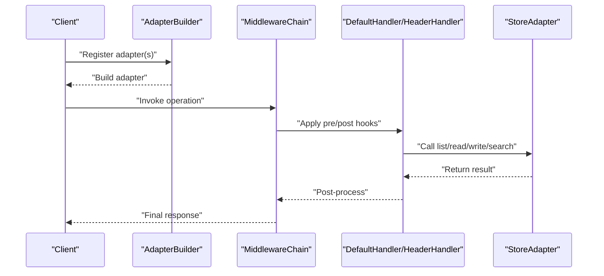
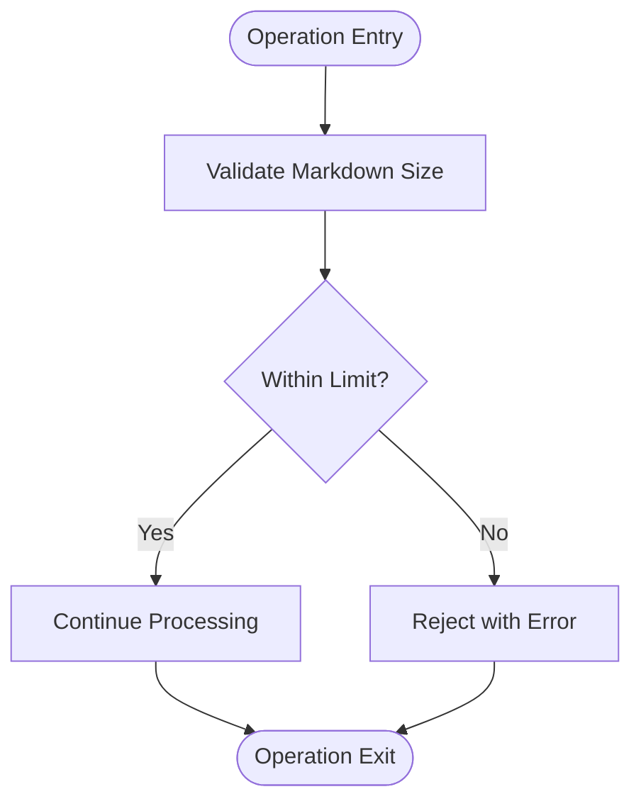
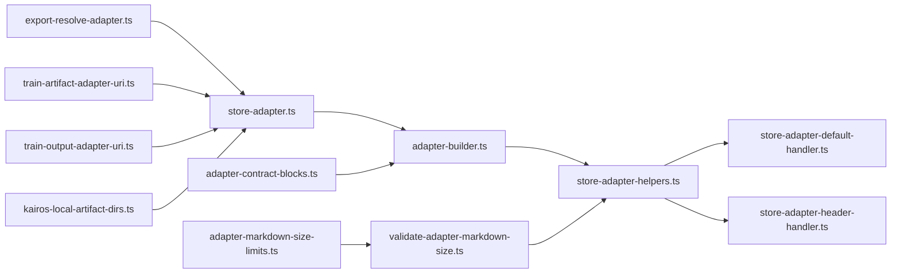

# Adapter Framework

<cite>
**Referenced Files in This Document**
- [src/services/memory/store-adapter.ts](file://src/services/memory/store-adapter.ts)
- [src/services/memory/adapter-builder.ts](file://src/services/memory/adapter-builder.ts)
- [src/services/memory/store-adapter-helpers.ts](file://src/services/memory/store-adapter-helpers.ts)
- [src/services/memory/store-adapter-default-handler.ts](file://src/services/memory/store-adapter-default-handler.ts)
- [src/services/memory/store-adapter-header-handler.ts](file://src/services/memory/store-adapter-header-handler.ts)
- [src/services/memory/validate-adapter-markdown-size.ts](file://src/services/memory/validate-adapter-markdown-size.ts)
- [src/services/memory/adapter-contract-blocks.ts](file://src/services/memory/adapter-contract-blocks.ts)
- [src/tools/export-resolve-adapter.ts](file://src/tools/export-resolve-adapter.ts)
- [src/tools/train-artifact-adapter-uri.ts](file://src/tools/train-artifact-adapter-uri.ts)
- [src/tools/train-output-adapter-uri.ts](file://src/tools/train-output-adapter-uri.ts)
- [src/utils/kairos-local-artifact-dirs.ts](file://src/utils/kairos-local-artifact-dirs.ts)
- [src/config/adapter-markdown-size-limits.ts](file://src/config/adapter-markdown-size-limits.ts)
- [tests/unit/adapter-builder.test.ts](file://tests/unit/adapter-builder.test.ts)
- [tests/unit/adapter-contract-blocks.test.ts](file://tests/unit/adapter-contract-blocks.test.ts)
- [tests/unit/store-adapter-helpers.test.ts](file://tests/unit/store-adapter-helpers.test.ts)
- [tests/unit/validate-adapter-markdown-size.test.ts](file://tests/unit/validate-adapter-markdown-size.test.ts)
- [tests/integration/wire-adapter-uri-slug-only.test.ts](file://tests/integration/wire-adapter-uri-slug-only.test.ts)
</cite>

## Table of Contents
1. [Introduction](#introduction)
2. [Project Structure](#project-structure)
3. [Core Components](#core-components)
4. [Architecture Overview](#architecture-overview)
5. [Detailed Component Analysis](#detailed-component-analysis)
6. [Dependency Analysis](#dependency-analysis)
7. [Performance Considerations](#performance-considerations)
8. [Troubleshooting Guide](#troubleshooting-guide)
9. [Conclusion](#conclusion)
10. [Appendices](#appendices)

## Introduction
This document describes the adapter framework used to abstract data sources and operations across the system. It covers the adapter interface contract, registration mechanisms, lifecycle management, built-in adapters for file systems, databases, and external APIs, composition patterns (middleware chains and transformation pipelines), custom adapter development, testing strategies, debugging techniques, configuration, error handling, performance optimization, versioning, compatibility matrices, and migration procedures.

The adapter framework is centered around a typed contract that defines how adapters expose capabilities such as listing, reading, writing, and searching memory artifacts. Adapters are registered via builders and resolved at runtime by URIs or slugs. The framework includes helpers for validation, header propagation, default handlers, and size limits to ensure robustness and consistency.

## Project Structure
The adapter framework spans several modules:
- Contract and blocks definitions
- Builder and registration utilities
- Helpers for validation and header handling
- Built-in adapters for local filesystem and other sources
- Tooling for resolving and constructing adapter URIs
- Configuration for constraints like markdown size limits
- Tests covering builder logic, contract blocks, helpers, and integration scenarios

**Diagram sources**
- [src/services/memory/store-adapter.ts](file://src/services/memory/store-adapter.ts)
- [src/services/memory/adapter-contract-blocks.ts](file://src/services/memory/adapter-contract-blocks.ts)
- [src/services/memory/adapter-builder.ts](file://src/services/memory/adapter-builder.ts)
- [src/services/memory/store-adapter-helpers.ts](file://src/services/memory/store-adapter-helpers.ts)
- [src/services/memory/store-adapter-default-handler.ts](file://src/services/memory/store-adapter-default-handler.ts)
- [src/services/memory/store-adapter-header-handler.ts](file://src/services/memory/store-adapter-header-handler.ts)
- [src/services/memory/validate-adapter-markdown-size.ts](file://src/services/memory/validate-adapter-markdown-size.ts)
- [src/config/adapter-markdown-size-limits.ts](file://src/config/adapter-markdown-size-limits.ts)
- [src/tools/export-resolve-adapter.ts](file://src/tools/export-resolve-adapter.ts)
- [src/tools/train-artifact-adapter-uri.ts](file://src/tools/train-artifact-adapter-uri.ts)
- [src/tools/train-output-adapter-uri.ts](file://src/tools/train-output-adapter-uri.ts)
- [src/utils/kairos-local-artifact-dirs.ts](file://src/utils/kairos-local-artifact-dirs.ts)

**Section sources**
- [src/services/memory/store-adapter.ts](file://src/services/memory/store-adapter.ts)
- [src/services/memory/adapter-builder.ts](file://src/services/memory/adapter-builder.ts)
- [src/services/memory/store-adapter-helpers.ts](file://src/services/memory/store-adapter-helpers.ts)
- [src/services/memory/store-adapter-default-handler.ts](file://src/services/memory/store-adapter-default-handler.ts)
- [src/services/memory/store-adapter-header-handler.ts](file://src/services/memory/store-adapter-header-handler.ts)
- [src/services/memory/validate-adapter-markdown-size.ts](file://src/services/memory/validate-adapter-markdown-size.ts)
- [src/config/adapter-markdown-size-limits.ts](file://src/config/adapter-markdown-size-limits.ts)
- [src/tools/export-resolve-adapter.ts](file://src/tools/export-resolve-adapter.ts)
- [src/tools/train-artifact-adapter-uri.ts](file://src/tools/train-artifact-adapter-uri.ts)
- [src/tools/train-output-adapter-uri.ts](file://src/tools/train-output-adapter-uri.ts)
- [src/utils/kairos-local-artifact-dirs.ts](file://src/utils/kairos-local-artifact-dirs.ts)

## Core Components
- Adapter Interface Contract: Defines the shape of an adapter including methods for listing, reading, writing, and searching memory artifacts. It also specifies metadata and capability blocks.
- Contract Blocks: Typed structures describing specific adapter behaviors and features (e.g., search, pagination, filtering).
- Builder and Registration: Provides a fluent API to construct adapters, register them with identifiers, and wire up middleware and handlers.
- Helpers: Utilities for validating inputs, propagating headers, and composing multiple adapters into a pipeline.
- Default and Header Handlers: Implement common behaviors such as fallback responses and HTTP header forwarding when applicable.
- Validation and Limits: Enforces constraints like maximum markdown sizes to protect downstream processing.
- URI Resolution and Construction: Tools to resolve adapter instances from URIs and build URIs for artifact outputs.

Key responsibilities:
- Ensure consistent contracts across all adapters
- Provide safe defaults and validation
- Support composition and middleware chaining
- Enable flexible registration and resolution by slug or full URI

**Section sources**
- [src/services/memory/store-adapter.ts](file://src/services/memory/store-adapter.ts)
- [src/services/memory/adapter-contract-blocks.ts](file://src/services/memory/adapter-contract-blocks.ts)
- [src/services/memory/adapter-builder.ts](file://src/services/memory/adapter-builder.ts)
- [src/services/memory/store-adapter-helpers.ts](file://src/services/memory/store-adapter-helpers.ts)
- [src/services/memory/store-adapter-default-handler.ts](file://src/services/memory/store-adapter-default-handler.ts)
- [src/services/memory/store-adapter-header-handler.ts](file://src/services/memory/store-adapter-header-handler.ts)
- [src/services/memory/validate-adapter-markdown-size.ts](file://src/services/memory/validate-adapter-markdown-size.ts)
- [src/config/adapter-markdown-size-limits.ts](file://src/config/adapter-markdown-size-limits.ts)
- [src/tools/export-resolve-adapter.ts](file://src/tools/export-resolve-adapter.ts)
- [src/tools/train-artifact-adapter-uri.ts](file://src/tools/train-artifact-adapter-uri.ts)
- [src/tools/train-output-adapter-uri.ts](file://src/tools/train-output-adapter-uri.ts)

## Architecture Overview
The adapter architecture separates concerns between contract definition, builder/registration, middleware/handlers, and concrete implementations. Adapters can be composed into pipelines where each stage applies transformations or cross-cutting concerns.

**Diagram sources**
- [src/services/memory/store-adapter.ts](file://src/services/memory/store-adapter.ts)
- [src/services/memory/adapter-builder.ts](file://src/services/memory/adapter-builder.ts)
- [src/services/memory/store-adapter-default-handler.ts](file://src/services/memory/store-adapter-default-handler.ts)
- [src/services/memory/store-adapter-header-handler.ts](file://src/services/memory/store-adapter-header-handler.ts)
- [src/utils/kairos-local-artifact-dirs.ts](file://src/utils/kairos-local-artifact-dirs.ts)

## Detailed Component Analysis

### Adapter Interface Contract
The adapter contract defines a uniform API surface for all adapters. It includes:
- Methods for listing, reading, writing, and searching
- Capability descriptors indicating supported features
- Input/output shapes ensuring type safety across layers

Typical usage:
- Consumers call list/read/write/search on the adapter instance
- Capabilities inform optional behavior (e.g., whether search is supported)

**Section sources**
- [src/services/memory/store-adapter.ts](file://src/services/memory/store-adapter.ts)
- [src/services/memory/adapter-contract-blocks.ts](file://src/services/memory/adapter-contract-blocks.ts)

### Builder and Registration Mechanisms
The builder provides a fluent API to:
- Register named adapters
- Compose middleware and handlers
- Build a final adapter instance ready for use

Registration flow:
- Define or import an adapter implementation
- Register it under a name/slug
- Optionally attach middleware and handlers
- Build the adapter for consumption

Resolution:
- Resolve adapters by slug or full URI using dedicated tools
- Ensure consistent naming and precedence rules

**Section sources**
- [src/services/memory/adapter-builder.ts](file://src/services/memory/adapter-builder.ts)
- [src/tools/export-resolve-adapter.ts](file://src/tools/export-resolve-adapter.ts)
- [src/tools/train-artifact-adapter-uri.ts](file://src/tools/train-artifact-adapter-uri.ts)
- [src/tools/train-output-adapter-uri.ts](file://src/tools/train-output-adapter-uri.ts)

### Lifecycle Management
Lifecycle stages:
- Initialization: Create builder, register adapters, configure middleware
- Runtime: Resolve adapters by identifier, execute operations
- Teardown: Release resources held by adapters (e.g., file handles, connections)

Best practices:
- Keep initialization centralized
- Use dependency injection for shared resources
- Ensure graceful shutdown and resource cleanup

**Section sources**
- [src/services/memory/adapter-builder.ts](file://src/services/memory/adapter-builder.ts)

### Built-in Adapters
- File System Adapter: Implements local artifact directories with list/read/write semantics. Useful for training and export workflows.
- Database Adapters: Not present in the referenced files; if implemented elsewhere, they should adhere to the same contract and be registered similarly.
- External API Adapters: Not present in the referenced files; implementers should wrap HTTP clients and map responses to the adapter contract.

Local artifact directories example:
- List directory contents
- Read file content
- Write file content

**Section sources**
- [src/utils/kairos-local-artifact-dirs.ts](file://src/utils/kairos-local-artifact-dirs.ts)

### Composition Patterns: Middleware Chains and Transformation Pipelines
Middleware enables cross-cutting concerns:
- Validation: Check input parameters and enforce limits
- Logging and Metrics: Record operation details
- Header Propagation: Forward relevant headers to downstream adapters
- Error Wrapping: Normalize errors across adapters

Pipeline execution:
- Request enters middleware chain
- Each middleware transforms context or short-circuits with response
- Final adapter executes business logic
- Responses traverse middleware stack for post-processing

**Diagram sources**
- [src/services/memory/adapter-builder.ts](file://src/services/memory/adapter-builder.ts)
- [src/services/memory/store-adapter-helpers.ts](file://src/services/memory/store-adapter-helpers.ts)
- [src/services/memory/store-adapter-default-handler.ts](file://src/services/memory/store-adapter-default-handler.ts)
- [src/services/memory/store-adapter-header-handler.ts](file://src/services/memory/store-adapter-header-handler.ts)

**Section sources**
- [src/services/memory/store-adapter-helpers.ts](file://src/services/memory/store-adapter-helpers.ts)
- [src/services/memory/store-adapter-default-handler.ts](file://src/services/memory/store-adapter-default-handler.ts)
- [src/services/memory/store-adapter-header-handler.ts](file://src/services/memory/store-adapter-header-handler.ts)

### Validation and Size Limits
Markdown size validation protects against oversized payloads:
- Enforce maximum sizes based on configuration
- Fail fast with clear errors when limits are exceeded

Configuration:
- Centralized limits allow tuning per environment
- Validation runs early in the pipeline

**Diagram sources**
- [src/services/memory/validate-adapter-markdown-size.ts](file://src/services/memory/validate-adapter-markdown-size.ts)
- [src/config/adapter-markdown-size-limits.ts](file://src/config/adapter-markdown-size-limits.ts)

**Section sources**
- [src/services/memory/validate-adapter-markdown-size.ts](file://src/services/memory/validate-adapter-markdown-size.ts)
- [src/config/adapter-markdown-size-limits.ts](file://src/config/adapter-markdown-size-limits.ts)

### Custom Adapter Development
Steps to create a custom adapter:
- Implement the adapter contract methods
- Provide capability descriptors
- Register the adapter via the builder
- Add middleware for validation, logging, or header forwarding
- Test thoroughly with unit and integration tests

Guidance:
- Follow existing patterns for error handling and input validation
- Use helpers for common tasks like header propagation
- Ensure idempotency where appropriate

**Section sources**
- [src/services/memory/store-adapter.ts](file://src/services/memory/store-adapter.ts)
- [src/services/memory/adapter-builder.ts](file://src/services/memory/adapter-builder.ts)
- [src/services/memory/store-adapter-helpers.ts](file://src/services/memory/store-adapter-helpers.ts)

### Testing Strategies
Unit tests:
- Verify builder registration and composition
- Validate contract blocks and helper functions
- Confirm size limit enforcement

Integration tests:
- Exercise adapter resolution by slug or URI
- Validate end-to-end flows with real adapters

Examples:
- Builder tests confirm correct wiring and middleware application
- Contract block tests ensure schema compliance
- Helper tests validate header propagation and default handling
- Size limit tests assert rejection paths

**Section sources**
- [tests/unit/adapter-builder.test.ts](file://tests/unit/adapter-builder.test.ts)
- [tests/unit/adapter-contract-blocks.test.ts](file://tests/unit/adapter-contract-blocks.test.ts)
- [tests/unit/store-adapter-helpers.test.ts](file://tests/unit/store-adapter-helpers.test.ts)
- [tests/unit/validate-adapter-markdown-size.test.ts](file://tests/unit/validate-adapter-markdown-size.test.ts)
- [tests/integration/wire-adapter-uri-slug-only.test.ts](file://tests/integration/wire-adapter-uri-slug-only.test.ts)

### Debugging Techniques
- Inspect middleware chain order and side effects
- Log request/response contexts at key points
- Validate adapter resolution results and precedence
- Use test fixtures to reproduce issues deterministically

**Section sources**
- [src/services/memory/store-adapter-helpers.ts](file://src/services/memory/store-adapter-helpers.ts)
- [src/services/memory/store-adapter-default-handler.ts](file://src/services/memory/store-adapter-default-handler.ts)
- [src/services/memory/store-adapter-header-handler.ts](file://src/services/memory/store-adapter-header-handler.ts)

### Configuration
- Centralize adapter-related settings (e.g., markdown size limits)
- Provide environment-specific overrides
- Document required fields and defaults

**Section sources**
- [src/config/adapter-markdown-size-limits.ts](file://src/config/adapter-markdown-size-limits.ts)

### Error Handling
- Normalize errors across adapters
- Provide actionable messages for consumers
- Wrap underlying errors with context (e.g., adapter name, operation)

**Section sources**
- [src/services/memory/store-adapter-default-handler.ts](file://src/services/memory/store-adapter-default-handler.ts)
- [src/services/memory/store-adapter-helpers.ts](file://src/services/memory/store-adapter-helpers.ts)

### Performance Optimization
- Cache frequently accessed data within middleware
- Stream large artifacts when possible
- Avoid unnecessary copies and transformations
- Tune concurrency limits for I/O-bound adapters

[No sources needed since this section provides general guidance]

### Versioning and Compatibility
- Maintain backward-compatible changes in the adapter contract
- Use capability descriptors to signal supported features
- Document breaking changes and migration steps

[No sources needed since this section provides general guidance]

### Migration Procedures
- Gradually roll out new adapter versions
- Provide adapters for legacy interfaces during transition
- Validate compatibility with existing consumers before deprecating old versions

[No sources needed since this section provides general guidance]

## Dependency Analysis
The adapter framework exhibits clear separation of concerns:
- Contract and blocks define stable interfaces
- Builder composes middleware and handlers
- Helpers encapsulate reusable logic
- Built-in adapters depend on the contract but not on higher-level tooling
- Tooling depends on the contract for resolution and construction

**Diagram sources**
- [src/services/memory/store-adapter.ts](file://src/services/memory/store-adapter.ts)
- [src/services/memory/adapter-contract-blocks.ts](file://src/services/memory/adapter-contract-blocks.ts)
- [src/services/memory/adapter-builder.ts](file://src/services/memory/adapter-builder.ts)
- [src/services/memory/store-adapter-helpers.ts](file://src/services/memory/store-adapter-helpers.ts)
- [src/services/memory/store-adapter-default-handler.ts](file://src/services/memory/store-adapter-default-handler.ts)
- [src/services/memory/store-adapter-header-handler.ts](file://src/services/memory/store-adapter-header-handler.ts)
- [src/services/memory/validate-adapter-markdown-size.ts](file://src/services/memory/validate-adapter-markdown-size.ts)
- [src/config/adapter-markdown-size-limits.ts](file://src/config/adapter-markdown-size-limits.ts)
- [src/tools/export-resolve-adapter.ts](file://src/tools/export-resolve-adapter.ts)
- [src/tools/train-artifact-adapter-uri.ts](file://src/tools/train-artifact-adapter-uri.ts)
- [src/tools/train-output-adapter-uri.ts](file://src/tools/train-output-adapter-uri.ts)
- [src/utils/kairos-local-artifact-dirs.ts](file://src/utils/kairos-local-artifact-dirs.ts)

**Section sources**
- [src/services/memory/store-adapter.ts](file://src/services/memory/store-adapter.ts)
- [src/services/memory/adapter-builder.ts](file://src/services/memory/adapter-builder.ts)
- [src/services/memory/store-adapter-helpers.ts](file://src/services/memory/store-adapter-helpers.ts)
- [src/services/memory/store-adapter-default-handler.ts](file://src/services/memory/store-adapter-default-handler.ts)
- [src/services/memory/store-adapter-header-handler.ts](file://src/services/memory/store-adapter-header-handler.ts)
- [src/services/memory/validate-adapter-markdown-size.ts](file://src/services/memory/validate-adapter-markdown-size.ts)
- [src/config/adapter-markdown-size-limits.ts](file://src/config/adapter-markdown-size-limits.ts)
- [src/tools/export-resolve-adapter.ts](file://src/tools/export-resolve-adapter.ts)
- [src/tools/train-artifact-adapter-uri.ts](file://src/tools/train-artifact-adapter-uri.ts)
- [src/tools/train-output-adapter-uri.ts](file://src/tools/train-output-adapter-uri.ts)
- [src/utils/kairos-local-artifact-dirs.ts](file://src/utils/kairos-local-artifact-dirs.ts)

## Performance Considerations
- Prefer streaming for large artifacts
- Minimize synchronous I/O in hot paths
- Cache computed metadata where safe
- Use connection pooling for database and API adapters
- Monitor and profile middleware overhead

[No sources needed since this section provides general guidance]

## Troubleshooting Guide
Common issues and resolutions:
- Adapter not found by slug: Verify registration and resolution logic
- Size limit errors: Adjust configuration or sanitize inputs
- Header propagation failures: Inspect header handler and middleware order
- Inconsistent capabilities: Ensure capability descriptors match implementation

Debugging tips:
- Add logging in middleware pre/post hooks
- Reproduce with minimal fixtures
- Validate contract compliance with unit tests

**Section sources**
- [src/services/memory/store-adapter-helpers.ts](file://src/services/memory/store-adapter-helpers.ts)
- [src/services/memory/store-adapter-default-handler.ts](file://src/services/memory/store-adapter-default-handler.ts)
- [src/services/memory/store-adapter-header-handler.ts](file://src/services/memory/store-adapter-header-handler.ts)
- [src/services/memory/validate-adapter-markdown-size.ts](file://src/services/memory/validate-adapter-markdown-size.ts)
- [src/config/adapter-markdown-size-limits.ts](file://src/config/adapter-markdown-size-limits.ts)

## Conclusion
The adapter framework provides a robust, extensible foundation for integrating diverse data sources through a consistent contract. Its builder and middleware model enable powerful composition while maintaining clarity and testability. By following the guidelines here—contract adherence, careful registration, comprehensive testing, and thoughtful configuration—you can develop reliable adapters that scale across file systems, databases, and external APIs.

[No sources needed since this section summarizes without analyzing specific files]

## Appendices

### Example Workflows
- Training pipeline: Resolve artifact adapter URI, read content, apply validation, write processed output
- Export pipeline: Enumerate spaces, resolve adapters, list artifacts, stream content, assemble bundle

[No sources needed since this section provides conceptual examples]