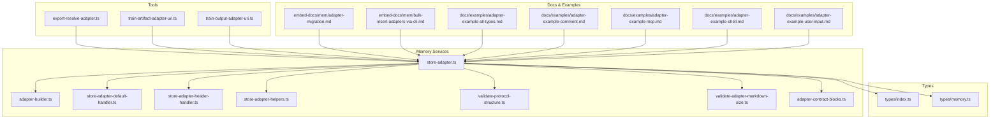
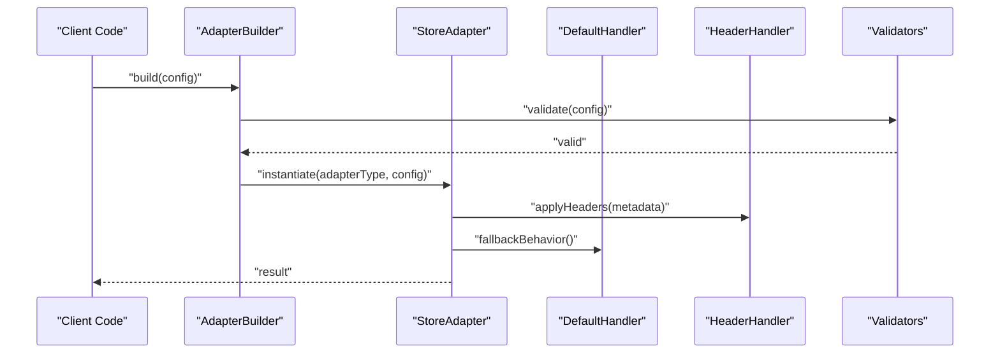
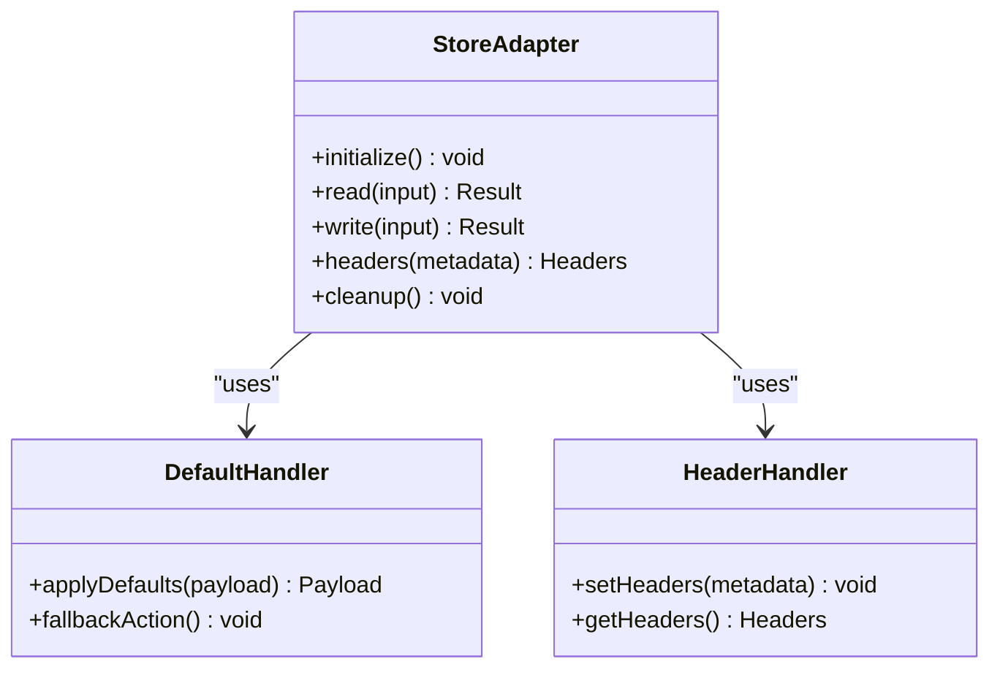
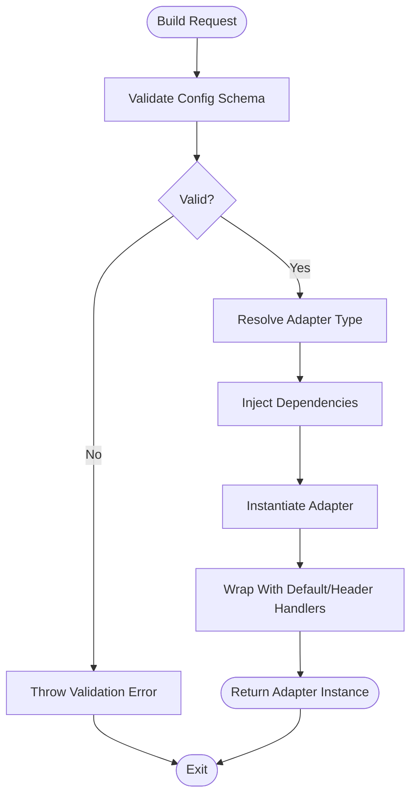
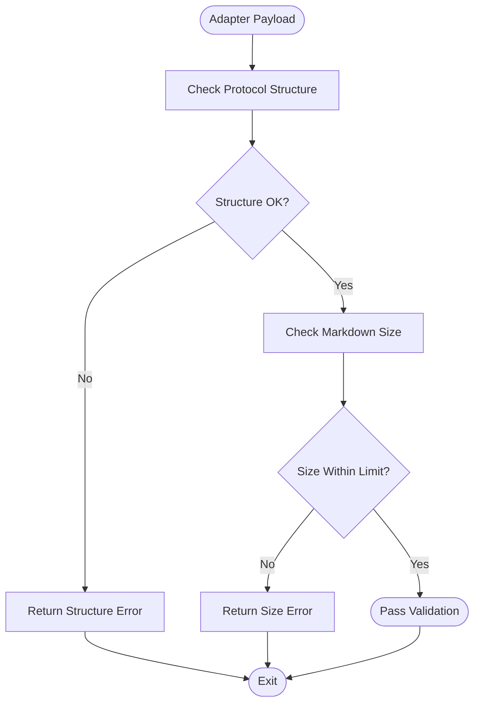
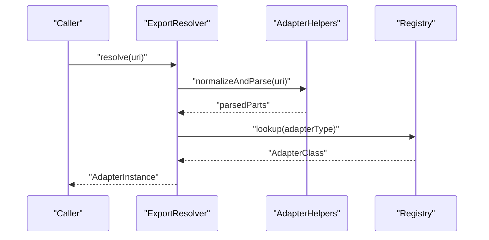
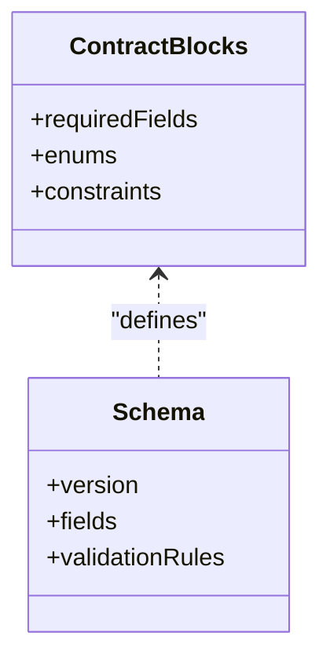
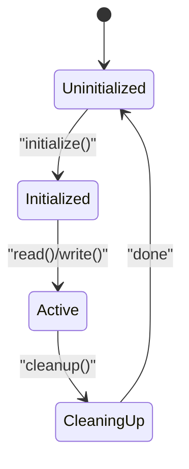
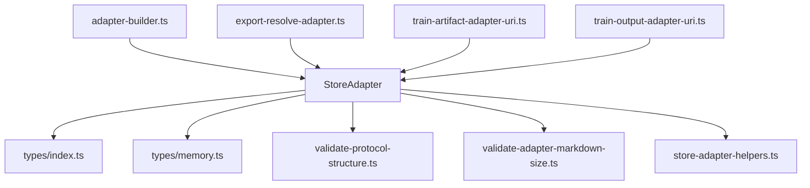

# Adapter Interface Contract

<cite>
**Referenced Files in This Document**
- [store-adapter.ts](file://src/services/memory/store-adapter.ts)
- [adapter-builder.ts](file://src/services/memory/adapter-builder.ts)
- [store-adapter-default-handler.ts](file://src/services/memory/store-adapter-default-handler.ts)
- [store-adapter-header-handler.ts](file://src/services/memory/store-adapter-header-handler.ts)
- [store-adapter-helpers.ts](file://src/services/memory/store-adapter-helpers.ts)
- [validate-protocol-structure.ts](file://src/services/memory/validate-protocol-structure.ts)
- [validate-adapter-markdown-size.ts](file://src/services/memory/validate-adapter-markdown-size.ts)
- [adapter-contract-blocks.ts](file://src/services/memory/adapter-contract-blocks.ts)
- [types/index.ts](file://src/types/index.ts)
- [types/memory.ts](file://src/types/memory.ts)
- [tools/export-resolve-adapter.ts](file://src/tools/export-resolve-adapter.ts)
- [tools/train-artifact-adapter-uri.ts](file://src/tools/train-artifact-adapter-uri.ts)
- [tools/train-output-adapter-uri.ts](file://src/tools/train-output-adapter-uri.ts)
- [embed-docs/mem/adapter-migration.md](file://src/embed-docs/mem/adapter-migration.md)
- [embed-docs/mem/bulk-insert-adapters-via-cli.md](file://src/embed-docs/mem/bulk-insert-adapters-via-cli.md)
- [examples/adapter-example-all-types.md](file://docs/examples/adapter-example-all-types.md)
- [examples/adapter-example-comment.md](file://docs/examples/adapter-example-comment.md)
- [examples/adapter-example-mcp.md](file://docs/examples/adapter-example-mcp.md)
- [examples/adapter-example-shell.md](file://docs/examples/adapter-example-shell.md)
- [examples/adapter-example-user-input.md](file://docs/examples/adapter-example-user-input.md)
</cite>

## Table of Contents
1. [Introduction](#introduction)
2. [Project Structure](#project-structure)
3. [Core Components](#core-components)
4. [Architecture Overview](#architecture-overview)
5. [Detailed Component Analysis](#detailed-component-analysis)
6. [Dependency Analysis](#dependency-analysis)
7. [Performance Considerations](#performance-considerations)
8. [Troubleshooting Guide](#troubleshooting-guide)
9. [Conclusion](#conclusion)
10. [Appendices](#appendices)

## Introduction
This document defines the adapter interface contract used by the memory subsystem to integrate diverse data sources and processing pipelines. It explains:
- The core adapter interface methods and lifecycle hooks
- Data flow patterns between adapters, builders, and handlers
- Registration and dependency injection mechanisms
- Configuration schemas and validation rules
- Error handling patterns and type safety considerations
- Versioning strategies and backward compatibility requirements
- Practical examples for implementing basic adapters and handling different data formats

The goal is to provide a clear, actionable guide for building and maintaining adapters that are robust, testable, and compatible across versions.

## Project Structure
Adapters live primarily under the memory services layer with supporting utilities, types, and documentation. Key areas include:
- Core adapter interface and builder
- Default and header handlers
- Validation utilities for protocol structure and markdown size limits
- Type definitions and shared contracts
- Tooling for resolving and constructing adapter URIs
- Migration and bulk insertion guides
- Example adapters demonstrating various input/output patterns

**Diagram sources**
- [store-adapter.ts](file://src/services/memory/store-adapter.ts)
- [adapter-builder.ts](file://src/services/memory/adapter-builder.ts)
- [store-adapter-default-handler.ts](file://src/services/memory/store-adapter-default-handler.ts)
- [store-adapter-header-handler.ts](file://src/services/memory/store-adapter-header-handler.ts)
- [store-adapter-helpers.ts](file://src/services/memory/store-adapter-helpers.ts)
- [validate-protocol-structure.ts](file://src/services/memory/validate-protocol-structure.ts)
- [validate-adapter-markdown-size.ts](file://src/services/memory/validate-adapter-markdown-size.ts)
- [adapter-contract-blocks.ts](file://src/services/memory/adapter-contract-blocks.ts)
- [types/index.ts](file://src/types/index.ts)
- [types/memory.ts](file://src/types/memory.ts)
- [tools/export-resolve-adapter.ts](file://src/tools/export-resolve-adapter.ts)
- [tools/train-artifact-adapter-uri.ts](file://src/tools/train-artifact-adapter-uri.ts)
- [tools/train-output-adapter-uri.ts](file://src/tools/train-output-adapter-uri.ts)
- [embed-docs/mem/adapter-migration.md](file://src/embed-docs/mem/adapter-migration.md)
- [embed-docs/mem/bulk-insert-adapters-via-cli.md](file://src/embed-docs/mem/bulk-insert-adapters-via-cli.md)
- [docs/examples/adapter-example-all-types.md](file://docs/examples/adapter-example-all-types.md)
- [docs/examples/adapter-example-comment.md](file://docs/examples/adapter-example-comment.md)
- [docs/examples/adapter-example-mcp.md](file://docs/examples/adapter-example-mcp.md)
- [docs/examples/adapter-example-shell.md](file://docs/examples/adapter-example-shell.md)
- [docs/examples/adapter-example-user-input.md](file://docs/examples/adapter-example-user-input.md)

**Section sources**
- [store-adapter.ts](file://src/services/memory/store-adapter.ts)
- [adapter-builder.ts](file://src/services/memory/adapter-builder.ts)
- [types/index.ts](file://src/types/index.ts)
- [types/memory.ts](file://src/types/memory.ts)

## Core Components
This section outlines the primary components that implement and support the adapter contract.

- Store Adapter Interface
  - Defines the canonical set of methods an adapter must implement to participate in the memory pipeline.
  - Includes lifecycle hooks for initialization, configuration, and cleanup.
  - Specifies typed inputs and outputs to ensure type safety across the system.

- Adapter Builder
  - Constructs adapter instances from configuration or runtime context.
  - Applies default behaviors and injects dependencies (e.g., logging, storage).
  - Validates configuration against schema before instantiation.

- Handlers
  - Default Handler: Provides baseline behavior when specific logic is not implemented.
  - Header Handler: Manages metadata headers and cross-cutting concerns such as tracing and audit.

- Helpers and Validators
  - Helpers: Utility functions for common operations like URI resolution and payload shaping.
  - Protocol Structure Validator: Ensures adapter payloads conform to expected structures.
  - Markdown Size Validator: Enforces size constraints on markdown content to prevent resource exhaustion.

- Contracts and Blocks
  - Contract Blocks: Reusable fragments describing required fields, enums, and constraints.
  - Shared Types: Centralized TypeScript types for consistent interfaces across modules.

**Section sources**
- [store-adapter.ts](file://src/services/memory/store-adapter.ts)
- [adapter-builder.ts](file://src/services/memory/adapter-builder.ts)
- [store-adapter-default-handler.ts](file://src/services/memory/store-adapter-default-handler.ts)
- [store-adapter-header-handler.ts](file://src/services/memory/store-adapter-header-handler.ts)
- [store-adapter-helpers.ts](file://src/services/memory/store-adapter-helpers.ts)
- [validate-protocol-structure.ts](file://src/services/memory/validate-protocol-structure.ts)
- [validate-adapter-markdown-size.ts](file://src/services/memory/validate-adapter-markdown-size.ts)
- [adapter-contract-blocks.ts](file://src/services/memory/adapter-contract-blocks.ts)
- [types/index.ts](file://src/types/index.ts)
- [types/memory.ts](file://src/types/memory.ts)

## Architecture Overview
The adapter architecture follows a layered approach:
- Adapters implement a strict interface and can be composed via builders.
- Builders handle dependency injection and configuration validation.
- Handlers encapsulate cross-cutting concerns and defaults.
- Validators enforce structural and size constraints early in the pipeline.
- Tools resolve and construct adapter URIs for export and training workflows.

**Diagram sources**
- [adapter-builder.ts](file://src/services/memory/adapter-builder.ts)
- [store-adapter.ts](file://src/services/memory/store-adapter.ts)
- [store-adapter-default-handler.ts](file://src/services/memory/store-adapter-default-handler.ts)
- [store-adapter-header-handler.ts](file://src/services/memory/store-adapter-header-handler.ts)
- [validate-protocol-structure.ts](file://src/services/memory/validate-protocol-structure.ts)
- [validate-adapter-markdown-size.ts](file://src/services/memory/validate-adapter-markdown-size.ts)

## Detailed Component Analysis

### Store Adapter Interface
The store adapter interface defines the contract for all adapters. It includes:
- Initialization and lifecycle hooks
- Typed method signatures for reading/writing artifacts
- Metadata and header management
- Error signaling and status reporting

**Diagram sources**
- [store-adapter.ts](file://src/services/memory/store-adapter.ts)
- [store-adapter-default-handler.ts](file://src/services/memory/store-adapter-default-handler.ts)
- [store-adapter-header-handler.ts](file://src/services/memory/store-adapter-header-handler.ts)

**Section sources**
- [store-adapter.ts](file://src/services/memory/store-adapter.ts)
- [store-adapter-default-handler.ts](file://src/services/memory/store-adapter-default-handler.ts)
- [store-adapter-header-handler.ts](file://src/services/memory/store-adapter-header-handler.ts)

### Adapter Builder and Dependency Injection
The adapter builder constructs adapters from configuration and injects dependencies:
- Configuration validation using schema-driven checks
- Dependency injection for logging, storage, and external services
- Fallback to default handler when optional methods are missing

**Diagram sources**
- [adapter-builder.ts](file://src/services/memory/adapter-builder.ts)
- [store-adapter-default-handler.ts](file://src/services/memory/store-adapter-default-handler.ts)
- [store-adapter-header-handler.ts](file://src/services/memory/store-adapter-header-handler.ts)

**Section sources**
- [adapter-builder.ts](file://src/services/memory/adapter-builder.ts)
- [store-adapter-default-handler.ts](file://src/services/memory/store-adapter-default-handler.ts)
- [store-adapter-header-handler.ts](file://src/services/memory/store-adapter-header-handler.ts)

### Validation and Type Safety
Validation ensures adapters adhere to structural and size constraints:
- Protocol structure validator enforces required fields and types
- Markdown size validator prevents oversized payloads
- Shared types centralize contracts for consistency

**Diagram sources**
- [validate-protocol-structure.ts](file://src/services/memory/validate-protocol-structure.ts)
- [validate-adapter-markdown-size.ts](file://src/services/memory/validate-adapter-markdown-size.ts)
- [types/index.ts](file://src/types/index.ts)
- [types/memory.ts](file://src/types/memory.ts)

**Section sources**
- [validate-protocol-structure.ts](file://src/services/memory/validate-protocol-structure.ts)
- [validate-adapter-markdown-size.ts](file://src/services/memory/validate-adapter-markdown-size.ts)
- [types/index.ts](file://src/types/index.ts)
- [types/memory.ts](file://src/types/memory.ts)

### Adapter Registration and Resolution
Registration and resolution are facilitated through helper utilities and tools:
- Export resolver maps URIs to concrete adapter implementations
- Train artifact/output adapters build URIs for training workflows
- Helpers provide common resolution logic and error handling

**Diagram sources**
- [tools/export-resolve-adapter.ts](file://src/tools/export-resolve-adapter.ts)
- [store-adapter-helpers.ts](file://src/services/memory/store-adapter-helpers.ts)
- [tools/train-artifact-adapter-uri.ts](file://src/tools/train-artifact-adapter-uri.ts)
- [tools/train-output-adapter-uri.ts](file://src/tools/train-output-adapter-uri.ts)

**Section sources**
- [tools/export-resolve-adapter.ts](file://src/tools/export-resolve-adapter.ts)
- [store-adapter-helpers.ts](file://src/services/memory/store-adapter-helpers.ts)
- [tools/train-artifact-adapter-uri.ts](file://src/tools/train-artifact-adapter-uri.ts)
- [tools/train-output-adapter-uri.ts](file://src/tools/train-output-adapter-uri.ts)

### Configuration Schemas and Blocks
Configuration schemas define the shape of adapter settings:
- Contract blocks specify required fields, enums, and constraints
- Schemas are validated during build time and runtime
- Backward compatibility is maintained via versioned schema evolution

**Diagram sources**
- [adapter-contract-blocks.ts](file://src/services/memory/adapter-contract-blocks.ts)

**Section sources**
- [adapter-contract-blocks.ts](file://src/services/memory/adapter-contract-blocks.ts)

### Lifecycle Hooks and State Management
Lifecycle hooks allow adapters to initialize resources, manage state, and clean up:
- Initialize: Set up connections, caches, or temporary files
- Read/Write: Perform core operations with typed inputs/outputs
- Cleanup: Release resources and reset state

**Diagram sources**
- [store-adapter.ts](file://src/services/memory/store-adapter.ts)

**Section sources**
- [store-adapter.ts](file://src/services/memory/store-adapter.ts)

### Implementing Basic Adapters and Handling Different Data Formats
Examples demonstrate how to implement adapters for various scenarios:
- All types: Comprehensive example covering multiple input/output types
- Comment: Simple text-based adapter
- MCP: Integration with Model Context Protocol
- Shell: Command execution adapter
- User Input: Interactive input adapter

These examples illustrate:
- Implementing required methods
- Handling different data formats (JSON, markdown, binary)
- Managing adapter state and lifecycle
- Applying validation and error handling

**Section sources**
- [docs/examples/adapter-example-all-types.md](file://docs/examples/adapter-example-all-types.md)
- [docs/examples/adapter-example-comment.md](file://docs/examples/adapter-example-comment.md)
- [docs/examples/adapter-example-mcp.md](file://docs/examples/adapter-example-mcp.md)
- [docs/examples/adapter-example-shell.md](file://docs/examples/adapter-example-shell.md)
- [docs/examples/adapter-example-user-input.md](file://docs/examples/adapter-example-user-input.md)

### Error Handling Patterns and Validation Rules
Error handling follows consistent patterns:
- Early validation failures return structured errors
- Runtime errors are wrapped with context and cause chains
- Size and structure validations prevent malformed payloads

Validation rules include:
- Required field presence
- Type enforcement
- Size limits for markdown content
- Enum value constraints

**Section sources**
- [validate-protocol-structure.ts](file://src/services/memory/validate-protocol-structure.ts)
- [validate-adapter-markdown-size.ts](file://src/services/memory/validate-adapter-markdown-size.ts)
- [adapter-contract-blocks.ts](file://src/services/memory/adapter-contract-blocks.ts)

### Versioning Strategies and Backward Compatibility
Versioning strategies ensure adapters evolve without breaking existing integrations:
- Schema versioning with migration guides
- Bulk insertion scripts for large-scale updates
- Backward compatibility maintained through graceful degradation and fallbacks

Migration guidance covers:
- Upgrading adapter configurations
- Handling deprecated fields
- Testing compatibility across versions

**Section sources**
- [embed-docs/mem/adapter-migration.md](file://src/embed-docs/mem/adapter-migration.md)
- [embed-docs/mem/bulk-insert-adapters-via-cli.md](file://src/embed-docs/mem/bulk-insert-adapters-via-cli.md)

## Dependency Analysis
Adapters depend on shared types, validators, and helpers. The builder orchestrates these dependencies and ensures proper initialization order.

**Diagram sources**
- [store-adapter.ts](file://src/services/memory/store-adapter.ts)
- [types/index.ts](file://src/types/index.ts)
- [types/memory.ts](file://src/types/memory.ts)
- [validate-protocol-structure.ts](file://src/services/memory/validate-protocol-structure.ts)
- [validate-adapter-markdown-size.ts](file://src/services/memory/validate-adapter-markdown-size.ts)
- [store-adapter-helpers.ts](file://src/services/memory/store-adapter-helpers.ts)
- [adapter-builder.ts](file://src/services/memory/adapter-builder.ts)
- [tools/export-resolve-adapter.ts](file://src/tools/export-resolve-adapter.ts)
- [tools/train-artifact-adapter-uri.ts](file://src/tools/train-artifact-adapter-uri.ts)
- [tools/train-output-adapter-uri.ts](file://src/tools/train-output-adapter-uri.ts)

**Section sources**
- [store-adapter.ts](file://src/services/memory/store-adapter.ts)
- [adapter-builder.ts](file://src/services/memory/adapter-builder.ts)
- [tools/export-resolve-adapter.ts](file://src/tools/export-resolve-adapter.ts)
- [tools/train-artifact-adapter-uri.ts](file://src/tools/train-artifact-adapter-uri.ts)
- [tools/train-output-adapter-uri.ts](file://src/tools/train-output-adapter-uri.ts)

## Performance Considerations
- Avoid heavy initialization in read/write paths; defer to lifecycle hooks
- Cache frequently accessed resources where appropriate
- Enforce size limits to prevent memory pressure
- Use streaming for large payloads when possible
- Profile adapter performance under realistic workloads

[No sources needed since this section provides general guidance]

## Troubleshooting Guide
Common issues and resolutions:
- Configuration validation errors: Review schema and required fields
- Size limit exceeded: Reduce payload size or adjust limits if justified
- Missing lifecycle hooks: Ensure initialize/cleanup are implemented
- Type mismatches: Verify input/output types match contract expectations
- URI resolution failures: Check adapter registration and naming conventions

**Section sources**
- [validate-protocol-structure.ts](file://src/services/memory/validate-protocol-structure.ts)
- [validate-adapter-markdown-size.ts](file://src/services/memory/validate-adapter-markdown-size.ts)
- [store-adapter.ts](file://src/services/memory/store-adapter.ts)

## Conclusion
The adapter interface contract provides a robust foundation for integrating diverse data sources and processing pipelines. By adhering to the defined methods, lifecycle hooks, and validation rules, adapters can be reliably built, registered, and maintained. Versioning strategies and backward compatibility measures ensure long-term stability as the system evolves.

[No sources needed since this section summarizes without analyzing specific files]

## Appendices

### Quick Reference: Core Methods and Hooks
- initialize(): Prepare resources and state
- read(input): Process input and return result
- write(input): Persist or transform output
- headers(metadata): Manage metadata and headers
- cleanup(): Release resources and reset state

**Section sources**
- [store-adapter.ts](file://src/services/memory/store-adapter.ts)

### Example Implementation Paths
- All types example: [docs/examples/adapter-example-all-types.md](file://docs/examples/adapter-example-all-types.md)
- Comment adapter: [docs/examples/adapter-example-comment.md](file://docs/examples/adapter-example-comment.md)
- MCP integration: [docs/examples/adapter-example-mcp.md](file://docs/examples/adapter-example-mcp.md)
- Shell adapter: [docs/examples/adapter-example-shell.md](file://docs/examples/adapter-example-shell.md)
- User input adapter: [docs/examples/adapter-example-user-input.md](file://docs/examples/adapter-example-user-input.md)

**Section sources**
- [docs/examples/adapter-example-all-types.md](file://docs/examples/adapter-example-all-types.md)
- [docs/examples/adapter-example-comment.md](file://docs/examples/adapter-example-comment.md)
- [docs/examples/adapter-example-mcp.md](file://docs/examples/adapter-example-mcp.md)
- [docs/examples/adapter-example-shell.md](file://docs/examples/adapter-example-shell.md)
- [docs/examples/adapter-example-user-input.md](file://docs/examples/adapter-example-user-input.md)