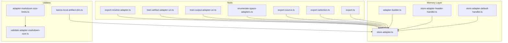
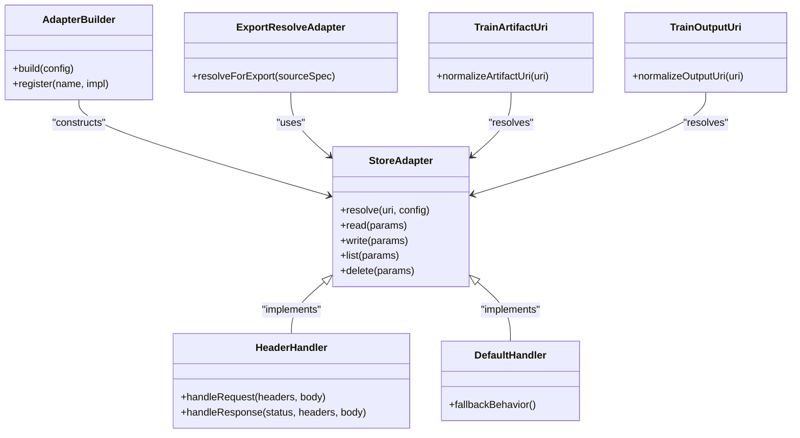
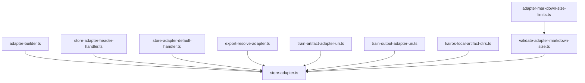
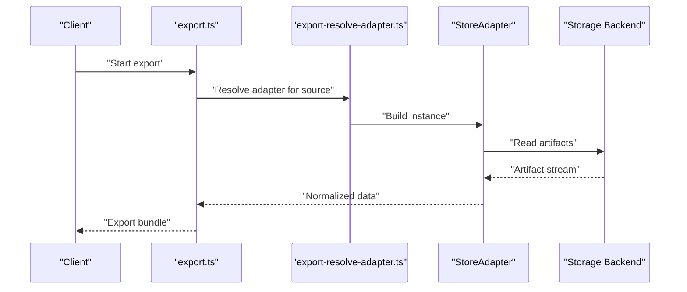
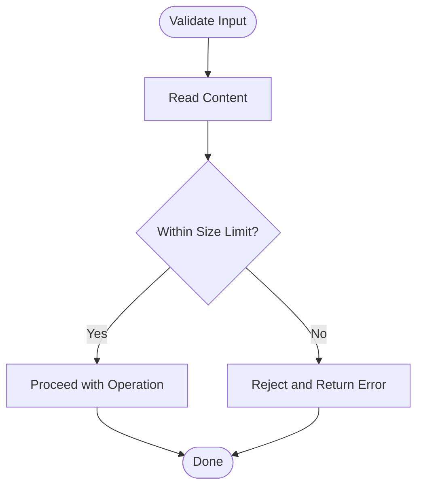

# Built-in Adapters

<cite>
**Referenced Files in This Document**
- [src/services/memory/store-adapter.ts](file://src/services/memory/store-adapter.ts)
- [src/services/memory/adapter-builder.ts](file://src/services/memory/adapter-builder.ts)
- [src/services/memory/store-adapter-header-handler.ts](file://src/services/memory/store-adapter-header-handler.ts)
- [src/services/memory/store-adapter-default-handler.ts](file://src/services/memory/store-adapter-default-handler.ts)
- [src/tools/export-resolve-adapter.ts](file://src/tools/export-resolve-adapter.ts)
- [src/tools/train-artifact-adapter-uri.ts](file://src/tools/train-artifact-adapter-uri.ts)
- [src/tools/train-output-adapter-uri.ts](file://src/tools/train-output-adapter-uri.ts)
- [src/utils/kairos-local-artifact-dirs.ts](file://src/utils/kairos-local-artifact-dirs.ts)
- [src/config/adapter-markdown-size-limits.ts](file://src/config/adapter-markdown-size-limits.ts)
- [src/services/memory/validate-adapter-markdown-size.ts](file://src/services/memory/validate-adapter-markdown-size.ts)
- [src/tools/enumerate-space-adapters.ts](file://src/tools/enumerate-space-adapters.ts)
- [src/tools/export-source.ts](file://src/tools/export-source.ts)
- [src/tools/export-selection.ts](file://src/tools/export-selection.ts)
- [src/tools/export.ts](file://src/tools/export.ts)
- [src/tools/search.ts](file://src/tools/search.ts)
- [src/tools/search_output.ts](file://src/tools/search_output.ts)
- [src/tools/forward-helpers.ts](file://src/tools/forward-helpers.ts)
- [src/tools/forward-register.ts](file://src/tools/forward-register.ts)
- [src/tools/forward-view.ts](file://src/tools/forward-view.ts)
- [src/tools/forward.ts](file://src/tools/forward.ts)
- [src/tools/activate.ts](file://src/tools/activate.ts)
- [src/tools/reward.ts](file://src/tools/reward.ts)
- [src/tools/update.ts](file://src/tools/update.ts)
- [src/tools/delete.ts](file://src/tools/delete.ts)
- [src/tools/dump.ts](file://src/tools/dump.ts)
- [src/tools/tune-execute.ts](file://src/tools/tune-execute.ts)
- [src/tools/tune-cache-invalidation.ts](file://src/tools/tune-cache-invalidation.ts)
- [src/tools/tune-messages.ts](file://src/tools/tune-messages.ts)
- [src/tools/tune-verify.ts](file://src/tools/tune-verify.ts)
- [src/tools/tune.ts](file://src/tools/tune.ts)
- [src/tools/spaces.ts](file://src/tools/spaces.ts)
- [src/tools/artifact-relative-path.ts](file://src/tools/artifact-relative-path.ts)
- [src/tools/local-artifact-dir-contract.ts](file://src/tools/local-artifact-dir-contract.ts)
- [src/tools/mcp-contract-match.ts](file://src/tools/mcp-contract-match.ts)
- [src/tools/mcp-tool-input-teaching.ts](file://src/tools/mcp-tool-input-teaching.ts)
- [src/tools/kairos-genesis-proof-hash.ts](file://src/tools/kairos-genesis-proof-hash.ts)
- [src/tools/kairos-challenge-display.ts](file://src/tools/kairos-challenge-display.ts)
- [src/tools/next-pow-helpers.ts](file://src/tools/next-pow-helpers.ts)
- [src/tools/next-proof-types.ts](file://src/tools/next-proof-types.ts)
- [src/tools/next-missing-proof-payload.ts](file://src/tools/next-missing-proof-payload.ts)
- [src/tools/next-previous-step.ts](file://src/tools/next-previous-step.ts)
- [src/tools/next.ts](file://src/tools/next.ts)
- [src/tools/forward-trace.ts](file://src/tools/forward-trace.ts)
- [src/tools/forward-tool-error.ts](file://src/tools/forward-tool-error.ts)
- [src/tools/forward-runtime-store.ts](file://src/tools/forward-runtime-store.ts)
- [src/tools/forward-schema.ts](file://src/tools/forward-schema.ts)
- [src/tools/activate_schema.ts](file://src/tools/activate_schema.ts)
- [src/tools/delete_schema.ts](file://src/tools/delete_schema.ts)
- [src/tools/dump_schema.ts](file://src/tools/dump_schema.ts)
- [src/tools/export_schema.ts](file://src/tools/export_schema.ts)
- [src/tools/forward_schema.ts](file://src/tools/forward_schema.ts)
- [src/tools/next_schema.ts](file://src/tools/next_schema.ts)
- [src/tools/reward_schema.ts](file://src/tools/reward_schema.ts)
- [src/tools/search_schema.ts](file://src/tools/search_schema.ts)
- [src/tools/spaces_schema.ts](file://src/tools/spaces_schema.ts)
- [src/tools/train-schema.ts](file://src/tools/train-schema.ts)
- [src/tools/tune_schema.ts](file://src/tools/tune_schema.ts)
- [src/tools/update_schema.ts](file://src/tools/update_schema.ts)
- [src/tools/artifact-catalog.ts](file://src/tools/artifact-catalog.ts)
- [src/tools/artifact-mime.ts](file://src/tools/artifact-mime.ts)
- [src/tools/artifact-sanitization/sanitize-html.ts](file://src/tools/artifact-sanitization/sanitize-html.ts)
- [src/tools/artifact-sanitization/sanitize-svg.ts](file://src/tools/artifact-sanitization/sanitize-svg.ts)
- [src/tools/artifact-sanitization/sanitize-url.ts](file://src/tools/artifact-sanitization/sanitize-url.ts)
- [src/tools/artifact-sanitization/sanitize-video.ts](file://src/tools/artifact-sanitization/sanitize-video.ts)
- [src/tools/artifact-sanitization/sanitize-audio.ts](file://src/tools/artifact-sanitization/sanitize-audio.ts)
- [src/tools/artifact-sanitization/sanitize-pdf.ts](file://src/tools/artifact-sanitization/sanitize-pdf.ts)
- [src/tools/artifact-sanitization/sanitize-image.ts](file://src/tools/artifact-sanitization/sanitize-image.ts)
- [src/tools/artifact-sanitization/sanitize-text.ts](file://src/tools/artifact-sanitization/sanitize-text.ts)
- [src/tools/artifact-sanitization/sanitize-json.ts](file://src/tools/artifact-sanitization/sanitize-json.ts)
- [src/tools/artifact-sanitization/sanitize-css.ts](file://src/tools/artifact-sanitization/sanitize-css.ts)
- [src/tools/artifact-sanitization/sanitize-js.ts](file://src/tools/artifact-sanitization/sanitize-js.ts)
- [src/tools/artifact-sanitization/sanitize-wasm.ts](file://src/tools/artifact-sanitization/sanitize-wasm.ts)
- [src/tools/artifact-sanitization/sanitize-executable.ts](file://src/tools/artifact-sanitization/sanitize-executable.ts)
- [src/tools/artifact-sanitization/sanitize-archive.ts](file://src/tools/artifact-sanitization/sanitize-archive.ts)
- [src/tools/artifact-sanitization/sanitize-binary.ts](file://src/tools/artifact-sanitization/sanitize-binary.ts)
- [src/tools/artifact-sanitization/sanitize-font.ts](file://src/tools/artifact-sanitization/sanitize-font.ts)
- [src/tools/artifact-sanitization/sanitize-other.ts](file://src/tools/artifact-sanitization/sanitize-other.ts)
- [src/tools/artifact-sanitization/index.ts](file://src/tools/artifact-sanitization/index.ts)
- [src/tools/artifact-files.ts](file://src/tools/artifact-files.ts)
- [src/tools/build-skill-md.ts](file://src/tools/build-skill-md.ts)
- [src/tools/derive-metadata.ts](file://src/tools/derive-metadata.ts)
- [src/tools/sha256.ts](file://src/tools/sha256.ts)
- [src/tools/sha256sums.ts](file://src/tools/sha256sums.ts)
- [src/tools/types.ts](file://src/tools/types.ts)
- [src/tools/zip-bundle.ts](file://src/tools/zip-bundle.ts)
</cite>

## Table of Contents
1. [Introduction](#introduction)
2. [Project Structure](#project-structure)
3. [Core Components](#core-components)
4. [Architecture Overview](#architecture-overview)
5. [Detailed Component Analysis](#detailed-component-analysis)
6. [Dependency Analysis](#dependency-analysis)
7. [Performance Considerations](#performance-considerations)
8. [Troubleshooting Guide](#troubleshooting-guide)
9. [Conclusion](#conclusion)
10. [Appendices](#appendices)

## Introduction
This document describes the built-in adapters provided by the framework for memory and artifact operations. It focuses on:
- The default file system adapter used for local storage operations
- The header-based adapter for HTTP request/response processing
- Other pre-configured adapters and how they are resolved and configured
- Configuration options, supported data formats, performance characteristics, and typical use cases
- Setup examples, common configurations, and troubleshooting guidance
- Adapter-specific features such as caching, compression, and authentication handling

The goal is to help you understand how adapters integrate with the rest of the system and how to configure them effectively.

## Project Structure
Adapters are primarily defined and orchestrated under the memory service layer and consumed by tools that implement the public API surface (HTTP, CLI, MCP). Key areas include:
- Memory store adapter contract and builders
- Header-based and default handlers for adapter I/O
- Export/import tooling that resolves and uses adapters
- Utilities for local artifact directories and validation

**Diagram sources**
- [src/services/memory/store-adapter.ts](file://src/services/memory/store-adapter.ts)
- [src/services/memory/adapter-builder.ts](file://src/services/memory/adapter-builder.ts)
- [src/services/memory/store-adapter-header-handler.ts](file://src/services/memory/store-adapter-header-handler.ts)
- [src/services/memory/store-adapter-default-handler.ts](file://src/services/memory/store-adapter-default-handler.ts)
- [src/tools/export-resolve-adapter.ts](file://src/tools/export-resolve-adapter.ts)
- [src/tools/train-artifact-adapter-uri.ts](file://src/tools/train-artifact-adapter-uri.ts)
- [src/tools/train-output-adapter-uri.ts](file://src/tools/train-output-adapter-uri.ts)
- [src/tools/enumerate-space-adapters.ts](file://src/tools/enumerate-space-adapters.ts)
- [src/tools/export-source.ts](file://src/tools/export-source.ts)
- [src/tools/export-selection.ts](file://src/tools/export-selection.ts)
- [src/tools/export.ts](file://src/tools/export.ts)
- [src/utils/kairos-local-artifact-dirs.ts](file://src/utils/kairos-local-artifact-dirs.ts)
- [src/config/adapter-markdown-size-limits.ts](file://src/config/adapter-markdown-size-limits.ts)
- [src/services/memory/validate-adapter-markdown-size.ts](file://src/services/memory/validate-adapter-markdown-size.ts)

**Section sources**
- [src/services/memory/store-adapter.ts](file://src/services/memory/store-adapter.ts)
- [src/services/memory/adapter-builder.ts](file://src/services/memory/adapter-builder.ts)
- [src/services/memory/store-adapter-header-handler.ts](file://src/services/memory/store-adapter-header-handler.ts)
- [src/services/memory/store-adapter-default-handler.ts](file://src/services/memory/store-adapter-default-handler.ts)
- [src/tools/export-resolve-adapter.ts](file://src/tools/export-resolve-adapter.ts)
- [src/tools/train-artifact-adapter-uri.ts](file://src/tools/train-artifact-adapter-uri.ts)
- [src/tools/train-output-adapter-uri.ts](file://src/tools/train-output-adapter-uri.ts)
- [src/tools/enumerate-space-adapters.ts](file://src/tools/enumerate-space-adapters.ts)
- [src/tools/export-source.ts](file://src/tools/export-source.ts)
- [src/tools/export-selection.ts](file://src/tools/export-selection.ts)
- [src/tools/export.ts](file://src/tools/export.ts)
- [src/utils/kairos-local-artifact-dirs.ts](file://src/utils/kairos-local-artifact-dirs.ts)
- [src/config/adapter-markdown-size-limits.ts](file://src/config/adapter-markdown-size-limits.ts)
- [src/services/memory/validate-adapter-markdown-size.ts](file://src/services/memory/validate-adapter-markdown-size.ts)

## Core Components
- Store adapter contract and builder: Defines the interface and factory patterns used to construct adapters at runtime.
- Header-based adapter handler: Provides an adapter implementation that reads/writes via HTTP headers for request/response processing.
- Default adapter handler: Supplies a fallback behavior when no explicit adapter is specified.
- Export/import resolution: Tools resolve which adapter to use based on configuration and URIs.
- Local artifact directory utilities: Provide defaults for local file system-backed storage.
- Markdown size limits and validation: Enforce constraints on content sizes for adapters.

Key responsibilities:
- Resolve adapter instances from configuration or URIs
- Normalize inputs and outputs across different backends
- Apply validation and size limits
- Support optional features like caching and compression where applicable

**Section sources**
- [src/services/memory/store-adapter.ts](file://src/services/memory/store-adapter.ts)
- [src/services/memory/adapter-builder.ts](file://src/services/memory/adapter-builder.ts)
- [src/services/memory/store-adapter-header-handler.ts](file://src/services/memory/store-adapter-header-handler.ts)
- [src/services/memory/store-adapter-default-handler.ts](file://src/services/memory/store-adapter-default-handler.ts)
- [src/tools/export-resolve-adapter.ts](file://src/tools/export-resolve-adapter.ts)
- [src/utils/kairos-local-artifact-dirs.ts](file://src/utils/kairos-local-artifact-dirs.ts)
- [src/config/adapter-markdown-size-limits.ts](file://src/config/adapter-markdown-size-limits.ts)
- [src/services/memory/validate-adapter-markdown-size.ts](file://src/services/memory/validate-adapter-markdown-size.ts)

## Architecture Overview
The adapter architecture separates concerns between:
- Contract definition and construction (builder)
- Concrete implementations (header-based, default)
- Tooling that consumes adapters (export, train, search, etc.)
- Validation and configuration utilities

**Diagram sources**
- [src/services/memory/store-adapter.ts](file://src/services/memory/store-adapter.ts)
- [src/services/memory/adapter-builder.ts](file://src/services/memory/adapter-builder.ts)
- [src/services/memory/store-adapter-header-handler.ts](file://src/services/memory/store-adapter-header-handler.ts)
- [src/services/memory/store-adapter-default-handler.ts](file://src/services/memory/store-adapter-default-handler.ts)
- [src/tools/export-resolve-adapter.ts](file://src/tools/export-resolve-adapter.ts)
- [src/tools/train-artifact-adapter-uri.ts](file://src/tools/train-artifact-adapter-uri.ts)
- [src/tools/train-output-adapter-uri.ts](file://src/tools/train-output-adapter-uri.ts)

## Detailed Component Analysis

### Default File System Adapter (Local Storage)
Purpose:
- Provide local disk-backed storage for artifacts and memory items using well-known directories.

Configuration:
- Uses local artifact directory utilities to determine base paths and structure.
- Respects markdown size limits and validation rules for content safety and performance.

Supported Data Formats:
- Text-based formats (e.g., Markdown, JSON, YAML) validated against size limits.
- Binary artifacts handled through artifact catalog and MIME inference utilities.

Performance Characteristics:
- I/O-bound; performance depends on filesystem speed and concurrent access patterns.
- Size validation prevents oversized payloads from degrading throughput.

Use Cases:
- Development and testing environments
- Offline workflows and local exports/imports
- Simple deployments without external dependencies

Setup Examples:
- Configure local artifact directories via environment or configuration files referenced by the local artifact dirs utility.
- Ensure write permissions and sufficient disk space.

Common Configurations:
- Set base directories for artifacts and memory stores.
- Adjust markdown size limits if needed.

Troubleshooting:
- Verify directory existence and permissions.
- Check size limit errors during import/training.
- Validate artifact paths and relative path normalization.

**Section sources**
- [src/utils/kairos-local-artifact-dirs.ts](file://src/utils/kairos-local-artifact-dirs.ts)
- [src/config/adapter-markdown-size-limits.ts](file://src/config/adapter-markdown-size-limits.ts)
- [src/services/memory/validate-adapter-markdown-size.ts](file://src/services/memory/validate-adapter-markdown-size.ts)
- [src/tools/artifact-relative-path.ts](file://src/tools/artifact-relative-path.ts)
- [src/tools/local-artifact-dir-contract.ts](file://src/tools/local-artifact-dir-contract.ts)
- [src/tools/artifact-catalog.ts](file://src/tools/artifact-catalog.ts)
- [src/tools/artifact-mime.ts](file://src/tools/artifact-mime.ts)

### Header-Based Adapter (HTTP Request/Response Processing)
Purpose:
- Implement adapter behavior over HTTP by reading and writing data via request/response headers and bodies.

Configuration:
- Specify target endpoints and required headers for authentication and routing.
- Optionally enable compression and caching behaviors depending on server capabilities.

Supported Data Formats:
- Content types inferred from headers and normalized by MIME utilities.
- Supports text and binary payloads with appropriate encoding.

Performance Characteristics:
- Network latency and bandwidth impact throughput.
- Compression can reduce payload size but adds CPU overhead.
- Caching reduces repeated network calls.

Use Cases:
- Remote storage services
- Integration with cloud object stores
- Multi-node deployments requiring centralized storage

Setup Examples:
- Configure HTTP endpoint URLs and authentication headers.
- Enable compression if supported by the remote service.
- Tune cache settings for frequently accessed resources.

Common Configurations:
- Base URL, timeout, retry policies, and header templates.
- Cache backend selection and TTL values.

Authentication Handling:
- Use bearer tokens or other schemes via header injection.
- Integrate with OIDC flows where applicable.

Troubleshooting:
- Validate connectivity and credentials.
- Inspect response codes and error messages.
- Monitor cache hit rates and compression effectiveness.

**Section sources**
- [src/services/memory/store-adapter-header-handler.ts](file://src/services/memory/store-adapter-header-handler.ts)
- [src/tools/artifact-mime.ts](file://src/tools/artifact-mime.ts)
- [src/tools/forward-helpers.ts](file://src/tools/forward-helpers.ts)
- [src/tools/forward-register.ts](file://src/tools/forward-register.ts)
- [src/tools/forward-view.ts](file://src/tools/forward-view.ts)
- [src/tools/forward.ts](file://src/tools/forward.ts)
- [src/tools/activate.ts](file://src/tools/activate.ts)
- [src/tools/reward.ts](file://src/tools/reward.ts)
- [src/tools/update.ts](file://src/tools/update.ts)
- [src/tools/delete.ts](file://src/tools/delete.ts)
- [src/tools/dump.ts](file://src/tools/dump.ts)
- [src/tools/tune-execute.ts](file://src/tools/tune-execute.ts)
- [src/tools/tune-cache-invalidation.ts](file://src/tools/tune-cache-invalidation.ts)
- [src/tools/tune-messages.ts](file://src/tools/tune-messages.ts)
- [src/tools/tune-verify.ts](file://src/tools/tune-verify.ts)
- [src/tools/tune.ts](file://src/tools/tune.ts)
- [src/tools/spaces.ts](file://src/tools/spaces.ts)

### Other Pre-Configured Adapters and Resolution
Purpose:
- Provide mechanisms to enumerate and select adapters for spaces and export/import workflows.

Capabilities:
- Enumerate available adapters per space.
- Resolve adapter URIs for training artifacts and outputs.
- Normalize source specifications for exports.

Supported Data Formats:
- Depends on underlying adapter implementations; typically text and binary with MIME inference.

Performance Characteristics:
- Resolution overhead is minimal compared to I/O operations.
- Caching of resolved adapters can improve startup times.

Use Cases:
- Dynamic adapter selection based on workspace configuration.
- Automated pipelines that require consistent adapter resolution.

Setup Examples:
- Define adapter URIs in configuration or metadata.
- Use enumeration tools to discover available adapters.

Common Configurations:
- URI schemas and naming conventions.
- Fallback strategies when specific adapters are unavailable.

Troubleshooting:
- Validate adapter URIs and accessibility.
- Check enumeration results for expected entries.
- Confirm resolution precedence and fallback behavior.

**Section sources**
- [src/tools/enumerate-space-adapters.ts](file://src/tools/enumerate-space-adapters.ts)
- [src/tools/export-resolve-adapter.ts](file://src/tools/export-resolve-adapter.ts)
- [src/tools/train-artifact-adapter-uri.ts](file://src/tools/train-artifact-adapter-uri.ts)
- [src/tools/train-output-adapter-uri.ts](file://src/tools/train-output-adapter-uri.ts)
- [src/tools/export-source.ts](file://src/tools/export-source.ts)
- [src/tools/export-selection.ts](file://src/tools/export-selection.ts)
- [src/tools/export.ts](file://src/tools/export.ts)

### Search and Forward Adapters
Purpose:
- Provide search and forward capabilities backed by adapters for retrieval and execution flows.

Capabilities:
- Search queries resolved through adapter-backed stores.
- Forward operations execute steps and manage state via adapters.

Supported Data Formats:
- Query structures and result sets normalized by schema definitions.

Performance Characteristics:
- Search performance depends on backend indexing and caching.
- Forward operations may involve multiple adapter calls; batching and concurrency control apply.

Use Cases:
- Interactive workflows requiring dynamic retrieval and step execution.
- Automation scripts leveraging search and forward APIs.

Setup Examples:
- Configure search indexes and forward runtime stores.
- Enable caching and metrics for observability.

Common Configurations:
- Index parameters, query filters, and pagination settings.
- Concurrency limits and timeouts.

Troubleshooting:
- Validate index health and query syntax.
- Inspect forward traces and error diagnostics.
- Monitor metrics for bottlenecks.

**Section sources**
- [src/tools/search.ts](file://src/tools/search.ts)
- [src/tools/search_output.ts](file://src/tools/search_output.ts)
- [src/tools/forward-helpers.ts](file://src/tools/forward-helpers.ts)
- [src/tools/forward-register.ts](file://src/tools/forward-register.ts)
- [src/tools/forward-view.ts](file://src/tools/forward-view.ts)
- [src/tools/forward.ts](file://src/tools/forward.ts)
- [src/tools/forward-trace.ts](file://src/tools/forward-trace.ts)
- [src/tools/forward-tool-error.ts](file://src/tools/forward-tool-error.ts)
- [src/tools/forward-runtime-store.ts](file://src/tools/forward-runtime-store.ts)
- [src/tools/forward-schema.ts](file://src/tools/forward-schema.ts)

### Activation, Reward, Update, Delete, Dump, Tune, Spaces
Purpose:
- Provide lifecycle management and operational tools that rely on adapters for persistence and retrieval.

Capabilities:
- Activate protocols and artifacts
- Record rewards and evaluations
- Update and delete resources
- Dump and export datasets
- Tune models and verify outcomes
- Manage spaces and offerings

Supported Data Formats:
- Protocol definitions, artifacts, and metadata normalized by schema utilities.

Performance Characteristics:
- Batch operations benefit from adapter-level optimizations and caching.
- Large exports/imports should consider compression and chunking.

Use Cases:
- End-to-end workflows from activation to tuning and evaluation.
- Administrative tasks for resource management and auditing.

Setup Examples:
- Configure schema validations and output formats.
- Enable audit logging and metrics.

Common Configurations:
- Schema versions, validation strictness, and output encodings.
- Audit log destinations and retention policies.

Troubleshooting:
- Validate schema compliance and version compatibility.
- Review audit logs for anomalies.
- Check metrics for performance regressions.

**Section sources**
- [src/tools/activate.ts](file://src/tools/activate.ts)
- [src/tools/activate_schema.ts](file://src/tools/activate_schema.ts)
- [src/tools/reward.ts](file://src/tools/reward.ts)
- [src/tools/reward_schema.ts](file://src/tools/reward_schema.ts)
- [src/tools/update.ts](file://src/tools/update.ts)
- [src/tools/update_schema.ts](file://src/tools/update_schema.ts)
- [src/tools/delete.ts](file://src/tools/delete.ts)
- [src/tools/delete_schema.ts](file://src/tools/delete_schema.ts)
- [src/tools/dump.ts](file://src/tools/dump.ts)
- [src/tools/dump_schema.ts](file://src/tools/dump_schema.ts)
- [src/tools/tune-execute.ts](file://src/tools/tune-execute.ts)
- [src/tools/tune-cache-invalidation.ts](file://src/tools/tune-cache-invalidation.ts)
- [src/tools/tune-messages.ts](file://src/tools/tune-messages.ts)
- [src/tools/tune-verify.ts](file://src/tools/tune-verify.ts)
- [src/tools/tune.ts](file://src/tools/tune.ts)
- [src/tools/tune_schema.ts](file://src/tools/tune_schema.ts)
- [src/tools/spaces.ts](file://src/tools/spaces.ts)
- [src/tools/spaces_schema.ts](file://src/tools/spaces_schema.ts)

### Artifact Sanitization and Safety
Purpose:
- Ensure safe handling of diverse artifact types by sanitizing potentially dangerous content.

Capabilities:
- Sanitize HTML, SVG, URLs, media, code, archives, and binaries.
- Maintain integrity while removing unsafe elements.

Supported Data Formats:
- Wide range of MIME types with specialized sanitizers.

Performance Characteristics:
- Sanitization adds CPU overhead; balance security and performance based on trust levels.

Use Cases:
- Ingesting untrusted content
- Publishing sanitized artifacts to shared spaces

Setup Examples:
- Enable sanitization pipeline for incoming artifacts.
- Configure allowed tags and attributes for HTML/SVG.

Common Configurations:
- Strictness levels and allowlists.
- Max sizes and type restrictions.

Troubleshooting:
- Review sanitization logs for blocked content.
- Adjust allowlists carefully to avoid breaking legitimate use cases.

**Section sources**
- [src/tools/artifact-sanitization/index.ts](file://src/tools/artifact-sanitization/index.ts)
- [src/tools/artifact-sanitization/sanitize-html.ts](file://src/tools/artifact-sanitization/sanitize-html.ts)
- [src/tools/artifact-sanitization/sanitize-svg.ts](file://src/tools/artifact-sanitization/sanitize-svg.ts)
- [src/tools/artifact-sanitization/sanitize-url.ts](file://src/tools/artifact-sanitization/sanitize-url.ts)
- [src/tools/artifact-sanitization/sanitize-video.ts](file://src/tools/artifact-sanitization/sanitize-video.ts)
- [src/tools/artifact-sanitization/sanitize-audio.ts](file://src/tools/artifact-sanitization/sanitize-audio.ts)
- [src/tools/artifact-sanitization/sanitize-pdf.ts](file://src/tools/artifact-sanitization/sanitize-pdf.ts)
- [src/tools/artifact-sanitization/sanitize-image.ts](file://src/tools/artifact-sanitization/sanitize-image.ts)
- [src/tools/artifact-sanitization/sanitize-text.ts](file://src/tools/artifact-sanitization/sanitize-text.ts)
- [src/tools/artifact-sanitization/sanitize-json.ts](file://src/tools/artifact-sanitization/sanitize-json.ts)
- [src/tools/artifact-sanitization/sanitize-css.ts](file://src/tools/artifact-sanitization/sanitize-css.ts)
- [src/tools/artifact-sanitization/sanitize-js.ts](file://src/tools/artifact-sanitization/sanitize-js.ts)
- [src/tools/artifact-sanitization/sanitize-wasm.ts](file://src/tools/artifact-sanitization/sanitize-wasm.ts)
- [src/tools/artifact-sanitization/sanitize-executable.ts](file://src/tools/artifact-sanitization/sanitize-executable.ts)
- [src/tools/artifact-sanitization/sanitize-archive.ts](file://src/tools/artifact-sanitization/sanitize-archive.ts)
- [src/tools/artifact-sanitization/sanitize-binary.ts](file://src/tools/artifact-sanitization/sanitize-binary.ts)
- [src/tools/artifact-sanitization/sanitize-font.ts](file://src/tools/artifact-sanitization/sanitize-font.ts)
- [src/tools/artifact-sanitization/sanitize-other.ts](file://src/tools/artifact-sanitization/sanitize-other.ts)

## Dependency Analysis
Adapters depend on:
- Builder and contract definitions for instantiation
- MIME and catalog utilities for format handling
- Validation and size limit configs for safety
- Export/import and search/forward tools for usage

**Diagram sources**
- [src/services/memory/adapter-builder.ts](file://src/services/memory/adapter-builder.ts)
- [src/services/memory/store-adapter.ts](file://src/services/memory/store-adapter.ts)
- [src/services/memory/store-adapter-header-handler.ts](file://src/services/memory/store-adapter-header-handler.ts)
- [src/services/memory/store-adapter-default-handler.ts](file://src/services/memory/store-adapter-default-handler.ts)
- [src/tools/export-resolve-adapter.ts](file://src/tools/export-resolve-adapter.ts)
- [src/tools/train-artifact-adapter-uri.ts](file://src/tools/train-artifact-adapter-uri.ts)
- [src/tools/train-output-adapter-uri.ts](file://src/tools/train-output-adapter-uri.ts)
- [src/utils/kairos-local-artifact-dirs.ts](file://src/utils/kairos-local-artifact-dirs.ts)
- [src/config/adapter-markdown-size-limits.ts](file://src/config/adapter-markdown-size-limits.ts)
- [src/services/memory/validate-adapter-markdown-size.ts](file://src/services/memory/validate-adapter-markdown-size.ts)

**Section sources**
- [src/services/memory/adapter-builder.ts](file://src/services/memory/adapter-builder.ts)
- [src/services/memory/store-adapter.ts](file://src/services/memory/store-adapter.ts)
- [src/services/memory/store-adapter-header-handler.ts](file://src/services/memory/store-adapter-header-handler.ts)
- [src/services/memory/store-adapter-default-handler.ts](file://src/services/memory/store-adapter-default-handler.ts)
- [src/tools/export-resolve-adapter.ts](file://src/tools/export-resolve-adapter.ts)
- [src/tools/train-artifact-adapter-uri.ts](file://src/tools/train-artifact-adapter-uri.ts)
- [src/tools/train-output-adapter-uri.ts](file://src/tools/train-output-adapter-uri.ts)
- [src/utils/kairos-local-artifact-dirs.ts](file://src/utils/kairos-local-artifact-dirs.ts)
- [src/config/adapter-markdown-size-limits.ts](file://src/config/adapter-markdown-size-limits.ts)
- [src/services/memory/validate-adapter-markdown-size.ts](file://src/services/memory/validate-adapter-markdown-size.ts)

## Performance Considerations
- Prefer caching for frequently accessed artifacts and search results.
- Enable compression for large payloads when supported by the backend.
- Tune concurrency limits to match storage capabilities.
- Monitor size limits and sanitize aggressively for untrusted content.
- Use batch operations where possible to reduce overhead.

[No sources needed since this section provides general guidance]

## Troubleshooting Guide
Common issues and resolutions:
- Permission errors on local directories: verify ownership and access rights.
- Size limit violations: adjust limits or split large artifacts.
- Authentication failures for HTTP adapters: validate tokens and endpoint URLs.
- Cache misses or stale data: review TTL and invalidation policies.
- Sanitization rejections: inspect logs and refine allowlists.

Operational checks:
- Health endpoints and metrics for adapter backends.
- Audit logs for changes and access patterns.
- Error traces for failed operations.

**Section sources**
- [src/services/memory/validate-adapter-markdown-size.ts](file://src/services/memory/validate-adapter-markdown-size.ts)
- [src/tools/forward-trace.ts](file://src/tools/forward-trace.ts)
- [src/tools/forward-tool-error.ts](file://src/tools/forward-tool-error.ts)
- [src/tools/artifact-sanitization/index.ts](file://src/tools/artifact-sanitization/index.ts)

## Conclusion
The framework’s built-in adapters provide a flexible foundation for local and remote storage, HTTP-based I/O, and comprehensive tooling for export, search, forward, and lifecycle management. By configuring adapters appropriately—leveraging caching, compression, and authentication—you can tailor the system to diverse deployment scenarios while maintaining safety and performance.

[No sources needed since this section summarizes without analyzing specific files]

## Appendices

### Sequence: Export Flow Using Adapters

**Diagram sources**
- [src/tools/export.ts](file://src/tools/export.ts)
- [src/tools/export-resolve-adapter.ts](file://src/tools/export-resolve-adapter.ts)
- [src/services/memory/store-adapter.ts](file://src/services/memory/store-adapter.ts)

### Flowchart: Markdown Size Validation

**Diagram sources**
- [src/config/adapter-markdown-size-limits.ts](file://src/config/adapter-markdown-size-limits.ts)
- [src/services/memory/validate-adapter-markdown-size.ts](file://src/services/memory/validate-adapter-markdown-size.ts)