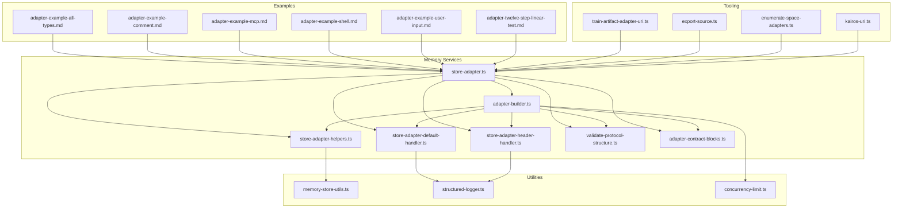
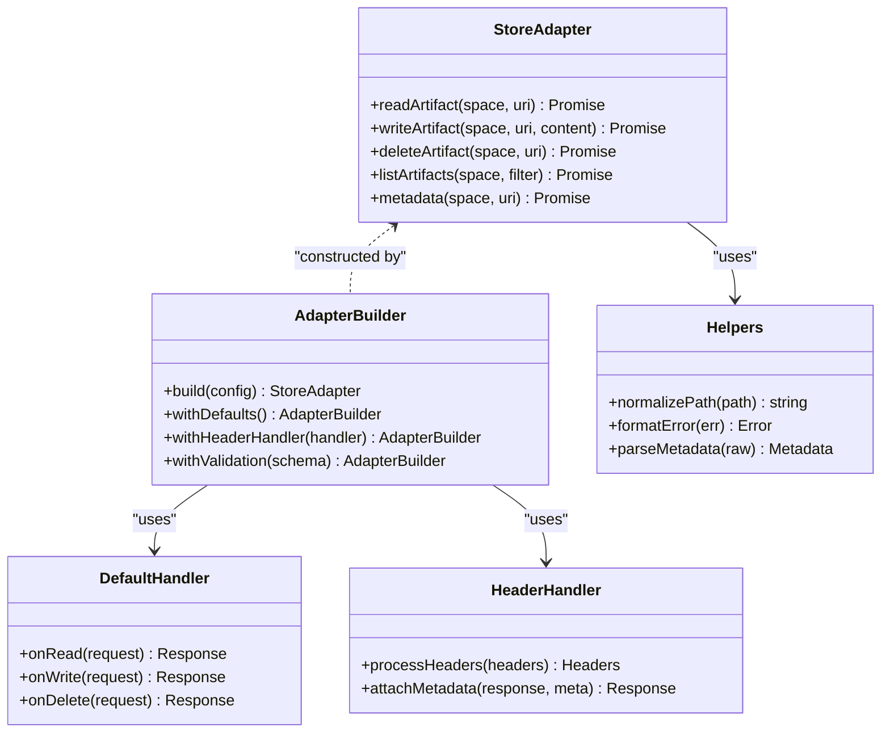
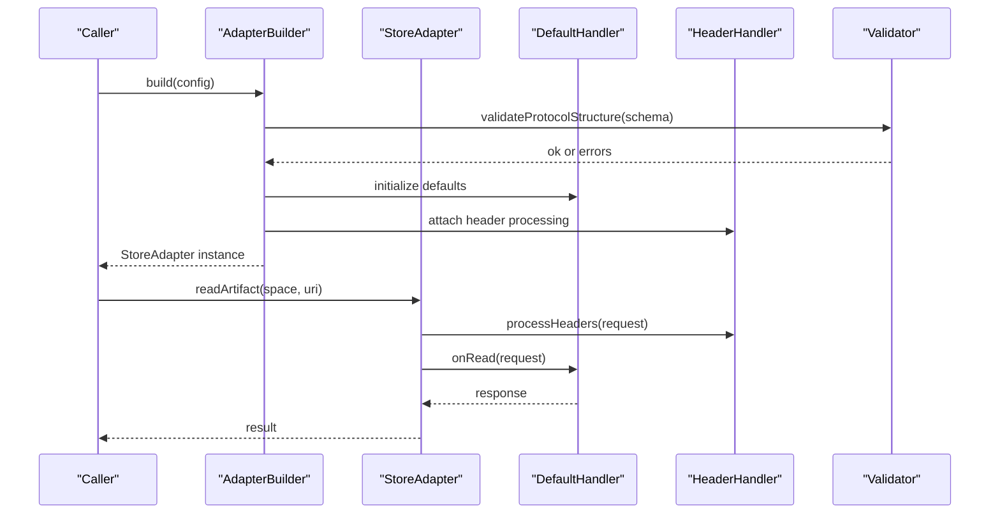
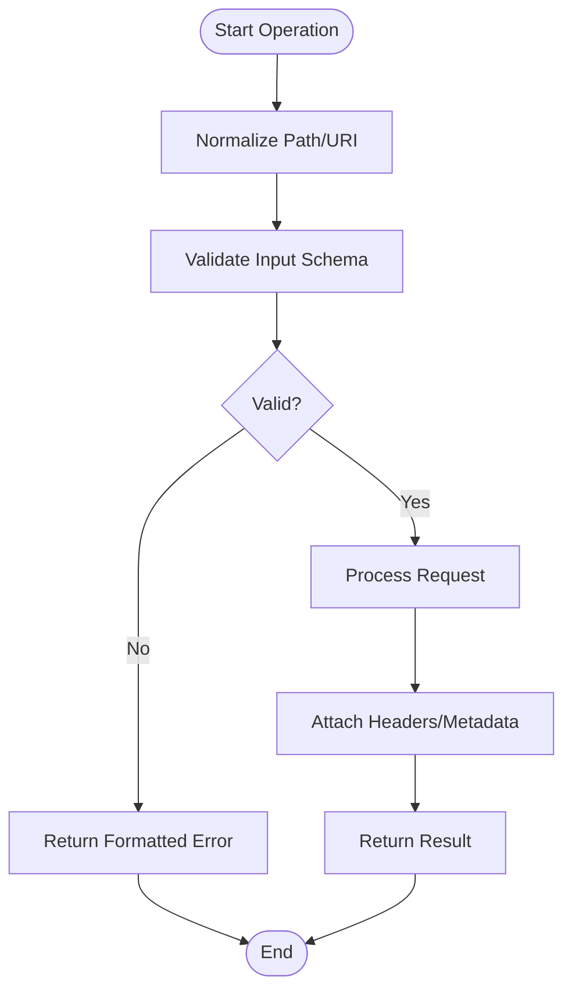
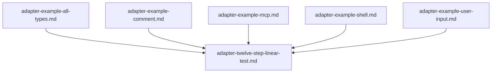
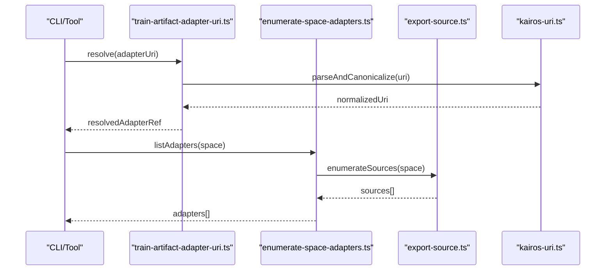
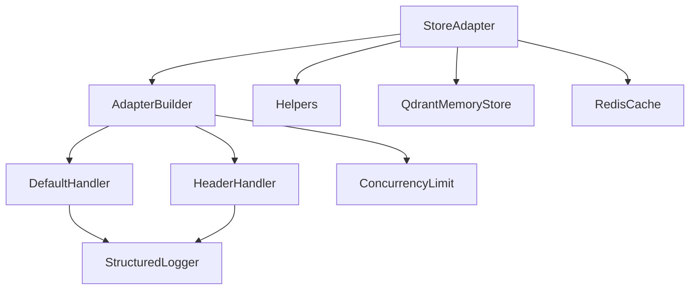

# Custom Adapter Development

<cite>
**Referenced Files in This Document**
- [store-adapter.ts](file://src/services/memory/store-adapter.ts)
- [adapter-builder.ts](file://src/services/memory/adapter-builder.ts)
- [store-adapter-helpers.ts](file://src/services/memory/store-adapter-helpers.ts)
- [store-adapter-default-handler.ts](file://src/services/memory/store-adapter-default-handler.ts)
- [store-adapter-header-handler.ts](file://src/services/memory/store-adapter-header-handler.ts)
- [validate-protocol-structure.ts](file://src/services/memory/validate-protocol-structure.ts)
- [memory-store-utils.ts](file://src/utils/memory-store-utils.ts)
- [adapter-contract-blocks.ts](file://src/services/memory/adapter-contract-blocks.ts)
- [adapter-example-all-types.md](file://docs/examples/adapter-example-all-types.md)
- [adapter-example-comment.md](file://docs/examples/adapter-example-comment.md)
- [adapter-example-mcp.md](file://docs/examples/adapter-example-mcp.md)
- [adapter-example-shell.md](file://docs/examples/adapter-example-shell.md)
- [adapter-example-user-input.md](file://docs/examples/adapter-example-user-input.md)
- [adapter-twelve-step-linear-test.md](file://docs/examples/adapter-twelve-step-linear-test.md)
- [train-artifact-adapter-uri.ts](file://src/tools/train-artifact-adapter-uri.ts)
- [export-source.ts](file://src/tools/export-source.ts)
- [enumerate-space-adapters.ts](file://src/tools/skill-export/enumerate-space-adapters.ts)
- [kairos-uri.ts](file://src/tools/kairos-uri.ts)
- [structured-logger.ts](file://src/utils/structured-logger.ts)
- [concurrency-limit.ts](file://src/utils/concurrency-limit.ts)
- [qdrant-memory-store.ts](file://src/services/qdrant/memory-store.ts)
- [redis-cache.ts](file://src/services/redis-cache.ts)
</cite>

## Table of Contents
1. [Introduction](#introduction)
2. [Project Structure](#project-structure)
3. [Core Components](#core-components)
4. [Architecture Overview](#architecture-overview)
5. [Detailed Component Analysis](#detailed-component-analysis)
6. [Dependency Analysis](#dependency-analysis)
7. [Performance Considerations](#performance-considerations)
8. [Troubleshooting Guide](#troubleshooting-guide)
9. [Conclusion](#conclusion)
10. [Appendices](#appendices)

## Introduction
This guide explains how to create custom adapters that integrate external data sources into the system’s memory layer. It covers the end-to-end workflow from initial setup and development to testing, debugging, and production deployment. You will learn about helper utilities, testing frameworks, and debugging tools available for adapter development. Step-by-step examples demonstrate building adapters for databases, APIs, and cloud storage. Advanced patterns such as streaming data, batch operations, and connection pooling are addressed, along with performance optimization techniques and memory management best practices.

## Project Structure
The adapter subsystem is implemented under the memory services and related utilities. The key areas include:
- Adapter contract and builder
- Default and header handlers
- Helpers and validation utilities
- Example adapters and tests
- Tooling for training, export, and URI resolution

**Diagram sources**
- [store-adapter.ts](file://src/services/memory/store-adapter.ts)
- [adapter-builder.ts](file://src/services/memory/adapter-builder.ts)
- [store-adapter-helpers.ts](file://src/services/memory/store-adapter-helpers.ts)
- [store-adapter-default-handler.ts](file://src/services/memory/store-adapter-default-handler.ts)
- [store-adapter-header-handler.ts](file://src/services/memory/store-adapter-header-handler.ts)
- [validate-protocol-structure.ts](file://src/services/memory/validate-protocol-structure.ts)
- [adapter-contract-blocks.ts](file://src/services/memory/adapter-contract-blocks.ts)
- [memory-store-utils.ts](file://src/utils/memory-store-utils.ts)
- [structured-logger.ts](file://src/utils/structured-logger.ts)
- [concurrency-limit.ts](file://src/utils/concurrency-limit.ts)
- [adapter-example-all-types.md](file://docs/examples/adapter-example-all-types.md)
- [adapter-example-comment.md](file://docs/examples/adapter-example-comment.md)
- [adapter-example-mcp.md](file://docs/examples/adapter-example-mcp.md)
- [adapter-example-shell.md](file://docs/examples/adapter-example-shell.md)
- [adapter-example-user-input.md](file://docs/examples/adapter-example-user-input.md)
- [adapter-twelve-step-linear-test.md](file://docs/examples/adapter-twelve-step-linear-test.md)
- [train-artifact-adapter-uri.ts](file://src/tools/train-artifact-adapter-uri.ts)
- [export-source.ts](file://src/tools/export-source.ts)
- [enumerate-space-adapters.ts](file://src/tools/skill-export/enumerate-space-adapters.ts)
- [kairos-uri.ts](file://src/tools/kairos-uri.ts)

**Section sources**
- [store-adapter.ts](file://src/services/memory/store-adapter.ts)
- [adapter-builder.ts](file://src/services/memory/adapter-builder.ts)
- [store-adapter-helpers.ts](file://src/services/memory/store-adapter-helpers.ts)
- [store-adapter-default-handler.ts](file://src/services/memory/store-adapter-default-handler.ts)
- [store-adapter-header-handler.ts](file://src/services/memory/store-adapter-header-handler.ts)
- [validate-protocol-structure.ts](file://src/services/memory/validate-protocol-structure.ts)
- [adapter-contract-blocks.ts](file://src/services/memory/adapter-contract-blocks.ts)
- [memory-store-utils.ts](file://src/utils/memory-store-utils.ts)
- [structured-logger.ts](file://src/utils/structured-logger.ts)
- [concurrency-limit.ts](file://src/utils/concurrency-limit.ts)
- [adapter-example-all-types.md](file://docs/examples/adapter-example-all-types.md)
- [adapter-example-comment.md](file://docs/examples/adapter-example-comment.md)
- [adapter-example-mcp.md](file://docs/examples/adapter-example-mcp.md)
- [adapter-example-shell.md](file://docs/examples/adapter-example-shell.md)
- [adapter-example-user-input.md](file://docs/examples/adapter-example-user-input.md)
- [adapter-twelve-step-linear-test.md](file://docs/examples/adapter-twelve-step-linear-test.md)
- [train-artifact-adapter-uri.ts](file://src/tools/train-artifact-adapter-uri.ts)
- [export-source.ts](file://src/tools/export-source.ts)
- [enumerate-space-adapters.ts](file://src/tools/skill-export/enumerate-space-adapters.ts)
- [kairos-uri.ts](file://src/tools/kairos-uri.ts)

## Core Components
- Adapter Contract and Builder
  - The core adapter interface defines the methods required to read, write, and manage artifacts within a space. The builder provides a structured way to construct adapters with consistent behavior, default handling, and header processing.
- Handlers
  - Default handler implements standard lifecycle behaviors for adapters.
  - Header handler processes request/response headers and metadata relevant to adapter interactions.
- Helpers and Validation
  - Helper utilities simplify common tasks like artifact path resolution, metadata normalization, and error formatting.
  - Protocol structure validation ensures adapters conform to expected schemas before execution.
- Utilities
  - Memory store utilities provide shared functionality used across adapters.
  - Structured logging supports observability and debugging.
  - Concurrency limiting helps control resource usage during high-throughput operations.

**Section sources**
- [store-adapter.ts](file://src/services/memory/store-adapter.ts)
- [adapter-builder.ts](file://src/services/memory/adapter-builder.ts)
- [store-adapter-default-handler.ts](file://src/services/memory/store-adapter-default-handler.ts)
- [store-adapter-header-handler.ts](file://src/services/memory/store-adapter-header-handler.ts)
- [store-adapter-helpers.ts](file://src/services/memory/store-adapter-helpers.ts)
- [validate-protocol-structure.ts](file://src/services/memory/validate-protocol-structure.ts)
- [memory-store-utils.ts](file://src/utils/memory-store-utils.ts)
- [structured-logger.ts](file://src/utils/structured-logger.ts)
- [concurrency-limit.ts](file://src/utils/concurrency-limit.ts)

## Architecture Overview
The adapter architecture separates concerns between the adapter contract, builder, handlers, and helpers. Adapters implement the contract while leveraging the builder and handlers for consistent behavior. Validation and utilities ensure correctness and reliability.

**Diagram sources**
- [store-adapter.ts](file://src/services/memory/store-adapter.ts)
- [adapter-builder.ts](file://src/services/memory/adapter-builder.ts)
- [store-adapter-default-handler.ts](file://src/services/memory/store-adapter-default-handler.ts)
- [store-adapter-header-handler.ts](file://src/services/memory/store-adapter-header-handler.ts)
- [store-adapter-helpers.ts](file://src/services/memory/store-adapter-helpers.ts)

## Detailed Component Analysis

### Adapter Contract and Builder
- Purpose: Define the interface for reading, writing, listing, deleting, and querying metadata of artifacts within a space. Provide a builder to configure adapters consistently.
- Key responsibilities:
  - Enforce method signatures and return types.
  - Compose default and header handlers.
  - Apply protocol validation before executing operations.
- Typical usage pattern:
  - Create an adapter instance via the builder.
  - Configure defaults and header processing.
  - Validate input against schema.
  - Execute operations using the constructed adapter.

**Diagram sources**
- [adapter-builder.ts](file://src/services/memory/adapter-builder.ts)
- [store-adapter.ts](file://src/services/memory/store-adapter.ts)
- [store-adapter-default-handler.ts](file://src/services/memory/store-adapter-default-handler.ts)
- [store-adapter-header-handler.ts](file://src/services/memory/store-adapter-header-handler.ts)
- [validate-protocol-structure.ts](file://src/services/memory/validate-protocol-structure.ts)

**Section sources**
- [store-adapter.ts](file://src/services/memory/store-adapter.ts)
- [adapter-builder.ts](file://src/services/memory/adapter-builder.ts)
- [store-adapter-default-handler.ts](file://src/services/memory/store-adapter-default-handler.ts)
- [store-adapter-header-handler.ts](file://src/services/memory/store-adapter-header-handler.ts)
- [validate-protocol-structure.ts](file://src/services/memory/validate-protocol-structure.ts)

### Helpers and Validation
- Helpers:
  - Normalize paths and URIs for consistent addressing.
  - Format errors uniformly for consumers.
  - Parse and validate metadata structures.
- Validation:
  - Ensure protocol adherence before execution.
  - Guard against malformed inputs and unexpected states.

**Diagram sources**
- [store-adapter-helpers.ts](file://src/services/memory/store-adapter-helpers.ts)
- [validate-protocol-structure.ts](file://src/services/memory/validate-protocol-structure.ts)
- [store-adapter-header-handler.ts](file://src/services/memory/store-adapter-header-handler.ts)

**Section sources**
- [store-adapter-helpers.ts](file://src/services/memory/store-adapter-helpers.ts)
- [validate-protocol-structure.ts](file://src/services/memory/validate-protocol-structure.ts)

### Examples and Testing
- Example adapters:
  - All types example demonstrates comprehensive capabilities.
  - Comment adapter shows lightweight integration.
  - MCP adapter integrates with Model Context Protocol.
  - Shell adapter executes commands and captures output.
  - User input adapter collects interactive input.
- Testing:
  - Twelve-step linear test outlines a systematic approach to validating adapter behavior.

**Diagram sources**
- [adapter-example-all-types.md](file://docs/examples/adapter-example-all-types.md)
- [adapter-example-comment.md](file://docs/examples/adapter-example-comment.md)
- [adapter-example-mcp.md](file://docs/examples/adapter-example-mcp.md)
- [adapter-example-shell.md](file://docs/examples/adapter-example-shell.md)
- [adapter-example-user-input.md](file://docs/examples/adapter-example-user-input.md)
- [adapter-twelve-step-linear-test.md](file://docs/examples/adapter-twelve-step-linear-test.md)

**Section sources**
- [adapter-example-all-types.md](file://docs/examples/adapter-example-all-types.md)
- [adapter-example-comment.md](file://docs/examples/adapter-example-comment.md)
- [adapter-example-mcp.md](file://docs/examples/adapter-example-mcp.md)
- [adapter-example-shell.md](file://docs/examples/adapter-example-shell.md)
- [adapter-example-user-input.md](file://docs/examples/adapter-example-user-input.md)
- [adapter-twelve-step-linear-test.md](file://docs/examples/adapter-twelve-step-linear-test.md)

### Tooling Integration
- Training and Export:
  - Train artifact adapter URI resolves adapter references for training workflows.
  - Export source enumerates adapters for exporting skills and artifacts.
- URI Utilities:
  - Kairos URI utilities provide canonicalization and parsing for adapter URIs.

**Diagram sources**
- [train-artifact-adapter-uri.ts](file://src/tools/train-artifact-adapter-uri.ts)
- [enumerate-space-adapters.ts](file://src/tools/skill-export/enumerate-space-adapters.ts)
- [export-source.ts](file://src/tools/export-source.ts)
- [kairos-uri.ts](file://src/tools/kairos-uri.ts)

**Section sources**
- [train-artifact-adapter-uri.ts](file://src/tools/train-artifact-adapter-uri.ts)
- [enumerate-space-adapters.ts](file://src/tools/skill-export/enumerate-space-adapters.ts)
- [export-source.ts](file://src/tools/export-source.ts)
- [kairos-uri.ts](file://src/tools/kairos-uri.ts)

## Dependency Analysis
Adapters depend on builders, handlers, helpers, and utilities. External integrations (e.g., persistent stores) may be layered beneath adapters.

**Diagram sources**
- [store-adapter.ts](file://src/services/memory/store-adapter.ts)
- [adapter-builder.ts](file://src/services/memory/adapter-builder.ts)
- [store-adapter-default-handler.ts](file://src/services/memory/store-adapter-default-handler.ts)
- [store-adapter-header-handler.ts](file://src/services/memory/store-adapter-header-handler.ts)
- [store-adapter-helpers.ts](file://src/services/memory/store-adapter-helpers.ts)
- [structured-logger.ts](file://src/utils/structured-logger.ts)
- [concurrency-limit.ts](file://src/utils/concurrency-limit.ts)
- [qdrant-memory-store.ts](file://src/services/qdrant/memory-store.ts)
- [redis-cache.ts](file://src/services/redis-cache.ts)

**Section sources**
- [store-adapter.ts](file://src/services/memory/store-adapter.ts)
- [adapter-builder.ts](file://src/services/memory/adapter-builder.ts)
- [store-adapter-default-handler.ts](file://src/services/memory/store-adapter-default-handler.ts)
- [store-adapter-header-handler.ts](file://src/services/memory/store-adapter-header-handler.ts)
- [store-adapter-helpers.ts](file://src/services/memory/store-adapter-helpers.ts)
- [structured-logger.ts](file://src/utils/structured-logger.ts)
- [concurrency-limit.ts](file://src/utils/concurrency-limit.ts)
- [qdrant-memory-store.ts](file://src/services/qdrant/memory-store.ts)
- [redis-cache.ts](file://src/services/redis-cache.ts)

## Performance Considerations
- Streaming Data
  - Use streaming interfaces where possible to avoid loading entire payloads into memory.
  - Backpressure-aware pipelines prevent memory spikes under load.
- Batch Operations
  - Group writes and reads to reduce round-trips and overhead.
  - Implement idempotent batch transactions to handle partial failures gracefully.
- Connection Pooling
  - Reuse connections for databases and HTTP clients to minimize handshake costs.
  - Configure pool sizes based on expected concurrency and resource limits.
- Concurrency Control
  - Limit concurrent operations to protect downstream systems and maintain stability.
  - Use backoff and retry strategies for transient errors.
- Memory Management
  - Stream large artifacts instead of buffering them entirely.
  - Release resources promptly after use; avoid retaining references to large objects.
- Observability
  - Log structured metrics for latency, throughput, and error rates.
  - Instrument critical paths to detect bottlenecks early.

[No sources needed since this section provides general guidance]

## Troubleshooting Guide
- Logging and Diagnostics
  - Use structured logging to capture context-rich logs for requests, responses, and errors.
  - Include correlation IDs and adapter names to trace issues across components.
- Common Issues
  - Protocol validation failures indicate misconfigured adapters or invalid inputs.
  - Header processing errors suggest missing or malformed headers.
  - Concurrency limit violations imply excessive parallelism or insufficient resource allocation.
- Debugging Steps
  - Enable detailed logs for the adapter and its dependencies.
  - Reproduce issues with minimal inputs and isolate failing operations.
  - Inspect error messages and stack traces for root causes.
- Recovery Strategies
  - Retry with exponential backoff for transient network errors.
  - Fall back to cached results when appropriate.
  - Gracefully degrade functionality if downstream services are unavailable.

**Section sources**
- [structured-logger.ts](file://src/utils/structured-logger.ts)
- [validate-protocol-structure.ts](file://src/services/memory/validate-protocol-structure.ts)
- [store-adapter-header-handler.ts](file://src/services/memory/store-adapter-header-handler.ts)
- [concurrency-limit.ts](file://src/utils/concurrency-limit.ts)

## Conclusion
Custom adapters enable seamless integration of diverse data sources into the memory layer. By following the adapter contract, leveraging the builder and handlers, and applying helpers and validation, you can develop robust, maintainable adapters. Use the provided examples and testing guides to accelerate development. Adopt advanced patterns like streaming, batching, and connection pooling to optimize performance. Employ structured logging and concurrency controls to ensure reliability and observability in production.

[No sources needed since this section summarizes without analyzing specific files]

## Appendices

### Step-by-Step Examples

#### Database Adapter
- Setup
  - Define database credentials securely.
  - Initialize connection pool with appropriate sizing.
- Implementation
  - Implement read/write/list/delete methods using pooled connections.
  - Map database rows to artifact structures.
- Testing
  - Use transactional test fixtures.
  - Verify idempotency and error handling.
- Deployment
  - Configure environment variables for connection strings.
  - Monitor connection pool metrics.

#### API Adapter
- Setup
  - Register API keys and endpoints.
  - Configure timeouts and retries.
- Implementation
  - Implement HTTP client with retry logic.
  - Transform API responses into artifacts.
- Testing
  - Mock API responses for deterministic tests.
  - Validate error propagation and status codes.
- Deployment
  - Secure secrets via secret managers.
  - Track API rate limits and quotas.

#### Cloud Storage Adapter
- Setup
  - Configure cloud provider credentials and bucket names.
  - Set up access policies and permissions.
- Implementation
  - Implement streaming uploads/downloads.
  - Handle chunked transfers for large files.
- Testing
  - Use local emulators or sandbox environments.
  - Verify integrity checks and checksums.
- Deployment
  - Enable versioning and lifecycle policies.
  - Monitor storage costs and access patterns.

[No sources needed since this section provides general guidance]