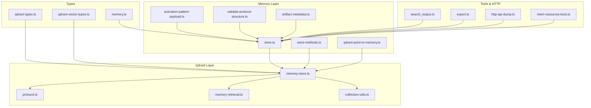
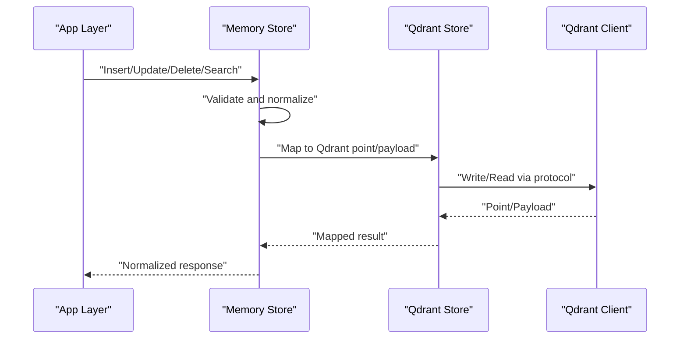
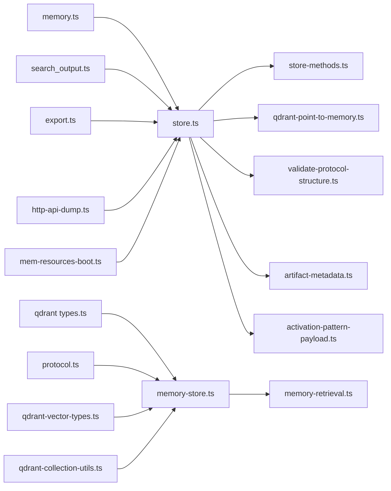

# Data Models and Schemas

<cite>
**Referenced Files in This Document**
- [src/types/memory.ts](file://src/types/memory.ts)
- [src/services/memory/store.ts](file://src/services/memory/store.ts)
- [src/services/memory/store-methods.ts](file://src/services/memory/store-methods.ts)
- [src/services/memory/qdrant-point-to-memory.ts](file://src/services/memory/qdrant-point-to-memory.ts)
- [src/services/memory/activation-pattern-payload.ts](file://src/services/memory/activation-pattern-payload.ts)
- [src/services/memory/validate-protocol-structure.ts](file://src/services/memory/validate-protocol-structure.ts)
- [src/services/memory/artifact-metadata.ts](file://src/services/memory/artifact-metadata.ts)
- [src/services/qdrant/types.ts](file://src/services/qdrant/types.ts)
- [src/services/qdrant/protocol.ts](file://src/services/qdrant/protocol.ts)
- [src/services/qdrant/memory-store.ts](file://src/services/qdrant/memory-store.ts)
- [src/services/qdrant/memory-retrieval.ts](file://src/services/qdrant/memory-retrieval.ts)
- [src/utils/qdrant-vector-types.ts](file://src/utils/qdrant-vector-types.ts)
- [src/utils/qdrant-collection-utils.ts](file://src/utils/qdrant-collection-utils.ts)
- [src/tools/search_output.ts](file://src/tools/search_output.ts)
- [src/tools/export.ts](file://src/tools/export.ts)
- [src/http/http-api-dump.ts](file://src/http/http-api-dump.ts)
- [src/resources/mem-resources-boot.ts](file://src/resources/mem-resources-boot.ts)
</cite>

## Table of Contents
1. [Introduction](#introduction)
2. [Project Structure](#project-structure)
3. [Core Components](#core-components)
4. [Architecture Overview](#architecture-overview)
5. [Detailed Component Analysis](#detailed-component-analysis)
6. [Dependency Analysis](#dependency-analysis)
7. [Performance Considerations](#performance-considerations)
8. [Troubleshooting Guide](#troubleshooting-guide)
9. [Conclusion](#conclusion)
10. [Appendices](#appendices)

## Introduction
This document describes the memory system data models, schemas, and their persistence mappings to Qdrant. It covers memory entry structure, metadata fields, validation rules, artifact references, protocol structures, activation patterns, Qdrant point mappings, vector field definitions, payload schemas, transformations, integrity checks, consistency guarantees, migration procedures, privacy/security considerations, and access control patterns. The goal is to provide a comprehensive reference for both developers and operators working with the memory subsystem.

## Project Structure
The memory system spans several layers:
- Type definitions and shared contracts
- Memory store abstractions and adapters
- Qdrant storage layer (types, protocol, retrieval, updates)
- Utilities for vectors, collections, and schema evolution
- Tools and HTTP endpoints that serialize/deserialize memory payloads

**Diagram sources**
- [src/types/memory.ts](file://src/types/memory.ts)
- [src/services/memory/store.ts](file://src/services/memory/store.ts)
- [src/services/memory/store-methods.ts](file://src/services/memory/store-methods.ts)
- [src/services/memory/qdrant-point-to-memory.ts](file://src/services/memory/qdrant-point-to-memory.ts)
- [src/services/memory/activation-pattern-payload.ts](file://src/services/memory/activation-pattern-payload.ts)
- [src/services/memory/validate-protocol-structure.ts](file://src/services/memory/validate-protocol-structure.ts)
- [src/services/memory/artifact-metadata.ts](file://src/services/memory/artifact-metadata.ts)
- [src/services/qdrant/types.ts](file://src/services/qdrant/types.ts)
- [src/services/qdrant/protocol.ts](file://src/services/qdrant/protocol.ts)
- [src/services/qdrant/memory-store.ts](file://src/services/qdrant/memory-store.ts)
- [src/services/qdrant/memory-retrieval.ts](file://src/services/qdrant/memory-retrieval.ts)
- [src/utils/qdrant-collection-utils.ts](file://src/utils/qdrant-collection-utils.ts)
- [src/utils/qdrant-vector-types.ts](file://src/utils/qdrant-vector-types.ts)
- [src/tools/search_output.ts](file://src/tools/search_output.ts)
- [src/tools/export.ts](file://src/tools/export.ts)
- [src/http/http-api-dump.ts](file://src/http/http-api-dump.ts)
- [src/resources/mem-resources-boot.ts](file://src/resources/mem-resources-boot.ts)

**Section sources**
- [src/types/memory.ts](file://src/types/memory.ts)
- [src/services/memory/store.ts](file://src/services/memory/store.ts)
- [src/services/qdrant/types.ts](file://src/services/qdrant/types.ts)
- [src/utils/qdrant-vector-types.ts](file://src/utils/qdrant-vector-types.ts)

## Core Components
- Memory entry model: Central type(s) defining the shape of a memory record, including identifiers, content, metadata, artifacts, and provenance.
- Store interface and methods: Abstraction over persistence operations (create, update, delete, search, export).
- Qdrant mapping: Conversion between in-memory records and Qdrant points, including vector fields and payload schemas.
- Validation: Protocol structure validation and artifact metadata normalization.
- Activation pattern payload: Schema for activation-related data used by workflows.
- Search output shaping: Normalization of search results for tools and UI.

Key responsibilities:
- Enforce schema constraints at ingestion time
- Normalize and validate artifact references
- Map to/from Qdrant points consistently
- Provide stable serialization for exports and dumps

**Section sources**
- [src/services/memory/store.ts](file://src/services/memory/store.ts)
- [src/services/memory/store-methods.ts](file://src/services/memory/store-methods.ts)
- [src/services/memory/qdrant-point-to-memory.ts](file://src/services/memory/qdrant-point-to-memory.ts)
- [src/services/memory/validate-protocol-structure.ts](file://src/services/memory/validate-protocol-structure.ts)
- [src/services/memory/artifact-metadata.ts](file://src/services/memory/artifact-metadata.ts)
- [src/services/memory/activation-pattern-payload.ts](file://src/services/memory/activation-pattern-payload.ts)
- [src/tools/search_output.ts](file://src/tools/search_output.ts)

## Architecture Overview
The memory system follows a layered architecture:
- Application layer (tools, HTTP endpoints) uses the memory store abstraction
- Memory layer validates and transforms data, then delegates to Qdrant
- Qdrant layer persists points with typed payloads and vectors
- Utilities manage vector dimensions, collection setup, and query utilities

**Diagram sources**
- [src/services/memory/store.ts](file://src/services/memory/store.ts)
- [src/services/qdrant/memory-store.ts](file://src/services/qdrant/memory-store.ts)
- [src/services/qdrant/protocol.ts](file://src/services/qdrant/protocol.ts)

## Detailed Component Analysis

### Memory Entry Model and Metadata
- Purpose: Define the canonical shape of a memory entry, including identifiers, content, timestamps, provenance, and artifact references.
- Key aspects:
  - Stable identifiers for uniqueness and referential integrity
  - Content fields for text or structured payloads
  - Metadata fields for indexing and filtering (e.g., space, tags, quality scores)
  - Artifact references linking to external or internal resources
  - Provenance and audit fields for traceability

Validation and normalization:
- Protocol structure validation ensures required fields and constraints are met before persistence
- Artifact metadata normalization standardizes URIs, MIME types, and sizes

Examples of transformation:
- Ingestion pipeline normalizes artifact references and enriches metadata
- Export pipeline serializes entries into stable formats

**Section sources**
- [src/types/memory.ts](file://src/types/memory.ts)
- [src/services/memory/validate-protocol-structure.ts](file://src/services/memory/validate-protocol-structure.ts)
- [src/services/memory/artifact-metadata.ts](file://src/services/memory/artifact-metadata.ts)

### Qdrant Point Mappings and Payload Schemas
- Mapping strategy:
  - Each memory entry maps to a Qdrant point with a unique ID
  - Vector fields capture embeddings for similarity search
  - Payload fields store searchable metadata and application-specific attributes
- Payload schema:
  - Typed fields aligned with memory entry metadata
  - Indexing configuration for efficient filtering and sorting
- Vector field definitions:
  - Dimensionality defined centrally and enforced during writes
  - Consistency checks ensure payload/vector alignment

Data flow:
- Write path: Memory entry -> normalized payload -> Qdrant point
- Read path: Qdrant point -> mapped memory entry -> normalized response

**Section sources**
- [src/services/qdrant/types.ts](file://src/services/qdrant/types.ts)
- [src/services/qdrant/protocol.ts](file://src/services/qdrant/protocol.ts)
- [src/services/qdrant/memory-store.ts](file://src/services/qdrant/memory-store.ts)
- [src/utils/qdrant-vector-types.ts](file://src/utils/qdrant-vector-types.ts)
- [src/utils/qdrant-collection-utils.ts](file://src/utils/qdrant-collection-utils.ts)

### Activation Patterns and Protocol Structures
- Activation pattern payload defines the input/output contract for activation workflows
- Protocol structure validation enforces required fields, types, and constraints
- Activation patterns may include:
  - Contextual inputs
  - Tool calls or resource references
  - Output envelopes for downstream consumers

Transformation examples:
- Input normalization prior to activation
- Output envelope construction for consistent consumption

**Section sources**
- [src/services/memory/activation-pattern-payload.ts](file://src/services/memory/activation-pattern-payload.ts)
- [src/services/memory/validate-protocol-structure.ts](file://src/services/memory/validate-protocol-structure.ts)

### Search Output Shaping
- Search results are normalized into a consistent shape for tools and UI
- Includes relevance scores, filtered metadata, and optional highlights
- Ensures parity across CLI, HTTP API, and MCP interfaces

**Section sources**
- [src/tools/search_output.ts](file://src/tools/search_output.ts)

### Export and Dump Serialization
- Export tool serializes memory entries and related artifacts into portable bundles
- Dump endpoint provides on-demand serialization for diagnostics and backups
- Both rely on stable schemas to ensure forward/backward compatibility

**Section sources**
- [src/tools/export.ts](file://src/tools/export.ts)
- [src/http/http-api-dump.ts](file://src/http/http-api-dump.ts)

### Resource Bootstrapping and Defaults
- Memory resources bootstrapping initializes default configurations and baseline data
- Ensures consistent state across deployments and environments

**Section sources**
- [src/resources/mem-resources-boot.ts](file://src/resources/mem-resources-boot.ts)

## Dependency Analysis
The following diagram shows key dependencies among components involved in data modeling and persistence.

**Diagram sources**
- [src/types/memory.ts](file://src/types/memory.ts)
- [src/services/memory/store.ts](file://src/services/memory/store.ts)
- [src/services/memory/store-methods.ts](file://src/services/memory/store-methods.ts)
- [src/services/memory/qdrant-point-to-memory.ts](file://src/services/memory/qdrant-point-to-memory.ts)
- [src/services/memory/validate-protocol-structure.ts](file://src/services/memory/validate-protocol-structure.ts)
- [src/services/memory/artifact-metadata.ts](file://src/services/memory/artifact-metadata.ts)
- [src/services/memory/activation-pattern-payload.ts](file://src/services/memory/activation-pattern-payload.ts)
- [src/services/qdrant/types.ts](file://src/services/qdrant/types.ts)
- [src/services/qdrant/protocol.ts](file://src/services/qdrant/protocol.ts)
- [src/services/qdrant/memory-store.ts](file://src/services/qdrant/memory-store.ts)
- [src/services/qdrant/memory-retrieval.ts](file://src/services/qdrant/memory-retrieval.ts)
- [src/utils/qdrant-vector-types.ts](file://src/utils/qdrant-vector-types.ts)
- [src/utils/qdrant-collection-utils.ts](file://src/utils/qdrant-collection-utils.ts)
- [src/tools/search_output.ts](file://src/tools/search_output.ts)
- [src/tools/export.ts](file://src/tools/export.ts)
- [src/http/http-api-dump.ts](file://src/http/http-api-dump.ts)
- [src/resources/mem-resources-boot.ts](file://src/resources/mem-resources-boot.ts)

**Section sources**
- [src/services/memory/store.ts](file://src/services/memory/store.ts)
- [src/services/qdrant/memory-store.ts](file://src/services/qdrant/memory-store.ts)

## Performance Considerations
- Vector dimensionality should be fixed per collection to avoid runtime overhead
- Payload fields used in filters should be indexed appropriately
- Batch writes reduce network round-trips and improve throughput
- Avoid large payloads; prefer referencing artifacts externally when possible
- Cache frequently accessed metadata where appropriate

[No sources needed since this section provides general guidance]

## Troubleshooting Guide
Common issues and resolutions:
- Schema mismatch errors: Ensure all writers and readers use the same versioned schema
- Vector dimension mismatches: Verify vector type definitions match collection configuration
- Missing metadata fields: Validate inputs against protocol structure validators
- Artifact reference errors: Normalize URIs and verify MIME types
- Export/dump inconsistencies: Confirm serialization paths and stable IDs

Operational checks:
- Inspect Qdrant collection schema and payload indexes
- Review validation logs around ingestion
- Compare exported bundles with source entries for parity

**Section sources**
- [src/services/memory/validate-protocol-structure.ts](file://src/services/memory/validate-protocol-structure.ts)
- [src/services/memory/artifact-metadata.ts](file://src/services/memory/artifact-metadata.ts)
- [src/tools/export.ts](file://src/tools/export.ts)
- [src/http/http-api-dump.ts](file://src/http/http-api-dump.ts)

## Conclusion
The memory system’s data models and schemas are designed for clarity, validation, and reliable persistence in Qdrant. By enforcing strict protocols, normalizing artifacts, and maintaining stable mappings, the system supports robust search, export, and workflow integration. Operators should monitor schema versions, payload indexes, and vector configurations to maintain performance and correctness.

[No sources needed since this section summarizes without analyzing specific files]

## Appendices

### Data Integrity Checks and Consistency Guarantees
- Primary keys and stable IDs prevent duplicates and enable idempotent updates
- Validation at ingestion prevents malformed entries from entering storage
- Payload/vector alignment checks ensure read/write consistency
- Export/dump processes produce deterministic outputs for verification

**Section sources**
- [src/services/memory/store-methods.ts](file://src/services/memory/store-methods.ts)
- [src/services/qdrant/memory-store.ts](file://src/services/qdrant/memory-store.ts)

### Migration Procedures and Schema Evolution
- Versioned schemas allow gradual rollout of changes
- Backfill jobs can repair or augment existing payloads
- Collection reindexing strategies minimize downtime
- Compatibility matrices guide upgrades across clients and services

**Section sources**
- [src/utils/qdrant-collection-utils.ts](file://src/utils/qdrant-collection-utils.ts)
- [src/services/qdrant/protocol.ts](file://src/services/qdrant/protocol.ts)

### Privacy, Security, and Access Control
- Sensitive fields should be excluded from payloads or encrypted at rest
- Access control policies restrict write/read operations by tenant or role
- Audit logging captures mutations for compliance
- Secure transport and authentication are enforced at HTTP and MCP boundaries

**Section sources**
- [src/http/http-api-dump.ts](file://src/http/http-api-dump.ts)
- [src/tools/export.ts](file://src/tools/export.ts)