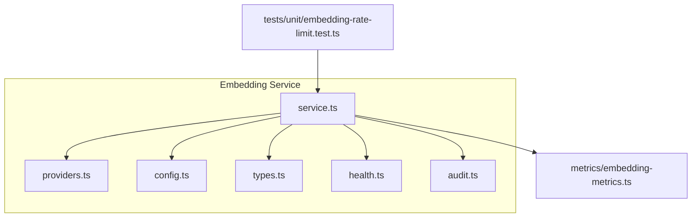
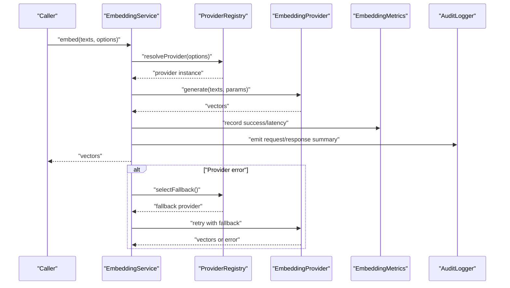
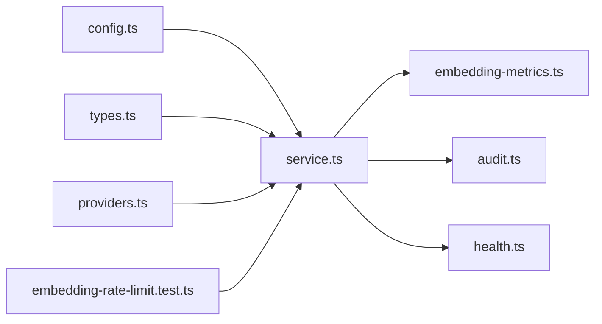

# Embedding Providers

<cite>
**Referenced Files in This Document**
- [src/services/embedding/service.ts](file://src/services/embedding/service.ts)
- [src/services/embedding/providers.ts](file://src/services/embedding/providers.ts)
- [src/services/embedding/config.ts](file://src/services/embedding/config.ts)
- [src/services/embedding/types.ts](file://src/services/embedding/types.ts)
- [src/services/embedding/health.ts](file://src/services/embedding/health.ts)
- [src/services/embedding/audit.ts](file://src/services/embedding/audit.ts)
- [src/services/metrics/embedding-metrics.ts](file://src/services/metrics/embedding-metrics.ts)
- [tests/unit/embedding-rate-limit.test.ts](file://tests/unit/embedding-rate-limit.test.ts)
</cite>

## Table of Contents
1. [Introduction](#introduction)
2. [Project Structure](#project-structure)
3. [Core Components](#core-components)
4. [Architecture Overview](#architecture-overview)
5. [Detailed Component Analysis](#detailed-component-analysis)
6. [Dependency Analysis](#dependency-analysis)
7. [Performance Considerations](#performance-considerations)
8. [Troubleshooting Guide](#troubleshooting-guide)
9. [Conclusion](#conclusion)

## Introduction
This document explains the embedding provider system used to generate vector embeddings for memory and search features. It covers supported providers, configuration options, authentication methods, rate limiting policies, selection strategies, fallback mechanisms, load balancing approaches, the provider interface contract, custom provider implementation patterns, registration process, health checks, error handling, and performance monitoring.

## Project Structure
The embedding subsystem is implemented under services/embedding and integrates with metrics and tests:
- service.ts: Orchestrates provider selection, batching, retries, and metrics.
- providers.ts: Registry and factory for embedding providers.
- config.ts: Configuration parsing and validation for providers.
- types.ts: Shared types and contracts for providers.
- health.ts: Health check logic for providers.
- audit.ts: Audit logging for embedding operations.
- metrics/embedding-metrics.ts: Metrics collection for embedding operations.
- tests/unit/embedding-rate-limit.test.ts: Unit tests for rate limiting behavior.

**Diagram sources**
- [src/services/embedding/service.ts](file://src/services/embedding/service.ts)
- [src/services/embedding/providers.ts](file://src/services/embedding/providers.ts)
- [src/services/embedding/config.ts](file://src/services/embedding/config.ts)
- [src/services/embedding/types.ts](file://src/services/embedding/types.ts)
- [src/services/embedding/health.ts](file://src/services/embedding/health.ts)
- [src/services/embedding/audit.ts](file://src/services/embedding/audit.ts)
- [src/services/metrics/embedding-metrics.ts](file://src/services/metrics/embedding-metrics.ts)
- [tests/unit/embedding-rate-limit.test.ts](file://tests/unit/embedding-rate-limit.test.ts)

**Section sources**
- [src/services/embedding/service.ts](file://src/services/embedding/service.ts)
- [src/services/embedding/providers.ts](file://src/services/embedding/providers.ts)
- [src/services/embedding/config.ts](file://src/services/embedding/config.ts)
- [src/services/embedding/types.ts](file://src/services/embedding/types.ts)
- [src/services/embedding/health.ts](file://src/services/embedding/health.ts)
- [src/services/embedding/audit.ts](file://src/services/embedding/audit.ts)
- [src/services/metrics/embedding-metrics.ts](file://src/services/metrics/embedding-metrics.ts)
- [tests/unit/embedding-rate-limit.test.ts](file://tests/unit/embedding-rate-limit.test.ts)

## Core Components
- Provider Interface Contract: Defines the required methods and data shapes that all embedding providers must implement. See types.ts for the canonical interface and shared types.
- Provider Registry and Factory: Centralizes provider discovery, instantiation, and lifecycle management. See providers.ts for registration APIs and factory functions.
- Configuration Parser and Validator: Loads environment variables and configuration objects, validates provider-specific settings, and exposes typed configuration. See config.ts for schema and defaults.
- Orchestration Service: Coordinates batching, retry/backoff, selection strategy, fallbacks, and metrics emission. See service.ts for orchestration logic.
- Health Checks: Exposes readiness/liveness probes per provider and aggregates overall embedding health. See health.ts for health endpoints and aggregation.
- Audit Logging: Emits structured audit events for embedding requests and responses. See audit.ts for event schemas and emission points.
- Metrics: Collects latency, throughput, errors, and rate limit counters. See embedding-metrics.ts for metric definitions and recording calls.

Key responsibilities:
- Normalize inputs across providers.
- Enforce rate limits and quotas.
- Select providers based on policy (e.g., round-robin, weighted, or explicit).
- Fallback to secondary providers on failure.
- Record metrics and audit logs consistently.

**Section sources**
- [src/services/embedding/types.ts](file://src/services/embedding/types.ts)
- [src/services/embedding/providers.ts](file://src/services/embedding/providers.ts)
- [src/services/embedding/config.ts](file://src/services/embedding/config.ts)
- [src/services/embedding/service.ts](file://src/services/embedding/service.ts)
- [src/services/embedding/health.ts](file://src/services/embedding/health.ts)
- [src/services/embedding/audit.ts](file://src/services/embedding/audit.ts)
- [src/services/metrics/embedding-metrics.ts](file://src/services/metrics/embedding-metrics.ts)

## Architecture Overview
The embedding system abstracts multiple external embedding services behind a unified interface. The orchestration layer handles provider selection, batching, retries, and observability.

**Diagram sources**
- [src/services/embedding/service.ts](file://src/services/embedding/service.ts)
- [src/services/embedding/providers.ts](file://src/services/embedding/providers.ts)
- [src/services/metrics/embedding-metrics.ts](file://src/services/metrics/embedding-metrics.ts)
- [src/services/embedding/audit.ts](file://src/services/embedding/audit.ts)

## Detailed Component Analysis

### Provider Interface Contract
The provider interface defines the minimal contract for embedding implementations:
- Methods:
  - Generate embeddings for one or more texts.
  - Optional health check method to validate connectivity and credentials.
- Parameters:
  - Text input(s), model identifier, dimension constraints, and provider-specific parameters.
- Outputs:
  - Vector arrays with consistent shape and metadata (model, dimensions, usage).
- Error Semantics:
  - Distinguish transient vs permanent errors to guide retries and fallbacks.

Implementation guidance:
- Validate inputs early and return structured errors.
- Respect rate limits and backoff signals from upstream providers.
- Emit telemetry via the shared metrics module.

**Section sources**
- [src/services/embedding/types.ts](file://src/services/embedding/types.ts)

### Provider Registry and Factory
Responsibilities:
- Register built-in and custom providers by name.
- Instantiate providers using configuration.
- Provide selection helpers (e.g., pick by name, round-robin, weighted).
- Maintain provider capabilities and version compatibility.

Registration process:
- Use the registry API to register a provider class or factory function.
- Provide a unique name and capability metadata.
- Ensure the provider implements the interface contract.

Selection strategies:
- Explicit selection by name from options.
- Round-robin across available providers.
- Weighted selection based on capacity or cost.
- Capability-based routing (e.g., multilingual support).

Fallback mechanisms:
- On transient errors, retry with exponential backoff.
- If retries exhausted, select a fallback provider from the configured list.
- Track failures and update weights dynamically if enabled.

**Section sources**
- [src/services/embedding/providers.ts](file://src/services/embedding/providers.ts)

### Configuration and Authentication
Configuration includes:
- Global embedding settings (batch size, timeouts, retries).
- Per-provider configuration blocks (endpoint URLs, models, dimensions).
- Authentication schemes:
  - API keys via headers or query parameters.
  - OAuth client credentials flow.
  - Token refresh and rotation.
- Rate limiting:
  - Global and per-provider limits (requests per minute, tokens per minute).
  - Backoff policies and circuit breaker thresholds.

Validation:
- Schema validation ensures required fields are present.
- Defaults applied for optional fields.
- Secrets loaded securely from environment or secret managers.

Examples of configuration scenarios:
- Single provider with API key.
- Multi-provider setup with explicit fallback order.
- Rate-limited provider with burst allowance.

**Section sources**
- [src/services/embedding/config.ts](file://src/services/embedding/config.ts)

### Orchestration Service
Responsibilities:
- Normalize inputs and batch requests according to provider limits.
- Apply selection strategy and fallback logic.
- Enforce rate limits and concurrency controls.
- Record metrics and emit audit logs.
- Handle retries with backoff and jitter.

Processing flow:
- Parse and validate options.
- Resolve provider(s) and compute batch sizes.
- Execute requests with concurrency control.
- Aggregate results and apply post-processing.
- Emit metrics and audit events.

Error handling:
- Classify errors into retriable and non-retriable.
- Propagate user-facing errors with actionable messages.
- Update health status and metrics accordingly.

**Section sources**
- [src/services/embedding/service.ts](file://src/services/embedding/service.ts)

### Health Checks
Health checks:
- Per-provider liveness probe verifies connectivity and auth.
- Readiness probe confirms provider can accept traffic.
- Aggregated health endpoint returns overall embedding service status.

Behavior:
- Cache health results with TTL to avoid excessive probing.
- Mark providers unhealthy after consecutive failures.
- Exclude unhealthy providers from selection until recovered.

**Section sources**
- [src/services/embedding/health.ts](file://src/services/embedding/health.ts)

### Audit Logging
Audit events include:
- Request start/end timestamps.
- Provider name and model.
- Input length and output dimensions.
- Latency and status codes.
- Error summaries without sensitive payloads.

Usage:
- Integrate with centralized logging systems.
- Support compliance and debugging needs.

**Section sources**
- [src/services/embedding/audit.ts](file://src/services/embedding/audit.ts)

### Metrics Collection
Metrics tracked:
- Request count, success/failure rates.
- Latency percentiles (p50, p95, p99).
- Throughput (requests/sec, tokens/sec).
- Rate limit violations and backoffs.
- Provider selection distribution.

Integration:
- Export to Prometheus-compatible endpoints.
- Tagged by provider, model, and space context.

**Section sources**
- [src/services/metrics/embedding-metrics.ts](file://src/services/metrics/embedding-metrics.ts)

### Rate Limiting Policies
Policies:
- Global limits across all providers.
- Per-provider limits with separate buckets.
- Burst allowances with token bucket or leaky bucket algorithms.
- Adaptive throttling based on upstream responses.

Testing:
- Unit tests verify enforcement and recovery behavior.

**Section sources**
- [tests/unit/embedding-rate-limit.test.ts](file://tests/unit/embedding-rate-limit.test.ts)

### Custom Provider Implementation Patterns
Steps to implement a custom provider:
- Implement the provider interface contract.
- Register the provider with the registry using a unique name.
- Provide configuration schema and default values.
- Implement health checks and metrics recording.
- Add unit tests for normal and error paths.

Best practices:
- Avoid blocking operations; use async I/O.
- Respect timeouts and cancellation.
- Log only safe information for audit.

**Section sources**
- [src/services/embedding/types.ts](file://src/services/embedding/types.ts)
- [src/services/embedding/providers.ts](file://src/services/embedding/providers.ts)
- [src/services/embedding/config.ts](file://src/services/embedding/config.ts)

## Dependency Analysis
The embedding service depends on configuration, registry, metrics, and audit modules. Tests validate rate limiting behavior.

**Diagram sources**
- [src/services/embedding/service.ts](file://src/services/embedding/service.ts)
- [src/services/embedding/config.ts](file://src/services/embedding/config.ts)
- [src/services/embedding/types.ts](file://src/services/embedding/types.ts)
- [src/services/embedding/providers.ts](file://src/services/embedding/providers.ts)
- [src/services/metrics/embedding-metrics.ts](file://src/services/metrics/embedding-metrics.ts)
- [src/services/embedding/audit.ts](file://src/services/embedding/audit.ts)
- [src/services/embedding/health.ts](file://src/services/embedding/health.ts)
- [tests/unit/embedding-rate-limit.test.ts](file://tests/unit/embedding-rate-limit.test.ts)

**Section sources**
- [src/services/embedding/service.ts](file://src/services/embedding/service.ts)
- [src/services/embedding/config.ts](file://src/services/embedding/config.ts)
- [src/services/embedding/types.ts](file://src/services/embedding/types.ts)
- [src/services/embedding/providers.ts](file://src/services/embedding/providers.ts)
- [src/services/metrics/embedding-metrics.ts](file://src/services/metrics/embedding-metrics.ts)
- [src/services/embedding/audit.ts](file://src/services/embedding/audit.ts)
- [src/services/embedding/health.ts](file://src/services/embedding/health.ts)
- [tests/unit/embedding-rate-limit.test.ts](file://tests/unit/embedding-rate-limit.test.ts)

## Performance Considerations
- Batch size tuning: Align with provider limits to maximize throughput while avoiding timeouts.
- Concurrency control: Cap parallel requests to prevent overload and respect upstream quotas.
- Retry/backoff: Use exponential backoff with jitter to reduce thundering herd effects.
- Circuit breaking: Temporarily disable failing providers to protect overall stability.
- Metrics-driven optimization: Monitor latency percentiles and adjust configurations based on observed performance.

[No sources needed since this section provides general guidance]

## Troubleshooting Guide
Common issues and resolutions:
- Authentication failures: Verify API keys or OAuth credentials and ensure they are not expired. Check health endpoint for provider status.
- Rate limit errors: Inspect metrics for rate limit counters and adjust limits or enable adaptive throttling.
- High latency: Review batch size and concurrency settings; consider splitting large batches.
- Fallback not triggered: Confirm fallback provider configuration and health status.

Diagnostic steps:
- Check aggregated health endpoint for provider statuses.
- Review audit logs for request summaries and error details.
- Inspect metrics for spikes in errors or latency.

**Section sources**
- [src/services/embedding/health.ts](file://src/services/embedding/health.ts)
- [src/services/embedding/audit.ts](file://src/services/embedding/audit.ts)
- [src/services/metrics/embedding-metrics.ts](file://src/services/metrics/embedding-metrics.ts)

## Conclusion
The embedding provider system offers a robust, extensible framework for integrating multiple embedding services. With clear contracts, flexible configuration, strong observability, and resilient orchestration, it supports diverse deployment scenarios and operational requirements. Custom providers can be added seamlessly through the registry, and comprehensive metrics and audit logs facilitate monitoring and troubleshooting.