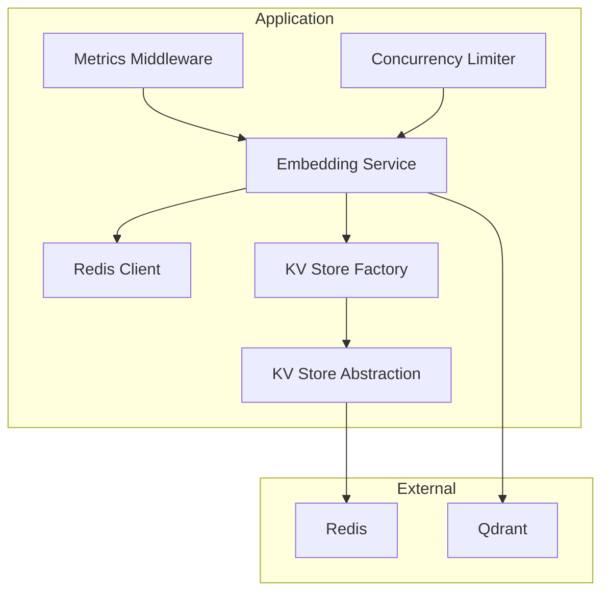
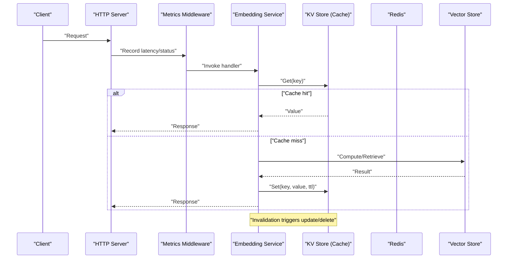
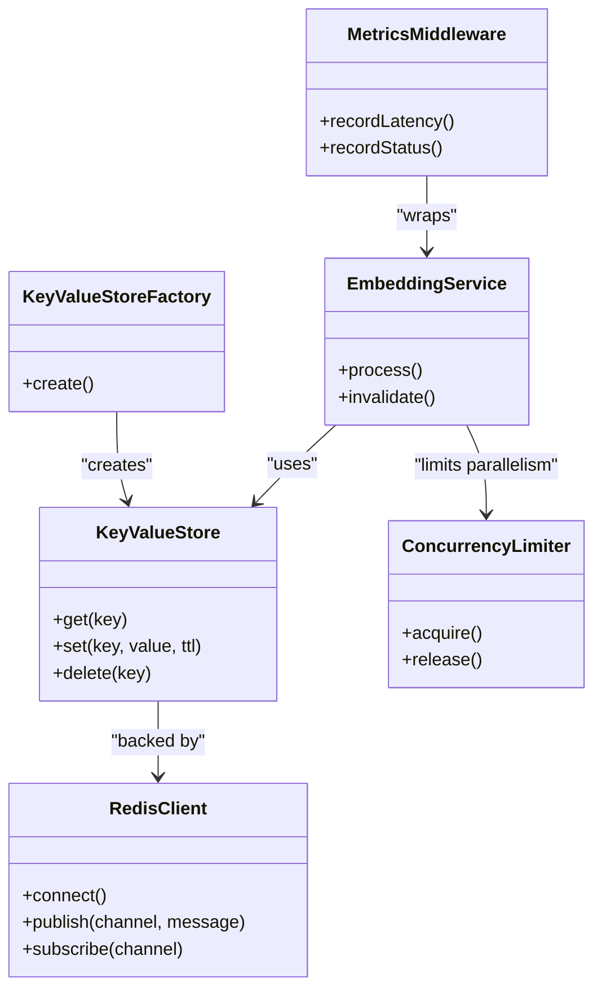

# Performance Optimization and Caching

<cite>
**Referenced Files in This Document**
- [redis.ts](file://src/services/redis.ts)
- [redis-cache.ts](file://src/services/redis-cache.ts)
- [key-value-store-factory.ts](file://src/services/key-value-store-factory.ts)
- [key-value-store.ts](file://src/services/key-value-store.ts)
- [embedding/service.ts](file://src/services/embedding/service.ts)
- [embedding/config.ts](file://src/services/embedding/config.ts)
- [http-metrics-middleware.ts](file://src/http/http-metrics-middleware.ts)
- [metrics-server.ts](file://src/metrics-server.ts)
- [concurrency-limit.ts](file://src/utils/concurrency-limit.ts)
- [tune-cache-invalidation.ts](file://src/tools/tune-cache-invalidation.ts)
- [redis-pubsub-integration.test.ts](file://tests/integration/redis-pubsub-integration.test.ts)
- [redis-activate-cache-invalidation.test.ts](file://tests/integration/redis-activate-cache-invalidation.test.ts)
- [memory-retrieval-artifact-filter.test.ts](file://tests/unit/memory-retrieval-artifact-filter.test.ts)
- [prometheus-scrape.test.ts](file://tests/integration/prometheus-scrape.test.ts)
- [app-hpa.yaml](file://helm/kairos-mcp/templates/app-hpa.yaml)
- [qdrant-hpa.yaml](file://helm/kairos-mcp/templates/qdrant-hpa.yaml)
- [redis-master-service.yaml](file://helm/kairos-mcp/templates/redis-master-service.yaml)
- [values-tls-redis.yaml](file://helm/.dev/values-tls-redis.yaml)
</cite>

## Table of Contents
1. [Introduction](#introduction)
2. [Project Structure](#project-structure)
3. [Core Components](#core-components)
4. [Architecture Overview](#architecture-overview)
5. [Detailed Component Analysis](#detailed-component-analysis)
6. [Dependency Analysis](#dependency-analysis)
7. [Performance Considerations](#performance-considerations)
8. [Troubleshooting Guide](#troubleshooting-guide)
9. [Conclusion](#conclusion)
10. [Appendices](#appendices)

## Introduction
This document provides comprehensive guidance for optimizing the performance of the embedding system, focusing on caching strategies, cache invalidation policies, Redis integration patterns, rate limiting, request batching, concurrent processing, memory management, garbage collection tuning, resource allocation, monitoring, bottleneck identification, scaling considerations, load testing methodologies, capacity planning, and performance regression detection. It synthesizes implementation details from the codebase to help engineers design efficient, resilient, and observable systems.

## Project Structure
The performance-related functionality is implemented across services, HTTP middleware, utilities, Helm charts, and tests:
- Services: Redis client, cache abstraction, key-value store factory, embedding service, metrics
- Utilities: Concurrency limiter
- Tools: Cache invalidation helpers
- HTTP: Metrics middleware
- Infrastructure: Horizontal Pod Autoscalers (HPA), Redis service, TLS values
- Tests: Integration and unit tests validating caching, pub/sub, metrics, and concurrency behavior

**Diagram sources**
- [embedding/service.ts](file://src/services/embedding/service.ts)
- [redis.ts](file://src/services/redis.ts)
- [key-value-store-factory.ts](file://src/services/key-value-store-factory.ts)
- [key-value-store.ts](file://src/services/key-value-store.ts)
- [http-metrics-middleware.ts](file://src/http/http-metrics-middleware.ts)
- [concurrency-limit.ts](file://src/utils/concurrency-limit.ts)

**Section sources**
- [embedding/service.ts](file://src/services/embedding/service.ts)
- [redis.ts](file://src/services/redis.ts)
- [key-value-store-factory.ts](file://src/services/key-value-store-factory.ts)
- [key-value-store.ts](file://src/services/key-value-store.ts)
- [http-metrics-middleware.ts](file://src/http/http-metrics-middleware.ts)
- [concurrency-limit.ts](file://src/utils/concurrency-limit.ts)

## Core Components
- Redis client and connection management: Provides a typed Redis client with configuration and lifecycle handling.
- Cache abstraction: Implements a generic key-value store interface backed by Redis or alternative backends via a factory.
- Embedding service: Orchestrates embedding operations, integrates with caches, and coordinates downstream storage.
- Metrics middleware: Exposes operational metrics for observability and SLO tracking.
- Concurrency limiter: Controls parallelism to protect resources and reduce contention.
- Cache invalidation tooling: Ensures consistency between cache and source-of-truth after mutations.

Key responsibilities:
- High-throughput read paths using cache-first strategies
- Safe write paths with explicit invalidation and optional pub/sub propagation
- Rate limiting and backpressure via concurrency control
- Observability through metrics and health endpoints

**Section sources**
- [redis.ts](file://src/services/redis.ts)
- [redis-cache.ts](file://src/services/redis-cache.ts)
- [key-value-store-factory.ts](file://src/services/key-value-store-factory.ts)
- [key-value-store.ts](file://src/services/key-value-store.ts)
- [embedding/service.ts](file://src/services/embedding/service.ts)
- [http-metrics-middleware.ts](file://src/http/http-metrics-middleware.ts)
- [concurrency-limit.ts](file://src/utils/concurrency-limit.ts)
- [tune-cache-invalidation.ts](file://src/tools/tune-cache-invalidation.ts)

## Architecture Overview
The embedding pipeline leverages a layered architecture:
- Ingress and HTTP layer expose APIs and collect metrics
- Business logic in the embedding service orchestrates reads/writes
- Cache layer abstracts storage backend selection and TTL policies
- Redis acts as shared cache and coordination bus (pub/sub)
- Downstream vector store (e.g., Qdrant) persists embeddings

**Diagram sources**
- [http-metrics-middleware.ts](file://src/http/http-metrics-middleware.ts)
- [embedding/service.ts](file://src/services/embedding/service.ts)
- [key-value-store.ts](file://src/services/key-value-store.ts)
- [redis.ts](file://src/services/redis.ts)

## Detailed Component Analysis

### Redis Client and Connection Management
Responsibilities:
- Initialize and configure Redis connections
- Normalize URLs and handle TLS settings
- Provide a stable client instance across the application

Operational notes:
- Centralized configuration enables consistent connection pooling and timeouts
- TLS support allows secure deployments in production environments

**Section sources**
- [redis.ts](file://src/services/redis.ts)
- [values-tls-redis.yaml](file://helm/.dev/values-tls-redis.yaml)

### Cache Abstraction and Key-Value Store Factory
Responsibilities:
- Define a uniform interface for cache operations (get/set/delete)
- Select backend at runtime via factory (e.g., Redis-backed)
- Encapsulate serialization, TTL, and error handling

Design highlights:
- Decouples business logic from storage specifics
- Enables testing with in-memory backends and switching to Redis in production

**Section sources**
- [key-value-store.ts](file://src/services/key-value-store.ts)
- [key-value-store-factory.ts](file://src/services/key-value-store-factory.ts)
- [redis-cache.ts](file://src/services/redis-cache.ts)

### Embedding Service Integration
Responsibilities:
- Orchestrate embedding computation and retrieval
- Apply cache-first strategy with fallback to vector store
- Coordinate invalidation after updates

Processing flow:
- Check cache for existing result
- If missing, compute or fetch from vector store
- Write result to cache with appropriate TTL
- Return response to caller

**Section sources**
- [embedding/service.ts](file://src/services/embedding/service.ts)
- [key-value-store.ts](file://src/services/key-value-store.ts)

### Cache Invalidation Policies
Strategies:
- Explicit invalidation after writes
- Optional pub/sub-based broadcast for multi-instance consistency
- Time-based expiration via TTL

Implementation touchpoints:
- Tooling for targeted invalidation
- Integration tests verifying pub/sub-driven invalidation

**Section sources**
- [tune-cache-invalidation.ts](file://src/tools/tune-cache-invalidation.ts)
- [redis-pubsub-integration.test.ts](file://tests/integration/redis-pubsub-integration.test.ts)
- [redis-activate-cache-invalidation.test.ts](file://tests/integration/redis-activate-cache-invalidation.test.ts)

### Rate Limiting and Concurrency Control
Techniques:
- Concurrency limiter caps parallel operations to prevent overload
- Protects downstream dependencies (vector store, Redis) from saturation

Usage:
- Wrap expensive operations with concurrency gates
- Tune limits based on resource capacity and SLAs

**Section sources**
- [concurrency-limit.ts](file://src/utils/concurrency-limit.ts)

### Monitoring and Observability
Capabilities:
- HTTP metrics middleware records request latency, status codes, and throughput
- Dedicated metrics server exposes Prometheus-compatible endpoints
- Health checks enable readiness/liveness probes

Best practices:
- Instrument critical paths (cache hits/misses, DB calls)
- Track error rates and p95/p99 latencies
- Alert on SLO breaches

**Section sources**
- [http-metrics-middleware.ts](file://src/http/http-metrics-middleware.ts)
- [metrics-server.ts](file://src/metrics-server.ts)
- [prometheus-scrape.test.ts](file://tests/integration/prometheus-scrape.test.ts)

### Scaling and Resource Allocation
Horizontal scaling:
- Application HPA scales replicas based on CPU/memory or custom metrics
- Vector store HPA ensures search/retrieval capacity under load

Redis deployment:
- Dedicated master service and configuration options (TLS)
- Ensure adequate memory and persistence settings for cache workloads

Capacity planning:
- Size Redis based on working set size and eviction policy
- Right-size pods and autoscaling thresholds using observed metrics

**Section sources**
- [app-hpa.yaml](file://helm/kairos-mcp/templates/app-hpa.yaml)
- [qdrant-hpa.yaml](file://helm/kairos-mcp/templates/qdrant-hpa.yaml)
- [redis-master-service.yaml](file://helm/kairos-mcp/templates/redis-master-service.yaml)
- [values-tls-redis.yaml](file://helm/.dev/values-tls-redis.yaml)

## Dependency Analysis
The following diagram shows core dependencies among performance-critical components:

**Diagram sources**
- [embedding/service.ts](file://src/services/embedding/service.ts)
- [key-value-store.ts](file://src/services/key-value-store.ts)
- [key-value-store-factory.ts](file://src/services/key-value-store-factory.ts)
- [redis.ts](file://src/services/redis.ts)
- [http-metrics-middleware.ts](file://src/http/http-metrics-middleware.ts)
- [concurrency-limit.ts](file://src/utils/concurrency-limit.ts)

**Section sources**
- [embedding/service.ts](file://src/services/embedding/service.ts)
- [key-value-store.ts](file://src/services/key-value-store.ts)
- [key-value-store-factory.ts](file://src/services/key-value-store-factory.ts)
- [redis.ts](file://src/services/redis.ts)
- [http-metrics-middleware.ts](file://src/http/http-metrics-middleware.ts)
- [concurrency-limit.ts](file://src/utils/concurrency-limit.ts)

## Performance Considerations
Caching strategies:
- Cache-first reads with short TTLs for hot keys
- Stale-while-revalidate for non-critical data
- Partition keys by tenant/space to avoid cross-tenant interference

Cache invalidation policies:
- Event-driven invalidation via pub/sub for multi-instance consistency
- Targeted invalidation by key prefix or tag
- Backfill strategies for cold starts

Redis integration patterns:
- Use pipelines and Lua scripts for atomic batch operations
- Employ streams or pub/sub for real-time invalidation
- Configure memory policies (maxmemory, eviction) aligned with workload

Rate limiting and request batching:
- Enforce per-client or global rate limits at ingress or middleware
- Batch embedding computations where feasible to amortize overhead

Concurrent processing techniques:
- Cap concurrency per worker to match downstream capacity
- Use backoff and retry with jitter for transient failures

Memory management and GC tuning:
- Monitor heap usage and GC pauses; adjust Node.js flags if needed
- Avoid large object retention in hot paths; prefer streaming/chunking

Resource allocation strategies:
- Right-size CPU/memory requests/limits
- Enable HPA with meaningful metrics (CPU, memory, queue depth)

[No sources needed since this section provides general guidance]

## Troubleshooting Guide
Common issues and diagnostics:
- Cache misses spikes: Validate TTLs, key generation, and invalidation events
- Redis connectivity errors: Check network policies, TLS config, and credentials
- High latency: Inspect metrics middleware traces and identify slow downstream calls
- OOM conditions: Review heap snapshots and memory-intensive operations
- Pub/sub inconsistencies: Verify channel names and subscriber counts

Relevant tests for validation:
- Redis pub/sub integration and activation cache invalidation
- Memory retrieval artifact filtering correctness
- Prometheus scrape availability and metric exposure

**Section sources**
- [redis-pubsub-integration.test.ts](file://tests/integration/redis-pubsub-integration.test.ts)
- [redis-activate-cache-invalidation.test.ts](file://tests/integration/redis-activate-cache-invalidation.test.ts)
- [memory-retrieval-artifact-filter.test.ts](file://tests/unit/memory-retrieval-artifact-filter.test.ts)
- [prometheus-scrape.test.ts](file://tests/integration/prometheus-scrape.test.ts)

## Conclusion
By combining a robust cache abstraction, explicit invalidation, Redis-backed coordination, concurrency controls, and comprehensive observability, the embedding system achieves high throughput and low latency while remaining scalable and resilient. Continuous monitoring, load testing, and capacity planning ensure sustained performance under varying workloads.

[No sources needed since this section summarizes without analyzing specific files]

## Appendices

### Load Testing Methodologies
- Simulate realistic traffic patterns with varied payload sizes and access distributions
- Measure p95/p99 latency, error rates, and resource utilization
- Validate autoscaling responsiveness and cache effectiveness under burst loads

### Capacity Planning
- Estimate cache working set size and Redis memory requirements
- Plan vector store capacity based on indexing frequency and query volume
- Set HPA thresholds based on observed headroom and SLO targets

### Performance Regression Detection
- Baseline key metrics (latency percentiles, throughput, error rates)
- Integrate regression checks into CI using synthetic workloads
- Alert on deviations beyond acceptable thresholds

[No sources needed since this section provides general guidance]