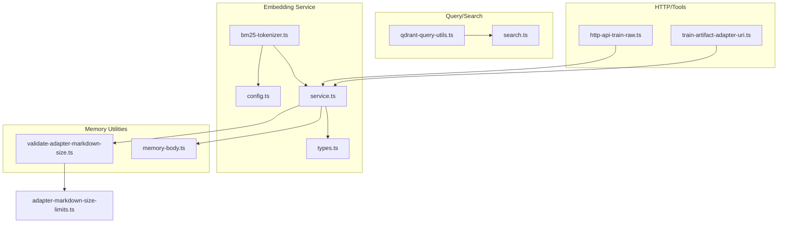
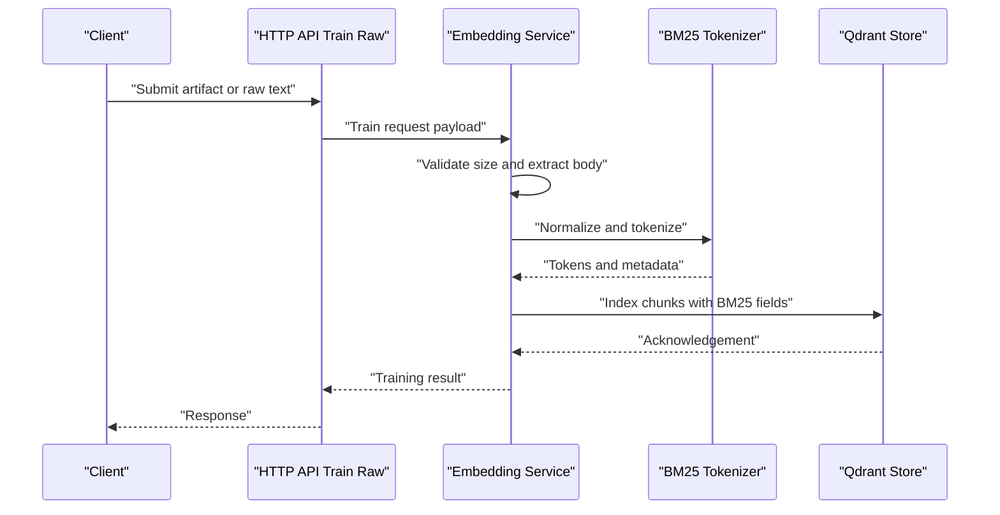
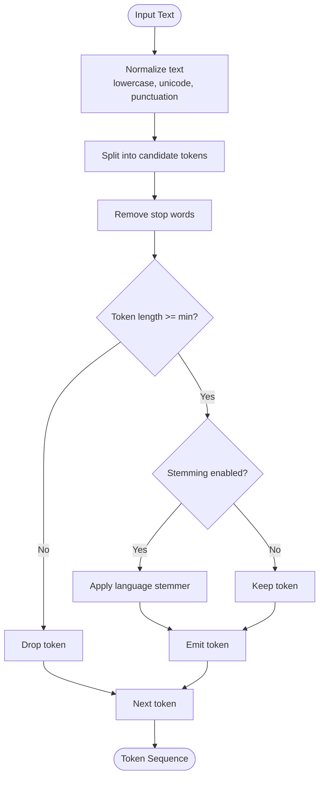
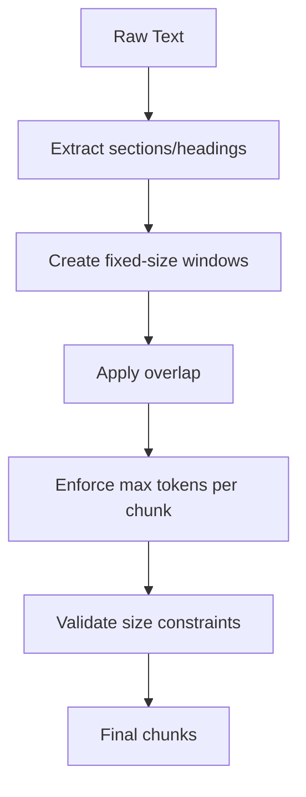
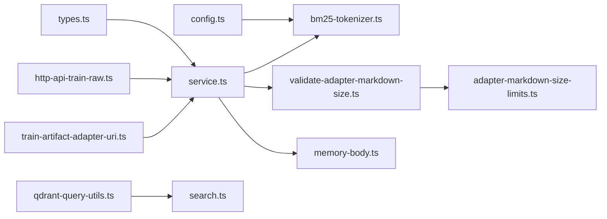
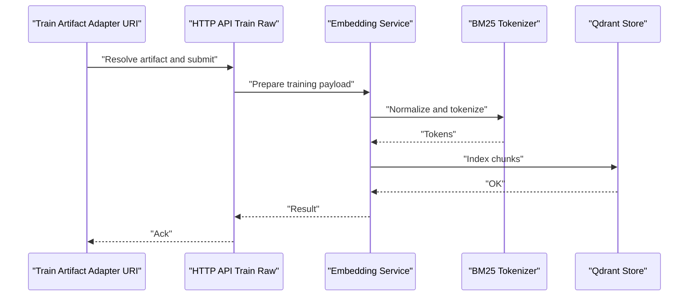

# Text Processing and Tokenization

<cite>
**Referenced Files in This Document**
- [bm25-tokenizer.ts](file://src/services/embedding/bm25-tokenizer.ts)
- [config.ts](file://src/services/embedding/config.ts)
- [service.ts](file://src/services/embedding/service.ts)
- [types.ts](file://src/services/embedding/types.ts)
- [adapter-markdown-size-limits.ts](file://src/config/adapter-markdown-size-limits.ts)
- [validate-adapter-markdown-size.ts](file://src/services/memory/validate-adapter-markdown-size.ts)
- [memory-body.ts](file://src/utils/memory-body.ts)
- [qdrant-query-utils.ts](file://src/utils/qdrant-query-utils.ts)
- [search.ts](file://src/tools/search.ts)
- [http-api-train-raw.ts](file://src/http/http-api-train-raw.ts)
- [train-artifact-adapter-uri.ts](file://src/tools/train-artifact-adapter-uri.ts)
</cite>

## Table of Contents
1. [Introduction](#introduction)
2. [Project Structure](#project-structure)
3. [Core Components](#core-components)
4. [Architecture Overview](#architecture-overview)
5. [Detailed Component Analysis](#detailed-component-analysis)
6. [Dependency Analysis](#dependency-analysis)
7. [Performance Considerations](#performance-considerations)
8. [Troubleshooting Guide](#troubleshooting-guide)
9. [Conclusion](#conclusion)
10. [Appendices](#appendices)

## Introduction
This document explains the text preprocessing and tokenization algorithms used by the system, with a focus on BM25-based tokenization for keyword search. It covers text normalization techniques, language-specific processing rules, chunking strategies, maximum token limits, and text size optimization. It also details stop word removal, stemming approaches, semantic preservation considerations, examples of custom tokenizers and preprocessing pipelines, quality assessment metrics, performance optimization, memory management, and batch processing guidance.

## Project Structure
The text processing and tokenization logic is primarily implemented under the embedding service and related utilities:
- BM25 tokenizer implementation and configuration
- Embedding service orchestration and integration points
- Size validation and chunking helpers
- Query-time utilities that leverage tokenized fields
- HTTP and tool entry points that trigger training and search flows

**Diagram sources**
- [bm25-tokenizer.ts](file://src/services/embedding/bm25-tokenizer.ts)
- [config.ts](file://src/services/embedding/config.ts)
- [service.ts](file://src/services/embedding/service.ts)
- [types.ts](file://src/services/embedding/types.ts)
- [validate-adapter-markdown-size.ts](file://src/services/memory/validate-adapter-markdown-size.ts)
- [memory-body.ts](file://src/utils/memory-body.ts)
- [qdrant-query-utils.ts](file://src/utils/qdrant-query-utils.ts)
- [search.ts](file://src/tools/search.ts)
- [http-api-train-raw.ts](file://src/http/http-api-train-raw.ts)
- [train-artifact-adapter-uri.ts](file://src/tools/train-artifact-adapter-uri.ts)
- [adapter-markdown-size-limits.ts](file://src/config/adapter-markdown-size-limits.ts)

**Section sources**
- [bm25-tokenizer.ts](file://src/services/embedding/bm25-tokenizer.ts)
- [config.ts](file://src/services/embedding/config.ts)
- [service.ts](file://src/services/embedding/service.ts)
- [types.ts](file://src/services/embedding/types.ts)
- [validate-adapter-markdown-size.ts](file://src/services/memory/validate-adapter-markdown-size.ts)
- [memory-body.ts](file://src/utils/memory-body.ts)
- [qdrant-query-utils.ts](file://src/utils/qdrant-query-utils.ts)
- [search.ts](file://src/tools/search.ts)
- [http-api-train-raw.ts](file://src/http/http-api-train-raw.ts)
- [train-artifact-adapter-uri.ts](file://src/tools/train-artifact-adapter-uri.ts)
- [adapter-markdown-size-limits.ts](file://src/config/adapter-markdown-size-limits.ts)

## Core Components
- BM25 Tokenizer: Implements tokenization tailored for BM25 scoring, including normalization, filtering, and optional stemming.
- Embedding Config: Centralizes tokenization settings such as minimum token length, stop words, and language-specific options.
- Embedding Service: Orchestrates preprocessing, tokenization, chunking, and storage/retrieval interactions.
- Types: Defines shared interfaces for tokens, chunks, and pipeline stages.
- Size Validation: Enforces maximum sizes for markdown artifacts to prevent oversized inputs from entering the pipeline.
- Memory Body Helpers: Provide utilities for extracting and preparing textual content for tokenization.
- Query Utilities: Build BM25-compatible queries using tokenized fields.
- Entry Points: HTTP endpoints and tools that initiate training and search workflows.

**Section sources**
- [bm25-tokenizer.ts](file://src/services/embedding/bm25-tokenizer.ts)
- [config.ts](file://src/services/embedding/config.ts)
- [service.ts](file://src/services/embedding/service.ts)
- [types.ts](file://src/services/embedding/types.ts)
- [validate-adapter-markdown-size.ts](file://src/services/memory/validate-adapter-markdown-size.ts)
- [memory-body.ts](file://src/utils/memory-body.ts)
- [qdrant-query-utils.ts](file://src/utils/qdrant-query-utils.ts)
- [search.ts](file://src/tools/search.ts)
- [http-api-train-raw.ts](file://src/http/http-api-train-raw.ts)
- [train-artifact-adapter-uri.ts](file://src/tools/train-artifact-adapter-uri.ts)

## Architecture Overview
The text processing pipeline integrates at training time (indexing) and query time (search). During training, raw text is normalized, chunked, tokenized, and stored with metadata. At query time, user input is normalized and tokenized into a BM25-compatible query structure.

**Diagram sources**
- [http-api-train-raw.ts](file://src/http/http-api-train-raw.ts)
- [service.ts](file://src/services/embedding/service.ts)
- [bm25-tokenizer.ts](file://src/services/embedding/bm25-tokenizer.ts)
- [validate-adapter-markdown-size.ts](file://src/services/memory/validate-adapter-markdown-size.ts)
- [memory-body.ts](file://src/utils/memory-body.ts)

## Detailed Component Analysis

### BM25 Tokenizer Implementation
The BM25 tokenizer provides:
- Normalization: Lowercasing, Unicode normalization, punctuation handling, and whitespace collapsing.
- Filtering: Stop word removal and minimum token length enforcement.
- Stemming: Optional stemmer selection based on language configuration.
- Language Rules: Language-specific adjustments for diacritics, compound words, and character sets.
- Output: Stable token sequences suitable for BM25 scoring and indexing.

**Diagram sources**
- [bm25-tokenizer.ts](file://src/services/embedding/bm25-tokenizer.ts)
- [config.ts](file://src/services/embedding/config.ts)

**Section sources**
- [bm25-tokenizer.ts](file://src/services/embedding/bm25-tokenizer.ts)
- [config.ts](file://src/services/embedding/config.ts)

### Text Normalization Techniques
Normalization ensures consistent token representation across languages and encodings:
- Case folding and Unicode normalization
- Punctuation stripping and symbol handling
- Whitespace collapsing and control character removal
- Diacritic normalization where appropriate
- Language-aware transformations (e.g., ligatures, special characters)

These steps are applied before splitting and filtering to reduce noise and improve recall.

**Section sources**
- [bm25-tokenizer.ts](file://src/services/embedding/bm25-tokenizer.ts)
- [config.ts](file://src/services/embedding/config.ts)

### Language-Specific Processing Rules
Language-specific behavior includes:
- Stop word lists per language
- Stemmer selection and parameters
- Character set handling and transliteration policies
- Compound word segmentation hints for agglutinative languages

Configuration centralizes these rules to keep tokenization deterministic and reproducible.

**Section sources**
- [config.ts](file://src/services/embedding/config.ts)
- [bm25-tokenizer.ts](file://src/services/embedding/bm25-tokenizer.ts)

### Chunking Strategies and Maximum Token Limits
Chunking balances context retention and retrieval efficiency:
- Fixed-size sliding windows with overlap
- Semantic boundaries when available (headings, paragraphs)
- Hard token caps per chunk to constrain index size
- Adaptive chunk sizing based on content density

Maximum token limits are enforced to avoid oversized entries and maintain stable BM25 scores.

**Diagram sources**
- [service.ts](file://src/services/embedding/service.ts)
- [validate-adapter-markdown-size.ts](file://src/services/memory/validate-adapter-markdown-size.ts)
- [adapter-markdown-size-limits.ts](file://src/config/adapter-markdown-size-limits.ts)

**Section sources**
- [service.ts](file://src/services/embedding/service.ts)
- [validate-adapter-markdown-size.ts](file://src/services/memory/validate-adapter-markdown-size.ts)
- [adapter-markdown-size-limits.ts](file://src/config/adapter-markdown-size-limits.ts)

### Stop Word Removal and Stemming Algorithms
- Stop word removal reduces noise and improves precision for short queries.
- Stemming reduces inflected forms to common roots; language-specific stemmers are selected via configuration.
- Trade-offs: aggressive stemming can harm semantic specificity; conservative stemming preserves meaning but may increase vocabulary size.

Quality trade-offs are managed through configurable thresholds and language profiles.

**Section sources**
- [config.ts](file://src/services/embedding/config.ts)
- [bm25-tokenizer.ts](file://src/services/embedding/bm25-tokenizer.ts)

### Semantic Preservation Techniques
To preserve semantics while optimizing for BM25:
- Retain meaningful multi-word phrases via phrase tokens when applicable
- Preserve domain-specific terms and acronyms
- Avoid over-stemming technical jargon
- Use controlled vocabularies and synonym maps where needed

These techniques help maintain relevance without sacrificing speed.

**Section sources**
- [bm25-tokenizer.ts](file://src/services/embedding/bm25-tokenizer.ts)
- [config.ts](file://src/services/embedding/config.ts)

### Custom Tokenizers and Preprocessing Pipelines
Customization points include:
- Pluggable normalizers and filters
- Language-specific rule sets
- Extensible stemmer interface
- Pipeline composition for complex preprocessing needs

Integration occurs via the embedding service configuration and type contracts.

**Section sources**
- [types.ts](file://src/services/embedding/types.ts)
- [service.ts](file://src/services/embedding/service.ts)
- [config.ts](file://src/services/embedding/config.ts)

### Quality Assessment Metrics
Recommended metrics for evaluating tokenization and retrieval quality:
- Precision@K and Recall@K for top-K results
- Mean Reciprocal Rank (MRR)
- Normalized Discounted Cumulative Gain (NDCG)
- Token statistics: average tokens per chunk, vocabulary size, stop word ratio
- Latency and throughput benchmarks for training and search

Use these metrics to tune normalization, chunking, and stemming parameters.

[No sources needed since this section provides general guidance]

## Dependency Analysis
The following diagram shows key dependencies between components involved in text processing and tokenization.

**Diagram sources**
- [config.ts](file://src/services/embedding/config.ts)
- [bm25-tokenizer.ts](file://src/services/embedding/bm25-tokenizer.ts)
- [types.ts](file://src/services/embedding/types.ts)
- [service.ts](file://src/services/embedding/service.ts)
- [validate-adapter-markdown-size.ts](file://src/services/memory/validate-adapter-markdown-size.ts)
- [adapter-markdown-size-limits.ts](file://src/config/adapter-markdown-size-limits.ts)
- [memory-body.ts](file://src/utils/memory-body.ts)
- [qdrant-query-utils.ts](file://src/utils/qdrant-query-utils.ts)
- [search.ts](file://src/tools/search.ts)
- [http-api-train-raw.ts](file://src/http/http-api-train-raw.ts)
- [train-artifact-adapter-uri.ts](file://src/tools/train-artifact-adapter-uri.ts)

**Section sources**
- [config.ts](file://src/services/embedding/config.ts)
- [bm25-tokenizer.ts](file://src/services/embedding/bm25-tokenizer.ts)
- [types.ts](file://src/services/embedding/types.ts)
- [service.ts](file://src/services/embedding/service.ts)
- [validate-adapter-markdown-size.ts](file://src/services/memory/validate-adapter-markdown-size.ts)
- [adapter-markdown-size-limits.ts](file://src/config/adapter-markdown-size-limits.ts)
- [memory-body.ts](file://src/utils/memory-body.ts)
- [qdrant-query-utils.ts](file://src/utils/qdrant-query-utils.ts)
- [search.ts](file://src/tools/search.ts)
- [http-api-train-raw.ts](file://src/http/http-api-train-raw.ts)
- [train-artifact-adapter-uri.ts](file://src/tools/train-artifact-adapter-uri.ts)

## Performance Considerations
- Batch processing: Group artifacts and train requests to amortize overhead and reduce I/O calls.
- Memory management: Stream large documents, reuse buffers, and avoid retaining full-text copies after chunking.
- Index sizing: Enforce token caps and chunk overlap carefully to balance recall and storage.
- Concurrency: Limit parallelism to match CPU and I/O capacity; use backpressure to avoid spikes.
- Caching: Cache normalization and tokenization results for repeated inputs where feasible.
- Query optimization: Preprocess queries identically to training-time text to ensure consistency.

[No sources needed since this section provides general guidance]

## Troubleshooting Guide
Common issues and resolutions:
- Oversized inputs: Ensure size validation is enabled and adjust limits if necessary.
- Empty token streams: Check stop word lists and minimum token length thresholds.
- Inconsistent results: Verify that query-time preprocessing matches training-time preprocessing.
- Slow indexing: Reduce chunk overlap, enforce stricter token caps, and optimize concurrency.
- Language-specific anomalies: Review language profiles and stemmer configurations.

Operational checks:
- Validate adapter markdown size constraints before training.
- Inspect extracted memory bodies to confirm expected content.
- Confirm BM25 query construction aligns with indexed fields.

**Section sources**
- [validate-adapter-markdown-size.ts](file://src/services/memory/validate-adapter-markdown-size.ts)
- [memory-body.ts](file://src/utils/memory-body.ts)
- [qdrant-query-utils.ts](file://src/utils/qdrant-query-utils.ts)

## Conclusion
The BM25 tokenization pipeline emphasizes robust normalization, language-aware processing, and careful chunking to deliver fast and accurate keyword search. By tuning stop words, stemming, and chunk limits—and by measuring quality with standard IR metrics—you can achieve strong performance while preserving semantic fidelity. The modular design allows customization and extension for specialized domains and languages.

[No sources needed since this section summarizes without analyzing specific files]

## Appendices

### Example: Training Flow Integration

**Diagram sources**
- [train-artifact-adapter-uri.ts](file://src/tools/train-artifact-adapter-uri.ts)
- [http-api-train-raw.ts](file://src/http/http-api-train-raw.ts)
- [service.ts](file://src/services/embedding/service.ts)
- [bm25-tokenizer.ts](file://src/services/embedding/bm25-tokenizer.ts)