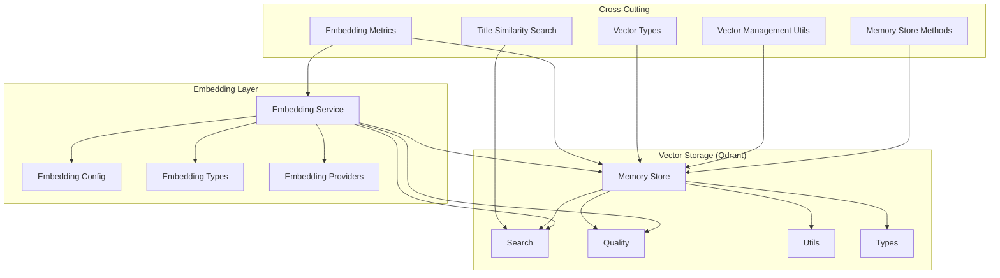
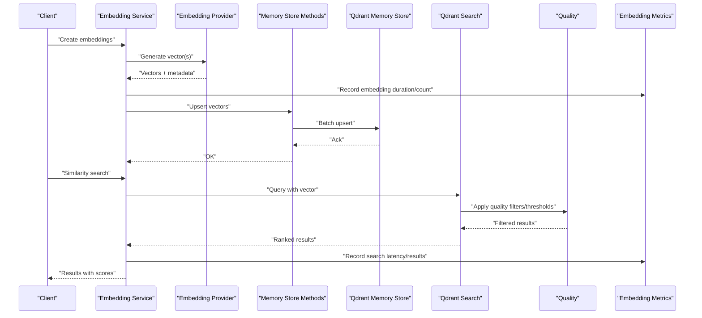
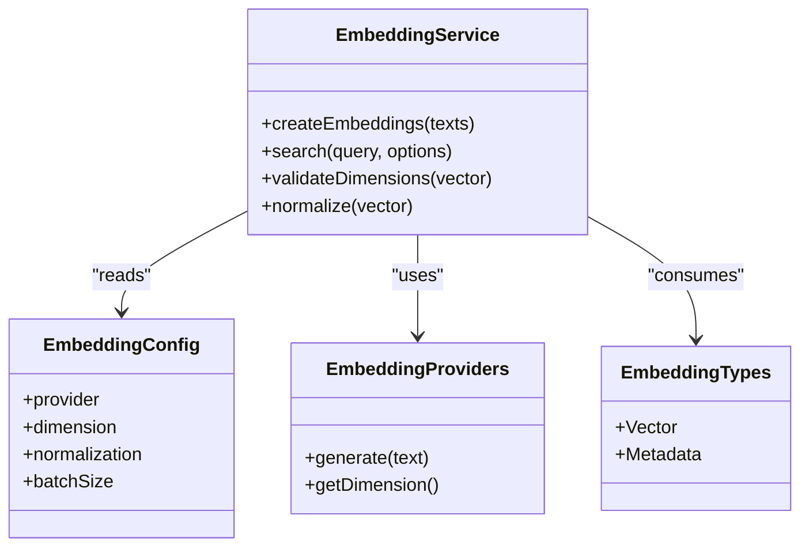
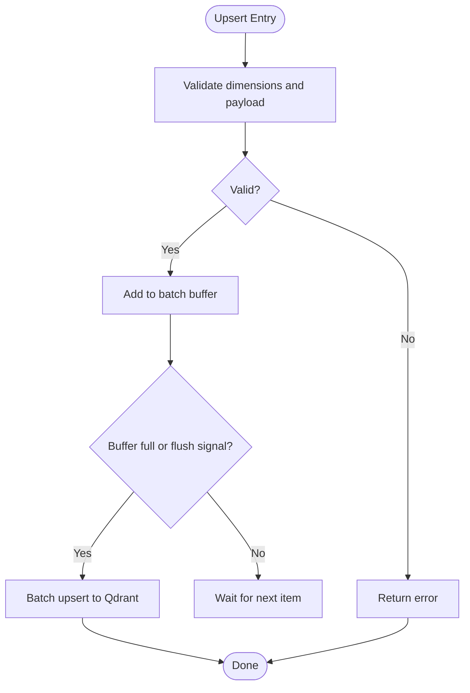
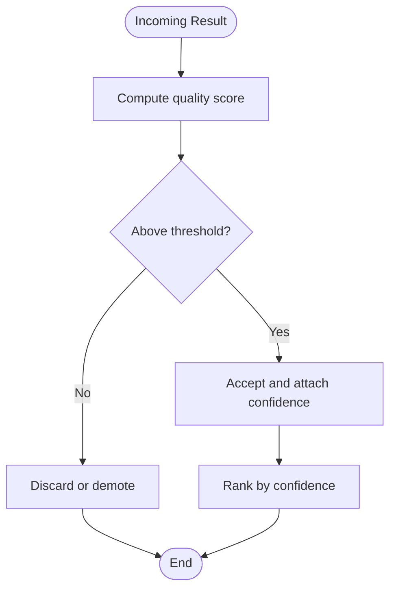
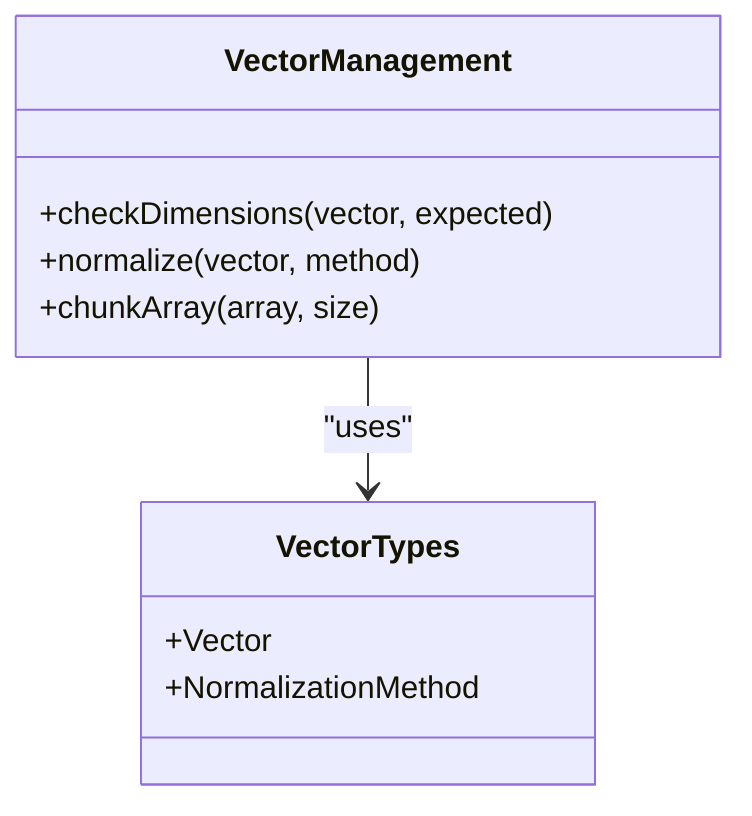
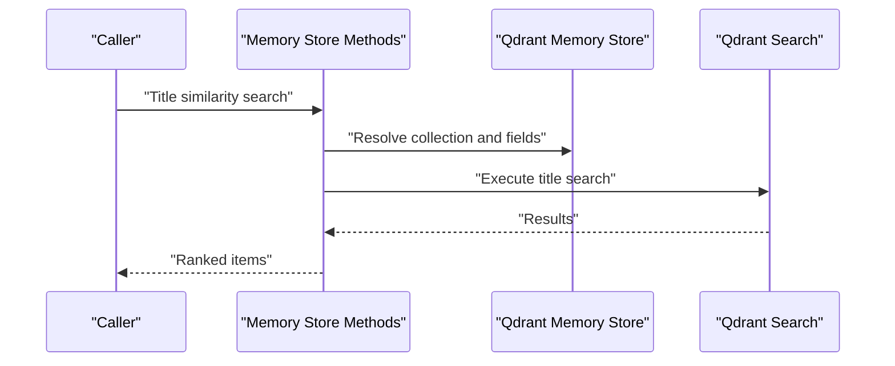
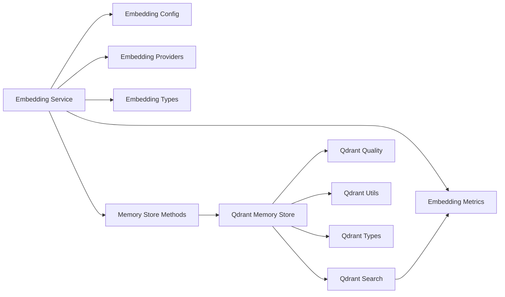

# Vector Operations and Quality Assessment

<cite>
**Referenced Files in This Document**
- [embedding/service.ts](file://src/services/embedding/service.ts)
- [embedding/config.ts](file://src/services/embedding/config.ts)
- [embedding/types.ts](file://src/services/embedding/types.ts)
- [embedding/providers.ts](file://src/services/embedding/providers.ts)
- [qdrant/memory-store.ts](file://src/services/qdrant/memory-store.ts)
- [qdrant/search.ts](file://src/services/qdrant/search.ts)
- [qdrant/quality.ts](file://src/services/qdrant/quality.ts)
- [qdrant/utils.ts](file://src/services/qdrant/utils.ts)
- [qdrant/types.ts](file://src/services/qdrant/types.ts)
- [memory/store-methods.ts](file://src/services/memory/store-methods.ts)
- [memory/store-title-similarity-search.ts](file://src/services/memory/store-title-similarity-search.ts)
- [utils/qdrant-vector-management.ts](file://src/utils/qdrant-vector-management.ts)
- [utils/qdrant-vector-types.ts](file://src/utils/qdrant-vector-types.ts)
- [metrics/embedding-metrics.ts](file://src/services/metrics/embedding-metrics.ts)
</cite>

## Table of Contents
1. [Introduction](#introduction)
2. [Project Structure](#project-structure)
3. [Core Components](#core-components)
4. [Architecture Overview](#architecture-overview)
5. [Detailed Component Analysis](#detailed-component-analysis)
6. [Dependency Analysis](#dependency-analysis)
7. [Performance Considerations](#performance-considerations)
8. [Troubleshooting Guide](#troubleshooting-guide)
9. [Conclusion](#conclusion)

## Introduction
This document explains how vectors are created, stored, searched, and evaluated for quality within the system. It covers vector dimensionality, normalization techniques, similarity calculation methods, quality metrics, confidence scoring, validation processes, batch operations, caching strategies, memory optimization, custom similarity functions, thresholds, performance tuning parameters, storage formats, compression techniques, and retrieval optimization strategies.

## Project Structure
The vector pipeline spans three main areas:
- Embedding generation and provider configuration
- Vector storage and search via Qdrant
- Quality assessment and metrics

**Diagram sources**
- [embedding/service.ts](file://src/services/embedding/service.ts)
- [embedding/config.ts](file://src/services/embedding/config.ts)
- [embedding/types.ts](file://src/services/embedding/types.ts)
- [embedding/providers.ts](file://src/services/embedding/providers.ts)
- [qdrant/memory-store.ts](file://src/services/qdrant/memory-store.ts)
- [qdrant/search.ts](file://src/services/qdrant/search.ts)
- [qdrant/quality.ts](file://src/services/qdrant/quality.ts)
- [qdrant/utils.ts](file://src/services/qdrant/utils.ts)
- [qdrant/types.ts](file://src/services/qdrant/types.ts)
- [memory/store-methods.ts](file://src/services/memory/store-methods.ts)
- [memory/store-title-similarity-search.ts](file://src/services/memory/store-title-similarity-search.ts)
- [utils/qdrant-vector-management.ts](file://src/utils/qdrant-vector-management.ts)
- [utils/qdrant-vector-types.ts](file://src/utils/qdrant-vector-types.ts)
- [metrics/embedding-metrics.ts](file://src/services/metrics/embedding-metrics.ts)

**Section sources**
- [embedding/service.ts](file://src/services/embedding/service.ts)
- [qdrant/memory-store.ts](file://src/services/qdrant/memory-store.ts)
- [qdrant/search.ts](file://src/services/qdrant/search.ts)
- [qdrant/quality.ts](file://src/services/qdrant/quality.ts)
- [memory/store-methods.ts](file://src/services/memory/store-methods.ts)
- [utils/qdrant-vector-management.ts](file://src/utils/qdrant-vector-management.ts)
- [metrics/embedding-metrics.ts](file://src/services/metrics/embedding-metrics.ts)

## Core Components
- Embedding service orchestrates embedding creation, provider selection, and integration with vector storage.
- Qdrant memory store manages collections, points, upserts, and searches.
- Quality module computes embedding quality signals and thresholds.
- Vector management utilities provide helpers for dimensionality checks, normalization, and batching.
- Memory store methods expose higher-level operations that combine embeddings and vector storage.
- Metrics capture performance and quality indicators.

Key responsibilities:
- Dimensionality enforcement and consistency across providers and storage.
- Normalization to ensure stable similarity computation.
- Batched upsert and search for throughput and latency optimization.
- Quality scoring and confidence thresholds for filtering results.

**Section sources**
- [embedding/service.ts](file://src/services/embedding/service.ts)
- [embedding/config.ts](file://src/services/embedding/config.ts)
- [embedding/types.ts](file://src/services/embedding/types.ts)
- [embedding/providers.ts](file://src/services/embedding/providers.ts)
- [qdrant/memory-store.ts](file://src/services/qdrant/memory-store.ts)
- [qdrant/search.ts](file://src/services/qdrant/search.ts)
- [qdrant/quality.ts](file://src/services/qdrant/quality.ts)
- [utils/qdrant-vector-management.ts](file://src/utils/qdrant-vector-management.ts)
- [utils/qdrant-vector-types.ts](file://src/utils/qdrant-vector-types.ts)
- [memory/store-methods.ts](file://src/services/memory/store-methods.ts)
- [metrics/embedding-metrics.ts](file://src/services/metrics/embedding-metrics.ts)

## Architecture Overview
End-to-end flow from text to ranked results:

**Diagram sources**
- [embedding/service.ts](file://src/services/embedding/service.ts)
- [embedding/providers.ts](file://src/services/embedding/providers.ts)
- [memory/store-methods.ts](file://src/services/memory/store-methods.ts)
- [qdrant/memory-store.ts](file://src/services/qdrant/memory-store.ts)
- [qdrant/search.ts](file://src/services/qdrant/search.ts)
- [qdrant/quality.ts](file://src/services/qdrant/quality.ts)
- [metrics/embedding-metrics.ts](file://src/services/metrics/embedding-metrics.ts)

## Detailed Component Analysis

### Embedding Service and Providers
Responsibilities:
- Select provider based on configuration.
- Normalize and validate vectors before storage.
- Emit metrics for embedding operations.
- Integrate with memory store for persistence.

Key aspects:
- Configuration-driven provider selection and parameters.
- Type contracts for vectors and metadata.
- Error handling and retries at provider boundaries.

**Diagram sources**
- [embedding/service.ts](file://src/services/embedding/service.ts)
- [embedding/config.ts](file://src/services/embedding/config.ts)
- [embedding/providers.ts](file://src/services/embedding/providers.ts)
- [embedding/types.ts](file://src/services/embedding/types.ts)

**Section sources**
- [embedding/service.ts](file://src/services/embedding/service.ts)
- [embedding/config.ts](file://src/services/embedding/config.ts)
- [embedding/providers.ts](file://src/services/embedding/providers.ts)
- [embedding/types.ts](file://src/services/embedding/types.ts)

### Qdrant Memory Store and Search
Responsibilities:
- Manage collection lifecycle and point schema.
- Perform batch upserts and vector searches.
- Enforce dimensionality constraints and payload structure.
- Provide utility functions for query construction and result mapping.

Key aspects:
- Collection naming and partitioning by space or tenant.
- Payload fields for metadata and quality signals.
- Search options including top-k, score threshold, and filters.

**Diagram sources**
- [qdrant/memory-store.ts](file://src/services/qdrant/memory-store.ts)
- [qdrant/search.ts](file://src/services/qdrant/search.ts)
- [qdrant/utils.ts](file://src/services/qdrant/utils.ts)
- [qdrant/types.ts](file://src/services/qdrant/types.ts)

**Section sources**
- [qdrant/memory-store.ts](file://src/services/qdrant/memory-store.ts)
- [qdrant/search.ts](file://src/services/qdrant/search.ts)
- [qdrant/utils.ts](file://src/services/qdrant/utils.ts)
- [qdrant/types.ts](file://src/services/qdrant/types.ts)

### Quality Assessment and Confidence Scoring
Responsibilities:
- Compute quality signals for embeddings and search results.
- Apply thresholds to filter low-quality matches.
- Expose confidence scores for downstream ranking.

Key aspects:
- Quality metrics derived from embedding properties and context.
- Threshold configuration per use case.
- Integration with search to pre-filter results.

**Diagram sources**
- [qdrant/quality.ts](file://src/services/qdrant/quality.ts)
- [qdrant/search.ts](file://src/services/qdrant/search.ts)

**Section sources**
- [qdrant/quality.ts](file://src/services/qdrant/quality.ts)
- [qdrant/search.ts](file://src/services/qdrant/search.ts)

### Vector Management Utilities
Responsibilities:
- Enforce consistent dimensionality across providers and storage.
- Provide normalization helpers.
- Offer batching and chunking utilities for large payloads.

Key aspects:
- Dimension checks against configured expectations.
- L2 normalization or other normalizations as needed.
- Buffering logic to optimize network calls.

**Diagram sources**
- [utils/qdrant-vector-management.ts](file://src/utils/qdrant-vector-management.ts)
- [utils/qdrant-vector-types.ts](file://src/utils/qdrant-vector-types.ts)

**Section sources**
- [utils/qdrant-vector-management.ts](file://src/utils/qdrant-vector-management.ts)
- [utils/qdrant-vector-types.ts](file://src/utils/qdrant-vector-types.ts)

### Memory Store Methods and Title Similarity
Responsibilities:
- Higher-level operations combining embedding and storage.
- Specialized title similarity search using dedicated fields.

Key aspects:
- Abstraction over raw Qdrant calls.
- Title-specific indexing and search paths.

**Diagram sources**
- [memory/store-methods.ts](file://src/services/memory/store-methods.ts)
- [memory/store-title-similarity-search.ts](file://src/services/memory/store-title-similarity-search.ts)
- [qdrant/memory-store.ts](file://src/services/qdrant/memory-store.ts)
- [qdrant/search.ts](file://src/services/qdrant/search.ts)

**Section sources**
- [memory/store-methods.ts](file://src/services/memory/store-methods.ts)
- [memory/store-title-similarity-search.ts](file://src/services/memory/store-title-similarity-search.ts)
- [qdrant/memory-store.ts](file://src/services/qdrant/memory-store.ts)
- [qdrant/search.ts](file://src/services/qdrant/search.ts)

### Metrics and Observability
Responsibilities:
- Record embedding durations, counts, and errors.
- Track search latency, result counts, and quality outcomes.

Key aspects:
- Time-series metrics for performance monitoring.
- Counters for operational insights.

**Section sources**
- [metrics/embedding-metrics.ts](file://src/services/metrics/embedding-metrics.ts)

## Dependency Analysis
High-level dependencies between modules:

**Diagram sources**
- [embedding/service.ts](file://src/services/embedding/service.ts)
- [embedding/config.ts](file://src/services/embedding/config.ts)
- [embedding/providers.ts](file://src/services/embedding/providers.ts)
- [embedding/types.ts](file://src/services/embedding/types.ts)
- [memory/store-methods.ts](file://src/services/memory/store-methods.ts)
- [qdrant/memory-store.ts](file://src/services/qdrant/memory-store.ts)
- [qdrant/search.ts](file://src/services/qdrant/search.ts)
- [qdrant/quality.ts](file://src/services/qdrant/quality.ts)
- [qdrant/utils.ts](file://src/services/qdrant/utils.ts)
- [qdrant/types.ts](file://src/services/qdrant/types.ts)
- [metrics/embedding-metrics.ts](file://src/services/metrics/embedding-metrics.ts)

**Section sources**
- [embedding/service.ts](file://src/services/embedding/service.ts)
- [qdrant/memory-store.ts](file://src/services/qdrant/memory-store.ts)
- [qdrant/search.ts](file://src/services/qdrant/search.ts)
- [qdrant/quality.ts](file://src/services/qdrant/quality.ts)
- [memory/store-methods.ts](file://src/services/memory/store-methods.ts)
- [metrics/embedding-metrics.ts](file://src/services/metrics/embedding-metrics.ts)

## Performance Considerations
- Batch upserts: Group vectors into batches to reduce network overhead and improve throughput. Tune batch size based on payload sizes and provider limits.
- Normalization: Use consistent normalization (e.g., L2) to stabilize cosine-like similarities and reduce variance.
- Dimensionality checks: Fail fast on mismatched dimensions to avoid expensive storage and search failures.
- Caching: Cache frequent queries and repeated embeddings where appropriate; invalidate caches on data updates.
- Indexing: Ensure proper index configuration in the vector store for your workload (e.g., HNSW parameters).
- Filtering: Apply quality thresholds early to reduce result set size and downstream processing.
- Concurrency: Limit concurrent embedding requests to respect provider rate limits while maximizing utilization.
- Memory: Stream large datasets and avoid holding entire collections in memory; prefer incremental upserts.

[No sources needed since this section provides general guidance]

## Troubleshooting Guide
Common issues and resolutions:
- Dimension mismatch: Verify configured expected dimension and actual provider output; add explicit checks before storage.
- Low-quality results: Adjust quality thresholds and re-evaluate embedding model or preprocessing steps.
- Slow searches: Review top-k, score thresholds, and index settings; consider narrowing filters.
- Rate limit errors: Implement backoff and concurrency controls around embedding provider calls.
- Stale cache: Ensure cache invalidation triggers on upserts and deletions.

**Section sources**
- [qdrant/quality.ts](file://src/services/qdrant/quality.ts)
- [qdrant/search.ts](file://src/services/qdrant/search.ts)
- [embedding/service.ts](file://src/services/embedding/service.ts)

## Conclusion
The system integrates embedding generation, vector storage, and quality assessment to deliver reliable similarity search. By enforcing dimensionality, applying normalization, leveraging batch operations, and measuring quality with confidence scores, it achieves both accuracy and performance. Fine-tuning thresholds, indices, and batching parameters allows tailoring behavior to specific workloads.

[No sources needed since this section summarizes without analyzing specific files]