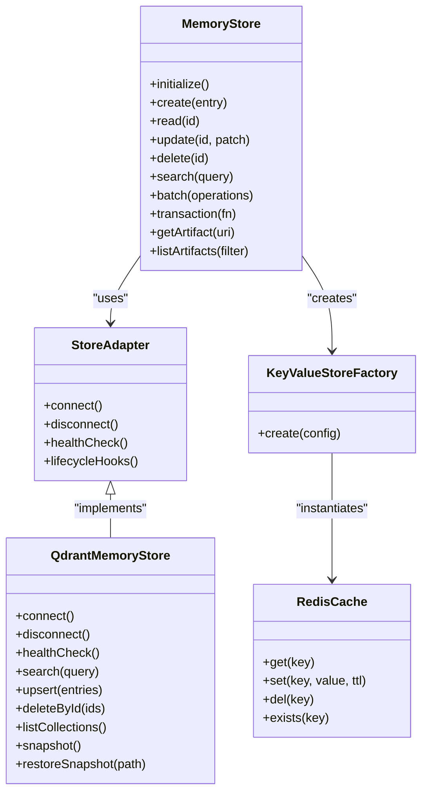
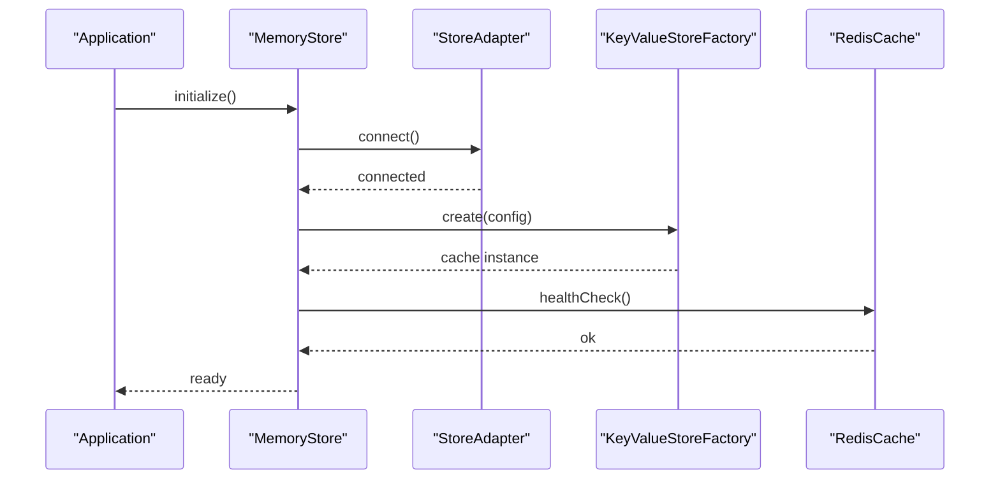
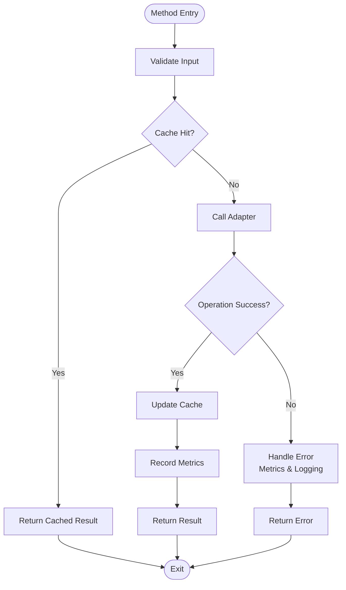
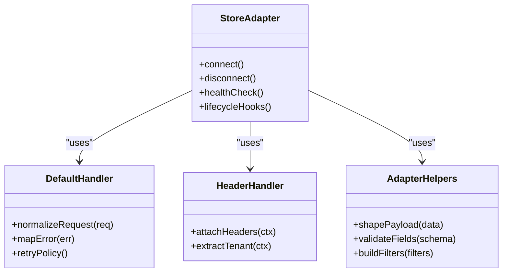
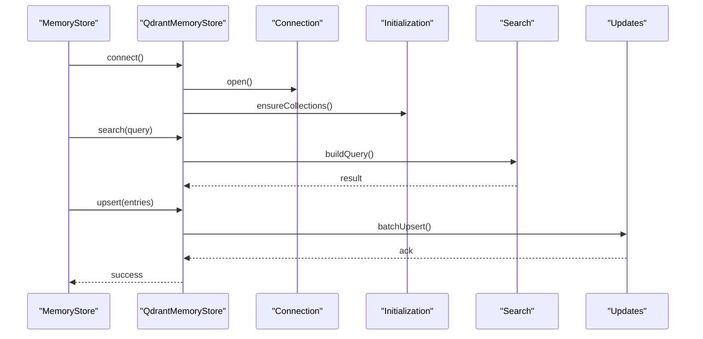
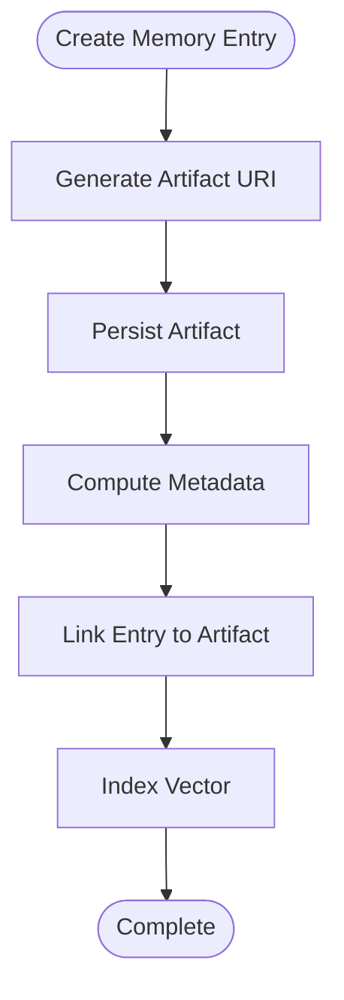
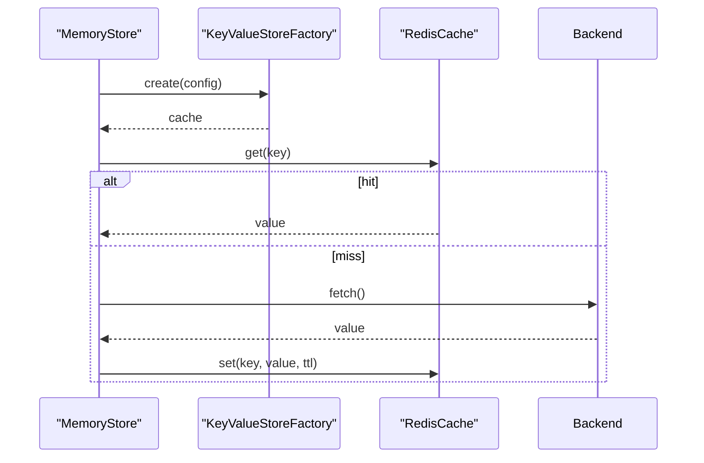
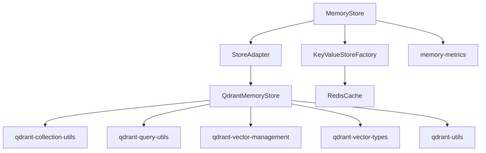

# Memory Store Architecture

<cite>
**Referenced Files in This Document**
- [src/services/memory/store.ts](file://src/services/memory/store.ts)
- [src/services/memory/store-methods.ts](file://src/services/memory/store-methods.ts)
- [src/services/memory/store-init.ts](file://src/services/memory/store-init.ts)
- [src/services/memory/store-artifact.ts](file://src/services/memory/store-artifact.ts)
- [src/services/memory/store-adapter.ts](file://src/services/memory/store-adapter.ts)
- [src/services/memory/store-adapter-default-handler.ts](file://src/services/memory/store-adapter-default-handler.ts)
- [src/services/memory/store-adapter-header-handler.ts](file://src/services/memory/store-adapter-header-handler.ts)
- [src/services/memory/store-adapter-helpers.ts](file://src/services/memory/store-adapter-helpers.ts)
- [src/services/memory/artifact-metadata.ts](file://src/services/memory/artifact-metadata.ts)
- [src/services/qdrant/memory-store.ts](file://src/services/qdrant/memory-store.ts)
- [src/services/qdrant/connection.ts](file://src/services/qdrant/connection.ts)
- [src/services/qdrant/initialization.ts](file://src/services/qdrant/initialization.ts)
- [src/services/qdrant/service.ts](file://src/services/qdrant/service.ts)
- [src/services/qdrant/types.ts](file://src/services/qdrant/types.ts)
- [src/services/qdrant/search.ts](file://src/services/qdrant/search.ts)
- [src/services/qdrant/memory-retrieval.ts](file://src/services/qdrant/memory-retrieval.ts)
- [src/services/qdrant/memory-updates.ts](file://src/services/qdrant/memory-updates.ts)
- [src/services/qdrant/resources.ts](file://src/services/qdrant/resources.ts)
- [src/services/qdrant/snapshots.ts](file://src/services/qdrant/snapshots.ts)
- [src/services/qdrant/reward-propagation.ts](file://src/services/qdrant/reward-propagation.ts)
- [src/services/qdrant/quality.ts](file://src/services/qdrant/quality.ts)
- [src/services/qdrant/protocol.ts](file://src/services/qdrant/protocol.ts)
- [src/services/qdrant/listing.ts](file://src/services/qdrant/listing.ts)
- [src/services/qdrant/utils.ts](file://src/services/qdrant/utils.ts)
- [src/services/qdrant/index.ts](file://src/services/qdrant/index.ts)
- [src/services/key-value-store-factory.ts](file://src/services/key-value-store-factory.ts)
- [src/services/key-value-store.ts](file://src/services/key-value-store.ts)
- [src/services/redis-cache.ts](file://src/services/redis-cache.ts)
- [src/services/redis.ts](file://src/services/redis.ts)
- [src/services/metrics/memory-metrics.ts](file://src/services/metrics/memory-metrics.ts)
- [src/utils/memory-store-utils.ts](file://src/utils/memory-store-utils.ts)
- [src/utils/qdrant-collection-utils.ts](file://src/utils/qdrant-collection-utils.ts)
- [src/utils/qdrant-query-utils.ts](file://src/utils/qdrant-query-utils.ts)
- [src/utils/qdrant-vector-management.ts](file://src/utils/qdrant-vector-management.ts)
- [src/utils/qdrant-vector-types.ts](file://src/utils/qdrant-vector-types.ts)
- [src/utils/qdrant-utils.ts](file://src/utils/qdrant-utils.ts)
- [src/config.ts](file://src/config.ts)
- [src/bootstrap.ts](file://src/bootstrap.ts)
</cite>

## Table of Contents
1. [Introduction](#introduction)
2. [Project Structure](#project-structure)
3. [Core Components](#core-components)
4. [Architecture Overview](#architecture-overview)
5. [Detailed Component Analysis](#detailed-component-analysis)
6. [Dependency Analysis](#dependency-analysis)
7. [Performance Considerations](#performance-considerations)
8. [Troubleshooting Guide](#troubleshooting-guide)
9. [Conclusion](#conclusion)
10. [Appendices](#appendices)

## Introduction
This document explains the memory store architecture, focusing on the core interface and implementation patterns for initializing stores, managing connections, and handling lifecycle hooks. It details the store methods API for CRUD operations, batch processing, and transaction handling; artifact storage integration; metadata management; and data persistence strategies. Configuration options for different storage backends, connection pooling, and error handling patterns are covered, along with examples of custom store implementations and migration procedures between storage systems.

## Project Structure
The memory store is implemented as a layered system:
- A high-level store abstraction that defines the contract for memory operations.
- An adapter layer to integrate with specific storage backends (e.g., Qdrant).
- Backend-specific services for connection management, indexing, search, updates, snapshots, and metrics.
- Utility modules for configuration, metrics, and common helpers.

```mermaid
graph TB
subgraph "Memory Store Layer"
MS["store.ts"]
SM["store-methods.ts"]
SI["store-init.ts"]
SA["store-adapter.ts"]
SADH["store-adapter-default-handler.ts"]
SAHH["store-adapter-header-handler.ts"]
SAH["store-adapter-helpers.ts"]
AMA["artifact-metadata.ts"]
SART["store-artifact.ts"]
end
subgraph "Qdrant Backend"
QMS["qdrant/memory-store.ts"]
QC["qdrant/connection.ts"]
QINIT["qdrant/initialization.ts"]
QSVC["qdrant/service.ts"]
QTYPE["qdrant/types.ts"]
QSEARCH["qdrant/search.ts"]
QRETR["qdrant/memory-retrieval.ts"]
QUPD["qdrant/memory-updates.ts"]
QRES["qdrant/resources.ts"]
QSNAP["qdrant/snapshots.ts"]
QRW["qdrant/reward-propagation.ts"]
QQ["qdrant/quality.ts"]
QPROTO["qdrant/protocol.ts"]
QLIST["qdrant/listing.ts"]
QUTILS["qdrant/utils.ts"]
QIDX["qdrant/index.ts"]
end
subgraph "Key-Value Cache"
KVF["key-value-store-factory.ts"]
KVS["key-value-store.ts"]
RCF["redis-cache.ts"]
REDIS["redis.ts"]
end
subgraph "Cross-Cutting"
MET["metrics/memory-metrics.ts"]
CFG["config.ts"]
BOOT["bootstrap.ts"]
UTILS["utils/memory-store-utils.ts"]
QCOL["utils/qdrant-collection-utils.ts"]
QQUERY["utils/qdrant-query-utils.ts"]
QVEC["utils/qdrant-vector-management.ts"]
QVT["utils/qdrant-vector-types.ts"]
QU["utils/qdrant-utils.ts"]
end
MS --> SM
MS --> SI
MS --> SA
SA --> SADH
SA --> SAHH
SA --> SAH
MS --> AMA
MS --> SART
SA --> QMS
QMS --> QC
QMS --> QINIT
QMS --> QSVC
QMS --> QTYPE
QMS --> QSEARCH
QMS --> QRETR
QMS --> QUPD
QMS --> QRES
QMS --> QSNAP
QMS --> QRW
QMS --> QQ
QMS --> QPROTO
QMS --> QLIST
QMS --> QUTILS
QMS --> QIDX
KVF --> KVS
KVS --> RCF
RCF --> REDIS
MS --> MET
MS --> CFG
MS --> UTILS
QMS --> QCOL
QMS --> QQUERY
QMS --> QVEC
QMS --> QVT
QMS --> QU
BOOT --> MS
```

**Diagram sources**
- [src/services/memory/store.ts](file://src/services/memory/store.ts)
- [src/services/memory/store-methods.ts](file://src/services/memory/store-methods.ts)
- [src/services/memory/store-init.ts](file://src/services/memory/store-init.ts)
- [src/services/memory/store-adapter.ts](file://src/services/memory/store-adapter.ts)
- [src/services/memory/store-adapter-default-handler.ts](file://src/services/memory/store-adapter-default-handler.ts)
- [src/services/memory/store-adapter-header-handler.ts](file://src/services/memory/store-adapter-header-handler.ts)
- [src/services/memory/store-adapter-helpers.ts](file://src/services/memory/store-adapter-helpers.ts)
- [src/services/memory/artifact-metadata.ts](file://src/services/memory/artifact-metadata.ts)
- [src/services/memory/store-artifact.ts](file://src/services/memory/store-artifact.ts)
- [src/services/qdrant/memory-store.ts](file://src/services/qdrant/memory-store.ts)
- [src/services/qdrant/connection.ts](file://src/services/qdrant/connection.ts)
- [src/services/qdrant/initialization.ts](file://src/services/qdrant/initialization.ts)
- [src/services/qdrant/service.ts](file://src/services/qdrant/service.ts)
- [src/services/qdrant/types.ts](file://src/services/qdrant/types.ts)
- [src/services/qdrant/search.ts](file://src/services/qdrant/search.ts)
- [src/services/qdrant/memory-retrieval.ts](file://src/services/qdrant/memory-retrieval.ts)
- [src/services/qdrant/memory-updates.ts](file://src/services/qdrant/memory-updates.ts)
- [src/services/qdrant/resources.ts](file://src/services/qdrant/resources.ts)
- [src/services/qdrant/snapshots.ts](file://src/services/qdrant/snapshots.ts)
- [src/services/qdrant/reward-propagation.ts](file://src/services/qdrant/reward-propagation.ts)
- [src/services/qdrant/quality.ts](file://src/services/qdrant/quality.ts)
- [src/services/qdrant/protocol.ts](file://src/services/qdrant/protocol.ts)
- [src/services/qdrant/listing.ts](file://src/services/qdrant/listing.ts)
- [src/services/qdrant/utils.ts](file://src/services/qdrant/utils.ts)
- [src/services/qdrant/index.ts](file://src/services/qdrant/index.ts)
- [src/services/key-value-store-factory.ts](file://src/services/key-value-store-factory.ts)
- [src/services/key-value-store.ts](file://src/services/key-value-store.ts)
- [src/services/redis-cache.ts](file://src/services/redis-cache.ts)
- [src/services/redis.ts](file://src/services/redis.ts)
- [src/services/metrics/memory-metrics.ts](file://src/services/metrics/memory-metrics.ts)
- [src/utils/memory-store-utils.ts](file://src/utils/memory-store-utils.ts)
- [src/utils/qdrant-collection-utils.ts](file://src/utils/qdrant-collection-utils.ts)
- [src/utils/qdrant-query-utils.ts](file://src/utils/qdrant-query-utils.ts)
- [src/utils/qdrant-vector-management.ts](file://src/utils/qdrant-vector-management.ts)
- [src/utils/qdrant-vector-types.ts](file://src/utils/qdrant-vector-types.ts)
- [src/utils/qdrant-utils.ts](file://src/utils/qdrant-utils.ts)
- [src/config.ts](file://src/config.ts)
- [src/bootstrap.ts](file://src/bootstrap.ts)

**Section sources**
- [src/services/memory/store.ts](file://src/services/memory/store.ts)
- [src/services/qdrant/memory-store.ts](file://src/services/qdrant/memory-store.ts)
- [src/services/key-value-store-factory.ts](file://src/services/key-value-store-factory.ts)
- [src/config.ts](file://src/config.ts)
- [src/bootstrap.ts](file://src/bootstrap.ts)

## Core Components
- Store Interface and Methods: The top-level memory store exposes a consistent API for creating, reading, updating, deleting, searching, and batching operations. It also provides transaction-like semantics via atomic update helpers and orchestrates caching and metrics.
- Adapter Abstraction: The adapter layer decouples backend specifics from the store interface, enabling pluggable storage backends. Default and header handlers provide standardized behaviors for request/response transformation and validation.
- Artifact Storage Integration: Artifacts are stored separately from vectorized memory entries, with dedicated metadata and path resolution utilities ensuring consistency across retrieval and export flows.
- Key-Value Caching: A key-value store abstraction abstracts Redis-backed caching for hot paths like activation results or frequently accessed metadata.
- Metrics and Utilities: Cross-cutting concerns include instrumentation, collection management, query building, and vector type definitions.

**Section sources**
- [src/services/memory/store-methods.ts](file://src/services/memory/store-methods.ts)
- [src/services/memory/store-adapter.ts](file://src/services/memory/store-adapter.ts)
- [src/services/memory/store-adapter-default-handler.ts](file://src/services/memory/store-adapter-default-handler.ts)
- [src/services/memory/store-adapter-header-handler.ts](file://src/services/memory/store-adapter-header-handler.ts)
- [src/services/memory/store-adapter-helpers.ts](file://src/services/memory/store-adapter-helpers.ts)
- [src/services/memory/artifact-metadata.ts](file://src/services/memory/artifact-metadata.ts)
- [src/services/memory/store-artifact.ts](file://src/services/memory/store-artifact.ts)
- [src/services/key-value-store-factory.ts](file://src/services/key-value-store-factory.ts)
- [src/services/key-value-store.ts](file://src/services/key-value-store.ts)
- [src/services/redis-cache.ts](file://src/services/redis-cache.ts)
- [src/services/metrics/memory-metrics.ts](file://src/services/metrics/memory-metrics.ts)
- [src/utils/memory-store-utils.ts](file://src/utils/memory-store-utils.ts)

## Architecture Overview
The memory store follows a clean separation of concerns:
- High-level store orchestrates operations, caching, and metrics.
- Adapter translates store calls into backend-specific actions.
- Backend service manages connection lifecycle, initialization, and domain-specific features (search, updates, resources, snapshots, quality, protocol, listing).
- Key-value cache accelerates read-heavy paths.
- Utilities and metrics support cross-cutting functionality.

**Diagram sources**
- [src/services/memory/store.ts](file://src/services/memory/store.ts)
- [src/services/memory/store-adapter.ts](file://src/services/memory/store-adapter.ts)
- [src/services/qdrant/memory-store.ts](file://src/services/qdrant/memory-store.ts)
- [src/services/key-value-store-factory.ts](file://src/services/key-value-store-factory.ts)
- [src/services/redis-cache.ts](file://src/services/redis-cache.ts)

## Detailed Component Analysis

### Store Interface and Lifecycle
- Initialization: The store initializes adapters, sets up metrics, and prepares caches. It validates configuration and ensures required collections exist before accepting requests.
- Connection Management: Adapters encapsulate connection setup, retries, and health checks. The store delegates connectivity responsibilities to the adapter while exposing unified lifecycle methods.
- Lifecycle Hooks: Pre/post hooks allow side effects such as cache invalidation, audit logging, and metrics recording around critical operations.

**Diagram sources**
- [src/services/memory/store-init.ts](file://src/services/memory/store-init.ts)
- [src/services/memory/store-adapter.ts](file://src/services/memory/store-adapter.ts)
- [src/services/key-value-store-factory.ts](file://src/services/key-value-store-factory.ts)
- [src/services/redis-cache.ts](file://src/services/redis-cache.ts)

**Section sources**
- [src/services/memory/store-init.ts](file://src/services/memory/store-init.ts)
- [src/services/memory/store-adapter.ts](file://src/services/memory/store-adapter.ts)
- [src/services/key-value-store-factory.ts](file://src/services/key-value-store-factory.ts)
- [src/services/redis-cache.ts](file://src/services/redis-cache.ts)

### Store Methods API (CRUD, Batch, Transactions)
- Create: Validates input, writes to backend via adapter, updates cache if applicable, records metrics.
- Read: Checks cache first; falls back to backend; populates cache with TTL.
- Update: Applies patches atomically where supported; invalidates related cache entries.
- Delete: Removes entry and associated artifacts if needed; clears cache.
- Search: Builds queries using utility helpers; returns ranked results; supports filters and scoring.
- Batch: Executes multiple operations efficiently; may leverage backend bulk endpoints.
- Transaction: Wraps multiple operations in an atomic unit when supported by the backend; otherwise simulates transactions with compensating actions.

**Diagram sources**
- [src/services/memory/store-methods.ts](file://src/services/memory/store-methods.ts)
- [src/services/metrics/memory-metrics.ts](file://src/services/metrics/memory-metrics.ts)
- [src/utils/memory-store-utils.ts](file://src/utils/memory-store-utils.ts)

**Section sources**
- [src/services/memory/store-methods.ts](file://src/services/memory/store-methods.ts)
- [src/services/metrics/memory-metrics.ts](file://src/services/metrics/memory-metrics.ts)
- [src/utils/memory-store-utils.ts](file://src/utils/memory-store-utils.ts)

### Adapter Layer and Handlers
- Adapter Contract: Defines connect/disconnect, health checks, and lifecycle hooks. Implementations translate store calls into backend-specific operations.
- Default Handler: Provides standard behavior for request/response normalization, error mapping, and retry policies.
- Header Handler: Manages headers and context propagation (e.g., tenant, user, correlation IDs).
- Helpers: Common utilities for payload shaping, field mapping, and validation.

**Diagram sources**
- [src/services/memory/store-adapter.ts](file://src/services/memory/store-adapter.ts)
- [src/services/memory/store-adapter-default-handler.ts](file://src/services/memory/store-adapter-default-handler.ts)
- [src/services/memory/store-adapter-header-handler.ts](file://src/services/memory/store-adapter-header-handler.ts)
- [src/services/memory/store-adapter-helpers.ts](file://src/services/memory/store-adapter-helpers.ts)

**Section sources**
- [src/services/memory/store-adapter.ts](file://src/services/memory/store-adapter.ts)
- [src/services/memory/store-adapter-default-handler.ts](file://src/services/memory/store-adapter-default-handler.ts)
- [src/services/memory/store-adapter-header-handler.ts](file://src/services/memory/store-adapter-header-handler.ts)
- [src/services/memory/store-adapter-helpers.ts](file://src/services/memory/store-adapter-helpers.ts)

### Qdrant Backend Implementation
- Connection and Initialization: Establishes client connections, configures timeouts, and ensures collections exist.
- Search and Retrieval: Builds vector and filter queries; applies scoring and ranking; retrieves full documents.
- Updates and Upserts: Performs efficient batch upserts; handles partial updates and conflict resolution.
- Resources and Snapshots: Manages resource references and snapshot creation/restoration for durability.
- Quality and Protocol: Enforces schema constraints and protocol versioning; computes quality scores.
- Listing and Utilities: Lists collections, points, and provides shared utilities for vector types and query construction.

**Diagram sources**
- [src/services/qdrant/memory-store.ts](file://src/services/qdrant/memory-store.ts)
- [src/services/qdrant/connection.ts](file://src/services/qdrant/connection.ts)
- [src/services/qdrant/initialization.ts](file://src/services/qdrant/initialization.ts)
- [src/services/qdrant/search.ts](file://src/services/qdrant/search.ts)
- [src/services/qdrant/memory-updates.ts](file://src/services/qdrant/memory-updates.ts)

**Section sources**
- [src/services/qdrant/memory-store.ts](file://src/services/qdrant/memory-store.ts)
- [src/services/qdrant/connection.ts](file://src/services/qdrant/connection.ts)
- [src/services/qdrant/initialization.ts](file://src/services/qdrant/initialization.ts)
- [src/services/qdrant/search.ts](file://src/services/qdrant/search.ts)
- [src/services/qdrant/memory-updates.ts](file://src/services/qdrant/memory-updates.ts)
- [src/services/qdrant/resources.ts](file://src/services/qdrant/resources.ts)
- [src/services/qdrant/snapshots.ts](file://src/services/qdrant/snapshots.ts)
- [src/services/qdrant/reward-propagation.ts](file://src/services/qdrant/reward-propagation.ts)
- [src/services/qdrant/quality.ts](file://src/services/qdrant/quality.ts)
- [src/services/qdrant/protocol.ts](file://src/services/qdrant/protocol.ts)
- [src/services/qdrant/listing.ts](file://src/services/qdrant/listing.ts)
- [src/services/qdrant/utils.ts](file://src/services/qdrant/utils.ts)
- [src/services/qdrant/index.ts](file://src/services/qdrant/index.ts)

### Artifact Storage Integration and Metadata
- Artifact Storage: Artifacts are persisted independently from vectorized memory entries. The store integrates artifact APIs to resolve URIs, manage file paths, and handle MIME inference.
- Metadata Management: Artifact metadata includes identifiers, content hashes, sizes, and relationships to memory entries. Consistency checks ensure referential integrity.
- Persistence Strategy: Artifacts use durable storage with checksum verification; memory entries reference artifacts via stable URIs.

**Diagram sources**
- [src/services/memory/store-artifact.ts](file://src/services/memory/store-artifact.ts)
- [src/services/memory/artifact-metadata.ts](file://src/services/memory/artifact-metadata.ts)

**Section sources**
- [src/services/memory/store-artifact.ts](file://src/services/memory/store-artifact.ts)
- [src/services/memory/artifact-metadata.ts](file://src/services/memory/artifact-metadata.ts)

### Key-Value Caching and Redis Integration
- Factory Pattern: The factory creates cache instances based on configuration, supporting different backends.
- Redis Cache: Implements get/set/del/exists with TTL support; used for hot paths like activation results and frequent reads.
- Invalidation: Cache invalidation occurs on write operations to maintain consistency.

**Diagram sources**
- [src/services/key-value-store-factory.ts](file://src/services/key-value-store-factory.ts)
- [src/services/key-value-store.ts](file://src/services/key-value-store.ts)
- [src/services/redis-cache.ts](file://src/services/redis-cache.ts)

**Section sources**
- [src/services/key-value-store-factory.ts](file://src/services/key-value-store-factory.ts)
- [src/services/key-value-store.ts](file://src/services/key-value-store.ts)
- [src/services/redis-cache.ts](file://src/services/redis-cache.ts)

### Configuration Options and Connection Pooling
- Backend Selection: Configuration selects the active memory store backend (e.g., Qdrant) and provides connection parameters.
- Connection Pooling: Backend clients configure pool size, timeouts, and retry policies to optimize throughput and resilience.
- Feature Flags: Options enable/disable snapshots, quality scoring, and protocol enforcement.

**Section sources**
- [src/config.ts](file://src/config.ts)
- [src/services/qdrant/connection.ts](file://src/services/qdrant/connection.ts)
- [src/services/qdrant/service.ts](file://src/services/qdrant/service.ts)

### Error Handling Patterns
- Normalization: Adapters map backend errors to standardized shapes with codes and messages.
- Retries: Default handler implements exponential backoff and idempotency checks where applicable.
- Metrics: Errors are recorded with dimensions for observability and alerting.

**Section sources**
- [src/services/memory/store-adapter-default-handler.ts](file://src/services/memory/store-adapter-default-handler.ts)
- [src/services/metrics/memory-metrics.ts](file://src/services/metrics/memory-metrics.ts)

### Custom Store Implementations
To implement a custom store:
- Implement the adapter contract with connect/disconnect and lifecycle hooks.
- Provide default and header handlers for request/response normalization and context propagation.
- Integrate with the key-value cache factory for optional caching.
- Register the adapter in bootstrap and configuration.

**Section sources**
- [src/services/memory/store-adapter.ts](file://src/services/memory/store-adapter.ts)
- [src/services/memory/store-adapter-default-handler.ts](file://src/services/memory/store-adapter-default-handler.ts)
- [src/services/memory/store-adapter-header-handler.ts](file://src/services/memory/store-adapter-header-handler.ts)
- [src/services/key-value-store-factory.ts](file://src/services/key-value-store-factory.ts)
- [src/bootstrap.ts](file://src/bootstrap.ts)

### Migration Procedures Between Storage Systems
- Snapshot Export: Use snapshot utilities to export current state from the source backend.
- Data Transformation: Convert payloads to the target backend’s schema using adapters and helpers.
- Import and Validation: Import transformed data into the target backend; run quality checks and protocol validations.
- Rollback Plan: Maintain backups and rollback scripts; validate health and metrics post-migration.

**Section sources**
- [src/services/qdrant/snapshots.ts](file://src/services/qdrant/snapshots.ts)
- [src/services/qdrant/quality.ts](file://src/services/qdrant/quality.ts)
- [src/services/qdrant/protocol.ts](file://src/services/qdrant/protocol.ts)
- [src/services/memory/store-adapter-helpers.ts](file://src/services/memory/store-adapter-helpers.ts)

## Dependency Analysis
The memory store depends on:
- Adapter implementations for backend-specific logic.
- Key-value cache for performance optimization.
- Utilities for collection management, query building, and vector types.
- Metrics for observability.

**Diagram sources**
- [src/services/memory/store.ts](file://src/services/memory/store.ts)
- [src/services/memory/store-adapter.ts](file://src/services/memory/store-adapter.ts)
- [src/services/qdrant/memory-store.ts](file://src/services/qdrant/memory-store.ts)
- [src/services/key-value-store-factory.ts](file://src/services/key-value-store-factory.ts)
- [src/services/redis-cache.ts](file://src/services/redis-cache.ts)
- [src/services/metrics/memory-metrics.ts](file://src/services/metrics/memory-metrics.ts)
- [src/utils/qdrant-collection-utils.ts](file://src/utils/qdrant-collection-utils.ts)
- [src/utils/qdrant-query-utils.ts](file://src/utils/qdrant-query-utils.ts)
- [src/utils/qdrant-vector-management.ts](file://src/utils/qdrant-vector-management.ts)
- [src/utils/qdrant-vector-types.ts](file://src/utils/qdrant-vector-types.ts)
- [src/utils/qdrant-utils.ts](file://src/utils/qdrant-utils.ts)

**Section sources**
- [src/services/memory/store.ts](file://src/services/memory/store.ts)
- [src/services/qdrant/memory-store.ts](file://src/services/qdrant/memory-store.ts)
- [src/services/key-value-store-factory.ts](file://src/services/key-value-store-factory.ts)
- [src/services/metrics/memory-metrics.ts](file://src/services/metrics/memory-metrics.ts)
- [src/utils/qdrant-collection-utils.ts](file://src/utils/qdrant-collection-utils.ts)
- [src/utils/qdrant-query-utils.ts](file://src/utils/qdrant-query-utils.ts)
- [src/utils/qdrant-vector-management.ts](file://src/utils/qdrant-vector-management.ts)
- [src/utils/qdrant-vector-types.ts](file://src/utils/qdrant-vector-types.ts)
- [src/utils/qdrant-utils.ts](file://src/utils/qdrant-utils.ts)

## Performance Considerations
- Caching Hot Paths: Leverage key-value cache for frequent reads; tune TTLs to balance freshness and latency.
- Batch Operations: Prefer batch upserts and searches to reduce round trips.
- Connection Pooling: Configure pool sizes and timeouts according to workload characteristics.
- Query Optimization: Use targeted filters and minimal fields to reduce payload sizes.
- Metrics Monitoring: Track latency, error rates, and cache hit ratios to identify bottlenecks.

[No sources needed since this section provides general guidance]

## Troubleshooting Guide
- Health Checks: Verify backend connectivity and collection existence during initialization.
- Error Diagnostics: Inspect normalized error shapes and metrics for failure patterns.
- Cache Issues: Clear stale entries and validate TTL configurations.
- Snapshot Recovery: Restore from snapshots if data corruption is detected.

**Section sources**
- [src/services/qdrant/initialization.ts](file://src/services/qdrant/initialization.ts)
- [src/services/memory/store-adapter-default-handler.ts](file://src/services/memory/store-adapter-default-handler.ts)
- [src/services/metrics/memory-metrics.ts](file://src/services/metrics/memory-metrics.ts)
- [src/services/qdrant/snapshots.ts](file://src/services/qdrant/snapshots.ts)

## Conclusion
The memory store architecture provides a robust, extensible foundation for persistent memory operations. Its layered design separates concerns, enabling pluggable backends, efficient caching, and comprehensive observability. By following the documented patterns for initialization, connection management, lifecycle hooks, and error handling, teams can implement custom stores and migrate between systems with confidence.

[No sources needed since this section summarizes without analyzing specific files]

## Appendices
- Example Custom Store: Implement adapter contract, register in bootstrap, and configure via settings.
- Migration Checklist: Export snapshots, transform schemas, import to target, validate quality, and monitor metrics.

[No sources needed since this section provides general guidance]