# Memory System

<cite>
**Referenced Files in This Document**
- [src/services/memory/store.ts](file://src/services/memory/store.ts)
- [src/services/memory/store-methods.ts](file://src/services/memory/store-methods.ts)
- [src/services/memory/store-init.ts](file://src/services/memory/store-init.ts)
- [src/services/memory/qdrant-point-to-memory.ts](file://src/services/memory/qdrant-point-to-memory.ts)
- [src/services/memory/adapter-builder.ts](file://src/services/memory/adapter-builder.ts)
- [src/services/memory/store-adapter.ts](file://src/services/memory/store-adapter.ts)
- [src/services/memory/store-adapter-helpers.ts](file://src/services/memory/store-adapter-helpers.ts)
- [src/services/memory/store-adapter-default-handler.ts](file://src/services/memory/store-adapter-default-handler.ts)
- [src/services/memory/store-adapter-header-handler.ts](file://src/services/memory/store-adapter-header-handler.ts)
- [src/services/memory/artifact-metadata.ts](file://src/services/memory/artifact-metadata.ts)
- [src/services/memory/validate-protocol-structure.ts](file://src/services/memory/validate-protocol-structure.ts)
- [src/services/memory/activation-search-fields.ts](file://src/services/memory/activation-search-fields.ts)
- [src/services/memory/title-similarity-search.ts](file://src/services/memory/title-similarity-search.ts)
- [src/services/memory/activation-pattern-payload.ts](file://src/services/memory/activation-pattern-payload.ts)
- [src/services/memory/activation-search-backfill.ts](file://src/services/memory/activation-search-backfill.ts)
- [src/services/qdrant/service.ts](file://src/services/qdrant/service.ts)
- [src/services/qdrant/connection.ts](file://src/services/qdrant/connection.ts)
- [src/services/qdrant/initialization.ts](file://src/services/qdrant/initialization.ts)
- [src/services/qdrant/search.ts](file://src/services/qdrant/search.ts)
- [src/services/qdrant/memory-store.ts](file://src/services/qdrant/memory-store.ts)
- [src/services/qdrant/memory-updates.ts](file://src/services/qdrant/memory-updates.ts)
- [src/services/qdrant/memory-retrieval.ts](file://src/services/qdrant/memory-retrieval.ts)
- [src/services/qdrant/types.ts](file://src/services/qdrant/types.ts)
- [src/services/qdrant/resources.ts](file://src/services/qdrant/resources.ts)
- [src/services/qdrant/snapshots.ts](file://src/services/qdrant/snapshots.ts)
- [src/services/embedding/service.ts](file://src/services/embedding/service.ts)
- [src/services/embedding/config.ts](file://src/services/embedding/config.ts)
- [src/services/embedding/providers.ts](file://src/services/embedding/providers.ts)
- [src/services/embedding/bm25-tokenizer.ts](file://src/services/embedding/bm25-tokenizer.ts)
- [src/utils/qdrant-vector-types.ts](file://src/utils/qdrant-vector-types.ts)
- [src/utils/qdrant-query-utils.ts](file://src/utils/qdrant-query-utils.ts)
- [src/utils/qdrant-collection-utils.ts](file://src/utils/qdrant-collection-utils.ts)
- [src/constants/builtin-search-meta.ts](file://src/constants/builtin-search-meta.ts)
- [src/tools/search.ts](file://src/tools/search.ts)
- [src/tools/search_output.ts](file://src/tools/search_output.ts)
- [src/tools/search_schema.ts](file://src/tools/search_schema.ts)
- [src/http/http-api-routes.ts](file://src/http/http-api-routes.ts)
- [src/mcp-apps/list-offerings-for-ui.ts](file://src/mcp-apps/list-offerings-for-ui.ts)
- [src/resources/mem-resources-boot.ts](file://src/resources/mem-resources-boot.ts)
- [src/resources/mem-dir-utils.ts](file://src/resources/mem-dir-utils.ts)
- [src/resources/mem-uuid-mapper.ts](file://src/resources/mem-uuid-mapper.ts)
- [src/bootstrap.ts](file://src/bootstrap.ts)
- [src/server.ts](file://src/server.ts)
- [src/config.ts](file://src/config.ts)
- [scripts/deploy-run-qdrant-search.mjs](file://scripts/deploy-run-qdrant-search.mjs)
</cite>

## Table of Contents
1. [Introduction](#introduction)
2. [Project Structure](#project-structure)
3. [Core Components](#core-components)
4. [Architecture Overview](#architecture-overview)
5. [Detailed Component Analysis](#detailed-component-analysis)
6. [Dependency Analysis](#dependency-analysis)
7. [Performance Considerations](#performance-considerations)
8. [Troubleshooting Guide](#troubleshooting-guide)
9. [Conclusion](#conclusion)
10. [Appendices](#appendices)

## Introduction
This document explains the Kairos MCP memory system, focusing on the Qdrant-backed vector store for semantic search, the adapter system for ingesting diverse data sources, the embedding generation pipeline, and hybrid search combining BM25 with vector similarity. It also covers memory entry structure, metadata handling, artifact references, configuration options for search optimization and indexing strategies, migration processes, backup and recovery, scaling considerations, lifecycle management, cleanup policies, monitoring metrics, and examples for custom adapters and query optimization.

## Project Structure
The memory system is implemented across several modules:
- Memory store abstraction and orchestration
- Qdrant integration (connection, initialization, search, updates, retrieval, snapshots)
- Embedding service and BM25 tokenizer
- Adapter framework for data sources
- Tools and HTTP routes exposing search and training operations
- Resource bootstrapping for embedded content
- Utilities for vectors, queries, collections, and built-in metadata

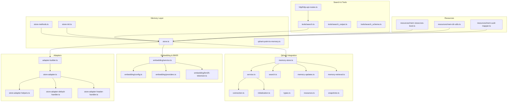

**Diagram sources**
- [src/services/memory/store.ts](file://src/services/memory/store.ts)
- [src/services/memory/store-methods.ts](file://src/services/memory/store-methods.ts)
- [src/services/memory/store-init.ts](file://src/services/memory/store-init.ts)
- [src/services/memory/qdrant-point-to-memory.ts](file://src/services/memory/qdrant-point-to-memory.ts)
- [src/services/qdrant/service.ts](file://src/services/qdrant/service.ts)
- [src/services/qdrant/connection.ts](file://src/services/qdrant/connection.ts)
- [src/services/qdrant/initialization.ts](file://src/services/qdrant/initialization.ts)
- [src/services/qdrant/search.ts](file://src/services/qdrant/search.ts)
- [src/services/qdrant/memory-store.ts](file://src/services/qdrant/memory-store.ts)
- [src/services/qdrant/memory-updates.ts](file://src/services/qdrant/memory-updates.ts)
- [src/services/qdrant/memory-retrieval.ts](file://src/services/qdrant/memory-retrieval.ts)
- [src/services/qdrant/types.ts](file://src/services/qdrant/types.ts)
- [src/services/qdrant/resources.ts](file://src/services/qdrant/resources.ts)
- [src/services/qdrant/snapshots.ts](file://src/services/qdrant/snapshots.ts)
- [src/services/embedding/service.ts](file://src/services/embedding/service.ts)
- [src/services/embedding/config.ts](file://src/services/embedding/config.ts)
- [src/services/embedding/providers.ts](file://src/services/embedding/providers.ts)
- [src/services/embedding/bm25-tokenizer.ts](file://src/services/embedding/bm25-tokenizer.ts)
- [src/services/memory/adapter-builder.ts](file://src/services/memory/adapter-builder.ts)
- [src/services/memory/store-adapter.ts](file://src/services/memory/store-adapter.ts)
- [src/services/memory/store-adapter-helpers.ts](file://src/services/memory/store-adapter-helpers.ts)
- [src/services/memory/store-adapter-default-handler.ts](file://src/services/memory/store-adapter-default-handler.ts)
- [src/services/memory/store-adapter-header-handler.ts](file://src/services/memory/store-adapter-header-handler.ts)
- [src/tools/search.ts](file://src/tools/search.ts)
- [src/tools/search_output.ts](file://src/tools/search_output.ts)
- [src/tools/search_schema.ts](file://src/tools/search_schema.ts)
- [src/http/http-api-routes.ts](file://src/http/http-api-routes.ts)
- [src/resources/mem-resources-boot.ts](file://src/resources/mem-resources-boot.ts)
- [src/resources/mem-dir-utils.ts](file://src/resources/mem-dir-utils.ts)
- [src/resources/mem-uuid-mapper.ts](file://src/resources/mem-uuid-mapper.ts)

**Section sources**
- [src/services/memory/store.ts](file://src/services/memory/store.ts)
- [src/services/qdrant/service.ts](file://src/services/qdrant/service.ts)
- [src/services/embedding/service.ts](file://src/services/embedding/service.ts)
- [src/services/memory/adapter-builder.ts](file://src/services/memory/adapter-builder.ts)
- [src/tools/search.ts](file://src/tools/search.ts)
- [src/http/http-api-routes.ts](file://src/http/http-api-routes.ts)
- [src/resources/mem-resources-boot.ts](file://src/resources/mem-resources-boot.ts)

## Core Components
- Memory Store Abstraction: Provides a unified interface to create, update, delete, and search memory entries. It orchestrates embeddings, BM25 tokenization, and Qdrant operations.
- Qdrant Integration: Manages connection, collection initialization, point writes, hybrid search (BM25 + vector), retrieval, and snapshot-based backups.
- Embedding Service: Generates dense vectors via configured providers and integrates with BM25 tokenization for lexical matching.
- Adapter Framework: Allows pluggable data sources to produce memory entries with consistent structure and metadata.
- Search Tools and Routes: Expose search capabilities through CLI tools and HTTP endpoints, including schema validation and output formatting.

Key responsibilities:
- Normalize input from adapters into memory entries
- Generate embeddings and BM25 tokens
- Persist points in Qdrant with rich metadata
- Execute hybrid search queries with filters and scoring
- Provide resource bootstrapping for embedded content

**Section sources**
- [src/services/memory/store.ts](file://src/services/memory/store.ts)
- [src/services/qdrant/memory-store.ts](file://src/services/qdrant/memory-store.ts)
- [src/services/embedding/service.ts](file://src/services/embedding/service.ts)
- [src/services/memory/adapter-builder.ts](file://src/services/memory/adapter-builder.ts)
- [src/tools/search.ts](file://src/tools/search.ts)

## Architecture Overview
The memory system follows a layered architecture:
- Presentation layer: Tools and HTTP routes accept user requests and validate inputs.
- Orchestration layer: Memory store coordinates adapters, embedding generation, and Qdrant operations.
- Storage layer: Qdrant provides vector similarity and full-text filtering; snapshots support backup and recovery.
- Data source layer: Adapters transform heterogeneous inputs into standardized memory entries.

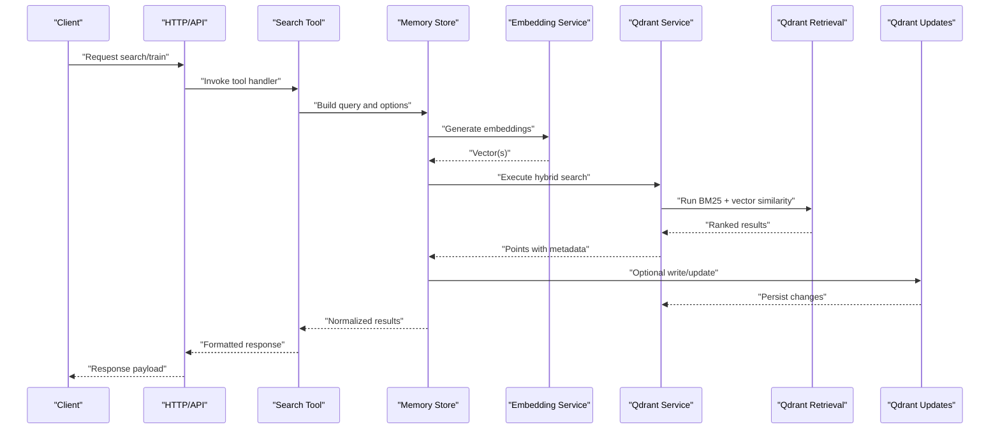

**Diagram sources**
- [src/tools/search.ts](file://src/tools/search.ts)
- [src/services/memory/store.ts](file://src/services/memory/store.ts)
- [src/services/embedding/service.ts](file://src/services/embedding/service.ts)
- [src/services/qdrant/service.ts](file://src/services/qdrant/service.ts)
- [src/services/qdrant/memory-retrieval.ts](file://src/services/qdrant/memory-retrieval.ts)
- [src/services/qdrant/memory-updates.ts](file://src/services/qdrant/memory-updates.ts)

## Detailed Component Analysis

### Memory Store and Entry Model
The memory store defines how entries are structured and persisted:
- Entry fields include identifiers, text body, title, metadata, and artifact references
- Metadata supports quality signals, space scoping, and tenant context
- Artifact references link to external or internal resources for provenance and export

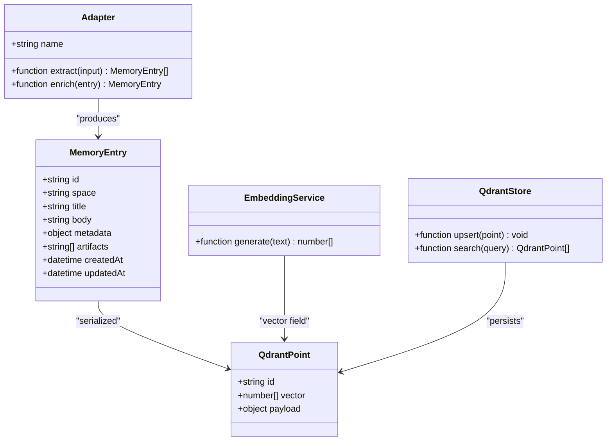

**Diagram sources**
- [src/services/memory/qdrant-point-to-memory.ts](file://src/services/memory/qdrant-point-to-memory.ts)
- [src/services/memory/artifact-metadata.ts](file://src/services/memory/artifact-metadata.ts)
- [src/services/memory/validate-protocol-structure.ts](file://src/services/memory/validate-protocol-structure.ts)
- [src/services/qdrant/types.ts](file://src/services/qdrant/types.ts)
- [src/services/qdrant/memory-store.ts](file://src/services/qdrant/memory-store.ts)
- [src/services/embedding/service.ts](file://src/services/embedding/service.ts)

**Section sources**
- [src/services/memory/qdrant-point-to-memory.ts](file://src/services/memory/qdrant-point-to-memory.ts)
- [src/services/memory/artifact-metadata.ts](file://src/services/memory/artifact-metadata.ts)
- [src/services/memory/validate-protocol-structure.ts](file://src/services/memory/validate-protocol-structure.ts)
- [src/services/qdrant/types.ts](file://src/services/qdrant/types.ts)

### Adapter System
The adapter system enables ingestion from multiple sources:
- Builder constructs adapters dynamically based on configuration
- Base adapter contract ensures consistent extraction and enrichment
- Default and header handlers provide common behaviors for markdown and structured headers
- Helpers simplify parsing, chunking, and normalization

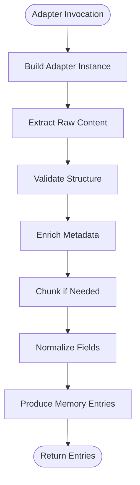

**Diagram sources**
- [src/services/memory/adapter-builder.ts](file://src/services/memory/adapter-builder.ts)
- [src/services/memory/store-adapter.ts](file://src/services/memory/store-adapter.ts)
- [src/services/memory/store-adapter-helpers.ts](file://src/services/memory/store-adapter-helpers.ts)
- [src/services/memory/store-adapter-default-handler.ts](file://src/services/memory/store-adapter-default-handler.ts)
- [src/services/memory/store-adapter-header-handler.ts](file://src/services/memory/store-adapter-header-handler.ts)

**Section sources**
- [src/services/memory/adapter-builder.ts](file://src/services/memory/adapter-builder.ts)
- [src/services/memory/store-adapter.ts](file://src/services/memory/store-adapter.ts)
- [src/services/memory/store-adapter-helpers.ts](file://src/services/memory/store-adapter-helpers.ts)
- [src/services/memory/store-adapter-default-handler.ts](file://src/services/memory/store-adapter-default-handler.ts)
- [src/services/memory/store-adapter-header-handler.ts](file://src/services/memory/store-adapter-header-handler.ts)

### Embedding Generation Pipeline
The embedding pipeline generates dense vectors and prepares BM25 tokens:
- Configurable providers allow different embedding models
- Tokenizer prepares text for BM25 scoring
- Service coordinates batching and rate limiting

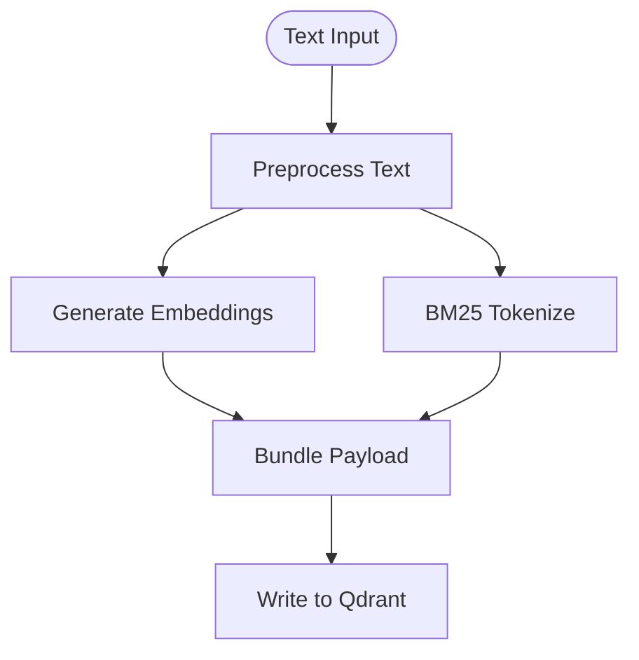

**Diagram sources**
- [src/services/embedding/service.ts](file://src/services/embedding/service.ts)
- [src/services/embedding/config.ts](file://src/services/embedding/config.ts)
- [src/services/embedding/providers.ts](file://src/services/embedding/providers.ts)
- [src/services/embedding/bm25-tokenizer.ts](file://src/services/embedding/bm25-tokenizer.ts)

**Section sources**
- [src/services/embedding/service.ts](file://src/services/embedding/service.ts)
- [src/services/embedding/config.ts](file://src/services/embedding/config.ts)
- [src/services/embedding/providers.ts](file://src/services/embedding/providers.ts)
- [src/services/embedding/bm25-tokenizer.ts](file://src/services/embedding/bm25-tokenizer.ts)

### Hybrid Search (BM25 + Vector Similarity)
Hybrid search combines lexical relevance with semantic similarity:
- Query building uses filters, keywords, and vectors
- Scoring merges BM25 scores with vector cosine similarity
- Results are normalized and ranked

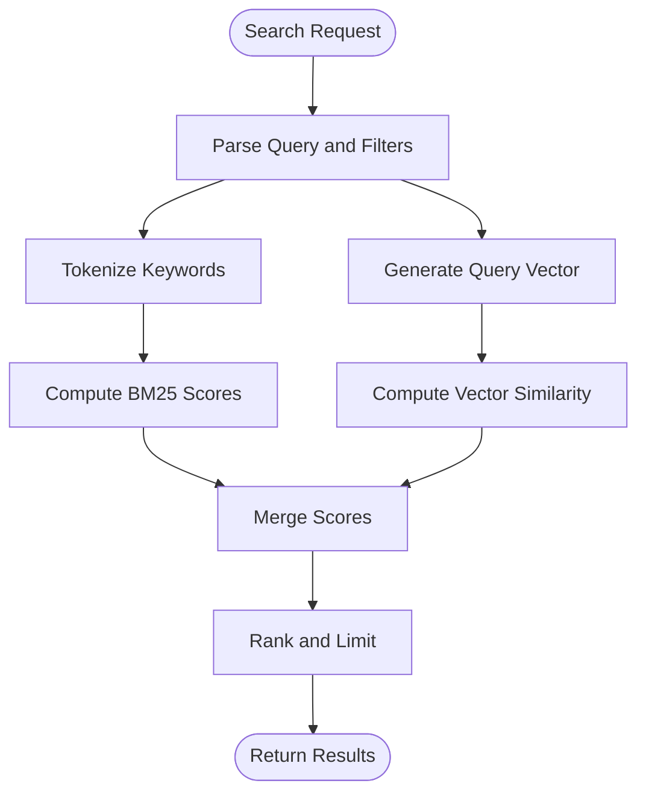

**Diagram sources**
- [src/services/qdrant/search.ts](file://src/services/qdrant/search.ts)
- [src/utils/qdrant-query-utils.ts](file://src/utils/qdrant-query-utils.ts)
- [src/utils/qdrant-vector-types.ts](file://src/utils/qdrant-vector-types.ts)
- [src/constants/builtin-search-meta.ts](file://src/constants/builtin-search-meta.ts)

**Section sources**
- [src/services/qdrant/search.ts](file://src/services/qdrant/search.ts)
- [src/utils/qdrant-query-utils.ts](file://src/utils/qdrant-query-utils.ts)
- [src/utils/qdrant-vector-types.ts](file://src/utils/qdrant-vector-types.ts)
- [src/constants/builtin-search-meta.ts](file://src/constants/builtin-search-meta.ts)

### Activation Search Fields and Backfill
Activation-related search fields optimize recall for activation patterns:
- Dedicated fields improve precision for activation workflows
- Backfill process populates missing fields for existing entries

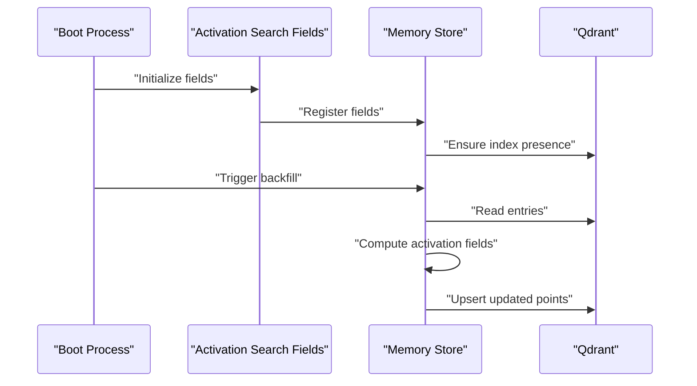

**Diagram sources**
- [src/services/memory/activation-search-fields.ts](file://src/services/memory/activation-search-fields.ts)
- [src/services/memory/activation-search-backfill.ts](file://src/services/memory/activation-search-backfill.ts)
- [src/services/memory/store-init.ts](file://src/services/memory/store-init.ts)

**Section sources**
- [src/services/memory/activation-search-fields.ts](file://src/services/memory/activation-search-fields.ts)
- [src/services/memory/activation-search-backfill.ts](file://src/services/memory/activation-search-backfill.ts)
- [src/services/memory/store-init.ts](file://src/services/memory/store-init.ts)

### Title Similarity Search
Title similarity enhances discovery by matching titles semantically:
- Computes title vectors separately
- Applies lightweight similarity checks during search

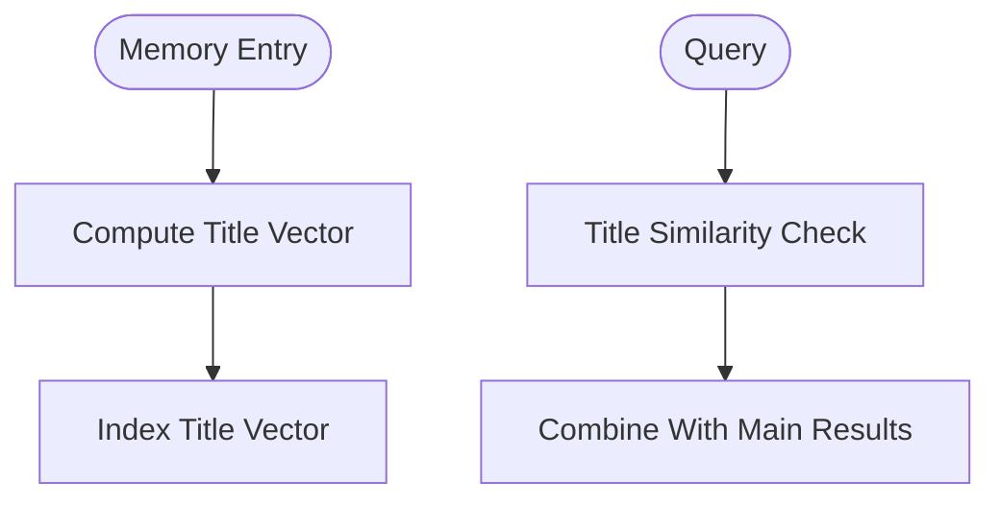

**Diagram sources**
- [src/services/memory/title-similarity-search.ts](file://src/services/memory/title-similarity-search.ts)

**Section sources**
- [src/services/memory/title-similarity-search.ts](file://src/services/memory/title-similarity-search.ts)

### Activation Pattern Payload
Activation pattern payloads define structured inputs for activation flows:
- Encodes step sequences and expected outputs
- Integrates with search to locate relevant protocols

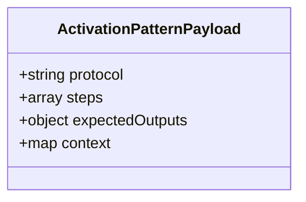

**Diagram sources**
- [src/services/memory/activation-pattern-payload.ts](file://src/services/memory/activation-pattern-payload.ts)

**Section sources**
- [src/services/memory/activation-pattern-payload.ts](file://src/services/memory/activation-pattern-payload.ts)

### Qdrant Service and Initialization
Qdrant service manages connections and collection setup:
- Connection pooling and retry logic
- Collection creation with appropriate vector configurations
- Resource provisioning for embedded content

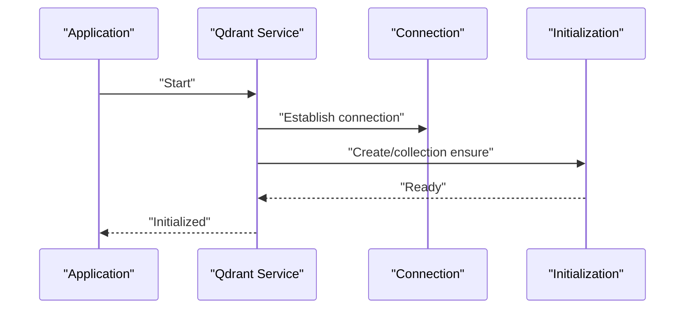

**Diagram sources**
- [src/services/qdrant/service.ts](file://src/services/qdrant/service.ts)
- [src/services/qdrant/connection.ts](file://src/services/qdrant/connection.ts)
- [src/services/qdrant/initialization.ts](file://src/services/qdrant/initialization.ts)
- [src/services/qdrant/resources.ts](file://src/services/qdrant/resources.ts)

**Section sources**
- [src/services/qdrant/service.ts](file://src/services/qdrant/service.ts)
- [src/services/qdrant/connection.ts](file://src/services/qdrant/connection.ts)
- [src/services/qdrant/initialization.ts](file://src/services/qdrant/initialization.ts)
- [src/services/qdrant/resources.ts](file://src/services/qdrant/resources.ts)

### Memory Updates and Retrieval
Updates and retrieval encapsulate Qdrant operations:
- Upsert points with vectors and payloads
- Retrieve points with filters and scoring
- Support batch operations for performance

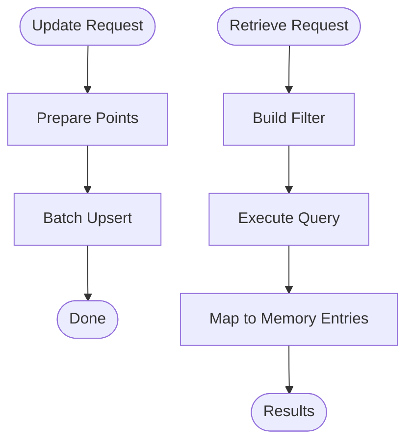

**Diagram sources**
- [src/services/qdrant/memory-updates.ts](file://src/services/qdrant/memory-updates.ts)
- [src/services/qdrant/memory-retrieval.ts](file://src/services/qdrant/memory-retrieval.ts)

**Section sources**
- [src/services/qdrant/memory-updates.ts](file://src/services/qdrant/memory-updates.ts)
- [src/services/qdrant/memory-retrieval.ts](file://src/services/qdrant/memory-retrieval.ts)

### Snapshots, Backup, and Recovery
Snapshots enable durable backups and recovery:
- Create snapshots for point sets or collections
- Restore from snapshots to rebuild state

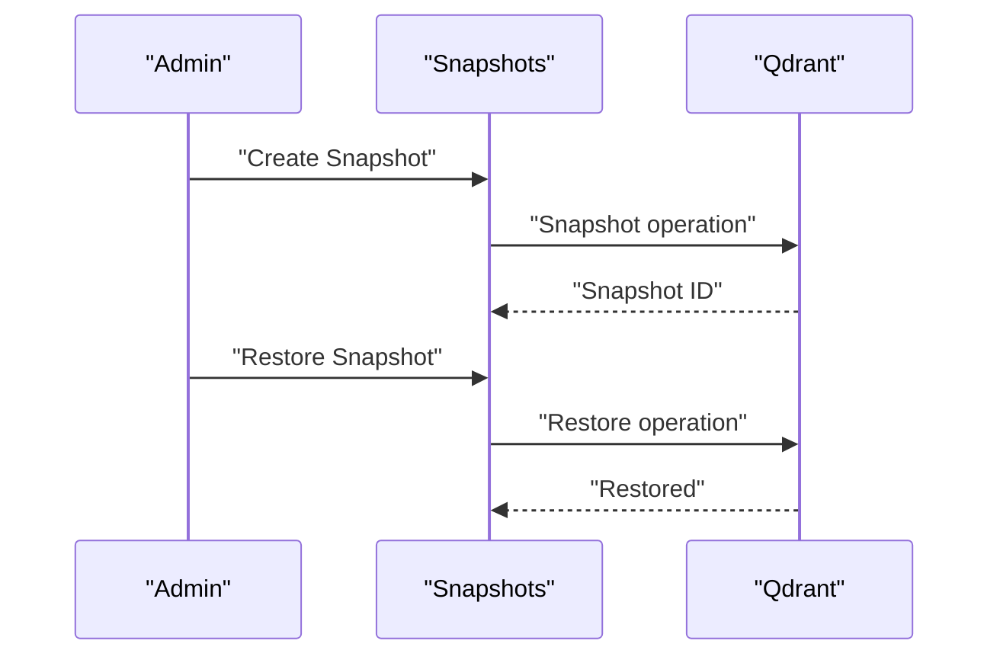

**Diagram sources**
- [src/services/qdrant/snapshots.ts](file://src/services/qdrant/snapshots.ts)

**Section sources**
- [src/services/qdrant/snapshots.ts](file://src/services/qdrant/snapshots.ts)

### Tools and HTTP Routes
Search tools and HTTP routes expose functionality:
- CLI tool validates schemas and formats outputs
- HTTP routes integrate with authentication and metrics

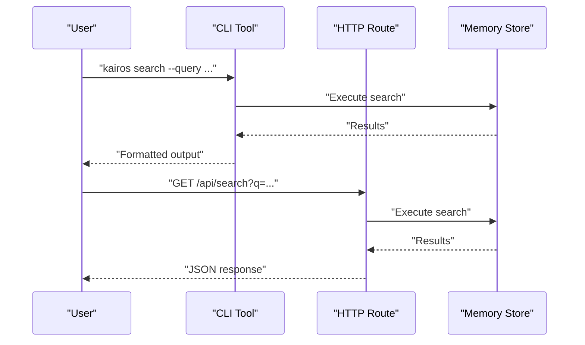

**Diagram sources**
- [src/tools/search.ts](file://src/tools/search.ts)
- [src/tools/search_output.ts](file://src/tools/search_output.ts)
- [src/tools/search_schema.ts](file://src/tools/search_schema.ts)
- [src/http/http-api-routes.ts](file://src/http/http-api-routes.ts)

**Section sources**
- [src/tools/search.ts](file://src/tools/search.ts)
- [src/tools/search_output.ts](file://src/tools/search_output.ts)
- [src/tools/search_schema.ts](file://src/tools/search_schema.ts)
- [src/http/http-api-routes.ts](file://src/http/http-api-routes.ts)

### Resource Bootstrapping
Resource bootstrapping loads embedded content into memory:
- Directory utilities scan and normalize files
- UUID mapper ensures stable references
- Boot process initializes resources and indexes them

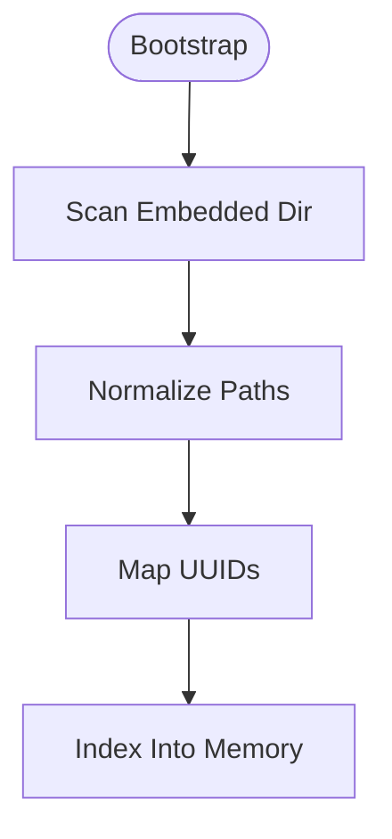

**Diagram sources**
- [src/resources/mem-resources-boot.ts](file://src/resources/mem-resources-boot.ts)
- [src/resources/mem-dir-utils.ts](file://src/resources/mem-dir-utils.ts)
- [src/resources/mem-uuid-mapper.ts](file://src/resources/mem-uuid-mapper.ts)

**Section sources**
- [src/resources/mem-resources-boot.ts](file://src/resources/mem-resources-boot.ts)
- [src/resources/mem-dir-utils.ts](file://src/resources/mem-dir-utils.ts)
- [src/resources/mem-uuid-mapper.ts](file://src/resources/mem-uuid-mapper.ts)

## Dependency Analysis
The memory system exhibits clear separation of concerns:
- Memory store depends on Qdrant service and embedding service
- Qdrant service depends on connection and initialization modules
- Embedding service depends on providers and config
- Adapters depend on helpers and handlers
- Tools and HTTP routes depend on memory store and schema validation

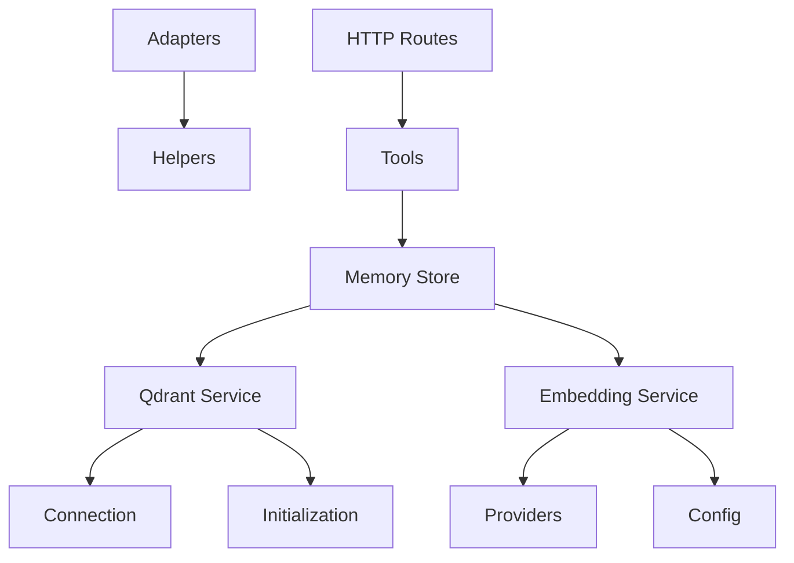

**Diagram sources**
- [src/services/memory/store.ts](file://src/services/memory/store.ts)
- [src/services/qdrant/service.ts](file://src/services/qdrant/service.ts)
- [src/services/embedding/service.ts](file://src/services/embedding/service.ts)
- [src/services/memory/adapter-builder.ts](file://src/services/memory/adapter-builder.ts)
- [src/tools/search.ts](file://src/tools/search.ts)
- [src/http/http-api-routes.ts](file://src/http/http-api-routes.ts)

**Section sources**
- [src/services/memory/store.ts](file://src/services/memory/store.ts)
- [src/services/qdrant/service.ts](file://src/services/qdrant/service.ts)
- [src/services/embedding/service.ts](file://src/services/embedding/service.ts)
- [src/services/memory/adapter-builder.ts](file://src/services/memory/adapter-builder.ts)
- [src/tools/search.ts](file://src/tools/search.ts)
- [src/http/http-api-routes.ts](file://src/http/http-api-routes.ts)

## Performance Considerations
- Vector dimensionality: Choose embedding dimensions aligned with model capacity and storage constraints
- Batch operations: Use bulk upserts to reduce network overhead
- Filtering: Apply precise filters to limit result sets before scoring
- Hybrid weighting: Tune BM25 vs vector weights for domain-specific relevance
- Caching: Cache frequent queries and precomputed vectors where appropriate
- Indexing: Ensure proper vector index types and shard distribution for scale
- Rate limiting: Respect provider quotas and implement backoff strategies

[No sources needed since this section provides general guidance]

## Troubleshooting Guide
Common issues and diagnostics:
- Connection failures: Verify Qdrant endpoint, credentials, and TLS settings
- Index mismatches: Confirm collection schema matches expected vector dimensions
- Empty results: Check filters, tokenization, and embedding availability
- Slow queries: Review filter complexity, top-k limits, and index configuration
- Snapshot errors: Validate snapshot IDs and permissions for restore operations

Operational hooks:
- Health checks for Qdrant connectivity
- Metrics for search latency and error rates
- Logs for adapter processing and embedding generation

**Section sources**
- [src/services/qdrant/connection.ts](file://src/services/qdrant/connection.ts)
- [src/services/qdrant/initialization.ts](file://src/services/qdrant/initialization.ts)
- [src/services/qdrant/search.ts](file://src/services/qdrant/search.ts)
- [src/services/qdrant/snapshots.ts](file://src/services/qdrant/snapshots.ts)

## Conclusion
The Kairos MCP memory system provides a robust, extensible foundation for semantic search powered by Qdrant. Its modular design separates concerns across storage, embeddings, adapters, and interfaces, enabling scalable and maintainable operations. By leveraging hybrid search, rich metadata, and artifact references, it supports advanced use cases while offering clear paths for customization and optimization.

[No sources needed since this section summarizes without analyzing specific files]

## Appendices

### Configuration Options
- Embedding provider selection and parameters
- BM25 tokenizer settings and stop words
- Qdrant collection schema and index type
- Search filters and scoring weights
- Snapshot retention and restore policies

**Section sources**
- [src/services/embedding/config.ts](file://src/services/embedding/config.ts)
- [src/services/qdrant/initialization.ts](file://src/services/qdrant/initialization.ts)
- [src/services/qdrant/search.ts](file://src/services/qdrant/search.ts)
- [src/services/qdrant/snapshots.ts](file://src/services/qdrant/snapshots.ts)

### Migration Processes
- Schema evolution for memory entries and metadata
- Backfill routines for new fields and computed values
- Versioned migrations for Qdrant collections

**Section sources**
- [src/services/memory/activation-search-backfill.ts](file://src/services/memory/activation-search-backfill.ts)
- [src/services/qdrant/initialization.ts](file://src/services/qdrant/initialization.ts)

### Lifecycle Management and Cleanup Policies
- TTL-based cleanup for ephemeral entries
- Space-scoped deletion and archival
- Garbage collection for unreferenced artifacts

**Section sources**
- [src/services/qdrant/memory-updates.ts](file://src/services/qdrant/memory-updates.ts)
- [src/services/qdrant/memory-retrieval.ts](file://src/services/qdrant/memory-retrieval.ts)

### Monitoring Metrics
- Search latency histograms
- Embedding throughput and error rates
- Qdrant health and snapshot status
- Adapter processing durations

**Section sources**
- [src/services/qdrant/service.ts](file://src/services/qdrant/service.ts)
- [src/services/embedding/service.ts](file://src/services/embedding/service.ts)
- [src/services/memory/store-methods.ts](file://src/services/memory/store-methods.ts)

### Scaling Considerations
- Horizontal scaling of Qdrant nodes and shards
- Vertical scaling for embedding providers
- Load balancing and connection pooling
- Partitioning by space or tenant

**Section sources**
- [src/services/qdrant/connection.ts](file://src/services/qdrant/connection.ts)
- [src/services/qdrant/service.ts](file://src/services/qdrant/service.ts)

### Custom Adapter Development
Steps to develop a custom adapter:
- Implement extraction and enrichment functions
- Use helpers for parsing and normalization
- Register adapter via builder configuration
- Test with sample inputs and validate outputs

**Section sources**
- [src/services/memory/adapter-builder.ts](file://src/services/memory/adapter-builder.ts)
- [src/services/memory/store-adapter.ts](file://src/services/memory/store-adapter.ts)
- [src/services/memory/store-adapter-helpers.ts](file://src/services/memory/store-adapter-helpers.ts)

### Search Query Optimization Techniques
- Narrow filters early to reduce candidate set
- Prefer exact matches for high-cardinality fields
- Adjust BM25 weight for keyword-heavy domains
- Use title similarity for quick wins in discovery
- Leverage activation fields for workflow-centric searches

**Section sources**
- [src/services/qdrant/search.ts](file://src/services/qdrant/search.ts)
- [src/services/memory/title-similarity-search.ts](file://src/services/memory/title-similarity-search.ts)
- [src/services/memory/activation-search-fields.ts](file://src/services/memory/activation-search-fields.ts)

### Example Scripts and Utilities
- Deploy-time search scripts for testing and validation
- Utility functions for vector and query construction
- Built-in metadata constants for search scoping

**Section sources**
- [scripts/deploy-run-qdrant-search.mjs](file://scripts/deploy-run-qdrant-search.mjs)
- [src/utils/qdrant-query-utils.ts](file://src/utils/qdrant-query-utils.ts)
- [src/utils/qdrant-vector-types.ts](file://src/utils/qdrant-vector-types.ts)
- [src/constants/builtin-search-meta.ts](file://src/constants/builtin-search-meta.ts)