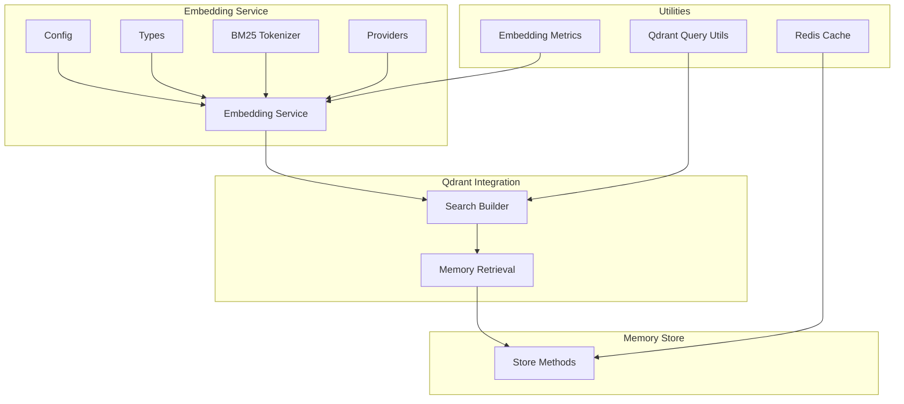
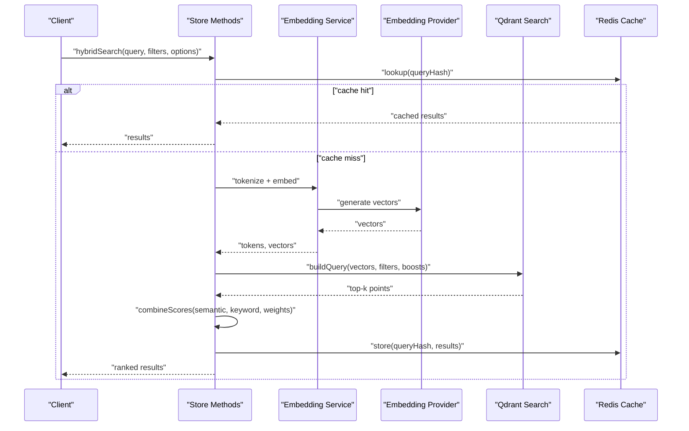
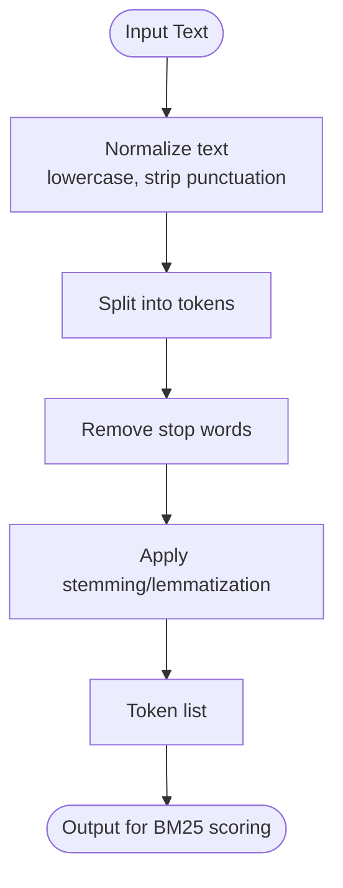
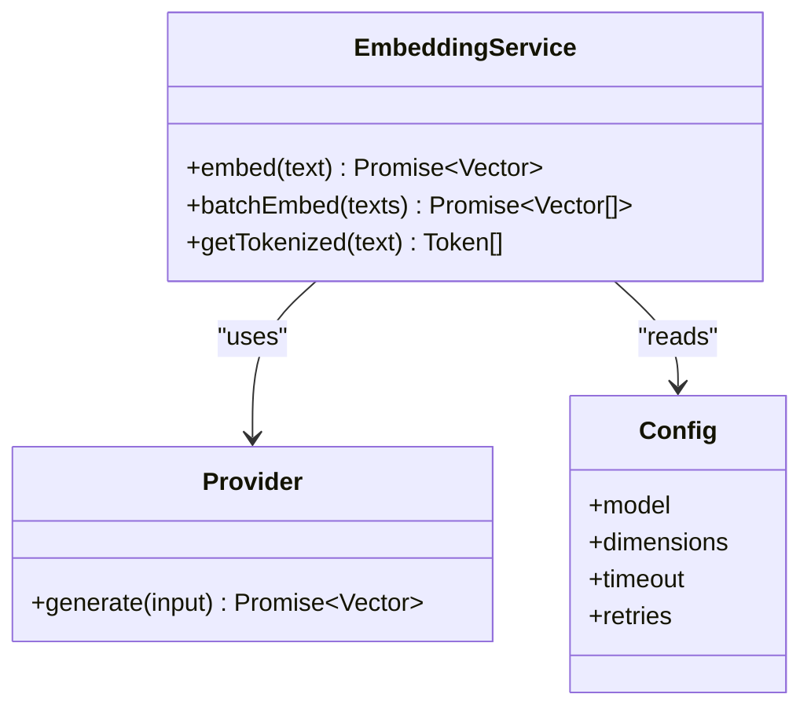
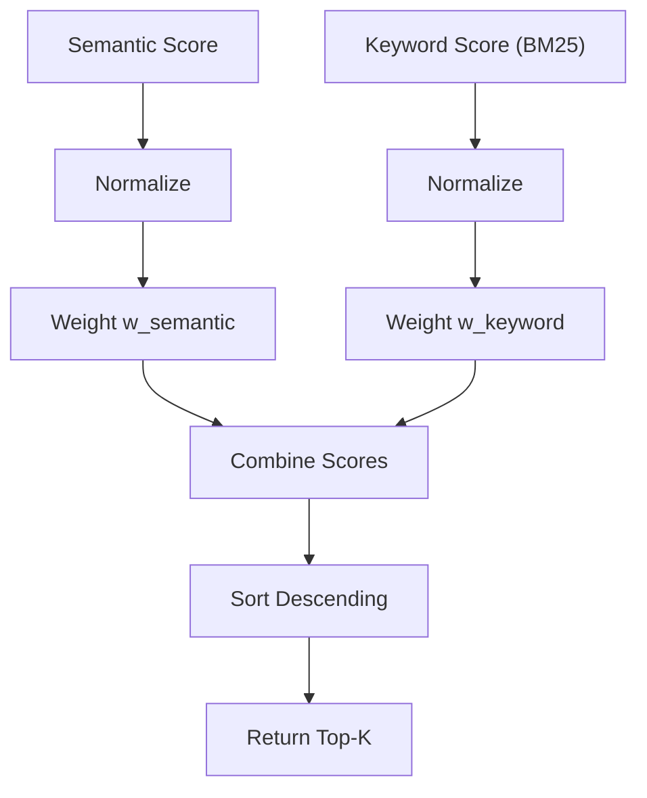
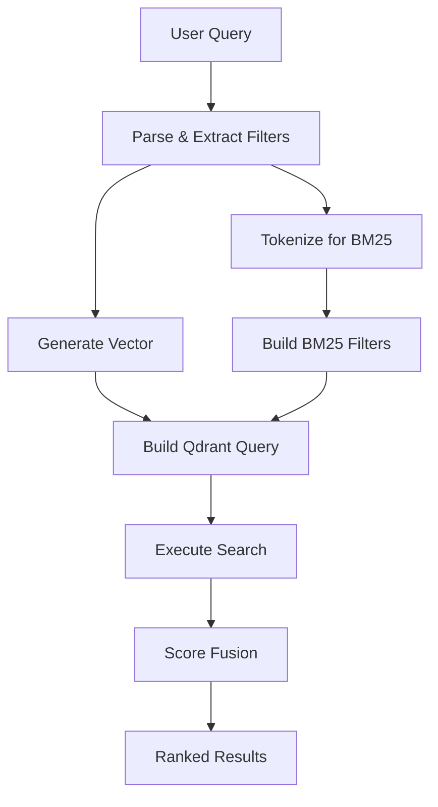
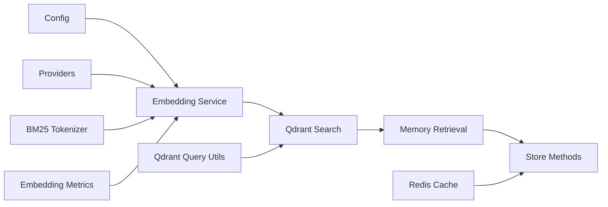

# Hybrid Search Algorithms

<cite>
**Referenced Files in This Document**
- [bm25-tokenizer.ts](file://src/services/embedding/bm25-tokenizer.ts)
- [service.ts](file://src/services/embedding/service.ts)
- [types.ts](file://src/services/embedding/types.ts)
- [config.ts](file://src/services/embedding/config.ts)
- [providers.ts](file://src/services/embedding/providers.ts)
- [memory-retrieval.ts](file://src/services/qdrant/memory-retrieval.ts)
- [search.ts](file://src/services/qdrant/search.ts)
- [store-methods.ts](file://src/services/memory/store-methods.ts)
- [qdrant-query-utils.ts](file://src/utils/qdrant-query-utils.ts)
- [redis-cache.ts](file://src/services/redis-cache.ts)
- [embedding-metrics.ts](file://src/services/metrics/embedding-metrics.ts)
</cite>

## Table of Contents
1. [Introduction](#introduction)
2. [Project Structure](#project-structure)
3. [Core Components](#core-components)
4. [Architecture Overview](#architecture-overview)
5. [Detailed Component Analysis](#detailed-component-analysis)
6. [Dependency Analysis](#dependency-analysis)
7. [Performance Considerations](#performance-considerations)
8. [Troubleshooting Guide](#troubleshooting-guide)
9. [Conclusion](#conclusion)

## Introduction
This document explains the hybrid search algorithms that combine semantic similarity with keyword matching. It covers BM25 tokenization, vector embedding generation, scoring and ranking strategies, query construction patterns, weight balancing between semantic and keyword components, boosting techniques, custom scoring functions, performance optimization, query caching, and real-time index updates. The goal is to provide both conceptual clarity and code-level traceability for engineers implementing or tuning hybrid search.

## Project Structure
The hybrid search implementation spans several modules:
- Embedding service layer for tokenization and vector generation
- Qdrant integration for vector storage and retrieval
- Memory store orchestration for combining results
- Utilities for building Qdrant queries and managing Redis-based caches
- Metrics for monitoring embedding and search performance

**Diagram sources**
- [config.ts](file://src/services/embedding/config.ts)
- [types.ts](file://src/services/embedding/types.ts)
- [bm25-tokenizer.ts](file://src/services/embedding/bm25-tokenizer.ts)
- [service.ts](file://src/services/embedding/service.ts)
- [providers.ts](file://src/services/embedding/providers.ts)
- [search.ts](file://src/services/qdrant/search.ts)
- [memory-retrieval.ts](file://src/services/qdrant/memory-retrieval.ts)
- [store-methods.ts](file://src/services/memory/store-methods.ts)
- [qdrant-query-utils.ts](file://src/utils/qdrant-query-utils.ts)
- [redis-cache.ts](file://src/services/redis-cache.ts)
- [embedding-metrics.ts](file://src/services/metrics/embedding-metrics.ts)

**Section sources**
- [bm25-tokenizer.ts](file://src/services/embedding/bm25-tokenizer.ts)
- [service.ts](file://src/services/embedding/service.ts)
- [types.ts](file://src/services/embedding/types.ts)
- [config.ts](file://src/services/embedding/config.ts)
- [providers.ts](file://src/services/embedding/providers.ts)
- [search.ts](file://src/services/qdrant/search.ts)
- [memory-retrieval.ts](file://src/services/qdrant/memory-retrieval.ts)
- [store-methods.ts](file://src/services/memory/store-methods.ts)
- [qdrant-query-utils.ts](file://src/utils/qdrant-query-utils.ts)
- [redis-cache.ts](file://src/services/redis-cache.ts)
- [embedding-metrics.ts](file://src/services/metrics/embedding-metrics.ts)

## Core Components
- BM25 tokenizer: Converts text into tokens suitable for keyword matching and BM25 scoring.
- Embedding service: Orchestrates tokenization, vector embedding generation, and exposes a unified interface for hybrid search.
- Providers: Abstracts different embedding providers and their configurations.
- Qdrant search builder: Constructs Qdrant queries combining vector similarity and filter conditions.
- Memory retrieval: Coordinates retrieval from Qdrant and merges with other data sources if needed.
- Store methods: High-level operations for searching, updating, and maintaining memory artifacts.
- Query utilities: Helpers for building Qdrant filters and payloads.
- Redis cache: Caches embeddings and search results to reduce latency and provider costs.
- Metrics: Tracks embedding and search performance for observability.

**Section sources**
- [bm25-tokenizer.ts](file://src/services/embedding/bm25-tokenizer.ts)
- [service.ts](file://src/services/embedding/service.ts)
- [providers.ts](file://src/services/embedding/providers.ts)
- [search.ts](file://src/services/qdrant/search.ts)
- [memory-retrieval.ts](file://src/services/qdrant/memory-retrieval.ts)
- [store-methods.ts](file://src/services/memory/store-methods.ts)
- [qdrant-query-utils.ts](file://src/utils/qdrant-query-utils.ts)
- [redis-cache.ts](file://src/services/redis-cache.ts)
- [embedding-metrics.ts](file://src/services/metrics/embedding-metrics.ts)

## Architecture Overview
Hybrid search combines two complementary signals:
- Semantic similarity via vector embeddings
- Keyword relevance via BM25 on tokenized fields

The flow:
1. Parse and normalize the user query.
2. Tokenize using BM25 tokenizer for keyword scoring.
3. Generate vector embeddings via configured provider(s).
4. Build a Qdrant query that includes:
   - Vector similarity score
   - Filter conditions (e.g., space, tags, date ranges)
   - Optional payload boosts for keywords or metadata
5. Retrieve top-k results from Qdrant.
6. Optionally re-rank by combining semantic and keyword scores with configurable weights.
7. Apply caching and metrics instrumentation.

**Diagram sources**
- [store-methods.ts](file://src/services/memory/store-methods.ts)
- [service.ts](file://src/services/embedding/service.ts)
- [providers.ts](file://src/services/embedding/providers.ts)
- [search.ts](file://src/services/qdrant/search.ts)
- [redis-cache.ts](file://src/services/redis-cache.ts)

## Detailed Component Analysis

### BM25 Tokenization Process
Responsibilities:
- Normalize input text (lowercasing, punctuation handling)
- Split into tokens based on language-aware rules
- Remove stop words and apply stemming/lemmatization where applicable
- Produce stable token sequences for consistent BM25 scoring

Key considerations:
- Deterministic tokenization ensures repeatable BM25 scores across runs
- Token length normalization affects term frequency scaling
- Stop word lists and stemming impact recall vs precision trade-offs

**Diagram sources**
- [bm25-tokenizer.ts](file://src/services/embedding/bm25-tokenizer.ts)

**Section sources**
- [bm25-tokenizer.ts](file://src/services/embedding/bm25-tokenizer.ts)

### Vector Embedding Generation
Responsibilities:
- Convert normalized text into dense vectors using configured embedding providers
- Handle batching and rate limiting
- Cache embeddings to avoid redundant calls
- Provide fallbacks and error propagation

Configuration:
- Model selection and dimensions
- Provider-specific parameters (temperature, truncation)
- Timeout and retry policies

**Diagram sources**
- [service.ts](file://src/services/embedding/service.ts)
- [providers.ts](file://src/services/embedding/providers.ts)
- [config.ts](file://src/services/embedding/config.ts)

**Section sources**
- [service.ts](file://src/services/embedding/service.ts)
- [providers.ts](file://src/services/embedding/providers.ts)
- [config.ts](file://src/services/embedding/config.ts)
- [types.ts](file://src/services/embedding/types.ts)

### Scoring Mechanisms and Ranking Strategies
Scoring components:
- Semantic score: cosine similarity between query vector and document vectors
- Keyword score: BM25 over tokenized fields
- Combined score: weighted sum or more complex fusion (e.g., reciprocal rank fusion)

Ranking strategy:
- Compute per-document semantic and keyword scores
- Normalize scores to a common scale
- Apply weights to balance semantic vs keyword contributions
- Sort by combined score and return top-k

**Diagram sources**
- [search.ts](file://src/services/qdrant/search.ts)
- [memory-retrieval.ts](file://src/services/qdrant/memory-retrieval.ts)
- [store-methods.ts](file://src/services/memory/store-methods.ts)

**Section sources**
- [search.ts](file://src/services/qdrant/search.ts)
- [memory-retrieval.ts](file://src/services/qdrant/memory-retrieval.ts)
- [store-methods.ts](file://src/services/memory/store-methods.ts)

### Query Construction Patterns
Patterns:
- Pure semantic search: vector-only query with optional payload filters
- Pure keyword search: BM25 over tokenized fields with filters
- Hybrid search: vector similarity plus BM25 keyword scoring
- Multi-filter queries: combine space, tags, date ranges, and content filters

Filter composition:
- Use utility helpers to build Qdrant filters
- Support nested conditions and boolean operators
- Ensure payload fields are indexed appropriately

Boosting:
- Field-level boosting for titles, headings, or metadata
- Term-level boosting for important keywords
- Time decay or freshness boosts

**Diagram sources**
- [qdrant-query-utils.ts](file://src/utils/qdrant-query-utils.ts)
- [search.ts](file://src/services/qdrant/search.ts)
- [bm25-tokenizer.ts](file://src/services/embedding/bm25-tokenizer.ts)

**Section sources**
- [qdrant-query-utils.ts](file://src/utils/qdrant-query-utils.ts)
- [search.ts](file://src/services/qdrant/search.ts)

### Weight Balancing Between Semantic and Keyword Searches
Approach:
- Expose configuration for weights w_semantic and w_keyword
- Normalize scores before weighting to prevent dominance by one component
- Allow dynamic adjustment per query type or user preference

Best practices:
- Calibrate weights on validation sets
- Monitor precision/recall trade-offs
- Consider adaptive weighting based on query characteristics (e.g., short vs long queries)

**Section sources**
- [store-methods.ts](file://src/services/memory/store-methods.ts)
- [search.ts](file://src/services/qdrant/search.ts)

### Boosting Techniques and Custom Scoring Functions
Boosting:
- Title boost: increase weight for matches in title fields
- Tag boost: elevate documents with specific tags
- Recency boost: decay older documents unless strongly relevant

Custom scoring:
- Implement domain-specific features (e.g., citation count, quality score)
- Combine with semantic and keyword scores via linear or non-linear fusion
- Validate stability and monotonicity of ranking

**Section sources**
- [search.ts](file://src/services/qdrant/search.ts)
- [memory-retrieval.ts](file://src/services/qdrant/memory-retrieval.ts)

### Examples of Complex Search Queries
Examples:
- Multi-filter hybrid search: semantic query with space filter, tag inclusion, and date range
- Boosted keyword search: BM25 with title and heading boosts
- Adaptive hybrid: adjust weights based on query length and presence of named entities

Implementation guidance:
- Compose filters using utility helpers
- Pass explicit weights and boost parameters
- Validate payload schema for efficient filtering

**Section sources**
- [qdrant-query-utils.ts](file://src/utils/qdrant-query-utils.ts)
- [store-methods.ts](file://src/services/memory/store-methods.ts)

### Real-Time Index Updates
Update flows:
- Upsert new or updated documents with vectors and payload
- Delete obsolete entries
- Maintain index consistency during concurrent writes

Considerations:
- Batch upserts for throughput
- Idempotent operations to handle retries
- Versioning or timestamps for conflict resolution

**Section sources**
- [memory-retrieval.ts](file://src/services/qdrant/memory-retrieval.ts)
- [store-methods.ts](file://src/services/memory/store-methods.ts)

## Dependency Analysis
Component relationships:
- Embedding service depends on providers and config
- Qdrant search builder depends on query utilities
- Store methods orchestrate embedding, search, and caching
- Redis cache decouples repeated expensive operations
- Metrics instrument embedding and search paths

**Diagram sources**
- [config.ts](file://src/services/embedding/config.ts)
- [providers.ts](file://src/services/embedding/providers.ts)
- [bm25-tokenizer.ts](file://src/services/embedding/bm25-tokenizer.ts)
- [service.ts](file://src/services/embedding/service.ts)
- [search.ts](file://src/services/qdrant/search.ts)
- [qdrant-query-utils.ts](file://src/utils/qdrant-query-utils.ts)
- [memory-retrieval.ts](file://src/services/qdrant/memory-retrieval.ts)
- [store-methods.ts](file://src/services/memory/store-methods.ts)
- [redis-cache.ts](file://src/services/redis-cache.ts)
- [embedding-metrics.ts](file://src/services/metrics/embedding-metrics.ts)

**Section sources**
- [service.ts](file://src/services/embedding/service.ts)
- [search.ts](file://src/services/qdrant/search.ts)
- [store-methods.ts](file://src/services/memory/store-methods.ts)
- [redis-cache.ts](file://src/services/redis-cache.ts)
- [embedding-metrics.ts](file://src/services/metrics/embedding-metrics.ts)

## Performance Considerations
- Tokenization efficiency: precompute and cache tokens for repeated queries
- Embedding batching: group requests to reduce overhead and respect rate limits
- Vector dimensionality: choose models balancing accuracy and latency
- Index design: ensure payload fields used in filters are indexed
- Query caching: leverage Redis to cache frequent queries and embeddings
- Result caching: cache ranked results for identical queries within TTL
- Monitoring: track embedding latency, Qdrant response times, and cache hit rates

[No sources needed since this section provides general guidance]

## Troubleshooting Guide
Common issues:
- Low recall due to aggressive stop word removal or stemming
- Poor ranking when weights are uncalibrated
- Cache misses causing high latency; verify TTL and key hashing
- Rate limit errors from embedding providers; implement backoff and retries
- Inconsistent results due to non-deterministic tokenization; ensure stable tokenizers

Debugging steps:
- Inspect tokenized output and BM25 scores
- Log intermediate semantic and keyword scores
- Validate Qdrant filters and payload schema
- Check metrics for anomalies in embedding and search paths

**Section sources**
- [embedding-metrics.ts](file://src/services/metrics/embedding-metrics.ts)
- [redis-cache.ts](file://src/services/redis-cache.ts)
- [search.ts](file://src/services/qdrant/search.ts)

## Conclusion
Hybrid search leverages both semantic similarity and keyword matching to deliver robust, accurate results. By carefully designing tokenization, embedding generation, scoring fusion, and query construction, systems can achieve strong performance across diverse use cases. Proper configuration of weights, boosting, and caching, along with continuous monitoring and calibration, ensures reliable and scalable search experiences.