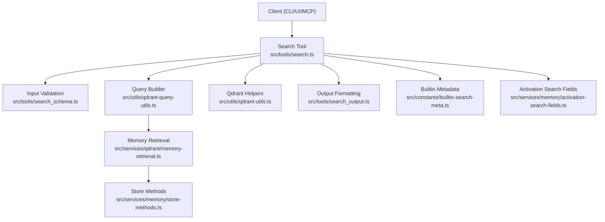
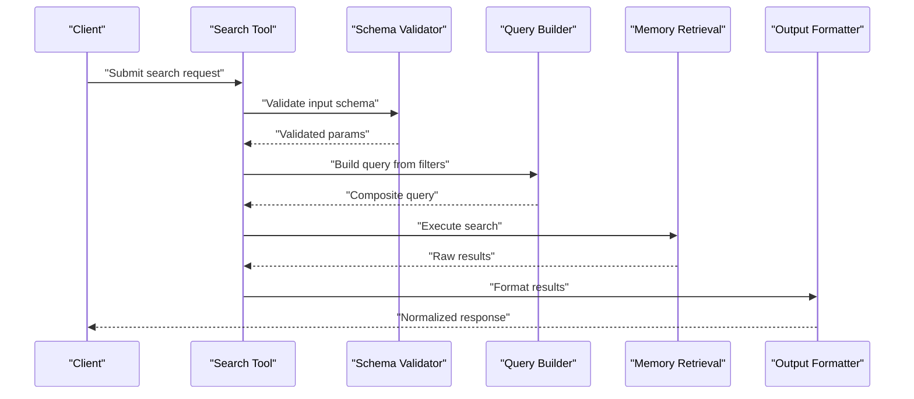
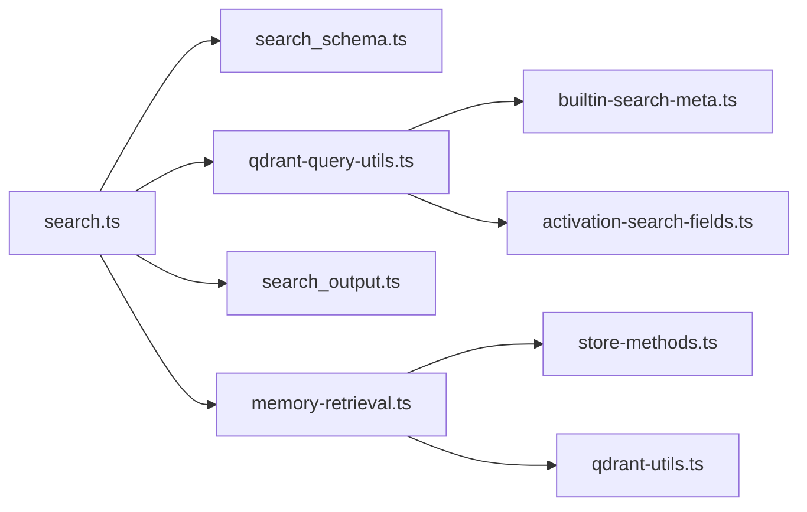
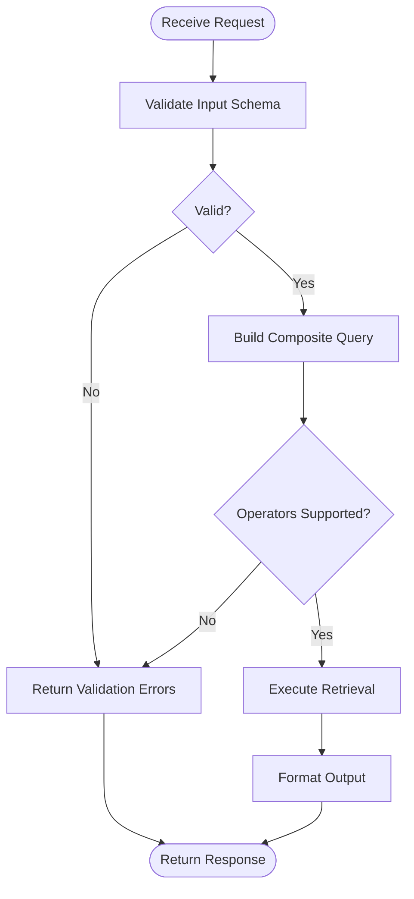

# Query Construction and Filtering

<cite>
**Referenced Files in This Document**
- [search.ts](file://src/tools/search.ts)
- [search_schema.ts](file://src/tools/search_schema.ts)
- [search_output.ts](file://src/tools/search_output.ts)
- [qdrant-query-utils.ts](file://src/utils/qdrant-query-utils.ts)
- [qdrant-utils.ts](file://src/utils/qdrant-utils.ts)
- [memory-retrieval.ts](file://src/services/qdrant/memory-retrieval.ts)
- [store-methods.ts](file://src/services/memory/store-methods.ts)
- [activation-search-fields.ts](file://src/services/memory/activation-search-fields.ts)
- [constants/builtin-search-meta.ts](file://src/constants/builtin-search-meta.ts)
- [http-api-snapshot.ts](file://src/http/http-api-snapshot.ts)
- [cli-commands-basic.test.ts](file://tests/integration/cli-commands-basic.test.ts)
- [kairos-search-case1.test.ts](file://tests/integration/kairos-search-case1.test.ts)
- [kairos-search-case2.test.ts](file://tests/integration/kairos-search-case2.test.ts)
- [kairos-search-case3.test.ts](file://tests/integration/kairos-search-case3.test.ts)
- [kairos-search-case4.test.ts](file://tests/integration/kairos-search-case4.test.ts)
- [kairos-search-perfect-matches.test.ts](file://tests/integration/kairos-search-perfect-matches.test.ts)
- [kairos-search-scores.test.ts](file://tests/integration/kairos-search-scores.test.ts)
- [kairos-search-forbidden-behavior.test.ts](file://tests/integration/kairos-search-forbidden-behavior.test.ts)
</cite>

## Table of Contents
1. [Introduction](#introduction)
2. [Project Structure](#project-structure)
3. [Core Components](#core-components)
4. [Architecture Overview](#architecture-overview)
5. [Detailed Component Analysis](#detailed-component-analysis)
6. [Dependency Analysis](#dependency-analysis)
7. [Performance Considerations](#performance-considerations)
8. [Troubleshooting Guide](#troubleshooting-guide)
9. [Conclusion](#conclusion)
10. [Appendices](#appendices)

## Introduction
This document explains how to construct queries and apply filters across the system’s search capabilities. It covers query syntax, supported operators, filter combinations, field-specific search configurations, metadata filtering, activation pattern matching, advanced examples with nested conditions and boolean operations, validation and error handling, debugging tools, and optimization techniques for complex filter combinations.

## Project Structure
The search feature is implemented as a tool with a strict schema, backed by Qdrant vector storage and memory utilities. The main entry points are:
- Tool definition and orchestration
- Schema validation for inputs
- Output formatting
- Query building and translation to storage layer
- Storage retrieval and result mapping

**Diagram sources**
- [search.ts](file://src/tools/search.ts)
- [search_schema.ts](file://src/tools/search_schema.ts)
- [search_output.ts](file://src/tools/search_output.ts)
- [qdrant-query-utils.ts](file://src/utils/qdrant-query-utils.ts)
- [qdrant-utils.ts](file://src/utils/qdrant-utils.ts)
- [memory-retrieval.ts](file://src/services/qdrant/memory-retrieval.ts)
- [store-methods.ts](file://src/services/memory/store-methods.ts)
- [builtin-search-meta.ts](file://src/constants/builtin-search-meta.ts)
- [activation-search-fields.ts](file://src/services/memory/activation-search-fields.ts)

**Section sources**
- [search.ts](file://src/tools/search.ts)
- [search_schema.ts](file://src/tools/search_schema.ts)
- [search_output.ts](file://src/tools/search_output.ts)
- [qdrant-query-utils.ts](file://src/utils/qdrant-query-utils.ts)
- [qdrant-utils.ts](file://src/utils/qdrant-utils.ts)
- [memory-retrieval.ts](file://src/services/qdrant/memory-retrieval.ts)
- [store-methods.ts](file://src/services/memory/store-methods.ts)
- [builtin-search-meta.ts](file://src/constants/builtin-search-meta.ts)
- [activation-search-fields.ts](file://src/services/memory/activation-search-fields.ts)

## Core Components
- Search Tool: Orchestrates input validation, query construction, execution, and output formatting.
- Input Schema: Defines allowed fields, types, constraints, and default behaviors for search requests.
- Query Builder: Translates high-level filters into low-level storage predicates and vector search parameters.
- Memory Retrieval: Executes searches against Qdrant and maps results back to domain objects.
- Output Formatter: Normalizes results for consistent consumption by clients.
- Builtin Metadata: Provides predefined metadata keys used for filtering.
- Activation Search Fields: Defines fields relevant to activation patterns and their semantics.

Key responsibilities:
- Validate and normalize user-provided filters.
- Combine text search with structured metadata filters.
- Support boolean logic and range filters.
- Map results to stable output shapes.

**Section sources**
- [search.ts](file://src/tools/search.ts)
- [search_schema.ts](file://src/tools/search_schema.ts)
- [search_output.ts](file://src/tools/search_output.ts)
- [qdrant-query-utils.ts](file://src/utils/qdrant-query-utils.ts)
- [memory-retrieval.ts](file://src/services/qdrant/memory-retrieval.ts)
- [builtin-search-meta.ts](file://src/constants/builtin-search-meta.ts)
- [activation-search-fields.ts](file://src/services/memory/activation-search-fields.ts)

## Architecture Overview
The search flow validates inputs, builds a composite query, executes it via the storage layer, and returns normalized results.

**Diagram sources**
- [search.ts](file://src/tools/search.ts)
- [search_schema.ts](file://src/tools/search_schema.ts)
- [qdrant-query-utils.ts](file://src/utils/qdrant-query-utils.ts)
- [memory-retrieval.ts](file://src/services/qdrant/memory-retrieval.ts)
- [search_output.ts](file://src/tools/search_output.ts)

## Detailed Component Analysis

### Search Tool and Orchestration
Responsibilities:
- Accepts search parameters including text, filters, pagination, and options.
- Delegates validation to the schema module.
- Builds a composite query combining full-text and structured filters.
- Invokes retrieval and formats output.

Operational notes:
- Enforces limits on page size and maximum results.
- Applies tenant or space scoping when provided.
- Ensures deterministic ordering and score normalization where applicable.

**Section sources**
- [search.ts](file://src/tools/search.ts)

### Input Schema and Validation
Responsibilities:
- Defines required and optional fields for search requests.
- Validates types, ranges, and allowed values.
- Normalizes ambiguous inputs (e.g., whitespace trimming).
- Rejects unsupported operator combinations early.

Common validations:
- Non-empty text when no other filters are present.
- Numeric bounds for range filters.
- Allowed enum values for mode or scoring options.
- Maximum depth for nested conditions.

Error behavior:
- Returns descriptive errors for invalid schemas.
- Prevents execution until all constraints pass.

**Section sources**
- [search_schema.ts](file://src/tools/search_schema.ts)

### Query Builder and Filter Semantics
Responsibilities:
- Converts high-level filters into storage predicates.
- Supports boolean composition (AND/OR/NOT).
- Handles range filters (greater-than, less-than, inclusive/exclusive).
- Maps field names to internal storage keys.
- Combines text search with structured filters.

Supported constructs:
- Equality and inequality comparisons.
- Presence checks for metadata fields.
- Range filters on numeric/date-like fields.
- Nested boolean groups for complex expressions.
- Text search with optional fuzzy or prefix modes.

Field mapping:
- Uses builtin metadata keys for standard fields.
- Resolves activation-related fields via activation search fields.

**Section sources**
- [qdrant-query-utils.ts](file://src/utils/qdrant-query-utils.ts)
- [builtin-search-meta.ts](file://src/constants/builtin-search-meta.ts)
- [activation-search-fields.ts](file://src/services/memory/activation-search-fields.ts)

### Storage Retrieval and Result Mapping
Responsibilities:
- Executes vector similarity search combined with payload filters.
- Applies pagination and sorting.
- Maps stored points to domain objects.
- Preserves scores and metadata for downstream use.

Integration points:
- Uses Qdrant client helpers for efficient querying.
- Leverages store methods for common operations like listing and counting.

**Section sources**
- [memory-retrieval.ts](file://src/services/qdrant/memory-retrieval.ts)
- [store-methods.ts](file://src/services/memory/store-methods.ts)
- [qdrant-utils.ts](file://src/utils/qdrant-utils.ts)

### Output Formatting
Responsibilities:
- Normalizes result shape across different callers.
- Includes identifiers, scores, matched metadata, and optional highlights.
- Ensures stable field naming and order.

**Section sources**
- [search_output.ts](file://src/tools/search_output.ts)

### HTTP Snapshot Endpoint
Responsibilities:
- Exposes a snapshot of current search state or configuration for diagnostics.
- Useful for debugging and verifying active filters and mappings.

**Section sources**
- [http-api-snapshot.ts](file://src/http/http-api-snapshot.ts)

## Dependency Analysis
The following diagram shows key dependencies between components involved in query construction and filtering.

**Diagram sources**
- [search.ts](file://src/tools/search.ts)
- [search_schema.ts](file://src/tools/search_schema.ts)
- [qdrant-query-utils.ts](file://src/utils/qdrant-query-utils.ts)
- [search_output.ts](file://src/tools/search_output.ts)
- [builtin-search-meta.ts](file://src/constants/builtin-search-meta.ts)
- [activation-search-fields.ts](file://src/services/memory/activation-search-fields.ts)
- [memory-retrieval.ts](file://src/services/qdrant/memory-retrieval.ts)
- [store-methods.ts](file://src/services/memory/store-methods.ts)
- [qdrant-utils.ts](file://src/utils/qdrant-utils.ts)

**Section sources**
- [search.ts](file://src/tools/search.ts)
- [search_schema.ts](file://src/tools/search_schema.ts)
- [qdrant-query-utils.ts](file://src/utils/qdrant-query-utils.ts)
- [search_output.ts](file://src/tools/search_output.ts)
- [builtin-search-meta.ts](file://src/constants/builtin-search-meta.ts)
- [activation-search-fields.ts](file://src/services/memory/activation-search-fields.ts)
- [memory-retrieval.ts](file://src/services/qdrant/memory-retrieval.ts)
- [store-methods.ts](file://src/services/memory/store-methods.ts)
- [qdrant-utils.ts](file://src/utils/qdrant-utils.ts)

## Performance Considerations
- Prefer precise metadata filters to reduce candidate set before vector search.
- Use equality and presence filters on indexed payload fields when available.
- Avoid overly broad text-only queries; combine with at least one structural filter.
- Limit page sizes and avoid deep pagination; prefer cursor-based approaches if supported.
- Reuse validated schemas and prebuilt filter trees for repeated queries.
- Monitor and tune top-k and similarity thresholds based on workload characteristics.

[No sources needed since this section provides general guidance]

## Troubleshooting Guide
Validation and error handling:
- Invalid schema inputs produce clear errors indicating which fields failed validation.
- Unsupported operator combinations are rejected during query building.
- Range filters must satisfy min/max constraints; otherwise, they are rejected.

Debugging aids:
- Use the snapshot endpoint to inspect current search configuration and active filters.
- Review test cases for expected behaviors and edge cases.

Relevant tests:
- Basic CLI search usage and parameter handling.
- Case-specific scenarios covering various filter combinations.
- Perfect match and scoring behavior verification.
- Forbidden behavior tests that assert rejection of invalid queries.

**Section sources**
- [http-api-snapshot.ts](file://src/http/http-api-snapshot.ts)
- [cli-commands-basic.test.ts](file://tests/integration/cli-commands-basic.test.ts)
- [kairos-search-case1.test.ts](file://tests/integration/kairos-search-case1.test.ts)
- [kairos-search-case2.test.ts](file://tests/integration/kairos-search-case2.test.ts)
- [kairos-search-case3.test.ts](file://tests/integration/kairos-search-case3.test.ts)
- [kairos-search-case4.test.ts](file://tests/integration/kairos-search-case4.test.ts)
- [kairos-search-perfect-matches.test.ts](file://tests/integration/kairos-search-perfect-matches.test.ts)
- [kairos-search-scores.test.ts](file://tests/integration/kairos-search-scores.test.ts)
- [kairos-search-forbidden-behavior.test.ts](file://tests/integration/kairos-search-forbidden-behavior.test.ts)

## Conclusion
The search subsystem provides a robust, schema-driven interface for constructing queries and applying rich filters. By combining text search with structured metadata filters, supporting boolean logic and range conditions, and enforcing strict validation, it enables precise and performant retrieval. Use the snapshot endpoint and integration tests to validate behavior and troubleshoot issues.

[No sources needed since this section summarizes without analyzing specific files]

## Appendices

### Query Syntax and Operators
- Boolean composition: AND, OR, NOT for grouping conditions.
- Equality and inequality: exact matches and negations.
- Presence checks: verify existence of metadata fields.
- Range filters: greater-than, less-than, inclusive/exclusive bounds.
- Text search: free-form text with optional modes.

Examples of advanced queries:
- Nested conditions: group multiple filters with AND/OR and negate subexpressions.
- Boolean operations: combine equality, presence, and range filters under a single expression tree.
- Range filters: constrain numeric or date-like fields with lower and upper bounds.

Note: Refer to the schema and query builder modules for authoritative definitions and constraints.

**Section sources**
- [search_schema.ts](file://src/tools/search_schema.ts)
- [qdrant-query-utils.ts](file://src/utils/qdrant-query-utils.ts)

### Field-Specific Search Configurations
- Builtin metadata keys provide standardized fields for filtering.
- Activation search fields define activation-related attributes and their semantics.
- Field mapping ensures consistent resolution across storage layers.

**Section sources**
- [builtin-search-meta.ts](file://src/constants/builtin-search-meta.ts)
- [activation-search-fields.ts](file://src/services/memory/activation-search-fields.ts)

### Metadata Filtering and Activation Pattern Matching
- Metadata filters operate on payload fields attached to stored items.
- Activation pattern matching leverages dedicated fields to target activation-related content.
- Combine metadata and activation filters for targeted retrieval.

**Section sources**
- [builtin-search-meta.ts](file://src/constants/builtin-search-meta.ts)
- [activation-search-fields.ts](file://src/services/memory/activation-search-fields.ts)

### Query Validation Flow

**Diagram sources**
- [search_schema.ts](file://src/tools/search_schema.ts)
- [qdrant-query-utils.ts](file://src/utils/qdrant-query-utils.ts)
- [memory-retrieval.ts](file://src/services/qdrant/memory-retrieval.ts)
- [search_output.ts](file://src/tools/search_output.ts)