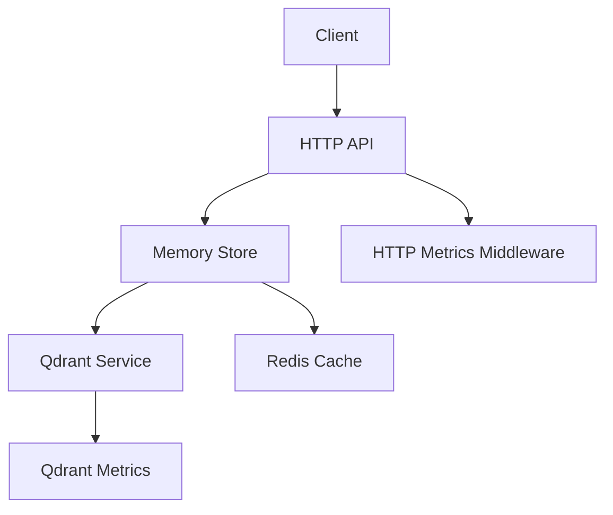
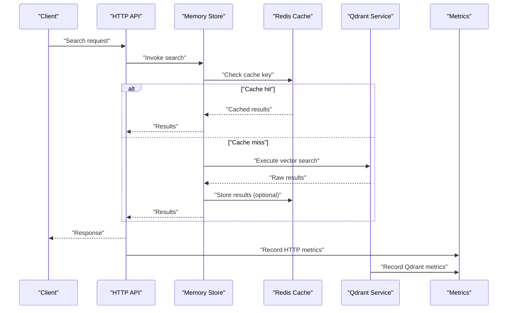
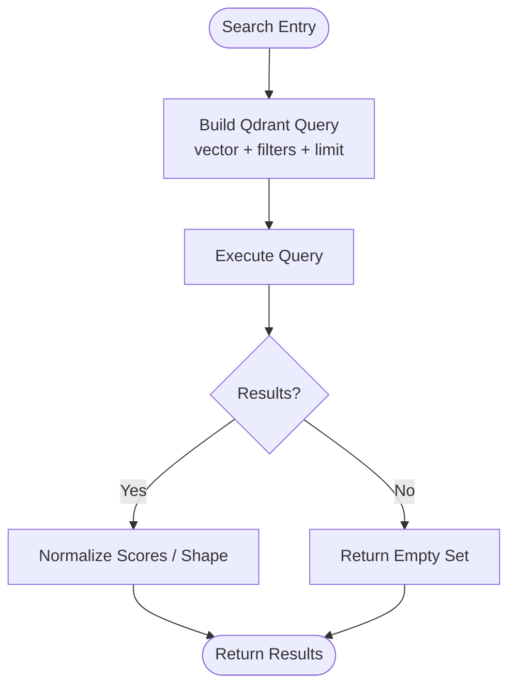
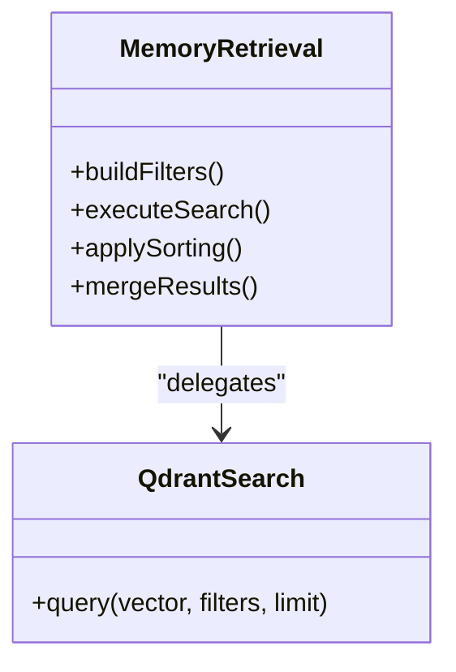
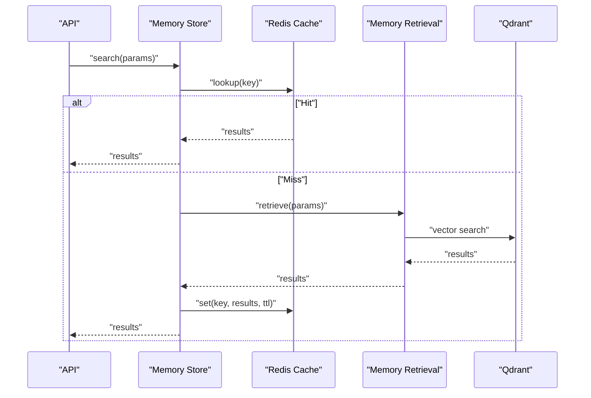
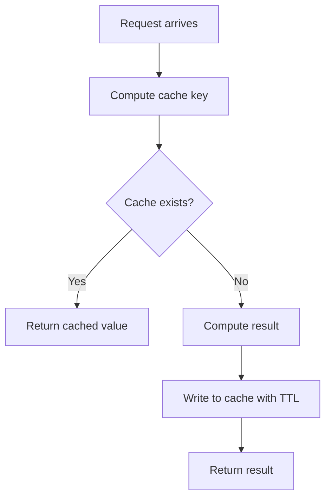
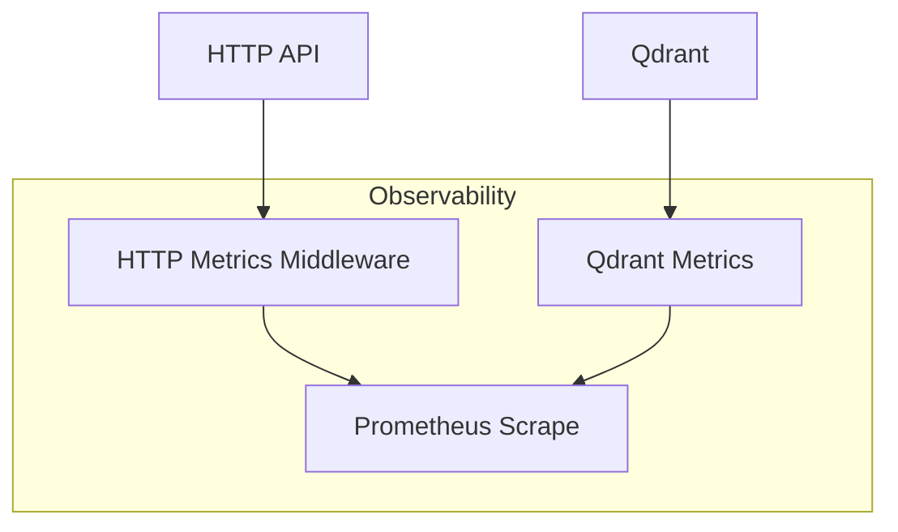
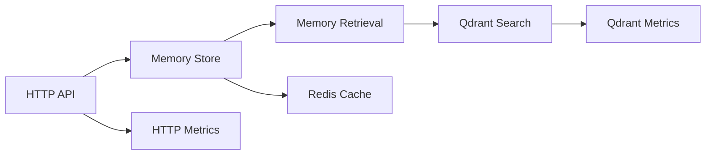

# Search Performance and Optimization

<cite>
**Referenced Files in This Document**
- [search.ts](file://src/services/qdrant/search.ts)
- [memory-retrieval.ts](file://src/services/qdrant/memory-retrieval.ts)
- [store.ts](file://src/services/memory/store.ts)
- [redis-cache.ts](file://src/services/redis-cache.ts)
- [redis.ts](file://src/services/redis.ts)
- [qdrant-metrics.ts](file://src/services/metrics/qdrant-metrics.ts)
- [http-metrics-middleware.ts](file://src/http/http-metrics-middleware.ts)
- [search-query.md](file://docs/architecture/search-query.md)
- [values-tls-redis.yaml](file://helm/kairos-mcp/templates/values-tls-redis.yaml)
</cite>

## Table of Contents
1. [Introduction](#introduction)
2. [Project Structure](#project-structure)
3. [Core Components](#core-components)
4. [Architecture Overview](#architecture-overview)
5. [Detailed Component Analysis](#detailed-component-analysis)
6. [Dependency Analysis](#dependency-analysis)
7. [Performance Considerations](#performance-considerations)
8. [Troubleshooting Guide](#troubleshooting-guide)
9. [Conclusion](#conclusion)
10. [Appendices](#appendices)

## Introduction
This document provides comprehensive guidance for optimizing search performance in the system, focusing on indexing strategies, query optimization patterns, caching mechanisms (including Redis integration), monitoring and profiling, scaling and load balancing, distributed search considerations, and testing/benchmarking practices. It synthesizes implementation details from the codebase to help engineers design efficient, scalable search experiences.

## Project Structure
The search stack centers around a vector database (Qdrant) for semantic retrieval, with optional Redis-backed caching and metrics instrumentation. Key areas include:
- Qdrant search and retrieval logic
- Memory store orchestration and adapter layering
- Redis cache abstraction and configuration
- Metrics collection for Qdrant and HTTP layers
- Architectural documentation for search queries

**Diagram sources**
- [search.ts](file://src/services/qdrant/search.ts)
- [memory-retrieval.ts](file://src/services/qdrant/memory-retrieval.ts)
- [store.ts](file://src/services/memory/store.ts)
- [redis-cache.ts](file://src/services/redis-cache.ts)
- [qdrant-metrics.ts](file://src/services/metrics/qdrant-metrics.ts)
- [http-metrics-middleware.ts](file://src/http/http-metrics-middleware.ts)

**Section sources**
- [search-query.md](file://docs/architecture/search-query.md)

## Core Components
- Qdrant search service: Implements vector similarity search and result shaping.
- Memory retrieval: Orchestrates retrieval across adapters and applies filters/sorting.
- Memory store: Provides higher-level operations that may leverage caching and multiple backends.
- Redis cache: Abstracts caching for search results and hot data.
- Metrics: Expose Qdrant and HTTP metrics for observability.

Key responsibilities:
- Indexing and embedding storage via Qdrant
- Query construction and execution against Qdrant
- Optional caching of frequent or expensive queries using Redis
- Instrumentation for latency, throughput, and error rates

**Section sources**
- [search.ts](file://src/services/qdrant/search.ts)
- [memory-retrieval.ts](file://src/services/qdrant/memory-retrieval.ts)
- [store.ts](file://src/services/memory/store.ts)
- [redis-cache.ts](file://src/services/redis-cache.ts)
- [qdrant-metrics.ts](file://src/services/metrics/qdrant-metrics.ts)
- [http-metrics-middleware.ts](file://src/http/http-metrics-middleware.ts)

## Architecture Overview
The search pipeline typically follows this flow:
- Client issues a search request through the HTTP API.
- The memory store coordinates retrieval, optionally consulting Redis cache.
- If not cached, the request is forwarded to Qdrant for vector similarity search.
- Results are returned to the client and can be cached for future requests.
- Metrics middleware and Qdrant metrics capture performance signals.

**Diagram sources**
- [search.ts](file://src/services/qdrant/search.ts)
- [memory-retrieval.ts](file://src/services/qdrant/memory-retrieval.ts)
- [store.ts](file://src/services/memory/store.ts)
- [redis-cache.ts](file://src/services/redis-cache.ts)
- [qdrant-metrics.ts](file://src/services/metrics/qdrant-metrics.ts)
- [http-metrics-middleware.ts](file://src/http/http-metrics-middleware.ts)

## Detailed Component Analysis

### Qdrant Search Service
Responsibilities:
- Build and execute similarity queries against Qdrant collections.
- Apply filters, limit/top-k, and score normalization where applicable.
- Surface consistent result shapes to the memory store.

Optimization levers:
- Tune top_k and filter predicates to reduce payload size.
- Use precomputed vectors and appropriate dimensionality.
- Prefer sparse filters over heavy post-filtering when possible.

**Diagram sources**
- [search.ts](file://src/services/qdrant/search.ts)

**Section sources**
- [search.ts](file://src/services/qdrant/search.ts)

### Memory Retrieval Layer
Responsibilities:
- Orchestrate retrieval across adapters and apply business rules.
- Combine metadata filtering with vector search.
- Provide fallbacks and merge strategies.

Optimization levers:
- Pre-filter by high-selectivity metadata before vector search.
- Limit fields returned to minimize serialization overhead.
- Batch operations where supported by the backend.

**Diagram sources**
- [memory-retrieval.ts](file://src/services/qdrant/memory-retrieval.ts)
- [search.ts](file://src/services/qdrant/search.ts)

**Section sources**
- [memory-retrieval.ts](file://src/services/qdrant/memory-retrieval.ts)

### Memory Store
Responsibilities:
- High-level API for search, update, and listing.
- Coordinates caching and backend selection.
- Enforces access control and tenant scoping.

Optimization levers:
- Cache keys should incorporate tenant, space, filters, and query fingerprint.
- Use short TTLs for volatile data; longer TTLs for stable indexes.
- Invalidate caches on writes or index updates.

**Diagram sources**
- [store.ts](file://src/services/memory/store.ts)
- [memory-retrieval.ts](file://src/services/qdrant/memory-retrieval.ts)
- [redis-cache.ts](file://src/services/redis-cache.ts)
- [search.ts](file://src/services/qdrant/search.ts)

**Section sources**
- [store.ts](file://src/services/memory/store.ts)

### Redis Integration for Caching
Responsibilities:
- Provide a unified cache interface for search results and hot data.
- Support memoization of expensive computations.
- Enable cache invalidation hooks on mutations.

Best practices:
- Derive deterministic cache keys from normalized inputs.
- Set appropriate TTLs based on data volatility.
- Implement cache warming for known hot queries.
- Monitor hit/miss ratios and adjust TTLs accordingly.

**Diagram sources**
- [redis-cache.ts](file://src/services/redis-cache.ts)

**Section sources**
- [redis-cache.ts](file://src/services/redis-cache.ts)
- [redis.ts](file://src/services/redis.ts)

### Metrics and Observability
Responsibilities:
- Capture HTTP-level latency, throughput, and errors.
- Record Qdrant-specific metrics such as query time and cardinality.
- Expose metrics endpoints for Prometheus scraping.

Guidance:
- Add histograms for search latency percentiles.
- Track cache hit/miss rates and Qdrant call durations.
- Correlate HTTP spans with downstream calls.

**Diagram sources**
- [http-metrics-middleware.ts](file://src/http/http-metrics-middleware.ts)
- [qdrant-metrics.ts](file://src/services/metrics/qdrant-metrics.ts)

**Section sources**
- [http-metrics-middleware.ts](file://src/http/http-metrics-middleware.ts)
- [qdrant-metrics.ts](file://src/services/metrics/qdrant-metrics.ts)

## Dependency Analysis
High-level dependencies:
- HTTP API depends on Memory Store for search operations.
- Memory Store depends on Memory Retrieval and Redis Cache.
- Memory Retrieval depends on Qdrant Search.
- Both HTTP and Qdrant layers emit metrics.

**Diagram sources**
- [search.ts](file://src/services/qdrant/search.ts)
- [memory-retrieval.ts](file://src/services/qdrant/memory-retrieval.ts)
- [store.ts](file://src/services/memory/store.ts)
- [redis-cache.ts](file://src/services/redis-cache.ts)
- [http-metrics-middleware.ts](file://src/http/http-metrics-middleware.ts)
- [qdrant-metrics.ts](file://src/services/metrics/qdrant-metrics.ts)

**Section sources**
- [search.ts](file://src/services/qdrant/search.ts)
- [memory-retrieval.ts](file://src/services/qdrant/memory-retrieval.ts)
- [store.ts](file://src/services/memory/store.ts)
- [redis-cache.ts](file://src/services/redis-cache.ts)
- [http-metrics-middleware.ts](file://src/http/http-metrics-middleware.ts)
- [qdrant-metrics.ts](file://src/services/metrics/qdrant-metrics.ts)

## Performance Considerations
Indexing strategies:
- Choose embedding dimensions and models aligned with accuracy and latency needs.
- Partition collections by tenant or domain to reduce scan scope.
- Maintain up-to-date metadata indices for fast filtering.

Query optimization patterns:
- Narrow filters early to reduce candidate sets.
- Cap top_k and avoid returning large payloads.
- Reuse embeddings and batch insertions during training.

Caching mechanisms:
- Cache frequent queries with stable semantics.
- Use short TTLs for volatile content; longer TTLs for static references.
- Implement cache invalidation on write paths and index rebuilds.

Redis integration:
- Ensure connection pooling and timeouts are tuned.
- Serialize compactly and compress if needed.
- Monitor memory usage and eviction policies.

Monitoring and profiling:
- Track P50/P95/P99 latencies for search endpoints.
- Measure cache hit ratio and Qdrant query duration.
- Alert on error rate spikes and slow queries.

Scaling and load balancing:
- Scale horizontally behind a load balancer; ensure sticky sessions only if required.
- Distribute tenants across shards/collections to balance load.
- Use read replicas or separate instances for heavy analytics workloads.

Distributed search considerations:
- Consistent hashing for cache keys across nodes.
- Avoid cross-node joins; push filtering to the vector DB.
- Handle partial failures gracefully with retries and circuit breakers.

Testing and benchmarking:
- Create synthetic datasets reflecting production distributions.
- Benchmark under realistic concurrency and payload sizes.
- Include cold/warm cache scenarios and failure injection.

[No sources needed since this section provides general guidance]

## Troubleshooting Guide
Common issues and diagnostics:
- Slow queries: Inspect Qdrant metrics and HTTP latency histograms; check filter selectivity and top_k.
- Cache misses: Validate cache key derivation and TTLs; monitor hit/miss ratios.
- Connection errors: Verify Redis connectivity and TLS settings; review timeouts and retry policies.
- Data staleness: Confirm cache invalidation on writes and index updates.

Operational checks:
- Review Prometheus metrics for anomalies.
- Inspect logs for timeout and error traces.
- Validate Helm values for Redis TLS and resource limits.

**Section sources**
- [qdrant-metrics.ts](file://src/services/metrics/qdrant-metrics.ts)
- [http-metrics-middleware.ts](file://src/http/http-metrics-middleware.ts)
- [values-tls-redis.yaml](file://helm/kairos-mcp/templates/values-tls-redis.yaml)

## Conclusion
By combining efficient indexing, targeted query patterns, strategic caching with Redis, and robust observability, the search system can achieve low latency and high throughput at scale. Continuous monitoring, disciplined cache management, and rigorous benchmarking are essential to sustain performance as data and traffic grow.

[No sources needed since this section summarizes without analyzing specific files]

## Appendices
- Reference architecture overview for search queries and flows.

**Section sources**
- [search-query.md](file://docs/architecture/search-query.md)