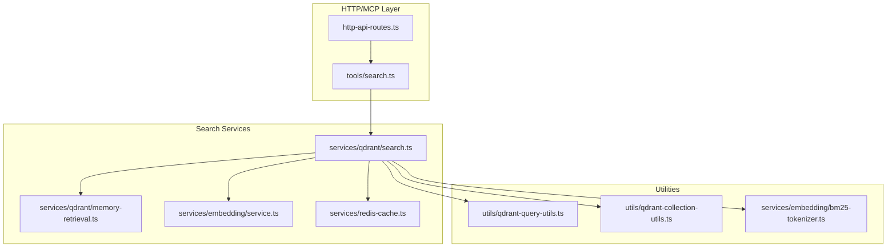
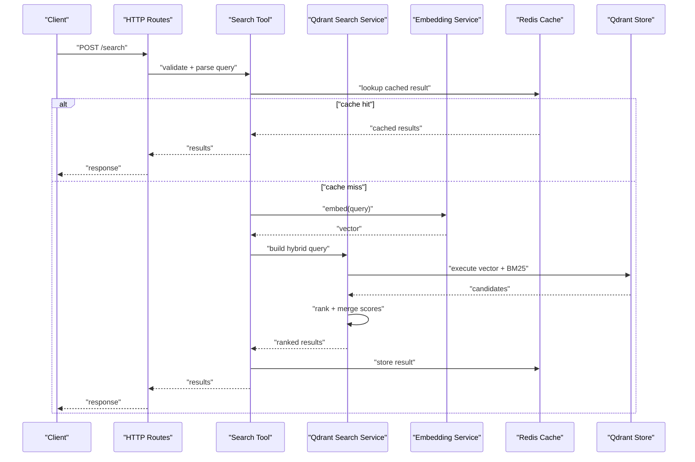
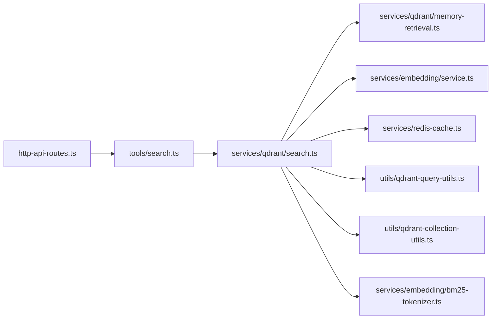

# Search and Retrieval

<cite>
**Referenced Files in This Document**
- [search.ts](file://src/tools/search.ts)
- [search_schema.ts](file://src/tools/search_schema.ts)
- [search_output.ts](file://src/tools/search_output.ts)
- [qdrant-search.ts](file://src/services/qdrant/search.ts)
- [memory-retrieval.ts](file://src/services/qdrant/memory-retrieval.ts)
- [store-title-similarity-search.ts](file://src/services/memory/store-title-similarity-search.ts)
- [activation-search-fields.ts](file://src/services/memory/activation-search-fields.ts)
- [bm25-tokenizer.ts](file://src/services/embedding/bm25-tokenizer.ts)
- [qdrant-query-utils.ts](file://src/utils/qdrant-query-utils.ts)
- [qdrant-collection-utils.ts](file://src/utils/qdrant-collection-utils.ts)
- [embedding-service.ts](file://src/services/embedding/service.ts)
- [embedding-config.ts](file://src/services/embedding/config.ts)
- [redis-cache.ts](file://src/services/redis-cache.ts)
- [http-api-routes.ts](file://src/http/http-api-routes.ts)
- [http-metrics-middleware.ts](file://src/http/http-metrics-middleware.ts)
- [structured-logger.ts](file://src/utils/structured-logger.ts)
- [kairos-search-case1.test.ts](file://tests/integration/kairos-search-case1.test.ts)
- [kairos-search-case2.test.ts](file://tests/integration/kairos-search-case2.test.ts)
- [kairos-search-case3.test.ts](file://tests/integration/kairos-search-case3.test.ts)
- [kairos-search-case4.test.ts](file://tests/integration/kairos-search-case4.test.ts)
- [kairos-search-perfect-matches.test.ts](file://tests/integration/kairos-search-perfect-matches.test.ts)
- [kairos-search-scores.test.ts](file://tests/integration/kairos-search-scores.test.ts)
</cite>

## Table of Contents
1. [Introduction](#introduction)
2. [Project Structure](#project-structure)
3. [Core Components](#core-components)
4. [Architecture Overview](#architecture-overview)
5. [Detailed Component Analysis](#detailed-component-analysis)
6. [Dependency Analysis](#dependency-analysis)
7. [Performance Considerations](#performance-considerations)
8. [Troubleshooting Guide](#troubleshooting-guide)
9. [Conclusion](#conclusion)
10. [Appendices](#appendices)

## Introduction
This document explains the search and retrieval capabilities of the system, focusing on hybrid search that combines semantic similarity with keyword matching. It covers query construction, filtering options, result ranking strategies, title similarity search, activation pattern matching, field-specific search configurations, complex queries, pagination, analytics, logging, debugging, scalability, caching, and real-time index updates.

## Project Structure
Search functionality spans tools (API surface), services (Qdrant vector store, embedding service, Redis cache), utilities (query builders), and tests (behavioral coverage). The main entry points for search are exposed via HTTP routes and MCP tool handlers, which delegate to a Qdrant-backed hybrid search pipeline.

**Diagram sources**
- [http-api-routes.ts](file://src/http/http-api-routes.ts)
- [search.ts](file://src/tools/search.ts)
- [qdrant-search.ts](file://src/services/qdrant/search.ts)
- [memory-retrieval.ts](file://src/services/qdrant/memory-retrieval.ts)
- [embedding-service.ts](file://src/services/embedding/service.ts)
- [redis-cache.ts](file://src/services/redis-cache.ts)
- [qdrant-query-utils.ts](file://src/utils/qdrant-query-utils.ts)
- [qdrant-collection-utils.ts](file://src/utils/qdrant-collection-utils.ts)
- [bm25-tokenizer.ts](file://src/services/embedding/bm25-tokenizer.ts)

**Section sources**
- [http-api-routes.ts](file://src/http/http-api-routes.ts)
- [search.ts](file://src/tools/search.ts)
- [qdrant-search.ts](file://src/services/qdrant/search.ts)
- [memory-retrieval.ts](file://src/services/qdrant/memory-retrieval.ts)
- [embedding-service.ts](file://src/services/embedding/service.ts)
- [redis-cache.ts](file://src/services/redis-cache.ts)
- [qdrant-query-utils.ts](file://src/utils/qdrant-query-utils.ts)
- [qdrant-collection-utils.ts](file://src/utils/qdrant-collection-utils.ts)
- [bm25-tokenizer.ts](file://src/services/embedding/bm25-tokenizer.ts)

## Core Components
- Tools layer: Validates input schemas, constructs queries, and returns standardized outputs.
- Qdrant search service: Orchestrates hybrid search by combining vector similarity and BM25-style keyword filters.
- Embedding service: Converts text into vectors used for semantic similarity.
- Redis cache: Caches embeddings and frequent results to reduce latency.
- Utilities: Build Qdrant filter expressions, manage collections, and tokenize text for BM25.

Key responsibilities:
- Query parsing and validation
- Hybrid scoring (semantic + lexical)
- Filtering by fields and metadata
- Title similarity search
- Activation pattern matching
- Pagination and result shaping
- Analytics and observability

**Section sources**
- [search.ts](file://src/tools/search.ts)
- [search_schema.ts](file://src/tools/search_schema.ts)
- [search_output.ts](file://src/tools/search_output.ts)
- [qdrant-search.ts](file://src/services/qdrant/search.ts)
- [memory-retrieval.ts](file://src/services/qdrant/memory-retrieval.ts)
- [embedding-service.ts](file://src/services/embedding/service.ts)
- [redis-cache.ts](file://src/services/redis-cache.ts)
- [qdrant-query-utils.ts](file://src/utils/qdrant-query-utils.ts)
- [qdrant-collection-utils.ts](file://src/utils/qdrant-collection-utils.ts)
- [bm25-tokenizer.ts](file://src/services/embedding/bm25-tokenizer.ts)

## Architecture Overview
The search pipeline is layered:
- HTTP/MCP endpoints accept user queries.
- Tool handler validates inputs and delegates to the Qdrant search service.
- Qdrant service builds a hybrid query using vector similarity and BM25 filters.
- Embedding service provides vectors for semantic components.
- Redis caches embeddings and optionally cached results.
- Results are ranked, paginated, and returned.

**Diagram sources**
- [http-api-routes.ts](file://src/http/http-api-routes.ts)
- [search.ts](file://src/tools/search.ts)
- [qdrant-search.ts](file://src/services/qdrant/search.ts)
- [memory-retrieval.ts](file://src/services/qdrant/memory-retrieval.ts)
- [embedding-service.ts](file://src/services/embedding/service.ts)
- [redis-cache.ts](file://src/services/redis-cache.ts)

## Detailed Component Analysis

### Hybrid Search Algorithm
Hybrid search merges two signals:
- Semantic similarity from dense vectors (cosine or inner product depending on configuration).
- Keyword relevance from BM25-like tokenization and filters.

Scoring strategy:
- Normalize both signals to comparable ranges.
- Combine using configurable weights (e.g., alpha for semantic, beta for lexical).
- Apply post-filters (e.g., space, type, date range) before final ranking.

Complexity considerations:
- Vector search cost scales with number of candidates and dimensionality.
- BM25 filtering is efficient when indexes exist; otherwise, pre-filtering reduces candidate set.

Optimization opportunities:
- Pre-filter by high-selectivity fields to shrink candidate sets.
- Use approximate nearest neighbor parameters tuned for recall vs. latency trade-offs.
- Cache frequent queries and embeddings.

**Section sources**
- [qdrant-search.ts](file://src/services/qdrant/search.ts)
- [memory-retrieval.ts](file://src/services/qdrant/memory-retrieval.ts)
- [bm25-tokenizer.ts](file://src/services/embedding/bm25-tokenizer.ts)
- [qdrant-query-utils.ts](file://src/utils/qdrant-query-utils.ts)

### Query Construction and Filtering
Query construction supports:
- Free-text query for semantic component.
- Field-specific filters (e.g., space, type, tags, timestamps).
- Exact match filters for categorical fields.
- Range filters for numeric/date fields.
- Boolean combinations (AND/OR/NOT) across conditions.

Filter composition:
- Utilities build Qdrant filter expressions.
- Collections are resolved based on tenant/space context.

Examples of filter patterns:
- Space-scoped search within a specific namespace.
- Type-based filtering (e.g., only artifacts or protocols).
- Date-range filtering for recent content.

**Section sources**
- [qdrant-query-utils.ts](file://src/utils/qdrant-query-utils.ts)
- [qdrant-collection-utils.ts](file://src/utils/qdrant-collection-utils.ts)
- [search_schema.ts](file://src/tools/search_schema.ts)

### Result Ranking Strategies
Ranking combines:
- Semantic score from vector similarity.
- Lexical score from BM25-like token overlap.
- Optional boosts for recency, popularity, or quality metadata.

Normalization and weighting:
- Scores are normalized per request to ensure stability.
- Weights can be configured at runtime or via environment settings.

Post-processing:
- Deduplication by stable IDs.
- Re-ranking with business rules (e.g., boost curated items).

**Section sources**
- [qdrant-search.ts](file://src/services/qdrant/search.ts)
- [memory-retrieval.ts](file://src/services/qdrant/memory-retrieval.ts)

### Title Similarity Search
Title similarity leverages:
- Dedicated title embeddings or tokenized title fields.
- A specialized search path that prioritizes title matches.

Use cases:
- Finding exact or near-exact titles.
- Discovering related titles semantically.

Configuration:
- Toggle title-only mode.
- Adjust title weight relative to body content.

**Section sources**
- [store-title-similarity-search.ts](file://src/services/memory/store-title-similarity-search.ts)

### Activation Pattern Matching
Activation pattern matching enables:
- Searching by structured activation payloads.
- Matching against predefined patterns or templates.

Fields involved:
- Activation payload schema and searchable fields.

Integration:
- Patterns are indexed alongside artifacts.
- Queries can target activation fields directly.

**Section sources**
- [activation-search-fields.ts](file://src/services/memory/activation-search-fields.ts)

### Field-Specific Search Configurations
Field-specific configuration allows:
- Enabling/disabling indexing for certain fields.
- Setting analyzers or tokenizers per field.
- Defining boost factors per field.

Benefits:
- Improved precision by focusing on relevant fields.
- Reduced index size and faster queries.

**Section sources**
- [activation-search-fields.ts](file://src/services/memory/activation-search-fields.ts)
- [qdrant-query-utils.ts](file://src/utils/qdrant-query-utils.ts)

### Complex Search Queries
Patterns supported:
- Multi-field filters combined with free-text.
- Nested boolean logic for advanced scoping.
- Boosts and penalties applied to categories.

Example scenarios:
- Find recent artifacts in a space containing specific keywords and similar semantics.
- Match activation patterns while excluding deprecated types.

Validation:
- Input schemas enforce safe query shapes.
- Server-side guards prevent overly broad queries.

**Section sources**
- [search_schema.ts](file://src/tools/search_schema.ts)
- [qdrant-query-utils.ts](file://src/utils/qdrant-query-utils.ts)
- [kairos-search-case1.test.ts](file://tests/integration/kairos-search-case1.test.ts)
- [kairos-search-case2.test.ts](file://tests/integration/kairos-search-case2.test.ts)
- [kairos-search-case3.test.ts](file://tests/integration/kairos-search-case3.test.ts)
- [kairos-search-case4.test.ts](file://tests/integration/kairos-search-case4.test.ts)

### Pagination
Pagination features:
- Page size and offset controls.
- Cursor-based pagination for consistent ordering.
- Total count estimation for UI feedback.

Implementation notes:
- Qdrant limit/offset or cursor parameters.
- Stable sort keys to avoid drift across pages.

**Section sources**
- [search_output.ts](file://src/tools/search_output.ts)
- [qdrant-search.ts](file://src/services/qdrant/search.ts)

### Search Analytics, Logging, and Debugging
Analytics:
- Metrics middleware records request counts, latencies, and error rates.
- Structured logger emits contextual logs for each search operation.

Debugging:
- Log query shape, filters, and scores.
- Expose metrics for vector vs. BM25 contributions.

Operational visibility:
- Prometheus-compatible metrics endpoint.
- Audit-friendly log entries for compliance.

**Section sources**
- [http-metrics-middleware.ts](file://src/http/http-metrics-middleware.ts)
- [structured-logger.ts](file://src/utils/structured-logger.ts)

### Scalability, Caching, and Real-Time Index Updates
Scalability:
- Horizontal scaling of Qdrant nodes.
- Sharding by collection or tenant.
- Tuning ANN parameters for throughput.

Caching:
- Embedding cache avoids repeated model calls.
- Query result cache for frequent identical requests.
- TTL policies to balance freshness and performance.

Real-time updates:
- Upsert operations maintain index consistency.
- Background jobs re-index changed artifacts.
- Event-driven invalidation via Redis pub/sub.

**Section sources**
- [redis-cache.ts](file://src/services/redis-cache.ts)
- [embedding-service.ts](file://src/services/embedding/service.ts)
- [qdrant-search.ts](file://src/services/qdrant/search.ts)

## Dependency Analysis
The search subsystem depends on:
- HTTP routes for API exposure.
- Tool layer for validation and orchestration.
- Qdrant service for storage and retrieval.
- Embedding service for semantic vectors.
- Redis for caching and pub/sub.
- Utilities for query building and collection management.

**Diagram sources**
- [http-api-routes.ts](file://src/http/http-api-routes.ts)
- [search.ts](file://src/tools/search.ts)
- [qdrant-search.ts](file://src/services/qdrant/search.ts)
- [memory-retrieval.ts](file://src/services/qdrant/memory-retrieval.ts)
- [embedding-service.ts](file://src/services/embedding/service.ts)
- [redis-cache.ts](file://src/services/redis-cache.ts)
- [qdrant-query-utils.ts](file://src/utils/qdrant-query-utils.ts)
- [qdrant-collection-utils.ts](file://src/utils/qdrant-collection-utils.ts)
- [bm25-tokenizer.ts](file://src/services/embedding/bm25-tokenizer.ts)

**Section sources**
- [http-api-routes.ts](file://src/http/http-api-routes.ts)
- [search.ts](file://src/tools/search.ts)
- [qdrant-search.ts](file://src/services/qdrant/search.ts)
- [memory-retrieval.ts](file://src/services/qdrant/memory-retrieval.ts)
- [embedding-service.ts](file://src/services/embedding/service.ts)
- [redis-cache.ts](file://src/services/redis-cache.ts)
- [qdrant-query-utils.ts](file://src/utils/qdrant-query-utils.ts)
- [qdrant-collection-utils.ts](file://src/utils/qdrant-collection-utils.ts)
- [bm25-tokenizer.ts](file://src/services/embedding/bm25-tokenizer.ts)

## Performance Considerations
- Prefer precise filters to reduce candidate sets before vector search.
- Tune ANN parameters (efConstruction, efSearch) for latency/recall balance.
- Cache embeddings and frequent queries aggressively with appropriate TTLs.
- Use title similarity mode for fast, high-precision lookups.
- Monitor metrics to identify hot paths and optimize accordingly.

[No sources needed since this section provides general guidance]

## Troubleshooting Guide
Common issues and resolutions:
- Empty results: Verify filters and space scoping; check if content exists in the targeted collection.
- Slow queries: Reduce page size, tighten filters, enable caching, tune ANN parameters.
- Stale results: Ensure upserts are successful; check background re-index jobs; verify Redis pub/sub invalidation.
- High latency spikes: Inspect embedding service rate limits; consider batching or caching.

Diagnostic steps:
- Enable structured logging for detailed query traces.
- Review metrics for latency percentiles and error rates.
- Validate schema constraints for malformed queries.

**Section sources**
- [structured-logger.ts](file://src/utils/structured-logger.ts)
- [http-metrics-middleware.ts](file://src/http/http-metrics-middleware.ts)
- [search_schema.ts](file://src/tools/search_schema.ts)

## Conclusion
The search system delivers robust hybrid retrieval by combining semantic similarity with keyword matching. It supports advanced filtering, title similarity, activation pattern matching, and field-specific configurations. With caching, scalable storage, and comprehensive observability, it meets production needs for performance and reliability.

[No sources needed since this section summarizes without analyzing specific files]

## Appendices

### Example Scenarios and Test Coverage
Behavioral tests demonstrate:
- Basic and advanced query patterns.
- Perfect match behavior.
- Score computation and ranking.

References:
- [kairos-search-case1.test.ts](file://tests/integration/kairos-search-case1.test.ts)
- [kairos-search-case2.test.ts](file://tests/integration/kairos-search-case2.test.ts)
- [kairos-search-case3.test.ts](file://tests/integration/kairos-search-case3.test.ts)
- [kairos-search-case4.test.ts](file://tests/integration/kairos-search-case4.test.ts)
- [kairos-search-perfect-matches.test.ts](file://tests/integration/kairos-search-perfect-matches.test.ts)
- [kairos-search-scores.test.ts](file://tests/integration/kairos-search-scores.test.ts)

**Section sources**
- [kairos-search-case1.test.ts](file://tests/integration/kairos-search-case1.test.ts)
- [kairos-search-case2.test.ts](file://tests/integration/kairos-search-case2.test.ts)
- [kairos-search-case3.test.ts](file://tests/integration/kairos-search-case3.test.ts)
- [kairos-search-case4.test.ts](file://tests/integration/kairos-search-case4.test.ts)
- [kairos-search-perfect-matches.test.ts](file://tests/integration/kairos-search-perfect-matches.test.ts)
- [kairos-search-scores.test.ts](file://tests/integration/kairos-search-scores.test.ts)