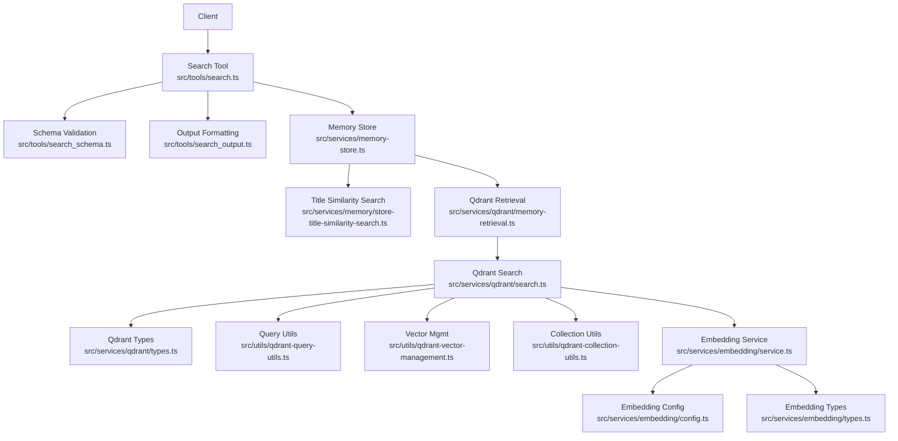
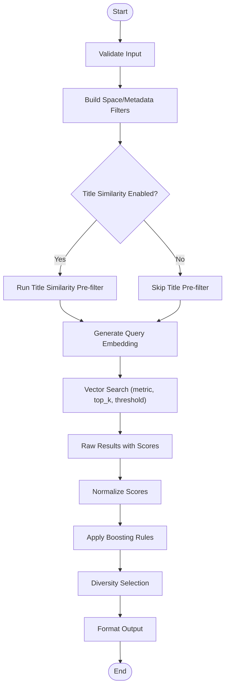
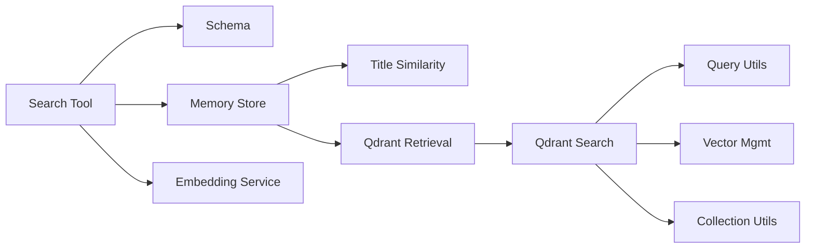

# Similarity Matching and Result Ranking

<cite>
**Referenced Files in This Document**
- [search.ts](file://src/tools/search.ts)
- [search_output.ts](file://src/tools/search_output.ts)
- [search_schema.ts](file://src/tools/search_schema.ts)
- [store-title-similarity-search.ts](file://src/services/memory/store-title-similarity-search.ts)
- [qdrant-memory-retrieval.ts](file://src/services/qdrant/memory-retrieval.ts)
- [qdrant-search.ts](file://src/services/qdrant/search.ts)
- [embedding-service.ts](file://src/services/embedding/service.ts)
- [embedding-config.ts](file://src/services/embedding/config.ts)
- [embedding-types.ts](file://src/services/embedding/types.ts)
- [qdrant-vector-management.ts](file://src/utils/qdrant-vector-management.ts)
- [qdrant-query-utils.ts](file://src/utils/qdrant-query-utils.ts)
- [qdrant-collection-utils.ts](file://src/utils/qdrant-collection-utils.ts)
- [memory-store.ts](file://src/services/memory-store.ts)
- [qdrant-types.ts](file://src/services/qdrant/types.ts)
- [kairos-search-case1.test.ts](file://tests/integration/kairos-search-case1.test.ts)
- [kairos-search-case2.test.ts](file://tests/integration/kairos-search-case2.test.ts)
- [kairos-search-case3.test.ts](file://tests/integration/kairos-search-case3.test.ts)
- [kairos-search-case4.test.ts](file://tests/integration/kairos-search-case4.test.ts)
- [kairos-search-perfect-matches.test.ts](file://tests/integration/kairos-search-perfect-matches.test.ts)
- [kairos-search-scores.test.ts](file://tests/integration/kairos-search-scores.test.ts)
</cite>

## Table of Contents
1. [Introduction](#introduction)
2. [Project Structure](#project-structure)
3. [Core Components](#core-components)
4. [Architecture Overview](#architecture-overview)
5. [Detailed Component Analysis](#detailed-component-analysis)
6. [Dependency Analysis](#dependency-analysis)
7. [Performance Considerations](#performance-considerations)
8. [Troubleshooting Guide](#troubleshooting-guide)
9. [Conclusion](#conclusion)
10. [Appendices](#appendices)

## Introduction
This document explains the similarity matching algorithms and result ranking strategies used by the system. It covers vector similarity calculations, cosine distance metrics, threshold configurations, title similarity search, content-based matching, contextual relevance scoring, custom ranking functions, result boosting, diversity optimization, tuning parameters, performance optimization, and scalability considerations for large datasets.

## Project Structure
The similarity and ranking features are implemented across several layers:
- Tool layer exposes a search API with schema validation and output formatting.
- Memory layer provides title similarity search and memory store orchestration.
- Qdrant integration performs vector retrieval and search operations.
- Embedding service generates vectors and manages provider configuration.
- Utilities provide query building, collection management, and vector utilities.
- Integration tests validate behavior and scoring.



**Diagram sources**
- [search.ts](file://src/tools/search.ts)
- [search_schema.ts](file://src/tools/search_schema.ts)
- [search_output.ts](file://src/tools/search_output.ts)
- [memory-store.ts](file://src/services/memory-store.ts)
- [store-title-similarity-search.ts](file://src/services/memory/store-title-similarity-search.ts)
- [qdrant-memory-retrieval.ts](file://src/services/qdrant/memory-retrieval.ts)
- [qdrant-search.ts](file://src/services/qdrant/search.ts)
- [qdrant-types.ts](file://src/services/qdrant/types.ts)
- [qdrant-query-utils.ts](file://src/utils/qdrant-query-utils.ts)
- [qdrant-vector-management.ts](file://src/utils/qdrant-vector-management.ts)
- [qdrant-collection-utils.ts](file://src/utils/qdrant-collection-utils.ts)
- [embedding-service.ts](file://src/services/embedding/service.ts)
- [embedding-config.ts](file://src/services/embedding/config.ts)
- [embedding-types.ts](file://src/services/embedding/types.ts)

**Section sources**
- [search.ts](file://src/tools/search.ts)
- [search_schema.ts](file://src/tools/search_schema.ts)
- [search_output.ts](file://src/tools/search_output.ts)
- [memory-store.ts](file://src/services/memory-store.ts)
- [store-title-similarity-search.ts](file://src/services/memory/store-title-similarity-search.ts)
- [qdrant-memory-retrieval.ts](file://src/services/qdrant/memory-retrieval.ts)
- [qdrant-search.ts](file://src/services/qdrant/search.ts)
- [embedding-service.ts](file://src/services/embedding/service.ts)
- [embedding-config.ts](file://src/services/embedding/config.ts)
- [embedding-types.ts](file://src/services/embedding/types.ts)
- [qdrant-query-utils.ts](file://src/utils/qdrant-query-utils.ts)
- [qdrant-vector-management.ts](file://src/utils/qdrant-vector-management.ts)
- [qdrant-collection-utils.ts](file://src/utils/qdrant-collection-utils.ts)

## Core Components
- Search tool: Accepts user queries, validates inputs, constructs filters, and orchestrates retrieval and ranking.
- Title similarity search: Implements lexical or fuzzy matching on titles to boost or pre-filter results.
- Qdrant retrieval and search: Executes vector similarity searches using configured distance metrics and thresholds.
- Embedding service: Generates embeddings for queries and documents, managing provider-specific settings.
- Utilities: Build Qdrant payloads, manage collections, and handle vector operations.

Key responsibilities:
- Input normalization and filtering (space, metadata).
- Query embedding generation.
- Vector similarity search with configurable distance metric and top-k.
- Post-processing: score normalization, boosting, diversity selection.
- Output formatting with confidence and metadata.

**Section sources**
- [search.ts](file://src/tools/search.ts)
- [search_output.ts](file://src/tools/search_output.ts)
- [store-title-similarity-search.ts](file://src/services/memory/store-title-similarity-search.ts)
- [qdrant-memory-retrieval.ts](file://src/services/qdrant/memory-retrieval.ts)
- [qdrant-search.ts](file://src/services/qdrant/search.ts)
- [embedding-service.ts](file://src/services/embedding/service.ts)
- [embedding-config.ts](file://src/services/embedding/config.ts)
- [embedding-types.ts](file://src/services/embedding/types.ts)
- [qdrant-query-utils.ts](file://src/utils/qdrant-query-utils.ts)
- [qdrant-vector-management.ts](file://src/utils/qdrant-vector-management.ts)
- [qdrant-collection-utils.ts](file://src/utils/qdrant-collection-utils.ts)

## Architecture Overview
The search pipeline integrates multiple stages:
- Request handling and schema validation.
- Optional title similarity pre-filtering.
- Embedding generation for the query.
- Vector similarity search against Qdrant with metric and threshold configuration.
- Post-processing for ranking, boosting, and diversity.
- Response formatting with scores and metadata.

```mermaid
sequenceDiagram
participant Client as "Client"
participant Tool as "Search Tool"
participant Schema as "Schema Validator"
participant Mem as "Memory Store"
participant Title as "Title Similarity"
participant Emb as "Embedding Service"
participant QRet as "Qdrant Retrieval"
participant QSearch as "Qdrant Search"
participant Out as "Output Formatter"
Client->>Tool : "search(query, options)"
Tool->>Schema : "validate(input)"
Schema-->>Tool : "validated params"
Tool->>Mem : "build filters (space, metadata)"
Tool->>Title : "title similarity pre-filter?"
Title-->>Tool : "candidate IDs"
Tool->>Emb : "embed(query)"
Emb-->>Tool : "query vector"
Tool->>QRet : "prepare retrieval request"
QRet->>QSearch : "vector search(metric, top_k, threshold)"
QSearch-->>QRet : "results with scores"
QRet-->>Tool : "ranked candidates"
Tool->>Tool : "boost + diversity selection"
Tool->>Out : "format response"
Out-->>Client : "results with scores and metadata"
```

**Diagram sources**
- [search.ts](file://src/tools/search.ts)
- [search_schema.ts](file://src/tools/search_schema.ts)
- [search_output.ts](file://src/tools/search_output.ts)
- [store-title-similarity-search.ts](file://src/services/memory/store-title-similarity-search.ts)
- [qdrant-memory-retrieval.ts](file://src/services/qdrant/memory-retrieval.ts)
- [qdrant-search.ts](file://src/services/qdrant/search.ts)
- [embedding-service.ts](file://src/services/embedding/service.ts)

## Detailed Component Analysis

### Search Tool and Schema
Responsibilities:
- Validate input fields such as query text, space filter, metadata filters, top_k, and threshold.
- Compose filters for spaces and metadata.
- Orchestrate title similarity pre-filtering if enabled.
- Generate embeddings and call Qdrant retrieval.
- Apply post-processing: boosting and diversity selection.
- Format final output with normalized scores and metadata.

Key behaviors:
- Threshold gating: items below threshold are excluded from final results.
- Top-k control: limits number of returned candidates.
- Space scoping: restricts search to specific spaces.
- Metadata filtering: narrows results based on key-value pairs.

**Section sources**
- [search.ts](file://src/tools/search.ts)
- [search_schema.ts](file://src/tools/search_schema.ts)
- [search_output.ts](file://src/tools/search_output.ts)

### Title Similarity Search
Purpose:
- Provide fast lexical or fuzzy matching on titles to pre-filter or boost candidates before vector search.

Behavior:
- Matches query tokens against stored titles.
- Produces candidate IDs that can be passed to vector search or used to boost scores.
- Can be toggled via configuration or request options.

Use cases:
- Improving recall when titles contain exact keywords.
- Reducing search space for large datasets.

**Section sources**
- [store-title-similarity-search.ts](file://src/services/memory/store-title-similarity-search.ts)

### Qdrant Retrieval and Search
Responsibilities:
- Prepare retrieval requests with payload filters and vector queries.
- Execute vector similarity search with specified metric and top_k.
- Enforce threshold gating at retrieval time.
- Return scored results for further processing.

Configuration:
- Distance metric selection (e.g., cosine, dot product).
- Top-k parameter controlling number of candidates.
- Threshold parameter to filter low-confidence matches.

Integration points:
- Uses query utils to build Qdrant payloads.
- Leverages vector management utilities for vector operations.
- Relies on collection utilities for collection setup and management.

**Section sources**
- [qdrant-memory-retrieval.ts](file://src/services/qdrant/memory-retrieval.ts)
- [qdrant-search.ts](file://src/services/qdrant/search.ts)
- [qdrant-types.ts](file://src/services/qdrant/types.ts)
- [qdrant-query-utils.ts](file://src/utils/qdrant-query-utils.ts)
- [qdrant-vector-management.ts](file://src/utils/qdrant-vector-management.ts)
- [qdrant-collection-utils.ts](file://src/utils/qdrant-collection-utils.ts)

### Embedding Service
Responsibilities:
- Generate embeddings for queries and documents.
- Manage provider configuration and types.
- Handle provider-specific options and error conditions.

Tuning parameters:
- Provider selection and model choice.
- Batch size and concurrency limits.
- Normalization strategy for vectors.

**Section sources**
- [embedding-service.ts](file://src/services/embedding/service.ts)
- [embedding-config.ts](file://src/services/embedding/config.ts)
- [embedding-types.ts](file://src/services/embedding/types.ts)

### Memory Store
Responsibilities:
- Coordinate between title similarity search and Qdrant retrieval.
- Apply space and metadata filters consistently.
- Ensure consistent ID mapping and payload structure.

**Section sources**
- [memory-store.ts](file://src/services/memory-store.ts)

### Ranking, Boosting, and Diversity
Ranking:
- Normalize raw scores to a common scale.
- Combine vector similarity scores with title similarity boosts.
- Apply metadata-based boosting rules.

Boosting:
- Increase scores for exact title matches or high-priority metadata.
- Weight recent or authoritative artifacts higher.

Diversity:
- Select diverse results by penalizing duplicates or near-duplicates.
- Use clustering or coverage heuristics to spread across topics.

Implementation notes:
- Custom ranking functions can be composed from base scores and boosting factors.
- Diversity selection runs after boosting to maintain relevance while improving variety.

**Section sources**
- [search.ts](file://src/tools/search.ts)
- [search_output.ts](file://src/tools/search_output.ts)

### Algorithmic Flow


**Diagram sources**
- [search.ts](file://src/tools/search.ts)
- [store-title-similarity-search.ts](file://src/services/memory/store-title-similarity-search.ts)
- [qdrant-memory-retrieval.ts](file://src/services/qdrant/memory-retrieval.ts)
- [qdrant-search.ts](file://src/services/qdrant/search.ts)
- [embedding-service.ts](file://src/services/embedding/service.ts)

## Dependency Analysis
The components interact through well-defined interfaces:
- The search tool depends on schema validation, memory store, and output formatting.
- Memory store coordinates title similarity and Qdrant retrieval.
- Qdrant retrieval uses search, query utils, vector management, and collection utils.
- Embedding service is independent but required for vector generation.



**Diagram sources**
- [search.ts](file://src/tools/search.ts)
- [search_schema.ts](file://src/tools/search_schema.ts)
- [memory-store.ts](file://src/services/memory-store.ts)
- [store-title-similarity-search.ts](file://src/services/memory/store-title-similarity-search.ts)
- [qdrant-memory-retrieval.ts](file://src/services/qdrant/memory-retrieval.ts)
- [qdrant-search.ts](file://src/services/qdrant/search.ts)
- [qdrant-query-utils.ts](file://src/utils/qdrant-query-utils.ts)
- [qdrant-vector-management.ts](file://src/utils/qdrant-vector-management.ts)
- [qdrant-collection-utils.ts](file://src/utils/qdrant-collection-utils.ts)
- [embedding-service.ts](file://src/services/embedding/service.ts)

**Section sources**
- [search.ts](file://src/tools/search.ts)
- [memory-store.ts](file://src/services/memory-store.ts)
- [qdrant-search.ts](file://src/services/qdrant/search.ts)
- [embedding-service.ts](file://src/services/embedding/service.ts)

## Performance Considerations
- Metric selection: Cosine distance is suitable for normalized vectors; dot product may be faster if vectors are already normalized.
- Top-k tuning: Lower top-k reduces latency but may miss relevant items; balance with recall needs.
- Threshold gating: Higher thresholds reduce noise but risk missing borderline matches.
- Title similarity pre-filtering: Effective for keyword-heavy queries; consider enabling only when beneficial.
- Embedding batching: Increase batch sizes where supported to improve throughput.
- Concurrency limits: Control parallelism to avoid resource exhaustion under load.
- Indexing and collections: Ensure proper collection configuration and periodic maintenance for large datasets.
- Caching: Cache frequent query embeddings and popular results to reduce latency.

[No sources needed since this section provides general guidance]

## Troubleshooting Guide
Common issues and diagnostics:
- Low recall: Adjust top-k upward, lower threshold, enable title similarity pre-filtering.
- High false positives: Raise threshold, refine metadata filters, tune boosting weights.
- Slow responses: Reduce top-k, optimize embedding batch size, enable caching, review concurrency limits.
- Inconsistent scores: Verify normalization strategy and metric consistency across providers.
- Collection errors: Check collection existence and configuration via collection utilities.

Validation references:
- Integration tests cover search scenarios, perfect matches, and score behaviors.

**Section sources**
- [kairos-search-case1.test.ts](file://tests/integration/kairos-search-case1.test.ts)
- [kairos-search-case2.test.ts](file://tests/integration/kairos-search-case2.test.ts)
- [kairos-search-case3.test.ts](file://tests/integration/kairos-search-case3.test.ts)
- [kairos-search-case4.test.ts](file://tests/integration/kairos-search-case4.test.ts)
- [kairos-search-perfect-matches.test.ts](file://tests/integration/kairos-search-perfect-matches.test.ts)
- [kairos-search-scores.test.ts](file://tests/integration/kairos-search-scores.test.ts)

## Conclusion
The similarity matching and ranking system combines vector similarity search with title similarity pre-filtering, flexible boosting, and diversity selection. By tuning metric selection, top-k, threshold, and boosting rules, operators can achieve balanced precision and recall. Performance and scalability are addressed through batching, concurrency controls, and collection management. Integration tests validate core behaviors and scoring expectations.

[No sources needed since this section summarizes without analyzing specific files]

## Appendices

### Similarity Tuning Parameters
- Distance metric: Choose cosine or dot product based on vector normalization.
- Top-k: Controls number of candidates retrieved.
- Threshold: Minimum similarity score to include results.
- Title similarity: Enable/disable pre-filtering and configure match sensitivity.
- Boosting weights: Adjust influence of title matches and metadata signals.
- Diversity strength: Control penalty for similar items during selection.

[No sources needed since this section provides general guidance]

### Example Scenarios
- Keyword-focused queries: Enable title similarity pre-filtering and moderate boosting for exact title matches.
- Semantic queries: Rely primarily on vector similarity with tuned top-k and threshold.
- Mixed intent: Combine both title similarity and vector search, then apply diversity selection.

[No sources needed since this section provides general guidance]